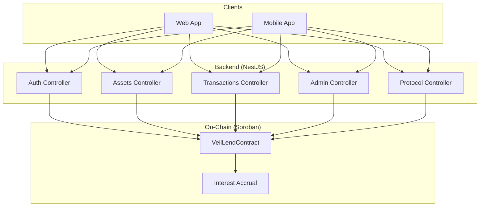
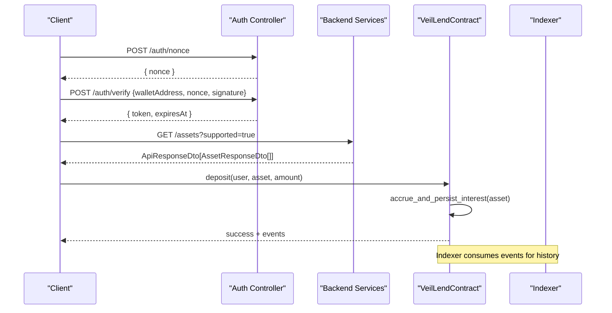
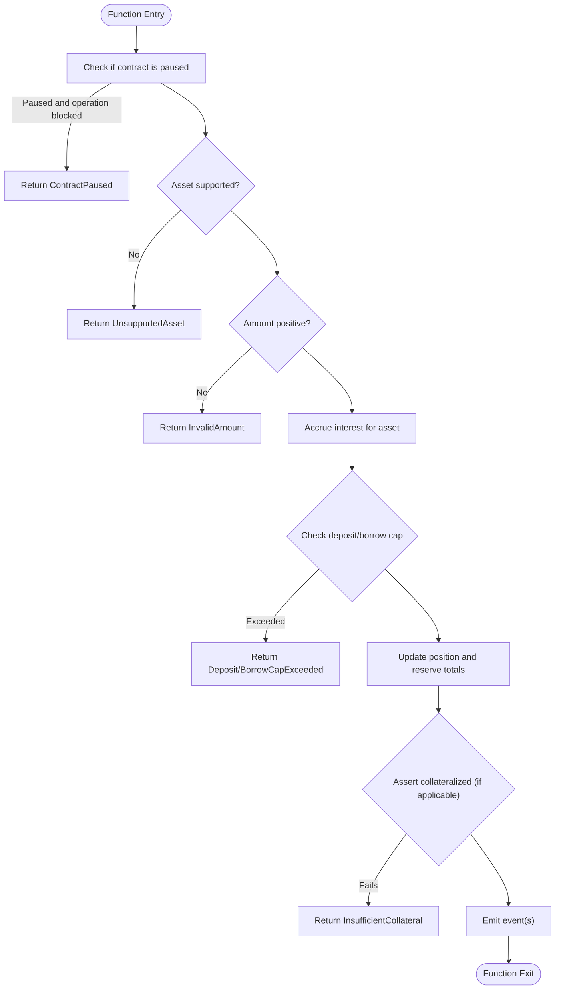
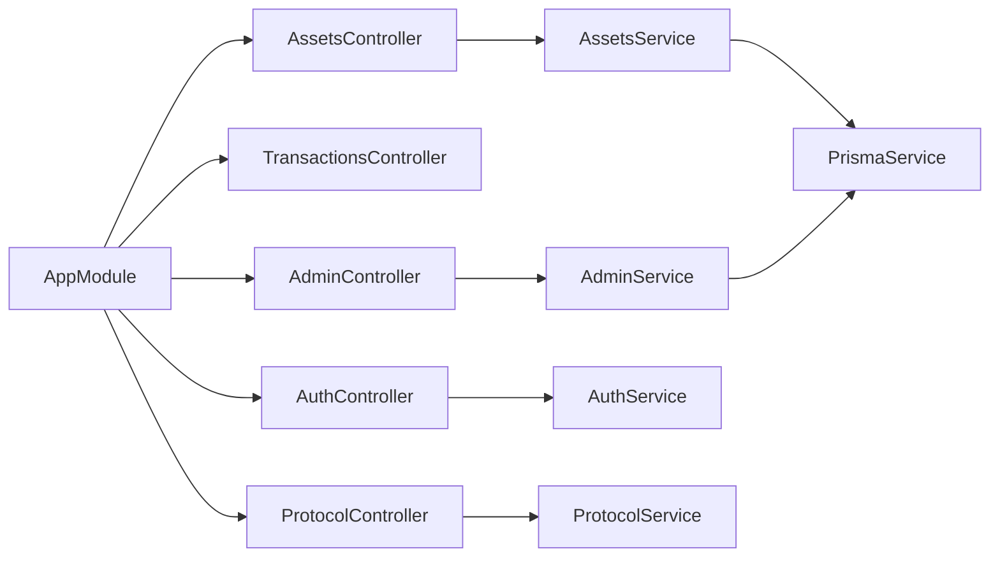

# API Reference

<cite>
**Referenced Files in This Document**
- [lib.rs](file://veilend-soroban/src/lib.rs)
- [interest.rs](file://veilend-soroban/src/interest.rs)
- [app.module.ts](file://veilend-backend/src/app.module.ts)
- [assets.controller.ts](file://veilend-backend/src/assets/assets.controller.ts)
- [assets.service.ts](file://veilend-backend/src/assets/assets.service.ts)
- [asset-response.dto.ts](file://veilend-backend/src/assets/dto/asset-response.dto.ts)
- [transactions.controller.ts](file://veilend-backend/src/transactions/transactions.controller.ts)
- [admin.controller.ts](file://veilend-backend/src/admin/admin.controller.ts)
- [admin.service.ts](file://veilend-backend/src/admin/admin.service.ts)
- [configure-asset.dto.ts](file://veilend-backend/src/admin/dto/configure-asset.dto.ts)
- [protocol.controller.ts](file://veilend-backend/src/protocol/protocol.controller.ts)
- [auth.controller.ts](file://veilend-backend/src/auth/auth.controller.ts)
- [verify-wallet.dto.ts](file://veilend-backend/src/auth/dto/verify-wallet.dto.ts)
- [api-response.dto.ts](file://veilend-backend/src/common/dto/api-response.dto.ts)
</cite>

## Table of Contents
1. Introduction
2. Project Structure
3. Core Components
4. Architecture Overview
5. Detailed Component Analysis
6. Dependency Analysis
7. Performance Considerations
8. Troubleshooting Guide
9. Conclusion
10. Appendices

## Introduction
This document provides a comprehensive API reference for the VeilLend protocol, covering:
- Smart contract interfaces on Soroban (deposit, borrow, repay, withdraw, and configuration/query endpoints)
- REST API endpoints for asset management, transaction queries, authentication, and protocol configuration
- Error handling strategies, rate limiting, versioning, and migration notes
- Client implementation guidelines, performance tips, debugging tools, monitoring approaches, and integration patterns

VeilLend is a lending protocol built on Stellar/Soroban with a NestJS backend that exposes REST APIs and interacts with on-chain state via an indexer and Stellar services.

## Project Structure
The repository contains:
- veilend-soroban: On-chain Soroban smart contracts implementing core lending logic, interest accrual, and admin controls
- veilend-backend: NestJS application exposing REST APIs for assets, transactions, admin operations, protocol config, and wallet-based authentication
- veilend-web and veilend-mobile: Frontend applications consuming the REST APIs and interacting with wallets

**Diagram sources**
- [app.module.ts:28-60](file://veilend-backend/src/app.module.ts#L28-L60)
- [assets.controller.ts:16-57](file://veilend-backend/src/assets/assets.controller.ts#L16-L57)
- [transactions.controller.ts:5-15](file://veilend-backend/src/transactions/transactions.controller.ts#L5-L15)
- [admin.controller.ts:20-55](file://veilend-backend/src/admin/admin.controller.ts#L20-L55)
- [protocol.controller.ts:9-31](file://veilend-backend/src/protocol/protocol.controller.ts#L9-L31)
- [auth.controller.ts:14-58](file://veilend-backend/src/auth/auth.controller.ts#L14-L58)
- [lib.rs:226-719](file://veilend-soroban/src/lib.rs#L226-L719)
- [interest.rs:51-87](file://veilend-soroban/src/interest.rs#L51-L87)

**Section sources**
- [app.module.ts:28-60](file://veilend-backend/src/app.module.ts#L28-L60)

## Core Components
- VeilLendContract (Soroban): Implements deposit, borrow, repay, withdraw, caps, oracle price, pause/unpause, and read-only queries. Emits events for all mutations and reserve updates.
- Interest Accrual (Soroban): Time-based accrual using supply/borrow indexes; idempotent and applied before mutating operations to ensure accurate caps and totals.
- Backend REST APIs:
  - Authentication: nonce generation, signature verification, session retrieval, logout
  - Assets: list/filter supported assets, get single asset by code or contractId
  - Transactions: query transactions by wallet address
  - Admin: manage admins, configure assets, set oracle prices, set min collateral ratio
  - Protocol: public configuration endpoint

**Section sources**
- [lib.rs:226-719](file://veilend-soroban/src/lib.rs#L226-L719)
- [interest.rs:51-87](file://veilend-soroban/src/interest.rs#L51-L87)
- [auth.controller.ts:20-58](file://veilend-backend/src/auth/auth.controller.ts#L20-L58)
- [assets.controller.ts:20-57](file://veilend-backend/src/assets/assets.controller.ts#L20-L57)
- [transactions.controller.ts:9-15](file://veilend-backend/src/transactions/transactions.controller.ts#L9-L15)
- [admin.controller.ts:26-55](file://veilend-backend/src/admin/admin.controller.ts#L26-L55)
- [protocol.controller.ts:13-31](file://veilend-backend/src/protocol/protocol.controller.ts#L13-L31)

## Architecture Overview
The system integrates on-chain state with off-chain services:
- Clients authenticate via wallet signatures and receive JWT sessions
- Read endpoints cache frequently accessed data (assets, protocol config)
- Mutating operations call into Soroban contracts which enforce business rules, caps, collateralization, and interest accrual
- Events emitted by contracts can be indexed by the backend’s indexer for historical queries

**Diagram sources**
- [auth.controller.ts:20-36](file://veilend-backend/src/auth/auth.controller.ts#L20-L36)
- [assets.controller.ts:24-39](file://veilend-backend/src/assets/assets.controller.ts#L24-L39)
- [lib.rs:483-519](file://veilend-soroban/src/lib.rs#L483-L519)
- [lib.rs:782-800](file://veilend-soroban/src/lib.rs#L782-L800)

## Detailed Component Analysis

### Smart Contract Interfaces (Soroban)
Core public functions:
- deposit(user, asset, amount)
  - Validates: not paused, supported asset, positive amount, user auth
  - Accrues interest, checks deposit cap, updates position and reserve totals, emits DepositEvent and AssetReserveUpdated
  - Errors: Unauthorized, UnsupportedAsset, InvalidAmount, ContractPaused, DepositCapExceeded, InsufficientReserve
- borrow(user, asset, amount)
  - Validates: not paused, supported asset, positive amount, user auth
  - Accrues interest, checks borrow cap, ensures sufficient reserve, updates position/reserve, asserts collateralization, emits BorrowEvent and AssetReserveUpdated
  - Errors: Unauthorized, UnsupportedAsset, InvalidAmount, ContractPaused, BorrowCapExceeded, InsufficientReserve, InsufficientCollateral
- repay(user, asset, amount)
  - Validates: supported asset, positive amount, user auth
  - Realizes accrued interest, ensures amount <= borrowed, updates position/reserve totals, emits RepayEvent and AssetReserveUpdated
  - Errors: UnsupportedAsset, InvalidAmount, RepayTooLarge
- withdraw(user, asset, amount)
  - Validates: supported asset, positive amount, user auth
  - Realizes accrued interest, ensures amount <= deposited and <= reserve total, updates position/reserve totals, asserts collateralization, emits WithdrawEvent and AssetReserveUpdated
  - Errors: UnsupportedAsset, InvalidAmount, InsufficientDeposit, InsufficientReserve, InsufficientCollateral
- Configuration and queries:
  - configure_asset(admin, asset, supported)
  - update_asset_caps(admin, asset, deposit_cap, borrow_cap), get_asset_caps(asset)
  - set_oracle_price(admin, asset, price), get_oracle_price(asset)
  - set_paused(admin, paused), is_paused()
  - get_total_deposited(asset), get_total_borrowed(asset)
  - get_position(user, asset), get_asset_reserve(asset), get_interest_state(asset), accrue_interest(asset)
  - record_protocol_fee(admin, asset, amount)
  - contract_metadata(), admin(), min_collateral_ratio_bps()

Data models:
- Position(deposited, borrowed, supply_index_snapshot, borrow_index_snapshot)
- InterestState(supply_index, borrow_index, last_accrual_timestamp)
- AssetCaps(deposit_cap, borrow_cap)
- AssetReserve(total_balance, protocol_fees)

Events:
- AssetConfigured, DepositEvent, BorrowEvent, RepayEvent, WithdrawEvent, CapsUpdated, CircuitBreakerEvent, AssetReserveUpdated

Versioning:
- CONTRACT_VERSION and STORAGE_SCHEMA_VERSION constants exposed via contract_metadata()

Error codes:
- VeilLendError enum includes AlreadyInitialized, Unauthorized, UnsupportedAsset, InvalidAmount, InsufficientCollateral, InsufficientDeposit, RepayTooLarge, InvalidCollateralRatio, NotInitialized, ZeroAmount, OraclePriceMissing, ContractPaused, DepositCapExceeded, BorrowCapExceeded, InvalidCap, CircuitBreakerTriggered, InsufficientReserve

**Diagram sources**
- [lib.rs:483-519](file://veilend-soroban/src/lib.rs#L483-L519)
- [lib.rs:521-561](file://veilend-soroban/src/lib.rs#L521-L561)
- [lib.rs:563-598](file://veilend-soroban/src/lib.rs#L563-L598)
- [lib.rs:600-639](file://veilend-soroban/src/lib.rs#L600-L639)

**Section sources**
- [lib.rs:107-145](file://veilend-soroban/src/lib.rs#L107-L145)
- [lib.rs:147-224](file://veilend-soroban/src/lib.rs#L147-L224)
- [lib.rs:226-719](file://veilend-soroban/src/lib.rs#L226-L719)
- [interest.rs:51-87](file://veilend-soroban/src/interest.rs#L51-L87)

### REST API: Authentication
Endpoints:
- POST /auth/nonce
  - Request body: { walletAddress: string }
  - Response: { nonce: string }
- POST /auth/verify
  - Request body: { walletAddress: string, nonce: string, signature: string }
  - Response: JWT session payload (token and metadata)
- GET /auth/session
  - Requires: Bearer JWT
  - Response: { walletAddress: string, sessionId: string, expiresAt: string }
- POST /auth/logout
  - Requires: Bearer JWT
  - Response: { revoked: boolean }

Authentication flow:
- Client requests a nonce for the wallet address
- Client signs the nonce and submits it for verification
- Server issues a JWT session used for protected routes

Rate limiting:
- Global throttling configured via ThrottlerModule with configurable TTL and limit

**Section sources**
- [auth.controller.ts:20-58](file://veilend-backend/src/auth/auth.controller.ts#L20-L58)
- [verify-wallet.dto.ts:1-13](file://veilend-backend/src/auth/dto/verify-wallet.dto.ts#L1-L13)
- [app.module.ts:42-50](file://veilend-backend/src/app.module.ts#L42-L50)

### REST API: Assets
Endpoints:
- GET /assets
  - Query params: supported=true/false (optional)
  - Response: ApiResponseDto<AssetResponseDto[]>
  - Caching: Cache-Control public, max-age=60
- GET /assets/:id
  - Path param: id (UUID, code, or contractId)
  - Response: ApiResponseDto<AssetResponseDto>
  - Caching: Cache-Control public, max-age=60

Schema:
- AssetResponseDto fields: code, symbol, name, decimals, issuer, contractId, logoUrl, isNative, isSupported

Implementation notes:
- In-memory cache with TTL reduces DB load for read-heavy scenarios
- Supports filtering supported assets

**Section sources**
- [assets.controller.ts:20-57](file://veilend-backend/src/assets/assets.controller.ts#L20-L57)
- [assets.service.ts:30-81](file://veilend-backend/src/assets/assets.service.ts#L30-L81)
- [asset-response.dto.ts:7-34](file://veilend-backend/src/assets/dto/asset-response.dto.ts#L7-L34)

### REST API: Transactions
Endpoint:
- GET /transactions/:walletAddress
  - Path param: walletAddress
  - Response: ServiceResponse<TransactionRecord[]>

Notes:
- Returns transaction records associated with the specified wallet address

**Section sources**
- [transactions.controller.ts:9-15](file://veilend-backend/src/transactions/transactions.controller.ts#L9-L15)

### REST API: Admin
Endpoints (protected by JWT and AdminGuard):
- POST /admin/admins
  - Request body: { walletAddress: string }
  - Adds an admin
- DELETE /admin/admins/:walletAddress
  - Removes an admin
- GET /admin/admins
  - Lists admins
- POST /admin/assets/configure
  - Request body: { assetContractId: string, supported: boolean }
  - Configures asset support status
- POST /admin/assets/oracle-price
  - Request body: { asset: string, price: number }
  - Sets oracle price for an asset
- POST /admin/protocol/min-collateral-ratio
  - Request body: { ratioBps: number }
  - Sets minimum collateral ratio

Validation:
- ValidationPipe enforces whitelist validation for DTOs

**Section sources**
- [admin.controller.ts:26-55](file://veilend-backend/src/admin/admin.controller.ts#L26-L55)
- [admin.service.ts:12-55](file://veilend-backend/src/admin/admin.service.ts#L12-L55)
- [configure-asset.dto.ts:3-9](file://veilend-backend/src/admin/dto/configure-asset.dto.ts#L3-L9)

### REST API: Protocol Configuration
Endpoint:
- GET /protocol/config
  - Public endpoint (no authentication)
  - Response: ApiResponseDto<ProtocolConfigResponseDto>
  - Caching: Cache-Control public, max-age=120

Notes:
- Provides network settings, risk parameters, and per-asset risk configuration

**Section sources**
- [protocol.controller.ts:13-31](file://veilend-backend/src/protocol/protocol.controller.ts#L13-L31)

### Common Response Schema
All responses follow a consistent structure:
- success: boolean
- data?: T
- error?: { code: string, message: string, details?: unknown }
- meta?: unknown

Utility methods:
- ApiResponseDto.success(data, meta?)
- ApiResponseDto.fail(code, message, details?)

**Section sources**
- [api-response.dto.ts:1-38](file://veilend-backend/src/common/dto/api-response.dto.ts#L1-L38)

## Dependency Analysis
Key dependencies and relationships:
- NestJS AppModule wires controllers, modules, guards, interceptors, and global throttling
- AssetsController depends on AssetsService which uses Prisma and in-memory caching
- AdminController depends on AdminService for admin and configuration operations
- AuthController handles wallet-based authentication and JWT sessions
- ProtocolController serves public configuration
- On-chain interactions are orchestrated through backend services and indexers

**Diagram sources**
- [app.module.ts:28-60](file://veilend-backend/src/app.module.ts#L28-L60)
- [assets.controller.ts:16-57](file://veilend-backend/src/assets/assets.controller.ts#L16-L57)
- [admin.controller.ts:20-55](file://veilend-backend/src/admin/admin.controller.ts#L20-L55)
- [auth.controller.ts:14-58](file://veilend-backend/src/auth/auth.controller.ts#L14-L58)
- [protocol.controller.ts:9-31](file://veilend-backend/src/protocol/protocol.controller.ts#L9-L31)

**Section sources**
- [app.module.ts:28-60](file://veilend-backend/src/app.module.ts#L28-L60)

## Performance Considerations
- Caching:
  - Assets endpoints use Cache-Control headers and in-memory caching with TTL to reduce database load
  - Protocol config endpoint caches with longer TTL for stability
- Rate Limiting:
  - Global throttling via ThrottlerModule protects endpoints from abuse
- Interest Accrual:
  - On-chain accrual is idempotent and applied before mutations to ensure accurate caps and totals without redundant computation
- Database Access:
  - AssetsService batches reads and filters supported assets efficiently

Recommendations:
- Use supported=true filter when listing assets to minimize payload size
- Respect Cache-Control headers for client-side caching
- Implement retry logic with exponential backoff for transient errors
- Monitor throttle limits and adjust TTL/limit based on traffic patterns

[No sources needed since this section provides general guidance]

## Troubleshooting Guide
Common errors and handling:
- Authentication failures:
  - Ensure correct nonce usage and valid signature
  - Validate JWT expiration and re-authenticate if necessary
- Asset not found:
  - Verify asset code or contractId; check supported flag
- Insufficient funds or reserves:
  - For deposit/withdraw: ensure sufficient deposited balance and reserve availability
  - For borrow: ensure sufficient reserve and collateralization
- Caps exceeded:
  - Check deposit/borrow caps via get_asset_caps and adjust strategy
- Contract paused:
  - New deposits/borrows blocked while paused; repay/withdraw remain available
- Oracle price missing:
  - Configure oracle price via admin endpoint before borrowing

Monitoring and debugging:
- Correlation IDs:
  - CLS middleware injects correlation IDs into request/response headers for tracing
- Logging:
  - Global logging interceptor captures request lifecycle and errors
- Exceptions:
  - AllExceptionsFilter standardizes error responses and logs

**Section sources**
- [assets.controller.ts:45-57](file://veilend-backend/src/assets/assets.controller.ts#L45-L57)
- [lib.rs:107-145](file://veilend-soroban/src/lib.rs#L107-L145)
- [app.module.ts:30-40](file://veilend-backend/src/app.module.ts#L30-L40)
- [app.module.ts:62-80](file://veilend-backend/src/app.module.ts#L62-L80)

## Conclusion
VeilLend provides a robust lending protocol with clear on-chain interfaces and a well-structured REST API layer. The design emphasizes safety (caps, collateralization, pause mechanisms), accuracy (time-based interest accrual), and usability (caching, standardized responses, authentication). Consumers should implement proper error handling, respect rate limits and caching headers, and monitor contract state via events and configuration endpoints.

[No sources needed since this section summarizes without analyzing specific files]

## Appendices

### Migration Notes and Backwards Compatibility
- Contract versioning:
  - CONTRACT_VERSION and STORAGE_SCHEMA_VERSION expose interface and storage layout changes
  - Clients should read contract_metadata() before assuming storage layout during migrations
- Storage schema:
  - Current schema ID VLENDV2 indicates stable key/value layout; changes require consumer adaptation

**Section sources**
- [lib.rs:10-26](file://veilend-soroban/src/lib.rs#L10-L26)

### Client Implementation Guidelines
- Authentication:
  - Follow nonce -> verify -> session flow; store JWT securely and handle expiration
- Reading state:
  - Use get_position, get_asset_reserve, get_interest_state for up-to-date balances and rates
  - Leverage protocol config for risk parameters and per-asset settings
- Writing state:
  - Always validate amounts and caps locally before submitting transactions
  - Handle potential pauses and insufficient reserves gracefully
- Event consumption:
  - Subscribe to Deposit, Borrow, Repay, Withdraw, CapsUpdated, CircuitBreakerEvent, AssetReserveUpdated for real-time updates

**Section sources**
- [auth.controller.ts:20-58](file://veilend-backend/src/auth/auth.controller.ts#L20-L58)
- [lib.rs:641-677](file://veilend-soroban/src/lib.rs#L641-L677)
- [lib.rs:147-224](file://veilend-soroban/src/lib.rs#L147-L224)

### Integration Patterns
- Blockchain integration:
  - Interact with Soroban contracts for core operations; rely on indexer for historical data
  - Use events to trigger UI updates and analytics
- Web service integration:
  - Use REST APIs for configuration, asset metadata, and transaction queries
  - Apply caching strategies aligned with Cache-Control headers

**Section sources**
- [lib.rs:483-677](file://veilend-soroban/src/lib.rs#L483-L677)
- [assets.controller.ts:20-57](file://veilend-backend/src/assets/assets.controller.ts#L20-L57)
- [protocol.controller.ts:13-31](file://veilend-backend/src/protocol/protocol.controller.ts#L13-L31)