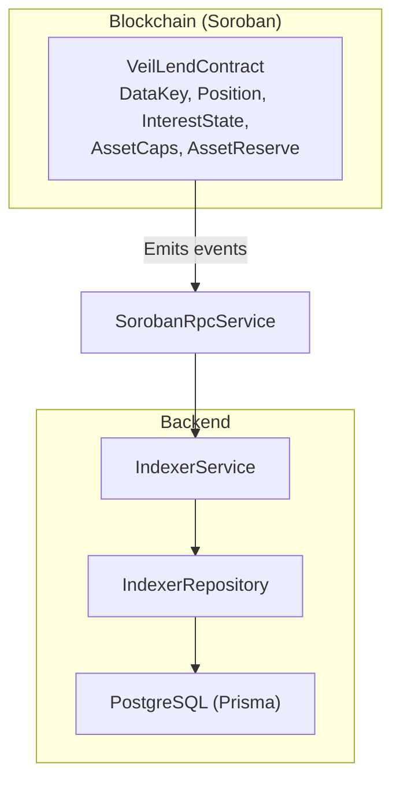
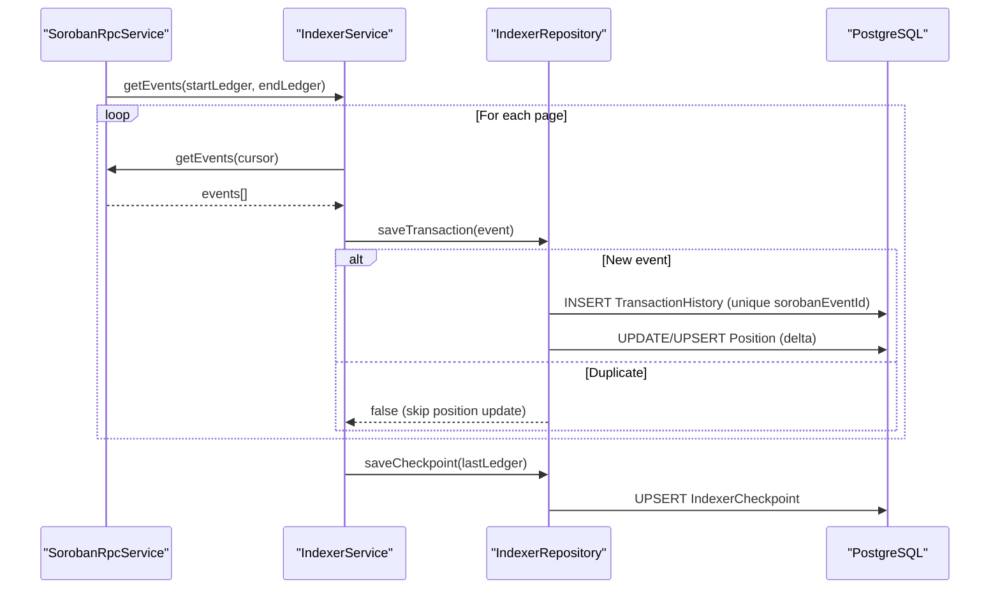
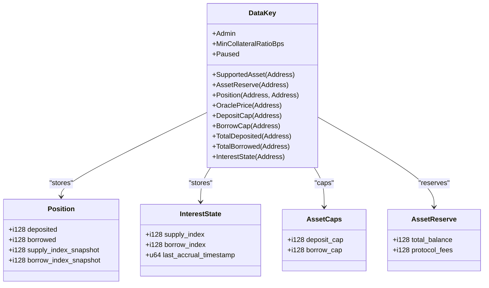
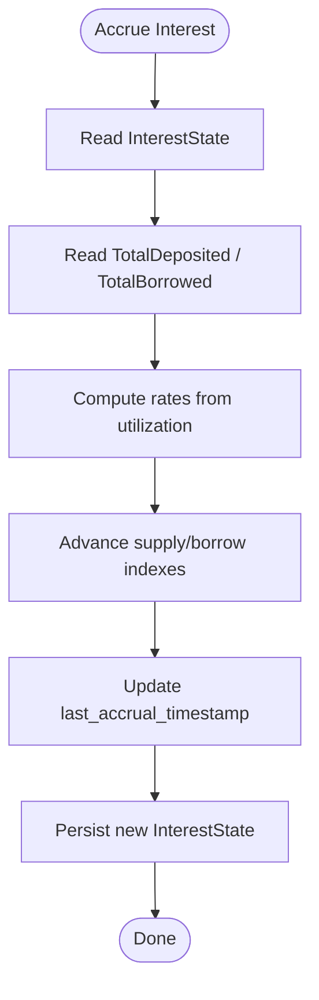
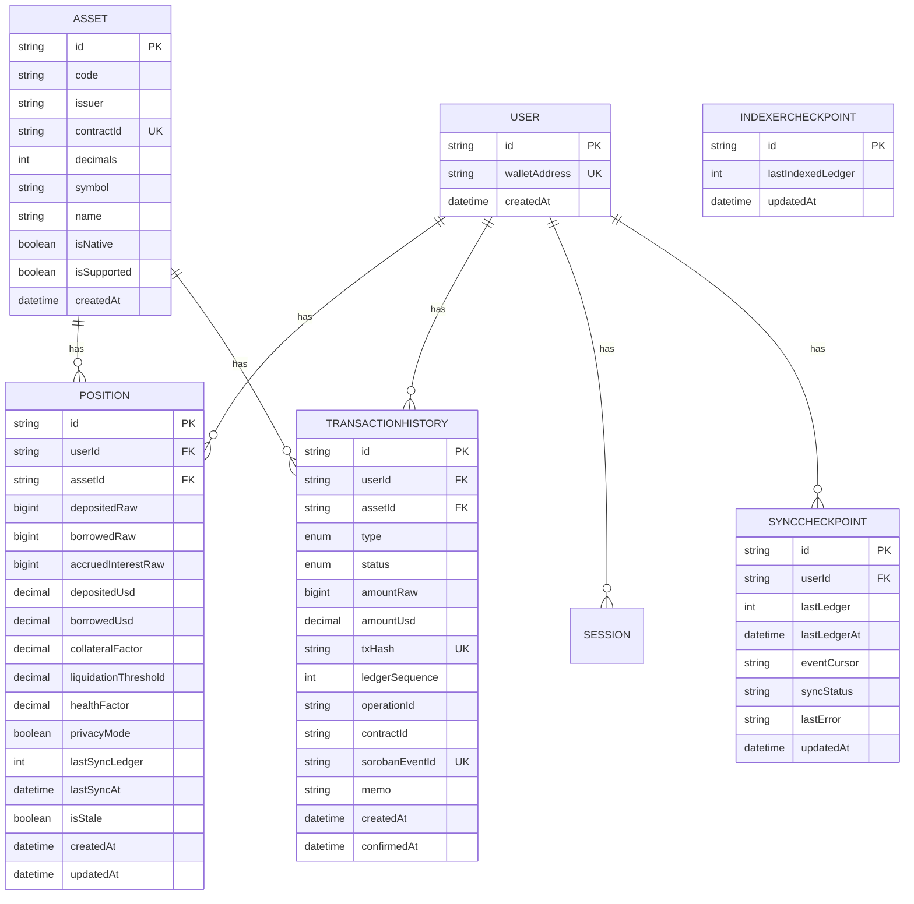
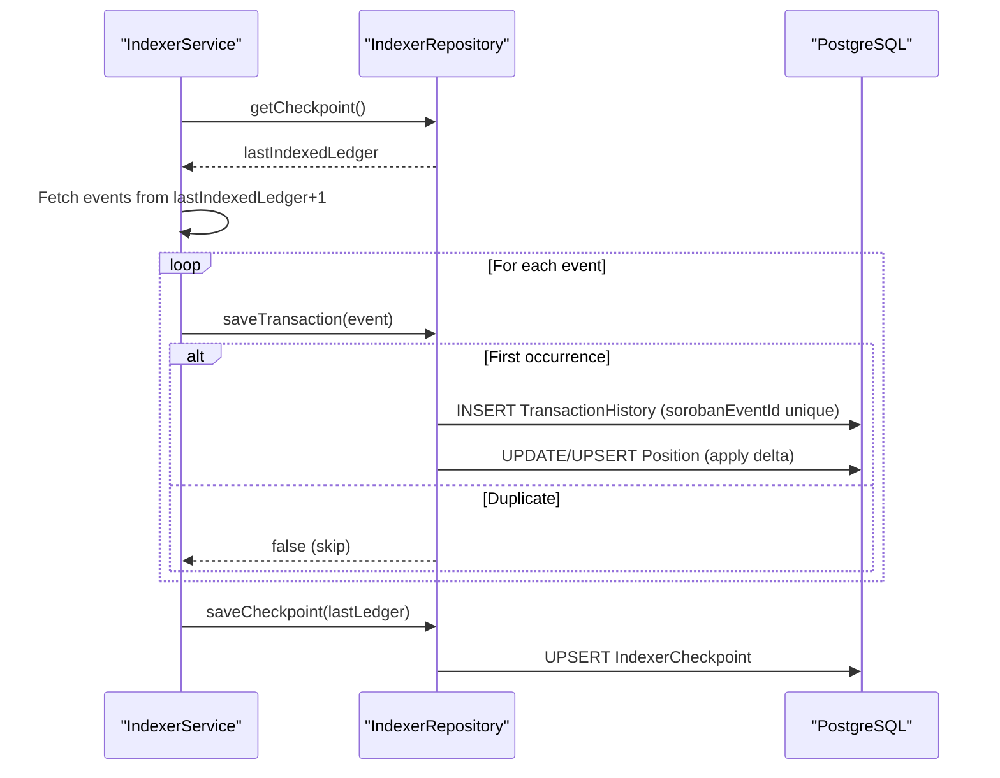
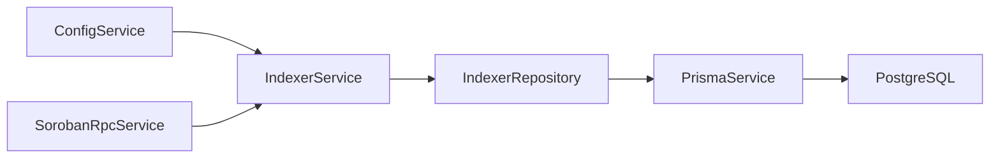

# Data Models

<cite>
**Referenced Files in This Document**
- [lib.rs](file://veilend-soroban/src/lib.rs)
- [interest.rs](file://veilend-soroban/src/interest.rs)
- [schema.prisma](file://veilend-backend/prisma/schema.prisma)
- [indexer.service.ts](file://veilend-backend/src/indexer/indexer.service.ts)
- [indexer.repository.ts](file://veilend-backend/src/indexer/indexer.repository.ts)
- [soroban-rpc.service.ts](file://veilend-backend/src/stellar/soroban-rpc.service.ts)
</cite>

## Table of Contents
1. [Introduction](#introduction)
2. [Project Structure](#project-structure)
3. [Core Components](#core-components)
4. [Architecture Overview](#architecture-overview)
5. [Detailed Component Analysis](#detailed-component-analysis)
6. [Dependency Analysis](#dependency-analysis)
7. [Performance Considerations](#performance-considerations)
8. [Troubleshooting Guide](#troubleshooting-guide)
9. [Conclusion](#conclusion)
10. [Appendices](#appendices)

## Introduction
This document describes the data models that power VeilLend across two layers:
- On-chain storage in the Soroban smart contract (Rust), including Position, InterestState, AssetCaps, AssetReserve, and the DataKey enum.
- Off-chain relational schema in PostgreSQL via Prisma, including User, Position, TransactionHistory, Asset, SyncCheckpoint, and IndexerCheckpoint.

It also explains how blockchain state is synchronized into the database with incremental updates, idempotent event processing, and conflict handling, and outlines validation rules, business constraints, referential integrity, and example query/serialization patterns used by the indexer and services.

## Project Structure
The data model spans:
- Smart contract types and storage keys in the Soroban contract source.
- A Prisma schema defining the off-chain read models and audit tables.
- An indexer service that polls Soroban events and writes to the database.
- A repository layer that performs upserts, deltas, and checkpointing.

**Diagram sources**
- [lib.rs:28-93](file://veilend-soroban/src/lib.rs#L28-L93)
- [schema.prisma:12-196](file://veilend-backend/prisma/schema.prisma#L12-L196)
- [indexer.service.ts:17-171](file://veilend-backend/src/indexer/indexer.service.ts#L17-L171)
- [indexer.repository.ts:52-297](file://veilend-backend/src/indexer/indexer.repository.ts#L52-L297)
- [soroban-rpc.service.ts:8-124](file://veilend-backend/src/stellar/soroban-rpc.service.ts#L8-L124)

**Section sources**
- [lib.rs:28-93](file://veilend-soroban/src/lib.rs#L28-L93)
- [schema.prisma:12-196](file://veilend-backend/prisma/schema.prisma#L12-L196)

## Core Components
This section defines the on-chain and off-chain data models, their fields, relationships, and constraints.

### Blockchain Storage Models (Soroban)
- DataKey: Enum of persistent storage keys used by the contract for admin settings, per-asset caps, totals, oracle prices, positions, and interest state.
- Position: Per-user per-asset balances and snapshots of interest indexes at last interaction.
- InterestState: Per-asset accrual state with supply/borrow indexes and last accrual timestamp.
- AssetCaps: Per-asset deposit_cap and borrow_cap (-1 means unlimited).
- AssetReserve: Per-asset total_balance and protocol_fees.

Relationships and constraints:
- DataKey maps to specific persistent or instance storage entries; values are validated before write (e.g., caps must be positive or -1).
- Position depends on InterestState to compute accrued balances via index snapshots.
- AssetCaps constrain deposit/borrow operations against TotalDeposited/TotalBorrowed.
- AssetReserve tracks liquidity available for borrows and fee accruals.

**Section sources**
- [lib.rs:28-93](file://veilend-soroban/src/lib.rs#L28-L93)
- [lib.rs:356-420](file://veilend-soroban/src/lib.rs#L356-L420)
- [lib.rs:721-780](file://veilend-soroban/src/lib.rs#L721-L780)

### Database Schema (Prisma)
- User: Unique wallet address; linked to positions, transactions, sessions, sync checkpoints.
- Asset: Token metadata and support flags; unique by code+issuer; optional contractId for Soroban tokens.
- Position: Per user per asset raw balances (depositedRaw, borrowedRaw, accruedInterestRaw), derived USD values, risk metrics, privacy mode, sync metadata, timestamps; unique by userId+assetId.
- TransactionHistory: Idempotent per-event records with type/status, amounts, Stellar/Soroban identifiers, timestamps; indexed for queries.
- SyncCheckpoint: Per-user ledger/event cursor tracking for incremental sync.
- IndexerCheckpoint: Singleton row tracking global indexed ledger.

Indexes and constraints:
- Unique constraints ensure identity (walletAddress, code+issuer, sorobanEventId).
- Foreign key relations cascade deletes where appropriate.
- Multiple indexes optimize common queries by user, asset, ledger sequence, and event id.

**Section sources**
- [schema.prisma:12-196](file://veilend-backend/prisma/schema.prisma#L12-L196)

## Architecture Overview
The system synchronizes blockchain state into a relational database using an event-driven indexer. The indexer polls Soroban events, persists them idempotently, applies deltas to user positions, and advances a global checkpoint.

**Diagram sources**
- [indexer.service.ts:48-171](file://veilend-backend/src/indexer/indexer.service.ts#L48-L171)
- [indexer.repository.ts:97-110](file://veilend-backend/src/indexer/indexer.repository.ts#L97-L110)
- [indexer.repository.ts:136-180](file://veilend-backend/src/indexer/indexer.repository.ts#L136-L180)
- [indexer.repository.ts:204-245](file://veilend-backend/src/indexer/indexer.repository.ts#L204-L245)

## Detailed Component Analysis

### Smart Contract Data Model
- DataKey: Defines all persistent keys such as Admin, MinCollateralRatioBps, SupportedAsset(Address), AssetReserve(Address), Position(Address, Address), OraclePrice(Address), DepositCap(Address), BorrowCap(Address), TotalDeposited(Address), TotalBorrowed(Address), Paused, InterestState(Address).
- Position: Fields include deposited, borrowed, supply_index_snapshot, borrow_index_snapshot. Used to realize accrued interest when touched.
- InterestState: Fields include supply_index, borrow_index, last_accrual_timestamp. Advances based on time and utilization.
- AssetCaps: Fields deposit_cap, borrow_cap; -1 indicates unlimited.
- AssetReserve: Fields total_balance, protocol_fees; updated on deposits, borrows, repayments, withdrawals, fees, and interest accrual.

Constraints and validations:
- Caps must be positive or -1; enforced during update_asset_caps.
- Amounts must be positive; enforced in deposit/borrow/repay/withdraw.
- Collateralization checks prevent undercollateralized states after borrow/withdraw.
- Reserve balance checks prevent over-borrowing or over-withdrawing beyond available funds.

**Diagram sources**
- [lib.rs:28-93](file://veilend-soroban/src/lib.rs#L28-L93)

**Section sources**
- [lib.rs:28-93](file://veilend-soroban/src/lib.rs#L28-L93)
- [lib.rs:356-420](file://veilend-soroban/src/lib.rs#L356-L420)
- [lib.rs:483-639](file://veilend-soroban/src/lib.rs#L483-L639)

### Interest Accrual Logic
- compute_accrual advances InterestState indexes based on elapsed time and current utilization, computing growth for both borrowers and suppliers.
- compute_accrued_position realizes accrued interest into a Position by applying index deltas relative to stored snapshots.

Complexity:
- O(1) per accrual call; amortized per operation since it runs before mutations.

**Diagram sources**
- [interest.rs:51-87](file://veilend-soroban/src/interest.rs#L51-L87)
- [lib.rs:792-800](file://veilend-soroban/src/lib.rs#L792-L800)

**Section sources**
- [interest.rs:51-120](file://veilend-soroban/src/interest.rs#L51-L120)
- [lib.rs:792-800](file://veilend-soroban/src/lib.rs#L792-L800)

### Database Entities and Relationships
- User: Central entity identified by walletAddress; one-to-many with Position, TransactionHistory, Session, SyncCheckpoint.
- Asset: Represents token identity; one-to-many with Position, TransactionHistory.
- Position: One-to-one per user+asset; stores raw balances and derived metrics; references User and Asset.
- TransactionHistory: Many-to-one with User and Asset; includes unique sorobanEventId for idempotency.
- SyncCheckpoint: One-to-one with User; tracks lastLedger and eventCursor.
- IndexerCheckpoint: Singleton row tracking global indexing progress.

**Diagram sources**
- [schema.prisma:12-196](file://veilend-backend/prisma/schema.prisma#L12-L196)

**Section sources**
- [schema.prisma:12-196](file://veilend-backend/prisma/schema.prisma#L12-L196)

### Data Synchronization: Incremental Updates and Conflict Resolution
- Incremental updates: The indexer maintains a global checkpoint (IndexerCheckpoint) and fetches events starting from lastIndexedLedger + 1, paginating with cursors until caught up.
- Idempotency: Each event has a unique sorobanEventId; saveTransaction uses this as a unique key to avoid double-counting. If duplicate, position deltas are skipped.
- Conflict resolution: Race conditions between concurrent writers are handled by catching unique constraint violations (P2002) and treating them as duplicates.
- Checkpoint persistence: After processing a range, the indexer saves the last processed ledger to resume safely after restarts.

**Diagram sources**
- [indexer.service.ts:48-171](file://veilend-backend/src/indexer/indexer.service.ts#L48-L171)
- [indexer.repository.ts:97-110](file://veilend-backend/src/indexer/indexer.repository.ts#L97-L110)
- [indexer.repository.ts:136-180](file://veilend-backend/src/indexer/indexer.repository.ts#L136-L180)
- [indexer.repository.ts:204-245](file://veilend-backend/src/indexer/indexer.repository.ts#L204-L245)

**Section sources**
- [indexer.service.ts:48-171](file://veilend-backend/src/indexer/indexer.service.ts#L48-L171)
- [indexer.repository.ts:97-110](file://veilend-backend/src/indexer/indexer.repository.ts#L97-L110)
- [indexer.repository.ts:136-180](file://veilend-backend/src/indexer/indexer.repository.ts#L136-L180)
- [indexer.repository.ts:204-245](file://veilend-backend/src/indexer/indexer.repository.ts#L204-L245)

### Data Lifecycle Management, Archival Policies, Retention Strategies
- Event retention: The indexer relies on Soroban RPC retention windows; if the last indexed ledger falls behind the RPC’s oldest available ledger, the checkpoint is adjusted forward to avoid gaps.
- Replay capability: A resetDatabase method clears indexed transactions, positions, and the checkpoint to rebuild from scratch without affecting shared entities like Users or Assets.
- Staleness markers: Positions track lastSyncAt and isStale to indicate whether they reflect the latest on-chain state.

Operational notes:
- Use forceReplay to re-index from startLedger when needed.
- Monitor RPC health and adjust start points if retention changes.

**Section sources**
- [indexer.service.ts:74-87](file://veilend-backend/src/indexer/indexer.service.ts#L74-L87)
- [indexer.repository.ts:284-295](file://veilend-backend/src/indexer/indexer.repository.ts#L284-L295)
- [schema.prisma:94-105](file://veilend-backend/prisma/schema.prisma#L94-L105)

### Validation Rules, Business Constraints, Referential Integrity
On-chain validations:
- Positive amounts required for deposit, borrow, repay, withdraw.
- Caps must be positive or -1; enforced when updating asset caps.
- Collateralization checks ensure minimum collateral ratio is maintained after borrow/withdraw.
- Reserve sufficiency checks prevent overdraws.

Off-chain validations and integrity:
- Unique constraints: walletAddress, code+issuer, sorobanEventId.
- Foreign key relations enforce referential integrity between User, Asset, Position, TransactionHistory, SyncCheckpoint.
- Status enums restrict transaction states and types.

**Section sources**
- [lib.rs:356-420](file://veilend-soroban/src/lib.rs#L356-L420)
- [lib.rs:483-639](file://veilend-soroban/src/lib.rs#L483-L639)
- [schema.prisma:12-196](file://veilend-backend/prisma/schema.prisma#L12-L196)

### Example Queries, Transformations, Serialization Patterns
- Query transactions by user: Repository maps Prisma rows to domain objects, converting BigInt amounts to strings and mapping enums back to indexer types.
- Query positions by user: Includes related Asset to reconstruct asset addresses and balances.
- Save transaction: Upserts User and Asset if missing, then inserts TransactionHistory with unique sorobanEventId; sets status to CONFIRMED for indexed events.
- Apply position deltas: Reads existing Position, computes next balances clamped to non-negative, and upserts with sync metadata.
- Checkpoint management: Upsert singleton IndexerCheckpoint to persist lastIndexedLedger.

Serialization patterns:
- On-chain events topics are parsed from XDR ScVal to native types; amounts parsed to BigInt for precision.
- Addresses normalized to lowercase for consistent matching.

**Section sources**
- [indexer.repository.ts:112-128](file://veilend-backend/src/indexer/indexer.repository.ts#L112-L128)
- [indexer.repository.ts:136-180](file://veilend-backend/src/indexer/indexer.repository.ts#L136-L180)
- [indexer.repository.ts:182-195](file://veilend-backend/src/indexer/indexer.repository.ts#L182-L195)
- [indexer.repository.ts:204-245](file://veilend-backend/src/indexer/indexer.repository.ts#L204-L245)
- [indexer.service.ts:173-294](file://veilend-backend/src/indexer/indexer.service.ts#L173-L294)

## Dependency Analysis
The indexer depends on:
- SorobanRpcService for event retrieval and health checks.
- PrismaService for database access.
- Configuration for polling intervals, start ledger, and contract ID.

**Diagram sources**
- [indexer.service.ts:17-26](file://veilend-backend/src/indexer/indexer.service.ts#L17-L26)
- [indexer.repository.ts:1-4](file://veilend-backend/src/indexer/indexer.repository.ts#L1-L4)
- [soroban-rpc.service.ts:8-16](file://veilend-backend/src/stellar/soroban-rpc.service.ts#L8-L16)

**Section sources**
- [indexer.service.ts:17-26](file://veilend-backend/src/indexer/indexer.service.ts#L17-L26)
- [indexer.repository.ts:1-4](file://veilend-backend/src/indexer/indexer.repository.ts#L1-L4)
- [soroban-rpc.service.ts:8-16](file://veilend-backend/src/stellar/soroban-rpc.service.ts#L8-L16)

## Performance Considerations
- Indexing efficiency: Pagination with cursors and limits reduces memory usage and network overhead.
- Idempotent writes: Unique sorobanEventId avoids redundant computations and ensures safe retries.
- Delta updates: Position updates apply minimal changes and clamp negatives to prevent invalid states.
- RPC health checks: Prevents indexing into unavailable ledgers and adjusts checkpoints proactively.

[No sources needed since this section provides general guidance]

## Troubleshooting Guide
Common issues and resolutions:
- RPC retention gap: If lastIndexedLedger is older than RPC’s oldestLedger, the indexer adjusts the checkpoint forward to the oldest available ledger.
- Duplicate events: If saveTransaction detects a unique constraint violation, treat as duplicate and skip position updates.
- Health failures: SorobanRpcService logs errors and exposes last error details; use checkConnection$ to monitor connectivity.

Operational steps:
- Use forceReplay to reset read models and re-index from startLedger.
- Inspect IndexerCheckpoint and SyncCheckpoint to verify progress.

**Section sources**
- [indexer.service.ts:74-87](file://veilend-backend/src/indexer/indexer.service.ts#L74-L87)
- [indexer.repository.ts:169-180](file://veilend-backend/src/indexer/indexer.repository.ts#L169-L180)
- [soroban-rpc.service.ts:48-80](file://veilend-backend/src/stellar/soroban-rpc.service.ts#L48-L80)

## Conclusion
VeilLend’s data model combines robust on-chain structures with a resilient off-chain synchronization pipeline. The smart contract enforces strict validation and accrual logic, while the indexer provides idempotent, incremental updates to a well-indexed relational schema. Together, they ensure consistency, performance, and operational reliability across the lending protocol.

[No sources needed since this section summarizes without analyzing specific files]

## Appendices

### Appendix A: Key Field Definitions Summary
- On-chain:
  - DataKey: Persistent keys for admin, caps, totals, oracle price, positions, interest state.
  - Position: Deposited/borrowed balances and index snapshots.
  - InterestState: Supply/borrow indexes and last accrual timestamp.
  - AssetCaps: Deposit/borrow caps (-1 unlimited).
  - AssetReserve: Total balance and protocol fees.
- Off-chain:
  - User: Wallet address and timestamps.
  - Asset: Token metadata and support flags.
  - Position: Raw balances, derived USD, risk metrics, sync metadata.
  - TransactionHistory: Idempotent event records with identifiers and statuses.
  - SyncCheckpoint: Per-user ledger/event cursor.
  - IndexerCheckpoint: Global indexed ledger.

**Section sources**
- [lib.rs:28-93](file://veilend-soroban/src/lib.rs#L28-L93)
- [schema.prisma:12-196](file://veilend-backend/prisma/schema.prisma#L12-L196)