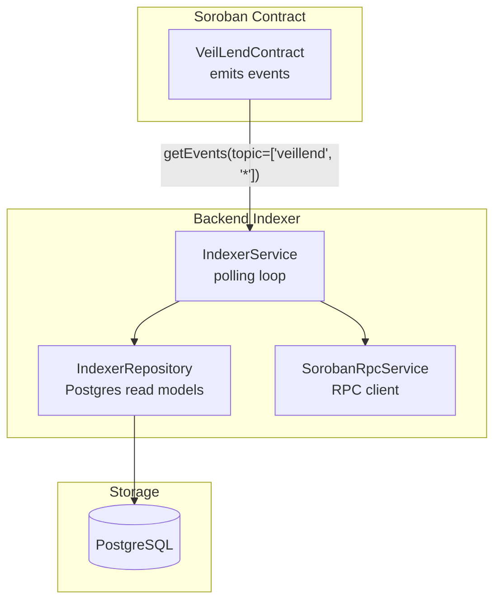
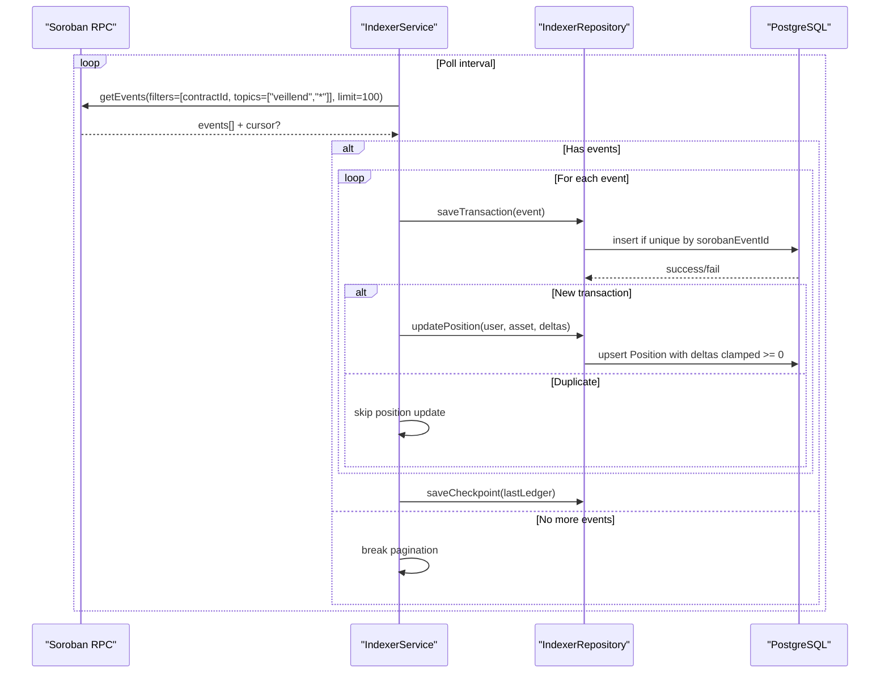
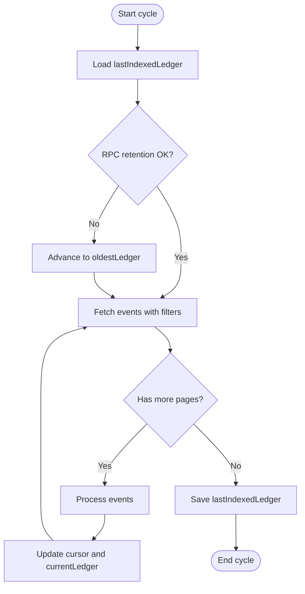
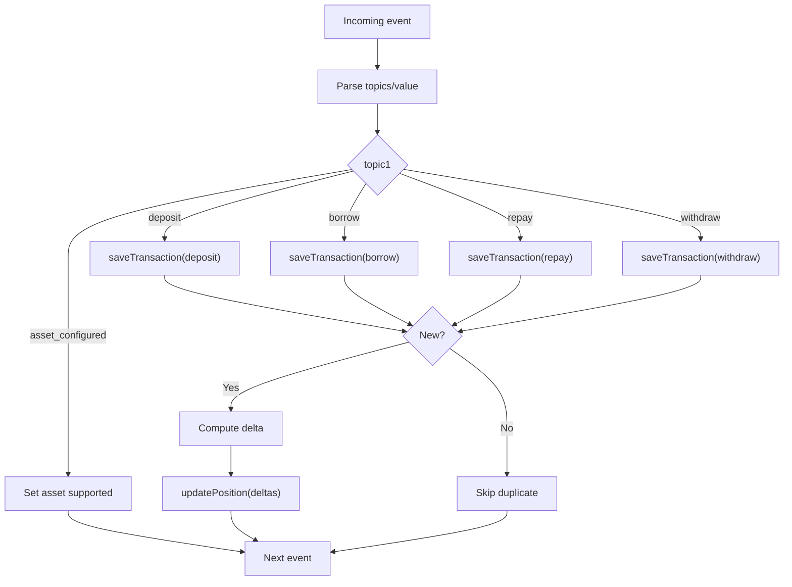
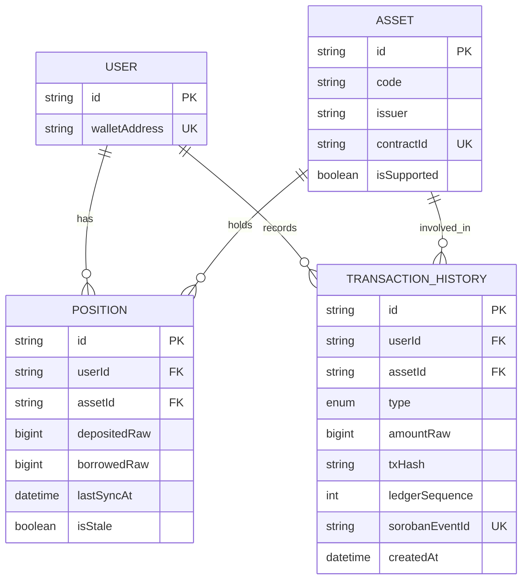
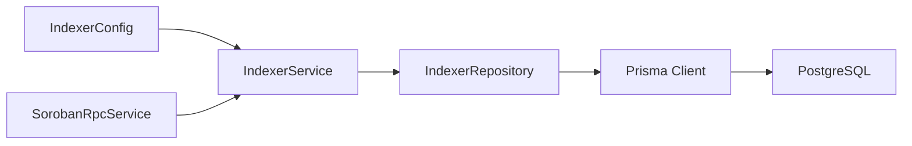

# Event System

<cite>
**Referenced Files in This Document**
- [lib.rs](file://veilend-soroban/src/lib.rs)
- [indexer.service.ts](file://veilend-backend/src/indexer/indexer.service.ts)
- [indexer.repository.ts](file://veilend-backend/src/indexer/indexer.repository.ts)
- [schema.prisma](file://veilend-backend/prisma/schema.prisma)
- [soroban-rpc.service.ts](file://veilend-backend/src/stellar/soroban-rpc.service.ts)
- [indexer.config.ts](file://veilend-backend/src/config/indexer.config.ts)
- [INDEXER.md](file://veilend-backend/INDEXER.md)
</cite>

## Table of Contents
1. [Introduction](#introduction)
2. [Project Structure](#project-structure)
3. [Core Components](#core-components)
4. [Architecture Overview](#architecture-overview)
5. [Detailed Component Analysis](#detailed-component-analysis)
6. [Dependency Analysis](#dependency-analysis)
7. [Performance Considerations](#performance-considerations)
8. [Troubleshooting Guide](#troubleshooting-guide)
9. [Conclusion](#conclusion)
10. [Appendices](#appendices)

## Introduction
This document explains the VeilLend protocol’s event system across two layers:
- Blockchain events emitted by the Soroban smart contract
- Application-level event indexing that consumes those blockchain events and updates read models in a PostgreSQL database

It covers all specified smart contract events, their topics and data structures, emission triggers, the indexer’s subscription and filtering model, real-time consumption approach, listener patterns, error handling for missed events, reprocessing strategies, schema versions and compatibility, and performance considerations for high-frequency events.

## Project Structure
The event system spans the Soroban contract (event emissions) and the NestJS backend (event ingestion and persistence):
- Smart contract defines typed events and emits them during protocol operations
- Backend runs a background indexer that polls the Soroban RPC for contract events matching a topic filter, persists them idempotently, and updates per-user positions

**Diagram sources**
- [lib.rs:147-224](file://veilend-soroban/src/lib.rs#L147-L224)
- [indexer.service.ts:107-171](file://veilend-backend/src/indexer/indexer.service.ts#L107-L171)
- [indexer.repository.ts:136-180](file://veilend-backend/src/indexer/indexer.repository.ts#L136-L180)
- [soroban-rpc.service.ts:41-46](file://veilend-backend/src/stellar/soroban-rpc.service.ts#L41-L46)
- [schema.prisma:123-154](file://veilend-backend/prisma/schema.prisma#L123-L154)

**Section sources**
- [lib.rs:147-224](file://veilend-soroban/src/lib.rs#L147-L224)
- [indexer.service.ts:107-171](file://veilend-backend/src/indexer/indexer.service.ts#L107-L171)
- [indexer.repository.ts:136-180](file://veilend-backend/src/indexer/indexer.repository.ts#L136-L180)
- [schema.prisma:123-154](file://veilend-backend/prisma/schema.prisma#L123-L154)
- [soroban-rpc.service.ts:41-46](file://veilend-backend/src/stellar/soroban-rpc.service.ts#L41-L46)

## Core Components
- Smart contract event definitions and emission points
- Indexer service polling loop with topic-based filtering
- Repository layer for idempotent transaction storage and position updates
- Database schema for transactions, positions, assets, and checkpoints

Key responsibilities:
- Contract: Emit canonical events on state changes
- Indexer: Fetch, parse, deduplicate, and persist events; update read models
- Repository: Provide safe upserts, deltas, and checkpoint management
- Schema: Define tables and constraints that support idempotency and queries

**Section sources**
- [lib.rs:147-224](file://veilend-soroban/src/lib.rs#L147-L224)
- [indexer.service.ts:173-254](file://veilend-backend/src/indexer/indexer.service.ts#L173-L254)
- [indexer.repository.ts:136-180](file://veilend-backend/src/indexer/indexer.repository.ts#L136-L180)
- [schema.prisma:47-105](file://veilend-backend/prisma/schema.prisma#L47-L105)

## Architecture Overview
The indexer subscribes to all VeilLend contract events via a topic filter and processes them into Postgres read models. It uses pagination and cursors to handle large volumes and maintains a global ledger checkpoint to resume after restarts or failures.

**Diagram sources**
- [indexer.service.ts:107-171](file://veilend-backend/src/indexer/indexer.service.ts#L107-L171)
- [indexer.service.ts:173-254](file://veilend-backend/src/indexer/indexer.service.ts#L173-L254)
- [indexer.repository.ts:136-180](file://veilend-backend/src/indexer/indexer.repository.ts#L136-L180)
- [indexer.repository.ts:204-245](file://veilend-backend/src/indexer/indexer.repository.ts#L204-L245)

## Detailed Component Analysis

### Smart Contract Events
All events are defined with stable topics under the namespace “veillend”. The second topic identifies the event kind. Data payloads include user/asset addresses and amounts where applicable.

- AssetConfigured
  - Topics: ["veillend", "asset_configured"]
  - Fields: admin, asset, supported
  - Emitted when an admin configures whether an asset is supported
  - Also triggers AssetReserveUpdated when supported

- DepositEvent
  - Topics: ["veillend", "deposit"], single-value data format
  - Fields: user, asset, amount
  - Emitted on successful deposit after interest accrual, cap checks, and reserve updates

- BorrowEvent
  - Topics: ["veillend", "borrow"], single-value data format
  - Fields: user, asset, amount
  - Emitted on successful borrow after interest accrual, cap checks, collateralization, and reserve updates

- RepayEvent
  - Topics: ["veillend", "repay"], single-value data format
  - Fields: user, asset, amount
  - Emitted on successful repay even when paused; updates totals and reserves

- WithdrawEvent
  - Topics: ["veillend", "withdraw"], single-value data format
  - Fields: user, asset, amount
  - Emitted on successful withdraw even when paused; updates totals and reserves

- CapsUpdated
  - Topics: ["veillend", "caps_updated"]
  - Fields: admin, asset, deposit_cap, borrow_cap
  - Emitted when admin updates per-asset caps

- CircuitBreakerEvent
  - Topics: ["veillend", "circuit_breaker"]
  - Fields: admin, paused
  - Emitted when admin toggles pause state

- AssetReserveUpdated
  - Topics: ["veillend", "asset_reserve_updated"]
  - Fields: asset, total_balance, protocol_fees, kind
  - Emitted whenever reserve state changes due to configuration, deposits, borrows, repayments, withdrawals, fee accruals, or interest accruals

Notes:
- Interest accrual is performed before mutating operations to ensure caps and totals reflect time-aware values
- Some operations (repay, withdraw) remain allowed when paused

**Section sources**
- [lib.rs:147-224](file://veilend-soroban/src/lib.rs#L147-L224)
- [lib.rs:260-306](file://veilend-soroban/src/lib.rs#L260-L306)
- [lib.rs:356-395](file://veilend-soroban/src/lib.rs#L356-L395)
- [lib.rs:450-468](file://veilend-soroban/src/lib.rs#L450-L468)
- [lib.rs:483-519](file://veilend-soroban/src/lib.rs#L483-L519)
- [lib.rs:521-561](file://veilend-soroban/src/lib.rs#L521-L561)
- [lib.rs:563-598](file://veilend-soroban/src/lib.rs#L563-L598)
- [lib.rs:600-639](file://veilend-soroban/src/lib.rs#L600-L639)
- [lib.rs:666-677](file://veilend-soroban/src/lib.rs#L666-L677)
- [lib.rs:738-751](file://veilend-soroban/src/lib.rs#L738-L751)

### Indexer Subscription and Filtering
- Topic-based subscription: The indexer requests contract events filtered by contract ID and topics starting with ["veillend", "*"]. This captures all VeilLend events while ignoring unrelated contracts.
- Pagination: Uses limit=100 and response cursors to process large event sets efficiently.
- Checkpointing: Persists last indexed ledger to resume safely after restarts or network issues.
- Retention safety: If the stored checkpoint is older than the RPC’s oldest retained ledger, it advances to avoid gaps.

**Diagram sources**
- [indexer.service.ts:48-105](file://veilend-backend/src/indexer/indexer.service.ts#L48-L105)
- [indexer.service.ts:107-171](file://veilend-backend/src/indexer/indexer.service.ts#L107-L171)

**Section sources**
- [indexer.service.ts:48-105](file://veilend-backend/src/indexer/indexer.service.ts#L48-L105)
- [indexer.service.ts:107-171](file://veilend-backend/src/indexer/indexer.service.ts#L107-L171)

### Event Processing Logic
For each event:
- Parse topics and value using Stellar SDK utilities
- Route based on topic1:
  - asset_configured: mark asset supported in read model
  - deposit/borrow/repay/withdraw: persist transaction idempotently and apply position deltas
- Deduplication: Uses sorobanEventId as unique key; duplicates are skipped to prevent double-counting
- Position updates: Apply deposited/borrowed deltas and clamp balances to non-negative values

**Diagram sources**
- [indexer.service.ts:173-254](file://veilend-backend/src/indexer/indexer.service.ts#L173-L254)
- [indexer.repository.ts:136-180](file://veilend-backend/src/indexer/indexer.repository.ts#L136-L180)
- [indexer.repository.ts:204-245](file://veilend-backend/src/indexer/indexer.repository.ts#L204-L245)

**Section sources**
- [indexer.service.ts:173-254](file://veilend-backend/src/indexer/indexer.service.ts#L173-L254)
- [indexer.repository.ts:136-180](file://veilend-backend/src/indexer/indexer.repository.ts#L136-L180)
- [indexer.repository.ts:204-245](file://veilend-backend/src/indexer/indexer.repository.ts#L204-L245)

### Database Read Models and Idempotency
- TransactionHistory stores each indexed event with a unique sorobanEventId, enabling idempotent processing
- Positions store per-user, per-asset balances updated via deltas; balances are clamped to zero minimum
- Assets track whether they are supported based on asset_configured events
- IndexerCheckpoint tracks the highest processed ledger globally

**Diagram sources**
- [schema.prisma:47-105](file://veilend-backend/prisma/schema.prisma#L47-L105)
- [schema.prisma:123-154](file://veilend-backend/prisma/schema.prisma#L123-L154)

**Section sources**
- [schema.prisma:47-105](file://veilend-backend/prisma/schema.prisma#L47-L105)
- [schema.prisma:123-154](file://veilend-backend/prisma/schema.prisma#L123-L154)
- [indexer.repository.ts:136-180](file://veilend-backend/src/indexer/indexer.repository.ts#L136-L180)
- [indexer.repository.ts:204-245](file://veilend-backend/src/indexer/indexer.repository.ts#L204-L245)

### Real-Time Consumption and Subscriptions
- Current implementation uses periodic polling of the Soroban RPC with a configurable interval
- There is no WebSocket/streaming subscription implemented in the provided codebase
- To achieve near real-time consumption, reduce the poll interval and optimize batch sizes; however, this remains polling-based

**Section sources**
- [indexer.config.ts:3-18](file://veilend-backend/src/config/indexer.config.ts#L3-L18)
- [indexer.service.ts:28-46](file://veilend-backend/src/indexer/indexer.service.ts#L28-L46)

### Example Event Listeners and Error Handling
- Event listeners are implemented within the indexer’s processEvent method, which routes by topic and handles errors per-event without halting the pipeline
- Errors are logged and do not stop subsequent event processing
- Duplicate events are detected and skipped to maintain idempotency

Example references:
- Topic routing and parsing: [indexer.service.ts:173-254](file://veilend-backend/src/indexer/indexer.service.ts#L173-L254)
- Per-event error logging: [indexer.service.ts:249-253](file://veilend-backend/src/indexer/indexer.service.ts#L249-L253)

**Section sources**
- [indexer.service.ts:173-254](file://veilend-backend/src/indexer/indexer.service.ts#L173-L254)

### Missed Events and Reprocessing Strategies
- Resume behavior: On startup, the indexer loads the last indexed ledger and continues from there
- Retention safety: If the stored checkpoint is older than the RPC’s oldest retained ledger, it advances to avoid unresolvable gaps
- Replay: A full replay clears indexer-owned read models and re-indexes from the configured start ledger

Reprocessing steps:
- Reset indexer read models (positions, indexed transactions, checkpoint)
- Trigger immediate indexing from start ledger

**Section sources**
- [indexer.service.ts:48-105](file://veilend-backend/src/indexer/indexer.service.ts#L48-L105)
- [indexer.repository.ts:284-295](file://veilend-backend/src/indexer/indexer.repository.ts#L284-L295)
- [INDEXER.md:20-38](file://veilend-backend/INDEXER.md#L20-L38)

### Event Schema Versions and Backward Compatibility
- Contract metadata exposes versioning fields for interface and storage layout
- Storage schema version and ID are maintained to guide migrations and consumer compatibility checks
- Consumers should read contract metadata before assuming storage layout during migrations

Versioning details:
- Contract version and storage schema version constants
- Metadata accessor returns current versions and schema ID

**Section sources**
- [lib.rs:10-26](file://veilend-soroban/src/lib.rs#L10-L26)
- [lib.rs:231-240](file://veilend-soroban/src/lib.rs#L231-L240)

## Dependency Analysis
The event system depends on:
- Soroban RPC for event retrieval
- Prisma/PostgreSQL for persistent read models
- Configuration for contract ID, start ledger, and poll interval

**Diagram sources**
- [indexer.config.ts:3-18](file://veilend-backend/src/config/indexer.config.ts#L3-L18)
- [soroban-rpc.service.ts:41-46](file://veilend-backend/src/stellar/soroban-rpc.service.ts#L41-L46)
- [indexer.service.ts:17-26](file://veilend-backend/src/indexer/indexer.service.ts#L17-L26)
- [indexer.repository.ts:52-56](file://veilend-backend/src/indexer/indexer.repository.ts#L52-L56)

**Section sources**
- [indexer.config.ts:3-18](file://veilend-backend/src/config/indexer.config.ts#L3-L18)
- [soroban-rpc.service.ts:41-46](file://veilend-backend/src/stellar/soroban-rpc.service.ts#L41-L46)
- [indexer.service.ts:17-26](file://veilend-backend/src/indexer/indexer.service.ts#L17-L26)
- [indexer.repository.ts:52-56](file://veilend-backend/src/indexer/indexer.repository.ts#L52-L56)

## Performance Considerations
- Batch size: The indexer fetches up to 100 events per request; tune based on RPC limits and throughput needs
- Poll interval: Configurable via environment; shorter intervals increase responsiveness but also RPC load
- Deduplication: Using sorobanEventId avoids redundant writes and position updates
- Single-writer assumption: Position updates rely on serial processing; parallelizing would require row-level locking or atomic increments
- RPC retention: Safety check prevents querying beyond available history; consider monitoring RPC retention windows

[No sources needed since this section provides general guidance]

## Troubleshooting Guide
Common issues and mitigations:
- Missing events due to RPC retention: The indexer automatically advances the checkpoint to the oldest available ledger and logs a warning
- Duplicate events: Handled idempotently; duplicates are skipped
- RPC connectivity: Service exposes health checks and error messages; use these to diagnose connection issues
- Stale positions: Ensure indexer is running and checkpoint is advancing; verify poll interval and RPC availability

Operational tips:
- Use the replay endpoint to rebuild read models if schema changes require full re-indexing
- Monitor logs for warnings about retention and RPC health
- Validate contract shape to ensure indexer handlers match emitted events

**Section sources**
- [indexer.service.ts:74-87](file://veilend-backend/src/indexer/indexer.service.ts#L74-L87)
- [indexer.service.ts:249-253](file://veilend-backend/src/indexer/indexer.service.ts#L249-L253)
- [soroban-rpc.service.ts:51-80](file://veilend-backend/src/stellar/soroban-rpc.service.ts#L51-L80)
- [INDEXER.md:20-38](file://veilend-backend/INDEXER.md#L20-L38)

## Conclusion
The VeilLend event system combines well-defined Soroban contract events with a robust, idempotent indexer that persists and reconciles state in PostgreSQL. It supports crash recovery, retention safety, and full replay capabilities. While currently polling-based, its design allows future enhancements such as streaming subscriptions. Proper configuration, monitoring, and adherence to idempotency practices ensure reliable event processing at scale.

[No sources needed since this section summarizes without analyzing specific files]

## Appendices

### Event Emission Triggers Summary
- AssetConfigured: Admin configure_asset call; also triggers AssetReserveUpdated when supported
- DepositEvent: deposit() after interest accrual and cap checks
- BorrowEvent: borrow() after interest accrual, cap checks, collateralization
- RepayEvent: repay() even when paused
- WithdrawEvent: withdraw() even when paused
- CapsUpdated: update_asset_caps()
- CircuitBreakerEvent: set_paused()
- AssetReserveUpdated: Any operation that modifies reserve state (configure, deposit, borrow, repay, withdraw, fee accrual, interest accrual)

**Section sources**
- [lib.rs:260-306](file://veilend-soroban/src/lib.rs#L260-L306)
- [lib.rs:483-519](file://veilend-soroban/src/lib.rs#L483-L519)
- [lib.rs:521-561](file://veilend-soroban/src/lib.rs#L521-L561)
- [lib.rs:563-598](file://veilend-soroban/src/lib.rs#L563-L598)
- [lib.rs:600-639](file://veilend-soroban/src/lib.rs#L600-L639)
- [lib.rs:666-677](file://veilend-soroban/src/lib.rs#L666-L677)
- [lib.rs:738-751](file://veilend-soroban/src/lib.rs#L738-L751)