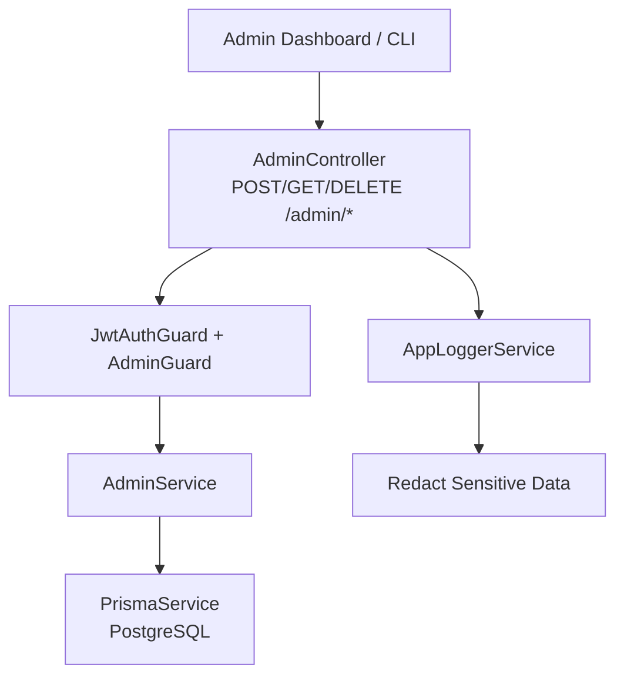
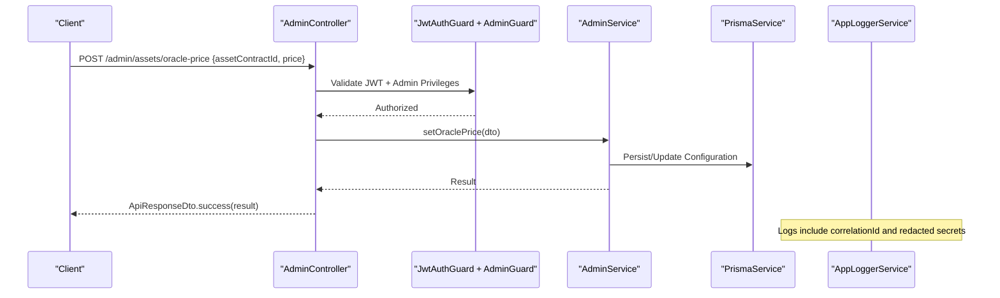
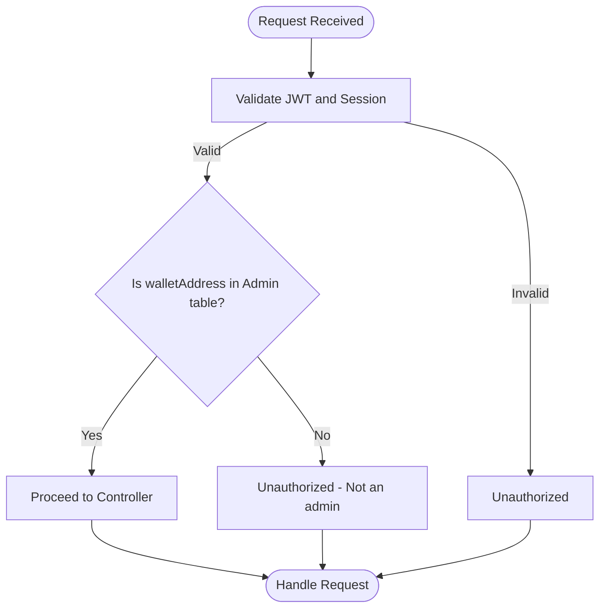
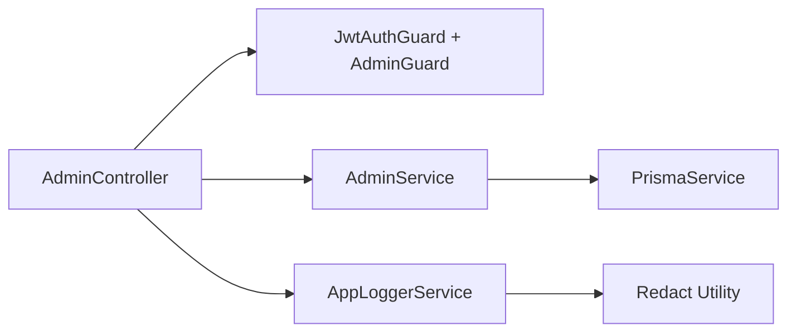

# Admin API

<cite>
**Referenced Files in This Document**
- [admin.controller.ts](file://veilend-backend/src/admin/admin.controller.ts)
- [admin.service.ts](file://veilend-backend/src/admin/admin.service.ts)
- [add-admin.dto.ts](file://veilend-backend/src/admin/dto/add-admin.dto.ts)
- [configure-asset.dto.ts](file://veilend-backend/src/admin/dto/configure-asset.dto.ts)
- [set-oracle-price.dto.ts](file://veilend-backend/src/admin/dto/set-oracle-price.dto.ts)
- [set-min-collateral-ratio.dto.ts](file://veilend-backend/src/admin/dto/set-min-collateral-ratio.dto.ts)
- [admin.guard.ts](file://veilend-backend/src/auth/admin.guard.ts)
- [jwt-auth.guard.ts](file://veilend-backend/src/auth/jwt-auth.guard.ts)
- [auth.service.ts](file://veilend-backend/src/auth/auth.service.ts)
- [jwt.strategy.ts](file://veilend-backend/src/auth/jwt.strategy.ts)
- [schema.prisma](file://veilend-backend/prisma/schema.prisma)
- [app-logger.service.ts](file://veilend-backend/src/common/logging/app-logger.service.ts)
- [redact.util.ts](file://veilend-backend/src/common/logging/redact.util.ts)
- [transform.interceptor.ts](file://veilend-backend/src/common/interceptors/transform.interceptor.ts)
</cite>

## Table of Contents
1. Introduction
2. Project Structure
3. Core Components
4. Architecture Overview
5. Detailed Component Analysis
6. Dependency Analysis
7. Performance Considerations
8. Troubleshooting Guide
9. Conclusion
10. Appendices

## Introduction
This document provides detailed API documentation for the VeilLend administrative endpoints. It covers admin-only operations to add/remove administrators, configure supported assets with oracle prices and caps, set minimum collateral ratios, and manage oracle price feeds. It also documents authentication via JWT tokens with admin privileges, authorization through the admin guard, security considerations (input validation, rate limiting recommendations, audit logging), and operational procedures for production environments, backup/recovery, and integration patterns for admin dashboards and automated monitoring systems.

## Project Structure
The administrative API is implemented as a NestJS module under src/admin with dedicated DTOs for request validation. Authentication and authorization are enforced by guards that validate JWT sessions and check admin privileges against the database schema. Logging utilities provide structured logs with redaction of sensitive fields.

**Diagram sources**
- [admin.controller.ts:20-55](file://veilend-backend/src/admin/admin.controller.ts#L20-L55)
- [admin.guard.ts:24-45](file://veilend-backend/src/auth/admin.guard.ts#L24-L45)
- [jwt.strategy.ts:14-63](file://veilend-backend/src/auth/jwt.strategy.ts#L14-L63)
- [schema.prisma:179-185](file://veilend-backend/prisma/schema.prisma#L179-L185)
- [app-logger.service.ts:9-47](file://veilend-backend/src/common/logging/app-logger.service.ts#L9-L47)
- [redact.util.ts:29-55](file://veilend-backend/src/common/logging/redact.util.ts#L29-L55)

**Section sources**
- [admin.controller.ts:20-55](file://veilend-backend/src/admin/admin.controller.ts#L20-L55)
- [schema.prisma:179-185](file://veilend-backend/prisma/schema.prisma#L179-L185)

## Core Components
- AdminController: Exposes admin-only endpoints for managing admins, configuring assets, setting oracle prices, and adjusting protocol risk parameters. All endpoints require a valid JWT session and admin privileges.
- AdminService: Orchestrates business logic for admin operations and interacts with Prisma to persist changes. Placeholder implementations indicate where on-chain contract interactions will be integrated.
- DTOs: Validate incoming requests using class-validator decorators to ensure type safety and constraints.
- Auth Guards: JwtAuthGuard validates JWT signatures and active sessions; AdminGuard verifies that the authenticated wallet address is an admin.

**Section sources**
- [admin.controller.ts:20-55](file://veilend-backend/src/admin/admin.controller.ts#L20-L55)
- [admin.service.ts:8-56](file://veilend-backend/src/admin/admin.service.ts#L8-L56)
- [add-admin.dto.ts:1-7](file://veilend-backend/src/admin/dto/add-admin.dto.ts#L1-L7)
- [configure-asset.dto.ts:1-10](file://veilend-backend/src/admin/dto/configure-asset.dto.ts#L1-L10)
- [set-oracle-price.dto.ts:1-11](file://veilend-backend/src/admin/dto/set-oracle-price.dto.ts#L1-L11)
- [set-min-collateral-ratio.dto.ts:1-8](file://veilend-backend/src/admin/dto/set-min-collateral-ratio.dto.ts#L1-L8)
- [admin.guard.ts:24-45](file://veilend-backend/src/auth/admin.guard.ts#L24-L45)
- [jwt-auth.guard.ts:1-6](file://veilend-backend/src/auth/jwt-auth.guard.ts#L1-L6)

## Architecture Overview
Administrative requests flow through the controller, which applies global validation and guards. The JWT strategy validates tokens and ensures sessions exist and are not expired. The admin guard checks the caller’s wallet address against the Admin table. After authorization, the service performs persistence or orchestrates on-chain actions. Structured logging captures events with correlation IDs and redacted sensitive data.

**Diagram sources**
- [admin.controller.ts:41-49](file://veilend-backend/src/admin/admin.controller.ts#L41-L49)
- [jwt.strategy.ts:35-63](file://veilend-backend/src/auth/jwt.strategy.ts#L35-L63)
- [admin.guard.ts:28-45](file://veilend-backend/src/auth/admin.guard.ts#L28-L45)
- [admin.service.ts:39-46](file://veilend-backend/src/admin/admin.service.ts#L39-L46)
- [transform.interceptor.ts:12-23](file://veilend-backend/src/common/interceptors/transform.interceptor.ts#L12-L23)
- [app-logger.service.ts:9-47](file://veilend-backend/src/common/logging/app-logger.service.ts#L9-L47)

## Detailed Component Analysis

### Authentication and Authorization
- JWT Authentication: Requests must include a Bearer token obtained via the auth flow. The JWT strategy extracts the token from the Authorization header, validates signature and expiry, and confirms the session exists and is active.
- Admin Authorization: The admin guard retrieves the authenticated user’s wallet address and checks it against the Admin table. Non-admin users receive an unauthorized response.

**Diagram sources**
- [jwt.strategy.ts:35-63](file://veilend-backend/src/auth/jwt.strategy.ts#L35-L63)
- [admin.guard.ts:28-45](file://veilend-backend/src/auth/admin.guard.ts#L28-L45)
- [schema.prisma:179-185](file://veilend-backend/prisma/schema.prisma#L179-L185)

**Section sources**
- [jwt.strategy.ts:14-63](file://veilend-backend/src/auth/jwt.strategy.ts#L14-L63)
- [admin.guard.ts:24-45](file://veilend-backend/src/auth/admin.guard.ts#L24-L45)
- [auth.service.ts:120-148](file://veilend-backend/src/auth/auth.service.ts#L120-L148)

### Admin Endpoints

#### Add Administrator
- Endpoint: POST /admin/admins
- Purpose: Add a new administrator wallet address to the system.
- Request Body (AddAdminDto):
  - walletAddress: string (required)
- Response: Success payload containing the created admin record.
- Security: Requires JWT + admin privileges.

**Section sources**
- [admin.controller.ts:26-29](file://veilend-backend/src/admin/admin.controller.ts#L26-L29)
- [add-admin.dto.ts:1-7](file://veilend-backend/src/admin/dto/add-admin.dto.ts#L1-L7)
- [admin.service.ts:12-18](file://veilend-backend/src/admin/admin.service.ts#L12-L18)
- [schema.prisma:179-185](file://veilend-backend/prisma/schema.prisma#L179-L185)

#### Remove Administrator
- Endpoint: DELETE /admin/admins/:walletAddress
- Purpose: Remove an existing administrator by wallet address.
- Path Parameter: walletAddress (string)
- Response: Success payload confirming removal.
- Security: Requires JWT + admin privileges.

**Section sources**
- [admin.controller.ts:31-34](file://veilend-backend/src/admin/admin.controller.ts#L31-L34)
- [admin.service.ts:20-24](file://veilend-backend/src/admin/admin.service.ts#L20-L24)

#### List Administrators
- Endpoint: GET /admin/admins
- Purpose: Retrieve all registered administrators.
- Response: Array of admin records.
- Security: Requires JWT + admin privileges.

**Section sources**
- [admin.controller.ts:36-39](file://veilend-backend/src/admin/admin.controller.ts#L36-L39)
- [admin.service.ts:26-28](file://veilend-backend/src/admin/admin.service.ts#L26-L28)

#### Configure Asset
- Endpoint: POST /admin/assets/configure
- Purpose: Enable/disable support for an asset and update configuration flags.
- Request Body (ConfigureAssetDto):
  - assetContractId: string (required)
  - supported: boolean (required)
- Response: Success payload with updated configuration.
- Security: Requires JWT + admin privileges.

**Section sources**
- [admin.controller.ts:41-44](file://veilend-backend/src/admin/admin.controller.ts#L41-L44)
- [configure-asset.dto.ts:1-10](file://veilend-backend/src/admin/dto/configure-asset.dto.ts#L1-L10)
- [admin.service.ts:30-37](file://veilend-backend/src/admin/admin.service.ts#L30-L37)

#### Set Oracle Price
- Endpoint: POST /admin/assets/oracle-price
- Purpose: Update the oracle price for a specific asset.
- Request Body (SetOraclePriceDto):
  - assetContractId: string (required)
  - price: number (required, integer >= 1)
- Response: Success payload with updated price.
- Security: Requires JWT + admin privileges.

**Section sources**
- [admin.controller.ts:46-49](file://veilend-backend/src/admin/admin.controller.ts#L46-L49)
- [set-oracle-price.dto.ts:1-11](file://veilend-backend/src/admin/dto/set-oracle-price.dto.ts#L1-L11)
- [admin.service.ts:39-46](file://veilend-backend/src/admin/admin.service.ts#L39-L46)

#### Set Minimum Collateral Ratio
- Endpoint: POST /admin/protocol/min-collateral-ratio
- Purpose: Adjust the protocol-wide minimum collateral ratio (in basis points).
- Request Body (SetMinCollateralRatioDto):
  - minCollateralRatioBps: number (required, integer >= 10000)
- Response: Success payload with updated ratio.
- Security: Requires JWT + admin privileges.

**Section sources**
- [admin.controller.ts:51-54](file://veilend-backend/src/admin/admin.controller.ts#L51-L54)
- [set-min-collateral-ratio.dto.ts:1-8](file://veilend-backend/src/admin/dto/set-min-collateral-ratio.dto.ts#L1-L8)
- [admin.service.ts:48-55](file://veilend-backend/src/admin/admin.service.ts#L48-L55)

### Request/Response Schema Summary
- Global Response Wrapper: Responses are wrapped in a success envelope via transform interceptor.
- Common Fields:
  - success: boolean
  - message: string (optional)
  - data: any (operation-specific payload)

**Section sources**
- [transform.interceptor.ts:12-23](file://veilend-backend/src/common/interceptors/transform.interceptor.ts#L12-L23)

## Dependency Analysis
The admin module depends on authentication and authorization modules, Prisma for persistence, and logging utilities. DTOs enforce input validation at the controller layer.

**Diagram sources**
- [admin.controller.ts:20-55](file://veilend-backend/src/admin/admin.controller.ts#L20-L55)
- [admin.service.ts:8-56](file://veilend-backend/src/admin/admin.service.ts#L8-L56)
- [jwt.strategy.ts:14-63](file://veilend-backend/src/auth/jwt.strategy.ts#L14-L63)
- [admin.guard.ts:24-45](file://veilend-backend/src/auth/admin.guard.ts#L24-L45)
- [app-logger.service.ts:9-47](file://veilend-backend/src/common/logging/app-logger.service.ts#L9-L47)
- [redact.util.ts:29-55](file://veilend-backend/src/common/logging/redact.util.ts#L29-L55)

**Section sources**
- [admin.controller.ts:20-55](file://veilend-backend/src/admin/admin.controller.ts#L20-L55)
- [admin.service.ts:8-56](file://veilend-backend/src/admin/admin.service.ts#L8-L56)

## Performance Considerations
- Input Validation: Use DTOs with strict validators to minimize invalid requests and reduce downstream processing.
- Database Access: Ensure indexes on frequently queried fields (e.g., walletAddress in Admin table) to keep admin operations fast.
- Rate Limiting: Apply rate limiting on sensitive endpoints (e.g., adding/removing admins, changing oracle prices) to mitigate abuse.
- Logging Overhead: Keep log payloads minimal and rely on redaction to avoid leaking sensitive data while maintaining observability.

[No sources needed since this section provides general guidance]

## Troubleshooting Guide
Common issues and resolutions:
- Unauthorized (No user authenticated): Missing or invalid JWT; ensure the client sends a valid Bearer token from the auth flow.
- Unauthorized (User is not an admin): Valid JWT but wallet address not present in Admin table; add the wallet address via the add admin endpoint.
- Invalid or unknown nonce: During initial authentication, verify the nonce was generated and not expired before signing.
- Session not found or revoked: Token may have been revoked or expired; re-authenticate to obtain a new session.
- Validation errors: Ensure DTO fields match required types and constraints (e.g., price >= 1, minCollateralRatioBps >= 10000).

Operational tips:
- Use correlation IDs in logs to trace requests across services.
- Monitor error logs for repeated failures indicating misconfiguration or attacks.
- Audit admin actions by reviewing logs and database changes.

**Section sources**
- [admin.guard.ts:28-45](file://veilend-backend/src/auth/admin.guard.ts#L28-L45)
- [auth.service.ts:70-148](file://veilend-backend/src/auth/auth.service.ts#L70-L148)
- [app-logger.service.ts:9-47](file://veilend-backend/src/common/logging/app-logger.service.ts#L9-L47)
- [redact.util.ts:29-55](file://veilend-backend/src/common/logging/redact.util.ts#L29-L55)

## Conclusion
The VeilLend admin API provides secure, validated endpoints for critical governance tasks such as managing administrators, configuring assets, updating oracle prices, and adjusting risk parameters. Authentication and authorization are enforced via JWT sessions and admin privilege checks. Structured logging and input validation enhance security and operability. For production, implement rate limiting, robust audit logging, and careful change management practices.

[No sources needed since this section summarizes without analyzing specific files]

## Appendices

### Practical Administrative Workflows

- Onboarding New Assets
  - Steps:
    - Call POST /admin/assets/configure with assetContractId and supported=true.
    - Optionally set initial oracle price via POST /admin/assets/oracle-price.
    - Verify asset appears in asset listings and can be used in positions.
  - Notes:
    - Ensure assetContractId matches the deployed Soroban token contract.
    - Confirm supported flag aligns with policy and risk assessments.

- Adjusting Risk Parameters During Market Volatility
  - Steps:
    - Increase minCollateralRatioBps via POST /admin/protocol/min-collateral-ratio to tighten borrowing requirements.
    - Review and adjust oracle prices if necessary to reflect market conditions.
  - Notes:
    - Monitor health factors and liquidation thresholds after changes.
    - Coordinate with liquidity providers to manage impact.

- Emergency Protocol Interventions
  - Steps:
    - Temporarily disable risky assets by setting supported=false.
    - Freeze oracle updates if feeds are compromised; revert once verified.
    - Escalate changes with multi-signature approvals if applicable.
  - Notes:
    - Log all emergency actions with correlation IDs for post-mortem analysis.
    - Communicate status to stakeholders and users promptly.

**Section sources**
- [admin.controller.ts:41-54](file://veilend-backend/src/admin/admin.controller.ts#L41-L54)
- [configure-asset.dto.ts:1-10](file://veilend-backend/src/admin/dto/configure-asset.dto.ts#L1-L10)
- [set-oracle-price.dto.ts:1-11](file://veilend-backend/src/admin/dto/set-oracle-price.dto.ts#L1-L11)
- [set-min-collateral-ratio.dto.ts:1-8](file://veilend-backend/src/admin/dto/set-min-collateral-ratio.dto.ts#L1-L8)

### Operational Procedures for Production

- Backup and Recovery
  - Regularly back up PostgreSQL database including Admin, User, Session, and configuration tables.
  - Maintain versioned backups of Prisma schema and migrations.
  - Test restore procedures periodically to ensure recovery readiness.

- Integration Patterns
  - Admin Dashboards:
    - Authenticate via the auth endpoints to obtain JWT sessions.
    - Use admin endpoints to perform governance actions; handle responses via the standard success envelope.
  - Automated Monitoring Systems:
    - Subscribe to logs emitted by AppLoggerService for admin actions.
    - Alert on anomalies such as rapid parameter changes or failed validations.
    - Integrate with alerting tools to notify operators of critical events.

- Security Enhancements
  - Enforce rate limiting on admin endpoints.
  - Implement IP allowlisting for admin interfaces where possible.
  - Rotate JWT secrets and monitor session lifetimes.

**Section sources**
- [schema.prisma:179-185](file://veilend-backend/prisma/schema.prisma#L179-L185)
- [app-logger.service.ts:9-47](file://veilend-backend/src/common/logging/app-logger.service.ts#L9-L47)
- [redact.util.ts:29-55](file://veilend-backend/src/common/logging/redact.util.ts#L29-L55)