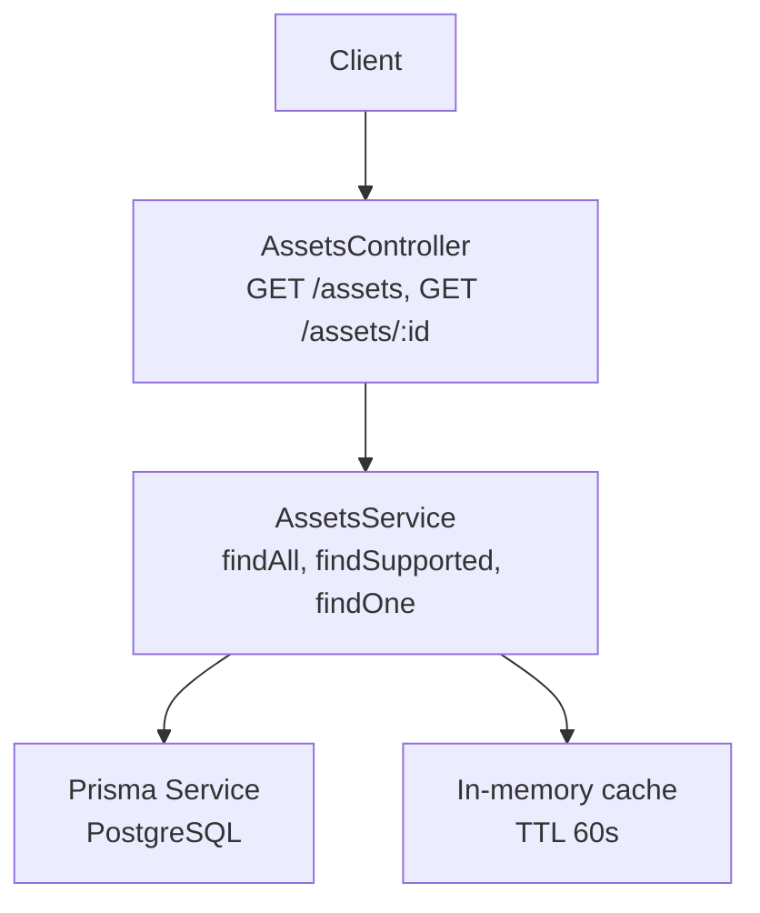
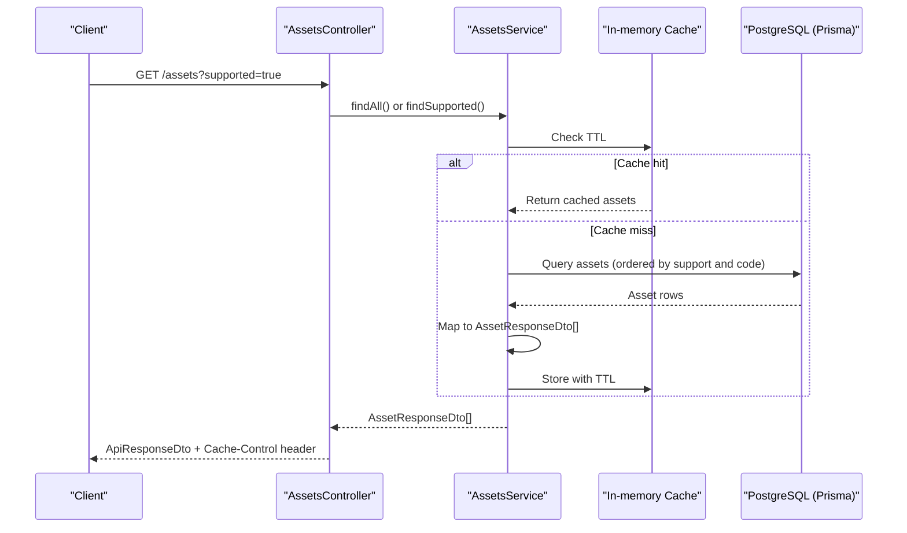

# Asset Management API

<cite>
**Referenced Files in This Document**
- [assets.controller.ts](file://veilend-backend/src/assets/assets.controller.ts)
- [assets.service.ts](file://veilend-backend/src/assets/assets.service.ts)
- [asset-response.dto.ts](file://veilend-backend/src/assets/dto/asset-response.dto.ts)
- [api-response.dto.ts](file://veilend-backend/src/common/dto/api-response.dto.ts)
- [schema.prisma](file://veilend-backend/prisma/schema.prisma)
</cite>

## Table of Contents
1. [Introduction](#introduction)
2. [Project Structure](#project-structure)
3. [Core Components](#core-components)
4. [Architecture Overview](#architecture-overview)
5. [Detailed Component Analysis](#detailed-component-analysis)
6. [Dependency Analysis](#dependency-analysis)
7. [Performance Considerations](#performance-considerations)
8. [Troubleshooting Guide](#troubleshooting-guide)
9. [Conclusion](#conclusion)

## Introduction
This document provides comprehensive API documentation for the VeilLend asset management endpoints. It covers:
- GET /assets: Retrieve all registered assets with optional filtering to supported assets only.
- GET /assets/:id: Fetch a specific asset by UUID, code (e.g., "USDC"), or contractId.

It also documents the response schema (AssetResponseDto), caching headers and their impact on client-side caching, practical query examples, error handling patterns, and consistent response formats across operations.

## Project Structure
The asset management feature is implemented as a NestJS module with a controller, service, DTOs, and database integration via Prisma.



**Diagram sources**
- [assets.controller.ts:16-56](file://veilend-backend/src/assets/assets.controller.ts#L16-L56)
- [assets.service.ts:15-90](file://veilend-backend/src/assets/assets.service.ts#L15-L90)
- [schema.prisma:47-65](file://veilend-backend/prisma/schema.prisma#L47-L65)

**Section sources**
- [assets.controller.ts:16-56](file://veilend-backend/src/assets/assets.controller.ts#L16-L56)
- [assets.service.ts:15-90](file://veilend-backend/src/assets/assets.service.ts#L15-L90)
- [schema.prisma:47-65](file://veilend-backend/prisma/schema.prisma#L47-L65)

## Core Components
- AssetsController: Exposes REST endpoints under /assets with caching headers and standardized responses.
- AssetsService: Implements business logic, including an in-memory cache with TTL and lookup strategies for list and single asset retrieval.
- AssetResponseDto: Public-facing DTO that exposes asset metadata fields while excluding sensitive internal identifiers.
- ApiResponseDto: Standardized wrapper for success/error responses used consistently across endpoints.

Key responsibilities:
- Filtering: GET /assets supports ?supported=true to return only configured/supported assets.
- Lookup: GET /assets/:id resolves by UUID, code, or contractId.
- Caching: HTTP-level Cache-Control header and server-side in-memory cache for read-heavy, rarely-changing data.

**Section sources**
- [assets.controller.ts:20-56](file://veilend-backend/src/assets/assets.controller.ts#L20-L56)
- [assets.service.ts:26-81](file://veilend-backend/src/assets/assets.service.ts#L26-L81)
- [asset-response.dto.ts:7-34](file://veilend-backend/src/assets/dto/asset-response.dto.ts#L7-L34)
- [api-response.dto.ts:1-38](file://veilend-backend/src/common/dto/api-response.dto.ts#L1-L38)

## Architecture Overview
The asset endpoints follow a layered architecture:
- Controller layer handles HTTP routing, query parameters, and response wrapping.
- Service layer encapsulates data access and caching logic.
- Database layer stores asset records with fields like code, symbol, decimals, issuer, contractId, and support flags.



**Diagram sources**
- [assets.controller.ts:24-39](file://veilend-backend/src/assets/assets.controller.ts#L24-L39)
- [assets.service.ts:30-61](file://veilend-backend/src/assets/assets.service.ts#L30-L61)
- [schema.prisma:47-65](file://veilend-backend/prisma/schema.prisma#L47-L65)

## Detailed Component Analysis

### Endpoint: GET /assets
- Purpose: Retrieve all registered assets. Optional query parameter supported=true filters to supported assets only.
- Query Parameters:
  - supported: string | undefined. When set to "true", returns only assets where isSupported is true.
- Response:
  - Wrapper: ApiResponseDto<AssetResponseDto[]>
  - Meta includes count, cached flag, and cacheMaxAge.
- Headers:
  - Cache-Control: public, max-age=60

Request examples:
- Get all assets: GET /assets
- Get supported assets only: GET /assets?supported=true

Response schema:
- success: boolean
- data: AssetResponseDto[]
- meta: object with count, cached, cacheMaxAge

Caching behavior:
- Server-side: In-memory cache with 60-second TTL reduces database load.
- Client-side: Cache-Control header instructs clients to cache responses for up to 60 seconds.

**Section sources**
- [assets.controller.ts:20-39](file://veilend-backend/src/assets/assets.controller.ts#L20-L39)
- [assets.service.ts:30-61](file://veilend-backend/src/assets/assets.service.ts#L30-L61)
- [api-response.dto.ts:15-21](file://veilend-backend/src/common/dto/api-response.dto.ts#L15-L21)

### Endpoint: GET /assets/:id
- Purpose: Retrieve a single asset by UUID, code (e.g., "USDC"), or contractId.
- Path Parameter:
  - id: string. Resolved by code or contractId first; if not found, falls back to UUID lookup.
- Response:
  - Wrapper: ApiResponseDto<AssetResponseDto>
- Error Handling:
  - If not found, throws NotFoundException resulting in a 404 response.
- Headers:
  - Cache-Control: public, max-age=60

Request examples:
- By code: GET /assets/USDC
- By contractId: GET /assets/<contract-address>
- By UUID: GET /assets/<uuid>

Error example:
- Non-existent asset results in 404 with message indicating the asset was not found.

**Section sources**
- [assets.controller.ts:41-56](file://veilend-backend/src/assets/assets.controller.ts#L41-L56)
- [assets.service.ts:63-81](file://veilend-backend/src/assets/assets.service.ts#L63-L81)

### Data Model: AssetResponseDto
Public-facing structure returned by asset endpoints. Fields include:
- code: string (e.g., "USDC")
- symbol: string (display ticker)
- name: string
- decimals: number
- issuer: string | null (null for native assets like XLM)
- contractId: string | null (Soroban token contract address)
- logoUrl: string | null
- isNative: boolean
- isSupported: boolean

Notes:
- Internal identifiers such as the database UUID are excluded from the public response.
- The DTO ensures consistent serialization across endpoints.

**Section sources**
- [asset-response.dto.ts:7-34](file://veilend-backend/src/assets/dto/asset-response.dto.ts#L7-L34)
- [schema.prisma:47-65](file://veilend-backend/prisma/schema.prisma#L47-L65)

### Standardized Response Format: ApiResponseDto
All asset endpoints return a consistent wrapper:
- success: boolean
- data?: T (payload)
- error?: { code: string; message: string; details?: unknown }
- meta?: unknown (used for list endpoints to include count and caching info)

Success helper:
- ApiResponseDto.success(data, meta?) wraps successful responses.

Error handling:
- Not Found errors are thrown by the controller/service and result in standard 404 responses.

**Section sources**
- [api-response.dto.ts:1-38](file://veilend-backend/src/common/dto/api-response.dto.ts#L1-L38)
- [assets.controller.ts:47-56](file://veilend-backend/src/assets/assets.controller.ts#L47-L56)

## Dependency Analysis
The asset endpoints depend on:
- AssetsController depends on AssetsService for business logic.
- AssetsService depends on PrismaService to access PostgreSQL.
- AssetsService uses an in-memory cache to reduce database reads.
- DTOs define request/response contracts and ensure consistent serialization.

```mermaid
classDiagram
class AssetsController {
+findAll(supported) ApiResponseDto<AssetResponseDto[]>
+findOne(id) ApiResponseDto<AssetResponseDto>
}
class AssetsService {
+findAll() AssetResponseDto[]
+findSupported() AssetResponseDto[]
+findOne(id) AssetResponseDto
+invalidateCache() void
}
class AssetResponseDto {
+code string
+symbol string
+name string
+decimals number
+issuer string|null
+contractId string|null
+logoUrl string|null
+isNative boolean
+isSupported boolean
}
class ApiResponseDto~T~ {
+success boolean
+data T
+error { code, message, details }
+meta unknown
}
AssetsController --> AssetsService : "uses"
AssetsService --> AssetResponseDto : "returns"
AssetsController --> ApiResponseDto : "wraps"
```

**Diagram sources**
- [assets.controller.ts:16-56](file://veilend-backend/src/assets/assets.controller.ts#L16-L56)
- [assets.service.ts:15-90](file://veilend-backend/src/assets/assets.service.ts#L15-L90)
- [asset-response.dto.ts:7-34](file://veilend-backend/src/assets/dto/asset-response.dto.ts#L7-L34)
- [api-response.dto.ts:1-38](file://veilend-backend/src/common/dto/api-response.dto.ts#L1-L38)

**Section sources**
- [assets.controller.ts:16-56](file://veilend-backend/src/assets/assets.controller.ts#L16-L56)
- [assets.service.ts:15-90](file://veilend-backend/src/assets/assets.service.ts#L15-L90)
- [asset-response.dto.ts:7-34](file://veilend-backend/src/assets/dto/asset-response.dto.ts#L7-L34)
- [api-response.dto.ts:1-38](file://veilend-backend/src/common/dto/api-response.dto.ts#L1-L38)

## Performance Considerations
- In-memory cache: AssetsService caches the full asset list for 60 seconds to minimize database queries. This is effective for read-heavy workloads where asset configurations change infrequently.
- Cache invalidation: A method exists to invalidate the cache when assets are updated (e.g., after admin configuration changes).
- HTTP caching: Cache-Control: public, max-age=60 enables client-side caching, reducing redundant requests and improving perceived performance.
- Ordering: List endpoint orders assets by support status and code, providing predictable UI rendering for trading pair lists.

[No sources needed since this section provides general guidance]

## Troubleshooting Guide
Common issues and resolutions:
- 404 Not Found on GET /assets/:id:
  - Ensure the id corresponds to a valid asset UUID, code, or contractId.
  - Verify the asset exists in the database and is indexed correctly.
- Unexpected empty list on GET /assets?supported=true:
  - Confirm that at least one asset has isSupported set to true.
  - Check that the indexer or admin processes have configured assets properly.
- Stale data:
  - If assets were recently added or updated, wait for the cache TTL to expire or trigger cache invalidation if applicable.
- Consistent response format:
  - All responses are wrapped in ApiResponseDto. For errors, check the error.code and error.message fields.

**Section sources**
- [assets.controller.ts:47-56](file://veilend-backend/src/assets/assets.controller.ts#L47-L56)
- [assets.service.ts:63-81](file://veilend-backend/src/assets/assets.service.ts#L63-L81)
- [api-response.dto.ts:23-36](file://veilend-backend/src/common/dto/api-response.dto.ts#L23-L36)

## Conclusion
The VeilLend asset management API provides reliable, cached access to asset metadata through well-defined endpoints. Clients can retrieve all assets or filter to supported ones, and fetch individual assets by multiple identifiers. The standardized ApiResponseDto ensures consistent consumption across frontend applications, while Cache-Control headers enable efficient client-side caching strategies.

[No sources needed since this section summarizes without analyzing specific files]