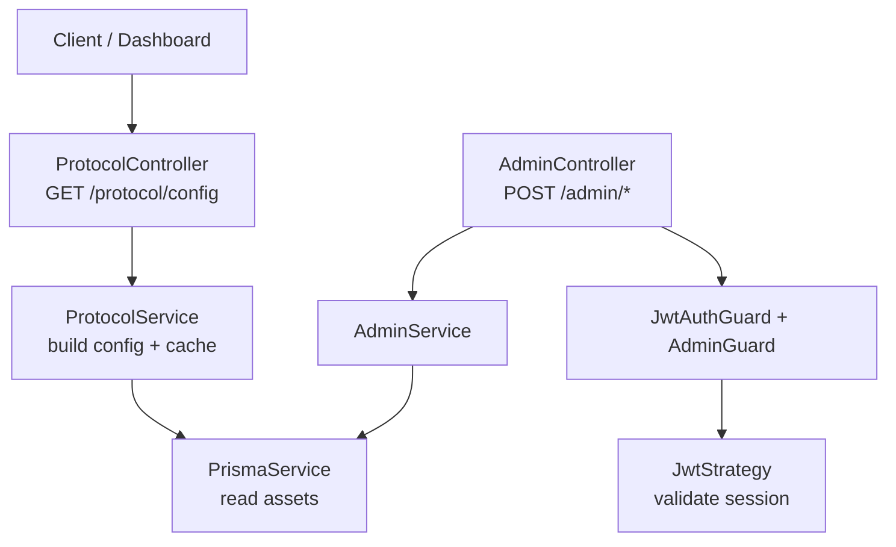
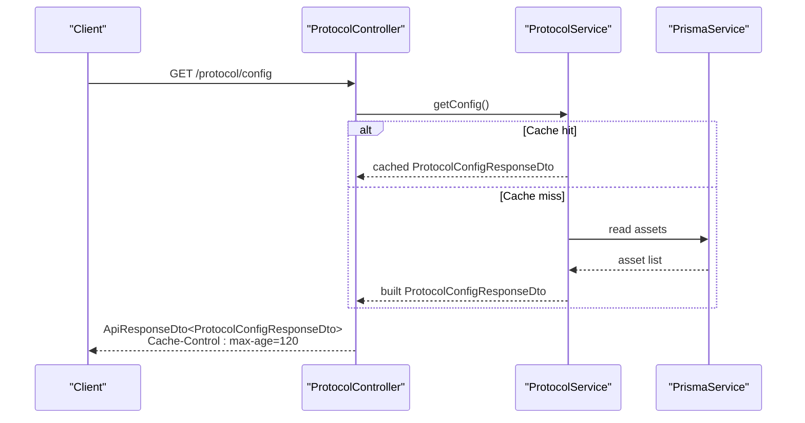
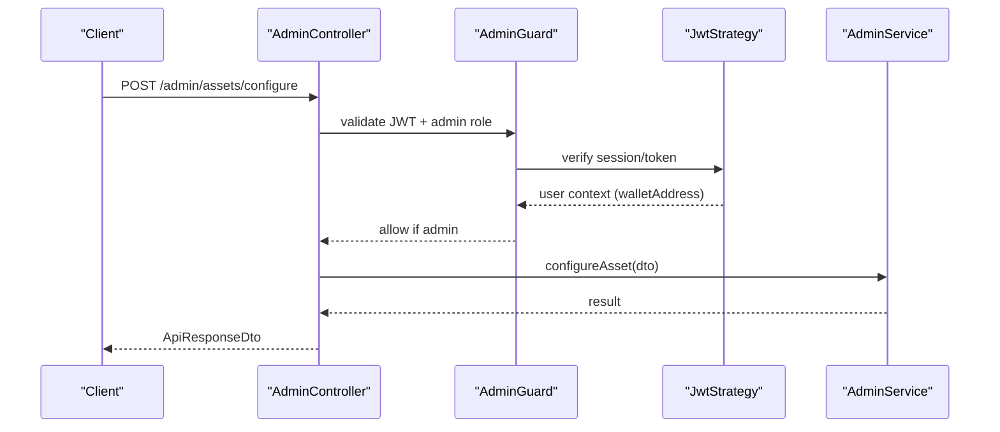
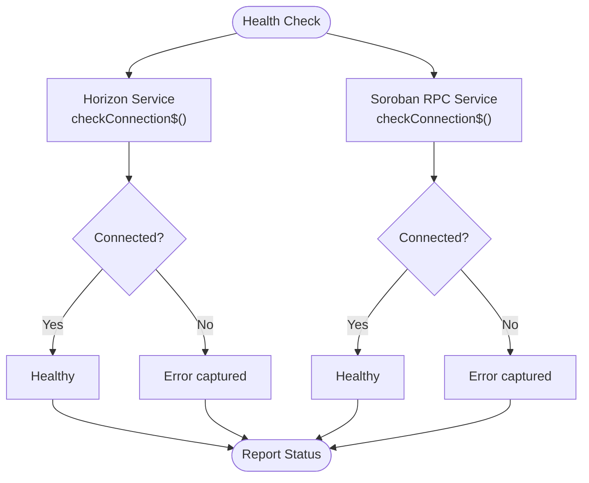
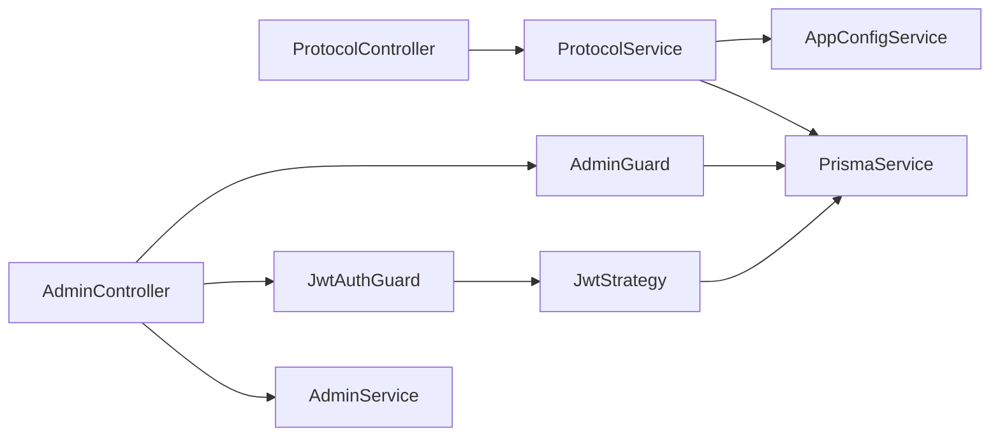

# Protocol Configuration API

<cite>
**Referenced Files in This Document**
- [protocol.controller.ts](file://veilend-backend/src/protocol/protocol.controller.ts)
- [protocol.service.ts](file://veilend-backend/src/protocol/protocol.service.ts)
- [protocol-config-response.dto.ts](file://veilend-backend/src/protocol/dto/protocol-config-response.dto.ts)
- [admin.controller.ts](file://veilend-backend/src/admin/admin.controller.ts)
- [admin.service.ts](file://veilend-backend/src/admin/admin.service.ts)
- [configure-asset.dto.ts](file://veilend-backend/src/admin/dto/configure-asset.dto.ts)
- [set-oracle-price.dto.ts](file://veilend-backend/src/admin/dto/set-oracle-price.dto.ts)
- [set-min-collateral-ratio.dto.ts](file://veilend-backend/src/admin/dto/set-min-collateral-ratio.dto.ts)
- [jwt.strategy.ts](file://veilend-backend/src/auth/jwt.strategy.ts)
- [auth.service.ts](file://veilend-backend/src/auth/auth.service.ts)
- [api-response.dto.ts](file://veilend-backend/src/common/dto/api-response.dto.ts)
</cite>

## Table of Contents
1. Introduction
2. Project Structure
3. Core Components
4. Architecture Overview
5. Detailed Component Analysis
6. Dependency Analysis
7. Performance Considerations
8. Troubleshooting Guide
9. Conclusion
10. Appendices

## Introduction
This document provides comprehensive API documentation for the VeilLend protocol configuration endpoints. It covers:
- Retrieving protocol state and configuration (public endpoint)
- Updating protocol parameters (administrative endpoints requiring JWT with admin privileges)
- Monitoring protocol health metrics via integration points
It also documents request/response schemas, validation rules, authentication requirements, and practical monitoring scenarios for dashboards and integrations.

## Project Structure
The protocol configuration feature is implemented in the backend module under src/protocol, with administrative operations under src/admin. Authentication and authorization are handled by the auth module.

**Diagram sources**
- [protocol.controller.ts:9-31](file://veilend-backend/src/protocol/protocol.controller.ts#L9-L31)
- [protocol.service.ts:32-127](file://veilend-backend/src/protocol/protocol.service.ts#L32-L127)
- [admin.controller.ts:20-55](file://veilend-backend/src/admin/admin.controller.ts#L20-L55)
- [admin.service.ts:8-57](file://veilend-backend/src/admin/admin.service.ts#L8-L57)
- [jwt.strategy.ts:13-65](file://veilend-backend/src/auth/jwt.strategy.ts#L13-L65)

**Section sources**
- [protocol.controller.ts:9-31](file://veilend-backend/src/protocol/protocol.controller.ts#L9-L31)
- [protocol.service.ts:32-127](file://veilend-backend/src/protocol/protocol.service.ts#L32-L127)
- [admin.controller.ts:20-55](file://veilend-backend/src/admin/admin.controller.ts#L20-L55)
- [admin.service.ts:8-57](file://veilend-backend/src/admin/admin.service.ts#L8-L57)
- [jwt.strategy.ts:13-65](file://veilend-backend/src/auth/jwt.strategy.ts#L13-L65)

## Core Components
- ProtocolController: Exposes a public GET /protocol/config that returns full protocol configuration with caching headers.
- ProtocolService: Builds the configuration from application config and database assets, applies default risk parameters, and caches results for a short TTL.
- AdminController: Protected endpoints to manage admins and update protocol parameters (asset configuration, oracle price, min collateral ratio).
- JwtStrategy and AdminGuard: Enforce JWT-based authentication and admin-only access.
- DTOs: Define response shapes and input validation for admin operations.

Key responsibilities:
- Public read-only view of protocol configuration
- Secure write operations for protocol parameter updates
- Validation and error handling for inputs
- Caching for performance and reduced load on data sources

**Section sources**
- [protocol.controller.ts:9-31](file://veilend-backend/src/protocol/protocol.controller.ts#L9-L31)
- [protocol.service.ts:32-127](file://veilend-backend/src/protocol/protocol.service.ts#L32-L127)
- [admin.controller.ts:20-55](file://veilend-backend/src/admin/admin.controller.ts#L20-L55)
- [jwt.strategy.ts:13-65](file://veilend-backend/src/auth/jwt.strategy.ts#L13-L65)
- [admin.guard.ts:24-47](file://veilend-backend/src/auth/admin.guard.ts#L24-L47)

## Architecture Overview
The system separates public read access from protected administrative writes. The configuration endpoint is optimized for frequent reads via in-memory caching and HTTP caching headers. Administrative endpoints enforce JWT authentication and admin role checks before executing changes.

**Diagram sources**
- [protocol.controller.ts:23-30](file://veilend-backend/src/protocol/protocol.controller.ts#L23-L30)
- [protocol.service.ts:52-79](file://veilend-backend/src/protocol/protocol.service.ts#L52-L79)
- [protocol.service.ts:102-125](file://veilend-backend/src/protocol/protocol.service.ts#L102-L125)

## Detailed Component Analysis

### Protocol Configuration Endpoint
- Method: GET
- Path: /protocol/config
- Authentication: None (public)
- Response: ApiResponseDto<ProtocolConfigResponseDto>
- Headers: Cache-Control set to public with max-age=120 seconds

Behavior:
- Returns network settings, risk parameters, per-asset risk configuration, supported asset count, and timestamp when the response was cached.
- Uses an in-memory cache with TTL to reduce database calls.

Request/Response Schema
- Response body wraps ProtocolConfigResponseDto:
  - network: NetworkConfigDto
    - network: string
    - horizonUrl: string
    - sorobanRpcUrl: string
    - networkPassphrase: string
    - contractId: string
  - riskParameters: RiskParametersDto
    - minCollateralRatio: number
    - defaultCollateralFactor: number
    - defaultLiquidationThreshold: number
    - closeFactor: number
    - liquidationIncentive: number
  - assets: AssetRiskConfigDto[]
    - code: string
    - symbol: string
    - collateralFactor: number
    - liquidationThreshold: number
    - isSupported: boolean
  - supportedAssetCount: number
  - cachedAt: string

Notes:
- Interest rates and total reserves are not exposed by this endpoint; they should be obtained from other services or on-chain queries.
- Circuit breaker status is not included here; it is governed by the underlying contract and can be monitored through indexer or RPC health endpoints.

**Section sources**
- [protocol.controller.ts:23-30](file://veilend-backend/src/protocol/protocol.controller.ts#L23-L30)
- [protocol.service.ts:52-79](file://veilend-backend/src/protocol/protocol.service.ts#L52-L79)
- [protocol-config-response.dto.ts:66-82](file://veilend-backend/src/protocol/dto/protocol-config-response.dto.ts#L66-L82)

### Administrative Endpoints
All admin endpoints require:
- Authorization: Bearer JWT token validated by JwtAuthGuard
- Role: Admin verified by AdminGuard against stored wallet address

Endpoints:
- POST /admin/admins
  - Body: AddAdminDto { walletAddress: string }
  - Purpose: Add an admin wallet address
- DELETE /admin/admins/:walletAddress
  - Path param: walletAddress: string
  - Purpose: Remove an admin wallet address
- GET /admin/admins
  - Purpose: List current admins
- POST /admin/assets/configure
  - Body: ConfigureAssetDto { assetContractId: string, supported: boolean }
  - Purpose: Configure asset support flags
- POST /admin/assets/oracle-price
  - Body: SetOraclePriceDto { assetContractId: string, price: number }
  - Purpose: Set oracle price for an asset
- POST /admin/protocol/min-collateral-ratio
  - Body: SetMinCollateralRatioDto { minCollateralRatioBps: number }
  - Purpose: Update minimum collateral ratio in basis points

Validation Rules:
- ConfigureAssetDto:
  - assetContractId must be a string
  - supported must be a boolean
- SetOraclePriceDto:
  - assetContractId must be a string
  - price must be an integer greater than or equal to 1
- SetMinCollateralRatioDto:
  - minCollateralRatioBps must be an integer greater than or equal to 10000

Authentication Flow:
- JwtAuthGuard extracts bearer token and validates signature/expiry
- JwtStrategy verifies session exists and is active in the database
- AdminGuard ensures the authenticated user’s wallet address is registered as an admin

**Diagram sources**
- [admin.controller.ts:20-55](file://veilend-backend/src/admin/admin.controller.ts#L20-L55)
- [admin.guard.ts:24-47](file://veilend-backend/src/auth/admin.guard.ts#L24-L47)
- [jwt.strategy.ts:13-65](file://veilend-backend/src/auth/jwt.strategy.ts#L13-L65)
- [admin.service.ts:30-37](file://veilend-backend/src/admin/admin.service.ts#L30-L37)

**Section sources**
- [admin.controller.ts:20-55](file://veilend-backend/src/admin/admin.controller.ts#L20-L55)
- [admin.service.ts:8-57](file://veilend-backend/src/admin/admin.service.ts#L8-L57)
- [configure-asset.dto.ts:1-10](file://veilend-backend/src/admin/dto/configure-asset.dto.ts#L1-L10)
- [set-oracle-price.dto.ts:1-11](file://veilend-backend/src/admin/dto/set-oracle-price.dto.ts#L1-L11)
- [set-min-collateral-ratio.dto.ts:1-8](file://veilend-backend/src/admin/dto/set-min-collateral-ratio.dto.ts#L1-L8)
- [jwt.strategy.ts:13-65](file://veilend-backend/src/auth/jwt.strategy.ts#L13-L65)
- [admin.guard.ts:24-47](file://veilend-backend/src/auth/admin.guard.ts#L24-L47)

### Health Monitoring Integration Points
While there is no dedicated /health endpoint in the protocol module, health-related functionality exists in Stellar integration services:
- Horizon service exposes connection checks and last error details
- Soroban RPC service exposes connection checks and last error details

These can be used to monitor external dependencies relevant to protocol operation.

**Diagram sources**
- [horizon.service.ts:83-114](file://veilend-backend/src/stellar/horizon.service.ts#L83-L114)
- [soroban-rpc.service.ts:75-123](file://veilend-backend/src/stellar/soroban-rpc.service.ts#L75-L123)

**Section sources**
- [horizon.service.ts:83-114](file://veilend-backend/src/stellar/horizon.service.ts#L83-L114)
- [soroban-rpc.service.ts:75-123](file://veilend-backend/src/stellar/soroban-rpc.service.ts#L75-L123)

## Dependency Analysis
- ProtocolController depends on ProtocolService and uses ApiResponseDto for consistent responses.
- ProtocolService depends on PrismaService for asset data and AppConfigService for network settings.
- AdminController depends on AdminService and enforces authentication via JwtAuthGuard and AdminGuard.
- JwtStrategy depends on AppConfigService for JWT secret and PrismaService for session validation.
- AdminGuard depends on PrismaService to check admin membership.

**Diagram sources**
- [protocol.controller.ts:9-31](file://veilend-backend/src/protocol/protocol.controller.ts#L9-L31)
- [protocol.service.ts:32-127](file://veilend-backend/src/protocol/protocol.service.ts#L32-L127)
- [admin.controller.ts:20-55](file://veilend-backend/src/admin/admin.controller.ts#L20-L55)
- [jwt.strategy.ts:13-65](file://veilend-backend/src/auth/jwt.strategy.ts#L13-L65)
- [admin.guard.ts:24-47](file://veilend-backend/src/auth/admin.guard.ts#L24-L47)

**Section sources**
- [protocol.controller.ts:9-31](file://veilend-backend/src/protocol/protocol.controller.ts#L9-L31)
- [protocol.service.ts:32-127](file://veilend-backend/src/protocol/protocol.service.ts#L32-L127)
- [admin.controller.ts:20-55](file://veilend-backend/src/admin/admin.controller.ts#L20-L55)
- [jwt.strategy.ts:13-65](file://veilend-backend/src/auth/jwt.strategy.ts#L13-L65)
- [admin.guard.ts:24-47](file://veilend-backend/src/auth/admin.guard.ts#L24-L47)

## Performance Considerations
- In-memory caching: ProtocolService caches configuration for 120 seconds to reduce database load and improve response times.
- HTTP caching: Responses include Cache-Control headers to enable CDN/browser caching for public configuration reads.
- Database queries: Asset risk configs are fetched once per cache window and mapped efficiently.
- Admin operations: Currently return placeholder responses; production implementations should integrate with on-chain contracts and consider batching or async processing for heavy operations.

[No sources needed since this section provides general guidance]

## Troubleshooting Guide
Common issues and resolutions:
- Unauthorized errors on admin endpoints:
  - Ensure a valid Bearer JWT is provided
  - Verify the session exists and has not expired
  - Confirm the authenticated wallet address is registered as an admin
- Invalid input on admin endpoints:
  - Validate payload fields according to DTO constraints
  - For SetOraclePriceDto, ensure price is an integer >= 1
  - For SetMinCollateralRatioDto, ensure minCollateralRatioBps is an integer >= 10000
- Configuration not updating:
  - Check that admin operations call intended services and integrate with contract interactions
  - Invalidate protocol config cache after successful updates to reflect new state

Relevant error handling paths:
- Session validation and expiration in JWT strategy
- Admin guard checks for admin role
- Validation pipe whitelisting on admin controller

**Section sources**
- [jwt.strategy.ts:35-65](file://veilend-backend/src/auth/jwt.strategy.ts#L35-L65)
- [admin.guard.ts:28-47](file://veilend-backend/src/auth/admin.guard.ts#L28-L47)
- [admin.controller.ts:20-23](file://veilend-backend/src/admin/admin.controller.ts#L20-L23)
- [configure-asset.dto.ts:1-10](file://veilend-backend/src/admin/dto/configure-asset.dto.ts#L1-L10)
- [set-oracle-price.dto.ts:1-11](file://veilend-backend/src/admin/dto/set-oracle-price.dto.ts#L1-L11)
- [set-min-collateral-ratio.dto.ts:1-8](file://veilend-backend/src/admin/dto/set-min-collateral-ratio.dto.ts#L1-L8)

## Conclusion
The VeilLend protocol configuration API provides a secure and efficient way to read protocol state and perform administrative updates. The public configuration endpoint supports caching for performance, while administrative endpoints enforce strict authentication and validation. Dashboards and integrations should use the configuration endpoint for real-time statistics and rely on admin endpoints for controlled parameter updates. Health monitoring can be achieved via Stellar service health checks.

[No sources needed since this section summarizes without analyzing specific files]

## Appendices

### Practical Monitoring Scenarios
- Checking protocol health:
  - Use Horizon and Soroban RPC health checks to confirm connectivity and capture last errors
- Retrieving current interest rates:
  - Not exposed by the protocol configuration endpoint; obtain from other services or on-chain queries
- Verifying collateral ratios:
  - Use riskParameters and per-asset collateralFactor/liquidationThreshold from the configuration endpoint to compute expected thresholds
- Real-time dashboard integration:
  - Poll GET /protocol/config respecting Cache-Control headers
  - Cache locally and refresh on expiry or after admin updates
  - Display supportedAssetCount and asset-specific risk parameters

**Section sources**
- [protocol.controller.ts:23-30](file://veilend-backend/src/protocol/protocol.controller.ts#L23-L30)
- [protocol.service.ts:52-79](file://veilend-backend/src/protocol/protocol.service.ts#L52-L79)
- [protocol-config-response.dto.ts:66-82](file://veilend-backend/src/protocol/dto/protocol-config-response.dto.ts#L66-L82)

### Configuration Versioning and Rollback Procedures
- Current implementation does not include explicit versioning or rollback mechanisms for configuration changes.
- Recommended approach:
  - Introduce a versioned configuration store with change history
  - Implement rollback by reverting to previous versions
  - Audit log all configuration changes with timestamps and actor identity
  - Invalidate protocol config cache after updates to ensure consistency

[No sources needed since this section provides general guidance]

### API Response Wrapper
All responses follow a consistent structure:
- success: boolean
- data?: any
- error?: { code: string, message: string, details?: unknown }
- meta?: unknown

Use ApiResponseDto.success for successful responses and ApiResponseDto.fail for errors.

**Section sources**
- [api-response.dto.ts:1-38](file://veilend-backend/src/common/dto/api-response.dto.ts#L1-L38)