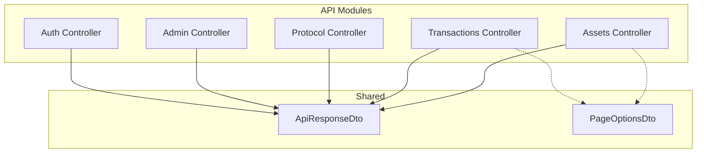
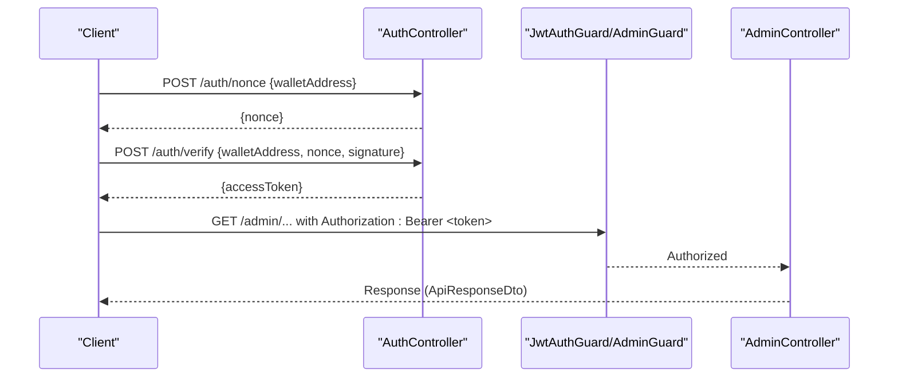
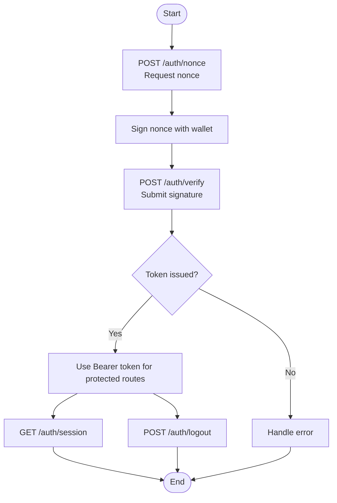
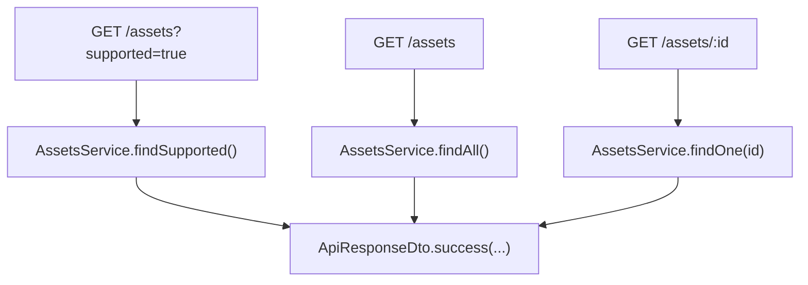
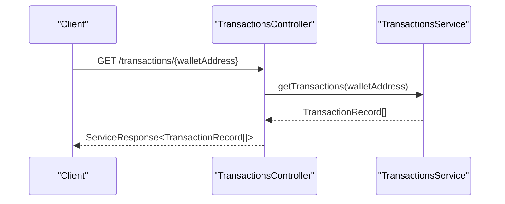
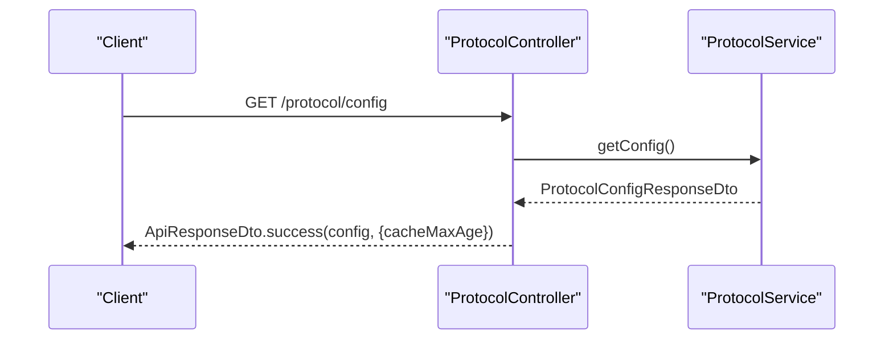
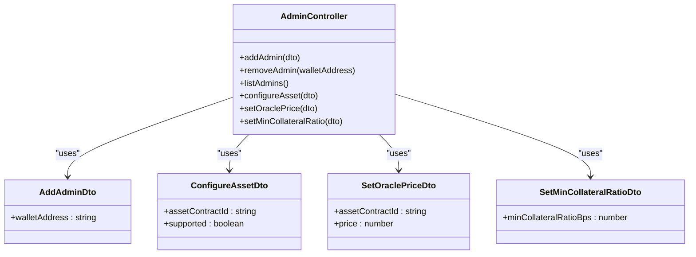
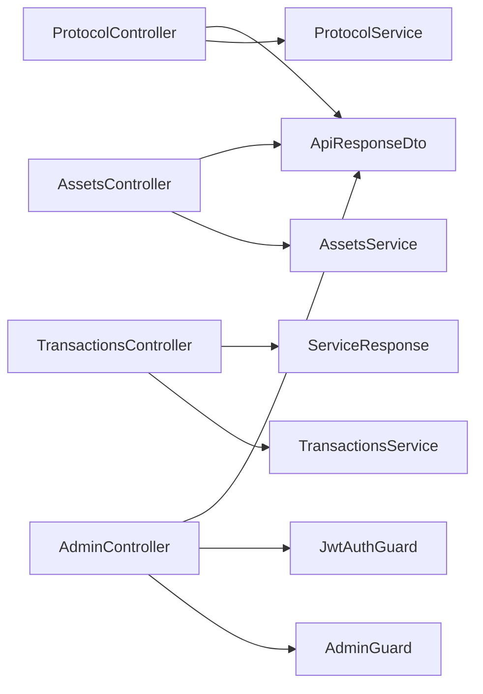
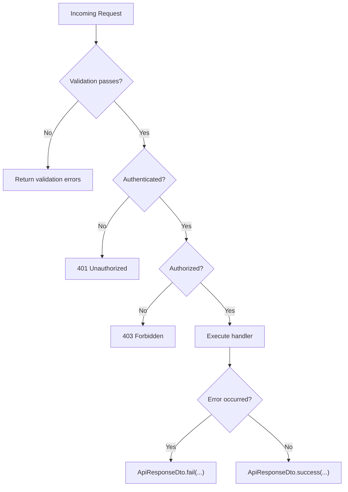

# REST API Endpoints

<cite>
**Referenced Files in This Document**
- [assets.controller.ts](file://veilend-backend/src/assets/assets.controller.ts)
- [asset-response.dto.ts](file://veilend-backend/src/assets/dto/asset-response.dto.ts)
- [transactions.controller.ts](file://veilend-backend/src/transactions/transactions.controller.ts)
- [protocol.controller.ts](file://veilend-backend/src/protocol/protocol.controller.ts)
- [admin.controller.ts](file://veilend-backend/src/admin/admin.controller.ts)
- [configure-asset.dto.ts](file://veilend-backend/src/admin/dto/configure-asset.dto.ts)
- [set-oracle-price.dto.ts](file://veilend-backend/src/admin/dto/set-oracle-price.dto.ts)
- [set-min-collateral-ratio.dto.ts](file://veilend-backend/src/admin/dto/set-min-collateral-ratio.dto.ts)
- [add-admin.dto.ts](file://veilend-backend/src/admin/dto/add-admin.dto.ts)
- [auth.controller.ts](file://veilend-backend/src/auth/auth.controller.ts)
- [nonce.dto.ts](file://veilend-backend/src/auth/dto/nonce.dto.ts)
- [verify-wallet.dto.ts](file://veilend-backend/src/auth/dto/verify-wallet.dto.ts)
- [session-response.dto.ts](file://veilend-backend/src/auth/dto/session-response.dto.ts)
- [jwt-auth.guard.ts](file://veilend-backend/src/auth/jwt-auth.guard.ts)
- [admin.guard.ts](file://veilend-backend/src/auth/admin.guard.ts)
- [api-response.dto.ts](file://veilend-backend/src/common/dto/api-response.dto.ts)
- [page-options.dto.ts](file://veilend-backend/src/common/dto/page-options.dto.ts)
</cite>

## Table of Contents
1. Introduction
2. Project Structure
3. Core Components
4. Architecture Overview
5. Detailed Component Analysis
6. Dependency Analysis
7. Performance Considerations
8. Troubleshooting Guide
9. Conclusion
10. Appendices

## Introduction
This document provides detailed REST API documentation for the VeilLend backend services. It covers asset management, transaction queries, protocol configuration, authentication with JWT tokens, and administrative operations. For each endpoint, you will find HTTP methods, URL patterns, request/response schemas, authentication requirements, error formats, pagination support, filtering options, and practical usage examples. Integration guidelines for frontend applications and third-party clients are included at the end.

## Project Structure
The backend is organized by feature modules under src:
- assets: Asset metadata endpoints
- transactions: Transaction query endpoints
- protocol: Protocol configuration endpoints
- admin: Administrative endpoints protected by JWT and admin guard
- auth: Wallet-based authentication flow issuing JWT sessions
- common: Shared DTOs and utilities (API response envelope, pagination options)

**Diagram sources**
- [assets.controller.ts:16-56](file://veilend-backend/src/assets/assets.controller.ts#L16-L56)
- [transactions.controller.ts:5-14](file://veilend-backend/src/transactions/transactions.controller.ts#L5-L14)
- [protocol.controller.ts:9-31](file://veilend-backend/src/protocol/protocol.controller.ts#L9-L31)
- [admin.controller.ts:20-55](file://veilend-backend/src/admin/admin.controller.ts#L20-L55)
- [auth.controller.ts:14-57](file://veilend-backend/src/auth/auth.controller.ts#L14-L57)
- [api-response.dto.ts:1-38](file://veilend-backend/src/common/dto/api-response.dto.ts#L1-L38)
- [page-options.dto.ts:1-31](file://veilend-backend/src/common/dto/page-options.dto.ts#L1-L31)

**Section sources**
- [assets.controller.ts:16-56](file://veilend-backend/src/assets/assets.controller.ts#L16-L56)
- [transactions.controller.ts:5-14](file://veilend-backend/src/transactions/transactions.controller.ts#L5-L14)
- [protocol.controller.ts:9-31](file://veilend-backend/src/protocol/protocol.controller.ts#L9-L31)
- [admin.controller.ts:20-55](file://veilend-backend/src/admin/admin.controller.ts#L20-L55)
- [auth.controller.ts:14-57](file://veilend-backend/src/auth/auth.controller.ts#L14-L57)
- [api-response.dto.ts:1-38](file://veilend-backend/src/common/dto/api-response.dto.ts#L1-L38)
- [page-options.dto.ts:1-31](file://veilend-backend/src/common/dto/page-options.dto.ts#L1-L31)

## Core Components
- Assets: Public endpoints to list or fetch a single asset with optional filtering and caching headers.
- Transactions: Public endpoint to retrieve transactions for a wallet address.
- Protocol: Public endpoint to read protocol configuration with caching headers.
- Admin: Protected endpoints to manage admins, configure assets, set oracle prices, and adjust protocol parameters.
- Auth: Wallet-based login flow returning JWT sessions; session introspection and logout.

Authentication:
- JWT-based via JwtAuthGuard for protected routes.
- Admin-only routes additionally require AdminGuard.

Response envelope:
- ApiResponseDto wraps data with success flag, optional error object, and meta.

Pagination:
- PageOptionsDto defines standard page, take, order, and computed skip for consistent pagination across endpoints.

**Section sources**
- [assets.controller.ts:16-56](file://veilend-backend/src/assets/assets.controller.ts#L16-L56)
- [transactions.controller.ts:5-14](file://veilend-backend/src/transactions/transactions.controller.ts#L5-L14)
- [protocol.controller.ts:9-31](file://veilend-backend/src/protocol/protocol.controller.ts#L9-L31)
- [admin.controller.ts:20-55](file://veilend-backend/src/admin/admin.controller.ts#L20-L55)
- [auth.controller.ts:14-57](file://veilend-backend/src/auth/auth.controller.ts#L14-L57)
- [api-response.dto.ts:1-38](file://veilend-backend/src/common/dto/api-response.dto.ts#L1-L38)
- [page-options.dto.ts:1-31](file://veilend-backend/src/common/dto/page-options.dto.ts#L1-L31)

## Architecture Overview
High-level flow for authenticated requests:
- Client calls /auth/nonce to obtain a nonce for signing.
- Client signs the nonce and calls /auth/verify to receive a JWT session.
- Subsequent requests include Authorization: Bearer <JWT>.
- Protected routes validate JWT via JwtAuthGuard; admin routes also enforce AdminGuard.

**Diagram sources**
- [auth.controller.ts:20-57](file://veilend-backend/src/auth/auth.controller.ts#L20-L57)
- [jwt-auth.guard.ts](file://veilend-backend/src/auth/jwt-auth.guard.ts)
- [admin.guard.ts](file://veilend-backend/src/auth/admin.guard.ts)
- [admin.controller.ts:20-55](file://veilend-backend/src/admin/admin.controller.ts#L20-L55)

## Detailed Component Analysis

### Authentication API
- POST /auth/nonce
  - Purpose: Request a one-time nonce for wallet signature verification.
  - Request body: NonceDto
    - walletAddress: string
  - Response: { nonce: string }
  - Notes: No authentication required.

- POST /auth/verify
  - Purpose: Verify wallet ownership using a signed nonce and issue a JWT session.
  - Request body: VerifyWalletDto
    - walletAddress: string
    - nonce: string
    - signature: string
  - Response: JWT access token (as returned by AuthService).
  - Notes: No authentication required.

- GET /auth/session
  - Purpose: Return current session details for an authenticated user.
  - Headers: Authorization: Bearer <JWT>
  - Response: SessionResponseDto
    - walletAddress: string
    - sessionId: string
    - expiresAt: string (ISO timestamp)
  - Notes: Requires valid JWT.

- POST /auth/logout
  - Purpose: Revoke the current session.
  - Headers: Authorization: Bearer <JWT>
  - Response: { revoked: boolean }
  - Notes: Requires valid JWT.

**Diagram sources**
- [auth.controller.ts:20-57](file://veilend-backend/src/auth/auth.controller.ts#L20-L57)
- [nonce.dto.ts:1-7](file://veilend-backend/src/auth/dto/nonce.dto.ts#L1-L7)
- [verify-wallet.dto.ts:1-13](file://veilend-backend/src/auth/dto/verify-wallet.dto.ts#L1-L13)
- [session-response.dto.ts:1-6](file://veilend-backend/src/auth/dto/session-response.dto.ts#L1-L6)

**Section sources**
- [auth.controller.ts:20-57](file://veilend-backend/src/auth/auth.controller.ts#L20-L57)
- [nonce.dto.ts:1-7](file://veilend-backend/src/auth/dto/nonce.dto.ts#L1-L7)
- [verify-wallet.dto.ts:1-13](file://veilend-backend/src/auth/dto/verify-wallet.dto.ts#L1-L13)
- [session-response.dto.ts:1-6](file://veilend-backend/src/auth/dto/session-response.dto.ts#L1-L6)

### Assets API
- GET /assets
  - Query params:
    - supported: string (optional) — when "true", returns only configured/supported assets.
  - Response: ApiResponseDto<AssetResponseDto[]>
    - data: array of AssetResponseDto
      - code: string
      - symbol: string
      - name: string
      - decimals: number
      - issuer: string | null
      - contractId: string | null
      - logoUrl: string | null
      - isNative: boolean
      - isSupported: boolean
  - Headers: Cache-Control: public, max-age=60
  - Notes: Public endpoint.

- GET /assets/:id
  - Path param: id — supports UUID, code (e.g., "USDC"), or contractId.
  - Response: ApiResponseDto<AssetResponseDto>
  - Headers: Cache-Control: public, max-age=60
  - Notes: Returns 404 if not found.

**Diagram sources**
- [assets.controller.ts:20-56](file://veilend-backend/src/assets/assets.controller.ts#L20-L56)
- [asset-response.dto.ts:1-35](file://veilend-backend/src/assets/dto/asset-response.dto.ts#L1-L35)
- [api-response.dto.ts:1-38](file://veilend-backend/src/common/dto/api-response.dto.ts#L1-L38)

**Section sources**
- [assets.controller.ts:20-56](file://veilend-backend/src/assets/assets.controller.ts#L20-L56)
- [asset-response.dto.ts:1-35](file://veilend-backend/src/assets/dto/asset-response.dto.ts#L1-L35)
- [api-response.dto.ts:1-38](file://veilend-backend/src/common/dto/api-response.dto.ts#L1-L38)

### Transactions API
- GET /transactions/:walletAddress
  - Path param: walletAddress — string
  - Response: ServiceResponse<TransactionRecord[]>
  - Notes: Public endpoint. Pagination and filtering are not implemented in this controller; use service layer if extended.

**Diagram sources**
- [transactions.controller.ts:5-14](file://veilend-backend/src/transactions/transactions.controller.ts#L5-L14)

**Section sources**
- [transactions.controller.ts:5-14](file://veilend-backend/src/transactions/transactions.controller.ts#L5-L14)

### Protocol Configuration API
- GET /protocol/config
  - Purpose: Retrieve full protocol configuration including network settings, risk parameters, and per-asset risk config.
  - Response: ApiResponseDto<ProtocolConfigResponseDto>
  - Headers: Cache-Control: public, max-age=120
  - Notes: Public endpoint.

**Diagram sources**
- [protocol.controller.ts:13-31](file://veilend-backend/src/protocol/protocol.controller.ts#L13-L31)

**Section sources**
- [protocol.controller.ts:13-31](file://veilend-backend/src/protocol/protocol.controller.ts#L13-L31)

### Admin API
Protected by JwtAuthGuard and AdminGuard. All endpoints return ApiResponseDto unless otherwise specified.

- POST /admin/admins
  - Purpose: Add an admin wallet address.
  - Request body: AddAdminDto
    - walletAddress: string
  - Response: ApiResponseDto

- DELETE /admin/admins/:walletAddress
  - Purpose: Remove an admin wallet address.
  - Path param: walletAddress — string
  - Response: ApiResponseDto

- GET /admin/admins
  - Purpose: List all admins.
  - Response: ApiResponseDto

- POST /admin/assets/configure
  - Purpose: Configure asset support status.
  - Request body: ConfigureAssetDto
    - assetContractId: string
    - supported: boolean
  - Response: ApiResponseDto

- POST /admin/assets/oracle-price
  - Purpose: Set oracle price for an asset.
  - Request body: SetOraclePriceDto
    - assetContractId: string
    - price: number (>= 1)
  - Response: ApiResponseDto

- POST /admin/protocol/min-collateral-ratio
  - Purpose: Set minimum collateral ratio in basis points.
  - Request body: SetMinCollateralRatioDto
    - minCollateralRatioBps: number (>= 10000)
  - Response: ApiResponseDto

**Diagram sources**
- [admin.controller.ts:20-55](file://veilend-backend/src/admin/admin.controller.ts#L20-L55)
- [add-admin.dto.ts:1-7](file://veilend-backend/src/admin/dto/add-admin.dto.ts#L1-L7)
- [configure-asset.dto.ts:1-10](file://veilend-backend/src/admin/dto/configure-asset.dto.ts#L1-L10)
- [set-oracle-price.dto.ts:1-11](file://veilend-backend/src/admin/dto/set-oracle-price.dto.ts#L1-L11)
- [set-min-collateral-ratio.dto.ts:1-8](file://veilend-backend/src/admin/dto/set-min-collateral-ratio.dto.ts#L1-L8)

**Section sources**
- [admin.controller.ts:20-55](file://veilend-backend/src/admin/admin.controller.ts#L20-L55)
- [add-admin.dto.ts:1-7](file://veilend-backend/src/admin/dto/add-admin.dto.ts#L1-L7)
- [configure-asset.dto.ts:1-10](file://veilend-backend/src/admin/dto/configure-asset.dto.ts#L1-L10)
- [set-oracle-price.dto.ts:1-11](file://veilend-backend/src/admin/dto/set-oracle-price.dto.ts#L1-L11)
- [set-min-collateral-ratio.dto.ts:1-8](file://veilend-backend/src/admin/dto/set-min-collateral-ratio.ts#L1-L8)

## Dependency Analysis
- Controllers depend on their respective services for business logic.
- Admin routes depend on JwtAuthGuard and AdminGuard for authorization.
- Public endpoints rely on ApiResponseDto for consistent responses and may set Cache-Control headers.
- Pagination schema (PageOptionsDto) is available for future extensions.

**Diagram sources**
- [assets.controller.ts:16-56](file://veilend-backend/src/assets/assets.controller.ts#L16-L56)
- [transactions.controller.ts:5-14](file://veilend-backend/src/transactions/transactions.controller.ts#L5-L14)
- [protocol.controller.ts:9-31](file://veilend-backend/src/protocol/protocol.controller.ts#L9-L31)
- [admin.controller.ts:20-55](file://veilend-backend/src/admin/admin.controller.ts#L20-L55)
- [api-response.dto.ts:1-38](file://veilend-backend/src/common/dto/api-response.dto.ts#L1-L38)

**Section sources**
- [assets.controller.ts:16-56](file://veilend-backend/src/assets/assets.controller.ts#L16-L56)
- [transactions.controller.ts:5-14](file://veilend-backend/src/transactions/transactions.controller.ts#L5-L14)
- [protocol.controller.ts:9-31](file://veilend-backend/src/protocol/protocol.controller.ts#L9-L31)
- [admin.controller.ts:20-55](file://veilend-backend/src/admin/admin.controller.ts#L20-L55)
- [api-response.dto.ts:1-38](file://veilend-backend/src/common/dto/api-response.dto.ts#L1-L38)

## Performance Considerations
- Caching:
  - Assets endpoints set Cache-Control: public, max-age=60.
  - Protocol config sets Cache-Control: public, max-age=120.
  - Clients should honor these headers for CDN/browser caching.
- Pagination:
  - PageOptionsDto supports page, take, order, and computed skip. While not currently applied in controllers, it can be used to paginate large datasets consistently.
- Rate limiting:
  - Not explicitly implemented in controllers. Apply rate limiting at the gateway/proxy layer (e.g., reverse proxy) to protect endpoints from abuse.
- Content types:
  - JSON payloads expected for POST bodies. Ensure Content-Type: application/json.

[No sources needed since this section provides general guidance]

## Troubleshooting Guide
Common errors and handling:
- Validation errors:
  - When using ValidationPipe (enabled on admin routes), invalid payloads return validation errors with field-specific messages.
- Not found:
  - GET /assets/:id throws NotFoundException when the asset does not exist.
- Authentication failures:
  - Missing or invalid JWT results in 401 Unauthorized on protected routes.
- Authorization failures:
  - Valid JWT but insufficient permissions result in 403 Forbidden on admin routes.

Error response format:
- ApiResponseDto.fail(code, message, details?) returns:
  - success: false
  - error: { code, message, details? }

**Diagram sources**
- [admin.controller.ts:20-23](file://veilend-backend/src/admin/admin.controller.ts#L20-L23)
- [assets.controller.ts:45-56](file://veilend-backend/src/assets/assets.controller.ts#L45-L56)
- [api-response.dto.ts:23-36](file://veilend-backend/src/common/dto/api-response.dto.ts#L23-L36)

**Section sources**
- [admin.controller.ts:20-23](file://veilend-backend/src/admin/admin.controller.ts#L20-L23)
- [assets.controller.ts:45-56](file://veilend-backend/src/assets/assets.controller.ts#L45-L56)
- [api-response.dto.ts:23-36](file://veilend-backend/src/common/dto/api-response.dto.ts#L23-L36)

## Conclusion
VeilLend’s backend exposes a clear, secure, and cache-friendly REST API. Public endpoints provide asset metadata, transaction history, and protocol configuration. Admin endpoints are protected by JWT and admin guards for sensitive operations. The standardized ApiResponseDto ensures consistent error handling and metadata. Clients should implement JWT-based authentication, respect caching headers, and leverage pagination where applicable.

[No sources needed since this section summarizes without analyzing specific files]

## Appendices

### Common Use Cases and Examples
- Authenticate a wallet and call a protected endpoint:
  - POST /auth/nonce with { walletAddress }
  - Sign the returned nonce offline
  - POST /auth/verify with { walletAddress, nonce, signature }
  - Include Authorization: Bearer <token> in subsequent requests
- Fetch supported assets:
  - GET /assets?supported=true
  - Expect ApiResponseDto with cached metadata
- Read protocol configuration:
  - GET /protocol/config
  - Expect ApiResponseDto with network and risk parameters
- Configure an asset (admin):
  - POST /admin/assets/configure with { assetContractId, supported }
  - Requires JWT and admin privileges

[No sources needed since this section provides general guidance]

### CORS, Versioning, and Integration Guidelines
- CORS:
  - Configure allowed origins, methods, and headers at the server or reverse proxy to allow your frontend domains.
- Content types:
  - Use application/json for request bodies and expect JSON responses.
- API versioning:
  - Consider prefixing routes with a version (e.g., /v1/) to evolve the API without breaking clients.
- Pagination:
  - Use PageOptionsDto fields (page, take, order) to build consistent pagination across endpoints.
- Security:
  - Store JWT securely and refresh before expiration using /auth/session and /auth/logout.
  - Enforce HTTPS in production.

[No sources needed since this section provides general guidance]