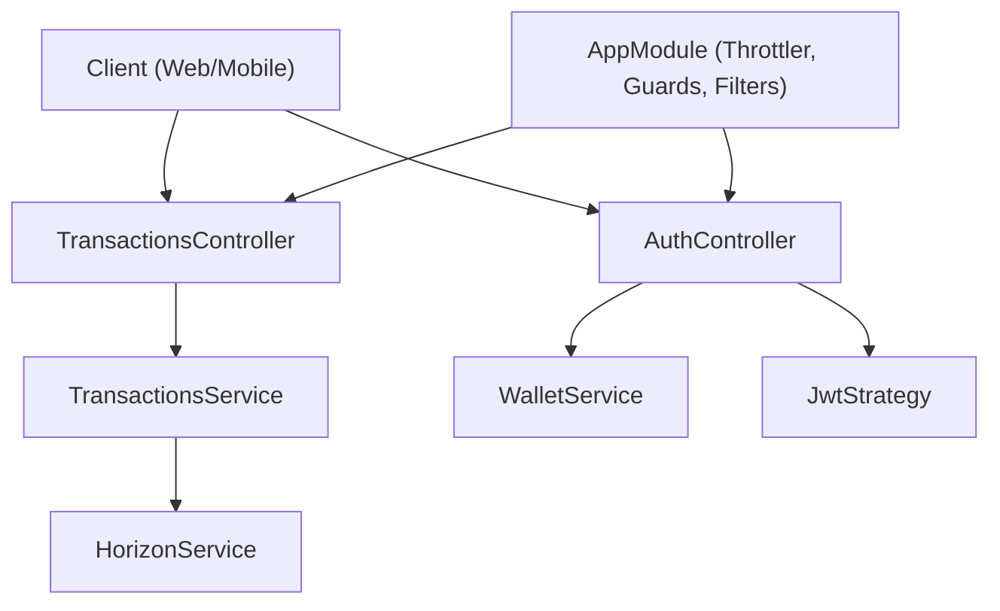
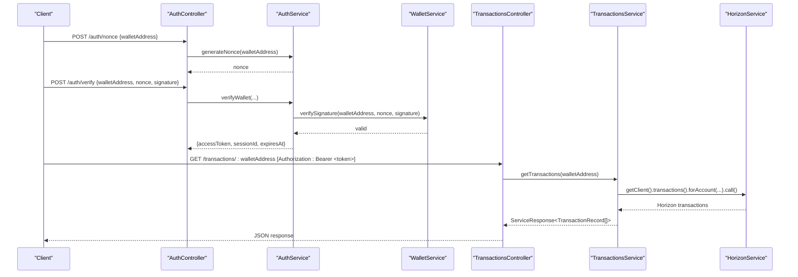
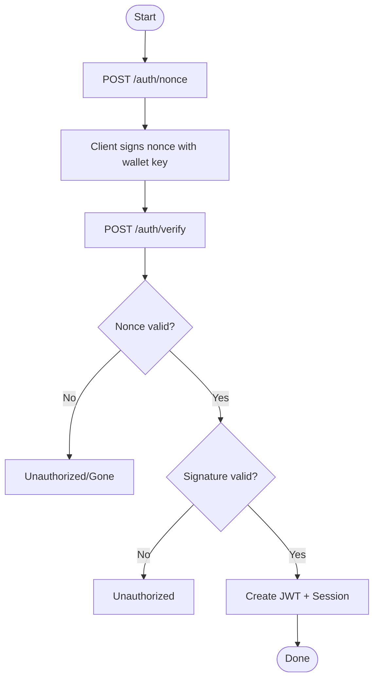
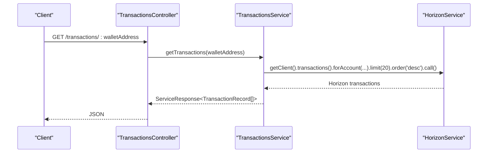
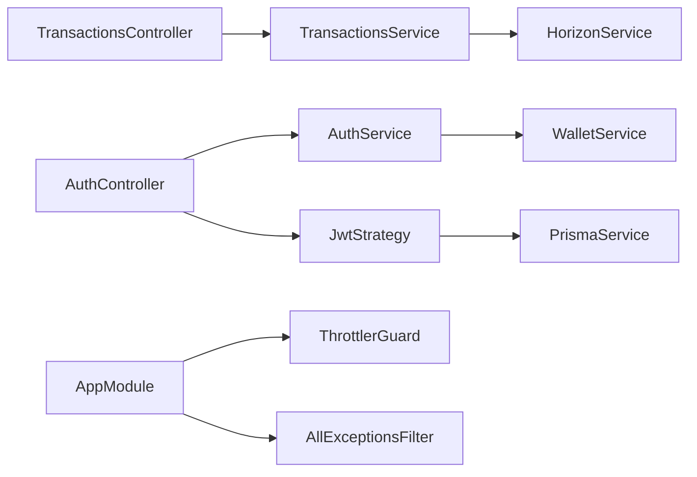

# Transaction API

<cite>
**Referenced Files in This Document**
- [transactions.controller.ts](file://veilend-backend/src/transactions/transactions.controller.ts)
- [transactions.service.ts](file://veilend-backend/src/transactions/transactions.service.ts)
- [auth.controller.ts](file://veilend-backend/src/auth/auth.controller.ts)
- [auth.service.ts](file://veilend-backend/src/auth/auth.service.ts)
- [jwt.strategy.ts](file://veilend-backend/src/auth/jwt.strategy.ts)
- [jwt-auth.guard.ts](file://veilend-backend/src/auth/jwt-auth.guard.ts)
- [wallet.service.ts](file://veilend-backend/src/wallet/wallet.service.ts)
- [horizon.service.ts](file://veilend-backend/src/stellar/horizon.service.ts)
- [types.ts](file://veilend-backend/src/stellar/types.ts)
- [nonce.dto.ts](file://veilend-backend/src/auth/dto/nonce.dto.ts)
- [verify-wallet.dto.ts](file://veilend-backend/src/auth/dto/verify-wallet.dto.ts)
- [session-response.dto.ts](file://veilend-backend/src/auth/dto/session-response.dto.ts)
- [api-response.dto.ts](file://veilend-backend/src/common/dto/api-response.dto.ts)
- [all-exceptions.filter.ts](file://veilend-backend/src/common/logging/all-exceptions.filter.ts)
- [app.module.ts](file://veilend-backend/src/app.module.ts)
</cite>

## Table of Contents
1. Introduction
2. Project Structure
3. Core Components
4. Architecture Overview
5. Detailed Component Analysis
6. Dependency Analysis
7. Performance Considerations
8. Troubleshooting Guide
9. Conclusion

## Introduction
This document provides detailed API documentation for VeilLend transaction endpoints with a focus on:
- Transaction querying endpoints to retrieve transaction history and status from the Stellar network via Horizon.
- Authentication using wallet-based sign-in with JWT tokens for protected endpoints.
- Error handling, rate limiting, and integration patterns for mobile and web clients that require real-time transaction status updates.

Note: The current repository exposes transaction querying through Horizon and does not include a server-side transaction submission endpoint. Clients are expected to build and submit transactions directly to the Stellar network and then query results via the provided endpoints.

## Project Structure
The backend is a NestJS application organized by feature modules:
- Transactions module: reads recent transactions for a wallet address from Horizon and returns normalized records.
- Auth module: issues nonces, verifies wallet signatures, creates sessions, and validates JWTs.
- Stellar module: manages Horizon client lifecycle and health checks.
- Common modules: global exception filter, API response shape, and rate limiting via ThrottlerModule.

**Diagram sources**
- [transactions.controller.ts:5-14](file://veilend-backend/src/transactions/transactions.controller.ts#L5-L14)
- [transactions.service.ts:15-85](file://veilend-backend/src/transactions/transactions.service.ts#L15-L85)
- [auth.controller.ts:14-58](file://veilend-backend/src/auth/auth.controller.ts#L14-L58)
- [jwt.strategy.ts:14-65](file://veilend-backend/src/auth/jwt.strategy.ts#L14-L65)
- [horizon.service.ts:8-115](file://veilend-backend/src/stellar/horizon.service.ts#L8-L115)
- [wallet.service.ts:4-17](file://veilend-backend/src/wallet/wallet.service.ts#L4-L17)
- [app.module.ts:28-83](file://veilend-backend/src/app.module.ts#L28-L83)

**Section sources**
- [transactions.controller.ts:5-14](file://veilend-backend/src/transactions/transactions.controller.ts#L5-L14)
- [transactions.service.ts:15-85](file://veilend-backend/src/transactions/transactions.service.ts#L15-L85)
- [auth.controller.ts:14-58](file://veilend-backend/src/auth/auth.controller.ts#L14-L58)
- [app.module.ts:28-83](file://veilend-backend/src/app.module.ts#L28-L83)

## Core Components
- TransactionsController: GET /transactions/:walletAddress returns recent transactions for a wallet address.
- TransactionsService: Queries Horizon for account transactions, normalizes them into typed records, and handles errors.
- AuthController: POST /auth/nonce, POST /auth/verify, GET /auth/session (protected), POST /auth/logout (protected).
- AuthService: Generates nonces, verifies wallet signatures, creates sessions, validates sessions, revokes sessions.
- JwtStrategy: Validates bearer tokens and ensures session exists and is active.
- HorizonService: Manages Horizon client initialization and connection health.
- WalletService: Verifies Stellar wallet signatures.
- Global Exception Filter: Normalizes error responses and adds correlation IDs.
- Rate Limiting: ThrottlerModule configured at app level.

**Section sources**
- [transactions.controller.ts:5-14](file://veilend-backend/src/transactions/transactions.controller.ts#L5-L14)
- [transactions.service.ts:21-85](file://veilend-backend/src/transactions/transactions.service.ts#L21-L85)
- [auth.controller.ts:20-58](file://veilend-backend/src/auth/auth.controller.ts#L20-L58)
- [auth.service.ts:36-203](file://veilend-backend/src/auth/auth.service.ts#L36-L203)
- [jwt.strategy.ts:14-65](file://veilend-backend/src/auth/jwt.strategy.ts#L14-L65)
- [horizon.service.ts:8-115](file://veilend-backend/src/stellar/horizon.service.ts#L8-L115)
- [wallet.service.ts:4-17](file://veilend-backend/src/wallet/wallet.service.ts#L4-L17)
- [all-exceptions.filter.ts:13-57](file://veilend-backend/src/common/logging/all-exceptions.filter.ts#L13-L57)
- [app.module.ts:42-50](file://veilend-backend/src/app.module.ts#L42-L50)

## Architecture Overview
The API follows a layered architecture:
- Controllers expose HTTP endpoints.
- Services implement business logic and integrate with external systems (Stellar Horizon).
- Guards and strategies enforce authentication.
- A global exception filter standardizes error responses.
- Rate limiting is applied globally via ThrottlerModule.

**Diagram sources**
- [auth.controller.ts:20-58](file://veilend-backend/src/auth/auth.controller.ts#L20-L58)
- [auth.service.ts:36-149](file://veilend-backend/src/auth/auth.service.ts#L36-L149)
- [wallet.service.ts:6-15](file://veilend-backend/src/wallet/wallet.service.ts#L6-L15)
- [transactions.controller.ts:9-14](file://veilend-backend/src/transactions/transactions.controller.ts#L9-L14)
- [transactions.service.ts:21-85](file://veilend-backend/src/transactions/transactions.service.ts#L21-L85)
- [horizon.service.ts:17-44](file://veilend-backend/src/stellar/horizon.service.ts#L17-L44)

## Detailed Component Analysis

### Authentication Endpoints
- POST /auth/nonce
  - Request body: NonceDto
    - walletAddress: string
  - Response: { nonce: string }
  - Behavior: Creates a one-time nonce with TTL; invalidates prior unused nonces for the same wallet.

- POST /auth/verify
  - Request body: VerifyWalletDto
    - walletAddress: string
    - nonce: string
    - signature: string (base64-encoded Stellar signature over the nonce)
  - Response: { accessToken: string, sessionId: string, expiresAt: string }
  - Behavior: Validates nonce existence, expiry, one-time use, and signature; creates or upserts user; issues JWT; persists session.

- GET /auth/session (Protected)
  - Headers: Authorization: Bearer <JWT>
  - Response: SessionResponseDto
    - walletAddress: string
    - sessionId: string
    - expiresAt: string
  - Behavior: Returns current session info if token is valid and session exists.

- POST /auth/logout (Protected)
  - Headers: Authorization: Bearer <JWT>
  - Response: { revoked: boolean }
  - Behavior: Revokes session by ID; idempotent.

Authentication flow highlights:
- Nonce TTL prevents replay within a short window.
- Signature verification uses Stellar Keypair.verify against the nonce message.
- JWT validation includes checking session existence and expiry.

**Diagram sources**
- [auth.controller.ts:20-58](file://veilend-backend/src/auth/auth.controller.ts#L20-L58)
- [auth.service.ts:36-149](file://veilend-backend/src/auth/auth.service.ts#L36-L149)
- [wallet.service.ts:6-15](file://veilend-backend/src/wallet/wallet.service.ts#L6-L15)

**Section sources**
- [auth.controller.ts:20-58](file://veilend-backend/src/auth/auth.controller.ts#L20-L58)
- [auth.service.ts:36-149](file://veilend-backend/src/auth/auth.service.ts#L36-L149)
- [jwt.strategy.ts:14-65](file://veilend-backend/src/auth/jwt.strategy.ts#L14-L65)
- [jwt-auth.guard.ts:1-6](file://veilend-backend/src/auth/jwt-auth.guard.ts#L1-L6)
- [nonce.dto.ts:1-7](file://veilend-backend/src/auth/dto/nonce.dto.ts#L1-L7)
- [verify-wallet.dto.ts:1-13](file://veilend-backend/src/auth/dto/verify-wallet.dto.ts#L1-L13)
- [session-response.dto.ts:1-6](file://veilend-backend/src/auth/dto/session-response.dto.ts#L1-L6)

### Transaction Query Endpoint
- GET /transactions/:walletAddress
  - Path parameter: walletAddress (string)
  - Headers: Optional Authorization header for future protection; currently public.
  - Response: ServiceResponse<TransactionRecord[]>
    - success: boolean
    - data: TransactionRecord[]
      - id: string
      - type: 'deposit' | 'withdraw' | 'borrow' | 'repay' | 'transfer'
      - amount: number
      - asset: string
      - timestamp: string
      - status: string ('success' | 'failed')
      - txHash: string
  - Behavior: Fetches up to 20 most recent transactions for the account from Horizon, infers type from operations, maps successful flag to status.

**Diagram sources**
- [transactions.controller.ts:9-14](file://veilend-backend/src/transactions/transactions.controller.ts#L9-L14)
- [transactions.service.ts:21-85](file://veilend-backend/src/transactions/transactions.service.ts#L21-L85)
- [horizon.service.ts:17-44](file://veilend-backend/src/stellar/horizon.service.ts#L17-L44)

**Section sources**
- [transactions.controller.ts:5-14](file://veilend-backend/src/transactions/transactions.controller.ts#L5-L14)
- [transactions.service.ts:5-85](file://veilend-backend/src/transactions/transactions.service.ts#L5-L85)
- [types.ts:1-10](file://veilend-backend/src/stellar/types.ts#L1-L10)

### Transaction Submission (Current State and Guidance)
- No server-side submission endpoint is implemented in this repository.
- Recommended client workflow:
  - Build and sign a Stellar transaction locally using your wallet SDK.
  - Submit the transaction to the Stellar network via Horizon’s submit endpoint.
  - Poll or subscribe to Horizon for transaction status using the returned hash.
  - Use GET /transactions/:walletAddress to fetch recent activity.

[No sources needed since this section provides general guidance based on existing code]

### Transaction Validation (Pre-flight Checks)
- No dedicated pre-flight validation endpoint is implemented.
- Suggested approach:
  - Perform local validation of amounts, assets, and limits before signing.
  - Use Horizon’s account and reserve information to validate balances and fees.
  - Optionally call Horizon root or account endpoints to check network connectivity and sequence numbers.

[No sources needed since this section provides general guidance based on existing code]

## Dependency Analysis
Key dependencies and relationships:
- TransactionsController depends on TransactionsService.
- TransactionsService depends on HorizonService for Stellar queries.
- AuthController depends on AuthService and WalletService for sign-in flows.
- JwtStrategy depends on PrismaService to validate sessions.
- AppModule configures global rate limiting and exception handling.

**Diagram sources**
- [transactions.controller.ts:5-14](file://veilend-backend/src/transactions/transactions.controller.ts#L5-L14)
- [transactions.service.ts:15-85](file://veilend-backend/src/transactions/transactions.service.ts#L15-L85)
- [horizon.service.ts:8-115](file://veilend-backend/src/stellar/horizon.service.ts#L8-L115)
- [auth.controller.ts:14-58](file://veilend-backend/src/auth/auth.controller.ts#L14-L58)
- [auth.service.ts:23-149](file://veilend-backend/src/auth/auth.service.ts#L23-L149)
- [jwt.strategy.ts:14-65](file://veilend-backend/src/auth/jwt.strategy.ts#L14-L65)
- [app.module.ts:28-83](file://veilend-backend/src/app.module.ts#L28-L83)

**Section sources**
- [app.module.ts:28-83](file://veilend-backend/src/app.module.ts#L28-L83)

## Performance Considerations
- Rate Limiting:
  - ThrottlerModule is configured globally with configurable TTL and limit via environment variables THROTTLE_TTL and THROTTLE_LIMIT.
  - Apply higher limits for authenticated users if needed.
- Horizon Query Limits:
  - Transaction queries are limited to 20 records per request; paginate or cache as needed for large histories.
- Connection Health:
  - HorizonService tracks health state and last error; consider circuit-breaking or fallback behavior when Horizon is unhealthy.
- Caching:
  - Cache recent transactions per wallet address for short intervals to reduce Horizon load.
- Payload Size:
  - Keep payloads minimal; avoid unnecessary fields in requests.

[No sources needed since this section provides general guidance]

## Troubleshooting Guide
Common errors and handling:
- Unauthorized or Invalid Nonce:
  - Cause: Unknown, expired, or already used nonce; invalid signature.
  - Action: Request a new nonce and re-sign.
- Session Not Found or Revoked:
  - Cause: Token present but session missing/expired.
  - Action: Re-authenticate via /auth/verify.
- Horizon Connectivity Issues:
  - Cause: Network errors or Horizon downtime.
  - Action: Retry with backoff; check Horizon health via HorizonService methods.
- Global Exceptions:
  - All unhandled exceptions are caught and returned as standardized ApiResponseDto with correlationId for tracing.

Error response shape:
- Success: { success: true, data?: T }
- Failure: { success: false, error: { code: string, message: string, details?: unknown }, meta?: { correlationId: string } }

**Section sources**
- [auth.service.ts:70-149](file://veilend-backend/src/auth/auth.service.ts#L70-L149)
- [jwt.strategy.ts:35-65](file://veilend-backend/src/auth/jwt.strategy.ts#L35-L65)
- [horizon.service.ts:49-115](file://veilend-backend/src/stellar/horizon.service.ts#L49-L115)
- [all-exceptions.filter.ts:20-57](file://veilend-backend/src/common/logging/all-exceptions.filter.ts#L20-L57)
- [api-response.dto.ts:1-38](file://veilend-backend/src/common/dto/api-response.dto.ts#L1-L38)

## Conclusion
VeilLend’s backend currently exposes:
- Wallet-based authentication with JWT sessions.
- Transaction querying for recent activity via Horizon.
There is no server-side transaction submission endpoint in this repository. Clients should build and submit transactions directly to Stellar and use the provided endpoints to monitor status. For production integrations, add server-side submission endpoints with robust validation, rate limiting, and retry policies, and consider indexing for real-time updates.

[No sources needed since this section summarizes without analyzing specific files]