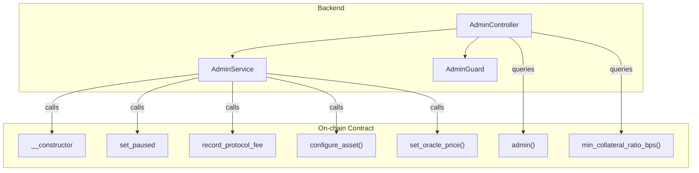
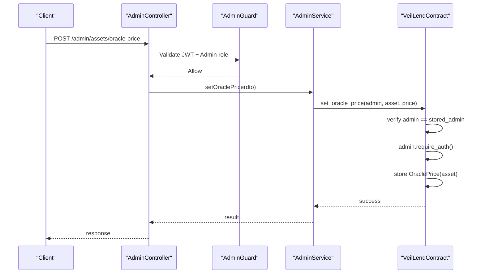
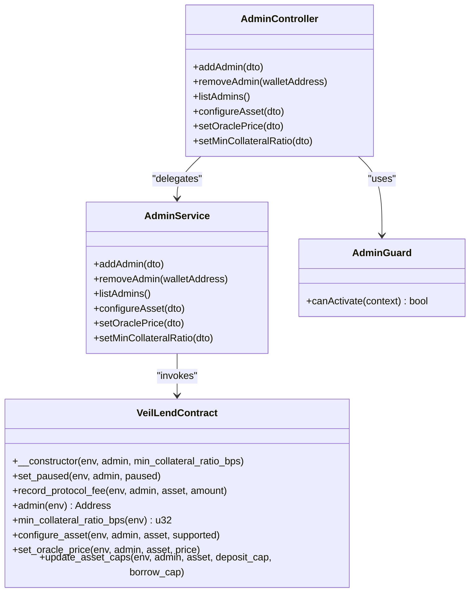

# Administrative Functions

<cite>
**Referenced Files in This Document**
- [lib.rs](file://veilend-soroban/src/lib.rs)
- [admin.controller.ts](file://veilend-backend/src/admin/admin.controller.ts)
- [admin.service.ts](file://veilend-backend/src/admin/admin.service.ts)
- [admin.guard.ts](file://veilend-backend/src/auth/admin.guard.ts)
- [configure-asset.dto.ts](file://veilend-backend/src/admin/dto/configure-asset.dto.ts)
- [set-oracle-price.dto.ts](file://veilend-backend/src/admin/dto/set-oracle-price.dto.ts)
- [set-min-collateral-ratio.dto.ts](file://veilend-backend/src/admin/dto/set-min-collateral-ratio.dto.ts)
- [add-admin.dto.ts](file://veilend-backend/src/admin/dto/add-admin.dto.ts)
</cite>

## Table of Contents
1. [Introduction](#introduction)
2. [Project Structure](#project-structure)
3. [Core Components](#core-components)
4. [Architecture Overview](#architecture-overview)
5. [Detailed Component Analysis](#detailed-component-analysis)
6. [Dependency Analysis](#dependency-analysis)
7. [Performance Considerations](#performance-considerations)
8. [Troubleshooting Guide](#troubleshooting-guide)
9. [Conclusion](#conclusion)
10. [Appendices](#appendices)

## Introduction
This document describes the privileged administrative functions that govern protocol configuration and emergency controls. It covers:
- Contract initialization with admin assignment and minimum collateral ratio setup
- Circuit breaker activation to block new deposits and borrows while allowing repayments and withdrawals
- Protocol fee recording to collect revenue from reserves
- Administrative query functions for current configuration
- Access control mechanisms using on-chain authorization and backend admin guards
- Security considerations, emergency response procedures, and governance workflows
- Examples of typical administrative operations and their impact on protocol state

## Project Structure
The administrative surface spans two layers:
- On-chain Soroban contract exposing privileged entrypoints and storage keys for admin, pause state, asset caps, oracle prices, and reserves
- NestJS backend providing authenticated endpoints guarded by JWT and an admin role check, delegating to service methods (placeholders for actual contract calls)

**Diagram sources**
- [admin.controller.ts:20-55](file://veilend-backend/src/admin/admin.controller.ts#L20-L55)
- [admin.service.ts:8-56](file://veilend-backend/src/admin/admin.service.ts#L8-L56)
- [admin.guard.ts:24-46](file://veilend-backend/src/auth/admin.guard.ts#L24-L46)
- [lib.rs:242-258](file://veilend-soroban/src/lib.rs#L242-L258)
- [lib.rs:458-468](file://veilend-soroban/src/lib.rs#L458-L468)
- [lib.rs:686-704](file://veilend-soroban/src/lib.rs#L686-L704)
- [lib.rs:706-718](file://veilend-soroban/src/lib.rs#L706-L718)
- [lib.rs:260-306](file://veilend-soroban/src/lib.rs#L260-L306)
- [lib.rs:317-331](file://veilend-soroban/src/lib.rs#L317-L331)

**Section sources**
- [admin.controller.ts:20-55](file://veilend-backend/src/admin/admin.controller.ts#L20-L55)
- [admin.service.ts:8-56](file://veilend-backend/src/admin/admin.service.ts#L8-L56)
- [admin.guard.ts:24-46](file://veilend-backend/src/auth/admin.guard.ts#L24-L46)
- [lib.rs:242-718](file://veilend-soroban/src/lib.rs#L242-L718)

## Core Components
- Contract constructor initializes admin address, minimum collateral ratio in basis points, and circuit breaker state
- Circuit breaker toggle blocks deposit/borrow but allows repay/withdraw
- Protocol fee recording increases reserve balances and tracks protocol fees
- Query functions expose current admin and minimum collateral ratio
- Backend admin endpoints enforce JWT authentication and admin role checks before invoking contract actions

**Section sources**
- [lib.rs:242-258](file://veilend-soroban/src/lib.rs#L242-L258)
- [lib.rs:458-468](file://veilend-soroban/src/lib.rs#L458-L468)
- [lib.rs:686-704](file://veilend-soroban/src/lib.rs#L686-L704)
- [lib.rs:706-718](file://veilend-soroban/src/lib.rs#L706-L718)
- [admin.controller.ts:20-55](file://veilend-backend/src/admin/admin.controller.ts#L20-L55)
- [admin.guard.ts:24-46](file://veilend-backend/src/auth/admin.guard.ts#L24-L46)

## Architecture Overview
Administrative actions flow through a layered architecture:
- Clients call NestJS admin endpoints protected by JWT and AdminGuard
- AdminService validates DTOs and prepares contract calls
- On-chain contract enforces access control via stored admin comparison and require_auth, then updates persistent storage and emits events

**Diagram sources**
- [admin.controller.ts:46-49](file://veilend-backend/src/admin/admin.controller.ts#L46-L49)
- [admin.guard.ts:28-44](file://veilend-backend/src/auth/admin.guard.ts#L28-L44)
- [admin.service.ts:39-46](file://veilend-backend/src/admin/admin.service.ts#L39-L46)
- [lib.rs:317-331](file://veilend-soroban/src/lib.rs#L317-L331)

## Detailed Component Analysis

### Contract Constructor: Initial Setup
Purpose:
- Assign the initial admin address
- Set the minimum collateral ratio in basis points (must be at least 100% i.e., 10_000 bps)
- Initialize circuit breaker state to not paused

Access Control:
- Requires caller to be the admin via require_auth
- Prevents re-initialization if already initialized

State Changes:
- Stores Admin and MinCollateralRatioBps in instance storage
- Sets Paused flag to false in persistent storage

Impact:
- Establishes governance identity and risk parameters
- Enables subsequent admin-only operations

**Section sources**
- [lib.rs:242-258](file://veilend-soroban/src/lib.rs#L242-L258)

### Circuit Breaker: set_paused
Purpose:
- Toggle protocol-wide pause state to block risky operations during emergencies

Behavior:
- When paused, deposit and borrow are blocked; repay and withdraw remain allowed
- Emits a circuit breaker event with admin and paused status

Access Control:
- Validates caller matches stored admin
- Requires admin signature via require_auth

State Changes:
- Updates Paused flag in persistent storage

Operational Impact:
- Freezes new inflows/outflows except debt reduction and collateral withdrawal
- Allows users to exit positions safely

**Section sources**
- [lib.rs:458-468](file://veilend-soroban/src/lib.rs#L458-L468)
- [lib.rs:483-487](file://veilend-soroban/src/lib.rs#L483-L487)
- [lib.rs:521-525](file://veilend-soroban/src/lib.rs#L521-L525)
- [lib.rs:563-567](file://veilend-soroban/src/lib.rs#L563-L567)
- [lib.rs:600-604](file://veilend-soroban/src/lib.rs#L600-L604)

### Protocol Fee Recording: record_protocol_fee
Purpose:
- Collect protocol revenue by increasing reserve balances and tracking protocol_fees

Behavior:
- Accrues interest to keep indexes current
- Increases total_balance and protocol_fees for the specified asset
- Emits an asset reserve updated event

Access Control:
- Validates caller is admin
- Requires admin signature via require_auth
- Ensures asset is supported and amount is positive

State Changes:
- Updates AssetReserve fields for the asset

Governance Use:
- Enables revenue extraction or redistribution according to policy

**Section sources**
- [lib.rs:686-704](file://veilend-soroban/src/lib.rs#L686-L704)

### Administrative Queries: admin and min_collateral_ratio_bps
Purpose:
- Read current admin address and minimum collateral ratio used for collateralization checks

Behavior:
- admin returns stored admin address or errors if not initialized
- min_collateral_ratio_bps returns configured value or default when unset

Use Cases:
- Frontend displays governance identity and risk thresholds
- Off-chain systems validate expected configuration

**Section sources**
- [lib.rs:706-718](file://veilend-soroban/src/lib.rs#L706-L718)

### Additional Administrative Controls
- configure_asset: Enable/disable assets and initialize per-asset caps and totals
- set_oracle_price: Set asset pricing used in collateral calculations
- update_asset_caps: Enforce per-asset deposit and borrow limits

Access Control:
- All require matching stored admin and require_auth

State Changes:
- Update SupportedAsset flags, DepositCap/BorrowCap, TotalDeposited/TotalBorrowed, OraclePrice

**Section sources**
- [lib.rs:260-306](file://veilend-soroban/src/lib.rs#L260-L306)
- [lib.rs:317-331](file://veilend-soroban/src/lib.rs#L317-L331)
- [lib.rs:356-395](file://veilend-soroban/src/lib.rs#L356-L395)

### Backend Admin Endpoints and Access Control
Endpoints:
- Add/remove/list admins
- Configure assets
- Set oracle price
- Set minimum collateral ratio

Authentication and Authorization:
- JWT guard ensures user identity
- AdminGuard verifies wallet address exists in admin table

Validation:
- DTOs enforce types and constraints (e.g., minimum collateral ratio >= 100%)

Note:
- Service methods currently return placeholder responses; integrate with on-chain calls to execute admin actions

**Section sources**
- [admin.controller.ts:20-55](file://veilend-backend/src/admin/admin.controller.ts#L20-L55)
- [admin.service.ts:8-56](file://veilend-backend/src/admin/admin.service.ts#L8-L56)
- [admin.guard.ts:24-46](file://veilend-backend/src/auth/admin.guard.ts#L24-L46)
- [configure-asset.dto.ts:1-10](file://veilend-backend/src/admin/dto/configure-asset.dto.ts#L1-L10)
- [set-oracle-price.dto.ts:1-11](file://veilend-backend/src/admin/dto/set-oracle-price.dto.ts#L1-L11)
- [set-min-collateral-ratio.dto.ts:1-8](file://veilend-backend/src/admin/dto/set-min-collateral-ratio.dto.ts#L1-L8)
- [add-admin.dto.ts:1-7](file://veilend-backend/src/admin/dto/add-admin.dto.ts#L1-L7)

## Dependency Analysis
Key dependencies and relationships:
- AdminController depends on AdminService and guards
- AdminService depends on PrismaService for admin management
- On-chain contract depends on stored admin, oracle prices, and interest accrual helpers
- Circuit breaker state affects deposit/borrow flows but not repay/withdraw

**Diagram sources**
- [lib.rs:242-718](file://veilend-soroban/src/lib.rs#L242-L718)
- [admin.controller.ts:20-55](file://veilend-backend/src/admin/admin.controller.ts#L20-L55)
- [admin.service.ts:8-56](file://veilend-backend/src/admin/admin.service.ts#L8-L56)
- [admin.guard.ts:24-46](file://veilend-backend/src/auth/admin.guard.ts#L24-L46)

**Section sources**
- [lib.rs:242-718](file://veilend-soroban/src/lib.rs#L242-L718)
- [admin.controller.ts:20-55](file://veilend-backend/src/admin/admin.controller.ts#L20-L55)
- [admin.service.ts:8-56](file://veilend-backend/src/admin/admin.service.ts#L8-L56)
- [admin.guard.ts:24-46](file://veilend-backend/src/auth/admin.guard.ts#L24-L46)

## Performance Considerations
- Interest accrual is performed before mutating operations to ensure accurate cap checks and totals; this adds computation proportional to time elapsed since last accrual
- Circuit breaker checks are constant-time reads of persistent storage
- Admin operations perform minimal storage writes; batch operations should be considered to reduce transaction costs
- Oracle price lookups are required for collateral checks; missing prices cause immediate failures

[No sources needed since this section provides general guidance]

## Troubleshooting Guide
Common issues and resolutions:
- Unauthorized: Ensure caller matches stored admin and provides valid signature via require_auth
- ContractPaused: New deposits/borrows fail when paused; allow repay/withdraw until resolved
- UnsupportedAsset: Configure asset before interacting; ensure SupportedAsset is true
- InvalidAmount/ZeroAmount: Verify amounts are positive and non-zero
- InsufficientCollateral: Check oracle price and minimum collateral ratio; adjust position or ratio
- OraclePriceMissing: Set oracle price for asset before borrowing or withdrawing against collateral
- NotInitialized: Initialize contract with admin and collateral ratio before any admin operations

Error codes and semantics are defined in the contract error enum.

**Section sources**
- [lib.rs:107-145](file://veilend-soroban/src/lib.rs#L107-L145)
- [lib.rs:835-865](file://veilend-soroban/src/lib.rs#L835-L865)
- [lib.rs:913-934](file://veilend-soroban/src/lib.rs#L913-L934)

## Conclusion
The administrative layer provides robust governance and emergency controls:
- Initialization sets governance identity and risk parameters
- Circuit breaker enables rapid response to threats by halting risky operations while preserving user exits
- Protocol fee recording supports sustainable revenue collection
- Strict access control via stored admin validation and require_auth protects critical state changes
- Backend endpoints add an additional layer of authentication and authorization for operational workflows

Adhering to these procedures ensures secure, auditable, and responsive protocol governance.

[No sources needed since this section summarizes without analyzing specific files]

## Appendices

### Typical Administrative Operations and Impact
- Initialize contract: Sets admin and minimum collateral ratio; initializes pause state to false
- Pause protocol: Blocks deposit/borrow; allows repay/withdraw; emits circuit breaker event
- Record protocol fee: Increases reserve balance and protocol fees; emits reserve updated event
- Configure asset: Enables asset and initializes caps/totals; emits asset configured event
- Set oracle price: Updates asset price used in collateral calculations; must be positive
- Update asset caps: Limits total deposits/borrows per asset; unlimited when set to -1

**Section sources**
- [lib.rs:242-258](file://veilend-soroban/src/lib.rs#L242-L258)
- [lib.rs:458-468](file://veilend-soroban/src/lib.rs#L458-L468)
- [lib.rs:686-704](file://veilend-soroban/src/lib.rs#L686-L704)
- [lib.rs:260-306](file://veilend-soroban/src/lib.rs#L260-L306)
- [lib.rs:317-331](file://veilend-soroban/src/lib.rs#L317-L331)
- [lib.rs:356-395](file://veilend-soroban/src/lib.rs#L356-L395)

### Security Considerations
- Always validate admin identity both off-chain (JWT + AdminGuard) and on-chain (stored admin + require_auth)
- Restrict who can call admin endpoints; use multi-signature or timelocks for high-risk actions in production
- Monitor circuit breaker events and reserve updates for anomalies
- Ensure oracle prices are set and refreshed regularly to prevent mispricing risks
- Audit all admin transactions and maintain logs for compliance

[No sources needed since this section provides general guidance]

### Emergency Response Procedures
- Detect threat or anomaly
- Immediately pause protocol via set_paused to stop new deposits/borrows
- Investigate root cause and communicate status
- Unpause only after remediation and verification
- Record any necessary protocol fees or adjustments post-resolution

**Section sources**
- [lib.rs:458-468](file://veilend-soroban/src/lib.rs#L458-L468)

### Governance Workflows
- Propose configuration changes (e.g., asset support, caps, oracle prices)
- Execute changes via admin endpoints after approval
- Publish events and monitor outcomes
- Review and audit administrative actions regularly

**Section sources**
- [admin.controller.ts:20-55](file://veilend-backend/src/admin/admin.controller.ts#L20-L55)
- [lib.rs:260-395](file://veilend-soroban/src/lib.rs#L260-L395)