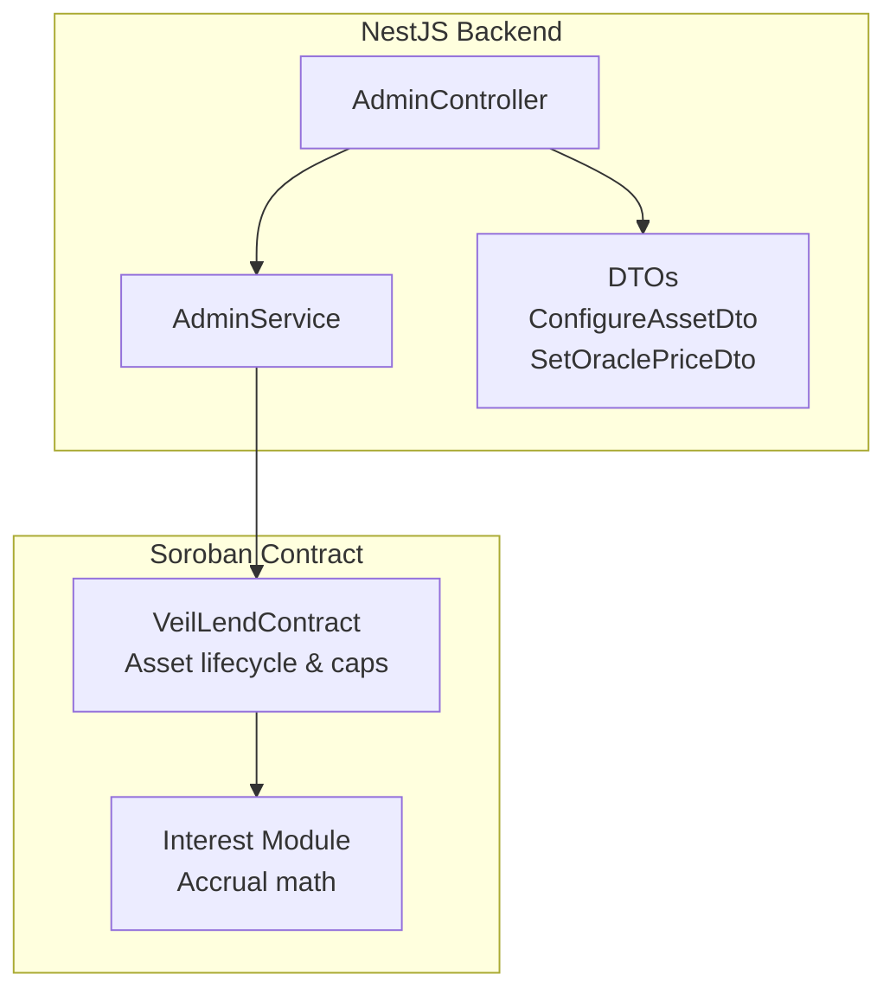
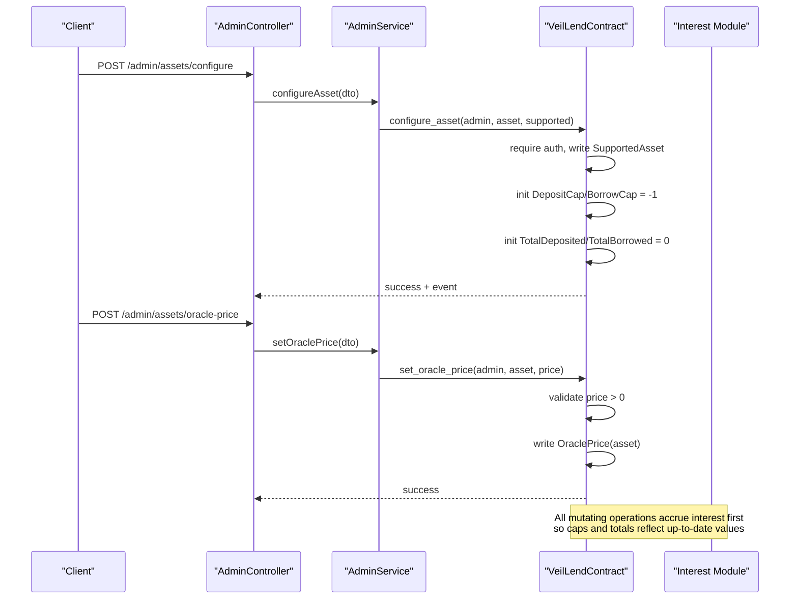
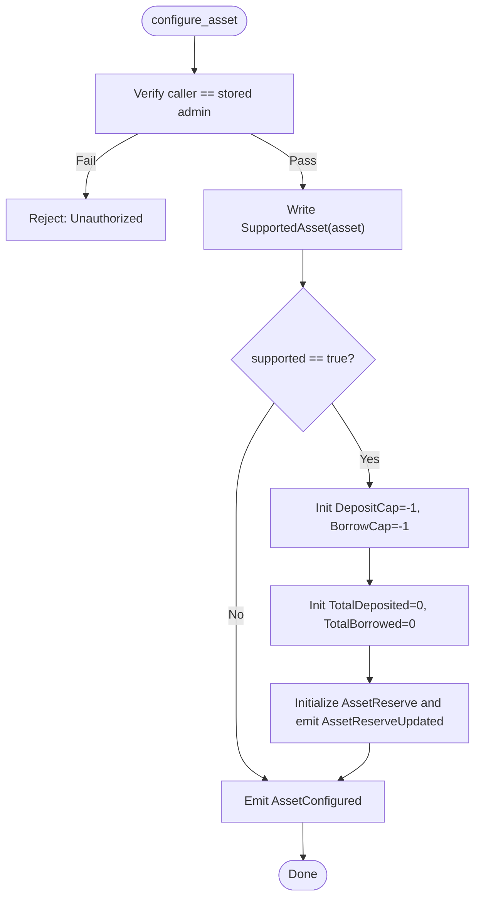
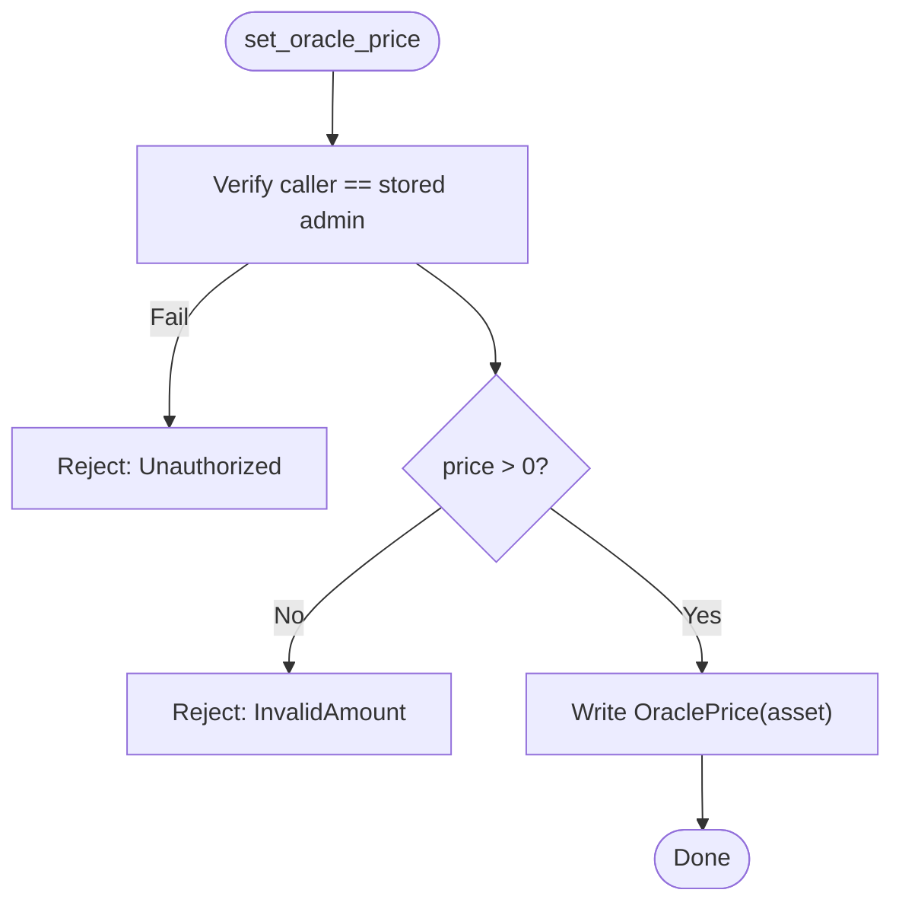
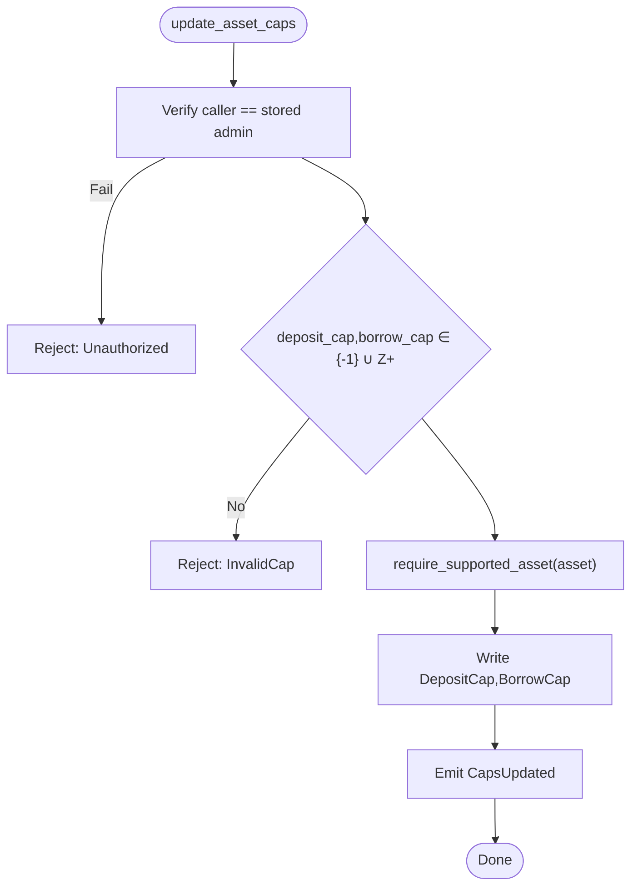
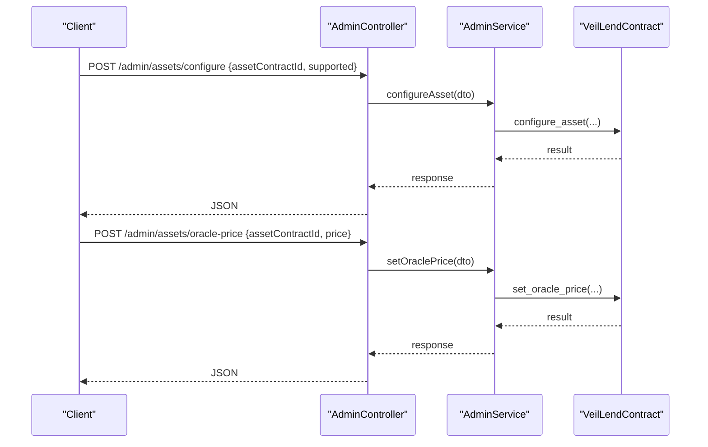
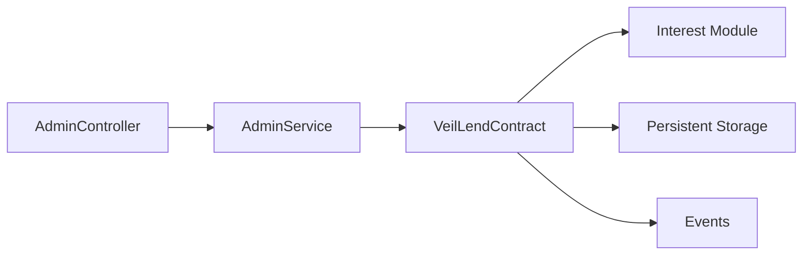

# Asset Management

<cite>
**Referenced Files in This Document**
- [lib.rs](file://veilend-soroban/src/lib.rs)
- [interest.rs](file://veilend-soroban/src/interest.rs)
- [integration.rs](file://veilend-soroban/tests/integration.rs)
- [admin.controller.ts](file://veilend-backend/src/admin/admin.controller.ts)
- [admin.service.ts](file://veilend-backend/src/admin/admin.service.ts)
- [configure-asset.dto.ts](file://veilend-backend/src/admin/dto/configure-asset.dto.ts)
- [set-oracle-price.dto.ts](file://veilend-backend/src/admin/dto/set-oracle-price.dto.ts)
</cite>

## Table of Contents
1. [Introduction](#introduction)
2. [Project Structure](#project-structure)
3. [Core Components](#core-components)
4. [Architecture Overview](#architecture-overview)
5. [Detailed Component Analysis](#detailed-component-analysis)
6. [Dependency Analysis](#dependency-analysis)
7. [Performance Considerations](#performance-considerations)
8. [Troubleshooting Guide](#troubleshooting-guide)
9. [Conclusion](#conclusion)

## Introduction
This document explains the VeilLend protocol’s asset management functions implemented in the Soroban smart contract and exposed via the NestJS backend. It covers:
- Enabling/disabling assets for lending and automatic initialization of caps and totals
- Setting oracle prices used in collateral calculations
- Managing per-asset deposit and borrow limits (including unlimited caps)
- Querying asset status and utilization metrics
- Administrative workflows, security implications, and best practices

## Project Structure
The asset management logic is primarily implemented in the VeilLend Soroban contract and complemented by a NestJS admin API layer that validates inputs and orchestrates on-chain calls.

**Diagram sources**
- [lib.rs:226-719](file://veilend-soroban/src/lib.rs#L226-L719)
- [interest.rs:1-258](file://veilend-soroban/src/interest.rs#L1-L258)
- [admin.controller.ts:20-55](file://veilend-backend/src/admin/admin.controller.ts#L20-L55)
- [admin.service.ts:1-57](file://veilend-backend/src/admin/admin.service.ts#L1-L57)
- [configure-asset.dto.ts:1-10](file://veilend-backend/src/admin/dto/configure-asset.dto.ts#L1-L10)
- [set-oracle-price.dto.ts:1-11](file://veilend-backend/src/admin/dto/set-oracle-price.dto.ts#L1-L11)

**Section sources**
- [lib.rs:226-719](file://veilend-soroban/src/lib.rs#L226-L719)
- [admin.controller.ts:20-55](file://veilend-backend/src/admin/admin.controller.ts#L20-L55)

## Core Components
- Admin-only configuration endpoints to enable/disable assets and set/update oracle prices and caps
- Per-asset caps enforcement for deposits and borrows with support for unlimited (-1)
- Time-based interest accrual integrated into cap checks and balance updates
- Read-only queries for asset caps, totals, and supported status

Key responsibilities:
- configure_asset: register an asset and initialize storage defaults
- set_oracle_price: validate and store price for collateral valuation
- update_asset_caps: enforce positive or -1 values; require supported asset
- get_asset_caps, get_total_deposited, get_total_borrowed, is_asset_supported: read state

**Section sources**
- [lib.rs:260-448](file://veilend-soroban/src/lib.rs#L260-L448)
- [interest.rs:51-120](file://veilend-soroban/src/interest.rs#L51-L120)

## Architecture Overview
The administrative workflow flows from the NestJS controller through service validation to the on-chain contract methods. The contract enforces authorization, input validation, and emits events for observability.

**Diagram sources**
- [admin.controller.ts:41-49](file://veilend-backend/src/admin/admin.controller.ts#L41-L49)
- [admin.service.ts:30-46](file://veilend-backend/src/admin/admin.service.ts#L30-L46)
- [lib.rs:260-331](file://veilend-soroban/src/lib.rs#L260-L331)
- [lib.rs:483-519](file://veilend-soroban/src/lib.rs#L483-L519)

## Detailed Component Analysis

### configure_asset
Purpose:
- Enable or disable an asset for lending
- On enabling, automatically initializes:
  - DepositCap and BorrowCap to unlimited (-1)
  - TotalDeposited and TotalBorrowed to 0
  - AssetReserve entry and emits reserve update event

Authorization and events:
- Requires admin authentication
- Emits AssetConfigured event with admin, asset, and supported flag
- Emits AssetReserveUpdated when initializing reserve

Validation:
- Unauthorized callers are rejected
- No explicit asset existence check beyond supported flag

**Diagram sources**
- [lib.rs:260-306](file://veilend-soroban/src/lib.rs#L260-L306)

**Section sources**
- [lib.rs:260-306](file://veilend-soroban/src/lib.rs#L260-L306)
- [integration.rs:21-39](file://veilend-soroban/tests/integration.rs#L21-L39)

### set_oracle_price
Purpose:
- Set the oracle price for a supported asset used in collateral calculations

Validation:
- Requires admin authentication
- Price must be strictly positive; otherwise returns InvalidAmount

Storage:
- Persists OraclePrice(asset)

Query:
- get_oracle_price returns Option<i128> for a given asset

**Diagram sources**
- [lib.rs:317-331](file://veilend-soroban/src/lib.rs#L317-L331)

**Section sources**
- [lib.rs:317-344](file://veilend-soroban/src/lib.rs#L317-L344)
- [integration.rs:21-39](file://veilend-soroban/tests/integration.rs#L21-L39)

### update_asset_caps
Purpose:
- Manage per-asset deposit and borrow limits

Validation:
- Requires admin authentication
- Caps must be either -1 (unlimited) or positive integers; zero or negative other than -1 are invalid
- Asset must be supported before updating caps

Storage and events:
- Persists DepositCap(asset) and BorrowCap(asset)
- Emits CapsUpdated event with admin, asset, and new caps

Enforcement:
- deposit() and borrow() enforce caps against updated totals after interest accrual

**Diagram sources**
- [lib.rs:356-395](file://veilend-soroban/src/lib.rs#L356-L395)

**Section sources**
- [lib.rs:356-395](file://veilend-soroban/src/lib.rs#L356-L395)
- [integration.rs:42-83](file://veilend-soroban/tests/integration.rs#L42-L83)
- [integration.rs:195-246](file://veilend-soroban/tests/integration.rs#L195-L246)

### query functions
- get_asset_caps: Returns AssetCaps(deposit_cap, borrow_cap), defaulting to -1 if not set
- get_total_deposited: Returns total deposited amount for an asset, defaulting to 0
- get_total_borrowed: Returns total borrowed amount for an asset, defaulting to 0
- is_asset_supported: Returns whether an asset is enabled for lending

These are read-only and do not modify state. They are essential for monitoring and UI dashboards.

**Section sources**
- [lib.rs:397-448](file://veilend-soroban/src/lib.rs#L397-L448)
- [lib.rs:679-684](file://veilend-soroban/src/lib.rs#L679-L684)

### Administrative workflows (backend)
The NestJS admin API exposes endpoints that validate requests and forward them to the contract.

- POST /admin/assets/configure
  - Validates ConfigureAssetDto (assetContractId string, supported boolean)
  - Calls AdminService.configureAsset
- POST /admin/assets/oracle-price
  - Validates SetOraclePriceDto (assetContractId string, price integer ≥ 1)
  - Calls AdminService.setOraclePrice

Note: The current service implementations return placeholder responses; production integration should invoke the Soroban contract with proper signing and error handling.

**Diagram sources**
- [admin.controller.ts:41-49](file://veilend-backend/src/admin/admin.controller.ts#L41-L49)
- [admin.service.ts:30-46](file://veilend-backend/src/admin/admin.service.ts#L30-L46)
- [configure-asset.dto.ts:1-10](file://veilend-backend/src/admin/dto/configure-asset.dto.ts#L1-L10)
- [set-oracle-price.dto.ts:1-11](file://veilend-backend/src/admin/dto/set-oracle-price.dto.ts#L1-L11)

**Section sources**
- [admin.controller.ts:20-55](file://veilend-backend/src/admin/admin.controller.ts#L20-L55)
- [admin.service.ts:1-57](file://veilend-backend/src/admin/admin.service.ts#L1-L57)
- [configure-asset.dto.ts:1-10](file://veilend-backend/src/admin/dto/configure-asset.dto.ts#L1-L10)
- [set-oracle-price.dto.ts:1-11](file://veilend-backend/src/admin/dto/set-oracle-price.dto.ts#L1-L11)

## Dependency Analysis
- Admin endpoints depend on DTO validation and guards
- AdminService currently provides placeholders; final implementation depends on Soroban client integration
- Contract-level dependencies:
  - Interest module for accrual and position realization
  - Storage keys for asset state, caps, totals, oracle prices, and pause state
  - Events for auditability and off-chain indexing

**Diagram sources**
- [admin.controller.ts:20-55](file://veilend-backend/src/admin/admin.controller.ts#L20-L55)
- [admin.service.ts:1-57](file://veilend-backend/src/admin/admin.service.ts#L1-L57)
- [lib.rs:226-719](file://veilend-soroban/src/lib.rs#L226-L719)
- [interest.rs:1-258](file://veilend-soroban/src/interest.rs#L1-L258)

**Section sources**
- [lib.rs:226-719](file://veilend-soroban/src/lib.rs#L226-L719)
- [interest.rs:1-258](file://veilend-soroban/src/interest.rs#L1-L258)

## Performance Considerations
- Interest accrual is idempotent and computed only when time advances; repeated calls at the same timestamp are no-ops
- Accrual runs before cap checks and balance mutations to ensure accurate enforcement
- Unlimited caps (-1) avoid arithmetic overflow concerns but still rely on underlying token balances and collateral constraints
- Event emissions provide efficient off-chain indexing without on-chain reads

[No sources needed since this section provides general guidance]

## Troubleshooting Guide
Common errors and their causes:
- Unauthorized: Caller is not the stored admin for configure_asset, set_oracle_price, update_asset_caps
- InvalidAmount: Oracle price must be positive
- InvalidCap: Caps must be -1 or positive; zero is invalid
- UnsupportedAsset: Operations requiring supported assets fail if asset is not enabled
- InsufficientReserve: Borrow/withdraw exceed available reserve balance
- ContractPaused: New deposits/borrows blocked when paused; repay/withdraw remain allowed

Operational tips:
- Always call configure_asset before setting oracle price or caps
- Ensure oracle price is set before users can borrow/withdraw based on collateral
- Use get_asset_caps, get_total_deposited, get_total_borrowed to monitor utilization
- Monitor emitted events for audit trails and indexer sync

**Section sources**
- [lib.rs:107-145](file://veilend-soroban/src/lib.rs#L107-L145)
- [lib.rs:450-479](file://veilend-soroban/src/lib.rs#L450-L479)
- [integration.rs:85-146](file://veilend-soroban/tests/integration.rs#L85-L146)

## Conclusion
VeilLend’s asset management provides a robust, admin-controlled mechanism to onboard assets, set valuations, and enforce usage limits while integrating time-based interest accrual. Proper use of configure_asset, set_oracle_price, and update_asset_caps ensures safe and transparent operation. Queries enable real-time monitoring, and events support reliable off-chain systems. Following the outlined workflows and validations helps maintain protocol integrity and user trust.