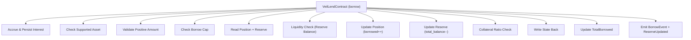
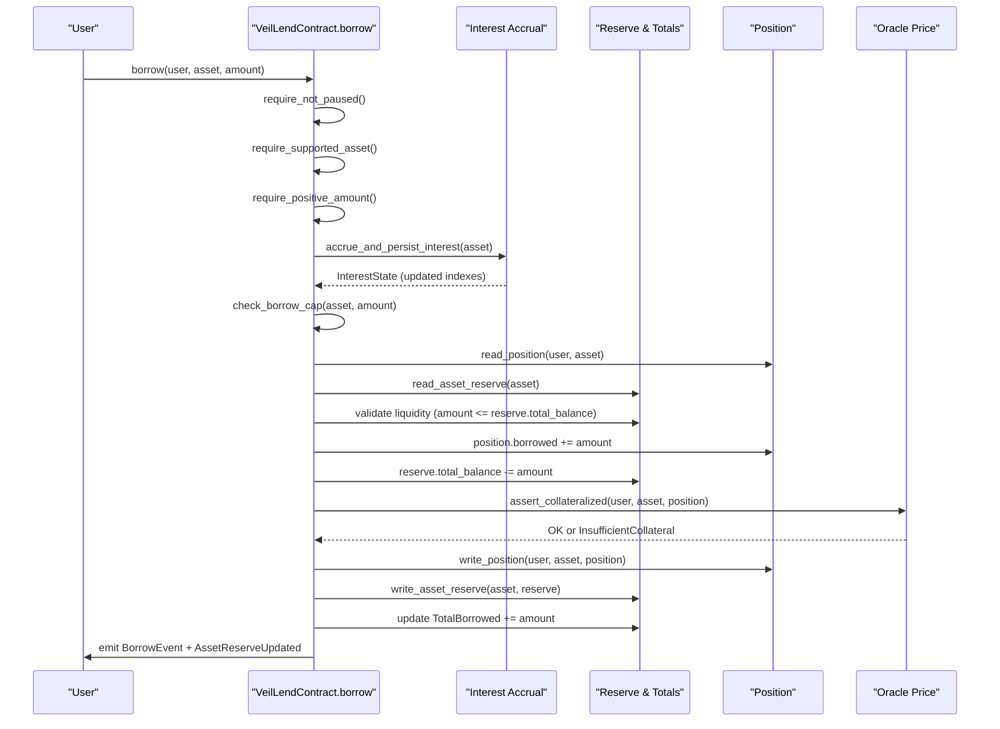
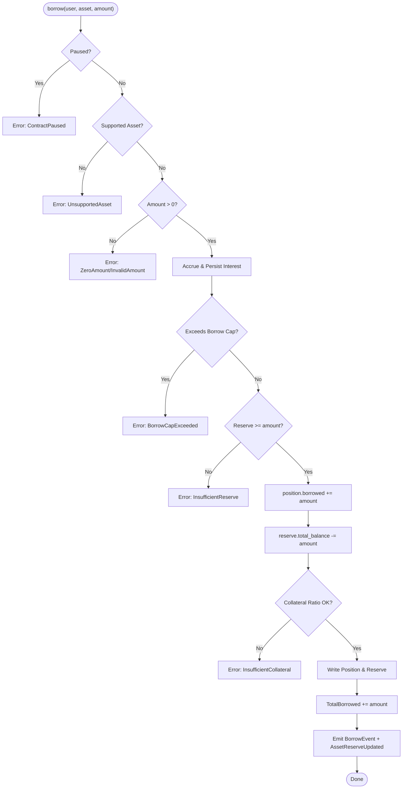
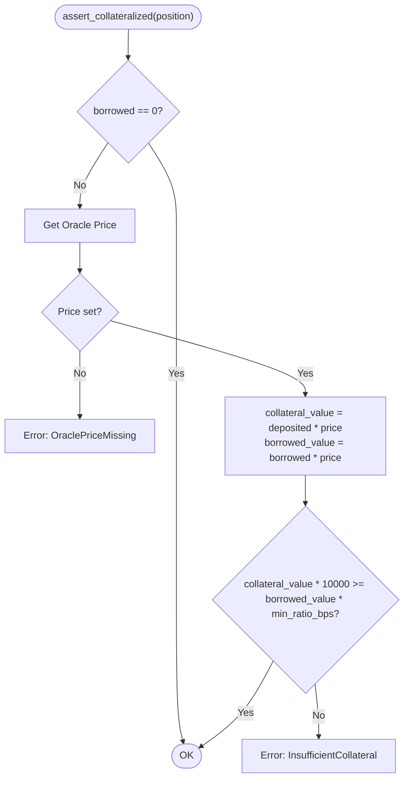
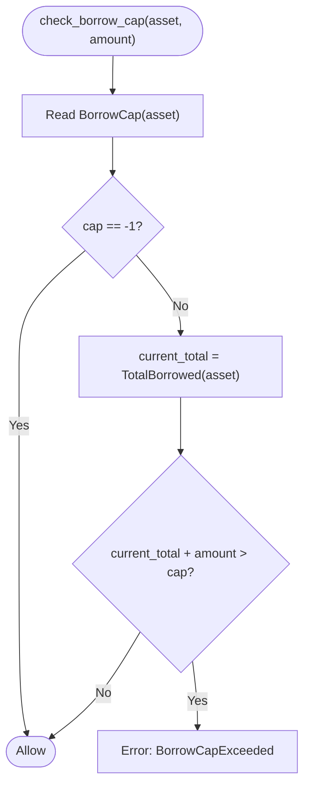
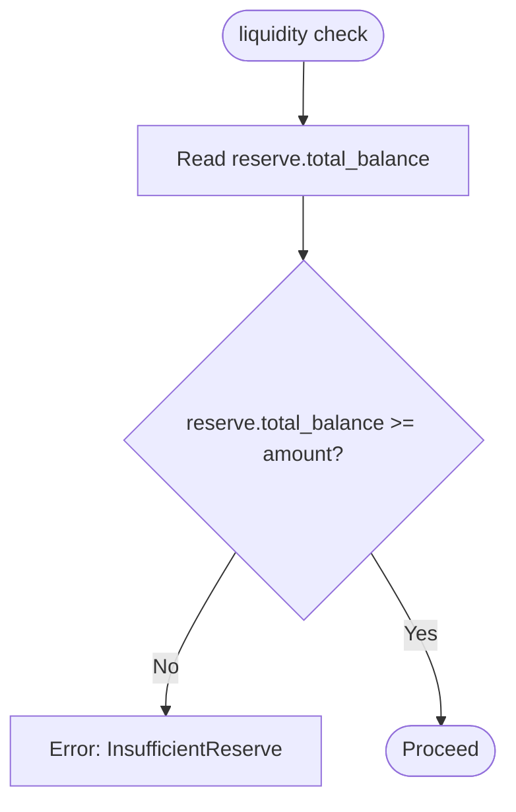
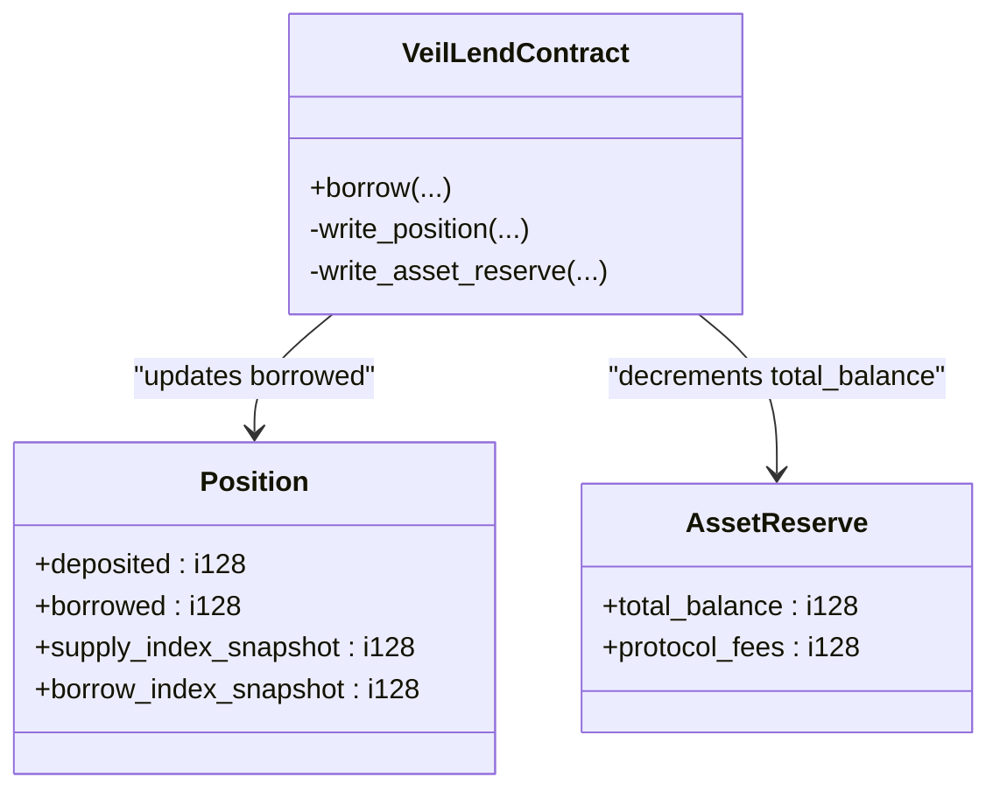
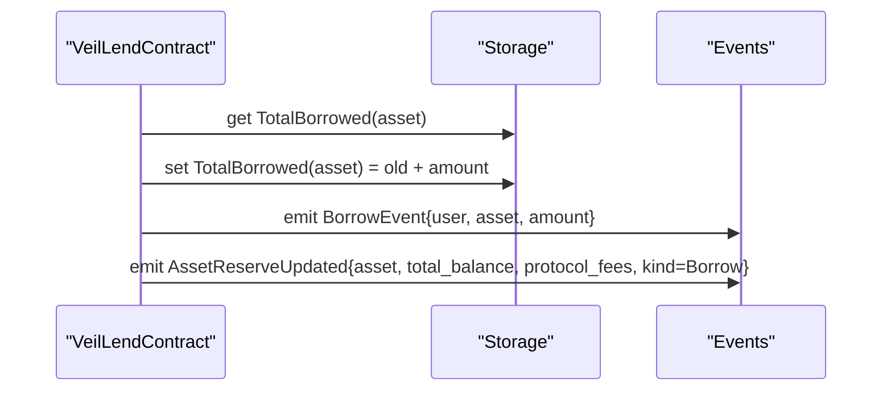
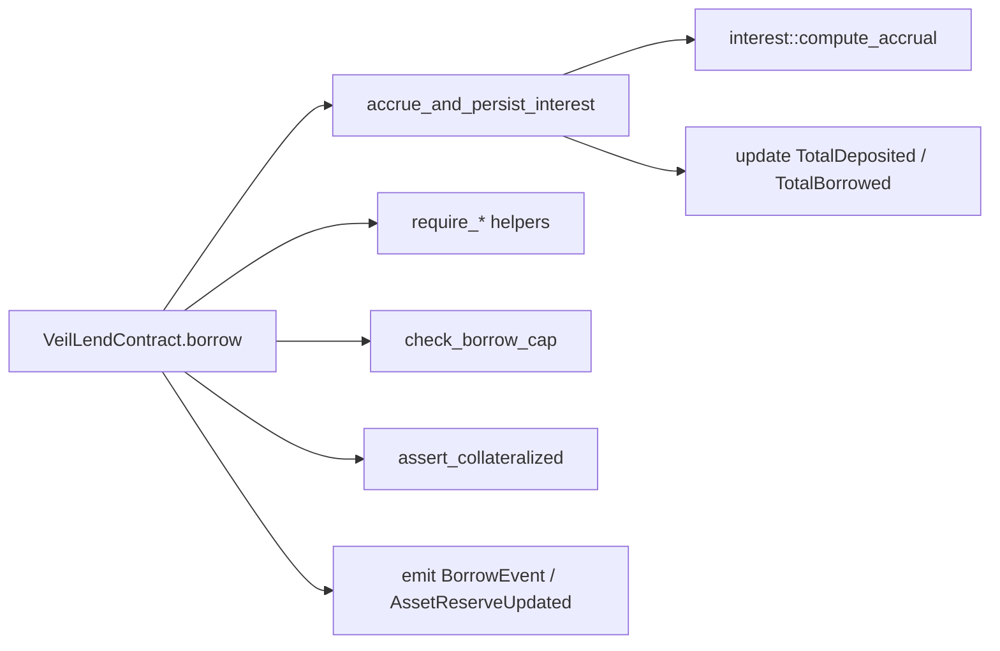

# Borrow Function

<cite>
**Referenced Files in This Document**
- [lib.rs](file://veilend-soroban/src/lib.rs)
- [interest.rs](file://veilend-soroban/src/interest.rs)
- [integration.rs](file://veilend-soroban/tests/integration.rs)
</cite>

## Table of Contents
1. [Introduction](#introduction)
2. [Project Structure](#project-structure)
3. [Core Components](#core-components)
4. [Architecture Overview](#architecture-overview)
5. [Detailed Component Analysis](#detailed-component-analysis)
6. [Dependency Analysis](#dependency-analysis)
7. [Performance Considerations](#performance-considerations)
8. [Troubleshooting Guide](#troubleshooting-guide)
9. [Conclusion](#conclusion)

## Introduction
This document explains the borrow function that allows users to borrow against deposited collateral in the Veilend lending protocol. It covers the complete borrowing workflow, including circuit breaker checks, supported asset verification, positive amount validation, oracle-based collateral ratio enforcement, per-asset borrow cap enforcement, liquidity availability checks, position and reserve state updates, total borrowed tracking, and event emissions. It also provides examples and error handling guidance for common scenarios such as insufficient collateral and liquidity constraints.

## Project Structure
The borrow logic is implemented in the Soroban smart contract under veilend-soroban. The core contract code defines storage keys, data structures, events, and the borrow entrypoint along with shared helpers for interest accrual, caps, collateral checks, and reserve updates. Interest accrual math and position realization are encapsulated in a separate module. Integration tests demonstrate end-to-end flows including pause/unpause behavior, caps, and time-based accruals.

**Diagram sources**
- [lib.rs:521-561](file://veilend-soroban/src/lib.rs#L521-L561)
- [lib.rs:792-815](file://veilend-soroban/src/lib.rs#L792-L815)
- [lib.rs:835-911](file://veilend-soroban/src/lib.rs#L835-L911)
- [lib.rs:913-934](file://veilend-soroban/src/lib.rs#L913-L934)

**Section sources**
- [lib.rs:1-1041](file://veilend-soroban/src/lib.rs#L1-L1041)
- [interest.rs:1-258](file://veilend-soroban/src/interest.rs#L1-L258)
- [integration.rs:1-461](file://veilend-soroban/tests/integration.rs#L1-L461)

## Core Components
- Borrow entrypoint: orchestrates pre-checks, accrual, caps, liquidity, collateral validation, state updates, totals, and events.
- Interest accrual: advances supply/borrow indexes and updates aggregate totals based on elapsed time and utilization.
- Collateral ratio check: enforces minimum collateral ratio using oracle prices.
- Caps enforcement: prevents exceeding per-asset deposit or borrow limits.
- Reserve management: tracks total balance and protocol fees per asset; decremented on borrow and incremented on repay.
- Events: emits BorrowEvent and AssetReserveUpdated on successful borrows.

Key data structures involved:
- Position: stores deposited, borrowed, and index snapshots for realizing accrued interest.
- InterestState: stores supply_index, borrow_index, and last_accrual_timestamp.
- AssetReserve: stores total_balance and protocol_fees per asset.
- DataKey enum: identifies storage keys for positions, reserves, caps, totals, paused state, and oracle prices.

**Section sources**
- [lib.rs:38-93](file://veilend-soroban/src/lib.rs#L38-L93)
- [lib.rs:167-224](file://veilend-soroban/src/lib.rs#L167-L224)
- [interest.rs:1-22](file://veilend-soroban/src/interest.rs#L1-L22)

## Architecture Overview
The borrow flow integrates multiple safety and accounting layers:

**Diagram sources**
- [lib.rs:521-561](file://veilend-soroban/src/lib.rs#L521-L561)
- [lib.rs:792-815](file://veilend-soroban/src/lib.rs#L792-L815)
- [lib.rs:835-911](file://veilend-soroban/src/lib.rs#L835-L911)
- [lib.rs:913-934](file://veilend-soroban/src/lib.rs#L913-L934)

## Detailed Component Analysis

### Borrow Workflow Steps
1. Circuit breaker check: ensure the contract is not paused. If paused, borrow is blocked.
2. Supported asset verification: ensure the asset is enabled for lending/borrowing.
3. Positive amount validation: reject zero or negative amounts.
4. Interest accrual: advance interest indexes and update aggregate totals so caps and balances reflect current values.
5. Borrow cap enforcement: prevent exceeding per-asset borrow cap if set.
6. Liquidity availability check: ensure the requested amount does not exceed the asset’s reserve total_balance.
7. Position and reserve updates: increment user’s borrowed balance and decrement reserve total_balance.
8. Collateral ratio validation: enforce minimum collateral ratio using oracle price; fail if insufficient.
9. Persist state: write updated position and reserve back to storage.
10. Update totals: increase TotalBorrowed by the borrowed amount.
11. Emit events: publish BorrowEvent and AssetReserveUpdated.

**Diagram sources**
- [lib.rs:521-561](file://veilend-soroban/src/lib.rs#L521-L561)
- [lib.rs:835-911](file://veilend-soroban/src/lib.rs#L835-L911)
- [lib.rs:913-934](file://veilend-soroban/src/lib.rs#L913-L934)

**Section sources**
- [lib.rs:521-561](file://veilend-soroban/src/lib.rs#L521-L561)
- [lib.rs:835-911](file://veilend-soroban/src/lib.rs#L835-L911)
- [lib.rs:913-934](file://veilend-soroban/src/lib.rs#L913-L934)

### Critical Collateral Ratio Validation
- Uses the configured minimum collateral ratio in basis points.
- Retrieves the oracle price for the asset; missing price triggers an explicit error.
- Computes collateral value and borrowed value using the same oracle price factor and compares them against the minimum ratio threshold.
- If collateral value is insufficient relative to borrowed value, the operation fails.

**Diagram sources**
- [lib.rs:913-934](file://veilend-soroban/src/lib.rs#L913-L934)

**Section sources**
- [lib.rs:913-934](file://veilend-soroban/src/lib.rs#L913-L934)

### Borrow Cap Enforcement
- Reads the per-asset borrow cap; -1 indicates unlimited.
- Compares current TotalBorrowed plus the requested amount against the cap.
- Exceeding the cap results in an error.

**Diagram sources**
- [lib.rs:890-911](file://veilend-soroban/src/lib.rs#L890-L911)

**Section sources**
- [lib.rs:890-911](file://veilend-soroban/src/lib.rs#L890-L911)

### Liquidity Availability Checks
- Ensures the asset’s reserve has sufficient total_balance to cover the requested borrow amount.
- If insufficient, the operation fails before any state changes.

**Diagram sources**
- [lib.rs:538-541](file://veilend-soroban/src/lib.rs#L538-L541)

**Section sources**
- [lib.rs:538-541](file://veilend-soroban/src/lib.rs#L538-L541)

### Position State Updates
- Increments the user’s borrowed balance.
- Decrements the asset’s reserve total_balance.
- Writes updated position and reserve back to persistent storage.

**Diagram sources**
- [lib.rs:542-546](file://veilend-soroban/src/lib.rs#L542-L546)
- [lib.rs:721-736](file://veilend-soroban/src/lib.rs#L721-L736)
- [lib.rs:753-763](file://veilend-soroban/src/lib.rs#L753-L763)

**Section sources**
- [lib.rs:542-546](file://veilend-soroban/src/lib.rs#L542-L546)
- [lib.rs:721-736](file://veilend-soroban/src/lib.rs#L721-L736)
- [lib.rs:753-763](file://veilend-soroban/src/lib.rs#L753-L763)

### Total Borrowed Tracking and Events
- Increases TotalBorrowed for the asset by the borrowed amount.
- Emits BorrowEvent with user, asset, and amount.
- Emits AssetReserveUpdated indicating the borrow action and new reserve totals.

**Diagram sources**
- [lib.rs:548-561](file://veilend-soroban/src/lib.rs#L548-L561)
- [lib.rs:738-751](file://veilend-soroban/src/lib.rs#L738-L751)

**Section sources**
- [lib.rs:548-561](file://veilend-soroban/src/lib.rs#L548-L561)
- [lib.rs:738-751](file://veilend-soroban/src/lib.rs#L738-L751)

### Examples

#### Successful Borrow
- Prerequisites: asset configured, oracle price set, contract unpaused, sufficient reserve liquidity, borrow cap not exceeded, and collateral ratio satisfied.
- Flow: accrue interest, validate inputs, check caps, verify liquidity, update position and reserve, update totals, emit events.
- Reference test demonstrating borrow after deposit and time-based accrual: [integration.rs:284-309](file://veilend-soroban/tests/integration.rs#L284-L309).

#### Insufficient Collateral Scenario
- Trigger: borrowed value exceeds collateral value relative to the minimum collateral ratio.
- Error: InsufficientCollateral.
- Resolution: reduce borrow amount or increase deposited collateral; ensure oracle price is set.
- Reference collateral check implementation: [lib.rs:913-934](file://veilend-soroban/src/lib.rs#L913-L934).

#### Liquidity Constraints
- Trigger: requested borrow amount exceeds reserve total_balance.
- Error: InsufficientReserve.
- Resolution: wait for repayments or additional deposits to increase reserve liquidity.
- Reference liquidity check: [lib.rs:538-541](file://veilend-soroban/src/lib.rs#L538-L541).

#### Borrow Cap Exceeded
- Trigger: current TotalBorrowed plus requested amount exceeds per-asset borrow cap.
- Error: BorrowCapExceeded.
- Resolution: reduce borrow amount or adjust cap via admin update.
- Reference cap check: [lib.rs:890-911](file://veilend-soroban/src/lib.rs#L890-L911).

**Section sources**
- [integration.rs:284-309](file://veilend-soroban/tests/integration.rs#L284-L309)
- [lib.rs:538-541](file://veilend-soroban/src/lib.rs#L538-L541)
- [lib.rs:890-911](file://veilend-soroban/src/lib.rs#L890-L911)
- [lib.rs:913-934](file://veilend-soroban/src/lib.rs#L913-L934)

## Dependency Analysis
The borrow function depends on several internal modules and helpers:

**Diagram sources**
- [lib.rs:521-561](file://veilend-soroban/src/lib.rs#L521-L561)
- [lib.rs:792-815](file://veilend-soroban/src/lib.rs#L792-L815)
- [interest.rs:51-87](file://veilend-soroban/src/interest.rs#L51-L87)

**Section sources**
- [lib.rs:521-561](file://veilend-soroban/src/lib.rs#L521-L561)
- [lib.rs:792-815](file://veilend-soroban/src/lib.rs#L792-L815)
- [interest.rs:51-87](file://veilend-soroban/src/interest.rs#L51-L87)

## Performance Considerations
- Interest accrual is performed once per borrow to ensure accurate caps and totals; it uses fixed-point arithmetic and avoids heavy computations.
- Storage reads/writes are minimized by batching position and reserve updates before persisting.
- Idempotent accrual: repeated calls at the same timestamp do not double-count interest.
- Using oracle price ensures consistent valuation across operations without external calls during borrow.

[No sources needed since this section provides general guidance]

## Troubleshooting Guide
Common errors and their triggers:
- ContractPaused: borrow called while circuit breaker is active. Resolve by setting paused to false via admin.
- UnsupportedAsset: asset not configured for lending. Resolve by configuring asset as supported.
- ZeroAmount/InvalidAmount: amount must be strictly positive. Provide a valid positive amount.
- BorrowCapExceeded: total borrows would exceed per-asset cap. Reduce amount or increase cap.
- InsufficientReserve: reserve balance too low. Wait for repayments or additional deposits.
- OraclePriceMissing: no oracle price set for asset. Set oracle price via admin.
- InsufficientCollateral: borrowed value exceeds collateral value relative to minimum ratio. Increase collateral or reduce borrow.

Resolution paths:
- Use admin functions to configure assets, set oracle prices, update caps, and toggle pause state.
- Monitor reserve balances and total borrowed via query functions to plan borrow sizes.
- Ensure oracle prices are up to date to avoid collateral validation failures.

**Section sources**
- [lib.rs:107-145](file://veilend-soroban/src/lib.rs#L107-L145)
- [lib.rs:450-479](file://veilend-soroban/src/lib.rs#L450-L479)
- [lib.rs:835-911](file://veilend-soroban/src/lib.rs#L835-L911)
- [lib.rs:913-934](file://veilend-soroban/src/lib.rs#L913-L934)

## Conclusion
The borrow function implements a robust, multi-layered workflow ensuring protocol safety and accurate accounting. It validates inputs, enforces caps and liquidity, accrues interest, validates collateral ratios using oracle prices, updates positions and reserves, tracks totals, and emits comprehensive events. Proper configuration of assets, oracle prices, and caps, along with adequate liquidity and collateral, enables successful borrows. Errors are clearly defined and resolvable through administrative actions or user adjustments.