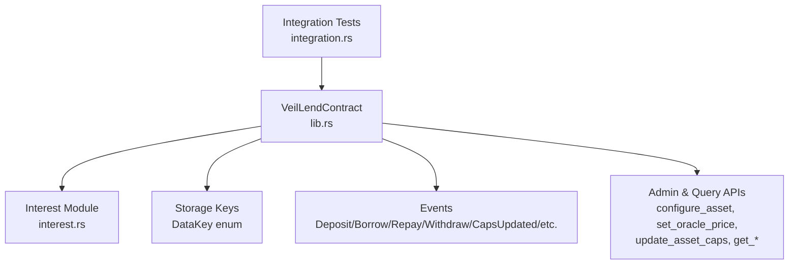
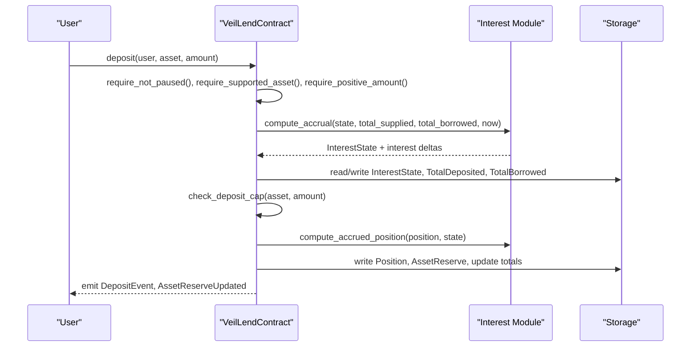
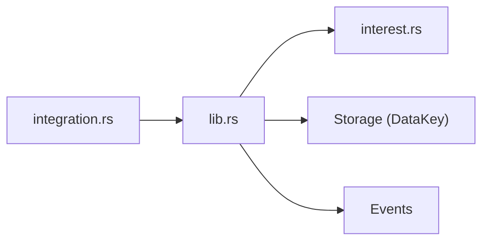

# Core Lending Operations

<cite>
**Referenced Files in This Document**
- [lib.rs](file://veilend-soroban/src/lib.rs)
- [interest.rs](file://veilend-soroban/src/interest.rs)
- [integration.rs](file://veilend-soroban/tests/integration.rs)
</cite>

## Table of Contents
1. [Introduction](#introduction)
2. [Project Structure](#project-structure)
3. [Core Components](#core-components)
4. [Architecture Overview](#architecture-overview)
5. [Detailed Component Analysis](#detailed-component-analysis)
6. [Dependency Analysis](#dependency-analysis)
7. [Performance Considerations](#performance-considerations)
8. [Troubleshooting Guide](#troubleshooting-guide)
9. [Conclusion](#conclusion)

## Introduction
This document explains the core lending operations implemented in the VeilLend Soroban smart contract: deposit, borrow, repay, and withdraw. It covers parameter validation, interest accrual behavior, cap enforcement, collateral ratio checks, reserve updates, event emissions, and error conditions for each operation. Practical usage patterns and common error scenarios are included to help developers integrate safely with the protocol.

## Project Structure
The VeilLend protocol is implemented as a Soroban smart contract with two primary source files:
- lib.rs: Contract entry points (deposit, borrow, repay, withdraw), storage schema, events, admin functions, and shared helpers.
- interest.rs: Time-based interest accrual model, rate computation, and per-position realization.

Tests in integration.rs validate end-to-end flows including caps, circuit breaker behavior, interest accrual, and conservation of value between suppliers and borrowers.

**Diagram sources**
- [lib.rs:226-719](file://veilend-soroban/src/lib.rs#L226-L719)
- [interest.rs:1-120](file://veilend-soroban/src/interest.rs#L1-L120)
- [integration.rs:1-461](file://veilend-soroban/tests/integration.rs#L1-L461)

**Section sources**
- [lib.rs:28-93](file://veilend-soroban/src/lib.rs#L28-L93)
- [interest.rs:1-22](file://veilend-soroban/src/interest.rs#L1-L22)
- [integration.rs:1-40](file://veilend-soroban/tests/integration.rs#L1-L40)

## Core Components
- Position: Tracks user’s deposited and borrowed balances plus snapshots of supply/borrow indexes at last touch.
- InterestState: Per-asset time-based accrual state (supply_index, borrow_index, last_accrual_timestamp).
- AssetReserve: Per-asset total_balance and protocol_fees; updated on deposit/borrow/repay/withdraw/fee/interest.
- DataKey: Storage keys for admin, asset support, positions, oracle prices, caps, totals, pause flag, and interest state.
- Events: DepositEvent, BorrowEvent, RepayEvent, WithdrawEvent, CapsUpdated, CircuitBreakerEvent, AssetReserveUpdated.

Key behaviors:
- All mutating operations accrue interest first to ensure caps and totals reflect current values.
- Collateralization is enforced using oracle price and minimum collateral ratio (in basis points).
- Deposit and borrow caps can be set per asset; -1 means unlimited.
- Circuit breaker (pause) blocks new deposits and borrows but allows repay and withdraw.

**Section sources**
- [lib.rs:36-105](file://veilend-soroban/src/lib.rs#L36-L105)
- [lib.rs:147-224](file://veilend-soroban/src/lib.rs#L147-L224)
- [lib.rs:721-935](file://veilend-soroban/src/lib.rs#L721-L935)
- [interest.rs:16-120](file://veilend-soroban/src/interest.rs#L16-L120)

## Architecture Overview
The contract exposes four core lending entry points that share common preconditions and postconditions:
- Pre: Validate caller, supported asset, positive amount, pause state.
- Accrue: Advance per-asset interest state and update aggregate totals.
- Validate: Enforce caps and liquidity availability where applicable.
- Realize: Compute accrued position balances before mutation.
- Mutate: Update position and reserve, then update global totals.
- Post: Emit relevant events and reserve update events.

**Diagram sources**
- [lib.rs:483-519](file://veilend-soroban/src/lib.rs#L483-L519)
- [lib.rs:792-827](file://veilend-soroban/src/lib.rs#L792-L827)
- [interest.rs:51-87](file://veilend-soroban/src/interest.rs#L51-L87)

## Detailed Component Analysis

### Deposit
Purpose: Allow users to supply assets as collateral. Updates position.deposited, reserve.total_balance, and total_deposited. Emits DepositEvent and AssetReserveUpdated.

Parameters:
- user: Address (caller must authorize)
- asset: Address (must be supported)
- amount: i128 (must be positive)

Flow:
1. Check not paused, supported asset, positive amount, and user authorization.
2. Accrue interest for the asset and persist interest state and aggregate totals.
3. Enforce deposit cap if set (non-negative limit; -1 is unlimited).
4. Realize position by computing accrued balances against current interest state.
5. Increase position.deposited and reserve.total_balance by amount.
6. Persist position and reserve; update total_deposited.
7. Emit DepositEvent and AssetReserveUpdated(kind=Deposit).

Return values:
- No explicit return value; success indicated by event emission and no panic.

Error conditions:
- ContractPaused: If the contract is paused.
- UnsupportedAsset: If asset is not configured.
- ZeroAmount or InvalidAmount: If amount is zero or negative.
- DepositCapExceeded: If deposit would exceed configured cap.

Events:
- DepositEvent(user, asset, amount)
- AssetReserveUpdated(asset, total_balance, protocol_fees, kind=Deposit)

Gas optimization considerations:
- Interest accrual is performed once per call and reused for both cap checks and position realization.
- Aggregate totals are updated only when non-zero interest deltas exist.

Practical examples:
- Successful deposit within cap and after interest accrual.
- Failure due to deposit cap exceeded.
- Failure due to contract paused.

Common error scenarios:
- Attempting to deposit while paused returns ContractPaused.
- Depositing an unsupported asset returns UnsupportedAsset.
- Supplying zero amount returns ZeroAmount.

**Section sources**
- [lib.rs:483-519](file://veilend-soroban/src/lib.rs#L483-L519)
- [lib.rs:867-888](file://veilend-soroban/src/lib.rs#L867-L888)
- [lib.rs:792-815](file://veilend-soroban/src/lib.rs#L792-L815)
- [integration.rs:61-83](file://veilend-soroban/tests/integration.rs#L61-L83)

### Borrow
Purpose: Enable users to borrow against their deposited collateral. Validates oracle price, collateral ratio, borrow cap, and liquidity availability. Updates position.borrowed, reserve.total_balance, and total_borrowed. Emits BorrowEvent and AssetReserveUpdated.

Parameters:
- user: Address (caller must authorize)
- asset: Address (must be supported)
- amount: i128 (must be positive)

Flow:
1. Check not paused, supported asset, positive amount, and user authorization.
2. Accrue interest for the asset and persist interest state and aggregate totals.
3. Enforce borrow cap if set.
4. Realize position by computing accrued balances against current interest state.
5. Ensure sufficient reserve liquidity: amount <= reserve.total_balance.
6. Increase position.borrowed and decrease reserve.total_balance by amount.
7. Assert collateralized: collateral_value * 10_000 >= borrowed_value * min_collateral_ratio_bps.
8. Persist position and reserve; update total_borrowed.
9. Emit BorrowEvent and AssetReserveUpdated(kind=Borrow).

Return values:
- No explicit return value; success indicated by event emission and no panic.

Error conditions:
- ContractPaused: If the contract is paused.
- UnsupportedAsset: If asset is not configured.
- ZeroAmount or InvalidAmount: If amount is zero or negative.
- BorrowCapExceeded: If borrow would exceed configured cap.
- InsufficientReserve: If reserve balance is insufficient for the requested amount.
- OraclePriceMissing: If oracle price is not set for the asset.
- InsufficientCollateral: If post-borrow collateral ratio falls below minimum.

Events:
- BorrowEvent(user, asset, amount)
- AssetReserveUpdated(asset, total_balance, protocol_fees, kind=Borrow)

Gas optimization considerations:
- Single accrual call per transaction; reuse result for cap checks and position realization.
- Collateralization check short-circuits early if position.borrowed == 0.

Practical examples:
- Successful borrow after ensuring oracle price is set and collateral ratio holds.
- Failure due to insufficient reserve liquidity.
- Failure due to insufficient collateral ratio.

Common error scenarios:
- Borrowing without setting oracle price returns OraclePriceMissing.
- Overborrowing relative to collateral returns InsufficientCollateral.
- Borrowing more than available reserves returns InsufficientReserve.

**Section sources**
- [lib.rs:521-561](file://veilend-soroban/src/lib.rs#L521-L561)
- [lib.rs:890-911](file://veilend-soroban/src/lib.rs#L890-L911)
- [lib.rs:913-934](file://veilend-soroban/src/lib.rs#L913-L934)
- [integration.rs:149-192](file://veilend-soroban/tests/integration.rs#L149-L192)

### Repay
Purpose: Reduce outstanding debt. Validates amount against realized borrowed balance and updates reserve and totals. Emits RepayEvent and AssetReserveUpdated.

Parameters:
- user: Address (caller must authorize)
- asset: Address (must be supported)
- amount: i128 (must be positive)

Flow:
1. Supported asset check and positive amount validation; authorization required.
2. Accrue interest for the asset and persist interest state and aggregate totals.
3. Realize position by computing accrued balances against current interest state.
4. Validate amount <= position.borrowed; otherwise fail.
5. Decrease position.borrowed and increase reserve.total_balance by amount.
6. Persist position and reserve; update total_borrowed.
7. Emit RepayEvent and AssetReserveUpdated(kind=Repay).

Return values:
- No explicit return value; success indicated by event emission and no panic.

Error conditions:
- UnsupportedAsset: If asset is not configured.
- ZeroAmount or InvalidAmount: If amount is zero or negative.
- RepayTooLarge: If amount exceeds realized borrowed balance.

Events:
- RepayEvent(user, asset, amount)
- AssetReserveUpdated(asset, total_balance, protocol_fees, kind=Repay)

Gas optimization considerations:
- Interest accrual ensures accurate realized debt before repayment validation.
- Minimal storage writes: one position, one reserve, one total update.

Practical examples:
- Repaying exactly the accrued debt succeeds.
- Repaying more than accrued debt fails with RepayTooLarge.

Common error scenarios:
- Attempting to repay more than the realized borrowed balance returns RepayTooLarge.

**Section sources**
- [lib.rs:563-598](file://veilend-soroban/src/lib.rs#L563-L598)
- [integration.rs:345-378](file://veilend-soroban/tests/integration.rs#L345-L378)

### Withdraw
Purpose: Remove deposited collateral while maintaining required collateral ratios. Validates realized deposited balance and reserve liquidity. Emits WithdrawEvent and AssetReserveUpdated.

Parameters:
- user: Address (caller must authorize)
- asset: Address (must be supported)
- amount: i128 (must be positive)

Flow:
1. Supported asset check and positive amount validation; authorization required.
2. Accrue interest for the asset and persist interest state and aggregate totals.
3. Realize position by computing accrued balances against current interest state.
4. Validate amount <= position.deposited; otherwise fail.
5. Validate amount <= reserve.total_balance; otherwise fail.
6. Decrease position.deposited and reserve.total_balance by amount.
7. Assert collateralized: collateral ratio must remain above minimum if any debt remains.
8. Persist position and reserve; update total_deposited.
9. Emit WithdrawEvent and AssetReserveUpdated(kind=Withdraw).

Return values:
- No explicit return value; success indicated by event emission and no panic.

Error conditions:
- UnsupportedAsset: If asset is not configured.
- ZeroAmount or InvalidAmount: If amount is zero or negative.
- InsufficientDeposit: If amount exceeds realized deposited balance.
- InsufficientReserve: If reserve balance is insufficient for withdrawal.
- InsufficientCollateral: If post-withdraw collateral ratio falls below minimum.

Events:
- WithdrawEvent(user, asset, amount)
- AssetReserveUpdated(asset, total_balance, protocol_fees, kind=Withdraw)

Gas optimization considerations:
- Interest accrual ensures accurate realized deposit and debt before withdrawal.
- Collateralization check avoids unnecessary computations when position.borrowed == 0.

Practical examples:
- Withdrawing part of the accrued deposit succeeds if collateral ratio remains valid.
- Withdrawing entire deposit after repaying all debt succeeds.

Common error scenarios:
- Withdrawing more than realized deposited balance returns InsufficientDeposit.
- Withdrawing while maintaining debt below collateral threshold returns InsufficientCollateral.

**Section sources**
- [lib.rs:600-639](file://veilend-soroban/src/lib.rs#L600-L639)
- [lib.rs:913-934](file://veilend-soroban/src/lib.rs#L913-L934)
- [integration.rs:114-127](file://veilend-soroban/tests/integration.rs#L114-L127)

## Dependency Analysis
- lib.rs depends on interest.rs for accrual math and position realization.
- All mutating entry points depend on helper functions for storage reads/writes, cap checks, and collateral assertions.
- Integration tests exercise end-to-end flows and validate event emissions and state transitions.

**Diagram sources**
- [lib.rs:226-719](file://veilend-soroban/src/lib.rs#L226-L719)
- [interest.rs:1-120](file://veilend-soroban/src/interest.rs#L1-L120)
- [integration.rs:1-461](file://veilend-soroban/tests/integration.rs#L1-L461)

**Section sources**
- [lib.rs:721-935](file://veilend-soroban/src/lib.rs#L721-L935)
- [interest.rs:51-120](file://veilend-soroban/src/interest.rs#L51-L120)
- [integration.rs:85-127](file://veilend-soroban/tests/integration.rs#L85-L127)

## Performance Considerations
- Interest accrual is idempotent per timestamp; repeated calls at the same ledger timestamp do not advance indexes or totals.
- Accrual is performed once per mutating operation and reused for cap checks and position realization to minimize redundant computation.
- Aggregate totals are updated only when non-zero interest deltas occur, reducing storage writes.
- Collateralization checks short-circuit when there is no outstanding debt, avoiding oracle lookups and multiplications.
- Cap checks use simple arithmetic comparisons and early exits for unlimited (-1) caps.

[No sources needed since this section provides general guidance]

## Troubleshooting Guide
Common errors and their causes:
- ContractPaused: New deposits and borrows blocked when the contract is paused; repay and withdraw remain allowed.
- UnsupportedAsset: Asset not configured via configure_asset; ensure admin sets supported=true.
- ZeroAmount/InvalidAmount: Amount must be positive; verify input validation in client code.
- DepositCapExceeded/BorrowCapExceeded: Caps set by admin restrict total deposits/borrows; adjust caps or reduce amounts.
- InsufficientReserve: Borrow/withdraw requests exceed available reserve balance; wait for repayments or adjust strategy.
- OraclePriceMissing: Oracle price not set for asset; admin must call set_oracle_price before borrowing or collateral checks.
- InsufficientCollateral: Post-operation collateral ratio below minimum; increase deposits or reduce borrows.
- RepayTooLarge: Repayment amount exceeds realized borrowed balance; query position before repaying.

Operational tips:
- Always accrue interest before reading positions or totals to ensure up-to-date values.
- Use get_interest_state and get_position to simulate outcomes prior to submitting transactions.
- Monitor AssetReserveUpdated events to track reserve changes across operations.

**Section sources**
- [lib.rs:107-145](file://veilend-soroban/src/lib.rs#L107-L145)
- [lib.rs:835-934](file://veilend-soroban/src/lib.rs#L835-L934)
- [integration.rs:85-127](file://veilend-soroban/tests/integration.rs#L85-L127)

## Conclusion
The VeilLend contract implements robust core lending operations with clear validation, interest accrual, cap enforcement, and collateral ratio checks. Each operation follows a consistent pattern: accrue interest, validate constraints, realize position balances, update state, and emit events. Developers should ensure proper setup (supported assets, oracle prices, caps) and handle expected error conditions gracefully. The integration tests provide reliable references for typical usage patterns and edge cases.

[No sources needed since this section summarizes without analyzing specific files]