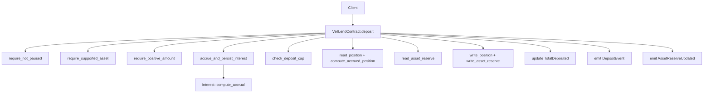
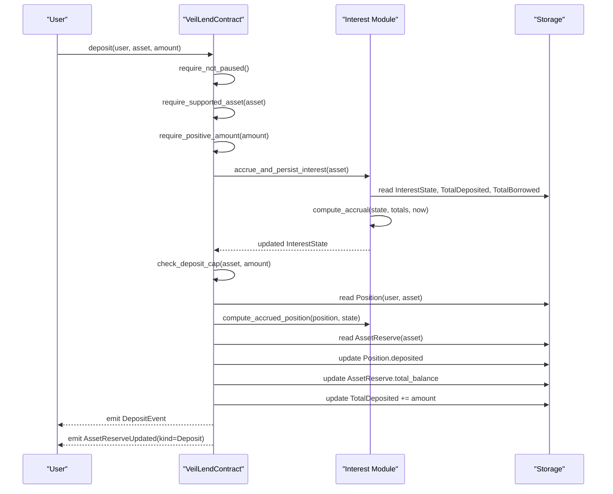
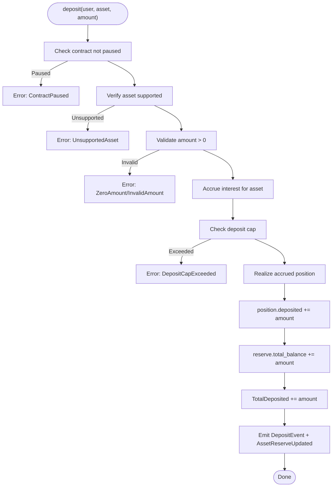
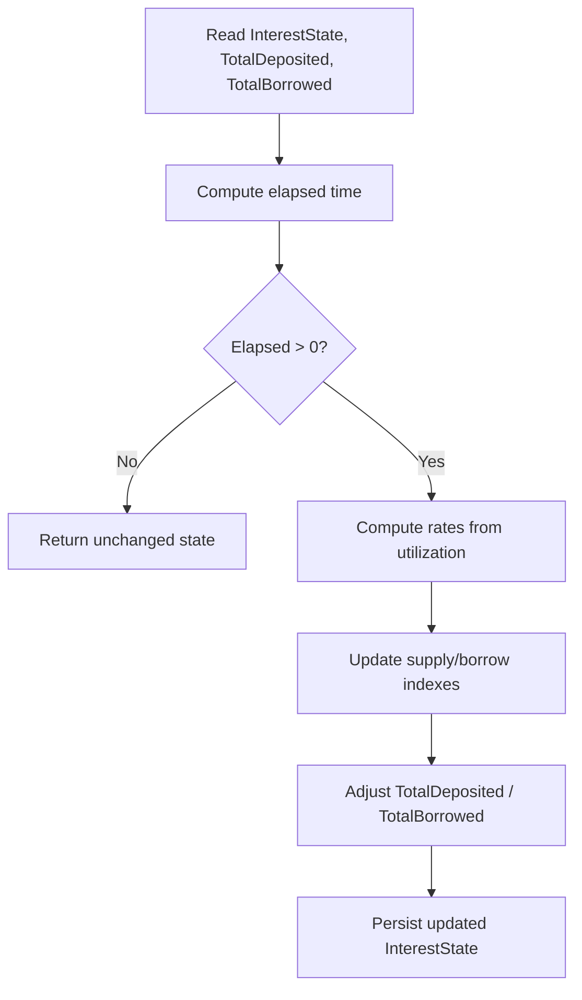
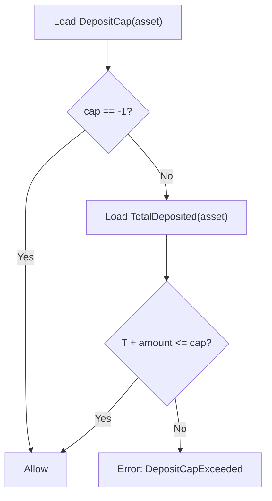
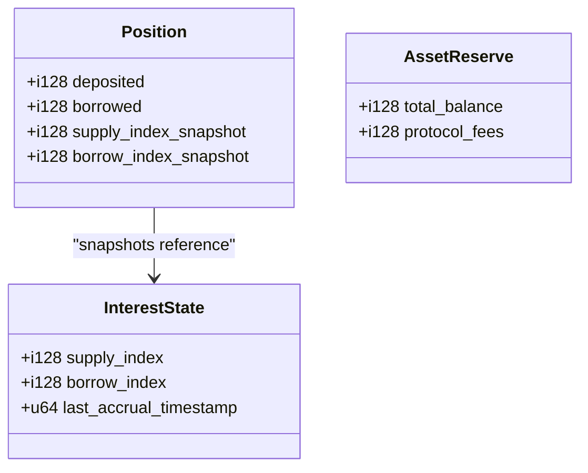
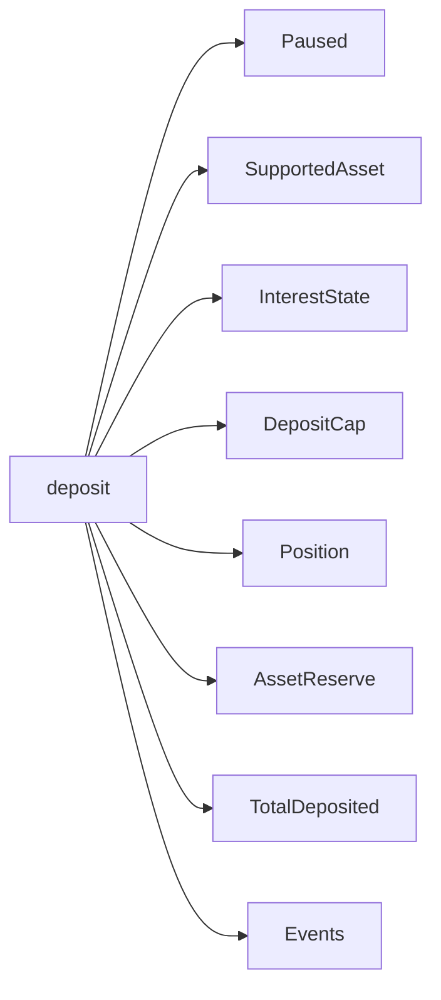

# Deposit Function

<cite>
**Referenced Files in This Document**
- [lib.rs](file://veilend-soroban/src/lib.rs)
- [interest.rs](file://veilend-soroban/src/interest.rs)
- [integration.rs](file://veilend-soroban/tests/integration.rs)
</cite>

## Table of Contents
1. [Introduction](#introduction)
2. [Project Structure](#project-structure)
3. [Core Components](#core-components)
4. [Architecture Overview](#architecture-overview)
5. [Detailed Component Analysis](#detailed-component-analysis)
6. [Dependency Analysis](#dependency-analysis)
7. [Performance Considerations](#performance-considerations)
8. [Troubleshooting Guide](#troubleshooting-guide)
9. [Conclusion](#conclusion)

## Introduction
This document explains the VeilLend deposit function on Soroban end-to-end: how it validates inputs, enforces circuit breaker and asset support rules, accrues interest to keep caps and totals accurate, enforces per-asset deposit caps, updates position state and reserves, tracks total deposits, and emits events. It also provides practical examples and guidance for gas optimization and common error conditions.

## Project Structure
The deposit logic is implemented in the VeilLend Soroban contract. The core flow lives in the main contract file, with time-based interest math isolated in a dedicated module. Integration tests demonstrate deposit behavior under various configurations (caps, pause, oracle price).

**Diagram sources**
- [lib.rs:483-519](file://veilend-soroban/src/lib.rs#L483-L519)
- [lib.rs:792-815](file://veilend-soroban/src/lib.rs#L792-L815)
- [interest.rs:51-87](file://veilend-soroban/src/interest.rs#L51-L87)

**Section sources**
- [lib.rs:483-519](file://veilend-soroban/src/lib.rs#L483-L519)
- [interest.rs:51-87](file://veilend-soroban/src/interest.rs#L51-L87)
- [integration.rs:149-192](file://veilend-soroban/tests/integration.rs#L149-L192)

## Core Components
- VeilLendContract: Exposes deposit and related helpers for validation, accrual, cap checks, and state updates.
- InterestState and Position: Track per-asset accrual indexes and per-user balances with snapshots.
- Storage keys: SupportedAsset, DepositCap, BorrowCap, TotalDeposited, TotalBorrowed, Paused, InterestState, AssetReserve, Position.

Key responsibilities relevant to deposit:
- Circuit breaker check (pause/unpause)
- Asset support verification
- Positive amount validation
- Time-based interest accrual before cap checks and balance mutations
- Per-asset deposit cap enforcement
- Position and reserve updates
- Global totals tracking
- Event emissions

**Section sources**
- [lib.rs:38-57](file://veilend-soroban/src/lib.rs#L38-L57)
- [lib.rs:59-93](file://veilend-soroban/src/lib.rs#L59-L93)
- [lib.rs:107-145](file://veilend-soroban/src/lib.rs#L107-L145)

## Architecture Overview
The deposit entrypoint orchestrates safety checks, accrual, cap enforcement, and state changes in a strict order to ensure consistency and correctness.

**Diagram sources**
- [lib.rs:483-519](file://veilend-soroban/src/lib.rs#L483-L519)
- [lib.rs:792-815](file://veilend-soroban/src/lib.rs#L792-L815)
- [interest.rs:51-87](file://veilend-soroban/src/interest.rs#L51-L87)

## Detailed Component Analysis

### Deposit Workflow
- Parameter validation:
  - Circuit breaker: if paused, deposit is blocked.
  - Asset support: only configured assets can be deposited.
  - Amount must be positive; zero or negative amounts are rejected.
- Interest accrual:
  - Before any cap or balance mutation, interest is accrued for the asset using current ledger timestamp and aggregate totals. This ensures cap checks and totals reflect up-to-date values.
- Cap enforcement:
  - If a deposit cap is set (not unlimited), the sum of current TotalDeposited plus the new amount must not exceed the cap.
- Position and reserve updates:
  - Realize accrued interest into the user’s position via compute_accrued_position.
  - Increment position.deposited by amount.
  - Increment asset reserve total_balance by amount.
  - Persist both position and reserve.
- Global totals:
  - Increase TotalDeposited by amount.
- Events:
  - Emit DepositEvent with user, asset, and amount.
  - Emit AssetReserveUpdated with kind Deposit.

**Diagram sources**
- [lib.rs:483-519](file://veilend-soroban/src/lib.rs#L483-L519)
- [lib.rs:835-854](file://veilend-soroban/src/lib.rs#L835-L854)
- [lib.rs:856-887](file://veilend-soroban/src/lib.rs#L856-L887)
- [interest.rs:51-87](file://veilend-soroban/src/interest.rs#L51-L87)

**Section sources**
- [lib.rs:483-519](file://veilend-soroban/src/lib.rs#L483-L519)
- [lib.rs:835-887](file://veilend-soroban/src/lib.rs#L835-L887)
- [interest.rs:51-87](file://veilend-soroban/src/interest.rs#L51-L87)

### Interest Accrual Before Deposits
- Purpose: Ensure that when checking deposit caps and updating totals, the system uses time-aware, accrued values. Without accrual, caps could be bypassed due to stale totals.
- Mechanism:
  - Reads InterestState and aggregate totals.
  - Computes growth based on utilization and elapsed time.
  - Updates InterestState and adjusts TotalDeposited and TotalBorrowed accordingly.
  - Idempotent: no-op if no time has elapsed.

**Diagram sources**
- [lib.rs:792-815](file://veilend-soroban/src/lib.rs#L792-L815)
- [interest.rs:51-87](file://veilend-soroban/src/interest.rs#L51-L87)

**Section sources**
- [lib.rs:792-815](file://veilend-soroban/src/lib.rs#L792-L815)
- [interest.rs:51-87](file://veilend-soroban/src/interest.rs#L51-L87)

### Deposit Cap Enforcement
- Unlimited cap: value -1 means no limit.
- Limited cap: current TotalDeposited + amount must not exceed the configured cap.
- Enforced after accrual so that totals include accrued interest.

**Diagram sources**
- [lib.rs:867-887](file://veilend-soroban/src/lib.rs#L867-L887)

**Section sources**
- [lib.rs:867-887](file://veilend-soroban/src/lib.rs#L867-L887)

### Position State Updates
- Realization: compute_accrued_position applies accrued interest to the user’s position and re-anchors index snapshots.
- On deposit:
  - position.deposited increases by amount.
  - reserve.total_balance increases by amount.
  - Both are persisted.
- Index snapshots:
  - After realization, position.supply_index_snapshot and borrow_index_snapshot are updated to current interest indexes.

**Diagram sources**
- [lib.rs:59-93](file://veilend-soroban/src/lib.rs#L59-L93)
- [interest.rs:97-120](file://veilend-soroban/src/interest.rs#L97-L120)

**Section sources**
- [lib.rs:59-93](file://veilend-soroban/src/lib.rs#L59-L93)
- [interest.rs:97-120](file://veilend-soroban/src/interest.rs#L97-L120)

### Total Deposited Tracking
- After successful deposit, TotalDeposited for the asset is increased by amount.
- Accrual may have already adjusted TotalDeposited to include earned interest prior to the deposit.

**Section sources**
- [lib.rs:506-510](file://veilend-soroban/src/lib.rs#L506-L510)
- [lib.rs:801-812](file://veilend-soroban/src/lib.rs#L801-L812)

### Event Emissions
- DepositEvent: emitted with user, asset, and amount upon successful deposit.
- AssetReserveUpdated: emitted with kind Deposit reflecting reserve changes.

**Section sources**
- [lib.rs:157-165](file://veilend-soroban/src/lib.rs#L157-L165)
- [lib.rs:216-224](file://veilend-soroban/src/lib.rs#L216-L224)
- [lib.rs:512-518](file://veilend-soroban/src/lib.rs#L512-L518)

### Practical Examples
- Successful deposit with unlimited caps:
  - Configure asset, set oracle price, deposit large amount without hitting limits.
  - Verified by integration test demonstrating large deposit and subsequent borrow.
- Deposit at exact cap:
  - Two users deposit up to the configured deposit cap; next deposit attempt fails.
- Cap exceeded:
  - Attempting to deposit beyond the configured cap results in an error.
- Unsupported asset:
  - Depositing to an asset not configured as supported fails early.

References:
- Unlimited caps example: [integration.rs:195-217](file://veilend-soroban/tests/integration.rs#L195-L217)
- Caps enforced across multiple users: [integration.rs:149-192](file://veilend-soroban/tests/integration.rs#L149-L192)

**Section sources**
- [integration.rs:149-217](file://veilend-soroban/tests/integration.rs#L149-L217)

## Dependency Analysis
- deposit depends on:
  - Circuit breaker state (Paused)
  - Asset configuration (SupportedAsset)
  - Interest accrual (InterestState, compute_accrual)
  - Cap configuration (DepositCap)
  - Position storage (Position)
  - Reserve storage (AssetReserve)
  - Totals storage (TotalDeposited, TotalBorrowed)
  - Event emission utilities

**Diagram sources**
- [lib.rs:483-519](file://veilend-soroban/src/lib.rs#L483-L519)
- [lib.rs:792-815](file://veilend-soroban/src/lib.rs#L792-L815)
- [lib.rs:835-887](file://veilend-soroban/src/lib.rs#L835-L887)

**Section sources**
- [lib.rs:483-519](file://veilend-soroban/src/lib.rs#L483-L519)
- [lib.rs:792-815](file://veilend-soroban/src/lib.rs#L792-L815)
- [lib.rs:835-887](file://veilend-soroban/src/lib.rs#L835-L887)

## Performance Considerations
- Early exits:
  - Circuit breaker and asset support checks occur before expensive accrual and storage writes.
- Minimal storage writes:
  - Only necessary fields are updated: position, reserve, and totals.
- Idempotent accrual:
  - If no time has elapsed, accrual is a no-op, avoiding unnecessary writes.
- Gas optimization tips:
  - Batch operations off-chain where possible; call deposit once per transaction.
  - Avoid redundant calls to accrue_interest immediately before deposit unless needed for external reads.
  - Use unlimited caps (-1) when appropriate to avoid cap checks overhead.

[No sources needed since this section provides general guidance]

## Troubleshooting Guide
Common errors during deposit:
- ContractPaused:
  - Cause: Admin paused the contract.
  - Resolution: Unpause via admin function before attempting deposit.
- UnsupportedAsset:
  - Cause: Asset not configured as supported.
  - Resolution: Configure asset as supported by admin.
- ZeroAmount or InvalidAmount:
  - Cause: Amount is zero or negative.
  - Resolution: Provide a positive amount.
- DepositCapExceeded:
  - Cause: Proposed deposit would exceed the per-asset deposit cap.
  - Resolution: Reduce amount or increase cap via admin.
- InsufficientCollateral:
  - Note: Not thrown by deposit directly; occurs on borrow/withdraw when collateral ratio falls below minimum. Relevant when planning subsequent borrows against deposits.

Operational notes:
- Always ensure oracle price is set for assets you intend to borrow against later.
- Use get_total_deposited and get_asset_caps to pre-validate deposits client-side.

**Section sources**
- [lib.rs:107-145](file://veilend-soroban/src/lib.rs#L107-L145)
- [lib.rs:835-887](file://veilend-soroban/src/lib.rs#L835-L887)
- [lib.rs:913-933](file://veilend-soroban/src/lib.rs#L913-L933)

## Conclusion
The VeilLend deposit function enforces a robust sequence of validations, accrual, and state updates to maintain protocol integrity. By accruing interest before cap checks and totals updates, it prevents inconsistencies and ensures accurate enforcement of per-asset deposit limits. Proper usage involves configuring assets, setting oracle prices, and managing caps and pause states. Clients should handle expected errors gracefully and optimize gas by minimizing redundant calls.

[No sources needed since this section summarizes without analyzing specific files]