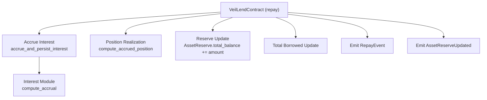
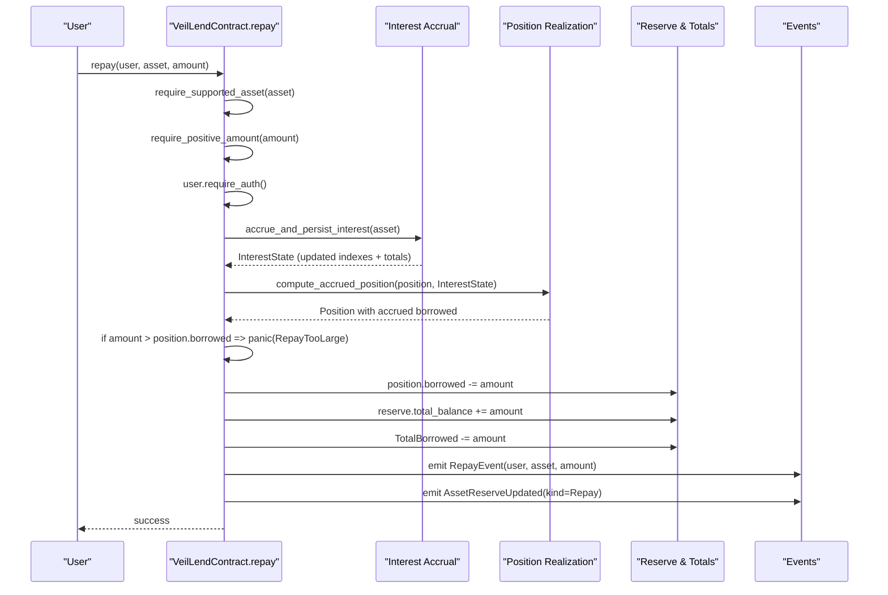
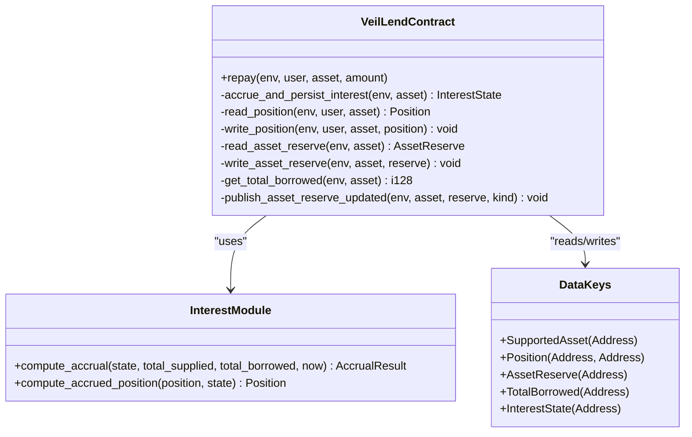

# Repay Function

<cite>
**Referenced Files in This Document**
- [lib.rs](file://veilend-soroban/src/lib.rs)
- [interest.rs](file://veilend-soroban/src/interest.rs)
- [integration.rs](file://veilend-soroban/tests/integration.rs)
</cite>

## Table of Contents
1. [Introduction](#introduction)
2. [Project Structure](#project-structure)
3. [Core Components](#core-components)
4. [Architecture Overview](#architecture-overview)
5. [Detailed Component Analysis](#detailed-component-analysis)
6. [Dependency Analysis](#dependency-analysis)
7. [Performance Considerations](#performance-considerations)
8. [Troubleshooting Guide](#troubleshooting-guide)
9. [Conclusion](#conclusion)

## Introduction
This document explains the repay function that allows users to reduce their outstanding debt for a supported asset. It covers validation, interest accrual before repayment, balance updates, total borrowed tracking, event emission, and behavior when the protocol is paused. It also includes examples of partial repayments, full debt clearance, error scenarios such as RepayTooLarge, and gas optimization considerations tied to interest accrual mechanics.

## Project Structure
The repay logic resides in the Soroban lending contract implementation and relies on an interest accrual module. Tests demonstrate end-to-end behavior including accrued amounts and error handling.

**Diagram sources**
- [lib.rs:563-598](file://veilend-soroban/src/lib.rs#L563-L598)
- [lib.rs:782-815](file://veilend-soroban/src/lib.rs#L782-L815)
- [interest.rs:51-87](file://veilend-soroban/src/interest.rs#L51-L87)

**Section sources**
- [lib.rs:563-598](file://veilend-soroban/src/lib.rs#L563-L598)
- [lib.rs:782-815](file://veilend-soroban/src/lib.rs#L782-L815)
- [interest.rs:51-87](file://veilend-soroban/src/interest.rs#L51-L87)

## Core Components
- Repay entrypoint: validates inputs, accrues interest, realizes position balances, enforces limits, updates state, and emits events.
- Interest accrual: advances per-asset indexes based on elapsed time and utilization; updates aggregate totals for deposited and borrowed.
- Position realization: applies accrued interest to user’s borrowed/deposited balances using stored index snapshots.
- Reserve accounting: adjusts reserve total balance during repay.
- Total borrowed tracking: decremented by the repaid amount after accrual and position update.
- Events: RepayEvent and AssetReserveUpdated are emitted to record the operation.

Key responsibilities and interactions are implemented across lib.rs and interest.rs.

**Section sources**
- [lib.rs:563-598](file://veilend-soroban/src/lib.rs#L563-L598)
- [lib.rs:782-815](file://veilend-soroban/src/lib.rs#L782-L815)
- [interest.rs:51-87](file://veilend-soroban/src/interest.rs#L51-L87)
- [interest.rs:89-120](file://veilend-soroban/src/interest.rs#L89-L120)

## Architecture Overview
The repay flow ensures accurate debt reduction by first accruing interest at the reserve level and then realizing it into the user’s position. This guarantees that repayments reflect the true outstanding debt at ledger time.

**Diagram sources**
- [lib.rs:563-598](file://veilend-soroban/src/lib.rs#L563-L598)
- [lib.rs:782-815](file://veilend-soroban/src/lib.rs#L782-L815)
- [interest.rs:51-87](file://veilend-soroban/src/interest.rs#L51-L87)
- [interest.rs:89-120](file://veilend-soroban/src/interest.rs#L89-L120)

## Detailed Component Analysis

### Repay Workflow and Validation
- Supported asset verification: The function requires the asset to be configured as supported; otherwise, it fails with UnsupportedAsset.
- Positive amount validation: Zero or negative amounts are rejected with ZeroAmount or InvalidAmount respectively.
- Authentication: The caller must authorize the transaction.
- Paused behavior: Repay remains available even when the contract is paused; deposit/borrow operations are blocked while repay/withdraw are allowed.

These validations ensure safe and predictable repay behavior under all protocol states.

**Section sources**
- [lib.rs:563-567](file://veilend-soroban/src/lib.rs#L563-L567)
- [lib.rs:835-854](file://veilend-soroban/src/lib.rs#L835-L854)
- [lib.rs:856-865](file://veilend-soroban/src/lib.rs#L856-L865)

### Interest Accrual Before Repayment
- The function calls accrue_and_persist_interest to advance the per-asset interest indexes and update aggregate totals for deposited and borrowed amounts based on elapsed time and utilization.
- After accrual, the user’s position is realized via compute_accrued_position, which applies accrued interest to the borrowed balance using stored index snapshots.
- This two-step process ensures repayments are calculated against up-to-date debt values.

**Section sources**
- [lib.rs:569-574](file://veilend-soroban/src/lib.rs#L569-L574)
- [lib.rs:782-815](file://veilend-soroban/src/lib.rs#L782-L815)
- [interest.rs:51-87](file://veilend-soroban/src/interest.rs#L51-L87)
- [interest.rs:89-120](file://veilend-soroban/src/interest.rs#L89-L120)

### Repayment Validation Against Outstanding Debt
- After realizing the accrued position, the function checks whether the requested repayment amount exceeds the user’s current borrowed balance.
- If the amount is greater than the accrued borrowed balance, it panics with RepayTooLarge.
- This prevents over-repayment and maintains invariant integrity.

**Section sources**
- [lib.rs:571-578](file://veilend-soroban/src/lib.rs#L571-L578)

### Position State Updates
- Borrowed balance decrement: position.borrowed is reduced by the repaid amount.
- Reserve balance increment: reserve.total_balance increases by the same amount, reflecting assets returning to the pool.
- These updates are persisted atomically within the transaction.

**Section sources**
- [lib.rs:580-583](file://veilend-soroban/src/lib.rs#L580-L583)

### Total Borrowed Tracking Updates
- The global TotalBorrowed for the asset is decremented by the repaid amount after position and reserve updates.
- This keeps aggregate metrics consistent with individual positions.

**Section sources**
- [lib.rs:585-589](file://veilend-soroban/src/lib.rs#L585-L589)

### Event Emissions
- RepayEvent: Emits user, asset, and amount to record the repayment.
- AssetReserveUpdated: Emits updated reserve totals and kind set to Repay for auditability.

**Section sources**
- [lib.rs:591-598](file://veilend-soroban/src/lib.rs#L591-L598)

### Examples and Scenarios
- Partial repayment: A user repays less than their accrued borrowed balance; position.borrowed decreases proportionally, reserve.total_balance increases, and TotalBorrowed decreases accordingly.
- Full debt clearance: A user repays exactly their accrued borrowed balance; position.borrowed becomes zero, enabling subsequent withdrawal of the full accrued deposit.
- Error scenario (RepayTooLarge): Attempting to repay more than the accrued borrowed balance results in RepayTooLarge.

These behaviors are validated in integration tests demonstrating accrued amounts and error conditions.

**Section sources**
- [integration.rs:345-378](file://veilend-soroban/tests/integration.rs#L345-L378)

## Dependency Analysis
The repay function depends on several internal components and data structures:

**Diagram sources**
- [lib.rs:563-598](file://veilend-soroban/src/lib.rs#L563-L598)
- [lib.rs:782-815](file://veilend-soroban/src/lib.rs#L782-L815)
- [interest.rs:51-87](file://veilend-soroban/src/interest.rs#L51-L87)
- [interest.rs:89-120](file://veilend-soroban/src/interest.rs#L89-L120)

**Section sources**
- [lib.rs:563-598](file://veilend-soroban/src/lib.rs#L563-L598)
- [lib.rs:782-815](file://veilend-soroban/src/lib.rs#L782-L815)
- [interest.rs:51-87](file://veilend-soroban/src/interest.rs#L51-L87)
- [interest.rs:89-120](file://veilend-soroban/src/interest.rs#L89-L120)

## Performance Considerations
- Gas efficiency:
  - Early validation (supported asset, positive amount, auth) minimizes unnecessary computation.
  - Accrual is performed once per repay call; avoid redundant accrues by batching related operations where possible.
  - Position realization uses fixed-point arithmetic and avoids extra storage reads beyond necessary.
- Idempotent accrual:
  - Accrue calls with no elapsed time are no-ops, preventing redundant writes and gas costs.
- Storage access patterns:
  - Reads and writes are minimized to essential keys: InterestState, Position, AssetReserve, and TotalBorrowed.
  - Emitting events occurs after state updates to ensure consistency.

[No sources needed since this section provides general guidance]

## Troubleshooting Guide
Common errors and their causes:
- RepayTooLarge: Occurs when the repayment amount exceeds the user’s accrued borrowed balance. Ensure the amount does not surpass the realized position.borrowed after accrual.
- UnsupportedAsset: The asset is not configured as supported; configure it via admin functions before attempting repay.
- ZeroAmount / InvalidAmount: Amount must be strictly positive; verify input parameters.
- ContractPaused: While repay remains available when paused, other operations may be blocked; confirm intended action aligns with pause semantics.

Diagnostic steps:
- Check the latest interest state and realized position before submitting repay.
- Validate asset support and oracle price configuration if borrowing/collateral checks are involved elsewhere.
- Review events (RepayEvent, AssetReserveUpdated) to confirm successful state transitions.

**Section sources**
- [lib.rs:563-598](file://veilend-soroban/src/lib.rs#L563-L598)
- [lib.rs:835-854](file://veilend-soroban/src/lib.rs#L835-L854)
- [lib.rs:856-865](file://veilend-soroban/src/lib.rs#L856-L865)

## Conclusion
The repay function provides a robust mechanism for users to reduce outstanding debt accurately by incorporating interest accrual prior to balance updates. It enforces strict validation, prevents over-repayment, updates position and reserve state consistently, tracks total borrowed globally, and emits comprehensive events. Importantly, repay remains available even when the protocol is paused, ensuring users can always reduce their debt. Integration tests validate partial repayments, full debt clearance, and error handling, confirming correctness and reliability.

[No sources needed since this section summarizes without analyzing specific files]