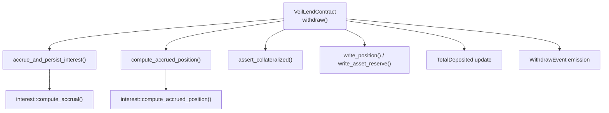
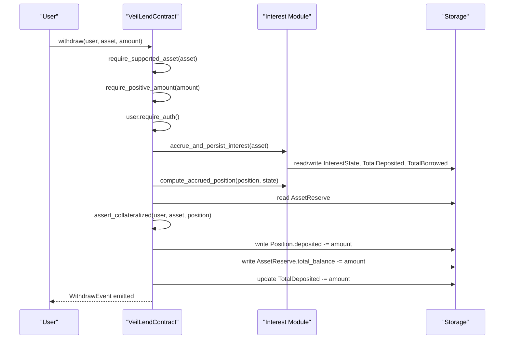
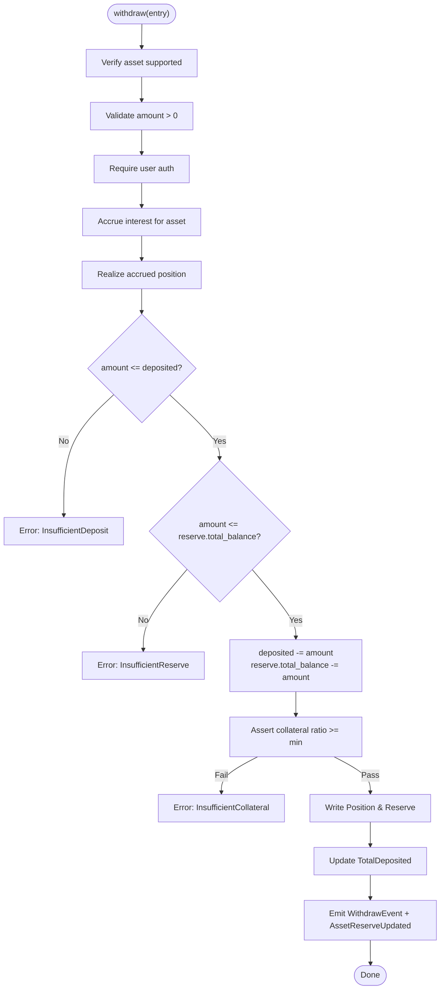
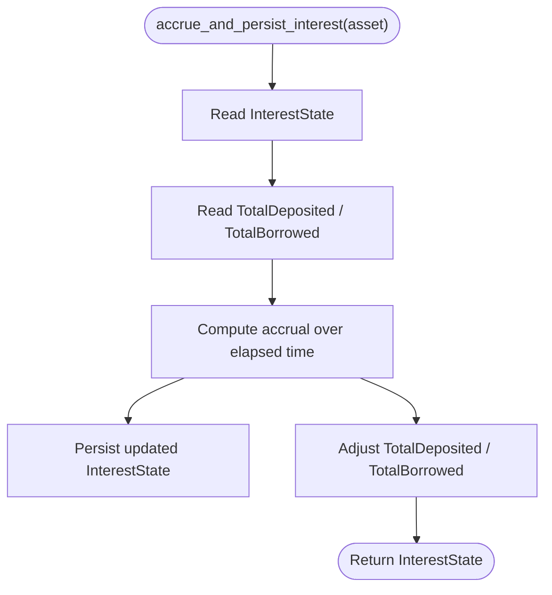
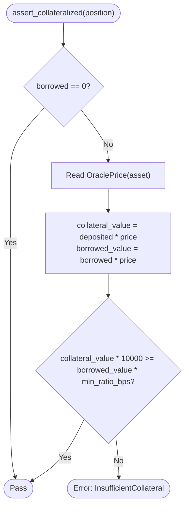
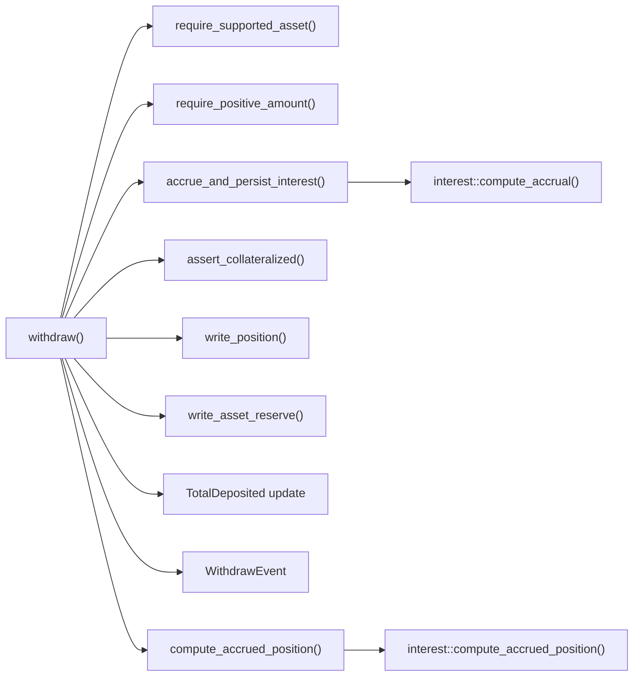

# Withdraw Function

<cite>
**Referenced Files in This Document**
- [lib.rs](file://veilend-soroban/src/lib.rs)
- [interest.rs](file://veilend-soroban/src/interest.rs)
- [integration.rs](file://veilend-soroban/tests/integration.rs)
- [test_repay_and_withdraw_operate_on_accrued_amounts.1.json](file://veilend-soroban/test_snapshots/test_repay_and_withdraw_operate_on_accrued_amounts.1.json)
</cite>

## Table of Contents
1. [Introduction](#introduction)
2. [Project Structure](#project-structure)
3. [Core Components](#core-components)
4. [Architecture Overview](#architecture-overview)
5. [Detailed Component Analysis](#detailed-component-analysis)
6. [Dependency Analysis](#dependency-analysis)
7. [Performance Considerations](#performance-considerations)
8. [Troubleshooting Guide](#troubleshooting-guide)
9. [Conclusion](#conclusion)
10. [Appendices](#appendices)

## Introduction
This document explains the withdraw function that allows users to remove deposited collateral from the protocol. It covers supported asset verification, positive amount validation, interest accrual prior to withdrawal, dual balance checks (user deposit and reserve liquidity), collateral ratio enforcement, state updates, total deposited tracking, and event emissions. It also clarifies that withdrawals remain available even when the protocol is paused, ensuring users can always access their collateral.

## Project Structure
The withdraw logic resides in the VeilLend Soroban contract. Interest accrual math is implemented in a separate module and reused by all mutating entrypoints. Tests demonstrate end-to-end behavior including accrued amounts and pause semantics.

**Diagram sources**
- [lib.rs:600-639](file://veilend-soroban/src/lib.rs#L600-L639)
- [lib.rs:782-815](file://veilend-soroban/src/lib.rs#L782-L815)
- [interest.rs:51-87](file://veilend-soroban/src/interest.rs#L51-L87)
- [interest.rs:97-120](file://veilend-soroban/src/interest.rs#L97-L120)

**Section sources**
- [lib.rs:600-639](file://veilend-soroban/src/lib.rs#L600-L639)
- [interest.rs:51-87](file://veilend-soroban/src/interest.rs#L51-L87)
- [integration.rs:344-378](file://veilend-soroban/tests/integration.rs#L344-L378)

## Core Components
- VeilLendContract.withdraw: Entry point for withdrawing deposited collateral.
- Interest accrual: Ensures time-based interest is applied before balance mutations.
- Collateralization check: Enforces minimum collateral ratio after withdrawal.
- State persistence: Updates position, reserve, totals, and emits events.

Key responsibilities:
- Validate inputs: supported asset, positive amount, user authorization.
- Accrue interest to ensure accurate balances.
- Validate sufficient deposit and reserve liquidity.
- Enforce collateral ratio post-withdrawal.
- Persist changes and emit events.

**Section sources**
- [lib.rs:600-639](file://veilend-soroban/src/lib.rs#L600-L639)
- [lib.rs:835-854](file://veilend-soroban/src/lib.rs#L835-L854)
- [lib.rs:913-934](file://veilend-soroban/src/lib.rs#L913-L934)

## Architecture Overview
The withdraw workflow integrates with the interest accrual system and collateral checks to maintain protocol safety while allowing user withdrawals at any time, even during pauses.

**Diagram sources**
- [lib.rs:600-639](file://veilend-soroban/src/lib.rs#L600-L639)
- [lib.rs:782-815](file://veilend-soroban/src/lib.rs#L782-L815)
- [interest.rs:51-87](file://veilend-soroban/src/interest.rs#L51-L87)
- [interest.rs:97-120](file://veilend-soroban/src/interest.rs#L97-L120)

## Detailed Component Analysis

### Withdraw Workflow
- Supported asset verification: The function requires the asset to be configured as supported; otherwise it fails with an unsupported asset error.
- Positive amount validation: Zero or negative amounts are rejected early.
- Authorization: The caller must authorize the transaction.
- Interest accrual: Before any balance mutation, interest is accrued for the asset so that both per-position balances and aggregate totals reflect current time.
- Dual balance checks:
  - InsufficientDeposit: If the requested amount exceeds the user’s accrued deposited balance.
  - InsufficientReserve: If the requested amount exceeds the asset reserve’s total balance.
- Collateral ratio validation: After adjusting balances, the function ensures the position remains adequately collateralized against outstanding debt using oracle prices and the configured minimum collateral ratio.
- State updates:
  - Decrease position.deposited by the withdrawn amount.
  - Decrease AssetReserve.total_balance by the same amount.
  - Update TotalDeposited for the asset by subtracting the amount.
- Event emission: Emits a WithdrawEvent with user, asset, and amount, and publishes an AssetReserveUpdated event indicating a withdrawal.

**Diagram sources**
- [lib.rs:600-639](file://veilend-soroban/src/lib.rs#L600-L639)
- [lib.rs:835-854](file://veilend-soroban/src/lib.rs#L835-L854)
- [lib.rs:913-934](file://veilend-soroban/src/lib.rs#L913-L934)

**Section sources**
- [lib.rs:600-639](file://veilend-soroban/src/lib.rs#L600-L639)
- [lib.rs:835-854](file://veilend-soroban/src/lib.rs#L835-L854)
- [lib.rs:913-934](file://veilend-soroban/src/lib.rs#L913-L934)

### Interest Accrual Prior to Withdrawals
- Purpose: Ensure that both the user’s position and the aggregate totals reflect accrued interest at the current ledger timestamp before any mutation.
- Mechanism:
  - Reads the current InterestState and computes growth based on elapsed time and utilization.
  - Persists updated supply/borrow indexes and adjusts TotalDeposited and TotalBorrowed by accrued interest amounts.
  - Realizes per-position balances using the accrued state so that deposited and borrowed values reflect interest since last touch.
- Idempotency: Multiple accrual calls at the same timestamp do not change state.

**Diagram sources**
- [lib.rs:782-815](file://veilend-soroban/src/lib.rs#L782-L815)
- [interest.rs:51-87](file://veilend-soroban/src/interest.rs#L51-L87)

**Section sources**
- [lib.rs:782-815](file://veilend-soroban/src/lib.rs#L782-L815)
- [interest.rs:51-87](file://veilend-soroban/src/interest.rs#L51-L87)
- [integration.rs:311-342](file://veilend-soroban/tests/integration.rs#L311-L342)

### Collateral Ratio Enforcement
- When a position has outstanding debt, the function verifies that collateral value meets or exceeds the minimum collateral ratio threshold derived from oracle price and configured minimum bps.
- If the ratio falls below the threshold after withdrawal, the operation reverts with InsufficientCollateral.
- If there is no outstanding debt, the check passes immediately.

**Diagram sources**
- [lib.rs:913-934](file://veilend-soroban/src/lib.rs#L913-L934)

**Section sources**
- [lib.rs:913-934](file://veilend-soroban/src/lib.rs#L913-L934)

### Pause Semantics
- Deposit and borrow operations are blocked when the contract is paused.
- Withdraw and repay remain available even when paused, ensuring users can always reduce exposure and retrieve collateral.

**Section sources**
- [lib.rs:450-479](file://veilend-soroban/src/lib.rs#L450-L479)
- [lib.rs:600-604](file://veilend-soroban/src/lib.rs#L600-L604)
- [integration.rs:85-127](file://veilend-soroban/tests/integration.rs#L85-L127)

### Examples and Error Scenarios
- Partial withdrawal: Withdrawing less than the full accrued deposit succeeds if collateral ratio remains above the minimum and reserve has sufficient liquidity.
- Full collateral removal: Withdrawing the entire accrued deposit is allowed when there is no outstanding debt or when the remaining position stays collateralized.
- Errors:
  - InsufficientDeposit: Requested amount exceeds the user’s accrued deposited balance.
  - InsufficientReserve: Requested amount exceeds the asset reserve’s total balance.
  - InsufficientCollateral: Post-withdrawal collateral ratio falls below the configured minimum.
  - UnsupportedAsset: Asset not configured as supported.
  - ZeroAmount/InvalidAmount: Amount must be strictly positive.

Evidence of accrued amounts being honored in repay/withdraw flows is demonstrated in tests where, after one year of accrual, the user repays the increased debt and then withdraws the increased deposit.

**Section sources**
- [lib.rs:600-639](file://veilend-soroban/src/lib.rs#L600-L639)
- [lib.rs:835-854](file://veilend-soroban/src/lib.rs#L835-L854)
- [lib.rs:913-934](file://veilend-soroban/src/lib.rs#L913-L934)
- [integration.rs:344-378](file://veilend-soroban/tests/integration.rs#L344-L378)
- [test_repay_and_withdraw_operate_on_accrued_amounts.1.json:157-182](file://veilend-soroban/test_snapshots/test_repay_and_withdraw_operate_on_accrued_amounts.1.json#L157-L182)

## Dependency Analysis
The withdraw function depends on several internal helpers and modules:

**Diagram sources**
- [lib.rs:600-639](file://veilend-soroban/src/lib.rs#L600-L639)
- [lib.rs:782-815](file://veilend-soroban/src/lib.rs#L782-L815)
- [interest.rs:51-87](file://veilend-soroban/src/interest.rs#L51-L87)
- [interest.rs:97-120](file://veilend-soroban/src/interest.rs#L97-L120)

**Section sources**
- [lib.rs:600-639](file://veilend-soroban/src/lib.rs#L600-L639)
- [lib.rs:782-815](file://veilend-soroban/src/lib.rs#L782-L815)
- [interest.rs:51-87](file://veilend-soroban/src/interest.rs#L51-L87)
- [interest.rs:97-120](file://veilend-soroban/src/interest.rs#L97-L120)

## Performance Considerations
- Early validation reduces unnecessary computation and storage writes.
- Interest accrual is performed once per call and leverages idempotent index updates to avoid redundant work.
- Using fixed-point indexes avoids floating-point operations and keeps calculations deterministic and efficient.
- Minimal storage writes: only necessary fields are updated (position, reserve, totals).
- Events are emitted only on successful completion to keep logs concise.

[No sources needed since this section provides general guidance]

## Troubleshooting Guide
Common errors and their causes:
- InsufficientDeposit: The requested withdrawal exceeds the user’s accrued deposited balance. Verify the latest position via get_position and ensure repayments have been made if necessary.
- InsufficientReserve: The asset reserve does not hold enough liquidity to fulfill the withdrawal. This may occur if most funds are lent out; wait for repayments or adjust strategy.
- InsufficientCollateral: After withdrawal, the collateral ratio falls below the minimum. Reduce withdrawal amount or repay part of the debt to restore safety.
- UnsupportedAsset: The asset was not configured as supported by admin. Configure the asset first.
- ZeroAmount/InvalidAmount: Ensure the amount is strictly positive.

Operational notes:
- Even when paused, withdraw remains available; use it to exit positions safely during emergencies.
- Always consider accrued interest: balances grow over time due to interest accrual; plan withdrawals accordingly.

**Section sources**
- [lib.rs:600-639](file://veilend-soroban/src/lib.rs#L600-L639)
- [lib.rs:835-854](file://veilend-soroban/src/lib.rs#L835-L854)
- [lib.rs:913-934](file://veilend-soroban/src/lib.rs#L913-L934)
- [integration.rs:85-127](file://veilend-soroban/tests/integration.rs#L85-L127)

## Conclusion
The withdraw function provides a secure, interest-aware mechanism for users to retrieve deposited collateral. It enforces robust validations, maintains protocol solvency through collateral ratio checks, and ensures transparency via events. Its design guarantees that users can always withdraw even under pause conditions, preserving capital accessibility while protecting the protocol’s integrity.

[No sources needed since this section summarizes without analyzing specific files]

## Appendices

### Data Structures and Storage Keys Involved
- Position: tracks deposited, borrowed, and index snapshots for per-user accrual realization.
- InterestState: tracks supply/borrow indexes and last accrual timestamp per asset.
- AssetReserve: tracks total_balance and protocol_fees per asset.
- Totals: TotalDeposited and TotalBorrowed per asset are updated alongside accrual and operations.

**Section sources**
- [lib.rs:38-57](file://veilend-soroban/src/lib.rs#L38-L57)
- [lib.rs:59-93](file://veilend-soroban/src/lib.rs#L59-L93)
- [lib.rs:782-815](file://veilend-soroban/src/lib.rs#L782-L815)