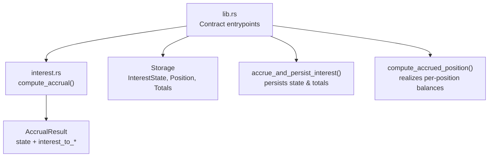
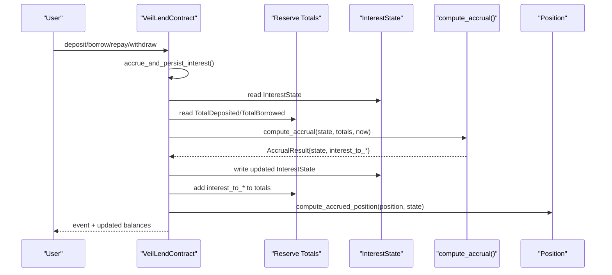
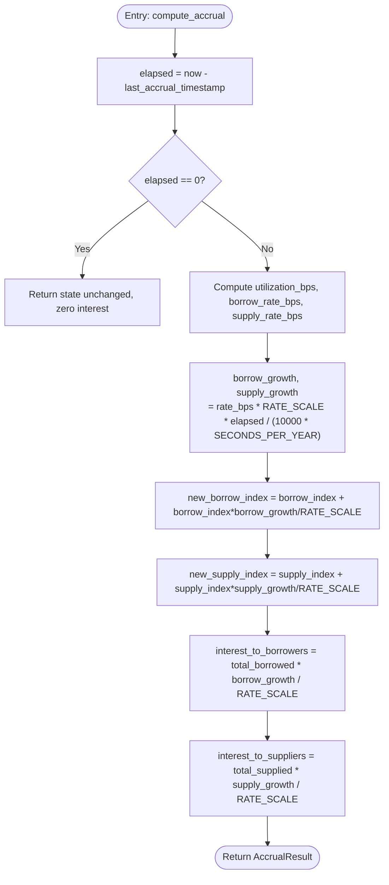
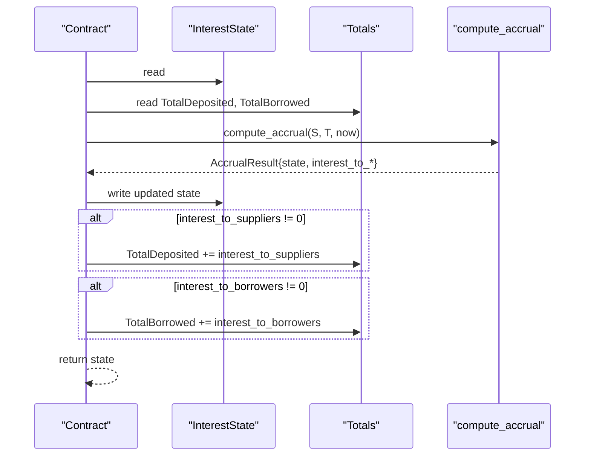
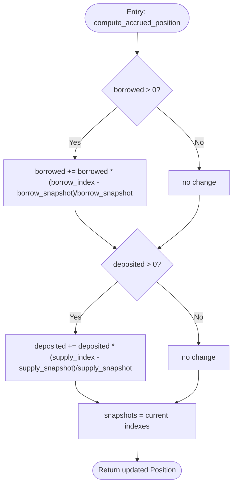
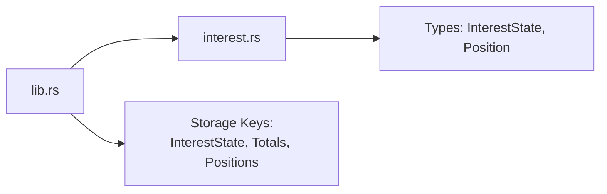

# Interest System

<cite>
**Referenced Files in This Document**
- [interest.rs](file://veilend-soroban/src/interest.rs)
- [lib.rs](file://veilend-soroban/src/lib.rs)
- [test_accrue_interest_grows_indexes_with_no_position_touch.1.json](file://veilend-soroban/test_snapshots/test_accrue_interest_grows_indexes_with_no_position_touch.1.json)
- [test_deposit_then_borrow_then_time_advances_grows_debt_matching_formula.1.json](file://veilend-soroban/test_snapshots/test_deposit_then_borrow_then_time_advances_grows_debt_matching_formula.1.json)
- [test_conservation_of_value_between_suppliers_and_borrower.1.json](file://veilend-soroban/test_snapshots/test_conservation_of_value_between_suppliers_and_borrower.1.json)
</cite>

## Table of Contents
1. [Introduction](#introduction)
2. [Project Structure](#project-structure)
3. [Core Components](#core-components)
4. [Architecture Overview](#architecture-overview)
5. [Detailed Component Analysis](#detailed-component-analysis)
6. [Dependency Analysis](#dependency-analysis)
7. [Performance Considerations](#performance-considerations)
8. [Troubleshooting Guide](#troubleshooting-guide)
9. [Conclusion](#conclusion)
10. [Appendices](#appendices)

## Introduction
This document explains the time-based interest accrual system that grows supplier rewards and borrower debt over time. It focuses on:
- The reserve-level accrual entrypoint that forces index updates and persists totals.
- The internal mechanism that computes growth from elapsed time, total supplied, and total borrowed amounts.
- The InterestState structure that tracks supply_index, borrow_index, and last_accrual_timestamp.
- The per-position realization function that applies accrued interest using snapshot indices.
- Fixed-point arithmetic via RATE_SCALE for precise financial calculations.
- Mathematical formulas, accrual timing, index progression, and position realization mechanics with examples derived from tests and snapshots.

## Project Structure
The interest logic is implemented as a Soroban smart contract module split into two primary files:
- Core math and per-position realization in interest.rs
- Contract storage, entrypoints, and orchestration in lib.rs
Test snapshots demonstrate end-to-end behavior across deposit/borrow flows and interest accrual.

**Diagram sources**
- [lib.rs:483-677](file://veilend-soroban/src/lib.rs#L483-L677)
- [lib.rs:782-827](file://veilend-soroban/src/lib.rs#L782-L827)
- [interest.rs:51-120](file://veilend-soroban/src/interest.rs#L51-L120)

**Section sources**
- [lib.rs:1-120](file://veilend-soroban/src/lib.rs#L1-L120)
- [interest.rs:1-120](file://veilend-soroban/src/interest.rs#L1-L120)

## Core Components
- InterestState: Stores supply_index, borrow_index, and last_accrual_timestamp per asset. These indexes grow monotonically with time and utilization.
- AccrualResult: Returned by compute_accrual; includes updated InterestState and computed interest to add to aggregate totals (interest_to_suppliers, interest_to_borrowers).
- compute_accrual: Advances indexes based on elapsed time, current utilization, and fixed-rate model; returns growth to apply to reserves.
- compute_accrued_position: Realizes accrued interest into a user’s Position by applying index deltas relative to stored snapshots.
- accrue_and_persist_interest: Contract helper that reads state/totals, calls compute_accrual, then persists updated InterestState and totals.
- accrue_interest: Public entrypoint to force reserve-level accrual without touching positions.

Key constants:
- RATE_SCALE: Fixed-point scale for precise i128 arithmetic.
- SECONDS_PER_YEAR: Normalization factor for APR rates.
- BASE_RATE_BPS, SLOPE_BPS: Linear rate curve parameters.

**Section sources**
- [interest.rs:3-120](file://veilend-soroban/src/interest.rs#L3-L120)
- [lib.rs:70-79](file://veilend-soroban/src/lib.rs#L70-L79)
- [lib.rs:662-677](file://veilend-soroban/src/lib.rs#L662-L677)
- [lib.rs:782-827](file://veilend-soroban/src/lib.rs#L782-L827)

## Architecture Overview
The system separates “reserve-level” accrual (global indexes and totals) from “position-level” realization (per-user balances). Every mutating operation first accrues interest so caps and totals reflect up-to-date values. Read-only queries simulate accrual without writing.

**Diagram sources**
- [lib.rs:483-677](file://veilend-soroban/src/lib.rs#L483-L677)
- [lib.rs:782-827](file://veilend-soroban/src/lib.rs#L782-L827)
- [interest.rs:51-120](file://veilend-soroban/src/interest.rs#L51-L120)

## Detailed Component Analysis

### InterestState and Fixed-Point Arithmetic
- InterestState fields:
  - supply_index: Tracks cumulative growth for suppliers.
  - borrow_index: Tracks cumulative growth for borrowers.
  - last_accrual_timestamp: Last time indexes were advanced.
- Fixed-point scale:
  - RATE_SCALE represents 1.0x in i128. All growth factors are expressed relative to this scale to avoid floating point.
- Rate model:
  - Utilization bps = total_borrowed / total_supplied (capped at 100%).
  - Borrow rate bps = BASE_RATE_BPS + slope * utilization_bps.
  - Supply rate bps = borrow_rate_bps * utilization_bps / 10000.
  - Growth per period = rate_bps * RATE_SCALE * elapsed / (10000 * SECONDS_PER_YEAR).

These ensure precise, deterministic accrual suitable for on-chain execution.

**Section sources**
- [interest.rs:3-15](file://veilend-soroban/src/interest.rs#L3-L15)
- [interest.rs:24-38](file://veilend-soroban/src/interest.rs#L24-L38)
- [interest.rs:51-87](file://veilend-soroban/src/interest.rs#L51-L87)
- [lib.rs:70-79](file://veilend-soroban/src/lib.rs#L70-L79)

### compute_accrual: Reserve-Level Index Advancement
- Inputs: current InterestState, total_supplied, total_borrowed, current timestamp.
- Behavior:
  - If elapsed <= 0, return unchanged state and zero interest (idempotent).
  - Compute utilization and rates (bps).
  - Compute borrow_growth and supply_growth using fixed-point math.
  - Update indexes: new_index = old_index + old_index * growth / RATE_SCALE.
  - Compute interest_to_borrowers and interest_to_suppliers as growth applied to totals.
- Output: AccrualResult with updated state and interest deltas.

**Diagram sources**
- [interest.rs:51-87](file://veilend-soroban/src/interest.rs#L51-L87)

**Section sources**
- [interest.rs:51-87](file://veilend-soroban/src/interest.rs#L51-L87)

### accrue_and_persist_interest: Persisting Indexes and Totals
- Reads current InterestState and totals.
- Calls compute_accrual to get updated state and interest deltas.
- Persists:
  - Updated InterestState.
  - TotalDeposited += interest_to_suppliers (if non-zero).
  - TotalBorrowed += interest_to_borrowers (if non-zero).
- Returns updated InterestState for callers to realize positions.

**Diagram sources**
- [lib.rs:782-827](file://veilend-soroban/src/lib.rs#L782-L827)
- [interest.rs:51-87](file://veilend-soroban/src/interest.rs#L51-L87)

**Section sources**
- [lib.rs:782-827](file://veilend-soroban/src/lib.rs#L782-L827)

### accrue_interest: Public Entry Point
- Anyone can call to force reserve-level accrual without touching positions.
- Ensures supported asset, then delegates to accrue_and_persist_interest and emits an update event.

Use cases:
- Proactively advance indexes between user interactions.
- Keep off-chain views consistent without forcing user transactions.

**Section sources**
- [lib.rs:662-677](file://veilend-soroban/src/lib.rs#L662-L677)

### compute_accrued_position: Per-Position Realization
- Applies accrued interest to a user’s Position using stored snapshots:
  - If borrowed > 0: increase by ratio of borrow_index delta vs snapshot.
  - If deposited > 0: increase by ratio of supply_index delta vs snapshot.
- Re-anchors snapshots to current indexes so next accrual measures delta from now.

**Diagram sources**
- [interest.rs:89-120](file://veilend-soroban/src/interest.rs#L89-L120)

**Section sources**
- [interest.rs:89-120](file://veilend-soroban/src/interest.rs#L89-L120)

### Integration Points in Mutating Entrypoints
Every mutating entrypoint follows the same pattern:
- Validate inputs and permissions.
- Call accrue_and_persist_interest to update global state.
- Realize the caller’s position with compute_accrued_position.
- Apply balance changes and enforce caps/collateral rules.
- Emit events and persist updates.

Examples:
- deposit: accrue, check deposit cap, realize position, update reserve and totals.
- borrow: accrue, check borrow cap, realize position, update reserve and totals.
- repay/withdraw: accrue, realize position, adjust balances and totals.

**Section sources**
- [lib.rs:483-639](file://veilend-soroban/src/lib.rs#L483-L639)

## Dependency Analysis
- lib.rs depends on interest.rs for core accrual math and position realization.
- interest.rs depends only on shared types defined in lib.rs (InterestState, Position).
- Storage keys include InterestState(Address), TotalDeposited(Address), TotalBorrowed(Address), and Position(Address, Address).

**Diagram sources**
- [lib.rs:1-120](file://veilend-soroban/src/lib.rs#L1-L120)
- [interest.rs:1-10](file://veilend-soroban/src/interest.rs#L1-L10)

**Section sources**
- [lib.rs:1-120](file://veilend-soroban/src/lib.rs#L1-L120)
- [interest.rs:1-10](file://veilend-soroban/src/interest.rs#L1-L10)

## Performance Considerations
- Idempotency: If elapsed <= 0, accrual is a no-op, avoiding redundant writes.
- O(1) math per accrual: Only constant-time operations per call.
- Batch-friendly: Multiple operations within the same ledger timestamp share the same accrual result.
- Fixed-point precision: Using i128 and RATE_SCALE avoids floating-point issues and ensures deterministic results.

[No sources needed since this section provides general guidance]

## Troubleshooting Guide
Common issues and diagnostics:
- Unexpected position growth: Ensure compute_accrued_position is called before reading balances after any mutation or time passage.
- Stale view of indexes: Use get_interest_state to simulate accrual without writing, or call accrue_interest to persist.
- Caps enforcement anomalies: Always verify that accrue_and_persist_interest runs before cap checks in custom flows.
- Zero-growth scenarios: With zero total_supplied, supply growth is zero; ensure deposits exist to accrue supplier rewards.

Relevant code paths:
- accrue_and_persist_interest persistence logic.
- compute_accrued_position snapshot anchoring.
- get_interest_state simulation path.

**Section sources**
- [lib.rs:641-677](file://veilend-soroban/src/lib.rs#L641-L677)
- [lib.rs:782-827](file://veilend-soroban/src/lib.rs#L782-L827)
- [interest.rs:89-120](file://veilend-soroban/src/interest.rs#L89-L120)

## Conclusion
The interest system uses a clean separation between reserve-level accrual and position-level realization. Time advances indexes based on utilization-driven rates, and per-user positions accrue proportionally via snapshot deltas. Fixed-point arithmetic ensures precision, while idempotent accrual and explicit persistence keep the system robust and predictable.

[No sources needed since this section summarizes without analyzing specific files]

## Appendices

### Mathematical Formulas
- Utilization bps: utilization_bps = total_borrowed * 10000 / total_supplied (0 if total_supplied == 0).
- Borrow rate bps: borrow_rate_bps = BASE_RATE_BPS + (utilization_bps * SLOPE_BPS) / 10000.
- Supply rate bps: supply_rate_bps = borrow_rate_bps * utilization_bps / 10000.
- Growth per period: growth = rate_bps * RATE_SCALE * elapsed / (10000 * SECONDS_PER_YEAR).
- Index update: new_index = old_index + old_index * growth / RATE_SCALE.
- Interest to totals: interest_to_* = total_* * growth / RATE_SCALE.
- Position realization:
  - borrowed' = borrowed + borrowed * (borrow_index - borrow_snapshot) / borrow_snapshot (if borrowed > 0).
  - deposited' = deposited + deposited * (supply_index - supply_snapshot) / supply_snapshot (if deposited > 0).

**Section sources**
- [interest.rs:24-87](file://veilend-soroban/src/interest.rs#L24-L87)
- [interest.rs:89-120](file://veilend-soroban/src/interest.rs#L89-L120)

### Examples from Tests and Snapshots
- One-year accrual with 50% utilization:
  - borrow_rate_bps = 1200, supply_rate_bps = 600.
  - After one year, indexes grow by corresponding growth factors; totals increase by interest_to_* amounts.
  - See test assertions for expected index growth and interest deltas.

- Conservation of value:
  - When total_supplied equals total_borrowed, interest_to_suppliers equals interest_to_borrowers.
  - Otherwise, supplier interest never exceeds borrower interest due to utilization scaling.

- Snapshot anchoring:
  - Positions re-anchor snapshots on each touch; zero-balance positions do not grow but still update snapshots.

Evidence locations:
- Known input/output growth over one year and conservation tests.
- Snapshot behavior for zero and non-zero balances.

**Section sources**
- [interest.rs:156-213](file://veilend-soroban/src/interest.rs#L156-L213)
- [interest.rs:215-256](file://veilend-soroban/src/interest.rs#L215-L256)
- [test_accrue_interest_grows_indexes_with_no_position_touch.1.json:460-532](file://veilend-soroban/test_snapshots/test_accrue_interest_grows_indexes_with_no_position_touch.1.json#L460-L532)
- [test_deposit_then_borrow_then_time_advances_grows_debt_matching_formula.1.json:459-527](file://veilend-soroban/test_snapshots/test_deposit_then_borrow_then_time_advances_grows_debt_matching_formula.1.json#L459-L527)
- [test_conservation_of_value_between_suppliers_and_borrower.1.json:521-589](file://veilend-soroban/test_snapshots/test_conservation_of_value_between_suppliers_and_borrower.1.json#L521-L589)