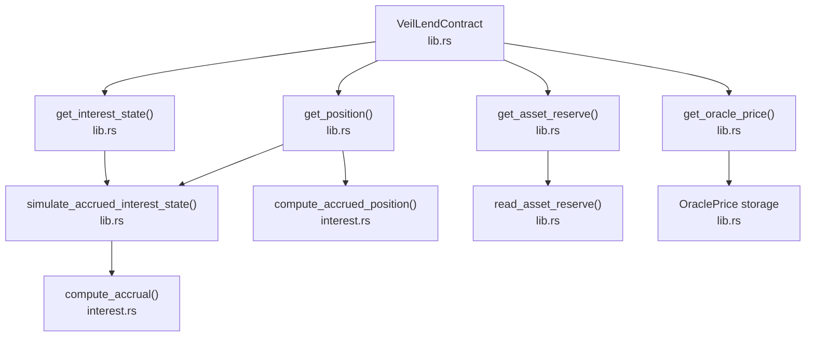
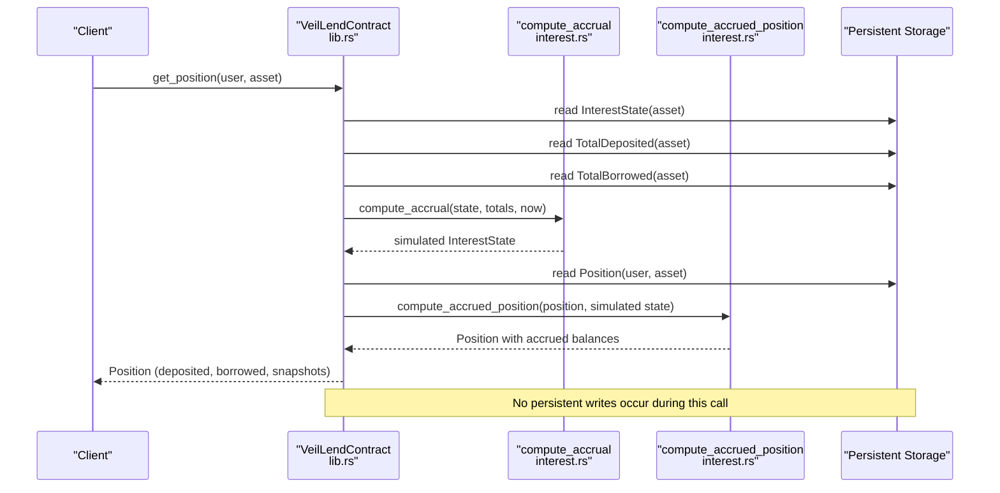
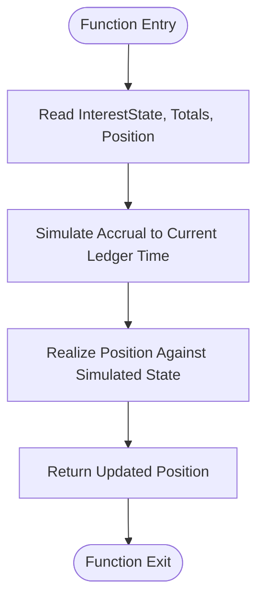
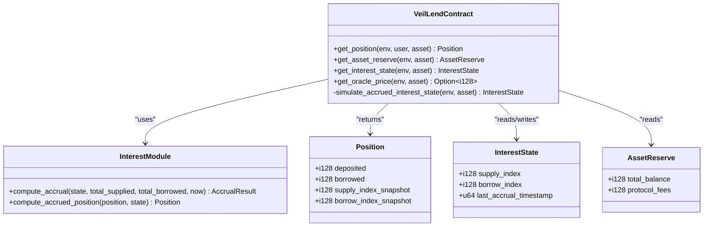
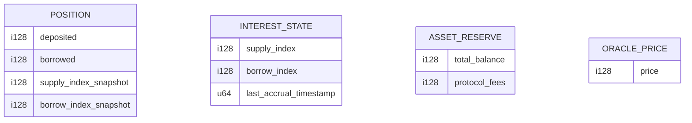

# Position Queries

<cite>
**Referenced Files in This Document**
- [lib.rs](file://veilend-soroban/src/lib.rs)
- [interest.rs](file://veilend-soroban/src/interest.rs)
</cite>

## Table of Contents
1. [Introduction](#introduction)
2. [Project Structure](#project-structure)
3. [Core Components](#core-components)
4. [Architecture Overview](#architecture-overview)
5. [Detailed Component Analysis](#detailed-component-analysis)
6. [Dependency Analysis](#dependency-analysis)
7. [Performance Considerations](#performance-considerations)
8. [Troubleshooting Guide](#troubleshooting-guide)
9. [Conclusion](#conclusion)
10. [Appendices](#appendices)

## Introduction
This document explains the read-only position query functions that provide accurate, time-aware views of user positions and protocol state without persisting changes. It covers:
- get_position: returns a user’s current position with simulated accrued interest
- get_asset_reserve: retrieves total reserves and protocol fees for an asset
- get_interest_state: provides time-based interest accrual state with simulated indexes
- get_oracle_price: retrieves current asset valuations from on-chain storage

For each function, we detail parameters, return structures, simulation vs persistence behavior, performance characteristics, and practical usage examples for portfolio tracking, risk assessment, and protocol monitoring.

## Project Structure
The queries are implemented in the VeilLend Soroban contract. The core logic resides in two files:
- lib.rs: Contract entry points, data types (Position, InterestState, AssetReserve), and read-only view functions
- interest.rs: Time-based accrual math and position realization helpers

**Diagram sources**
- [lib.rs:641-660](file://veilend-soroban/src/lib.rs#L641-L660)
- [lib.rs:820-827](file://veilend-soroban/src/lib.rs#L820-L827)
- [interest.rs:51-87](file://veilend-soroban/src/interest.rs#L51-L87)
- [interest.rs:97-120](file://veilend-soroban/src/interest.rs#L97-L120)

**Section sources**
- [lib.rs:59-93](file://veilend-soroban/src/lib.rs#L59-L93)
- [interest.rs:1-22](file://veilend-soroban/src/interest.rs#L1-L22)

## Core Components
- Position: stores per-user balances and index snapshots used to realize accrued interest
- InterestState: tracks supply/borrow indexes and last accrual timestamp per asset
- AssetReserve: tracks total_balance and protocol_fees per asset
- Oracle price: optional per-asset valuation stored on-chain

Key behaviors:
- All query functions are read-only; they do not write persistent state
- Interest accrual is simulated up to the current ledger timestamp for accurate reads
- Positions are realized against the simulated state to reflect accrued amounts at query time

**Section sources**
- [lib.rs:59-93](file://veilend-soroban/src/lib.rs#L59-L93)
- [lib.rs:641-660](file://veilend-soroban/src/lib.rs#L641-L660)
- [lib.rs:820-827](file://veilend-soroban/src/lib.rs#L820-L827)
- [interest.rs:51-87](file://veilend-soroban/src/interest.rs#L51-L87)
- [interest.rs:97-120](file://veilend-soroban/src/interest.rs#L97-L120)

## Architecture Overview
The query flow ensures clients see live, accurate values between transactions by simulating accruals without writing to storage.

**Diagram sources**
- [lib.rs:641-648](file://veilend-soroban/src/lib.rs#L641-L648)
- [lib.rs:820-827](file://veilend-soroban/src/lib.rs#L820-L827)
- [interest.rs:51-87](file://veilend-soroban/src/interest.rs#L51-L87)
- [interest.rs:97-120](file://veilend-soroban/src/interest.rs#L97-L120)

## Detailed Component Analysis

### get_position
Purpose:
- Returns a user’s current position with accrued interest simulated up to the current ledger time
- Does not persist any changes; purely a view function

Parameters:
- env: Environment context
- user: Address of the user whose position is queried
- asset: Address of the asset

Return structure:
- Position:
  - deposited: i128 — accrued deposit balance
  - borrowed: i128 — accrued borrow balance
  - supply_index_snapshot: i128 — updated to current supply index
  - borrow_index_snapshot: i128 — updated to current borrow index

Simulation vs persistence:
- Uses simulate_accrued_interest_state to compute a fresh InterestState based on current totals and ledger timestamp
- Realizes position via compute_accrued_position using the simulated state
- No storage writes occur

Algorithm overview:
- Read persisted InterestState, TotalDeposited, TotalBorrowed
- Compute accrual growth using piecewise-linear rate model
- Realize position balances against index deltas
- Return updated Position with refreshed snapshots

Performance considerations:
- O(1) storage reads per asset plus constant-time arithmetic
- Avoids expensive state mutations; suitable for frequent UI polling

Usage examples:
- Portfolio tracking: periodically fetch get_position to display real-time accrued balances
- Risk assessment: combine with oracle price to compute collateralization ratios
- Monitoring: detect stale positions or unexpected accrual behavior across assets

**Section sources**
- [lib.rs:641-648](file://veilend-soroban/src/lib.rs#L641-L648)
- [lib.rs:820-827](file://veilend-soroban/src/lib.rs#L820-L827)
- [interest.rs:97-120](file://veilend-soroban/src/interest.rs#L97-L120)

#### Flowchart: get_position realization

**Diagram sources**
- [lib.rs:641-648](file://veilend-soroban/src/lib.rs#L641-L648)
- [lib.rs:820-827](file://veilend-soroban/src/lib.rs#L820-L827)
- [interest.rs:97-120](file://veilend-soroban/src/interest.rs#L97-L120)

### get_asset_reserve
Purpose:
- Retrieves the reserve snapshot for an asset including total_balance and protocol_fees

Parameters:
- env: Environment context
- asset: Address of the asset

Return structure:
- AssetReserve:
  - total_balance: i128 — net reserve balance after operations
  - protocol_fees: i128 — accumulated protocol fees for the asset

Behavior:
- Validates that the asset is supported
- Reads persisted AssetReserve and returns it
- No accrual simulation occurs here; reserve reflects last persisted state

Performance considerations:
- Single storage read; very low cost
- Suitable for dashboards and monitoring

Usage examples:
- Protocol monitoring: track total liquidity and fee accumulation
- Risk assessment: assess available liquidity relative to outstanding borrows
- Reporting: audit fee accrual trends over time

**Section sources**
- [lib.rs:650-653](file://veilend-soroban/src/lib.rs#L650-L653)
- [lib.rs:721-736](file://veilend-soroban/src/lib.rs#L721-L736)

### get_interest_state
Purpose:
- Returns the time-based interest accrual state for an asset with indexes simulated up to the current ledger time

Parameters:
- env: Environment context
- asset: Address of the asset

Return structure:
- InterestState:
  - supply_index: i128 — simulated supply index
  - borrow_index: i128 — simulated borrow index
  - last_accrual_timestamp: u64 — last persisted accrual timestamp

Behavior:
- Reads persisted InterestState and totals
- Computes simulated accrual to current time without writing
- Returns the simulated state

Performance considerations:
- Constant-time computation plus storage reads
- Useful for calculating expected accruals and validating UI displays

Usage examples:
- Risk assessment: derive utilization and rates to estimate future accruals
- Portfolio tracking: show users how much interest will accrue before next interaction
- Monitoring: ensure accrual clock advances correctly across blocks

**Section sources**
- [lib.rs:655-660](file://veilend-soroban/src/lib.rs#L655-L660)
- [lib.rs:820-827](file://veilend-soroban/src/lib.rs#L820-L827)
- [interest.rs:51-87](file://veilend-soroban/src/interest.rs#L51-L87)

### get_oracle_price
Purpose:
- Retrieves the current oracle price for an asset if configured

Parameters:
- env: Environment context
- asset: Address of the asset

Return structure:
- Option<i128>: Some(price) if set, None otherwise

Behavior:
- Reads persisted OraclePrice for the asset
- No simulation or mutation

Performance considerations:
- Single storage read; minimal cost
- Essential for collateral calculations and risk metrics

Usage examples:
- Portfolio valuation: multiply position quantities by oracle prices
- Risk assessment: compute loan-to-value ratios using oracle prices
- Monitoring: alert when oracle prices are missing or stale

**Section sources**
- [lib.rs:333-344](file://veilend-soroban/src/lib.rs#L333-L344)

## Dependency Analysis
The query functions depend on shared data structures and accrual logic:

**Diagram sources**
- [lib.rs:59-93](file://veilend-soroban/src/lib.rs#L59-L93)
- [lib.rs:641-660](file://veilend-soroban/src/lib.rs#L641-L660)
- [lib.rs:820-827](file://veilend-soroban/src/lib.rs#L820-L827)
- [interest.rs:51-87](file://veilend-soroban/src/interest.rs#L51-L87)
- [interest.rs:97-120](file://veilend-soroban/src/interest.rs#L97-L120)

**Section sources**
- [lib.rs:59-93](file://veilend-soroban/src/lib.rs#L59-L93)
- [interest.rs:1-22](file://veilend-soroban/src/interest.rs#L1-L22)

## Performance Considerations
- All query functions are read-only and avoid persistent writes, minimizing gas costs and ensuring idempotency
- get_position and get_interest_state simulate accruals using O(1) arithmetic and a few storage reads
- get_asset_reserve and get_oracle_price perform single storage reads
- For high-frequency UI updates, prefer batching requests and caching results where appropriate
- When computing risk metrics, combine get_position with get_oracle_price and get_interest_state to derive utilization and projected accruals

[No sources needed since this section provides general guidance]

## Troubleshooting Guide
Common issues and diagnostics:
- Missing oracle price: get_oracle_price returns None; ensure admin has set a valid price
- Stale positions: if positions appear unchanged, verify that time has advanced and consider calling get_interest_state to confirm accrual clock movement
- Unexpected accruals: check InterestState.last_accrual_timestamp and compare with current ledger timestamp; large gaps indicate missed accruals
- Unsupported asset: get_asset_reserve requires a supported asset; configure assets via admin functions before querying

Operational tips:
- Use get_interest_state to validate that accrual indexes advance monotonically
- Monitor AssetReserve.protocol_fees to ensure fee accrual paths are functioning
- Validate Position.snapshots update on each query to confirm correct re-anchoring

**Section sources**
- [lib.rs:333-344](file://veilend-soroban/src/lib.rs#L333-L344)
- [lib.rs:655-660](file://veilend-soroban/src/lib.rs#L655-L660)
- [lib.rs:721-736](file://veilend-soroban/src/lib.rs#L721-L736)

## Conclusion
The VeilLend contract provides robust, read-only query functions that deliver accurate, time-aware views of user positions and protocol state without mutating storage. By simulating accruals on demand, clients can reliably track portfolios, assess risk, and monitor protocol health. These functions are efficient, deterministic, and designed for frequent use in frontends and analytics tools.

[No sources needed since this section summarizes without analyzing specific files]

## Appendices

### Data Models Reference

**Diagram sources**
- [lib.rs:59-93](file://veilend-soroban/src/lib.rs#L59-L93)

### Example Usage Scenarios
- Portfolio tracking:
  - Call get_position to obtain accrued balances
  - Multiply by get_oracle_price to compute USD value
  - Display changes over time to show earnings and debt growth
- Risk assessment:
  - Use get_interest_state to derive utilization and projected rates
  - Combine with get_oracle_price to compute collateralization ratios
  - Alert when ratios approach minimum thresholds
- Protocol monitoring:
  - Track get_asset_reserve.total_balance and .protocol_fees for liquidity and revenue
  - Verify get_interest_state.last_accrual_timestamp advances consistently
  - Ensure get_oracle_price is set for all active assets

[No sources needed since this section provides general guidance]