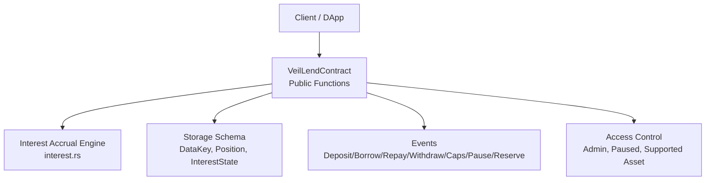
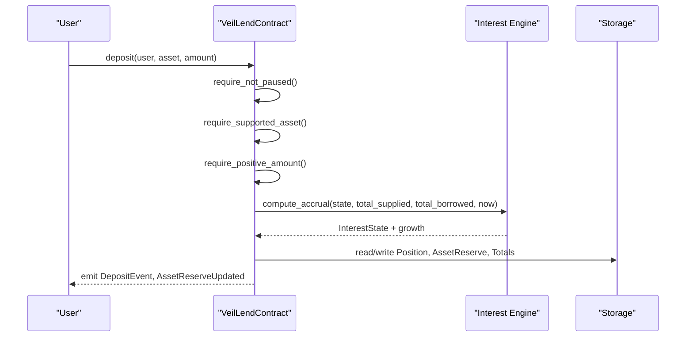
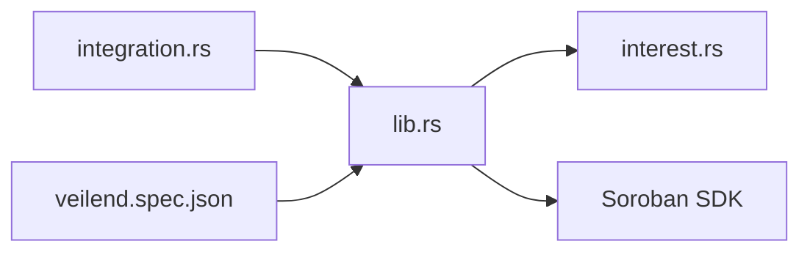
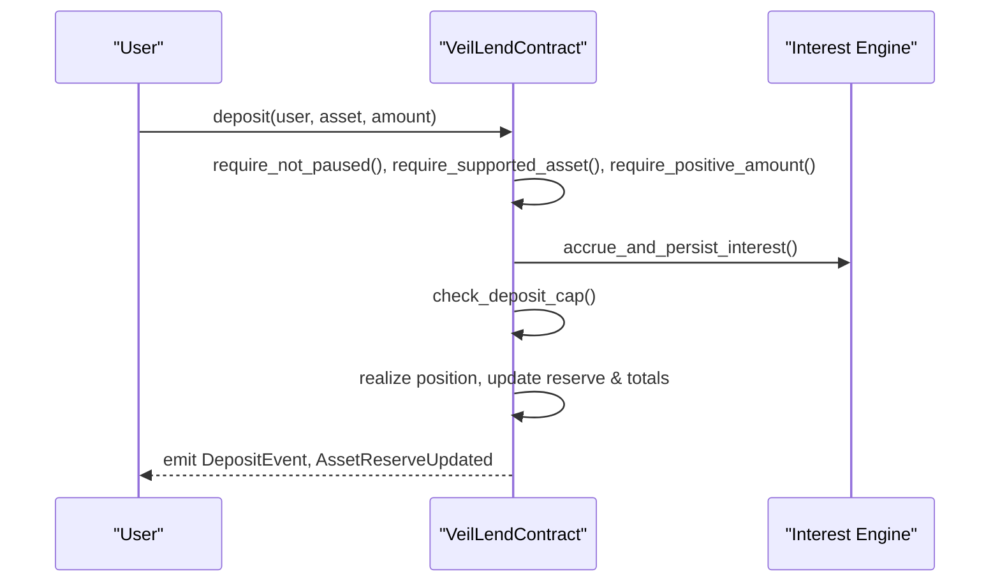
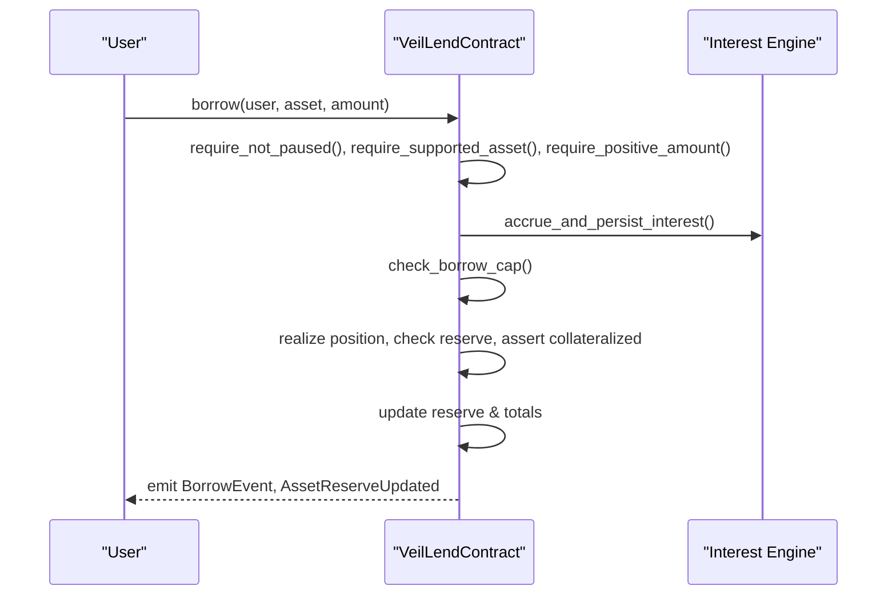
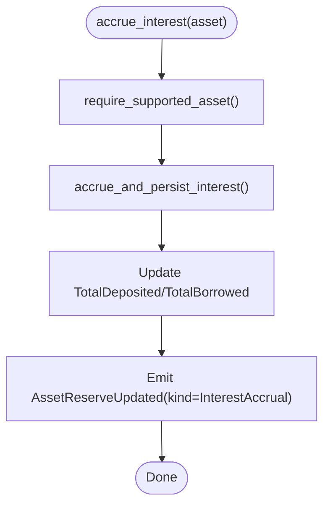

# Smart Contract API

<cite>
**Referenced Files in This Document**
- [lib.rs](file://veilend-soroban/src/lib.rs)
- [interest.rs](file://veilend-soroban/src/interest.rs)
- [integration.rs](file://veilend-soroban/tests/integration.rs)
- [veilend.spec.json](file://veilend-backend/src/common/contracts/veilend.spec.json)
</cite>

## Table of Contents
1. [Introduction](#introduction)
2. [Project Structure](#project-structure)
3. [Core Components](#core-components)
4. [Architecture Overview](#architecture-overview)
5. [Detailed Component Analysis](#detailed-component-analysis)
6. [Dependency Analysis](#dependency-analysis)
7. [Performance Considerations](#performance-considerations)
8. [Troubleshooting Guide](#troubleshooting-guide)
9. [Conclusion](#conclusion)
10. [Appendices](#appendices)

## Introduction
This document provides comprehensive API documentation for the VeilLend protocol’s Soroban smart contracts. It covers all public functions for deposits, borrows, repayments, withdrawals, asset configuration, oracle pricing, caps management, position queries, and interest accrual. It also documents initialization, versioning, migration considerations, security implications, access control, event emissions, parameter validation, error conditions, and gas optimization tips.

## Project Structure
The VeilLend Soroban contract is implemented as a single Rust crate with two primary modules:
- lib.rs: Defines the contract interface, storage schema, events, errors, and core logic (admin controls, user operations, queries).
- interest.rs: Implements time-based interest accrual math, index updates, and per-position realization.

Tests in integration.rs validate end-to-end flows including caps, pause/unpause, interest accrual, and collateral checks. The backend spec JSON enumerates key events consumed by off-chain services.

**Diagram sources**
- [lib.rs:226-719](file://veilend-soroban/src/lib.rs#L226-L719)
- [interest.rs:51-120](file://veilend-soroban/src/interest.rs#L51-L120)

**Section sources**
- [lib.rs:1-118](file://veilend-soroban/src/lib.rs#L1-L118)
- [interest.rs:1-22](file://veilend-soroban/src/interest.rs#L1-L22)
- [integration.rs:1-40](file://veilend-soroban/tests/integration.rs#L1-L40)
- [veilend.spec.json:1-27](file://veilend-backend/src/common/contracts/veilend.spec.json#L1-L27)

## Core Components
- Contract metadata and versioning:
  - CONTRACT_VERSION, STORAGE_SCHEMA_VERSION, STORAGE_SCHEMA_ID identify the current interface and storage layout.
  - contract_metadata exposes these values to clients before migrations.
- Storage keys and types:
  - DataKey enum defines instance and persistent storage keys (Admin, MinCollateralRatioBps, SupportedAsset, AssetReserve, Position, OraclePrice, DepositCap, BorrowCap, TotalDeposited, TotalBorrowed, Paused, InterestState).
  - Position tracks deposited/borrowed balances and snapshots of supply/borrow indexes at last interaction.
  - InterestState tracks supply_index, borrow_index, and last_accrual_timestamp per asset.
  - AssetCaps and AssetReserve represent per-asset caps and reserve totals.
- Events:
  - AssetConfigured, DepositEvent, BorrowEvent, RepayEvent, WithdrawEvent, CapsUpdated, CircuitBreakerEvent, AssetReserveUpdated.
- Errors:
  - VeilLendError enumerates all failure modes (e.g., Unauthorized, UnsupportedAsset, InsufficientCollateral, ContractPaused, DepositCapExceeded, BorrowCapExceeded, InvalidCap, InsufficientReserve, etc.).

**Section sources**
- [lib.rs:10-145](file://veilend-soroban/src/lib.rs#L10-L145)
- [lib.rs:147-225](file://veilend-soroban/src/lib.rs#L147-L225)
- [lib.rs:38-93](file://veilend-soroban/src/lib.rs#L38-L93)

## Architecture Overview
The contract implements a reserve-based lending model with time-based interest accrual. Each operation first accrues interest to ensure up-to-date totals and indexes, then enforces caps and collateral constraints, updates positions and reserves, and emits events. Admin-only functions manage assets, prices, caps, and circuit breaker state.

**Diagram sources**
- [lib.rs:483-519](file://veilend-soroban/src/lib.rs#L483-L519)
- [interest.rs:51-87](file://veilend-soroban/src/interest.rs#L51-L87)

**Section sources**
- [lib.rs:483-677](file://veilend-soroban/src/lib.rs#L483-L677)
- [interest.rs:51-120](file://veilend-soroban/src/interest.rs#L51-L120)

## Detailed Component Analysis

### Initialization and Versioning
- __constructor(admin, min_collateral_ratio_bps): Initializes admin, minimum collateral ratio (must be >= 100% i.e., 10_000 bps), and sets paused=false. Enforces single initialization.
- contract_metadata(): Returns contract_version, storage_schema_version, and storage_schema_id for client compatibility checks.

Usage pattern:
- Deploy once with an admin and a safe minimum collateral ratio (e.g., 150% = 15_000 bps).
- Clients should call contract_metadata to verify storage layout before reading or migrating.

Security and access:
- Requires admin authentication; panics if already initialized or invalid collateral ratio.

Gas tips:
- Minimal storage writes during init; avoid repeated re-initialization attempts.

**Section sources**
- [lib.rs:242-258](file://veilend-soroban/src/lib.rs#L242-L258)
- [lib.rs:231-240](file://veilend-soroban/src/lib.rs#L231-L240)

### Asset Management
- configure_asset(admin, asset, supported): Enables/disables an asset. When enabling, initializes caps to unlimited (-1), totals to 0, and emits AssetConfigured and AssetReserveUpdated.
- set_oracle_price(admin, asset, price): Sets oracle price for collateral valuation; requires positive price and admin auth.
- update_asset_caps(admin, asset, deposit_cap, borrow_cap): Updates per-asset caps; validates caps must be -1 (unlimited) or positive; ensures asset is supported; emits CapsUpdated.
- get_asset_caps(asset): Reads current caps (defaults to -1 if not set).
- get_total_deposited(asset), get_total_borrowed(asset): Read aggregate totals.

Validation rules:
- Admin-only for configuration and price/cap updates.
- Supported asset required for cap updates.
- Caps must be -1 or > 0; zero or negative non-unlimited values are rejected.

Events:
- AssetConfigured, CapsUpdated, AssetReserveUpdated (on configure when enabled).

Security:
- Strict admin checks; unauthorized calls panic with Unauthorized.

Gas tips:
- Batch cap updates per asset where possible; avoid redundant configure_asset calls.

**Section sources**
- [lib.rs:260-306](file://veilend-soroban/src/lib.rs#L260-L306)
- [lib.rs:317-344](file://veilend-soroban/src/lib.rs#L317-L344)
- [lib.rs:356-420](file://veilend-soroban/src/lib.rs#L356-L420)
- [lib.rs:422-448](file://veilend-soroban/src/lib.rs#L422-L448)

### User Operations: Deposit, Borrow, Repay, Withdraw
- deposit(user, asset, amount):
  - Prechecks: not paused, supported asset, positive amount, user auth.
  - Accrues interest, checks deposit cap, realizes position, updates position.deposited and reserve.total_balance, updates TotalDeposited, emits DepositEvent and AssetReserveUpdated.
- borrow(user, asset, amount):
  - Prechecks: not paused, supported asset, positive amount, user auth.
  - Accrues interest, checks borrow cap, realizes position, verifies reserve has sufficient balance, increases position.borrowed and decreases reserve.total_balance, asserts collateralized, updates TotalBorrowed, emits BorrowEvent and AssetReserveUpdated.
- repay(user, asset, amount):
  - Allowed even when paused; prechecks supported asset, positive amount, user auth.
  - Accrues interest, realizes position, validates amount <= outstanding borrowed, decreases position.borrowed and increases reserve.total_balance, updates TotalBorrowed, emits RepayEvent and AssetReserveUpdated.
- withdraw(user, asset, amount):
  - Allowed even when paused; prechecks supported asset, positive amount, user auth.
  - Accrues interest, realizes position, validates amount <= deposited and <= reserve.total_balance, decreases position.deposited and reserve.total_balance, asserts collateralized, updates TotalDeposited, emits WithdrawEvent and AssetReserveUpdated.

Parameter validation:
- All amounts must be positive; zero triggers ZeroAmount; negative triggers InvalidAmount.
- Caps enforced via DepositCap/BorrowCap; defaults to unlimited (-1).

Collateral checks:
- For borrow and withdraw that reduce borrowing power, assert_collateralized uses oracle price and min collateral ratio (bps). If no oracle price set, fails with OraclePriceMissing.

Events:
- DepositEvent, BorrowEvent, RepayEvent, WithdrawEvent, AssetReserveUpdated.

Security:
- Pause gating blocks new deposits/borrows but allows repay/withdraw to let users exit safely.
- Collateralization enforced using oracle price and configured minimum ratio.

Gas tips:
- Accrue interest once per transaction; reuse realized position for multiple checks within same function.
- Avoid unnecessary reads/writes; batch updates to totals after position/reserve changes.

**Section sources**
- [lib.rs:483-519](file://veilend-soroban/src/lib.rs#L483-L519)
- [lib.rs:521-561](file://veilend-soroban/src/lib.rs#L521-L561)
- [lib.rs:563-598](file://veilend-soroban/src/lib.rs#L563-L598)
- [lib.rs:600-639](file://veilend-soroban/src/lib.rs#L600-L639)
- [lib.rs:913-934](file://veilend-soroban/src/lib.rs#L913-L934)

### Position Queries
- get_position(user, asset): Returns a Position with accrued balances simulated to current ledger time without persisting changes. Uses simulate_accrued_interest_state and computes accrued position.
- get_asset_reserve(asset): Returns AssetReserve (total_balance, protocol_fees) for supported assets.
- get_interest_state(asset): Returns InterestState simulated to current time without persisting.

Usage patterns:
- Use get_position to display user’s effective deposit/borrow balances including accrued interest.
- Use get_asset_reserve to monitor pool liquidity and fees.
- Use get_interest_state to inspect indexes and last accrual timestamp.

**Section sources**
- [lib.rs:641-660](file://veilend-soroban/src/lib.rs#L641-L660)
- [lib.rs:650-653](file://veilend-soroban/src/lib.rs#L650-L653)

### Interest Accrual System
- accrue_interest(asset): Forces reserve-level interest accrual and persists updated indexes and totals; callable by anyone; emits AssetReserveUpdated.
- Internal accrue_and_persist_interest: Computes accrual based on elapsed time since last_accrual_timestamp, utilization-driven rates, updates InterestState and aggregates TotalDeposited/TotalBorrowed.
- simulate_accrued_interest_state: Pure computation for view functions to reflect live state without writes.

Math details:
- Rates derived from BASE_RATE_BPS and SLOPE_BPS based on utilization.
- Indexes grow proportionally to elapsed seconds and rates; idempotent when elapsed == 0.
- Per-position realization applies index deltas to deposited/borrowed balances and re-anchors snapshots.

Time-based calculations:
- SECONDS_PER_YEAR used to normalize APR to per-second growth.
- Idempotency ensures duplicate accruals at same timestamp do nothing.

**Section sources**
- [lib.rs:662-677](file://veilend-soroban/src/lib.rs#L662-L677)
- [lib.rs:782-827](file://veilend-soroban/src/lib.rs#L782-L827)
- [interest.rs:51-120](file://veilend-soroban/src/interest.rs#L51-L120)

### Circuit Breaker (Pause)
- set_paused(admin, paused): Admin-only toggle; emits CircuitBreakerEvent.
- is_paused(): Read-only check.

Behavior:
- When paused, deposit and borrow are blocked; repay and withdraw remain allowed so users can reduce debt/remove collateral.

**Section sources**
- [lib.rs:450-479](file://veilend-soroban/src/lib.rs#L450-L479)

### Protocol Fees
- record_protocol_fee(admin, asset, amount): Admin-only; accrues interest, increases reserve.total_balance and protocol_fees, emits AssetReserveUpdated.

**Section sources**
- [lib.rs:686-704](file://veilend-soroban/src/lib.rs#L686-L704)

### Access Control and Validation Helpers
- require_supported_asset: Ensures asset is enabled.
- require_positive_amount: Validates amount > 0; distinguishes ZeroAmount vs InvalidAmount.
- require_not_paused: Blocks deposit/borrow when paused.
- check_deposit_cap/check_borrow_cap: Enforce per-asset caps (-1 means unlimited).
- assert_collateralized: Uses oracle price and min collateral ratio to ensure health.

**Section sources**
- [lib.rs:835-934](file://veilend-soroban/src/lib.rs#L835-L934)

## Dependency Analysis
The contract depends on:
- interest.rs for accrual math and position realization.
- Soroban SDK for storage, events, addresses, and environment access.
- Tests validate behavior across lifecycle scenarios.

**Diagram sources**
- [lib.rs:1-8](file://veilend-soroban/src/lib.rs#L1-L8)
- [interest.rs:1-22](file://veilend-soroban/src/interest.rs#L1-L22)
- [integration.rs:1-18](file://veilend-soroban/tests/integration.rs#L1-L18)
- [veilend.spec.json:1-27](file://veilend-backend/src/common/contracts/veilend.spec.json#L1-L27)

**Section sources**
- [lib.rs:1-8](file://veilend-soroban/src/lib.rs#L1-L8)
- [interest.rs:1-22](file://veilend-soroban/src/interest.rs#L1-L22)
- [integration.rs:1-40](file://veilend-soroban/tests/integration.rs#L1-L40)
- [veilend.spec.json:1-27](file://veilend-backend/src/common/contracts/veilend.spec.json#L1-L27)

## Performance Considerations
- Interest accrual is O(1) per asset per call; amortize across multiple operations by calling accrue_interest proactively when idle.
- Avoid redundant reads/writes; the contract batches updates to totals after position/reserve changes.
- Use get_* view functions for read-heavy dashboards to avoid state mutations.
- Cap checks are early exits; enforce them before heavy computations to save gas.
- Oracle price must be set; missing price causes immediate failure in collateral checks—ensure timely updates.

[No sources needed since this section provides general guidance]

## Troubleshooting Guide
Common errors and resolutions:
- AlreadyInitialized: Contract already deployed; use existing instance.
- Unauthorized: Caller not admin; ensure correct admin signature for admin functions.
- UnsupportedAsset: Asset not configured; call configure_asset first.
- InvalidAmount/ZeroAmount: Amount must be positive; validate inputs off-chain.
- InsufficientCollateral: Borrow/withdraw reduces health below threshold; increase deposits or adjust oracle price/ratio.
- InsufficientDeposit/RepayTooLarge: Amount exceeds position; clamp to actual balances.
- NotInitialized: Contract not yet initialized; deploy and initialize.
- OraclePriceMissing: Set oracle price for asset before borrowing/withdrawing against collateral.
- ContractPaused: New deposits/borrows blocked; wait for admin to unpause or use repay/withdraw.
- DepositCapExceeded/BorrowCapExceeded: Caps reached; request admin to increase caps or wait for reductions.
- InvalidCap: Caps must be -1 or positive; fix parameters.
- InsufficientReserve: Reserve lacks funds for borrow/withdraw; coordinate liquidity.

Event monitoring:
- Track DepositEvent, BorrowEvent, RepayEvent, WithdrawEvent, CapsUpdated, CircuitBreakerEvent, AssetReserveUpdated for off-chain indexing and UI updates.

**Section sources**
- [lib.rs:107-145](file://veilend-soroban/src/lib.rs#L107-L145)
- [lib.rs:147-225](file://veilend-soroban/src/lib.rs#L147-L225)
- [integration.rs:85-146](file://veilend-soroban/tests/integration.rs#L85-L146)

## Conclusion
The VeilLend Soroban contract provides a robust, time-based lending protocol with clear admin controls, strict validation, and comprehensive events. Its design emphasizes safety through collateral checks, caps, and circuit breaker functionality, while offering efficient interest accrual and transparent querying. Proper initialization, oracle price management, and cap configuration are critical for secure and functional operation.

[No sources needed since this section summarizes without analyzing specific files]

## Appendices

### Function Reference Summary
- Initialization:
  - __constructor(admin, min_collateral_ratio_bps)
  - contract_metadata()
- Asset Management:
  - configure_asset(admin, asset, supported)
  - set_oracle_price(admin, asset, price)
  - update_asset_caps(admin, asset, deposit_cap, borrow_cap)
  - get_asset_caps(asset)
  - get_total_deposited(asset), get_total_borrowed(asset)
- User Operations:
  - deposit(user, asset, amount)
  - borrow(user, asset, amount)
  - repay(user, asset, amount)
  - withdraw(user, asset, amount)
- Queries:
  - get_position(user, asset)
  - get_asset_reserve(asset)
  - get_interest_state(asset)
  - is_asset_supported(asset)
  - is_paused()
  - admin(), min_collateral_ratio_bps()
- Accrual and Fees:
  - accrue_interest(asset)
  - record_protocol_fee(admin, asset, amount)
- Circuit Breaker:
  - set_paused(admin, paused)

**Section sources**
- [lib.rs:231-719](file://veilend-soroban/src/lib.rs#L231-L719)

### Example Call Flows

#### Deposit Flow

**Diagram sources**
- [lib.rs:483-519](file://veilend-soroban/src/lib.rs#L483-L519)
- [interest.rs:51-87](file://veilend-soroban/src/interest.rs#L51-L87)

#### Borrow Flow

**Diagram sources**
- [lib.rs:521-561](file://veilend-soroban/src/lib.rs#L521-L561)
- [lib.rs:913-934](file://veilend-soroban/src/lib.rs#L913-L934)

#### Accrual Flow

**Diagram sources**
- [lib.rs:662-677](file://veilend-soroban/src/lib.rs#L662-L677)
- [lib.rs:782-815](file://veilend-soroban/src/lib.rs#L782-L815)

### Security Implications and Best Practices
- Admin privileges: Only admin can configure assets, set prices, update caps, pause, and record fees. Ensure secure key management.
- Oracle dependency: Missing oracle price halts borrowing/withdrawal against collateral; implement reliable price updates.
- Collateral ratio: Minimum ratio enforced; misconfiguration can lead to undercollateralized positions.
- Pause mechanism: Protects against exploits; allows graceful user exit via repay/withdraw.
- Caps: Prevent overexposure; monitor usage and adjust dynamically.
- Input validation: Always validate amounts and asset support off-chain to reduce revert risk.

[No sources needed since this section provides general guidance]

### Gas Optimization Tips
- Batch operations: Combine multiple deposits/repays in one transaction where feasible.
- Proactive accrual: Call accrue_interest during idle periods to spread gas costs.
- Early exits: Validate inputs and caps before heavy computations.
- Avoid redundant reads: Reuse computed values within a single transaction.
- Use view functions: Prefer get_* for read-only queries to minimize state changes.

[No sources needed since this section provides general guidance]