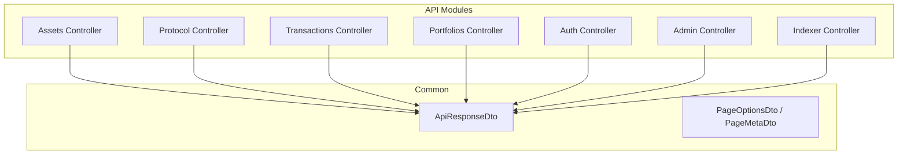
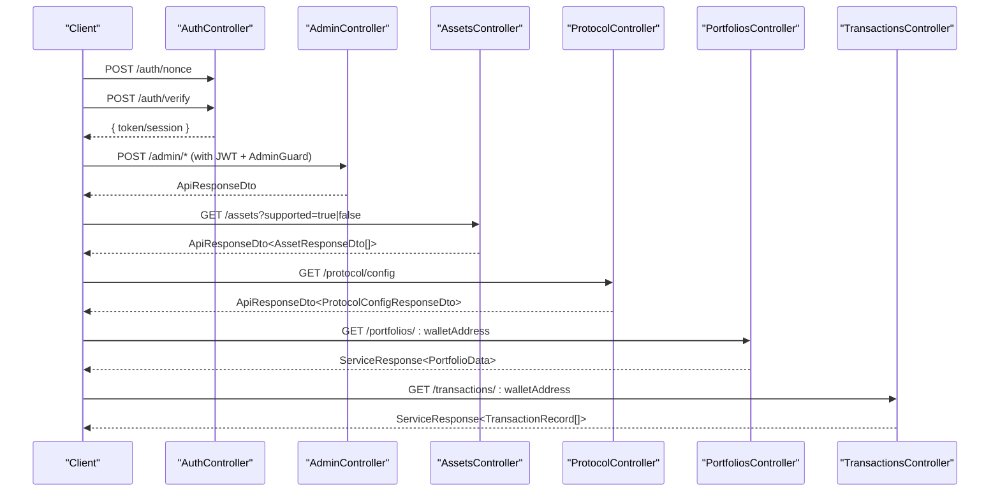
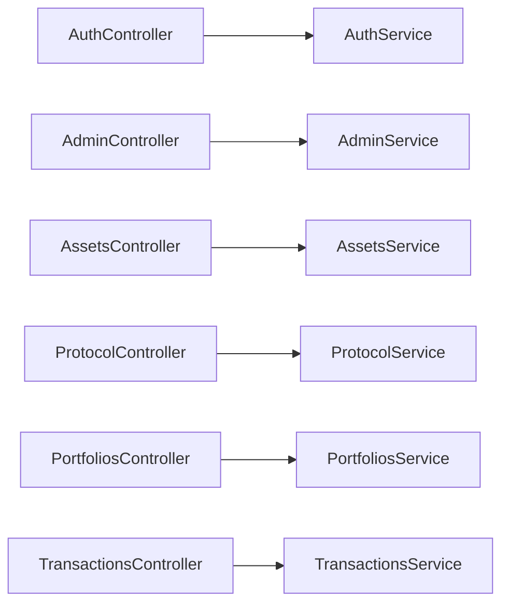

# API Endpoints

<cite>
**Referenced Files in This Document**
- [assets.controller.ts](file://veilend-backend/src/assets/assets.controller.ts)
- [asset-response.dto.ts](file://veilend-backend/src/assets/dto/asset-response.dto.ts)
- [transactions.controller.ts](file://veilend-backend/src/transactions/transactions.controller.ts)
- [admin.controller.ts](file://veilend-backend/src/admin/admin.controller.ts)
- [configure-asset.dto.ts](file://veilend-backend/src/admin/dto/configure-asset.dto.ts)
- [set-oracle-price.dto.ts](file://veilend-backend/src/admin/dto/set-oracle-price.dto.ts)
- [add-admin.dto.ts](file://veilend-backend/src/admin/dto/add-admin.dto.ts)
- [protocol.controller.ts](file://veilend-backend/src/protocol/protocol.controller.ts)
- [protocol-config-response.dto.ts](file://veilend-backend/src/protocol/dto/protocol-config-response.dto.ts)
- [portfolios.controller.ts](file://veilend-backend/src/portfolios/portfolios.controller.ts)
- [auth.controller.ts](file://veilend-backend/src/auth/auth.controller.ts)
- [api-response.dto.ts](file://veilend-backend/src/common/dto/api-response.dto.ts)
- [page-options.dto.ts](file://veilend-backend/src/common/dto/page-options.dto.ts)
- [page-meta.dto.ts](file://veilend-backend/src/common/dto/page-meta.dto.ts)
</cite>

## Table of Contents
1. Introduction
2. Project Structure
3. Core Components
4. Architecture Overview
5. Detailed Component Analysis
6. Dependency Analysis
7. Performance Considerations
8. Troubleshooting Guide
9. Conclusion
10. Appendices

## Introduction
This document provides comprehensive API documentation for the VeilLend backend REST endpoints. It covers HTTP methods, URL patterns, request/response schemas, authentication requirements, error handling, pagination, filtering, and client integration guidelines. The API exposes endpoints for assets, transactions, protocol configuration, admin operations, portfolio management, authentication, and indexer utilities.

## Project Structure
The backend is organized by feature modules under src/. Each module typically contains a controller (HTTP routes), service (business logic), DTOs (request/response shapes), and optional guards/interceptors. Common utilities include standardized API responses and pagination helpers.

[No sources needed since this diagram shows conceptual structure]

## Core Components
- Standardized API response envelope: All public endpoints return a consistent shape with success flag, data payload, optional error object, and metadata.
- Pagination primitives: Reusable page options and meta structures are available for list endpoints that require paging.
- Authentication: Wallet-based sign-in flow using nonces and signatures, issuing JWT sessions protected by guards.

Key response envelope fields:
- success: boolean
- data: any (typed per endpoint)
- error: { code: string; message: string; details?: unknown }
- meta: any (optional)

Pagination primitives:
- PageOptionsDto supports order (ASC/DESC), page (default 1), take (default 10, max 50), and computed skip.
- PageMetaDto provides page, take, itemCount, pageCount, hasPreviousPage, hasNextPage.

Authentication overview:
- Nonce generation and wallet signature verification to obtain a session.
- Protected endpoints use JWT guard and optional admin guard.

**Section sources**
- [api-response.dto.ts:1-38](file://veilend-backend/src/common/dto/api-response.dto.ts#L1-L38)
- [page-options.dto.ts:1-31](file://veilend-backend/src/common/dto/page-options.dto.ts#L1-L31)
- [page-meta.dto.ts:1-25](file://veilend-backend/src/common/dto/page-meta.dto.ts#L1-L25)
- [auth.controller.ts:14-58](file://veilend-backend/src/auth/auth.controller.ts#L14-L58)

## Architecture Overview
The API follows a layered architecture:
- Controllers define HTTP routes and validate inputs via DTOs.
- Services implement business logic and interact with external systems (Stellar/Horizon/Soroban) and databases.
- Guards enforce authentication and authorization.
- Interceptors and filters standardize logging, transformation, and error handling.

**Diagram sources**
- [auth.controller.ts:20-58](file://veilend-backend/src/auth/auth.controller.ts#L20-L58)
- [admin.controller.ts:20-55](file://veilend-backend/src/admin/admin.controller.ts#L20-L55)
- [assets.controller.ts:16-57](file://veilend-backend/src/assets/assets.controller.ts#L16-L57)
- [protocol.controller.ts:9-31](file://veilend-backend/src/protocol/protocol.controller.ts#L9-L31)
- [portfolios.controller.ts:5-15](file://veilend-backend/src/portfolios/portfolios.controller.ts#L5-L15)
- [transactions.controller.ts:5-15](file://veilend-backend/src/transactions/transactions.controller.ts#L5-L15)

## Detailed Component Analysis

### Authentication API
- POST /auth/nonce
  - Purpose: Request a nonce for wallet signing.
  - Request body: { walletAddress: string }
  - Response: { nonce: string }
- POST /auth/verify
  - Purpose: Verify wallet ownership using signature over nonce.
  - Request body: { walletAddress: string; nonce: string; signature: string }
  - Response: Session/token payload (as defined by service).
- GET /auth/session
  - Purpose: Retrieve current session info.
  - Auth: JWT required.
  - Response: { walletAddress: string; sessionId: string; expiresAt: string }
- POST /auth/logout
  - Purpose: Revoke current session.
  - Auth: JWT required.
  - Response: { revoked: boolean }

Notes:
- Use POST /auth/nonce before signing and verifying.
- Subsequent requests to protected endpoints must include a valid JWT.

**Section sources**
- [auth.controller.ts:20-58](file://veilend-backend/src/auth/auth.controller.ts#L20-L58)

### Assets API
- GET /assets
  - Query params:
    - supported: boolean (optional) — filter to configured/supported assets only when true.
  - Response: ApiResponseDto<AssetResponseDto[]>
  - Caching: Cache-Control header set for short-lived caching.
- GET /assets/:id
  - Path param: id — asset UUID, code (e.g., USDC), or contractId.
  - Response: ApiResponseDto<AssetResponseDto>
  - Error: Returns not found if asset does not exist.

Asset response fields:
- code: string
- symbol: string
- name: string
- decimals: number
- issuer: string | null
- contractId: string | null
- logoUrl: string | null
- isNative: boolean
- isSupported: boolean

Example usage:
- List all assets: GET /assets
- Filter supported assets: GET /assets?supported=true
- Get asset by code: GET /assets/USDC

**Section sources**
- [assets.controller.ts:16-57](file://veilend-backend/src/assets/assets.controller.ts#L16-L57)
- [asset-response.dto.ts:1-35](file://veilend-backend/src/assets/dto/asset-response.dto.ts#L1-L35)

### Transactions API
- GET /transactions/:walletAddress
  - Path param: walletAddress — Stellar wallet address.
  - Response: ServiceResponse<TransactionRecord[]>

Notes:
- Returns transaction records associated with the specified wallet.

**Section sources**
- [transactions.controller.ts:5-15](file://veilend-backend/src/transactions/transactions.controller.ts#L5-L15)

### Protocol Configuration API
- GET /protocol/config
  - Purpose: Retrieve full protocol configuration including network settings, risk parameters, and per-asset risk config.
  - Response: ApiResponseDto<ProtocolConfigResponseDto>
  - Caching: Cache-Control header set for longer-lived caching.

Protocol config response fields:
- network: { network, horizonUrl, sorobanRpcUrl, networkPassphrase, contractId }
- riskParameters: { minCollateralRatio, defaultCollateralFactor, defaultLiquidationThreshold, closeFactor, liquidationIncentive }
- assets: array of { code, symbol, collateralFactor, liquidationThreshold, isSupported }
- supportedAssetCount: number
- cachedAt: string

Example usage:
- Fetch protocol config once at startup and cache client-side.

**Section sources**
- [protocol.controller.ts:9-31](file://veilend-backend/src/protocol/protocol.controller.ts#L9-L31)
- [protocol-config-response.dto.ts:1-83](file://veilend-backend/src/protocol/dto/protocol-config-response.dto.ts#L1-L83)

### Admin Operations API
Protected by JWT and AdminGuard.

- POST /admin/admins
  - Purpose: Add an admin wallet address.
  - Request body: { walletAddress: string }
  - Response: ApiResponseDto (service-defined result)
- DELETE /admin/admins/:walletAddress
  - Purpose: Remove an admin wallet address.
  - Path param: walletAddress
  - Response: ApiResponseDto (service-defined result)
- GET /admin/admins
  - Purpose: List current admins.
  - Response: ApiResponseDto (service-defined result)
- POST /admin/assets/configure
  - Purpose: Configure asset support status.
  - Request body: { assetContractId: string; supported: boolean }
  - Response: ApiResponseDto (service-defined result)
- POST /admin/assets/oracle-price
  - Purpose: Set oracle price for an asset.
  - Request body: { assetContractId: string; price: number }
  - Response: ApiResponseDto (service-defined result)
- POST /admin/protocol/min-collateral-ratio
  - Purpose: Set protocol-wide minimum collateral ratio.
  - Request body: { minCollateralRatio: number }
  - Response: ApiResponseDto (service-defined result)

Validation notes:
- Prices must be positive integers.
- Supported flag must be boolean.
- All admin endpoints enforce strict input validation via whitelist pipes.

**Section sources**
- [admin.controller.ts:20-55](file://veilend-backend/src/admin/admin.controller.ts#L20-L55)
- [configure-asset.dto.ts:1-10](file://veilend-backend/src/admin/dto/configure-asset.dto.ts#L1-L10)
- [set-oracle-price.dto.ts:1-11](file://veilend-backend/src/admin/dto/set-oracle-price.dto.ts#L1-L11)
- [add-admin.dto.ts:1-7](file://veilend-backend/src/admin/dto/add-admin.dto.ts#L1-L7)

### Portfolio Management API
- GET /portfolios/:walletAddress
  - Path param: walletAddress
  - Response: ServiceResponse<PortfolioData>

Notes:
- Aggregates user’s positions and balances for the given wallet.

**Section sources**
- [portfolios.controller.ts:5-15](file://veilend-backend/src/portfolios/portfolios.controller.ts#L5-L15)

### Indexer Utilities API
- GET /indexer/status
  - Returns indexer operational status and configuration snapshot.
- GET /indexer/positions/:address
  - Returns indexed positions for a Stellar address.
- GET /indexer/transactions/:address
  - Returns indexed transactions for a Stellar address.
- POST /indexer/replay
  - Triggers a manual replay of contract events from start ledger.

Notes:
- Useful for monitoring and maintenance tasks.

**Section sources**
- [indexer.controller.ts:6-67](file://veilend-backend/src/indexer/indexer.controller.ts#L6-L67)

## Dependency Analysis
- Controllers depend on services for business logic and data access.
- Authentication depends on JWT strategy and guards.
- Admin endpoints depend on both JWT and Admin guards.
- Public endpoints (assets, protocol) are designed for caching and read-only access.

[No sources needed since this diagram shows conceptual dependencies]

## Performance Considerations
- Caching:
  - Asset endpoints set Cache-Control headers for short-term caching.
  - Protocol config sets longer Cache-Control for infrequent updates.
- Pagination:
  - Use PageOptionsDto for list endpoints requiring pagination (order, page, take).
  - Enforce reasonable defaults and caps to prevent heavy queries.
- Filtering:
  - Assets support ?supported=true to reduce payload size.
- Idempotency:
  - Ensure write operations are idempotent where applicable (e.g., setting prices).

[No sources needed since this section provides general guidance]

## Troubleshooting Guide
- Authentication errors:
  - Ensure you call POST /auth/nonce before signing and verifying.
  - Validate signature format and ensure it matches the nonce returned.
  - Include valid JWT in Authorization header for protected endpoints.
- Not Found:
  - Asset lookup by id/code/contractId returns not found if no match exists.
- Validation errors:
  - Admin endpoints enforce strict validation; check field types and constraints.
- Rate limiting:
  - If rate-limited, back off and retry with exponential backoff.
- Indexer issues:
  - Use /indexer/status to verify health and configuration.
  - Trigger replay via /indexer/replay if data appears stale.

**Section sources**
- [assets.controller.ts:45-57](file://veilend-backend/src/assets/assets.controller.ts#L45-L57)
- [admin.controller.ts:20-55](file://veilend-backend/src/admin/admin.controller.ts#L20-L55)
- [indexer.controller.ts:16-67](file://veilend-backend/src/indexer/indexer.controller.ts#L16-L67)

## Conclusion
The VeilLend backend exposes a clear, versioned-by-path REST API with consistent response envelopes, robust authentication, and well-scoped modules for assets, transactions, protocol configuration, admin operations, portfolios, and indexer utilities. Clients should authenticate via wallet signatures, leverage caching headers, and use pagination/filtering to optimize performance.

[No sources needed since this section summarizes without analyzing specific files]

## Appendices

### API Versioning Strategy and Backwards Compatibility
- Versioning approach:
  - Prefer path-based versioning (e.g., /v1/) for major changes.
  - Maintain backward compatibility within a major version by deprecating fields rather than removing them.
- Deprecation policy:
  - Mark deprecated fields in responses with comments and gradual removal across minor versions.
- Change communication:
  - Update changelog and notify clients of breaking changes ahead of time.

[No sources needed since this section provides general guidance]

### Pagination Patterns
- Query parameters:
  - page: integer >= 1 (default 1)
  - take: integer between 1 and 50 (default 10)
  - order: ASC or DESC (default ASC)
- Computed skip:
  - skip = (page - 1) * take
- Metadata:
  - Use PageMetaDto to provide pagination context in responses.

**Section sources**
- [page-options.dto.ts:1-31](file://veilend-backend/src/common/dto/page-options.dto.ts#L1-L31)
- [page-meta.dto.ts:1-25](file://veilend-backend/src/common/dto/page-meta.dto.ts#L1-L25)

### Error Codes and Response Formats
- Success responses:
  - { success: true, data: <payload>, meta?: <metadata> }
- Error responses:
  - { success: false, error: { code: string, message: string, details?: unknown } }
- Common codes:
  - NOT_FOUND: Resource not found (e.g., asset lookup).
  - UNAUTHORIZED: Missing or invalid JWT.
  - FORBIDDEN: Valid JWT but insufficient permissions (admin-only).
  - VALIDATION_ERROR: Invalid request body or query parameters.

**Section sources**
- [api-response.dto.ts:1-38](file://veilend-backend/src/common/dto/api-response.dto.ts#L1-L38)

### Client Integration Guidelines
- Authentication flow:
  1. Call POST /auth/nonce with walletAddress.
  2. Sign the nonce offline with the wallet.
  3. Call POST /auth/verify with walletAddress, nonce, and signature.
  4. Store the returned session/token and attach to subsequent requests.
- Caching:
  - Respect Cache-Control headers for assets and protocol config.
  - Cache protocol config at app startup and refresh on interval or invalidation.
- Pagination and filtering:
  - Use page, take, order for list endpoints.
  - Use supported=true on /assets to limit to configured assets.
- Error handling:
  - Check success flag and handle error.code/message accordingly.
  - Implement retries for transient failures with backoff.

**Section sources**
- [auth.controller.ts:20-58](file://veilend-backend/src/auth/auth.controller.ts#L20-L58)
- [assets.controller.ts:20-39](file://veilend-backend/src/assets/assets.controller.ts#L20-L39)
- [protocol.controller.ts:13-31](file://veilend-backend/src/protocol/protocol.controller.ts#L13-L31)