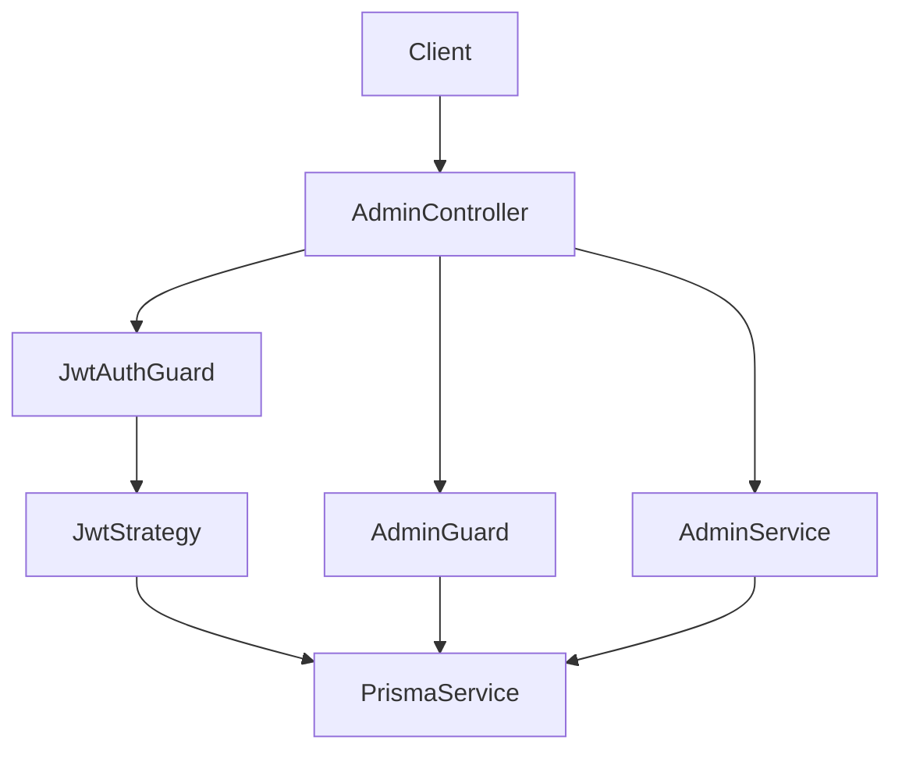
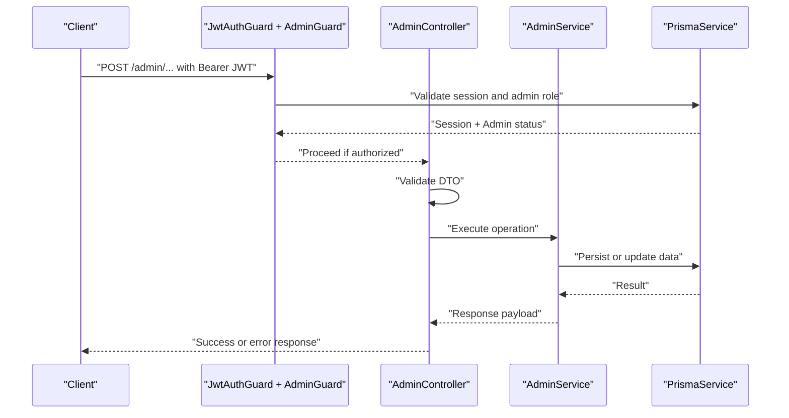
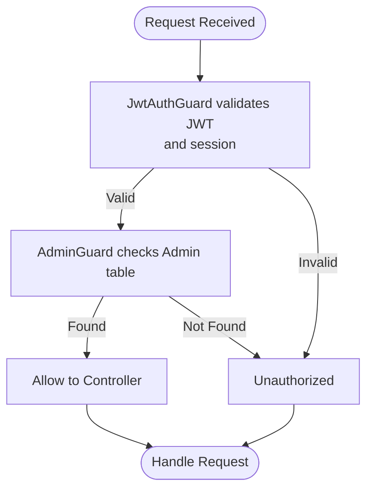
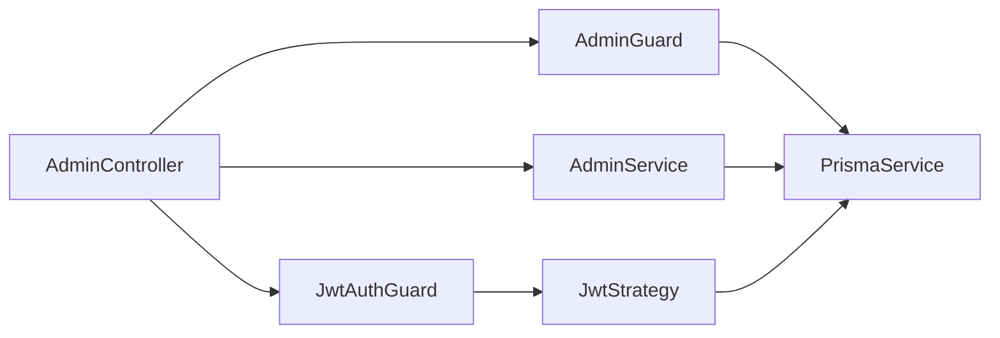

# Admin API

<cite>
**Referenced Files in This Document**
- [admin.controller.ts](file://veilend-backend/src/admin/admin.controller.ts)
- [admin.service.ts](file://veilend-backend/src/admin/admin.service.ts)
- [add-admin.dto.ts](file://veilend-backend/src/admin/dto/add-admin.dto.ts)
- [configure-asset.dto.ts](file://veilend-backend/src/admin/dto/configure-asset.dto.ts)
- [set-min-collateral-ratio.dto.ts](file://veilend-backend/src/admin/dto/set-min-collateral-ratio.dto.ts)
- [set-oracle-price.dto.ts](file://veilend-backend/src/admin/dto/set-oracle-price.dto.ts)
- [admin.guard.ts](file://veilend-backend/src/auth/admin.guard.ts)
- [jwt-auth.guard.ts](file://veilend-backend/src/auth/jwt-auth.guard.ts)
- [jwt.strategy.ts](file://veilend-backend/src/auth/jwt.strategy.ts)
- [auth.service.ts](file://veilend-backend/src/auth/auth.service.ts)
- [authenticated-request.type.ts](file://veilend-backend/src/auth/types/authenticated-request.type.ts)
- [schema.prisma](file://veilend-backend/prisma/schema.prisma)
- [logging.interceptor.ts](file://veilend-backend/src/common/logging/logging.interceptor.ts)
- [all-exceptions.filter.ts](file://veilend-backend/src/common/logging/all-exceptions.filter.ts)
- [app-logger.service.ts](file://veilend-backend/src/common/logging/app-logger.service.ts)
</cite>

## Table of Contents
1. Introduction
2. Project Structure
3. Core Components
4. Architecture Overview
5. Detailed Component Analysis
6. Dependency Analysis
7. Performance Considerations
8. Troubleshooting Guide
9. Conclusion

## Introduction
This document provides API documentation for administrative endpoints that manage protocol configuration and privileged operations. It covers authentication using JWT tokens, authorization checks for admin roles, request/response schemas, audit logging considerations, security best practices, example operations, and error handling for unauthorized access attempts.

Note: The actual endpoint paths implemented in the codebase differ from the ones mentioned in the objective. The documented endpoints below reflect the real implementation.

## Project Structure
The administrative functionality is implemented as a NestJS module with:
- A controller defining protected routes
- A service orchestrating business logic (currently returning placeholder responses for some operations)
- DTOs for input validation
- Guards for JWT authentication and admin role enforcement
- Logging infrastructure for request tracing and error reporting
- Prisma schema for storing admins and sessions

**Diagram sources**
- [admin.controller.ts:20-54](file://veilend-backend/src/admin/admin.controller.ts#L20-L54)
- [admin.service.ts:8-56](file://veilend-backend/src/admin/admin.service.ts#L8-L56)
- [jwt-auth.guard.ts:1-6](file://veilend-backend/src/auth/jwt-auth.guard.ts#L1-L6)
- [jwt.strategy.ts:13-63](file://veilend-backend/src/auth/jwt.strategy.ts#L13-L63)
- [admin.guard.ts:24-46](file://veilend-backend/src/auth/admin.guard.ts#L24-L46)
- [schema.prisma:179-185](file://veilend-backend/prisma/schema.prisma#L179-L185)

**Section sources**
- [admin.controller.ts:20-54](file://veilend-backend/src/admin/admin.controller.ts#L20-L54)
- [schema.prisma:179-185](file://veilend-backend/prisma/schema.prisma#L179-L185)

## Core Components
- Authentication: Bearer JWT validated via Passport strategy; session existence and expiry enforced.
- Authorization: AdminGuard verifies the authenticated wallet address exists in the Admin table.
- Endpoints: Protected by both guards; inputs validated by class-validator DTOs.
- Logging: Global interceptor logs HTTP requests/responses; exception filter standardizes error responses and includes correlation IDs.

Key responsibilities:
- JwtStrategy extracts bearer token, validates signature/expiry, and ensures active session.
- AdminGuard checks if the user’s walletAddress is registered as an admin.
- AdminController exposes admin routes with strict DTO validation.
- AdminService performs data operations or placeholder contract interactions.

**Section sources**
- [jwt.strategy.ts:13-63](file://veilend-backend/src/auth/jwt.strategy.ts#L13-L63)
- [admin.guard.ts:24-46](file://veilend-backend/src/auth/admin.guard.ts#L24-L46)
- [admin.controller.ts:20-54](file://veilend-backend/src/admin/admin.controller.ts#L20-L54)
- [admin.service.ts:8-56](file://veilend-backend/src/admin/admin.service.ts#L8-L56)

## Architecture Overview
End-to-end flow for an admin operation:
1. Client sends a POST request with a valid Bearer JWT to an admin route.
2. JwtAuthGuard validates the token and ensures the session is active.
3. AdminGuard checks that the user’s walletAddress is an admin.
4. Controller validates the request body against the DTO.
5. Service executes the operation (e.g., create admin record or update protocol config).
6. Response is returned; global logging records the request and response.

**Diagram sources**
- [jwt.strategy.ts:13-63](file://veilend-backend/src/auth/jwt.strategy.ts#L13-L63)
- [admin.guard.ts:24-46](file://veilend-backend/src/auth/admin.guard.ts#L24-L46)
- [admin.controller.ts:20-54](file://veilend-backend/src/admin/admin.controller.ts#L20-L54)
- [admin.service.ts:8-56](file://veilend-backend/src/admin/admin.service.ts#L8-L56)
- [schema.prisma:179-185](file://veilend-backend/prisma/schema.prisma#L179-L185)

## Detailed Component Analysis

### Authentication and Authorization
- JWT-based authentication:
  - Token extracted from Authorization header as Bearer token.
  - Session lookup ensures token is still valid and not revoked.
  - Payload includes walletAddress and userId.
- Admin authorization:
  - After authentication, AdminGuard queries the Admin table by walletAddress.
  - If not found, access is denied.

**Diagram sources**
- [jwt.strategy.ts:13-63](file://veilend-backend/src/auth/jwt.strategy.ts#L13-L63)
- [admin.guard.ts:24-46](file://veilend-backend/src/auth/admin.guard.ts#L24-L46)

**Section sources**
- [jwt.strategy.ts:13-63](file://veilend-backend/src/auth/jwt.strategy.ts#L13-L63)
- [admin.guard.ts:24-46](file://veilend-backend/src/auth/admin.guard.ts#L24-L46)
- [schema.prisma:179-185](file://veilend-backend/prisma/schema.prisma#L179-L185)

### Endpoint: Add Administrator
- Path: POST /admin/admins
- Purpose: Register a new admin wallet address.
- Authentication: Required (JWT + Admin role).
- Request body:
  - walletAddress: string (required)
- Response: Created admin record.
- Notes:
  - Input validated by DTO.
  - Stored in Admin table via Prisma.

Example request:
- Method: POST
- URL: /admin/admins
- Headers: Authorization: Bearer <token>
- Body: { "walletAddress": "<stellar-address>" }

Example response:
- Status: 201
- Body: Admin record including id, walletAddress, createdAt

**Section sources**
- [admin.controller.ts:26-29](file://veilend-backend/src/admin/admin.controller.ts#L26-L29)
- [admin.service.ts:12-18](file://veilend-backend/src/admin/admin.service.ts#L12-L18)
- [add-admin.dto.ts:1-7](file://veilend-backend/src/admin/dto/add-admin.dto.ts#L1-L7)
- [schema.prisma:179-185](file://veilend-backend/prisma/schema.prisma#L179-L185)

### Endpoint: Configure Asset
- Path: POST /admin/assets/configure
- Purpose: Update asset configuration (e.g., enable/disable support).
- Authentication: Required (JWT + Admin role).
- Request body:
  - assetContractId: string (required)
  - supported: boolean (required)
- Response: Success message with echoed input data.
- Notes:
  - Placeholder implementation currently returns success without on-chain interaction.

Example request:
- Method: POST
- URL: /admin/assets/configure
- Headers: Authorization: Bearer <token>
- Body: { "assetContractId": "<contract-id>", "supported": true }

Example response:
- Status: 200
- Body: { "success": true, "message": "Asset configuration updated", "data": { ... } }

**Section sources**
- [admin.controller.ts:41-44](file://veilend-backend/src/admin/admin.controller.ts#L41-L44)
- [admin.service.ts:30-37](file://veilend-backend/src/admin/admin.service.ts#L30-L37)
- [configure-asset.dto.ts:1-10](file://veilend-backend/src/admin/dto/configure-asset.dto.ts#L1-L10)

### Endpoint: Set Minimum Collateral Ratio
- Path: POST /admin/protocol/min-collateral-ratio
- Purpose: Set the protocol-wide minimum collateral ratio in basis points.
- Authentication: Required (JWT + Admin role).
- Request body:
  - minCollateralRatioBps: integer (required), minimum value enforced by validator
- Response: Success message with echoed input data.
- Notes:
  - Placeholder implementation currently returns success without on-chain interaction.

Example request:
- Method: POST
- URL: /admin/protocol/min-collateral-ratio
- Headers: Authorization: Bearer <token>
- Body: { "minCollateralRatioBps": 15000 }

Example response:
- Status: 200
- Body: { "success": true, "message": "Min collateral ratio updated", "data": { ... } }

**Section sources**
- [admin.controller.ts:51-54](file://veilend-backend/src/admin/admin.controller.ts#L51-L54)
- [admin.service.ts:48-55](file://veilend-backend/src/admin/admin.service.ts#L48-L55)
- [set-min-collateral-ratio.dto.ts:1-8](file://veilend-backend/src/admin/dto/set-min-collateral-ratio.dto.ts#L1-L8)

### Endpoint: Set Oracle Price
- Path: POST /admin/assets/oracle-price
- Purpose: Set or update the oracle price for a given asset contract.
- Authentication: Required (JWT + Admin role).
- Request body:
  - assetContractId: string (required)
  - price: integer (required), minimum value enforced by validator
- Response: Success message with echoed input data.
- Notes:
  - Placeholder implementation currently returns success without on-chain interaction.

Example request:
- Method: POST
- URL: /admin/assets/oracle-price
- Headers: Authorization: Bearer <token>
- Body: { "assetContractId": "<contract-id>", "price": 100000000 }

Example response:
- Status: 200
- Body: { "success": true, "message": "Oracle price set", "data": { ... } }

**Section sources**
- [admin.controller.ts:46-49](file://veilend-backend/src/admin/admin.controller.ts#L46-L49)
- [admin.service.ts:39-46](file://veilend-backend/src/admin/admin.service.ts#L39-L46)
- [set-oracle-price.dto.ts:1-11](file://veilend-backend/src/admin/dto/set-oracle-price.dto.ts#L1-L11)

### Additional Admin Endpoints
- Remove administrator: DELETE /admin/admins/:walletAddress
- List administrators: GET /admin/admins

These are protected by the same JWT + Admin guards and interact with the Admin table.

**Section sources**
- [admin.controller.ts:31-39](file://veilend-backend/src/admin/admin.controller.ts#L31-L39)
- [admin.service.ts:20-28](file://veilend-backend/src/admin/admin.service.ts#L20-L28)
- [schema.prisma:179-185](file://veilend-backend/prisma/schema.prisma#L179-L185)

## Dependency Analysis
- Controllers depend on services and guards.
- Guards depend on Prisma for session and admin lookups.
- Services depend on Prisma for persistence.
- Logging interceptors and filters apply globally across all routes.

**Diagram sources**
- [admin.controller.ts:20-54](file://veilend-backend/src/admin/admin.controller.ts#L20-L54)
- [admin.service.ts:8-56](file://veilend-backend/src/admin/admin.service.ts#L8-L56)
- [jwt-auth.guard.ts:1-6](file://veilend-backend/src/auth/jwt-auth.guard.ts#L1-L6)
- [jwt.strategy.ts:13-63](file://veilend-backend/src/auth/jwt.strategy.ts#L13-L63)
- [admin.guard.ts:24-46](file://veilend-backend/src/auth/admin.guard.ts#L24-L46)

**Section sources**
- [admin.controller.ts:20-54](file://veilend-backend/src/admin/admin.controller.ts#L20-L54)
- [admin.service.ts:8-56](file://veilend-backend/src/admin/admin.service.ts#L8-L56)
- [jwt.strategy.ts:13-63](file://veilend-backend/src/auth/jwt.strategy.ts#L13-L63)
- [admin.guard.ts:24-46](file://veilend-backend/src/auth/admin.guard.ts#L24-L46)

## Performance Considerations
- Use DTO validation to fail fast on invalid payloads.
- Keep admin operations idempotent where possible to avoid duplicate state changes.
- Ensure database indexes exist for frequent lookups (e.g., walletAddress in Admin table).
- Avoid heavy synchronous work in request handlers; delegate to background jobs if needed.
- Monitor latency via logging interceptor metrics.

[No sources needed since this section provides general guidance]

## Troubleshooting Guide
Common errors and handling:
- Unauthorized (no token):
  - Cause: Missing or malformed Authorization header.
  - Action: Provide a valid Bearer JWT obtained via the auth flow.
- Unauthorized (session not found or revoked):
  - Cause: Session missing or expired in the database.
  - Action: Re-authenticate to obtain a new session and token.
- Unauthorized (not an admin):
  - Cause: Wallet address not present in Admin table.
  - Action: Add the wallet address as an admin first.
- Validation errors:
  - Cause: Invalid or missing fields in request body.
  - Action: Ensure request matches DTO requirements.

Global error responses include standardized structure and correlation ID for tracing.

**Section sources**
- [jwt.strategy.ts:35-63](file://veilend-backend/src/auth/jwt.strategy.ts#L35-L63)
- [admin.guard.ts:28-46](file://veilend-backend/src/auth/admin.guard.ts#L28-L46)
- [all-exceptions.filter.ts:13-57](file://veilend-backend/src/common/logging/all-exceptions.filter.ts#L13-L57)

## Security Best Practices for Admin API Usage
- Enforce HTTPS/TLS for all admin endpoints.
- Restrict admin endpoints to trusted networks or VPN when possible.
- Rotate JWT secrets regularly and store securely.
- Limit admin privileges to the minimum required.
- Log all admin actions with correlation IDs for auditability.
- Validate and sanitize all inputs strictly using DTOs.
- Implement rate limiting and IP allowlisting at the gateway level.
- Regularly review admin membership and revoke unused accounts.

[No sources needed since this section provides general guidance]

## Conclusion
The admin API provides secure, guarded endpoints for managing protocol configuration and privileged operations. Authentication relies on JWT with active session checks, while authorization enforces admin roles via the Admin table. Inputs are validated through DTOs, and global logging supports auditing and troubleshooting. Placeholder implementations for certain operations should be extended to integrate with on-chain contracts as needed.

[No sources needed since this section summarizes without analyzing specific files]