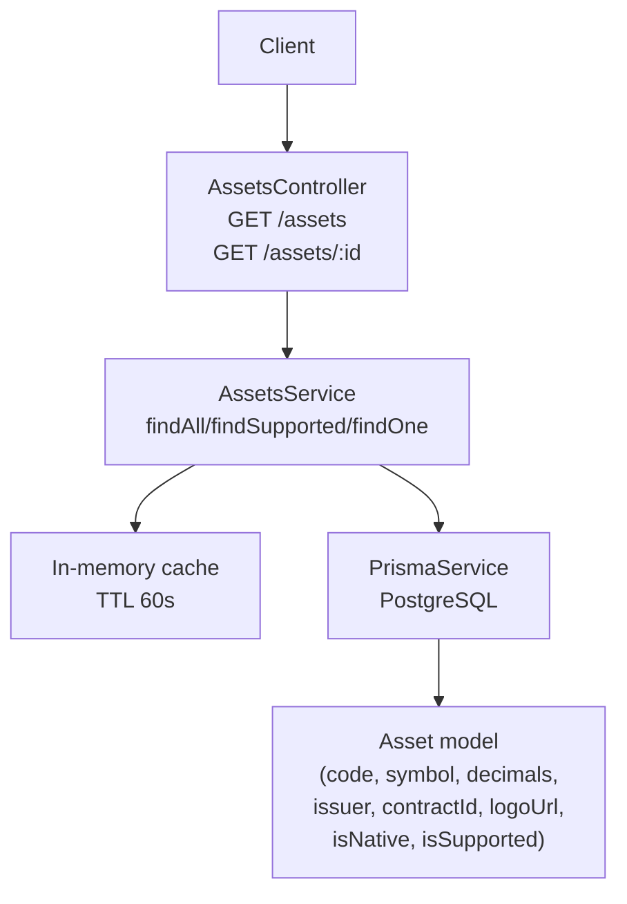
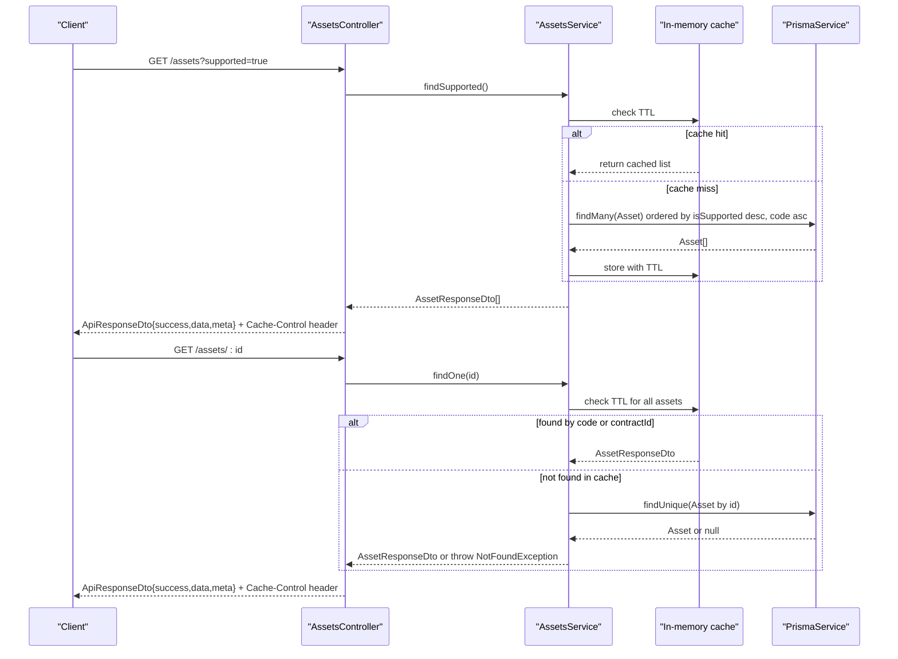
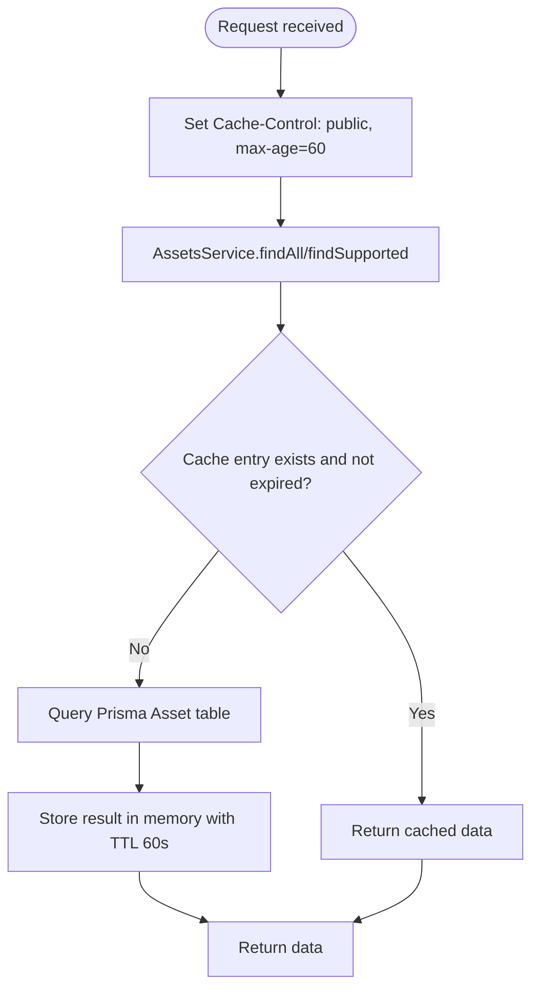
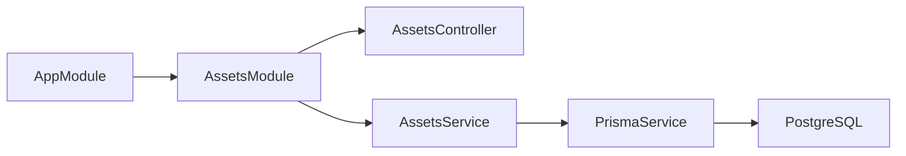

# Asset Management API

<cite>
**Referenced Files in This Document**
- [assets.controller.ts](file://veilend-backend/src/assets/assets.controller.ts)
- [assets.service.ts](file://veilend-backend/src/assets/assets.service.ts)
- [asset-response.dto.ts](file://veilend-backend/src/assets/dto/asset-response.dto.ts)
- [api-response.dto.ts](file://veilend-backend/src/common/dto/api-response.dto.ts)
- [schema.prisma](file://veilend-backend/prisma/schema.prisma)
- [app.module.ts](file://veilend-backend/src/app.module.ts)
</cite>

## Table of Contents
1. [Introduction](#introduction)
2. [Project Structure](#project-structure)
3. [Core Components](#core-components)
4. [Architecture Overview](#architecture-overview)
5. [Detailed Component Analysis](#detailed-component-analysis)
6. [Dependency Analysis](#dependency-analysis)
7. [Performance Considerations](#performance-considerations)
8. [Troubleshooting Guide](#troubleshooting-guide)
9. [Conclusion](#conclusion)

## Introduction
This document describes the Asset Management API endpoints for retrieving supported assets and fetching asset details. It covers request/response schemas, caching behavior, error handling, and integration examples for querying supported assets and retrieving metadata such as symbols, decimals, and oracle prices.

## Project Structure
The Asset Management feature is implemented as a NestJS module with a controller, service, and DTOs:
- Controller exposes REST endpoints under /assets
- Service handles data retrieval, filtering, and an in-memory cache
- DTO defines the public response shape
- Prisma schema defines the underlying Asset model

**Diagram sources**
- [assets.controller.ts:16-57](file://veilend-backend/src/assets/assets.controller.ts#L16-L57)
- [assets.service.ts:15-90](file://veilend-backend/src/assets/assets.service.ts#L15-L90)
- [schema.prisma:47-65](file://veilend-backend/prisma/schema.prisma#L47-L65)

**Section sources**
- [assets.controller.ts:16-57](file://veilend-backend/src/assets/assets.controller.ts#L16-L57)
- [assets.service.ts:15-90](file://veilend-backend/src/assets/assets.service.ts#L15-L90)
- [schema.prisma:47-65](file://veilend-backend/prisma/schema.prisma#L47-L65)

## Core Components
- AssetsController: Defines GET /assets and GET /assets/:id with caching headers and query parameter support.
- AssetsService: Provides findAll, findSupported, findOne with in-memory caching and database fallback.
- AssetResponseDto: Public-facing asset fields exposed to clients.
- ApiResponseDto: Standardized success/failure envelope used by endpoints.

Key responsibilities:
- Filtering supported assets via ?supported=true on GET /assets
- Resolving asset by UUID, code (e.g., 'USDC'), or contractId on GET /assets/:id
- Returning consistent response envelopes with metadata
- Applying 60-second cache headers at the controller layer and in-memory caching in the service

**Section sources**
- [assets.controller.ts:16-57](file://veilend-backend/src/assets/assets.controller.ts#L16-L57)
- [assets.service.ts:15-90](file://veilend-backend/src/assets/assets.service.ts#L15-L90)
- [asset-response.dto.ts:7-34](file://veilend-backend/src/assets/dto/asset-response.dto.ts#L7-L34)
- [api-response.dto.ts:1-38](file://veilend-backend/src/common/dto/api-response.dto.ts#L1-L38)

## Architecture Overview
The API follows a layered architecture:
- Controller receives HTTP requests, applies caching headers, and delegates to the service
- Service uses an in-memory cache to reduce database load and falls back to Prisma queries
- Data is modeled by Prisma’s Asset schema and transformed into DTOs for responses

**Diagram sources**
- [assets.controller.ts:20-57](file://veilend-backend/src/assets/assets.controller.ts#L20-L57)
- [assets.service.ts:26-81](file://veilend-backend/src/assets/assets.service.ts#L26-L81)
- [schema.prisma:47-65](file://veilend-backend/prisma/schema.prisma#L47-L65)

## Detailed Component Analysis

### Endpoints

#### GET /assets
- Purpose: Retrieve all registered assets. Use ?supported=true to filter to configured/supported assets only.
- Query parameters:
  - supported: string; when equal to "true", returns only supported assets
- Response envelope: ApiResponseDto<AssetResponseDto[]>
- Headers:
  - Cache-Control: public, max-age=60
- Success response structure:
  - success: boolean
  - data: AssetResponseDto[]
  - meta: object including count, cached flag, and cacheMaxAge
- Error scenarios:
  - No explicit errors are thrown for invalid query values; unsupported values are ignored and treated as false

Example usage:
- Retrieve all assets: GET /assets
- Retrieve supported assets only: GET /assets?supported=true

**Section sources**
- [assets.controller.ts:20-39](file://veilend-backend/src/assets/assets.controller.ts#L20-L39)
- [assets.service.ts:26-61](file://veilend-backend/src/assets/assets.service.ts#L26-L61)
- [api-response.dto.ts:15-21](file://veilend-backend/src/common/dto/api-response.dto.ts#L15-L21)

#### GET /assets/:id
- Purpose: Fetch a specific asset by its UUID, code (e.g., 'USDC'), or contractId.
- Path parameter:
  - id: string; can be UUID, code, or contractId
- Response envelope: ApiResponseDto<AssetResponseDto>
- Headers:
  - Cache-Control: public, max-age=60
- Success response structure:
  - success: boolean
  - data: AssetResponseDto
- Error handling:
  - If no matching asset is found, throws NotFoundException resulting in a 404 Not Found response

Example usage:
- By UUID: GET /assets/{uuid}
- By code: GET /assets/USDC
- By contractId: GET /assets/{contractId}

**Section sources**
- [assets.controller.ts:41-57](file://veilend-backend/src/assets/assets.controller.ts#L41-L57)
- [assets.service.ts:63-81](file://veilend-backend/src/assets/assets.service.ts#L63-L81)

### Request and Response Schemas

- AssetResponseDto fields:
  - code: string
  - symbol: string
  - name: string
  - decimals: number
  - issuer: string | null
  - contractId: string | null
  - logoUrl: string | null
  - isNative: boolean
  - isSupported: boolean

- ApiResponseDto envelope:
  - success: boolean
  - data?: T
  - error?: { code: string; message: string; details?: unknown }
  - meta?: unknown

Notes:
- The GET /assets endpoint includes additional meta information such as count, cached, and cacheMaxAge in successful responses.
- The GET /assets/:id endpoint returns a single AssetResponseDto wrapped in the same envelope.

**Section sources**
- [asset-response.dto.ts:7-34](file://veilend-backend/src/assets/dto/asset-response.dto.ts#L7-L34)
- [api-response.dto.ts:1-38](file://veilend-backend/src/common/dto/api-response.dto.ts#L1-L38)
- [assets.controller.ts:24-39](file://veilend-backend/src/assets/assets.controller.ts#L24-L39)

### Caching Behavior
- HTTP-level caching:
  - Both endpoints set Cache-Control: public, max-age=60
- In-memory caching:
  - AssetsService caches the full asset list for 60 seconds to reduce database reads
  - Cache is invalidated via invalidateCache() method (useful after admin configuration changes)

**Diagram sources**
- [assets.controller.ts:24-47](file://veilend-backend/src/assets/assets.controller.ts#L24-L47)
- [assets.service.ts:19-53](file://veilend-backend/src/assets/assets.service.ts#L19-L53)

**Section sources**
- [assets.controller.ts:24-47](file://veilend-backend/src/assets/assets.controller.ts#L24-L47)
- [assets.service.ts:19-53](file://veilend-backend/src/assets/assets.service.ts#L19-L53)
- [assets.service.ts:83-89](file://veilend-backend/src/assets/assets.service.ts#L83-L89)

### Error Handling
- Not Found:
  - GET /assets/:id throws NotFoundException when no asset matches the provided id
- General errors:
  - Global exception filters handle unhandled exceptions and return standardized error envelopes

Integration tips:
- Clients should handle 404 responses for missing assets and retry or fall back gracefully
- Respect Cache-Control headers to optimize client-side caching

**Section sources**
- [assets.controller.ts:47-57](file://veilend-backend/src/assets/assets.controller.ts#L47-L57)
- [assets.service.ts:66-81](file://veilend-backend/src/assets/assets.service.ts#L66-L81)

### Integration Examples

- Query supported assets:
  - Request: GET /assets?supported=true
  - Response: ApiResponseDto containing an array of AssetResponseDto where isSupported is true
  - Use case: Build a dropdown of available assets for deposits/borrows

- Retrieve asset metadata:
  - Request: GET /assets/USDC
  - Response: ApiResponseDto containing AssetResponseDto with symbol, decimals, issuer, contractId, etc.
  - Use case: Display human-readable info and precision for UI formatting

- Oracle prices:
  - Note: The AssetResponseDto does not include oracle price fields. To obtain oracle prices, use the protocol or price-oracle endpoints defined elsewhere in the application.

[No sources needed since this section provides general guidance]

## Dependency Analysis
- Module registration:
  - AssetsModule is imported in AppModule, enabling the /assets routes
- Controller dependencies:
  - AssetsController depends on AssetsService
- Service dependencies:
  - AssetsService depends on PrismaService for database access
- Data model:
  - Asset model fields define the source of truth for asset metadata

**Diagram sources**
- [app.module.ts:28-60](file://veilend-backend/src/app.module.ts#L28-L60)
- [assets.module.ts:5-9](file://veilend-backend/src/assets/assets.module.ts#L5-L9)
- [assets.controller.ts:16-18](file://veilend-backend/src/assets/assets.controller.ts#L16-L18)
- [assets.service.ts:15-24](file://veilend-backend/src/assets/assets.service.ts#L15-L24)

**Section sources**
- [app.module.ts:28-60](file://veilend-backend/src/app.module.ts#L28-L60)
- [assets.module.ts:5-9](file://veilend-backend/src/assets/assets.module.ts#L5-L9)

## Performance Considerations
- In-memory cache reduces database load for read-heavy workloads
- Cache TTL of 60 seconds balances freshness and performance
- Ordering by isSupported desc and code asc ensures predictable listing order
- Avoid frequent cache invalidation; call invalidateCache() only after configuration changes

[No sources needed since this section provides general guidance]

## Troubleshooting Guide
- 404 Not Found on GET /assets/:id:
  - Ensure the id is a valid UUID, code, or contractId
  - Verify that the asset exists in the database and is indexed correctly
- Unexpected empty list on GET /assets?supported=true:
  - Confirm that assets have isSupported set to true in the database
- Stale data:
  - Invalidate the in-memory cache after admin updates to ensure fresh results

**Section sources**
- [assets.controller.ts:47-57](file://veilend-backend/src/assets/assets.controller.ts#L47-L57)
- [assets.service.ts:58-61](file://veilend-backend/src/assets/assets.service.ts#L58-L61)
- [assets.service.ts:83-89](file://veilend-backend/src/assets/assets.service.ts#L83-L89)

## Conclusion
The Asset Management API provides efficient, cached access to asset metadata with clear filtering and robust error handling. Clients can retrieve supported assets and fetch detailed information by UUID, code, or contractId while respecting standard caching headers. For oracle prices, integrate with the appropriate protocol or price-oracle endpoints as needed.