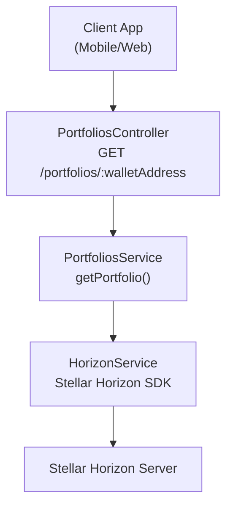
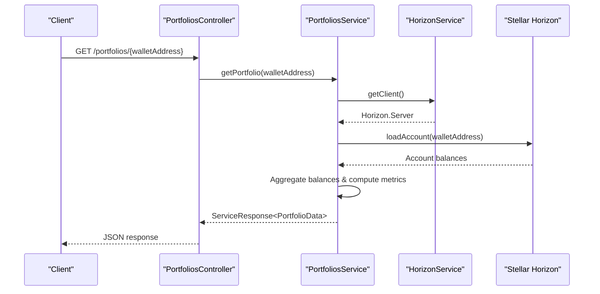
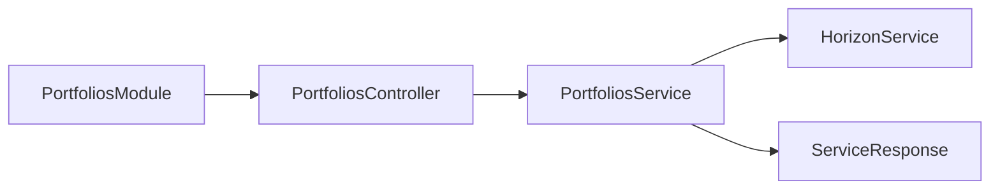

# Portfolio API

<cite>
**Referenced Files in This Document**
- [portfolios.controller.ts](file://veilend-backend/src/portfolios/portfolios.controller.ts)
- [portfolios.service.ts](file://veilend-backend/src/portfolios/portfolios.service.ts)
- [portfolios.module.ts](file://veilend-backend/src/portfolios/portfolios.module.ts)
- [types.ts](file://veilend-backend/src/stellar/types.ts)
- [horizon.service.ts](file://veilend-backend/src/stellar/horizon.service.ts)
- [store.ts](file://veilend-mobile/src/store/store.ts)
- [DashboardScreen.tsx](file://veilend-mobile/src/screens/DashboardScreen.tsx)
- [api.ts](file://veilend-mobile/src/utils/api.ts)
- [dashboard.ts](file://veilend-web/src/lib/api/dashboard.ts)
- [redact.util.ts](file://veilend-backend/src/common/logging/redact.util.ts)
</cite>

## Table of Contents
1. Introduction
2. Project Structure
3. Core Components
4. Architecture Overview
5. Detailed Component Analysis
6. Dependency Analysis
7. Performance Considerations
8. Troubleshooting Guide
9. Conclusion

## Introduction
This document describes the Portfolio API endpoints for retrieving user portfolios with aggregated position summaries, balance calculations across multiple assets, and USD valuation calculations. It covers privacy mode support for masking sensitive balances, filtering by asset types, and response formatting that includes both raw balances and calculated values. It also provides examples of portfolio queries, integration patterns for displaying user dashboards, and guidance on handling privacy-sensitive data in client applications.

## Project Structure
The Portfolio feature is implemented as a NestJS module exposing a single endpoint to fetch portfolio data for a given wallet address. The service layer reads balances from the Stellar Horizon network and computes derived metrics such as collateral value, available-to-borrow capacity, and health factor. Clients (mobile and web) consume this endpoint to render dashboard views and can apply privacy masking locally.

**Diagram sources**
- [portfolios.controller.ts:5-14](file://veilend-backend/src/portfolios/portfolios.controller.ts#L5-L14)
- [portfolios.service.ts:24-84](file://veilend-backend/src/portfolios/portfolios.service.ts#L24-L84)
- [horizon.service.ts:17-44](file://veilend-backend/src/stellar/horizon.service.ts#L17-L44)

**Section sources**
- [portfolios.controller.ts:1-16](file://veilend-backend/src/portfolios/portfolios.controller.ts#L1-L16)
- [portfolios.service.ts:1-86](file://veilend-backend/src/portfolios/portfolios.service.ts#L1-L86)
- [horizon.service.ts:1-115](file://veilend-backend/src/stellar/horizon.service.ts#L1-L115)

## Core Components
- PortfoliosController: Exposes GET /portfolios/:walletAddress and delegates to the service.
- PortfoliosService: Fetches account balances via Horizon, aggregates per-asset balances, and calculates derived fields (collateralValue, borrowedValue, availableToBorrow, healthFactor).
- HorizonService: Provides a typed Stellar Horizon client and connection utilities.
- ServiceResponse: Standardized success/error envelope used by the portfolio endpoint.

Key responsibilities:
- Aggregation: Map Horizon balance lines to asset codes and numeric balances.
- Calculations: Compute collateral value using an LTV assumption; derive available-to-borrow and health factor.
- Error handling: Return structured error responses when fetching fails.

**Section sources**
- [portfolios.controller.ts:5-14](file://veilend-backend/src/portfolios/portfolios.controller.ts#L5-L14)
- [portfolios.service.ts:5-16](file://veilend-backend/src/portfolios/portfolios.service.ts#L5-L16)
- [portfolios.service.ts:24-84](file://veilend-backend/src/portfolios/portfolios.service.ts#L24-L84)
- [types.ts:1-10](file://veilend-backend/src/stellar/types.ts#L1-L10)
- [horizon.service.ts:35-44](file://veilend-backend/src/stellar/horizon.service.ts#L35-L44)

## Architecture Overview
The portfolio flow retrieves on-chain balances and enriches them with protocol-level metrics. While full protocol positions are not yet integrated, the current implementation uses native balances as a proxy for collateral and exposes a health factor placeholder until Soroban integration.

**Diagram sources**
- [portfolios.controller.ts:9-14](file://veilend-backend/src/portfolios/portfolios.controller.ts#L9-L14)
- [portfolios.service.ts:24-84](file://veilend-backend/src/portfolios/portfolios.service.ts#L24-L84)
- [horizon.service.ts:35-44](file://veilend-backend/src/stellar/horizon.service.ts#L35-L44)

## Detailed Component Analysis

### Endpoint: Get Portfolio
- Method: GET
- Path: /portfolios/:walletAddress
- Path parameter:
  - walletAddress: string (Stellar wallet address)
- Success response envelope: ServiceResponse<PortfolioData>
- Data model (PortfolioData):
  - walletAddress: string
  - balance: number (total native balance converted to human units)
  - collateralValue: number (derived using LTV assumption)
  - borrowedValue: number (placeholder until protocol integration)
  - availableToBorrow: number (collateralValue - borrowedValue)
  - healthFactor: number (collateralValue / borrowedValue or high sentinel if no debt)
  - balances: Array<{ asset: string; balance: number }> (per-asset breakdown)
- Error response envelope: ServiceResponse with error.code 'PORTFOLIO_FETCH_ERROR'

Notes:
- Asset identification: Native balances map to 'XLM'; other assets use their asset_code.
- USD valuation: Not directly returned by this endpoint. For USD values, clients should combine balances with oracle prices from other endpoints or compute locally using known exchange rates.

Example requests:
- GET /portfolios/GABC...XYZ
- With query parameters (future extension): ?assets=XLM,USDC&privacy=true

Example responses:
- Success: { success: true, data: { walletAddress, balance, collateralValue, borrowedValue, availableToBorrow, healthFactor, balances } }
- Failure: { success: false, error: { message, code: 'PORTFOLIO_FETCH_ERROR', rawError } }

**Section sources**
- [portfolios.controller.ts:9-14](file://veilend-backend/src/portfolios/portfolios.controller.ts#L9-L14)
- [portfolios.service.ts:5-16](file://veilend-backend/src/portfolios/portfolios.service.ts#L5-L16)
- [portfolios.service.ts:24-84](file://veilend-backend/src/portfolios/portfolios.service.ts#L24-L84)
- [types.ts:1-10](file://veilend-backend/src/stellar/types.ts#L1-L10)

### Privacy Mode Support
Privacy mode is implemented at the client level to mask sensitive balance information in UIs. When enabled, clients display masked placeholders instead of actual numbers.

- Mobile:
  - State: isPrivacyMode persisted in secure storage and toggled via store.
  - UI: DashboardScreen renders masked values when privacy mode is active.
- Web:
  - Similar pattern can be applied in components to hide or mask sensitive fields based on a local privacy flag.

Recommendations:
- Always treat balance fields as sensitive; never log them without redaction.
- Use client-side masking for UX; do not rely solely on server-side masking.
- Ensure analytics and error reports strip sensitive values before transmission.

**Section sources**
- [store.ts:17-29](file://veilend-mobile/src/store/store.ts#L17-L29)
- [store.ts:173-185](file://veilend-mobile/src/store/store.ts#L173-L185)
- [DashboardScreen.tsx:140-159](file://veilend-mobile/src/screens/DashboardScreen.tsx#L140-L159)

### Filtering by Asset Types
Current implementation returns all balances held by the wallet. To filter by asset types:
- Option A: Add query parameters (e.g., ?assets=XLM,USDC) and implement filtering in PortfoliosService before aggregation.
- Option B: Filter on the client side after receiving the balances array.

Suggested behavior:
- If assets is omitted, return all balances.
- If assets is provided, only include matching assets in balances and recalculate totals accordingly.

**Section sources**
- [portfolios.service.ts:38-51](file://veilend-backend/src/portfolios/portfolios.service.ts#L38-L51)

### Response Formatting and USD Valuation
- Raw balances: Provided in balances array and total balance field.
- Derived metrics: collateralValue, borrowedValue, availableToBorrow, healthFactor.
- USD valuation: Not included in this endpoint. Clients should:
  - Combine balances with oracle prices from the protocol’s price endpoints.
  - Multiply each asset balance by its USD price to compute per-asset USD values and totals.

Integration pattern:
- Fetch portfolio balances.
- Fetch current prices for relevant assets.
- Compute USD values client-side or via a dedicated calculation endpoint.

**Section sources**
- [portfolios.service.ts:53-71](file://veilend-backend/src/portfolios/portfolios.service.ts#L53-L71)
- [dashboard.ts:75-115](file://veilend-web/src/lib/api/dashboard.ts#L75-L115)

### Error Handling
- On failure to fetch portfolio data, the service returns a structured error with:
  - success: false
  - error.message: descriptive message
  - error.code: 'PORTFOLIO_FETCH_ERROR'
  - error.rawError: underlying error object (for logging)

Client handling:
- Display user-friendly messages.
- Log errors with sensitive data redacted.
- Retry with backoff for transient failures.

**Section sources**
- [portfolios.service.ts:73-84](file://veilend-backend/src/portfolios/portfolios.service.ts#L73-L84)
- [redact.util.ts:1-56](file://veilend-backend/src/common/logging/redact.util.ts#L1-L56)

## Dependency Analysis
The portfolio module depends on Stellar Horizon for balance retrieval and uses a standardized response envelope.

**Diagram sources**
- [portfolios.module.ts:1-10](file://veilend-backend/src/portfolios/portfolios.module.ts#L1-L10)
- [portfolios.controller.ts:1-14](file://veilend-backend/src/portfolios/portfolios.controller.ts#L1-L14)
- [portfolios.service.ts:1-23](file://veilend-backend/src/portfolios/portfolios.service.ts#L1-L23)
- [types.ts:1-10](file://veilend-backend/src/stellar/types.ts#L1-L10)

**Section sources**
- [portfolios.module.ts:1-10](file://veilend-backend/src/portfolios/portfolios.module.ts#L1-L10)
- [portfolios.controller.ts:1-14](file://veilend-backend/src/portfolios/portfolios.controller.ts#L1-L14)
- [portfolios.service.ts:1-23](file://veilend-backend/src/portfolios/portfolios.service.ts#L1-L23)
- [types.ts:1-10](file://veilend-backend/src/stellar/types.ts#L1-L10)

## Performance Considerations
- Horizon calls: Each portfolio request triggers a network call to Stellar Horizon. Cache results where appropriate on the client to reduce latency.
- Computation: Aggregation and metric calculations are lightweight; consider batching price lookups for USD valuation.
- Health checks: HorizonService validates connectivity; use health status to avoid unnecessary requests when Horizon is down.

[No sources needed since this section provides general guidance]

## Troubleshooting Guide
Common issues and resolutions:
- Horizon client not initialized:
  - Symptom: Errors when calling getClient().
  - Resolution: Ensure HorizonService.onModuleInit completes successfully; check configuration for horizonUrl.
- Invalid wallet address:
  - Symptom: Horizon returns account not found or invalid format.
  - Resolution: Validate address format before calling the endpoint.
- Network errors:
  - Symptom: Timeouts or unreachable Horizon.
  - Resolution: Implement retries with exponential backoff; surface user-friendly errors.
- Logging sensitive data:
  - Symptom: Logs contain tokens or secrets.
  - Resolution: Use redact utility to sanitize logs and error payloads.

**Section sources**
- [horizon.service.ts:17-44](file://veilend-backend/src/stellar/horizon.service.ts#L17-L44)
- [portfolios.service.ts:73-84](file://veilend-backend/src/portfolios/portfolios.service.ts#L73-L84)
- [redact.util.ts:1-56](file://veilend-backend/src/common/logging/redact.util.ts#L1-L56)

## Conclusion
The Portfolio API provides a straightforward way to retrieve user balances and derived metrics from Stellar Horizon. While protocol-level positions and USD valuations are not yet fully integrated, the endpoint offers a solid foundation for dashboards. Clients should implement privacy mode, handle errors gracefully, and combine balances with oracle prices for USD calculations. Future enhancements can add asset filtering, richer protocol integrations, and server-side USD valuation.