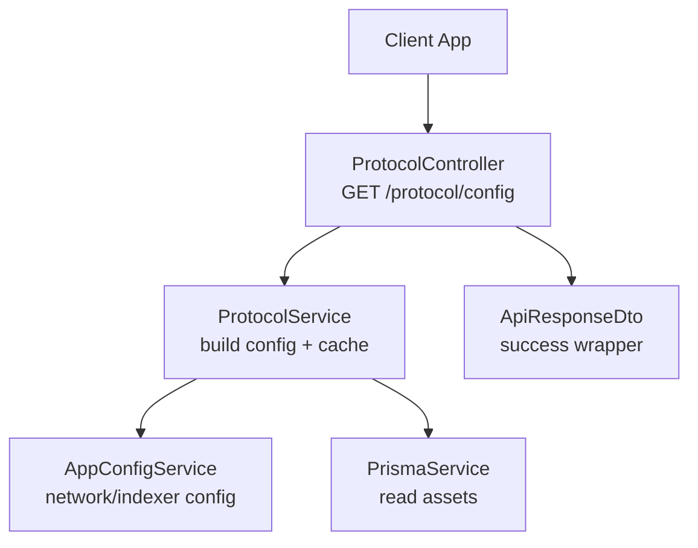
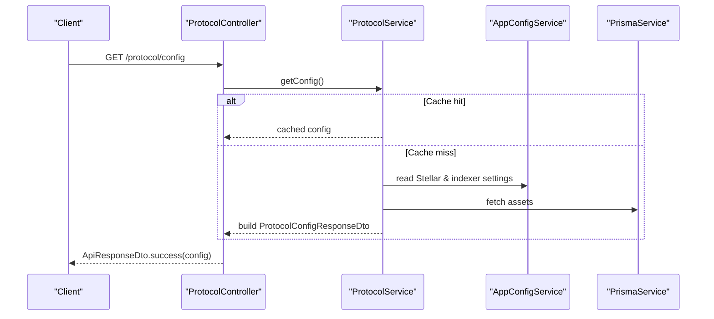
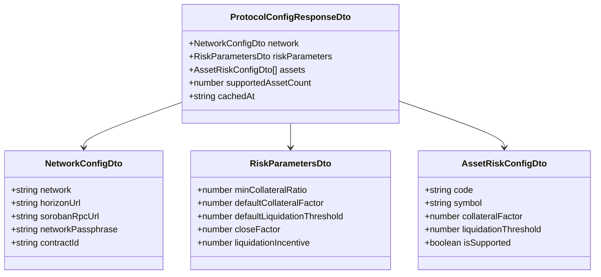
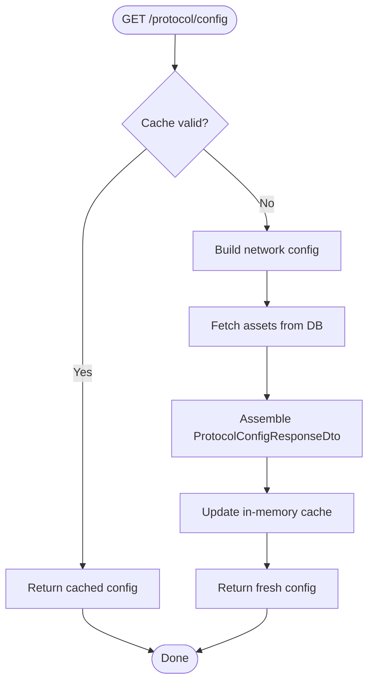
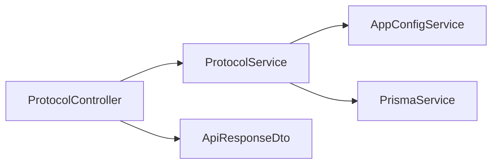
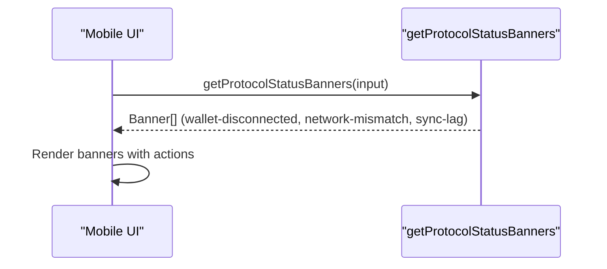
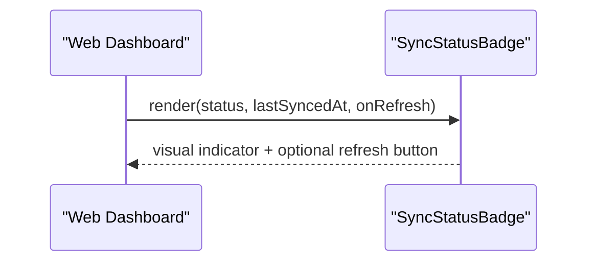

# Protocol Configuration API

<cite>
**Referenced Files in This Document**
- [protocol.controller.ts](file://veilend-backend/src/protocol/protocol.controller.ts)
- [protocol.service.ts](file://veilend-backend/src/protocol/protocol.service.ts)
- [protocol-config-response.dto.ts](file://veilend-backend/src/protocol/dto/protocol-config-response.dto.ts)
- [api-response.dto.ts](file://veilend-backend/src/common/dto/api-response.dto.ts)
- [app-config.service.ts](file://veilend-backend/src/config/app-config.service.ts)
- [assets.controller.ts](file://veilend-backend/src/assets/assets.controller.ts)
- [admin.controller.ts](file://veilend-backend/src/admin/admin.controller.ts)
- [all-exceptions.filter.ts](file://veilend-backend/src/common/logging/all-exceptions.filter.ts)
- [ProtocolStatusBanners.tsx](file://veilend-mobile/src/components/ProtocolStatusBanners.tsx)
- [protocolStatus.ts](file://veilend-mobile/src/utils/protocolStatus.ts)
- [SyncStatusBadge.tsx](file://veilend-web/src/components/SyncStatusBadge.tsx)
</cite>

## Table of Contents
1. [Introduction](#introduction)
2. [Project Structure](#project-structure)
3. [Core Components](#core-components)
4. [Architecture Overview](#architecture-overview)
5. [Detailed Component Analysis](#detailed-component-analysis)
6. [Dependency Analysis](#dependency-analysis)
7. [Performance Considerations](#performance-considerations)
8. [Troubleshooting Guide](#troubleshooting-guide)
9. [Conclusion](#conclusion)
10. [Appendices](#appendices)

## Introduction
This document describes the Protocol Configuration API that exposes real-time protocol state and configuration for monitoring and dashboards. It focuses on retrieving network settings, risk parameters (including collateral ratios), per-asset configuration, supported asset counts, and cache metadata. It also includes error handling behavior and integration examples for frontend dashboards to display protocol health information.

The primary endpoint is:
- GET /protocol/config

It returns a standardized response envelope with protocol configuration data suitable for caching and dashboard consumption.

## Project Structure
The protocol configuration feature is implemented as a NestJS module with a controller, service, DTOs, and shared infrastructure for responses and configuration.

**Diagram sources**
- [protocol.controller.ts:9-30](file://veilend-backend/src/protocol/protocol.controller.ts#L9-L30)
- [protocol.service.ts:52-79](file://veilend-backend/src/protocol/protocol.service.ts#L52-L79)
- [app-config.service.ts:12-54](file://veilend-backend/src/config/app-config.service.ts#L12-L54)
- [api-response.dto.ts:1-38](file://veilend-backend/src/common/dto/api-response.dto.ts#L1-L38)

**Section sources**
- [protocol.controller.ts:9-30](file://veilend-backend/src/protocol/protocol.controller.ts#L9-L30)
- [protocol.service.ts:52-79](file://veilend-backend/src/protocol/protocol.service.ts#L52-L79)
- [protocol-config-response.dto.ts:66-82](file://veilend-backend/src/protocol/dto/protocol-config-response.dto.ts#L66-L82)
- [api-response.dto.ts:1-38](file://veilend-backend/src/common/dto/api-response.dto.ts#L1-L38)
- [app-config.service.ts:12-54](file://veilend-backend/src/config/app-config.service.ts#L12-L54)

## Core Components
- ProtocolController: Exposes GET /protocol/config with public access and Cache-Control headers for efficient caching.
- ProtocolService: Builds the protocol configuration by combining network settings, default risk parameters, and per-asset risk configuration from the database. Includes an in-memory cache with TTL.
- DTOs: Define the response schema for network configuration, risk parameters, per-asset risk configuration, and the full protocol configuration payload.
- ApiResponseDto: Standardized success/error envelope used across endpoints.

Key responsibilities:
- Provide a single source of truth for protocol configuration.
- Reduce backend load via short-lived in-memory caching.
- Return consistent, typed payloads for frontend dashboards.

**Section sources**
- [protocol.controller.ts:9-30](file://veilend-backend/src/protocol/protocol.controller.ts#L9-L30)
- [protocol.service.ts:12-79](file://veilend-backend/src/protocol/protocol.service.ts#L12-L79)
- [protocol-config-response.dto.ts:6-82](file://veilend-backend/src/protocol/dto/protocol-config-response.dto.ts#L6-L82)
- [api-response.dto.ts:1-38](file://veilend-backend/src/common/dto/api-response.dto.ts#L1-L38)

## Architecture Overview
The request flow for protocol configuration:

**Diagram sources**
- [protocol.controller.ts:23-30](file://veilend-backend/src/protocol/protocol.controller.ts#L23-L30)
- [protocol.service.ts:52-79](file://veilend-backend/src/protocol/protocol.service.ts#L52-L79)
- [app-config.service.ts:12-54](file://veilend-backend/src/config/app-config.service.ts#L12-L54)

## Detailed Component Analysis

### Endpoint: GET /protocol/config
- Purpose: Retrieve full protocol configuration including network settings, risk parameters, per-asset risk configuration, supported asset count, and cache timestamp.
- Authentication: Not required.
- Caching: Response includes Cache-Control header; service caches results for a short TTL to reduce load.

Request
- Method: GET
- Path: /protocol/config
- Headers: None required

Response
- Status code: 200
- Body: ApiResponseDto<ProtocolConfigResponseDto>

Response fields (ProtocolConfigResponseDto):
- network: NetworkConfigDto
  - network: string
  - horizonUrl: string
  - sorobanRpcUrl: string
  - networkPassphrase: string
  - contractId: string
- riskParameters: RiskParametersDto
  - minCollateralRatio: number
  - defaultCollateralFactor: number
  - defaultLiquidationThreshold: number
  - closeFactor: number
  - liquidationIncentive: number
- assets: AssetRiskConfigDto[]
  - code: string
  - symbol: string
  - collateralFactor: number
  - liquidationThreshold: number
  - isSupported: boolean
- supportedAssetCount: number
- cachedAt: string (ISO timestamp)

Error handling
- Unhandled exceptions are wrapped into ApiResponseDto.fail with a correlation ID in meta.
- Typical HTTP status codes:
  - 200: Success
  - 4xx/5xx: Errors mapped by global exception filter

Caching
- Response header: Cache-Control: public, max-age=120
- Service-level cache TTL: 120 seconds

Integration notes
- Use the response to populate dashboard panels showing network endpoints, contract ID, risk thresholds, and per-asset factors.
- Respect Cache-Control to avoid excessive polling.

**Section sources**
- [protocol.controller.ts:23-30](file://veilend-backend/src/protocol/protocol.controller.ts#L23-L30)
- [protocol.service.ts:52-79](file://veilend-backend/src/protocol/protocol.service.ts#L52-L79)
- [protocol-config-response.dto.ts:66-82](file://veilend-backend/src/protocol/dto/protocol-config-response.dto.ts#L66-L82)
- [api-response.dto.ts:1-38](file://veilend-backend/src/common/dto/api-response.dto.ts#L1-L38)
- [all-exceptions.filter.ts:20-55](file://veilend-backend/src/common/logging/all-exceptions.filter.ts#L20-L55)

### Data Model Diagram

**Diagram sources**
- [protocol-config-response.dto.ts:6-82](file://veilend-backend/src/protocol/dto/protocol-config-response.dto.ts#L6-L82)

### Request Flow Diagram

**Diagram sources**
- [protocol.service.ts:52-79](file://veilend-backend/src/protocol/protocol.service.ts#L52-L79)

## Dependency Analysis
- ProtocolController depends on ProtocolService and uses ApiResponseDto for consistent responses.
- ProtocolService depends on:
  - AppConfigService for Stellar network and indexer settings.
  - PrismaService to read assets and compute per-asset risk configuration.
- Global exception filter ensures all errors are returned in a uniform shape with correlation IDs.

**Diagram sources**
- [protocol.controller.ts:9-30](file://veilend-backend/src/protocol/protocol.controller.ts#L9-L30)
- [protocol.service.ts:52-79](file://veilend-backend/src/protocol/protocol.service.ts#L52-L79)
- [app-config.service.ts:12-54](file://veilend-backend/src/config/app-config.service.ts#L12-L54)
- [api-response.dto.ts:1-38](file://veilend-backend/src/common/dto/api-response.dto.ts#L1-L38)

**Section sources**
- [protocol.controller.ts:9-30](file://veilend-backend/src/protocol/protocol.controller.ts#L9-L30)
- [protocol.service.ts:52-79](file://veilend-backend/src/protocol/protocol.service.ts#L52-L79)
- [all-exceptions.filter.ts:20-55](file://veilend-backend/src/common/logging/all-exceptions.filter.ts#L20-L55)

## Performance Considerations
- In-memory cache with 120-second TTL reduces repeated database reads and external config lookups.
- HTTP-level caching via Cache-Control allows browsers/CDNs to reuse responses.
- Assets are ordered by support status and code to ensure stable lists for UI rendering.
- Keep polling intervals aligned with cache TTL to avoid unnecessary requests.

[No sources needed since this section provides general guidance]

## Troubleshooting Guide
Common issues and how to handle them:
- Stale or missing protocol data:
  - Verify Cache-Control usage and ensure clients respect it.
  - If admin changes occur, consider invalidating the service cache when appropriate.
- Unexpected errors:
  - All unhandled exceptions are normalized into ApiResponseDto.fail with a correlation ID in meta for tracing.
- Network configuration mismatches:
  - Confirm expected network vs current network in client logic to surface warnings.

Operational tips:
- Monitor logs for cache misses and DB queries during high traffic.
- Use correlation IDs from error responses to trace failures across services.

**Section sources**
- [protocol.service.ts:84-87](file://veilend-backend/src/protocol/protocol.service.ts#L84-L87)
- [all-exceptions.filter.ts:20-55](file://veilend-backend/src/common/logging/all-exceptions.filter.ts#L20-L55)

## Conclusion
The Protocol Configuration API provides a reliable, cached, and well-structured view of protocol configuration and risk parameters. Frontend dashboards can use this endpoint to display network details, collateral ratios, per-asset factors, and overall supported asset counts. The standardized response envelope and global error handling simplify integration and debugging.

[No sources needed since this section summarizes without analyzing specific files]

## Appendices

### Related Endpoints for Monitoring and Administration
- Assets listing and filtering:
  - GET /assets?supported=true
  - GET /assets/:id
- Admin operations (protected):
  - Configure assets, set oracle prices, adjust minimum collateral ratio.

These endpoints complement the protocol configuration by providing asset catalogs and administrative controls that influence protocol state.

**Section sources**
- [assets.controller.ts:20-56](file://veilend-backend/src/assets/assets.controller.ts#L20-L56)
- [admin.controller.ts:20-55](file://veilend-backend/src/admin/admin.controller.ts#L20-L55)

### Frontend Integration Examples

#### Mobile: Displaying Protocol Health Banners
- Use banner logic to detect wallet disconnection, network mismatch, and sync lag.
- Render banners with severity levels and actionable buttons to reconnect or retry sync.

**Diagram sources**
- [ProtocolStatusBanners.tsx:25-69](file://veilend-mobile/src/components/ProtocolStatusBanners.tsx#L25-L69)
- [protocolStatus.ts:29-71](file://veilend-mobile/src/utils/protocolStatus.ts#L29-L71)

**Section sources**
- [ProtocolStatusBanners.tsx:25-69](file://veilend-mobile/src/components/ProtocolStatusBanners.tsx#L25-L69)
- [protocolStatus.ts:29-71](file://veilend-mobile/src/utils/protocolStatus.ts#L29-L71)

#### Web: Sync Status Badge
- Show live/stale/idle/offline states with relative timestamps and refresh actions.
- Helps users understand whether displayed numbers are up-to-date.

**Diagram sources**
- [SyncStatusBadge.tsx:18-53](file://veilend-web/src/components/SyncStatusBadge.tsx#L18-L53)

**Section sources**
- [SyncStatusBadge.tsx:18-53](file://veilend-web/src/components/SyncStatusBadge.tsx#L18-L53)

### Example Requests and Responses

- Request
  - GET /protocol/config
  - Headers: Accept: application/json

- Success Response
  - Status: 200
  - Body: ApiResponseDto<ProtocolConfigResponseDto>
  - Fields: network, riskParameters, assets[], supportedAssetCount, cachedAt

- Error Response
  - Status: 4xx/5xx
  - Body: ApiResponseDto.fail with code, message, details, and correlationId in meta

[No sources needed since this section provides general guidance]