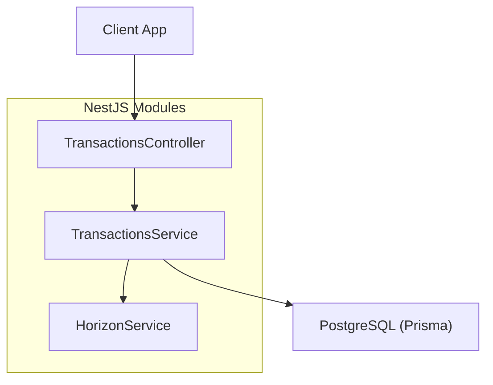
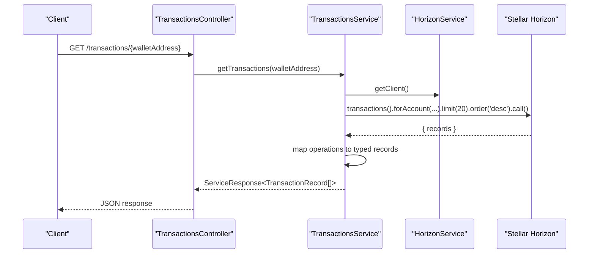
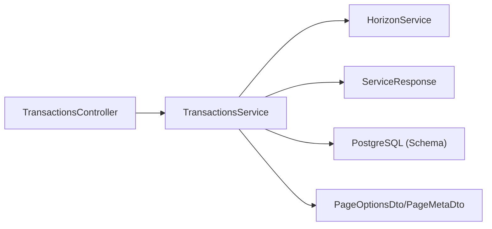
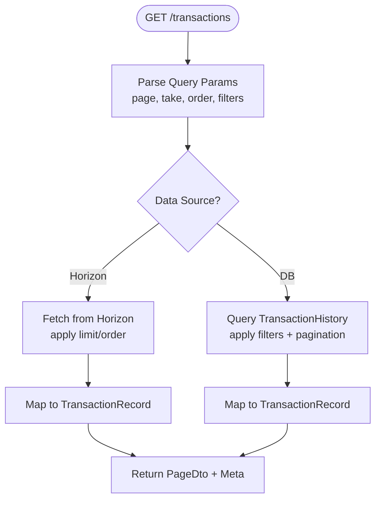

# Transaction API

<cite>
**Referenced Files in This Document**
- [transactions.controller.ts](file://veilend-backend/src/transactions/transactions.controller.ts)
- [transactions.service.ts](file://veilend-backend/src/transactions/transactions.service.ts)
- [horizon.service.ts](file://veilend-backend/src/stellar/horizon.service.ts)
- [types.ts](file://veilend-backend/src/stellar/types.ts)
- [page-options.dto.ts](file://veilend-backend/src/common/dto/page-options.dto.ts)
- [page-meta.dto.ts](file://veilend-backend/src/common/dto/page-meta.dto.ts)
- [api-response.dto.ts](file://veilend-backend/src/common/dto/api-response.dto.ts)
- [schema.prisma](file://veilend-backend/prisma/schema.prisma)
- [indexer.repository.ts](file://veilend-backend/src/indexer/indexer.repository.ts)
</cite>

## Table of Contents
1. Introduction
2. Project Structure
3. Core Components
4. Architecture Overview
5. Detailed Component Analysis
6. Dependency Analysis
7. Performance Considerations
8. Troubleshooting Guide
9. Conclusion
10. Appendices

## Introduction
This document provides API documentation for transaction endpoints that support querying transaction history with filtering by user address, asset type, transaction type, and date ranges. It also covers pagination, sorting, response formatting, and integration patterns for dashboards. The backend currently exposes a basic transactions endpoint and includes shared pagination DTOs and a database schema for transaction history. An indexer is present to persist Soroban events into the database, which can be leveraged for advanced filtering and pagination.

## Project Structure
The transaction feature spans several modules:
- Controller layer exposing HTTP endpoints
- Service layer handling business logic and external calls (Stellar Horizon)
- Shared DTOs for pagination and standardized responses
- Database schema defining transaction records and related entities
- Indexer repository for reading/writing indexed transactions

**Diagram sources**
- [transactions.controller.ts:5-14](file://veilend-backend/src/transactions/transactions.controller.ts#L5-L14)
- [transactions.service.ts:15-83](file://veilend-backend/src/transactions/transactions.service.ts#L15-L83)
- [horizon.service.ts:8-44](file://veilend-backend/src/stellar/horizon.service.ts#L8-L44)

**Section sources**
- [transactions.controller.ts:1-16](file://veilend-backend/src/transactions/transactions.controller.ts#L1-L16)
- [transactions.service.ts:1-85](file://veilend-backend/src/transactions/transactions.service.ts#L1-L85)
- [horizon.service.ts:1-115](file://veilend-backend/src/stellar/horizon.service.ts#L1-L115)

## Core Components
- TransactionsController: Exposes GET /transactions/:walletAddress to retrieve recent transactions for a wallet.
- TransactionsService: Queries Stellar Horizon for account transactions, maps operations to typed records, and returns a standardized service response.
- HorizonService: Manages the Horizon client and connection health.
- Pagination DTOs: PageOptionsDto and PageMetaDto define standard pagination parameters and metadata.
- Response DTOs: ApiResponseDto and ServiceResponse provide consistent success/error envelopes.
- Database Schema: TransactionHistory model defines fields for type, status, amounts, timestamps, and blockchain references.

Key responsibilities:
- Fetching raw transactions from Stellar Horizon
- Mapping operations to protocol-specific types
- Returning structured data with status and identifiers
- Supporting future pagination and filtering via shared DTOs

**Section sources**
- [transactions.controller.ts:5-14](file://veilend-backend/src/transactions/transactions.controller.ts#L5-L14)
- [transactions.service.ts:5-83](file://veilend-backend/src/transactions/transactions.service.ts#L5-L83)
- [horizon.service.ts:8-44](file://veilend-backend/src/stellar/horizon.service.ts#L8-L44)
- [page-options.dto.ts:1-31](file://veilend-backend/src/common/dto/page-options.dto.ts#L1-L31)
- [page-meta.dto.ts:1-25](file://veilend-backend/src/common/dto/page-meta.dto.ts#L1-L25)
- [api-response.dto.ts:1-38](file://veilend-backend/src/common/dto/api-response.dto.ts#L1-L38)
- [schema.prisma:107-154](file://veilend-backend/prisma/schema.prisma#L107-L154)

## Architecture Overview
The current flow retrieves transactions directly from Stellar Horizon and transforms them into application-level records. A future enhancement path uses the indexer to read from PostgreSQL for richer filtering and pagination.

**Diagram sources**
- [transactions.controller.ts:9-14](file://veilend-backend/src/transactions/transactions.controller.ts#L9-L14)
- [transactions.service.ts:21-71](file://veilend-backend/src/transactions/transactions.service.ts#L21-L71)
- [horizon.service.ts:35-44](file://veilend-backend/src/stellar/horizon.service.ts#L35-L44)

## Detailed Component Analysis

### Endpoint: Get Transactions by Wallet Address
- Method: GET
- Path: /transactions/{walletAddress}
- Path Parameters:
  - walletAddress: string (required) — Stellar wallet address
- Query Parameters: Not implemented in the controller; can be added using PageOptionsDto for pagination and filters.
- Success Response:
  - Envelope: ServiceResponse<TransactionRecord[]>
  - Data: Array of TransactionRecord objects
  - Fields per record:
    - id: string
    - type: 'deposit' | 'withdraw' | 'borrow' | 'repay' | 'transfer'
    - amount: number
    - asset: string
    - timestamp: string (ISO datetime)
    - status: string ('success' | 'failed')
    - txHash: string
- Error Response:
  - Envelope: ServiceResponse with success=false and error object containing message, code, and optional rawError

Example request:
- GET /transactions/GABC...XYZ

Example success response shape:
- { success: true, data: [ { id, type, amount, asset, timestamp, status, txHash }, ... ] }

Example error response shape:
- { success: false, error: { message, code, rawError } }

Notes:
- Current implementation fetches up to 20 records ordered by newest first.
- Type inference is based on the first operation in each transaction.

**Section sources**
- [transactions.controller.ts:5-14](file://veilend-backend/src/transactions/transactions.controller.ts#L5-L14)
- [transactions.service.ts:21-83](file://veilend-backend/src/transactions/transactions.service.ts#L21-L83)
- [types.ts:1-10](file://veilend-backend/src/stellar/types.ts#L1-L10)

### Pagination and Sorting Support
- PageOptionsDto defines:
  - order: ASC | DESC
  - page: integer >= 1
  - take: integer between 1 and 50
  - skip: computed as (page - 1) * take
- PageMetaDto provides:
  - page, take, itemCount, pageCount, hasPreviousPage, hasNextPage

Integration approach:
- Add query parameters to the transactions endpoint using PageOptionsDto
- Apply orderBy and limit/skip when querying either Horizon or the database
- Return PageDto<TransactionRecord> with meta built from PageMetaDto

Example query parameters:
- ?page=1&take=20&order=DESC

**Section sources**
- [page-options.dto.ts:1-31](file://veilend-backend/src/common/dto/page-options.dto.ts#L1-L31)
- [page-meta.dto.ts:1-25](file://veilend-backend/src/common/dto/page-meta.dto.ts#L1-L25)

### Filtering Capabilities
Current state:
- The controller does not implement filtering by asset type, transaction type, or date ranges.

Recommended enhancements:
- Add query parameters:
  - asset: string (e.g., XLM, USDC)
  - type: one of deposit|withdraw|borrow|repay|transfer
  - startDate: ISO datetime
  - endDate: ISO datetime
- If querying Horizon:
  - Use Horizon’s native filters where available (e.g., ledger range, time-based queries)
- If querying PostgreSQL (via indexer):
  - Filter TransactionHistory by userId, assetId, type, createdAt range
  - Leverage existing indexes on userId, assetId, createdAt, txHash, ledgerSequence

Database-backed filtering example fields:
- TransactionHistory.type, TransactionHistory.status, TransactionHistory.amountRaw, TransactionHistory.createdAt, TransactionHistory.txHash, TransactionHistory.ledgerSequence

**Section sources**
- [schema.prisma:107-154](file://veilend-backend/prisma/schema.prisma#L107-L154)
- [indexer.repository.ts:112-128](file://veilend-backend/src/indexer/indexer.repository.ts#L112-L128)

### Response Formatting and Standards
- ServiceResponse<T>:
  - success: boolean
  - data?: T
  - error?: { message, code?, rawError? }
- ApiResponseDto<T>:
  - success: boolean
  - data?: T
  - error?: { code, message, details? }
  - meta?: unknown

Use these envelopes consistently across endpoints to simplify client error handling and metadata inclusion.

**Section sources**
- [types.ts:1-10](file://veilend-backend/src/stellar/types.ts#L1-L10)
- [api-response.dto.ts:1-38](file://veilend-backend/src/common/dto/api-response.dto.ts#L1-L38)

### Integration Patterns for Dashboards
Common use cases:
- Display recent activity: call the endpoint with default pagination and render the latest entries
- Paginated history: pass page and take to load more rows as users scroll
- Filtered views: add asset, type, and date range filters to narrow results
- Real-time updates: poll periodically or use WebSocket if supported later

Suggested dashboard flow:
- Load initial page with take=20, order=DESC
- On “Load More”, increment page and append results
- When filters change, reset to page=1 and refetch
- Show loading skeletons while fetching and handle errors gracefully

[No sources needed since this section provides general guidance]

## Dependency Analysis
High-level dependencies:
- TransactionsController depends on TransactionsService
- TransactionsService depends on HorizonService and Stellar Horizon network
- Shared DTOs are used for pagination and response shaping
- Database schema supports future indexer-backed queries

**Diagram sources**
- [transactions.controller.ts:5-14](file://veilend-backend/src/transactions/transactions.controller.ts#L5-L14)
- [transactions.service.ts:15-83](file://veilend-backend/src/transactions/transactions.service.ts#L15-L83)
- [horizon.service.ts:8-44](file://veilend-backend/src/stellar/horizon.service.ts#L8-L44)
- [page-options.dto.ts:1-31](file://veilend-backend/src/common/dto/page-options.dto.ts#L1-L31)
- [page-meta.dto.ts:1-25](file://veilend-backend/src/common/dto/page-meta.dto.ts#L1-L25)
- [schema.prisma:107-154](file://veilend-backend/prisma/schema.prisma#L107-L154)

**Section sources**
- [transactions.controller.ts:1-16](file://veilend-backend/src/transactions/transactions.controller.ts#L1-L16)
- [transactions.service.ts:1-85](file://veilend-backend/src/transactions/transactions.service.ts#L1-L85)
- [horizon.service.ts:1-115](file://veilend-backend/src/stellar/horizon.service.ts#L1-L115)
- [page-options.dto.ts:1-31](file://veilend-backend/src/common/dto/page-options.dto.ts#L1-L31)
- [page-meta.dto.ts:1-25](file://veilend-backend/src/common/dto/page-meta.dto.ts#L1-L25)
- [schema.prisma:107-154](file://veilend-backend/prisma/schema.prisma#L107-L154)

## Performance Considerations
- Horizon requests are limited to 20 records by default; increase take as needed but balance with latency
- Prefer database-backed queries for large datasets and complex filters once indexer is integrated
- Use pagination to avoid heavy payloads
- Cache frequently accessed assets and metadata at the edge or in-memory cache if appropriate
- Monitor Horizon availability and implement retries/backoff for robustness

[No sources needed since this section provides general guidance]

## Troubleshooting Guide
Common issues:
- Horizon client not initialized: ensure Horizon URL is configured and client is ready before calling
- Network errors: handle transient failures with retries and user-friendly messages
- Invalid wallet address: validate input and return clear error messages
- Empty results: confirm filters and pagination parameters; verify indexing status if using database

Error envelope:
- success: false
- error.message: descriptive message
- error.code: e.g., TRANSACTIONS_FETCH_ERROR
- error.rawError: underlying error object (useful for logging)

**Section sources**
- [transactions.service.ts:72-83](file://veilend-backend/src/transactions/transactions.service.ts#L72-L83)
- [horizon.service.ts:17-44](file://veilend-backend/src/stellar/horizon.service.ts#L17-L44)

## Conclusion
The current transactions endpoint provides a simple way to fetch recent transactions for a wallet from Stellar Horizon. To support advanced filtering, pagination, and performance at scale, extend the endpoint with query parameters and consider leveraging the indexer and database for rich queries. Standardized response envelopes and pagination DTOs are already in place to streamline development.

[No sources needed since this section summarizes without analyzing specific files]

## Appendices

### A. Request and Response Examples
- Request:
  - GET /transactions/GABC...XYZ?page=1&take=20&order=DESC
- Success Response:
  - { success: true, data: [ { id, type, amount, asset, timestamp, status, txHash }, ... ], meta: { page, take, itemCount, pageCount, hasPreviousPage, hasNextPage } }
- Error Response:
  - { success: false, error: { message, code, rawError } }

[No sources needed since this section provides general examples]

### B. Data Model Reference
Transaction-related fields stored in the database include:
- TransactionHistory:
  - type: DEPOSIT | WITHDRAW | BORROW | REPAY | LIQUIDATION
  - status: PENDING | CONFIRMED | FAILED
  - amountRaw: BigInt
  - amountUsd: Decimal
  - txHash: String (unique)
  - ledgerSequence: Int
  - operationId: String?
  - contractId: String?
  - sorobanEventId: String (unique)
  - memo: String?
  - createdAt: DateTime
  - confirmedAt: DateTime?

These fields enable precise filtering and sorting for dashboard displays.

**Section sources**
- [schema.prisma:107-154](file://veilend-backend/prisma/schema.prisma#L107-L154)

### C. Indexer-backed Query Flow (Future Enhancement)
When using the indexer:
- Fetch transactions from PostgreSQL filtered by user, asset, type, and date range
- Apply pagination using PageOptionsDto and return PageDto with PageMetaDto
- Map database records to API response models

**Diagram sources**
- [page-options.dto.ts:1-31](file://veilend-backend/src/common/dto/page-options.dto.ts#L1-L31)
- [page-meta.dto.ts:1-25](file://veilend-backend/src/common/dto/page-meta.dto.ts#L1-L25)
- [indexer.repository.ts:112-128](file://veilend-backend/src/indexer/indexer.repository.ts#L112-L128)