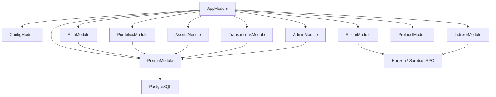
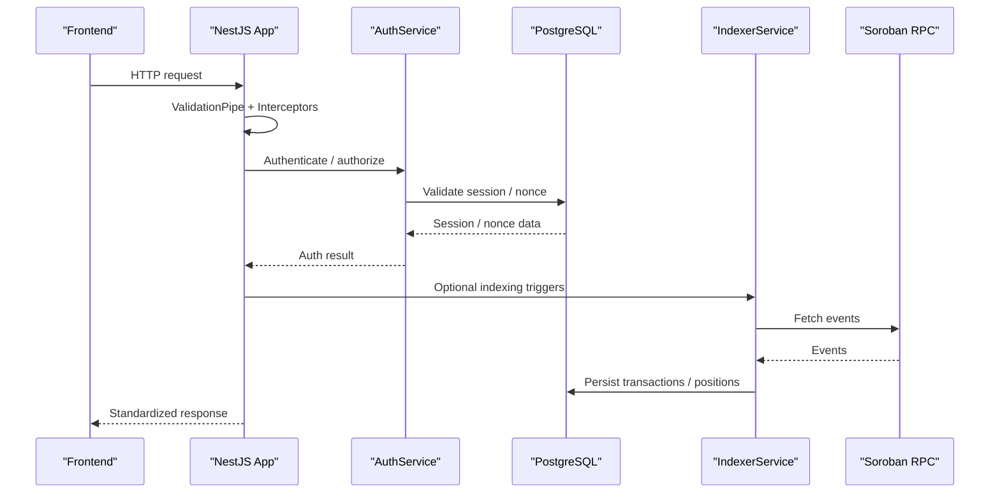
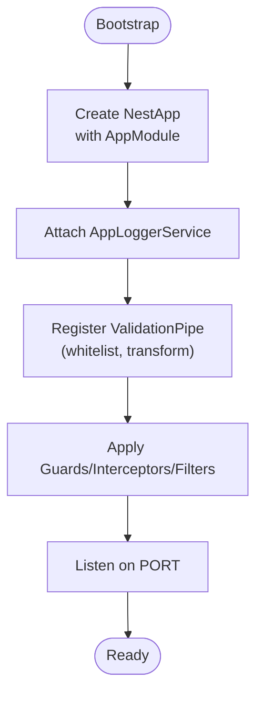
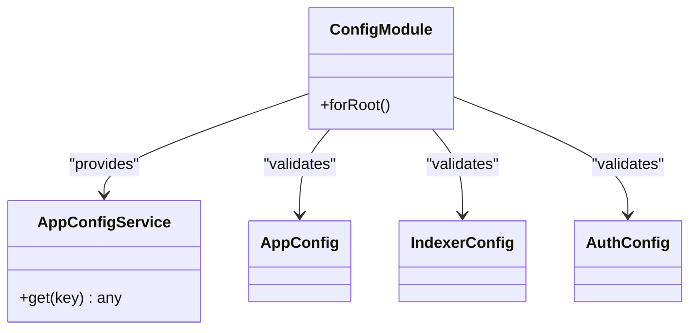
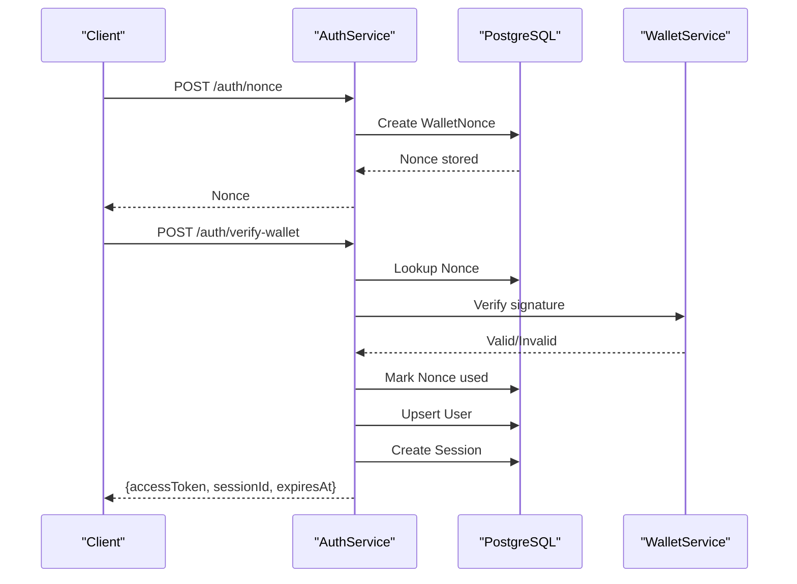
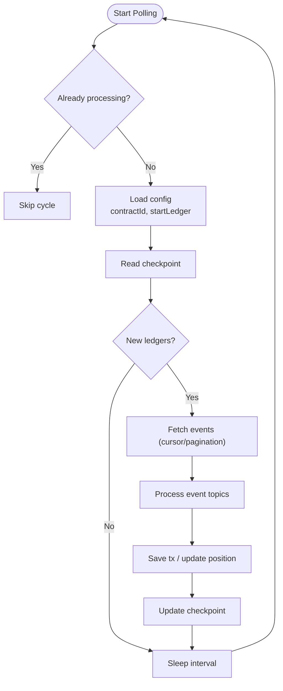
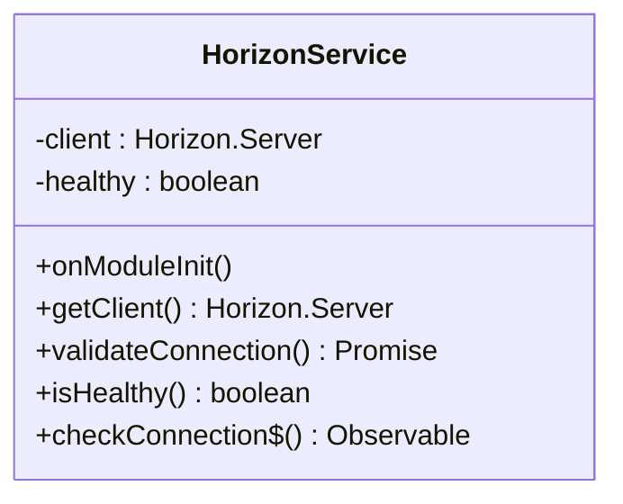
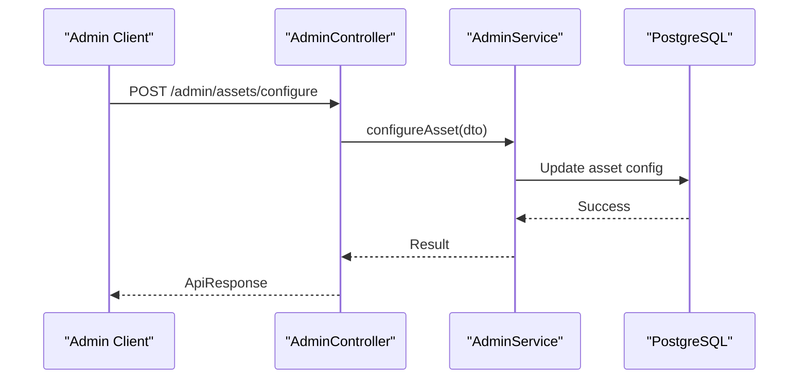
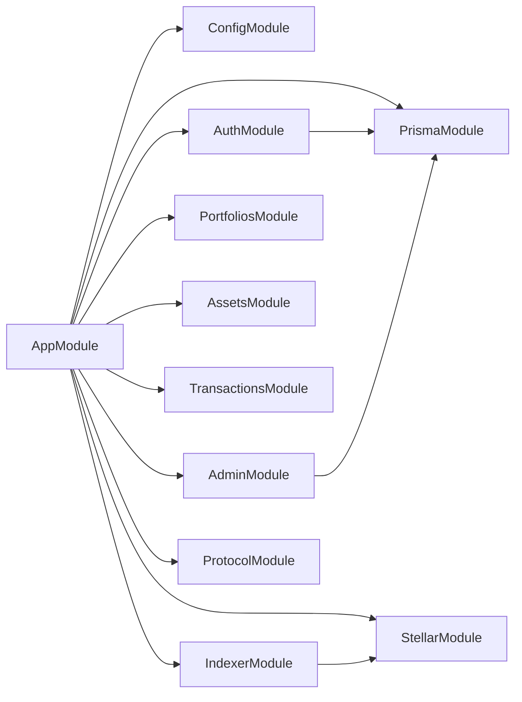
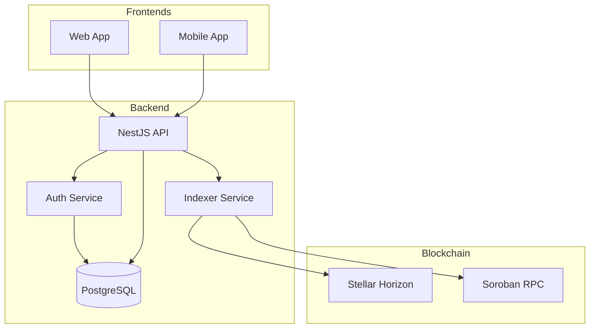

# Architecture Overview

<cite>
**Referenced Files in This Document**
- [main.ts](file://veilend-backend/src/main.ts)
- [app.module.ts](file://veilend-backend/src/app.module.ts)
- [package.json](file://veilend-backend/package.json)
- [README.md](file://veilend-backend/README.md)
- [schema.prisma](file://veilend-backend/prisma/schema.prisma)
- [indexer.service.ts](file://veilend-backend/src/indexer/indexer.service.ts)
- [horizon.service.ts](file://veilend-backend/src/stellar/horizon.service.ts)
- [auth.service.ts](file://veilend-backend/src/auth/auth.service.ts)
- [admin.controller.ts](file://veilend-backend/src/admin/admin.controller.ts)
- [config.module.ts](file://veilend-backend/src/config/config.module.ts)
- [prisma.service.ts](file://veilend-backend/src/prisma/prisma.service.ts)
- [app-logger.service.ts](file://veilend-backend/src/common/logging/app-logger.service.ts)
- [docker-compose.yml](file://veilend-backend/docker-compose.yml)
- [Dockerfile](file://veilend-backend/Dockerfile)
</cite>

## Table of Contents
1. Introduction
2. Project Structure
3. Core Components
4. Architecture Overview
5. Detailed Component Analysis
6. Dependency Analysis
7. Performance Considerations
8. Troubleshooting Guide
9. Conclusion

## Introduction
This document describes the VeilLend backend API architecture built with NestJS. It explains module structure, dependency injection, service organization, bootstrap process, global middleware and validation pipeline, and how controllers, services, and the database layer interact. It also covers infrastructure requirements, technology stack decisions, deployment considerations, and system context diagrams showing integration with the blockchain indexer (Stellar/Soroban), PostgreSQL, and frontend applications.

## Project Structure
The backend is organized into domain-driven modules:
- Authentication and session management
- Indexing of on-chain events from Stellar/Soroban
- Portfolio, asset, transaction, protocol, and admin features
- Shared configuration, logging, interceptors, and guards
- Database access via Prisma and PostgreSQL



**Diagram sources**
- [app.module.ts:28-60](file://veilend-backend/src/app.module.ts#L28-L60)
- [schema.prisma:5-8](file://veilend-backend/prisma/schema.prisma#L5-L8)
- [horizon.service.ts:17-33](file://veilend-backend/src/stellar/horizon.service.ts#L17-L33)

**Section sources**
- [README.md:11-34](file://veilend-backend/README.md#L11-L34)
- [app.module.ts:28-60](file://veilend-backend/src/app.module.ts#L28-L60)

## Core Components
- Bootstrap and global setup: ValidationPipe, custom logger, correlation ID via CLS, throttling guard, exception filter, and response transform interceptor are registered globally at application start.
- Configuration: Centralized config module validates environment variables for app, indexer, and auth settings; exposes a typed AppConfigService.
- Database: Prisma client is provided as a singleton service that connects/disconnects with lifecycle hooks.
- Blockchain integrations: Horizon service manages connection to Stellar Horizon; Soroban RPC service (used by indexer) queries contract events.
- Domain modules: Auth, Indexer, Portfolios, Assets, Transactions, Admin, Protocol each encapsulate controllers, services, and DTOs.

Key responsibilities:
- App bootstrap wires global pipes, interceptors, guards, filters, and starts listening on configured port.
- ConfigModule validates and merges configuration, redacting secrets in logs.
- PrismaService provides type-safe DB access across modules.
- IndexerService polls Soroban events, persists transactions and positions, and updates checkpoints.
- AuthService implements wallet-based authentication with nonce challenges, JWT issuance, and session management.
- AdminController exposes protected endpoints for protocol configuration and risk parameters.

**Section sources**
- [main.ts:7-21](file://veilend-backend/src/main.ts#L7-L21)
- [config.module.ts:12-39](file://veilend-backend/src/config/config.module.ts#L12-L39)
- [prisma.service.ts:4-16](file://veilend-backend/src/prisma/prisma.service.ts#L4-L16)
- [horizon.service.ts:17-33](file://veilend-backend/src/stellar/horizon.service.ts#L17-L33)
- [indexer.service.ts:16-31](file://veilend-backend/src/indexer/indexer.service.ts#L16-L31)
- [auth.service.ts:19-27](file://veilend-backend/src/auth/auth.service.ts#L19-L27)
- [admin.controller.ts:20-55](file://veilend-backend/src/admin/admin.controller.ts#L20-L55)

## Architecture Overview
High-level runtime flow:
- NestJS bootstraps AppModule, registers global middleware and pipes, sets up CLS for correlation IDs, and applies throttling.
- Modules import shared services (Config, Prisma, Stellar, Indexer).
- Controllers receive requests, validate inputs via DTOs, delegate to services, and return standardized responses.
- Services coordinate business logic, call Prisma for persistence, and integrate with Stellar/Soroban where needed.
- The Indexer runs background polling to sync on-chain state into PostgreSQL.



**Diagram sources**
- [main.ts:7-21](file://veilend-backend/src/main.ts#L7-L21)
- [app.module.ts:28-81](file://veilend-backend/src/app.module.ts#L28-L81)
- [auth.service.ts:36-149](file://veilend-backend/src/auth/auth.service.ts#L36-L149)
- [indexer.service.ts:28-105](file://veilend-backend/src/indexer/indexer.service.ts#L28-L105)
- [schema.prisma:12-197](file://veilend-backend/prisma/schema.prisma#L12-L197)

## Detailed Component Analysis

### Application Bootstrap and Global Middleware
- Creates Nest application with buffered logs and attaches a custom logger that includes correlation IDs.
- Registers a global ValidationPipe with whitelist mode and transformation enabled.
- Applies global guards (ThrottlerGuard), interceptors (LoggingInterceptor, TransformInterceptor), and an exception filter (AllExceptionsFilter).
- Starts the server on a configurable port.



**Diagram sources**
- [main.ts:7-21](file://veilend-backend/src/main.ts#L7-L21)
- [app.module.ts:61-81](file://veilend-backend/src/app.module.ts#L61-L81)

**Section sources**
- [main.ts:7-21](file://veilend-backend/src/main.ts#L7-L21)
- [app.module.ts:28-81](file://veilend-backend/src/app.module.ts#L28-L81)

### Configuration System
- ConfigModule loads and validates environment variables using class-validator schemas for app, indexer, and auth configurations.
- Redacts sensitive values in logs and exports a typed AppConfigService for consumption across modules.



**Diagram sources**
- [config.module.ts:12-39](file://veilend-backend/src/config/config.module.ts#L12-L39)
- [app.config.ts:3-8](file://veilend-backend/src/config/app.config.ts#L3-L8)

**Section sources**
- [config.module.ts:12-39](file://veilend-backend/src/config/config.module.ts#L12-L39)
- [app.config.ts:3-8](file://veilend-backend/src/config/app.config.ts#L3-L8)

### Database Layer (Prisma + PostgreSQL)
- PrismaService extends PrismaClient and connects/disconnects during module lifecycle.
- Schema defines core entities: User, WalletNonce, Session, Asset, Position, TransactionHistory, SyncCheckpoint, Admin, IndexerCheckpoint.
- Relationships enforce referential integrity and support efficient queries via indexes.

```mermaid
erDiagram
USER ||--o{ POSITION : has
USER ||--o{ TRANSACTIONHISTORY : records
USER ||--o{ SESSION : owns
USER ||--o{ SYNCHECKPOINT : tracks
ASSET ||--o{ POSITION : used_in
ASSET ||--o{ TRANSACTIONHISTORY : involved_in
USER ||--o{ ADMIN : can_be
INDEXERCHECKPOINT }||--|| GLOBAL : singleton
```

**Diagram sources**
- [schema.prisma:12-197](file://veilend-backend/prisma/schema.prisma#L12-L197)

**Section sources**
- [prisma.service.ts:4-16](file://veilend-backend/src/prisma/prisma.service.ts#L4-L16)
- [schema.prisma:12-197](file://veilend-backend/prisma/schema.prisma#L12-L197)

### Authentication and Sessions
- Nonce-based challenge-response flow prevents replay attacks and ensures signature validity.
- On successful verification, a JWT is issued and a session record is created with expiration and last-seen tracking.
- Session validation checks existence and expiry; logout revokes sessions idempotently.



**Diagram sources**
- [auth.service.ts:36-149](file://veilend-backend/src/auth/auth.service.ts#L36-L149)

**Section sources**
- [auth.service.ts:36-149](file://veilend-backend/src/auth/auth.service.ts#L36-L149)

### Indexer Service (Blockchain Event Sync)
- Polls Soroban RPC for contract events within a ledger range, paginates via cursor, processes topics, and persists transactions and positions.
- Maintains a global checkpoint to resume after restarts and handles RPC retention safety checks.
- Exposes helpers for querying indexed transactions and positions and supports force replay.



**Diagram sources**
- [indexer.service.ts:28-171](file://veilend-backend/src/indexer/indexer.service.ts#L28-L171)

**Section sources**
- [indexer.service.ts:28-171](file://veilend-backend/src/indexer/indexer.service.ts#L28-L171)

### Stellar Integration
- HorizonService initializes a Horizon client asynchronously, validates connectivity, and exposes health status and error details.
- Used by other components to query Stellar network state safely.



**Diagram sources**
- [horizon.service.ts:8-33](file://veilend-backend/src/stellar/horizon.service.ts#L8-L33)
- [horizon.service.ts:49-78](file://veilend-backend/src/stellar/horizon.service.ts#L49-L78)

**Section sources**
- [horizon.service.ts:8-33](file://veilend-backend/src/stellar/horizon.service.ts#L8-L33)
- [horizon.service.ts:49-78](file://veilend-backend/src/stellar/horizon.service.ts#L49-L78)

### Admin Module
- Protected endpoints for adding/removing admins and configuring assets, oracle prices, and protocol risk parameters.
- Enforces JWT authentication and role-based authorization via guards.



**Diagram sources**
- [admin.controller.ts:20-55](file://veilend-backend/src/admin/admin.controller.ts#L20-L55)

**Section sources**
- [admin.controller.ts:20-55](file://veilend-backend/src/admin/admin.controller.ts#L20-L55)

## Dependency Analysis
Modules and their key dependencies:
- AppModule imports feature modules and global infrastructure (Config, Prisma, Throttler, CLS).
- Feature modules depend on Prisma for persistence and on Stellar services for blockchain interactions.
- Indexer depends on Soroban RPC and writes to PostgreSQL.
- Auth depends on Prisma and JWT utilities.



**Diagram sources**
- [app.module.ts:28-60](file://veilend-backend/src/app.module.ts#L28-L60)

**Section sources**
- [app.module.ts:28-60](file://veilend-backend/src/app.module.ts#L28-L60)

## Performance Considerations
- Request validation and transformation are centralized via ValidationPipe to reduce per-controller overhead.
- Throttling protects endpoints from abuse and reduces load spikes.
- Indexer uses pagination and cursors to efficiently fetch large event sets and avoids reprocessing via idempotent keys.
- PostgreSQL indexes on frequently queried fields (e.g., userId, assetId, ledgerSequence, sorobanEventId) improve read performance.
- Logging is structured JSON with correlation IDs to aid tracing without impacting throughput significantly.

[No sources needed since this section provides general guidance]

## Troubleshooting Guide
Common issues and diagnostics:
- Configuration errors: Misconfigured or missing environment variables will be caught by ConfigModule validation; check logs for validation messages.
- Database connectivity: Ensure DATABASE_URL is correct and Postgres is reachable; PrismaService will connect on startup and disconnect on shutdown.
- Authentication failures: Invalid or expired nonces, signature mismatches, or revoked sessions will result in explicit error responses; verify nonce lifecycle and signature verification.
- Indexer stalls: If RPC retention window shifts, the indexer adjusts its checkpoint; monitor logs for warnings about oldest ledger and ensure contractId is set.
- Health checks: Docker HEALTHCHECK probes the /health endpoint; use it to detect unresponsive instances.

**Section sources**
- [config.module.ts:12-39](file://veilend-backend/src/config/config.module.ts#L12-L39)
- [prisma.service.ts:4-16](file://veilend-backend/src/prisma/prisma.service.ts#L4-L16)
- [auth.service.ts:70-149](file://veilend-backend/src/auth/auth.service.ts#L70-L149)
- [indexer.service.ts:54-105](file://veilend-backend/src/indexer/indexer.service.ts#L54-L105)
- [Dockerfile:62-66](file://veilend-backend/Dockerfile#L62-L66)

## Conclusion
The VeilLend backend follows a modular NestJS architecture with clear separation of concerns: configuration, database, authentication, indexing, and domain features. Global middleware ensures consistent validation, logging, and protection. The indexer reliably synchronizes on-chain state into PostgreSQL, while authenticated APIs expose portfolio, asset, and administrative capabilities. Deployment is containerized with multi-stage builds and orchestrated via Docker Compose, making local development and production rollouts straightforward.

[No sources needed since this section summarizes without analyzing specific files]

## Appendices

### Infrastructure Requirements
- Node.js 20+ and npm
- PostgreSQL 16+ (provided via Docker Compose)
- Optional: Docker and Docker Compose for full-stack local environment

**Section sources**
- [README.md:73-77](file://veilend-backend/README.md#L73-L77)

### Technology Stack Decisions
- NestJS for structured backend with DI and modularity
- Prisma + PostgreSQL for type-safe data access and schema migrations
- Stellar SDK for Horizon and Soroban RPC integration
- Class-validator/class-transformer for robust DTO validation and transformation
- JWT + Passport for token-based auth with database-backed sessions
- CLS for correlation IDs across request scopes
- Throttling for rate limiting

**Section sources**
- [package.json:25-46](file://veilend-backend/package.json#L25-L46)
- [app.module.ts:28-81](file://veilend-backend/src/app.module.ts#L28-L81)
- [schema.prisma:5-8](file://veilend-backend/prisma/schema.prisma#L5-L8)

### Deployment Considerations
- Multi-stage Docker build separates dependencies, compilation, and production runtime.
- Entrypoint script runs migrations before starting the app.
- Environment variables include DATABASE_URL, JWT_SECRET, PORT, and Stellar network endpoints.
- Health checks enable orchestration platforms to detect readiness.

**Section sources**
- [Dockerfile:33-66](file://veilend-backend/Dockerfile#L33-L66)
- [docker-compose.yml:28-48](file://veilend-backend/docker-compose.yml#L28-L48)

### System Context Diagram


**Diagram sources**
- [app.module.ts:28-60](file://veilend-backend/src/app.module.ts#L28-L60)
- [indexer.service.ts:28-105](file://veilend-backend/src/indexer/indexer.service.ts#L28-L105)
- [horizon.service.ts:17-33](file://veilend-backend/src/stellar/horizon.service.ts#L17-L33)
- [schema.prisma:5-8](file://veilend-backend/prisma/schema.prisma#L5-L8)