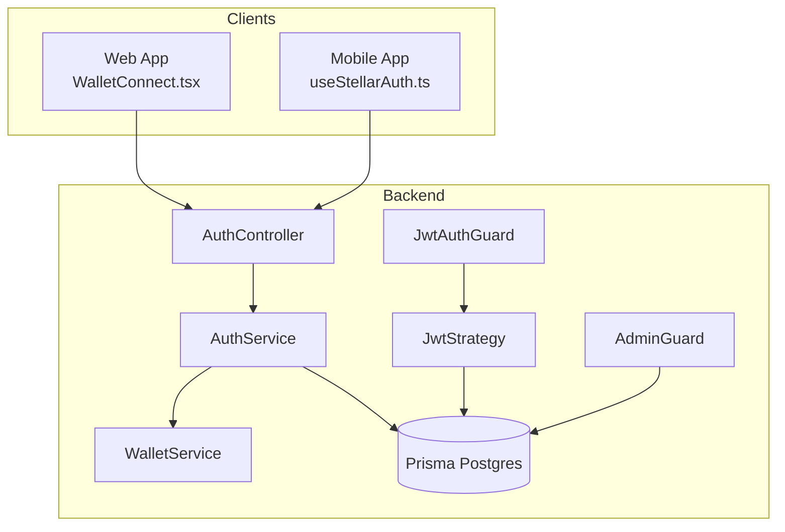
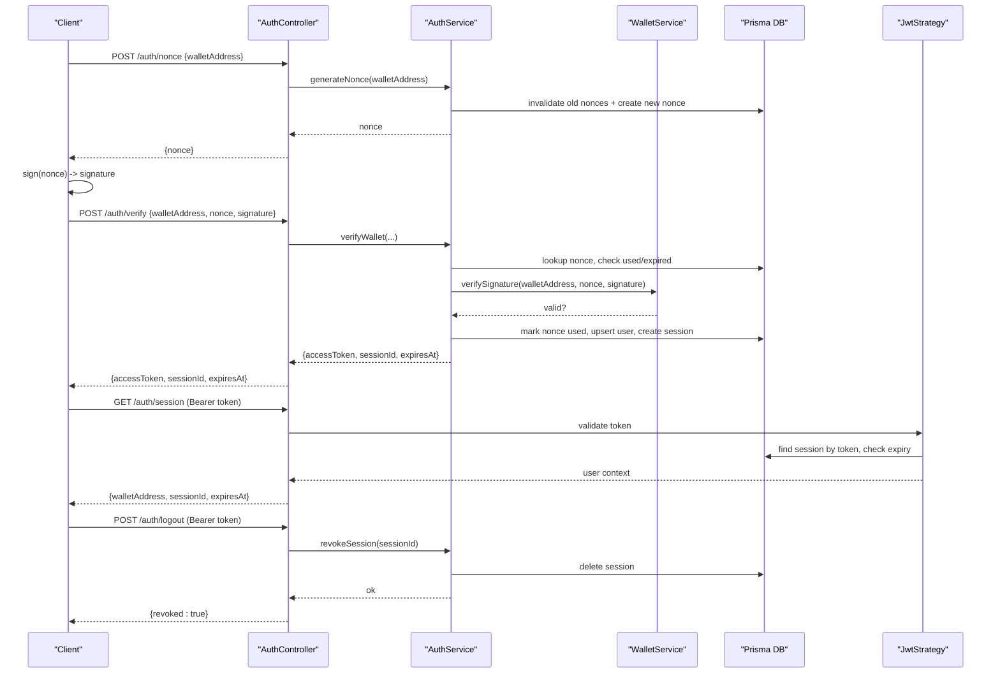
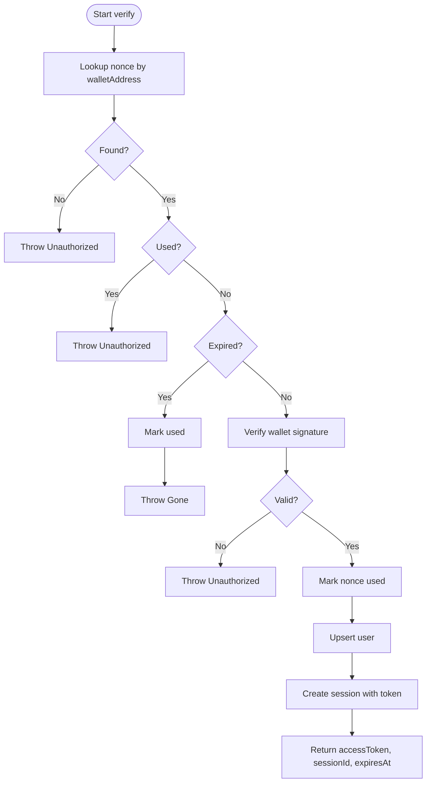
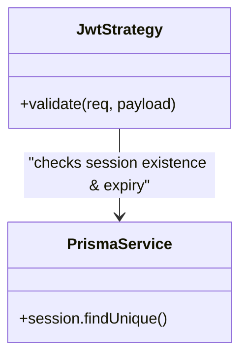
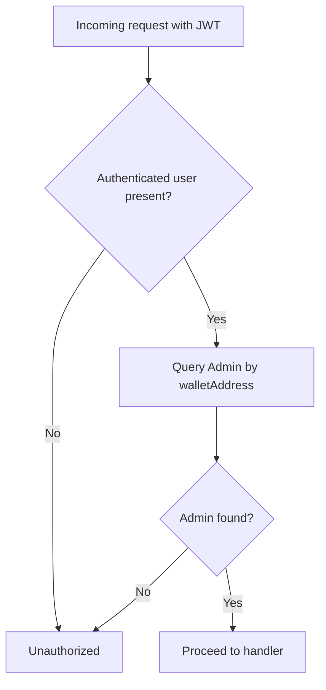
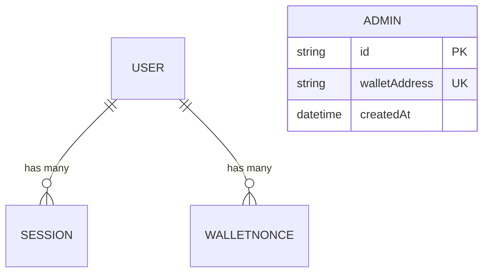
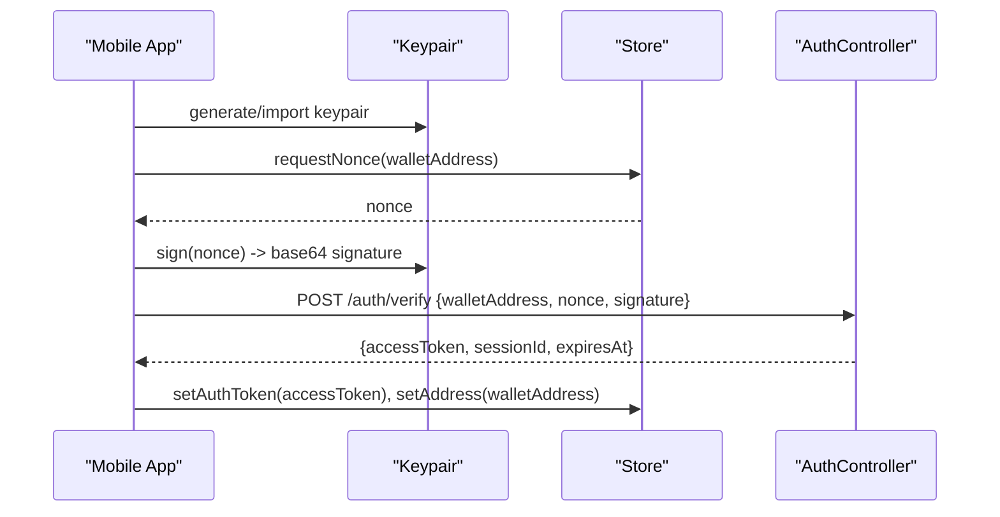
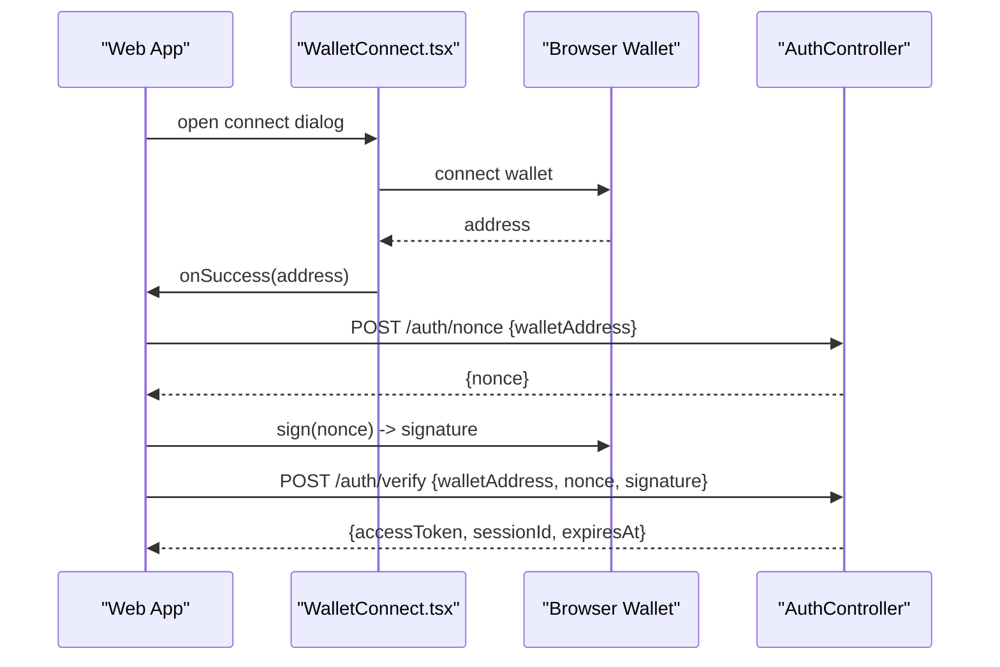
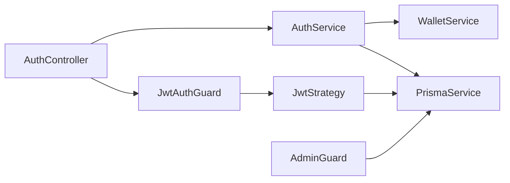

# Authentication System

<cite>
**Referenced Files in This Document**
- [auth.controller.ts](file://veilend-backend/src/auth/auth.controller.ts)
- [auth.service.ts](file://veilend-backend/src/auth/auth.service.ts)
- [jwt.strategy.ts](file://veilend-backend/src/auth/jwt.strategy.ts)
- [jwt-auth.guard.ts](file://veilend-backend/src/auth/jwt-auth.guard.ts)
- [admin.guard.ts](file://veilend-backend/src/auth/admin.guard.ts)
- [nonce.dto.ts](file://veilend-backend/src/auth/dto/nonce.dto.ts)
- [verify-wallet.dto.ts](file://veilend-backend/src/auth/dto/verify-wallet.dto.ts)
- [session-response.dto.ts](file://veilend-backend/src/auth/dto/session-response.dto.ts)
- [wallet.service.ts](file://veilend-backend/src/wallet/wallet.service.ts)
- [schema.prisma](file://veilend-backend/prisma/schema.prisma)
- [admin.controller.ts](file://veilend-backend/src/admin/admin.controller.ts)
- [useStellarAuth.ts](file://veilend-mobile/src/hooks/useStellarAuth.ts)
- [WalletConnect.tsx](file://veilend-web/src/components/WalletConnect.tsx)
</cite>

## Table of Contents
1. Introduction
2. Project Structure
3. Core Components
4. Architecture Overview
5. Detailed Component Analysis
6. Dependency Analysis
7. Performance Considerations
8. Troubleshooting Guide
9. Conclusion
10. Appendices

## Introduction
This document explains the VeilLend authentication system, focusing on wallet-based sign-in using nonces and signatures, JWT session management, and admin guard for protected routes. It covers the full flow from nonce generation to token issuance, how sessions are validated and revoked, and how clients (web and mobile) integrate with the service. Security considerations such as nonce lifecycle, signature verification, and session expiration are included alongside practical API examples and error handling patterns.

## Project Structure
The authentication system is implemented in the backend NestJS application under src/auth, with supporting modules for wallet signature verification and Prisma-managed persistence. Admin protection is enforced via a custom guard that checks an admin registry. Client integrations exist in both web and mobile apps.

**Diagram sources**
- [auth.controller.ts:14-58](file://veilend-backend/src/auth/auth.controller.ts#L14-L58)
- [auth.service.ts:19-203](file://veilend-backend/src/auth/auth.service.ts#L19-L203)
- [jwt.strategy.ts:13-65](file://veilend-backend/src/auth/jwt.strategy.ts#L13-L65)
- [jwt-auth.guard.ts:1-6](file://veilend-backend/src/auth/jwt-auth.guard.ts#L1-L6)
- [admin.guard.ts:24-47](file://veilend-backend/src/auth/admin.guard.ts#L24-L47)
- [wallet.service.ts:4-17](file://veilend-backend/src/wallet/wallet.service.ts#L4-L17)
- [schema.prisma:12-42](file://veilend-backend/prisma/schema.prisma#L12-L42)
- [schema.prisma:179-185](file://veilend-backend/prisma/schema.prisma#L179-L185)

**Section sources**
- [auth.controller.ts:14-58](file://veilend-backend/src/auth/auth.controller.ts#L14-L58)
- [auth.service.ts:19-203](file://veilend-backend/src/auth/auth.service.ts#L19-L203)
- [jwt.strategy.ts:13-65](file://veilend-backend/src/auth/jwt.strategy.ts#L13-L65)
- [admin.guard.ts:24-47](file://veilend-backend/src/auth/admin.guard.ts#L24-L47)
- [schema.prisma:12-42](file://veilend-backend/prisma/schema.prisma#L12-L42)
- [schema.prisma:179-185](file://veilend-backend/prisma/schema.prisma#L179-L185)

## Core Components
- AuthController: Exposes endpoints for nonce creation, wallet verification, session retrieval, and logout.
- AuthService: Implements nonce generation/validation, signature verification orchestration, JWT signing, session upsert, validation, and revocation.
- WalletService: Verifies Stellar wallet signatures over the nonce message.
- JwtStrategy: Validates bearer tokens, ensures sessions exist and are not expired, and attaches user context to requests.
- JwtAuthGuard: Reuses Passport’s JWT strategy for route protection.
- AdminGuard: Enforces role-based access by checking if the authenticated wallet address exists in the admin registry.
- DTOs: Define request/response shapes for nonce, verify, and session responses.
- Prisma schema: Defines User, WalletNonce, Session, and Admin models used throughout auth flows.

**Section sources**
- [auth.controller.ts:14-58](file://veilend-backend/src/auth/auth.controller.ts#L14-L58)
- [auth.service.ts:19-203](file://veilend-backend/src/auth/auth.service.ts#L19-L203)
- [wallet.service.ts:4-17](file://veilend-backend/src/wallet/wallet.service.ts#L4-L17)
- [jwt.strategy.ts:13-65](file://veilend-backend/src/auth/jwt.strategy.ts#L13-L65)
- [jwt-auth.guard.ts:1-6](file://veilend-backend/src/auth/jwt-auth.guard.ts#L1-L6)
- [admin.guard.ts:24-47](file://veilend-backend/src/auth/admin.guard.ts#L24-L47)
- [nonce.dto.ts:1-7](file://veilend-backend/src/auth/dto/nonce.dto.ts#L1-L7)
- [verify-wallet.dto.ts:1-13](file://veilend-backend/src/auth/dto/verify-wallet.dto.ts#L1-L13)
- [session-response.dto.ts:1-6](file://veilend-backend/src/auth/dto/session-response.dto.ts#L1-L6)
- [schema.prisma:12-42](file://veilend-backend/prisma/schema.prisma#L12-L42)
- [schema.prisma:179-185](file://veilend-backend/prisma/schema.prisma#L179-L185)

## Architecture Overview
The authentication flow uses a challenge-response pattern:
- Clients request a nonce bound to their wallet address.
- The client signs the nonce and submits it along with the wallet address.
- The server verifies the signature against the stored nonce, issues a JWT, and persists a session record.
- Subsequent requests include the JWT in the Authorization header; the JwtStrategy validates the token and checks the session existence and expiry.
- Admin routes require an additional AdminGuard check against the Admin table.

**Diagram sources**
- [auth.controller.ts:20-57](file://veilend-backend/src/auth/auth.controller.ts#L20-L57)
- [auth.service.ts:36-149](file://veilend-backend/src/auth/auth.service.ts#L36-L149)
- [auth.service.ts:156-201](file://veilend-backend/src/auth/auth.service.ts#L156-L201)
- [wallet.service.ts:6-15](file://veilend-backend/src/wallet/wallet.service.ts#L6-L15)
- [jwt.strategy.ts:35-63](file://veilend-backend/src/auth/jwt.strategy.ts#L35-L63)
- [schema.prisma:23-42](file://veilend-backend/prisma/schema.prisma#L23-L42)

## Detailed Component Analysis

### Nonce Lifecycle and Replay Protection
- Generation: A cryptographically random nonce is created and persisted with an expiration time. Any prior unused nonces for the same wallet are invalidated to prevent stacking.
- Verification: On verify, the server looks up the latest matching nonce, ensures it has not been used or expired, verifies the wallet signature, marks it used atomically, then creates or updates the user and session.
- Expiration: Expired nonces are marked used to prevent reuse even if clocks drift.

**Diagram sources**
- [auth.service.ts:70-149](file://veilend-backend/src/auth/auth.service.ts#L70-L149)

**Section sources**
- [auth.service.ts:36-149](file://veilend-backend/src/auth/auth.service.ts#L36-L149)

### JWT Strategy and Session Validation
- Token extraction: Bearer token is extracted from the Authorization header.
- Validation: After standard JWT signature and expiry checks, the strategy queries the session by token to ensure it still exists and is not expired.
- Context injection: On success, the strategy attaches walletAddress, sessionId, and expiresAt to the request object for downstream guards/controllers.

**Diagram sources**
- [jwt.strategy.ts:13-65](file://veilend-backend/src/auth/jwt.strategy.ts#L13-L65)

**Section sources**
- [jwt.strategy.ts:13-65](file://veilend-backend/src/auth/jwt.strategy.ts#L13-L65)

### Admin Guard and Role-Based Access Control
- Purpose: Protect administrative endpoints by ensuring the authenticated wallet address is registered as an admin.
- Enforcement: Applied globally at the controller level alongside JwtAuthGuard so only admins can call admin routes.

**Diagram sources**
- [admin.guard.ts:24-47](file://veilend-backend/src/auth/admin.guard.ts#L24-L47)
- [admin.controller.ts:20-23](file://veilend-backend/src/admin/admin.controller.ts#L20-L23)

**Section sources**
- [admin.guard.ts:24-47](file://veilend-backend/src/auth/admin.guard.ts#L24-L47)
- [admin.controller.ts:20-55](file://veilend-backend/src/admin/admin.controller.ts#L20-L55)

### Data Models and Relationships
- User: Represents a wallet owner; created on first successful authentication.
- WalletNonce: Stores challenges with expiry and usage flags.
- Session: Tracks active sessions with token, expiry, and last seen timestamp.
- Admin: Registry of authorized admin wallets.

**Diagram sources**
- [schema.prisma:12-42](file://veilend-backend/prisma/schema.prisma#L12-L42)
- [schema.prisma:179-185](file://veilend-backend/prisma/schema.prisma#L179-L185)

**Section sources**
- [schema.prisma:12-42](file://veilend-backend/prisma/schema.prisma#L12-L42)
- [schema.prisma:179-185](file://veilend-backend/prisma/schema.prisma#L179-L185)

### Client Integrations

#### Mobile Integration (React Native)
- Flow: Generate or import a Stellar keypair, request a nonce, sign the nonce, submit for verification, store the returned token and address.
- Storage: Uses secure storage to persist secret keys and tokens.

**Diagram sources**
- [useStellarAuth.ts:22-31](file://veilend-mobile/src/hooks/useStellarAuth.ts#L22-L31)
- [auth.controller.ts:29-36](file://veilend-backend/src/auth/auth.controller.ts#L29-L36)

**Section sources**
- [useStellarAuth.ts:1-72](file://veilend-mobile/src/hooks/useStellarAuth.ts#L1-L72)

#### Web Integration (Next.js)
- Flow: Connect a Stellar browser wallet (e.g., Freighter), obtain the address, and proceed with the same nonce/signature flow as mobile.
- UI: Provides connect/disconnect states, installation prompts, and error handling.

**Diagram sources**
- [WalletConnect.tsx:58-82](file://veilend-web/src/components/WalletConnect.tsx#L58-L82)
- [auth.controller.ts:20-36](file://veilend-backend/src/auth/auth.controller.ts#L20-L36)

**Section sources**
- [WalletConnect.tsx:1-378](file://veilend-web/src/components/WalletConnect.tsx#L1-L378)

## Dependency Analysis
- Controllers depend on services for business logic.
- Services depend on WalletService for cryptographic operations and Prisma for persistence.
- Guards depend on strategies and database to enforce authorization.
- DTOs define strict input/output contracts.

**Diagram sources**
- [auth.controller.ts:14-58](file://veilend-backend/src/auth/auth.controller.ts#L14-L58)
- [auth.service.ts:19-203](file://veilend-backend/src/auth/auth.service.ts#L19-L203)
- [jwt.strategy.ts:13-65](file://veilend-backend/src/auth/jwt.strategy.ts#L13-L65)
- [admin.guard.ts:24-47](file://veilend-backend/src/auth/admin.guard.ts#L24-L47)

**Section sources**
- [auth.controller.ts:14-58](file://veilend-backend/src/auth/auth.controller.ts#L14-L58)
- [auth.service.ts:19-203](file://veilend-backend/src/auth/auth.service.ts#L19-L203)
- [jwt.strategy.ts:13-65](file://veilend-backend/src/auth/jwt.strategy.ts#L13-L65)
- [admin.guard.ts:24-47](file://veilend-backend/src/auth/admin.guard.ts#L24-L47)

## Performance Considerations
- Nonce invalidation: Prior unused nonces are invalidated before creating a new one to avoid accumulation and reduce lookup overhead.
- Session touch: Sessions update lastSeenAt on each validated request to support activity tracking without heavy writes.
- Database indexes: Sessions and users have appropriate indexes to speed lookups by token and userId.
- Signature verification: Performed once per verify call; ensure clients cache nonces and retry safely.

[No sources needed since this section provides general guidance]

## Troubleshooting Guide
Common errors and resolutions:
- Invalid or unknown nonce: Ensure the nonce was requested immediately before signing and matches the current request.
- Nonce already used: Request a fresh nonce; replay attempts are rejected.
- Nonce expired: Request a new nonce; nonces expire after a short TTL.
- Invalid wallet signature: Confirm the client signed the exact nonce bytes and encoded the signature correctly.
- Session not found or revoked: Re-authenticate; the session may have been deleted during logout or expired.
- Session expired: Re-authenticate; refresh tokens as needed.
- Not an admin: Ensure the wallet address is registered in the Admin table.

**Section sources**
- [auth.service.ts:70-149](file://veilend-backend/src/auth/auth.service.ts#L70-L149)
- [auth.service.ts:156-201](file://veilend-backend/src/auth/auth.service.ts#L156-L201)
- [jwt.strategy.ts:35-63](file://veilend-backend/src/auth/jwt.strategy.ts#L35-L63)
- [admin.guard.ts:28-44](file://veilend-backend/src/auth/admin.guard.ts#L28-L44)

## Conclusion
VeilLend’s authentication combines wallet-based signatures with JWT sessions and database-backed session management to provide secure, stateful access control. Nonces prevent replay attacks, while admin guards enforce role-based access for sensitive operations. Clients can integrate easily by following the nonce/signature flow and attaching JWTs to subsequent requests.

[No sources needed since this section summarizes without analyzing specific files]

## Appendices

### API Reference

- POST /auth/nonce
  - Request body: walletAddress (string)
  - Response: nonce (string)
  - Errors: None expected for valid inputs

- POST /auth/verify
  - Request body: walletAddress (string), nonce (string), signature (string)
  - Response: accessToken (string), sessionId (string), expiresAt (string)
  - Errors: Unauthorized (invalid/unknown nonce, already used, invalid signature), Gone (expired nonce)

- GET /auth/session
  - Headers: Authorization: Bearer <token>
  - Response: walletAddress (string), sessionId (string), expiresAt (string)
  - Errors: Unauthorized (no token, session not found or revoked, session expired)

- POST /auth/logout
  - Headers: Authorization: Bearer <token>
  - Response: revoked (boolean)
  - Errors: None expected for valid sessions

**Section sources**
- [auth.controller.ts:20-57](file://veilend-backend/src/auth/auth.controller.ts#L20-L57)
- [nonce.dto.ts:1-7](file://veilend-backend/src/auth/dto/nonce.dto.ts#L1-L7)
- [verify-wallet.dto.ts:1-13](file://veilend-backend/src/auth/dto/verify-wallet.dto.ts#L1-L13)
- [session-response.dto.ts:1-6](file://veilend-backend/src/auth/dto/session-response.dto.ts#L1-L6)

### Security Considerations
- Nonce generation: Use cryptographically secure randomness and short TTL to limit exposure.
- Signature validation: Verify the exact nonce bytes and use proper encoding (base64) for signatures.
- Session expiration: Validate both JWT expiry and session expiry; revoke sessions on logout.
- Replay prevention: Mark nonces used atomically and reject reused nonces.
- Admin access: Restrict admin endpoints with a dedicated guard and maintain a minimal admin registry.

**Section sources**
- [auth.service.ts:36-149](file://veilend-backend/src/auth/auth.service.ts#L36-L149)
- [jwt.strategy.ts:35-63](file://veilend-backend/src/auth/jwt.strategy.ts#L35-L63)
- [admin.guard.ts:28-44](file://veilend-backend/src/auth/admin.guard.ts#L28-L44)