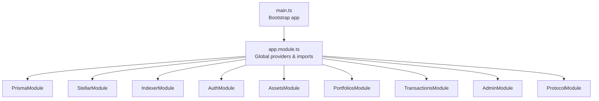
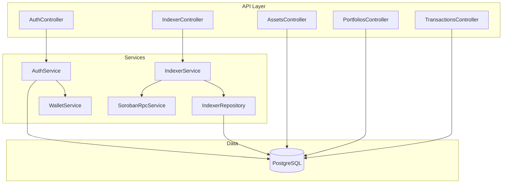
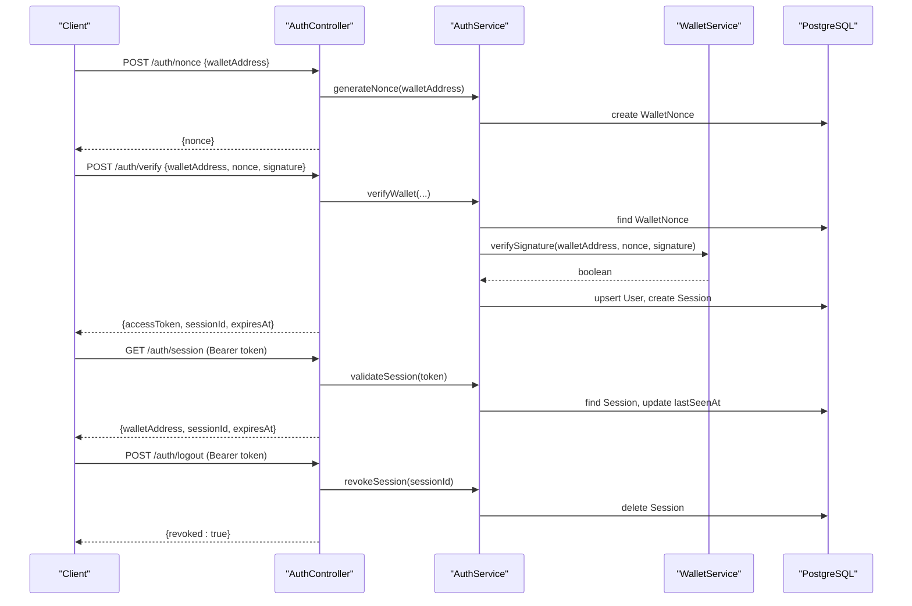
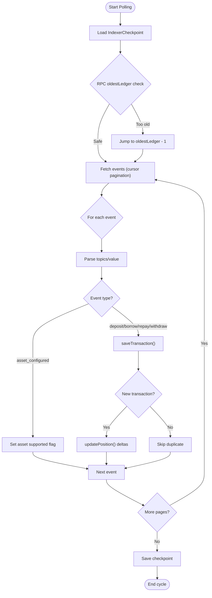
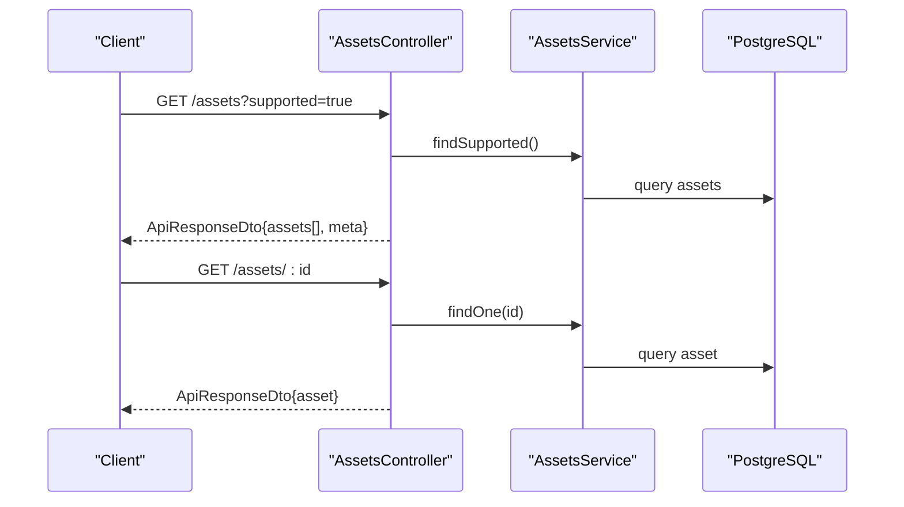
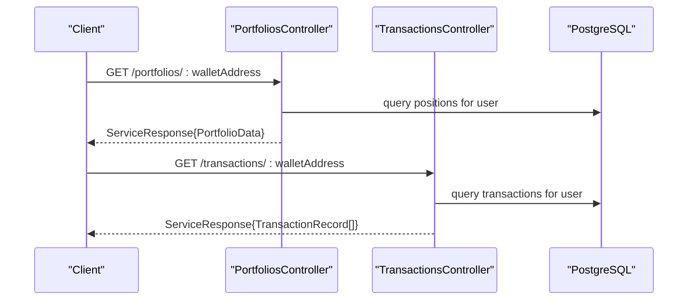
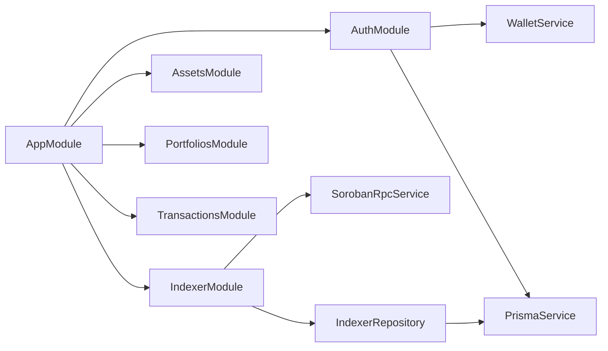

# Backend API (NestJS)

<cite>
**Referenced Files in This Document**
- [main.ts](file://veilend-backend/src/main.ts)
- [app.module.ts](file://veilend-backend/src/app.module.ts)
- [schema.prisma](file://veilend-backend/prisma/schema.prisma)
- [indexer.service.ts](file://veilend-backend/src/indexer/indexer.service.ts)
- [indexer.controller.ts](file://veilend-backend/src/indexer/indexer.controller.ts)
- [indexer.repository.ts](file://veilend-backend/src/indexer/indexer.repository.ts)
- [auth.service.ts](file://veilend-backend/src/auth/auth.service.ts)
- [auth.controller.ts](file://veilend-backend/src/auth/auth.controller.ts)
- [assets.controller.ts](file://veilend-backend/src/assets/assets.controller.ts)
- [portfolios.controller.ts](file://veilend-backend/src/portfolios/portfolios.controller.ts)
- [transactions.controller.ts](file://veilend-backend/src/transactions/transactions.controller.ts)
- [soroban-rpc.service.ts](file://veilend-backend/src/stellar/soroban-rpc.service.ts)
- [wallet.service.ts](file://veilend-backend/src/wallet/wallet.service.ts)
- [INDEXER.md](file://veilend-backend/INDEXER.md)
</cite>

## Table of Contents
1. [Introduction](#introduction)
2. [Project Structure](#project-structure)
3. [Core Components](#core-components)
4. [Architecture Overview](#architecture-overview)
5. [Detailed Component Analysis](#detailed-component-analysis)
6. [Dependency Analysis](#dependency-analysis)
7. [Performance Considerations](#performance-considerations)
8. [Troubleshooting Guide](#troubleshooting-guide)
9. [Conclusion](#conclusion)
10. [Appendices](#appendices)

## Introduction
This document describes the VeilLend backend API implemented with NestJS. It focuses on RESTful services for the lending protocol, including authentication with JWT-based sessions, a Prisma ORM layer backed by PostgreSQL, an indexer service that processes Soroban blockchain events into read models, and asset management APIs. It provides both architectural guidance for backend developers and practical usage notes for API consumers, using codebase terminology such as indexer, sync checkpoints, position tracking, and event processing.

## Project Structure
The NestJS application bootstraps global middleware, validation, logging, throttling, correlation IDs, and feature modules. The main entry configures pipes and logging, while the root module wires together core modules: Prisma, Stellar integration, Indexer, Auth, Assets, Portfolios, Transactions, Admin, and Protocol.



**Diagram sources**
- [main.ts:1-22](file://veilend-backend/src/main.ts#L1-L22)
- [app.module.ts:1-84](file://veilend-backend/src/app.module.ts#L1-L84)

**Section sources**
- [main.ts:1-22](file://veilend-backend/src/main.ts#L1-L22)
- [app.module.ts:1-84](file://veilend-backend/src/app.module.ts#L1-L84)

## Core Components
- Authentication: Nonce challenge/signature verification, JWT issuance, session management, logout.
- Indexer: Background polling of Soroban RPC for contract events, idempotent persistence, position tracking, and checkpointing.
- Asset Management: Read-only endpoints to list/filter assets with caching headers.
- Portfolio and Transactions: Query indexed positions and transaction history per wallet address.
- Infrastructure: Validation pipe, logging interceptor, exception filter, throttling guard, correlation ID via CLS.

**Section sources**
- [auth.controller.ts:1-59](file://veilend-backend/src/auth/auth.controller.ts#L1-L59)
- [auth.service.ts:1-203](file://veilend-backend/src/auth/auth.service.ts#L1-L203)
- [indexer.controller.ts:1-68](file://veilend-backend/src/indexer/indexer.controller.ts#L1-L68)
- [indexer.service.ts:1-314](file://veilend-backend/src/indexer/indexer.service.ts#L1-L314)
- [indexer.repository.ts:1-297](file://veilend-backend/src/indexer/indexer.repository.ts#L1-L297)
- [assets.controller.ts:1-58](file://veilend-backend/src/assets/assets.controller.ts#L1-L58)
- [portfolios.controller.ts:1-16](file://veilend-backend/src/portfolios/portfolios.controller.ts#L1-L16)
- [transactions.controller.ts:1-16](file://veilend-backend/src/transactions/transactions.controller.ts#L1-L16)

## Architecture Overview
The backend exposes REST endpoints grouped by domain. The indexer runs as a background process, persisting events into Postgres via Prisma. Auth issues JWTs tied to persisted sessions. Asset, portfolio, and transaction endpoints serve read models populated by the indexer or managed by other subsystems.



**Diagram sources**
- [auth.controller.ts:1-59](file://veilend-backend/src/auth/auth.controller.ts#L1-L59)
- [auth.service.ts:1-203](file://veilend-backend/src/auth/auth.service.ts#L1-L203)
- [indexer.controller.ts:1-68](file://veilend-backend/src/indexer/indexer.controller.ts#L1-L68)
- [indexer.service.ts:1-314](file://veilend-backend/src/indexer/indexer.service.ts#L1-L314)
- [indexer.repository.ts:1-297](file://veilend-backend/src/indexer/indexer.repository.ts#L1-L297)
- [soroban-rpc.service.ts:1-124](file://veilend-backend/src/stellar/soroban-rpc.service.ts#L1-L124)

## Detailed Component Analysis

### Authentication System (JWT-based Sessions)
- Flow: Client requests a nonce, signs it with their wallet key, and submits signature for verification. On success, a JWT is issued and a session row is created. Protected routes validate the JWT and ensure the session exists and is not expired. Logout revokes the session.
- Security: Nonces are single-use and time-bounded; signatures are verified against the provided wallet public key; sessions are stored server-side for revocation.



**Diagram sources**
- [auth.controller.ts:1-59](file://veilend-backend/src/auth/auth.controller.ts#L1-L59)
- [auth.service.ts:1-203](file://veilend-backend/src/auth/auth.service.ts#L1-L203)
- [wallet.service.ts:1-17](file://veilend-backend/src/wallet/wallet.service.ts#L1-L17)

**Section sources**
- [auth.controller.ts:1-59](file://veilend-backend/src/auth/auth.controller.ts#L1-L59)
- [auth.service.ts:1-203](file://veilend-backend/src/auth/auth.service.ts#L1-L203)
- [wallet.service.ts:1-17](file://veilend-backend/src/wallet/wallet.service.ts#L1-L17)

### Indexer Service (Blockchain Event Processing)
- Responsibilities: Poll Soroban RPC for contract events, parse topics/values, persist transactions, update positions, and maintain a global ledger checkpoint. Supports force replay to rebuild read models from scratch.
- Idempotency: Uses Soroban event id as unique key to prevent double-counting on duplicate deliveries.
- Checkpoints: Stores last indexed ledger in a singleton row; resumes safely after restarts and handles RPC retention windows.



**Diagram sources**
- [indexer.service.ts:1-314](file://veilend-backend/src/indexer/indexer.service.ts#L1-L314)
- [indexer.repository.ts:1-297](file://veilend-backend/src/indexer/indexer.repository.ts#L1-L297)

**Section sources**
- [indexer.service.ts:1-314](file://veilend-backend/src/indexer/indexer.service.ts#L1-L314)
- [indexer.repository.ts:1-297](file://veilend-backend/src/indexer/indexer.repository.ts#L1-L297)
- [INDEXER.md:1-64](file://veilend-backend/INDEXER.md#L1-L64)

### Asset Management APIs
- List all assets or filter to supported ones; cacheable responses.
- Retrieve a single asset by UUID, code, or contractId.



**Diagram sources**
- [assets.controller.ts:1-58](file://veilend-backend/src/assets/assets.controller.ts#L1-L58)

**Section sources**
- [assets.controller.ts:1-58](file://veilend-backend/src/assets/assets.controller.ts#L1-L58)

### Portfolio and Transaction Queries
- Portfolio endpoint returns aggregated position data for a wallet address.
- Transactions endpoint returns indexed transactions for a wallet address.



**Diagram sources**
- [portfolios.controller.ts:1-16](file://veilend-backend/src/portfolios/portfolios.controller.ts#L1-L16)
- [transactions.controller.ts:1-16](file://veilend-backend/src/transactions/transactions.controller.ts#L1-L16)

**Section sources**
- [portfolios.controller.ts:1-16](file://veilend-backend/src/portfolios/portfolios.controller.ts#L1-L16)
- [transactions.controller.ts:1-16](file://veilend-backend/src/transactions/transactions.controller.ts#L1-L16)

### Database Schema and Relationships
Key entities and relationships used across the backend:
- User, Session, WalletNonce: Support wallet-based authentication and session lifecycle.
- Asset: Represents tokens (including Soroban contracts), with support flags set by indexer events.
- Position: Per-user, per-asset balances and risk metrics updated by the indexer.
- TransactionHistory: Indexed on-chain events with idempotency via sorobanEventId.
- SyncCheckpoint: Per-user ledger cursor for client-side sync (distinct from indexer’s global checkpoint).
- IndexerCheckpoint: Global ledger cursor for the indexer.

```mermaid
erDiagram
USER ||--o{ SESSION : "has many"
USER ||--o{ POSITION : "has many"
USER ||--o{ TRANSACTIONHISTORY : "has many"
USER ||--o{ SYNCCHECKPOINT : "has one"
ASSET ||--o{ POSITION : "has many"
ASSET ||--o{ TRANSACTIONHISTORY : "has many"
INDEXERCHECKPOINT }||--|| INDEXERCHECKPOINT : "singleton"
```

**Diagram sources**
- [schema.prisma:1-197](file://veilend-backend/prisma/schema.prisma#L1-L197)

**Section sources**
- [schema.prisma:1-197](file://veilend-backend/prisma/schema.prisma#L1-L197)

## Dependency Analysis
- Module-level dependencies: AppModule imports feature modules and registers global guards, interceptors, and filters.
- Service-level dependencies:
  - AuthService depends on WalletService (signature verification), JwtService (token signing), and Prisma (session/nonces/users).
  - IndexerService depends on SorobanRpcService (event retrieval), AppConfigService (configuration), and IndexerRepository (persistence).
  - IndexerRepository depends on PrismaService and encapsulates all database interactions.
- External integrations:
  - Stellar/Soroban RPC via @stellar/stellar-sdk rpc.Server.
  - PostgreSQL via Prisma ORM.



**Diagram sources**
- [app.module.ts:1-84](file://veilend-backend/src/app.module.ts#L1-L84)
- [auth.service.ts:1-203](file://veilend-backend/src/auth/auth.service.ts#L1-L203)
- [indexer.service.ts:1-314](file://veilend-backend/src/indexer/indexer.service.ts#L1-L314)
- [indexer.repository.ts:1-297](file://veilend-backend/src/indexer/indexer.repository.ts#L1-L297)
- [soroban-rpc.service.ts:1-124](file://veilend-backend/src/stellar/soroban-rpc.service.ts#L1-L124)

**Section sources**
- [app.module.ts:1-84](file://veilend-backend/src/app.module.ts#L1-L84)

## Performance Considerations
- Throttling: Global rate limiting via ThrottlerGuard configured through ConfigService.
- Caching: Asset endpoints include Cache-Control headers for short-lived browser/proxy caching.
- Pagination: Indexer fetches events in batches of 100 using cursor-based pagination to minimize memory and network overhead.
- Idempotency: Deduplication at the storage layer prevents redundant writes and position updates.
- Connection health: Soroban RPC client validates connectivity and reports errors without blocking startup.

[No sources needed since this section provides general guidance]

## Troubleshooting Guide
- Authentication failures:
  - Invalid or unknown nonce: Ensure the latest nonce was requested and not reused.
  - Expired nonce: Request a new nonce if the previous one has expired.
  - Invalid signature: Verify client-side signing matches the nonce exactly.
- Indexer issues:
  - Stalled indexing: Check RPC health and retention window; the indexer will jump to the oldest available ledger if the stored checkpoint is too old.
  - Duplicate events: Handled automatically; verify that saveTransaction returns false for duplicates and no double-counting occurs.
  - Replay: Use the replay endpoint to reset indexer-owned read models and re-index from the configured start ledger.
- Data consistency:
  - Positions stale: After replay or schema changes, trigger a replay to rebuild positions from events.

**Section sources**
- [auth.service.ts:1-203](file://veilend-backend/src/auth/auth.service.ts#L1-L203)
- [indexer.service.ts:1-314](file://veilend-backend/src/indexer/indexer.service.ts#L1-L314)
- [indexer.repository.ts:1-297](file://veilend-backend/src/indexer/indexer.repository.ts#L1-L297)
- [INDEXER.md:1-64](file://veilend-backend/INDEXER.md#L1-L64)

## Conclusion
The VeilLend backend provides a robust, modular NestJS API with secure wallet-based authentication, a resilient indexer for Soroban events, and clear read-model APIs for assets, portfolios, and transactions. The design emphasizes idempotency, checkpointed synchronization, and operational safety through throttling, logging, and health checks. Consumers can rely on consistent position tracking and event-driven updates while maintaining control over sync state and replay capabilities.

[No sources needed since this section summarizes without analyzing specific files]

## Appendices

### API Reference Summary
- Authentication
  - POST /auth/nonce: Request a signed challenge for wallet login.
  - POST /auth/verify: Submit wallet signature to obtain a JWT and session.
  - GET /auth/session: Validate current session (requires JWT).
  - POST /auth/logout: Revoke active session (requires JWT).
- Indexer
  - GET /indexer/status: View indexer configuration and last indexed ledger.
  - GET /indexer/positions/:address: Get indexed positions for an address.
  - GET /indexer/transactions/:address: Get indexed transactions for an address.
  - POST /indexer/replay: Reset and re-index from start ledger.
- Assets
  - GET /assets: List assets; optional ?supported=true filter.
  - GET /assets/:id: Retrieve a single asset by id/code/contractId.
- Portfolios and Transactions
  - GET /portfolios/:walletAddress: Aggregated portfolio data.
  - GET /transactions/:walletAddress: Indexed transaction history.

[No sources needed since this section lists endpoints conceptually]

### Practical Examples

- Authentication flow example:
  - Request a nonce for your wallet address.
  - Sign the returned nonce with your wallet private key.
  - Submit the signature to verify and receive a JWT and session details.
  - Include the JWT in subsequent protected requests.
  - Log out by sending a logout request with the JWT to revoke the session.

- Data synchronization pattern:
  - Monitor /indexer/status to track the last indexed ledger.
  - Use /indexer/transactions/:address and /indexer/positions/:address to build UI views.
  - If data drift occurs, call /indexer/replay to rebuild read models from the configured start ledger.

[No sources needed since this section provides conceptual usage examples]