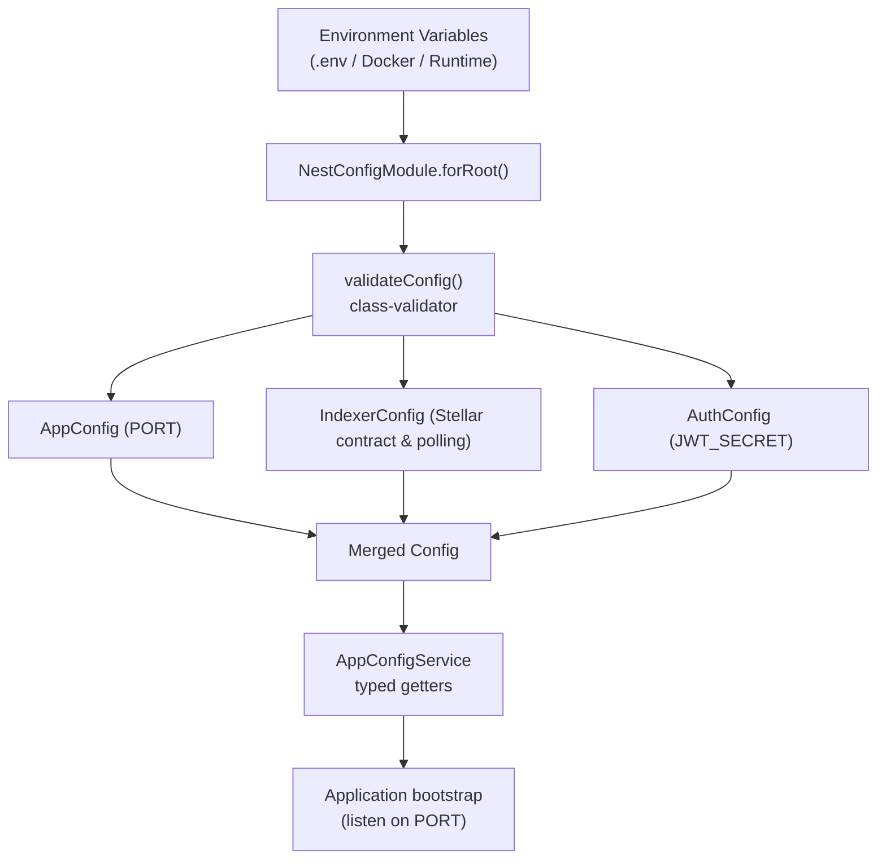
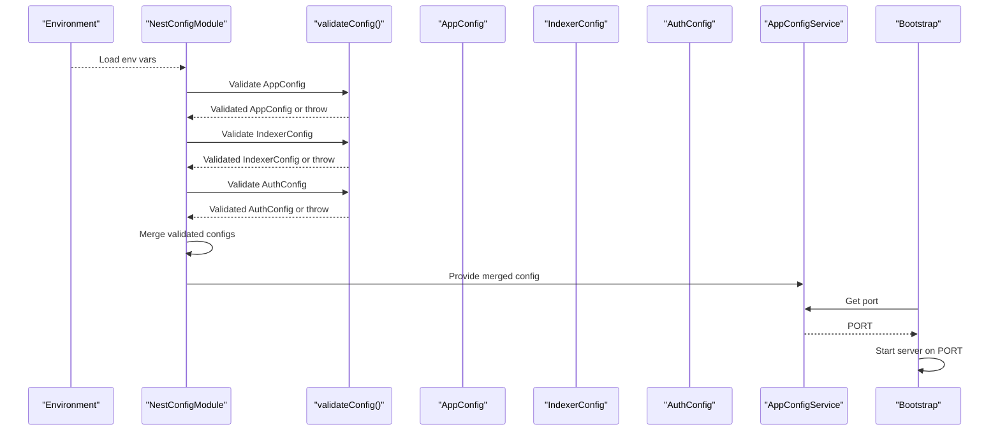
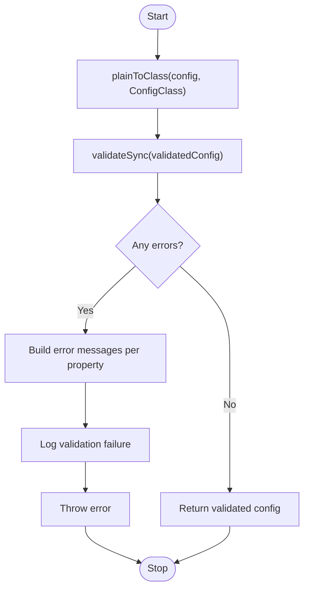
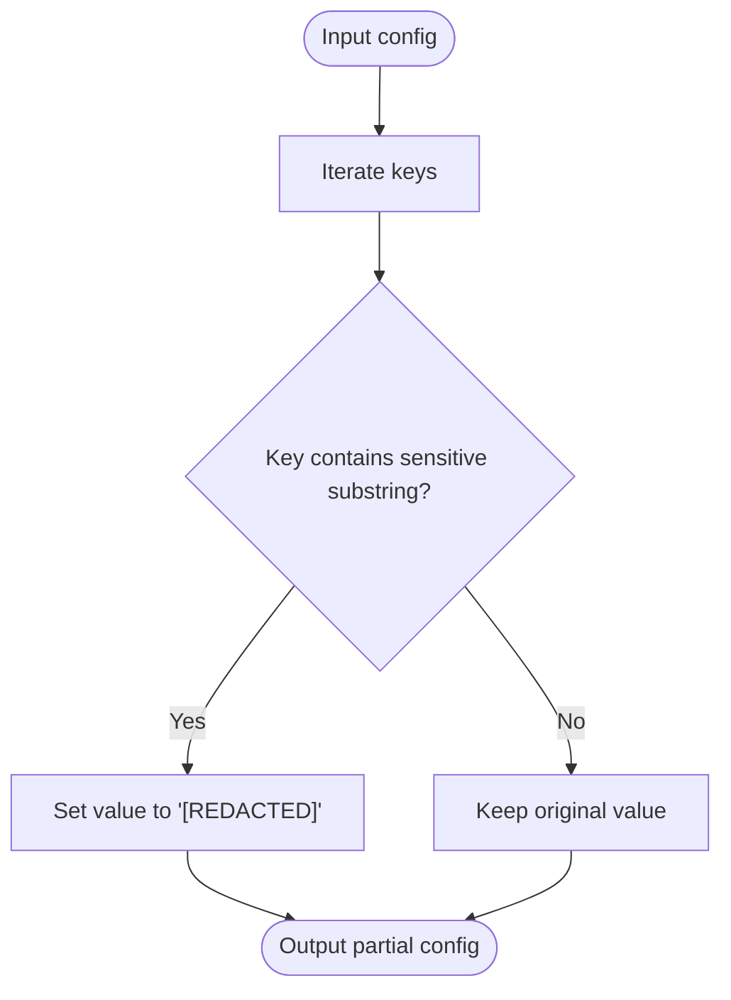
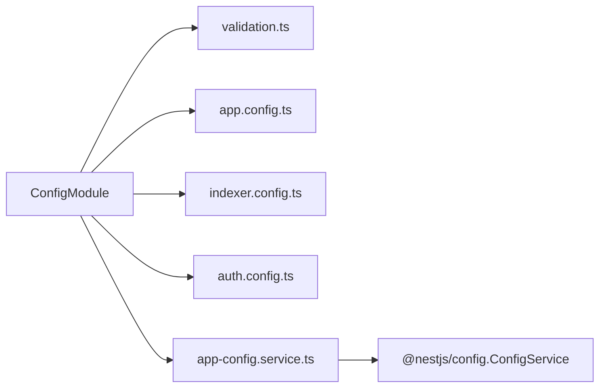

# Configuration Management

<cite>
**Referenced Files in This Document**
- [config.module.ts](file://veilend-backend/src/config/config.module.ts)
- [validation.ts](file://veilend-backend/src/config/validation.ts)
- [app.config.ts](file://veilend-backend/src/config/app.config.ts)
- [indexer.config.ts](file://veilend-backend/src/config/indexer.config.ts)
- [auth.config.ts](file://veilend-backend/src/config/auth.config.ts)
- [app-config.service.ts](file://veilend-backend/src/config/app-config.service.ts)
- [stellar.config.ts](file://veilend-backend/src/config/stellar.config.ts)
- [main.ts](file://veilend-backend/src/main.ts)
- [docker-compose.yml](file://veilend-backend/docker-compose.yml)
- [Dockerfile](file://veilend-backend/Dockerfile)
- [docker-entrypoint.sh](file://veilend-backend/docker-entrypoint.sh)
</cite>

## Table of Contents
1. Introduction
2. Project Structure
3. Core Components
4. Architecture Overview
5. Detailed Component Analysis
6. Dependency Analysis
7. Performance Considerations
8. Troubleshooting Guide
9. Conclusion

## Introduction
This document explains how VeilLend backend manages configuration at runtime, focusing on environment-specific setup, validation with class-validator, and secret management practices. It covers application settings, Stellar network parameters, indexer configuration, and database connection via environment variables. It also provides best practices for secure secrets, validation rules, and error handling when configurations are invalid.

## Project Structure
The configuration system is centered around a NestJS ConfigModule that:
- Loads environment variables
- Validates them against typed classes using class-validator
- Merges validated sections into a single configuration object
- Exposes a typed service to consume configuration throughout the app

**Diagram sources**
- [config.module.ts:12-35](file://veilend-backend/src/config/config.module.ts#L12-L35)
- [validation.ts:8-32](file://veilend-backend/src/config/validation.ts#L8-L32)
- [app.config.ts:3-8](file://veilend-backend/src/config/app.config.ts#L3-L8)
- [indexer.config.ts:3-18](file://veilend-backend/src/config/indexer.config.ts#L3-L18)
- [auth.config.ts:3-7](file://veilend-backend/src/config/auth.config.ts#L3-L7)
- [app-config.service.ts:5-63](file://veilend-backend/src/config/app-config.service.ts#L5-L63)
- [main.ts:7-20](file://veilend-backend/src/main.ts#L7-L20)

**Section sources**
- [config.module.ts:12-35](file://veilend-backend/src/config/config.module.ts#L12-L35)
- [validation.ts:8-32](file://veilend-backend/src/config/validation.ts#L8-L32)
- [app.config.ts:3-8](file://veilend-backend/src/config/app.config.ts#L3-L8)
- [indexer.config.ts:3-18](file://veilend-backend/src/config/indexer.config.ts#L3-L18)
- [auth.config.ts:3-7](file://veilend-backend/src/config/auth.config.ts#L3-L7)
- [app-config.service.ts:5-63](file://veilend-backend/src/config/app-config.service.ts#L5-L63)
- [main.ts:7-20](file://veilend-backend/src/main.ts#L7-L20)

## Core Components
- Validation pipeline: Converts raw config objects to typed classes and validates constraints. On failure, logs detailed errors and throws to stop startup.
- Typed configuration classes:
  - AppConfig: Application-level settings such as server port.
  - IndexerConfig: Stellar indexer settings including contract ID, start ledger, and poll interval.
  - AuthConfig: Authentication-related settings such as JWT secret.
- Configuration service: Provides typed getters for application, Stellar, indexer, and auth configuration with sensible defaults.
- Module integration: The ConfigModule wires validation, merges configs, and exposes the service globally.

Key responsibilities:
- Environment loading and merging
- Strict validation with descriptive error messages
- Secret redaction in logs
- Centralized access via a typed service

**Section sources**
- [validation.ts:8-32](file://veilend-backend/src/config/validation.ts#L8-L32)
- [validation.ts:34-50](file://veilend-backend/src/config/validation.ts#L34-L50)
- [app.config.ts:3-8](file://veilend-backend/src/config/app.config.ts#L3-L8)
- [indexer.config.ts:3-18](file://veilend-backend/src/config/indexer.config.ts#L3-L18)
- [auth.config.ts:3-7](file://veilend-backend/src/config/auth.config.ts#L3-L7)
- [app-config.service.ts:5-63](file://veilend-backend/src/config/app-config.service.ts#L5-L63)
- [config.module.ts:12-35](file://veilend-backend/src/config/config.module.ts#L12-L35)

## Architecture Overview
The configuration architecture ensures that all external inputs are validated before use and that sensitive values are never logged in plain text.

**Diagram sources**
- [config.module.ts:12-35](file://veilend-backend/src/config/config.module.ts#L12-L35)
- [validation.ts:8-32](file://veilend-backend/src/config/validation.ts#L8-L32)
- [app.config.ts:3-8](file://veilend-backend/src/config/app.config.ts#L3-L8)
- [indexer.config.ts:3-18](file://veilend-backend/src/config/indexer.config.ts#L3-L18)
- [auth.config.ts:3-7](file://veilend-backend/src/config/auth.config.ts#L3-L7)
- [app-config.service.ts:5-63](file://veilend-backend/src/config/app-config.service.ts#L5-L63)
- [main.ts:7-20](file://veilend-backend/src/main.ts#L7-L20)

## Detailed Component Analysis

### Configuration Validation Pipeline
- Converts raw configuration to typed instances with implicit conversion enabled.
- Enforces whitelist validation and reports all constraint violations.
- Logs a structured error message listing each invalid property and its constraints.
- Throws an error to prevent the application from starting with invalid configuration.

**Diagram sources**
- [validation.ts:8-32](file://veilend-backend/src/config/validation.ts#L8-L32)

**Section sources**
- [validation.ts:8-32](file://veilend-backend/src/config/validation.ts#L8-L32)

### Secret Redaction Utility
- Masks keys containing common sensitive substrings (e.g., SECRET, KEY, TOKEN, PRIVATE).
- Returns a partial copy of the configuration with sensitive values replaced by a placeholder.
- Used during logging to avoid leaking secrets.

**Diagram sources**
- [validation.ts:34-50](file://veilend-backend/src/config/validation.ts#L34-L50)

**Section sources**
- [validation.ts:34-50](file://veilend-backend/src/config/validation.ts#L34-L50)

### Application Settings (AppConfig)
- Defines the server port with default and minimum constraints.
- Ensures PORT is a positive integer.

Validation rules:
- Optional presence; if provided, must be an integer greater than or equal to 1.

Runtime usage:
- Consumed by the bootstrap process to start the HTTP server.

**Section sources**
- [app.config.ts:3-8](file://veilend-backend/src/config/app.config.ts#L3-L8)
- [main.ts:18-19](file://veilend-backend/src/main.ts#L18-L19)

### Indexer Configuration (IndexerConfig)
- Defines Stellar indexer parameters:
  - Contract ID string
  - Start ledger number (minimum 1)
  - Poll interval in milliseconds (minimum 100)

Validation rules:
- All fields are optional but constrained when present.

Runtime usage:
- Accessed via AppConfigService indexer getter with safe defaults.

**Section sources**
- [indexer.config.ts:3-18](file://veilend-backend/src/config/indexer.config.ts#L3-L18)
- [app-config.service.ts:35-54](file://veilend-backend/src/config/app-config.service.ts#L35-L54)

### Authentication Configuration (AuthConfig)
- Defines JWT secret with a development default.
- String type enforced.

Security note:
- Override with a strong secret in production environments.
- Avoid committing secrets to version control.

**Section sources**
- [auth.config.ts:3-7](file://veilend-backend/src/config/auth.config.ts#L3-L7)
- [app-config.service.ts:56-62](file://veilend-backend/src/config/app-config.service.ts#L56-L62)

### Stellar Network Configuration
- Dedicated module function returns Horizon URL from environment.
- AppConfigService provides a comprehensive Stellar configuration block including:
  - Network name
  - Horizon URL
  - Soroban RPC URL
  - Network passphrase
- Defaults target testnet for local development.

Usage:
- Services interacting with Stellar should read from AppConfigService stellar getter to ensure consistent configuration.

**Section sources**
- [stellar.config.ts:1-4](file://veilend-backend/src/config/stellar.config.ts#L1-L4)
- [app-config.service.ts:12-33](file://veilend-backend/src/config/app-config.service.ts#L12-L33)

### Module Integration and Bootstrap
- ConfigModule registers Nest’s ConfigModule with global scope and caching.
- Runs validation for all configuration classes and merges results.
- Logs a redacted view of the final configuration for observability.
- Exposes AppConfigService for dependency injection across modules.
- main.ts applies global validation pipes and starts the server using the configured port.

**Section sources**
- [config.module.ts:12-35](file://veilend-backend/src/config/config.module.ts#L12-L35)
- [main.ts:7-20](file://veilend-backend/src/main.ts#L7-L20)

## Dependency Analysis
Configuration components have clear boundaries and minimal coupling:
- ConfigModule depends on validation utilities and typed config classes.
- AppConfigService depends only on Nest’s ConfigService.
- Validation utilities are pure functions used by ConfigModule.

**Diagram sources**
- [config.module.ts:12-35](file://veilend-backend/src/config/config.module.ts#L12-L35)
- [validation.ts:8-32](file://veilend-backend/src/config/validation.ts#L8-L32)
- [app.config.ts:3-8](file://veilend-backend/src/config/app.config.ts#L3-L8)
- [indexer.config.ts:3-18](file://veilend-backend/src/config/indexer.config.ts#L3-L18)
- [auth.config.ts:3-7](file://veilend-backend/src/config/auth.config.ts#L3-L7)
- [app-config.service.ts:5-63](file://veilend-backend/src/config/app-config.service.ts#L5-L63)

**Section sources**
- [config.module.ts:12-35](file://veilend-backend/src/config/config.module.ts#L12-L35)
- [app-config.service.ts:5-63](file://veilend-backend/src/config/app-config.service.ts#L5-L63)

## Performance Considerations
- Configuration caching is enabled to avoid repeated parsing and validation overhead.
- Validation runs once at startup; subsequent reads are fast lookups.
- Use reasonable defaults to minimize cold-start failures and reduce environment complexity.

[No sources needed since this section provides general guidance]

## Troubleshooting Guide
Common issues and resolutions:
- Missing required environment variables:
  - Symptoms: Startup fails with validation errors listing missing properties.
  - Resolution: Ensure all required variables are set according to your environment.
- Invalid types or ranges:
  - Symptoms: Errors indicate constraints like minimum values or type mismatches.
  - Resolution: Correct variable types and values (e.g., numeric ports, intervals).
- Secrets not applied:
  - Symptoms: Service behavior uses development defaults.
  - Resolution: Override secrets via environment variables in your deployment platform.
- Logging leaks:
  - If you see unexpected secrets in logs, verify that configuration logging uses the redaction utility.

Operational notes:
- Database migrations run at container start; ensure DATABASE_URL points to a reachable database.
- Health checks rely on the server listening on the configured port.

**Section sources**
- [validation.ts:8-32](file://veilend-backend/src/config/validation.ts#L8-L32)
- [docker-entrypoint.sh:4-9](file://veilend-backend/docker-entrypoint.sh#L4-L9)
- [Dockerfile:41-66](file://veilend-backend/Dockerfile#L41-L66)

## Conclusion
VeilLend’s configuration system enforces strict, typed, and validated settings at startup while keeping secrets safe in logs. By centralizing configuration in a module and exposing it through a typed service, the application remains robust across environments. Follow the environment examples below to configure application settings, Stellar network parameters, and authentication securely.

## Appendices

### Environment Variables Reference
- Application
  - PORT: Server port (integer, minimum 1)
- Indexer
  - STELLAR_CONTRACT_ID: Stellar contract identifier
  - STELLAR_INDEXER_START_LEDGER: Ledger number to start indexing from (minimum 1)
  - STELLAR_INDEXER_POLL_INTERVAL_MS: Polling interval in milliseconds (minimum 100)
- Authentication
  - JWT_SECRET: Secret used for signing tokens
- Stellar
  - STELLAR_NETWORK: Network name (e.g., testnet)
  - STELLAR_HORIZON_URL: Horizon endpoint URL
  - STELLAR_SOROBAN_RPC_URL: Soroban RPC endpoint URL
  - STELLAR_NETWORK_PASSPHRASE: Network passphrase string
- Database
  - DATABASE_URL: PostgreSQL connection string

Example environment definitions can be found in the Docker Compose file.

**Section sources**
- [docker-compose.yml:35-45](file://veilend-backend/docker-compose.yml#L35-L45)
- [app.config.ts:3-8](file://veilend-backend/src/config/app.config.ts#L3-L8)
- [indexer.config.ts:3-18](file://veilend-backend/src/config/indexer.config.ts#L3-L18)
- [auth.config.ts:3-7](file://veilend-backend/src/config/auth.config.ts#L3-L7)
- [app-config.service.ts:12-62](file://veilend-backend/src/config/app-config.service.ts#L12-L62)

### Best Practices
- Always validate configuration at startup; fail fast on invalid values.
- Use environment-specific overrides rather than changing code.
- Never commit secrets; use secret managers or platform-provided secret stores.
- Prefer typed getters over direct environment reads to enforce defaults and types.
- Redact sensitive values in logs to prevent accidental exposure.
- Keep defaults aligned with safe environments (e.g., testnet) for local development.

[No sources needed since this section provides general guidance]