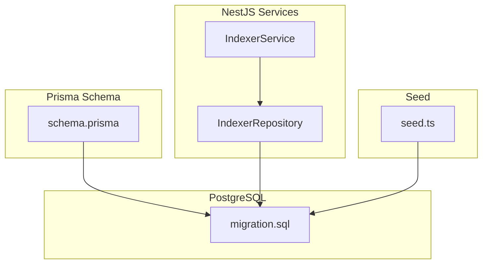
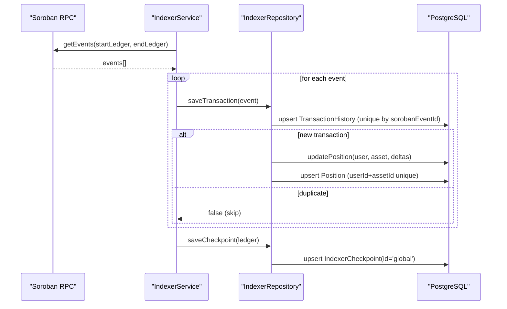
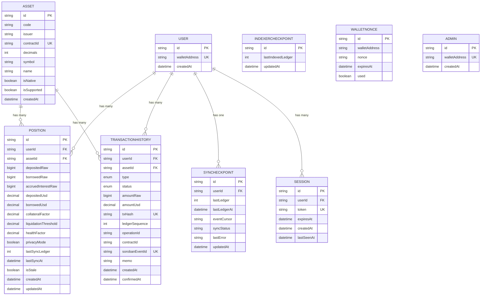
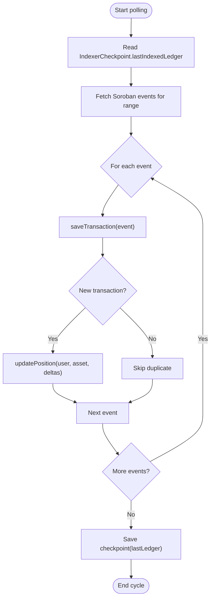
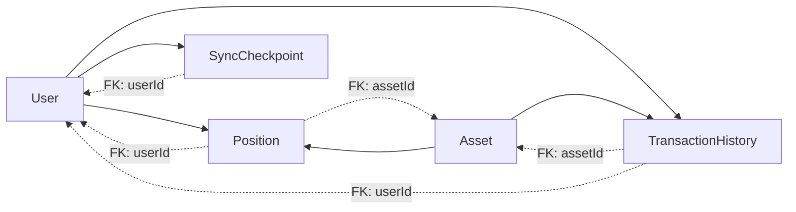

# Database Design

<cite>
**Referenced Files in This Document**
- [schema.prisma](file://veilend-backend/prisma/schema.prisma)
- [migration.sql](file://veilend-backend/prisma/migrations/20260719172357_indexer_postgres_read_models/migration.sql)
- [indexer.repository.ts](file://veilend-backend/src/indexer/indexer.repository.ts)
- [indexer.service.ts](file://veilend-backend/src/indexer/indexer.service.ts)
- [seed.ts](file://veilend-backend/prisma/seed.ts)
</cite>

## Table of Contents
1. [Introduction](#introduction)
2. [Project Structure](#project-structure)
3. [Core Components](#core-components)
4. [Architecture Overview](#architecture-overview)
5. [Detailed Component Analysis](#detailed-component-analysis)
6. [Dependency Analysis](#dependency-analysis)
7. [Performance Considerations](#performance-considerations)
8. [Troubleshooting Guide](#troubleshooting-guide)
9. [Conclusion](#conclusion)
10. [Appendices](#appendices)

## Introduction
This document describes the VeilLend backend database design implemented with Prisma and PostgreSQL. It covers entity relationships for users, positions, transactions, assets, and sync checkpoints; field definitions, data types, constraints, indexes, and referential integrity. It also explains how the Soroban event indexer populates read models, migration strategy using Prisma migrations, validation rules and business constraints, common query patterns, and performance considerations for large-scale indexing operations.

## Project Structure
The database schema is defined in a single Prisma schema file and materialized via a PostgreSQL migration. The application uses a NestJS service layer to index Stellar/Soroban events into read-model tables (positions, transaction history, checkpoints). A seed script provides representative demo data aligned with the schema.

**Diagram sources**
- [schema.prisma:1-197](file://veilend-backend/prisma/schema.prisma#L1-L197)
- [migration.sql:1-215](file://veilend-backend/prisma/migrations/20260719172357_indexer_postgres_read_models/migration.sql#L1-L215)
- [indexer.service.ts:1-314](file://veilend-backend/src/indexer/indexer.service.ts#L1-L314)
- [indexer.repository.ts:1-297](file://veilend-backend/src/indexer/indexer.repository.ts#L1-L297)
- [seed.ts:1-517](file://veilend-backend/prisma/seed.ts#L1-L517)

**Section sources**
- [schema.prisma:1-197](file://veilend-backend/prisma/schema.prisma#L1-L197)
- [migration.sql:1-215](file://veilend-backend/prisma/migrations/20260719172357_indexer_postgres_read_models/migration.sql#L1-L215)

## Core Components
The database consists of the following core entities:
- User: Identity anchored by wallet address
- Asset: Token metadata including native XLM and Soroban tokens
- Position: Per-user per-asset balances and risk metrics
- TransactionHistory: Immutable ledger of protocol events
- SyncCheckpoint: Per-user incremental sync state
- IndexerCheckpoint: Global indexer cursor
- Session and WalletNonce: Authentication support
- Admin: Administrative wallet identity

Key characteristics:
- Primary keys are UUIDs except IndexerCheckpoint which uses a fixed id “global”
- Foreign keys enforce referential integrity between User, Asset, and dependent tables
- Unique constraints prevent duplicates on critical identifiers (walletAddress, contractId, code+issuer, txHash, sorobanEventId, userId+assetId)
- Multiple indexes optimize queries by user, asset, ledger sequence, and timestamps

**Section sources**
- [schema.prisma:10-197](file://veilend-backend/prisma/schema.prisma#L10-L197)
- [migration.sql:8-215](file://veilend-backend/prisma/migrations/20260719172357_indexer_postgres_read_models/migration.sql#L8-L215)

## Architecture Overview
The indexer continuously polls Soroban events and persists them as immutable records in TransactionHistory. For each new event, it updates Position deltas and advances the global IndexerCheckpoint. Users can later query their positions and transaction histories from these read models.

**Diagram sources**
- [indexer.service.ts:107-171](file://veilend-backend/src/indexer/indexer.service.ts#L107-L171)
- [indexer.repository.ts:136-245](file://veilend-backend/src/indexer/indexer.repository.ts#L136-L245)
- [schema.prisma:123-197](file://veilend-backend/prisma/schema.prisma#L123-L197)

## Detailed Component Analysis

### Entity Relationships and Data Model

**Diagram sources**
- [schema.prisma:10-197](file://veilend-backend/prisma/schema.prisma#L10-L197)
- [migration.sql:8-215](file://veilend-backend/prisma/migrations/20260719172357_indexer_postgres_read_models/migration.sql#L8-L215)

#### Field Definitions, Types, and Constraints
- User
  - id: UUID primary key
  - walletAddress: unique text
  - createdAt: timestamp default now
- Asset
  - id: UUID primary key
  - code, symbol, name: text
  - issuer: nullable text (null for native XLM)
  - contractId: unique text (Soroban token contract)
  - decimals: integer default 7
  - isNative, isSupported: boolean defaults
  - createdAt: timestamp default now
  - Unique constraint on (code, issuer)
  - Index on contractId
- Position
  - id: UUID primary key
  - userId, assetId: foreign keys to User and Asset
  - Raw balances: depositedRaw, borrowedRaw, accruedInterestRaw (bigint)
  - USD values: depositedUsd, borrowedUsd (decimal 28,7)
  - Risk metrics: collateralFactor, liquidationThreshold (decimal 5,4), healthFactor (nullable decimal 10,4)
  - Privacy mode flag: privacyMode (boolean)
  - Sync metadata: lastSyncLedger (int), lastSyncAt (timestamp), isStale (boolean)
  - Timestamps: createdAt, updatedAt
  - Unique constraint on (userId, assetId)
  - Indexes on userId, assetId, lastSyncAt
- TransactionHistory
  - id: UUID primary key
  - userId, assetId: foreign keys
  - type: enum (DEPOSIT, WITHDRAW, BORROW, REPAY, LIQUIDATION)
  - status: enum (PENDING, CONFIRMED, FAILED) default PENDING
  - amountRaw (bigint), amountUsd (decimal 28,7)
  - txHash: unique text
  - ledgerSequence: int
  - operationId: text
  - contractId: text
  - sorobanEventId: unique text (event-level idempotency key)
  - memo: text
  - createdAt: timestamp default now
  - confirmedAt: nullable timestamp
  - Indexes on (userId, createdAt), assetId, txHash, ledgerSequence, sorobanEventId
- SyncCheckpoint
  - id: UUID primary key
  - userId: foreign key to User (unique per user)
  - lastLedger: int default 0
  - lastLedgerAt: nullable timestamp
  - eventCursor: nullable text
  - syncStatus: text default 'idle'
  - lastError: nullable text
  - updatedAt: timestamp updated at
  - Unique constraint on userId
  - Index on userId
- IndexerCheckpoint
  - id: fixed text 'global'
  - lastIndexedLedger: int default 0
  - updatedAt: timestamp updated at
- Session
  - id: UUID primary key
  - userId: foreign key to User (cascade delete)
  - token: unique text
  - expiresAt, createdAt, lastSeenAt: timestamps
  - Indexes on userId and token
- WalletNonce
  - id: UUID primary key
  - walletAddress: text
  - nonce: text
  - expiresAt: timestamp
  - used: boolean default false
- Admin
  - id: UUID primary key
  - walletAddress: unique text
  - createdAt: timestamp default now
  - Index on walletAddress

**Section sources**
- [schema.prisma:10-197](file://veilend-backend/prisma/schema.prisma#L10-L197)
- [migration.sql:8-215](file://veilend-backend/prisma/migrations/20260719172357_indexer_postgres_read_models/migration.sql#L8-L215)

#### Referential Integrity and Cascade Behavior
- Session.user → User.id: ON DELETE CASCADE
- Position.user → User.id: ON DELETE CASCADE
- Position.asset → Asset.id: ON DELETE RESTRICT
- TransactionHistory.user → User.id: ON DELETE CASCADE
- TransactionHistory.asset → Asset.id: ON DELETE RESTRICT
- SyncCheckpoint.user → User.id: ON DELETE CASCADE

These constraints ensure that deleting a User cascades related sessions, positions, transactions, and sync checkpoints, while Assets cannot be deleted if referenced by positions or transactions.

**Section sources**
- [migration.sql:198-215](file://veilend-backend/prisma/migrations/20260719172357_indexer_postgres_read_models/migration.sql#L198-L215)

### Indexer Workflow and Data Access Patterns
The indexer processes Soroban events and writes to TransactionHistory and Position tables, ensuring idempotency via unique sorobanEventId and atomic position updates.

**Diagram sources**
- [indexer.service.ts:107-171](file://veilend-backend/src/indexer/indexer.service.ts#L107-L171)
- [indexer.repository.ts:136-245](file://veilend-backend/src/indexer/indexer.repository.ts#L136-L245)

#### Idempotency and Duplicate Handling
- TransactionHistory.sorobanEventId is unique; duplicate events are ignored
- If a race condition occurs during create, repository handles unique violation codes and treats as duplicate
- Position updates are wrapped in a transaction to ensure consistency

**Section sources**
- [indexer.repository.ts:136-180](file://veilend-backend/src/indexer/indexer.repository.ts#L136-L180)
- [indexer.repository.ts:204-245](file://veilend-backend/src/indexer/indexer.repository.ts#L204-L245)

### Query Optimization Strategies
- Single-writer assumption: Position updates assume serial processing; if parallelization is introduced, row-level locking or atomic increments should be considered
- Index usage:
  - TransactionHistory: (userId, createdAt) for user history pagination; assetId for asset-centric queries; ledgerSequence for ledger-based scans; sorobanEventId for deduplication
  - Position: userId and assetId for fast lookups; lastSyncAt for staleness checks
  - Session: userId and token for auth flows
  - Asset: contractId for Soroban token resolution
  - SyncCheckpoint: userId for per-user sync state

**Section sources**
- [schema.prisma:101-105](file://veilend-backend/prisma/schema.prisma#L101-L105)
- [schema.prisma:149-154](file://veilend-backend/prisma/schema.prisma#L149-L154)
- [schema.prisma:175-177](file://veilend-backend/prisma/schema.prisma#L175-L177)
- [migration.sql:132-196](file://veilend-backend/prisma/migrations/20260719172357_indexer_postgres_read_models/migration.sql#L132-L196)

### Migration Strategy and Version Management
- Prisma schema defines the desired state
- A single migration creates enums, tables, indexes, and foreign keys
- Application uses Prisma Client to interact with the database
- Seed script demonstrates typical data creation and cleanup order respecting foreign keys

Best practices:
- Keep migrations additive and idempotent where possible
- Use Prisma’s migration tooling to evolve schema safely
- Ensure seed scripts handle existing data gracefully

**Section sources**
- [schema.prisma:1-8](file://veilend-backend/prisma/schema.prisma#L1-L8)
- [migration.sql:1-215](file://veilend-backend/prisma/migrations/20260719172357_indexer_postgres_read_models/migration.sql#L1-L215)
- [seed.ts:64-78](file://veilend-backend/prisma/seed.ts#L64-L78)

### Data Validation Rules and Business Constraints
- Uniqueness:
  - User.walletAddress ensures one identity per wallet
  - Asset.contractId prevents duplicate Soroban token entries
  - Asset.code + Asset.issuer uniquely identifies classic Stellar assets
  - TransactionHistory.txHash and sorobanEventId prevent duplicate transaction records
  - Position.userId + assetId enforces one position per user per asset
- Defaults:
  - Numeric fields default to zero for raw balances and derived USD values
  - Boolean flags default appropriately (privacyMode false, isNative false, isSupported false)
  - Enum fields default to safe states (status PENDING, syncStatus idle)
- Nullable fields:
  - HealthFactor is null when no debt exists
  - LastSyncLedger and lastSyncAt are optional until first sync
  - EventCursor and lastError are optional for error tracking

Business logic enforced by indexer:
- Deposits increase depositedRaw; withdrawals decrease but clamp to zero
- Borrows increase borrowedRaw; repayments decrease but clamp to zero
- Only new events update positions; duplicates are skipped

**Section sources**
- [schema.prisma:12-21](file://veilend-backend/prisma/schema.prisma#L12-L21)
- [schema.prisma:47-65](file://veilend-backend/prisma/schema.prisma#L47-L65)
- [schema.prisma:70-105](file://veilend-backend/prisma/schema.prisma#L70-L105)
- [schema.prisma:123-154](file://veilend-backend/prisma/schema.prisma#L123-L154)
- [schema.prisma:159-177](file://veilend-backend/prisma/schema.prisma#L159-L177)
- [indexer.repository.ts:204-245](file://veilend-backend/src/indexer/indexer.repository.ts#L204-L245)

### Common Queries and Data Access Patterns
- Get user positions:
  - Filter Position by user.walletAddress via join or Prisma relation include
  - Use indexes on userId for efficient lookup
- Get user transaction history:
  - Filter TransactionHistory by userId and order by createdAt desc
  - Leverage composite index on (userId, createdAt)
- Check indexer progress:
  - Read IndexerCheckpoint.lastIndexedLedger
- Resolve asset by Soroban contract:
  - Query Asset by contractId (indexed)
- Reset indexer read models:
  - Delete indexed transactions, positions, and reset checkpoint

Example references:
- Repository methods demonstrate these patterns

**Section sources**
- [indexer.repository.ts:112-128](file://veilend-backend/src/indexer/indexer.repository.ts#L112-L128)
- [indexer.repository.ts:182-195](file://veilend-backend/src/indexer/indexer.repository.ts#L182-L195)
- [indexer.repository.ts:247-256](file://veilend-backend/src/indexer/indexer.repository.ts#L247-L256)
- [indexer.repository.ts:284-295](file://veilend-backend/src/indexer/indexer.repository.ts#L284-L295)

## Dependency Analysis

**Diagram sources**
- [schema.prisma:12-21](file://veilend-backend/prisma/schema.prisma#L12-L21)
- [schema.prisma:47-65](file://veilend-backend/prisma/schema.prisma#L47-L65)
- [schema.prisma:70-105](file://veilend-backend/prisma/schema.prisma#L70-L105)
- [schema.prisma:123-154](file://veilend-backend/prisma/schema.prisma#L123-L154)
- [schema.prisma:159-177](file://veilend-backend/prisma/schema.prisma#L159-L177)

**Section sources**
- [schema.prisma:12-197](file://veilend-backend/prisma/schema.prisma#L12-L197)
- [migration.sql:198-215](file://veilend-backend/prisma/migrations/20260719172357_indexer_postgres_read_models/migration.sql#L198-L215)

## Performance Considerations
- Indexing large volumes:
  - Prefer batched inserts for TransactionHistory
  - Use upserts for Position to avoid repeated reads/writes
  - Ensure indexes on frequently filtered columns (userId, assetId, ledgerSequence, createdAt)
- Concurrency:
  - Current implementation assumes single writer for Position updates; if parallelized, add row-level locks or atomic operations
- Query efficiency:
  - Use composite indexes for common filters (e.g., userId + createdAt)
  - Avoid full table scans by leveraging unique constraints and indexes
- Storage:
  - Decimal precision chosen for USD values (28,7) balances accuracy and storage
  - BigInt for raw amounts preserves precision across different asset decimals

[No sources needed since this section provides general guidance]

## Troubleshooting Guide
Common issues and resolutions:
- Duplicate event handling:
  - sorobanEventId uniqueness prevents double-counting; repository catches unique violations and returns false
- Stale positions:
  - Check Position.isStale and lastSyncAt; re-run indexer to refresh
- RPC retention window:
  - Indexer adjusts start ledger if lastIndexedLedger falls behind RPC oldestLedger
- Error tracking:
  - SyncCheckpoint.lastError stores last known error; monitor syncStatus transitions

Operational tips:
- Use forceReplay to reset read models and rebuild from scratch
- Monitor IndexerCheckpoint to ensure progress
- Validate Asset configuration via setAssetSupported

**Section sources**
- [indexer.repository.ts:136-180](file://veilend-backend/src/indexer/indexer.repository.ts#L136-L180)
- [indexer.service.ts:74-87](file://veilend-backend/src/indexer/indexer.service.ts#L74-L87)
- [indexer.service.ts:305-312](file://veilend-backend/src/indexer/indexer.service.ts#L305-L312)

## Conclusion
The VeilLend backend uses a well-structured Prisma schema with clear entity relationships, robust constraints, and targeted indexes to support high-throughput indexing of Soroban events. The read-model approach separates concerns between on-chain state and application queries, enabling efficient user-facing endpoints. Proper migration management, idempotent writes, and careful concurrency assumptions ensure data integrity and scalability.

[No sources needed since this section summarizes without analyzing specific files]

## Appendices

### Example Queries (by reference)
- Get user positions: see repository method mapping Position rows to API shape
- Get user transactions: see repository method filtering by user wallet address
- Reset indexer read models: see repository method clearing indexed data

**Section sources**
- [indexer.repository.ts:112-128](file://veilend-backend/src/indexer/indexer.repository.ts#L112-L128)
- [indexer.repository.ts:182-195](file://veilend-backend/src/indexer/indexer.repository.ts#L182-L195)
- [indexer.repository.ts:284-295](file://veilend-backend/src/indexer/indexer.repository.ts#L284-L295)