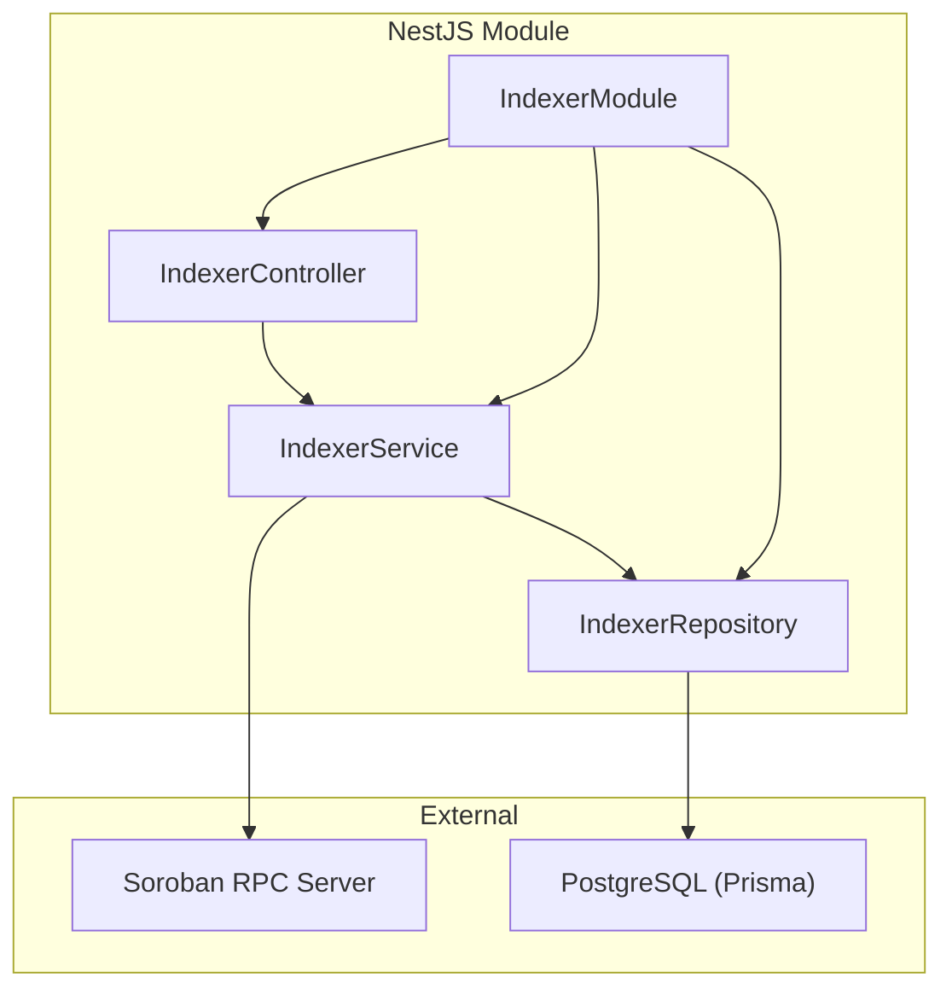
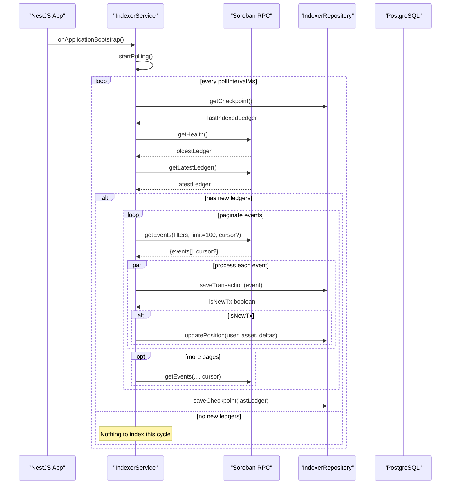
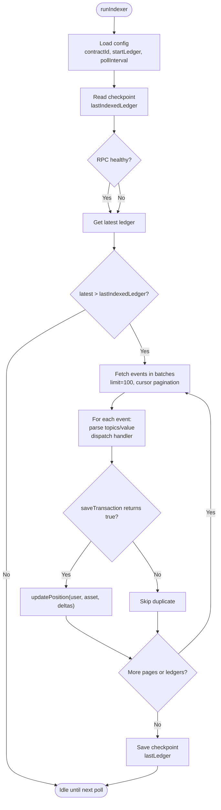
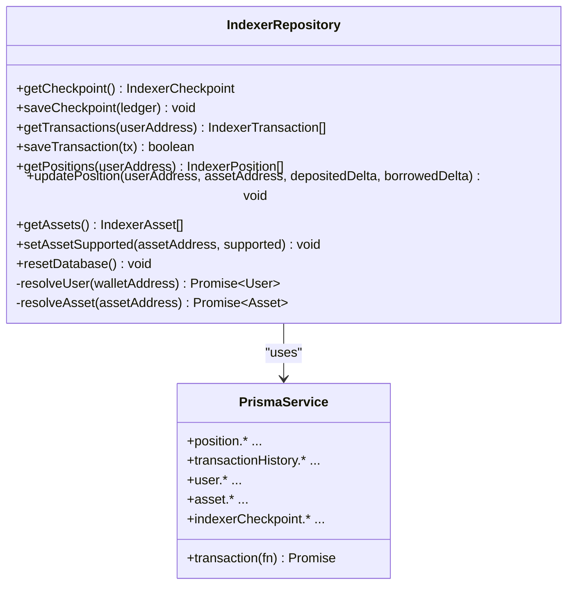
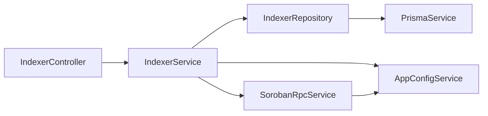

# Indexer Service

<cite>
**Referenced Files in This Document**
- [INDEXER.md](file://veilend-backend/INDEXER.md)
- [indexer.service.ts](file://veilend-backend/src/indexer/indexer.service.ts)
- [indexer.controller.ts](file://veilend-backend/src/indexer/indexer.controller.ts)
- [indexer.repository.ts](file://veilend-backend/src/indexer/indexer.repository.ts)
- [indexer.config.ts](file://veilend-backend/src/config/indexer.config.ts)
- [app-config.service.ts](file://veilend-backend/src/config/app-config.service.ts)
- [soroban-rpc.service.ts](file://veilend-backend/src/stellar/soroban-rpc.service.ts)
- [schema.prisma](file://veilend-backend/prisma/schema.prisma)
- [indexer.module.ts](file://veilend-backend/src/indexer/indexer.module.ts)
- [indexer.service.spec.ts](file://veilend-backend/src/indexer/indexer.service.spec.ts)
- [indexer.repository.spec.ts](file://veilend-backend/src/indexer/indexer.repository.spec.ts)
</cite>

## Table of Contents
1. [Introduction](#introduction)
2. [Project Structure](#project-structure)
3. [Core Components](#core-components)
4. [Architecture Overview](#architecture-overview)
5. [Detailed Component Analysis](#detailed-component-analysis)
6. [Dependency Analysis](#dependency-analysis)
7. [Performance Considerations](#performance-considerations)
8. [Troubleshooting Guide](#troubleshooting-guide)
9. [Conclusion](#conclusion)
10. [Appendices](#appendices)

## Introduction
This document describes the VeilLend blockchain indexer service that ingests Soroban smart contract events, normalizes them, and maintains read-optimized PostgreSQL models via Prisma. It explains the event-driven architecture, incremental synchronization using checkpoints, batch processing strategies, error recovery patterns, data transformation logic, consistency guarantees, configuration, monitoring, troubleshooting, and REST API endpoints for querying indexed data and managing indexer state.

## Project Structure
The indexer is implemented as a NestJS module with:
- A background polling loop that queries Soroban RPC for new events
- An event processor that transforms topics/values into domain operations
- A repository layer that persists transactions, positions, asset support flags, and a global checkpoint
- A controller exposing status, query, and replay endpoints
- Configuration classes for environment variables and defaults

**Diagram sources**
- [indexer.module.ts:9-14](file://veilend-backend/src/indexer/indexer.module.ts#L9-L14)
- [indexer.controller.ts:6-67](file://veilend-backend/src/indexer/indexer.controller.ts#L6-L67)
- [indexer.service.ts:16-31](file://veilend-backend/src/indexer/indexer.service.ts#L16-L31)
- [indexer.repository.ts:52-56](file://veilend-backend/src/indexer/indexer.repository.ts#L52-L56)
- [soroban-rpc.service.ts:8-15](file://veilend-backend/src/stellar/soroban-rpc.service.ts#L8-L15)

**Section sources**
- [indexer.module.ts:1-16](file://veilend-backend/src/indexer/indexer.module.ts#L1-L16)
- [indexer.controller.ts:1-68](file://veilend-backend/src/indexer/indexer.controller.ts#L1-L68)
- [indexer.service.ts:1-314](file://veilend-backend/src/indexer/indexer.service.ts#L1-L314)
- [indexer.repository.ts:1-297](file://veilend-backend/src/indexer/indexer.repository.ts#L1-L297)
- [soroban-rpc.service.ts:1-124](file://veilend-backend/src/stellar/soroban-rpc.service.ts#L1-L124)
- [schema.prisma:1-197](file://veilend-backend/prisma/schema.prisma#L1-L197)

## Core Components
- IndexerService: Orchestrates polling, event fetching, parsing, persistence, and checkpoint updates. Implements lifecycle hooks to start/stop the poll loop.
- IndexerRepository: Encapsulates all database interactions: checkpoint management, transaction deduplication, position delta application, asset support flag updates, and safe reset for replay.
- IndexerController: Exposes REST endpoints for status, querying positions/transactions, and triggering a full replay.
- SorobanRpcService: Provides a configured and health-checked connection to the Soroban RPC endpoint used by the indexer.
- Configuration: Environment-driven settings for contract ID, start ledger, and poll interval.

Key behaviors:
- Incremental sync via a global checkpoint stored in the database
- Batched event retrieval with pagination cursor
- Idempotent event processing keyed by Soroban event id
- Position deltas clamped to non-negative balances
- Asset support tracking from on-chain events

**Section sources**
- [indexer.service.ts:16-314](file://veilend-backend/src/indexer/indexer.service.ts#L16-L314)
- [indexer.repository.ts:52-297](file://veilend-backend/src/indexer/indexer.repository.ts#L52-L297)
- [indexer.controller.ts:6-67](file://veilend-backend/src/indexer/indexer.controller.ts#L6-L67)
- [soroban-rpc.service.ts:8-124](file://veilend-backend/src/stellar/soroban-rpc.service.ts#L8-L124)
- [indexer.config.ts:1-19](file://veilend-backend/src/config/indexer.config.ts#L1-L19)
- [app-config.service.ts:35-54](file://veilend-backend/src/config/app-config.service.ts#L35-L54)

## Architecture Overview
The indexer runs as a background process within the NestJS application. On bootstrap, it starts a periodic poll loop that:
1. Reads the last indexed ledger from the global checkpoint
2. Validates RPC retention window and adjusts if needed
3. Fetches latest ledger sequence
4. Retrieves events in batches of up to 100 using pagination
5. Processes each event into normalized operations
6. Persists transactions and updates positions
7. Updates the checkpoint after successfully processing a range

**Diagram sources**
- [indexer.service.ts:28-171](file://veilend-backend/src/indexer/indexer.service.ts#L28-L171)
- [indexer.repository.ts:97-110](file://veilend-backend/src/indexer/indexer.repository.ts#L97-L110)
- [soroban-rpc.service.ts:41-80](file://veilend-backend/src/stellar/soroban-rpc.service.ts#L41-L80)

## Detailed Component Analysis

### IndexerService
Responsibilities:
- Lifecycle management: starts polling on application bootstrap; clears timeout on module destroy
- Poll loop scheduling with configurable interval
- Safety checks against RPC retention window
- Event fetching with filters for the configured contract and topic prefix
- Event parsing and dispatch to handlers based on topic
- Transaction persistence and idempotency
- Position delta computation and persistence
- Checkpoint update after successful processing

Event handling details:
- Topics are parsed from XDR values to strings
- Supported event types: deposit, borrow, repay, withdraw, asset_configured
- Amounts are parsed to bigint for precision
- Duplicate detection relies on sorobanEventId uniqueness

Error handling:
- Per-event try/catch ensures one failing event does not stop the entire batch
- RPC errors during fetch break the current page loop but do not crash the service
- Health check failures are logged and ignored to continue indexing

Consistency guarantees:
- Deduplication via unique sorobanEventId prevents double-counting
- Positions are updated only when a transaction is newly created
- Checkpoint is updated only after processing a range of ledgers

**Diagram sources**
- [indexer.service.ts:48-171](file://veilend-backend/src/indexer/indexer.service.ts#L48-L171)
- [indexer.service.ts:173-254](file://veilend-backend/src/indexer/indexer.service.ts#L173-L254)

**Section sources**
- [indexer.service.ts:16-314](file://veilend-backend/src/indexer/indexer.service.ts#L16-L314)
- [indexer.service.spec.ts:99-168](file://veilend-backend/src/indexer/indexer.service.spec.ts#L99-L168)
- [indexer.service.spec.ts:171-280](file://veilend-backend/src/indexer/indexer.service.spec.ts#L171-L280)

### IndexerRepository
Responsibilities:
- Global checkpoint CRUD (singleton row with fixed id)
- TransactionHistory creation with idempotency on sorobanEventId
- Position upsert with delta accumulation and non-negative clamping
- Asset support flag updates from asset_configured events
- Safe reset for replay that clears only indexer-owned rows

Data normalization:
- Wallet addresses and contract IDs are normalized to lowercase for consistent lookups
- User and Asset rows are auto-created via upsert when first encountered

Concurrency considerations:
- updatePosition uses a single transaction to read-modify-write with clamping
- saveTransaction handles race conditions where a concurrent writer inserts the same sorobanEventId

**Diagram sources**
- [indexer.repository.ts:52-297](file://veilend-backend/src/indexer/indexer.repository.ts#L52-L297)

**Section sources**
- [indexer.repository.ts:1-297](file://veilend-backend/src/indexer/indexer.repository.ts#L1-L297)
- [indexer.repository.spec.ts:69-100](file://veilend-backend/src/indexer/indexer.repository.spec.ts#L69-L100)
- [indexer.repository.spec.ts:102-158](file://veilend-backend/src/indexer/indexer.repository.spec.ts#L102-L158)
- [indexer.repository.spec.ts:160-213](file://veilend-backend/src/indexer/indexer.repository.spec.ts#L160-L213)
- [indexer.repository.spec.ts:215-255](file://veilend-backend/src/indexer/indexer.repository.spec.ts#L215-L255)

### IndexerController
REST endpoints:
- GET /indexer/status: Returns active status, configured contractId, startLedger, pollIntervalMs, and lastIndexedLedger
- GET /indexer/positions/:address: Returns indexed positions for a wallet address
- GET /indexer/transactions/:address: Returns indexed transactions for a wallet address
- POST /indexer/replay: Resets indexer-owned read models and triggers an immediate re-index from the configured start ledger

These endpoints enable operational monitoring and administrative control over the indexer’s state.

**Section sources**
- [indexer.controller.ts:6-67](file://veilend-backend/src/indexer/indexer.controller.ts#L6-L67)

### Data Model and Read Models
The indexer writes to shared Postgres tables managed by Prisma:
- IndexerCheckpoint: Singleton row storing lastIndexedLedger
- TransactionHistory: Indexed per-event records with type, amountRaw, ledgerSequence, txHash, contractId, sorobanEventId
- Position: Per-user, per-asset balances (depositedRaw, borrowedRaw), with metadata like lastSyncAt and staleness flags
- Asset: Token metadata and isSupported flag set by asset_configured events

Indexes and constraints ensure efficient reads and idempotent writes.

**Section sources**
- [schema.prisma:47-105](file://veilend-backend/prisma/schema.prisma#L47-L105)
- [schema.prisma:107-154](file://veilend-backend/prisma/schema.prisma#L107-L154)
- [schema.prisma:187-197](file://veilend-backend/prisma/schema.prisma#L187-L197)

## Dependency Analysis
- IndexerService depends on:
  - AppConfigService for environment configuration
  - SorobanRpcService for RPC client access
  - IndexerRepository for persistence
- IndexerRepository depends on PrismaService for database operations
- IndexerController depends on IndexerService and IndexerRepository for query and admin operations
- SorobanRpcService depends on AppConfigService for network configuration

**Diagram sources**
- [indexer.module.ts:9-14](file://veilend-backend/src/indexer/indexer.module.ts#L9-L14)
- [indexer.service.ts:22-26](file://veilend-backend/src/indexer/indexer.service.ts#L22-L26)
- [indexer.repository.ts:52-56](file://veilend-backend/src/indexer/indexer.repository.ts#L52-L56)
- [soroban-rpc.service.ts:8-15](file://veilend-backend/src/stellar/soroban-rpc.service.ts#L8-L15)
- [app-config.service.ts:35-54](file://veilend-backend/src/config/app-config.service.ts#L35-L54)

**Section sources**
- [indexer.module.ts:1-16](file://veilend-backend/src/indexer/indexer.module.ts#L1-L16)
- [indexer.service.ts:1-314](file://veilend-backend/src/indexer/indexer.service.ts#L1-L314)
- [indexer.repository.ts:1-297](file://veilend-backend/src/indexer/indexer.repository.ts#L1-L297)
- [soroban-rpc.service.ts:1-124](file://veilend-backend/src/stellar/soroban-rpc.service.ts#L1-L124)
- [app-config.service.ts:1-64](file://veilend-backend/src/config/app-config.service.ts#L1-L64)

## Performance Considerations
- Batch size: Events are fetched in batches of up to 100 to balance throughput and memory usage
- Pagination: Cursor-based pagination avoids scanning large ranges repeatedly
- Checkpoint strategy: Checkpoint is saved after processing a range, minimizing repeated work across restarts
- Deduplication: Unique sorobanEventId prevents redundant processing and position updates
- RPC health checks: Early validation of retention window avoids unnecessary queries into pruned history
- Single-writer assumption: Position updates rely on serial processing; parallelization would require row-level locking or atomic increments

[No sources needed since this section provides general guidance]

## Troubleshooting Guide
Common issues and resolutions:
- No events indexed:
  - Verify contractId configuration and that events are emitted under the expected topic prefix
  - Check RPC health and retention window; if the checkpoint is older than oldestLedger, the indexer will forward automatically
- Duplicate events causing no balance changes:
  - Expected behavior due to idempotent processing; verify sorobanEventId uniqueness
- RPC connectivity errors:
  - Inspect SorobanRpcService health logs; ensure correct URL and network passphrase
- Stale positions:
  - Ensure the poll loop is running and checkpoint is advancing; use /indexer/status to confirm lastIndexedLedger
- Need to rebuild indexes:
  - Use POST /indexer/replay to clear indexer-owned read models and re-index from startLedger

Operational tips:
- Monitor /indexer/status to track progress and configuration
- Review application logs for warnings about RPC health and skipped historical periods
- Validate environment variables for contractId, startLedger, and poll interval

**Section sources**
- [indexer.controller.ts:16-66](file://veilend-backend/src/indexer/indexer.controller.ts#L16-L66)
- [indexer.service.ts:74-87](file://veilend-backend/src/indexer/indexer.service.ts#L74-L87)
- [indexer.repository.ts:136-180](file://veilend-backend/src/indexer/indexer.repository.ts#L136-L180)
- [soroban-rpc.service.ts:51-80](file://veilend-backend/src/stellar/soroban-rpc.service.ts#L51-L80)

## Conclusion
The VeilLend indexer provides a robust, event-driven pipeline for maintaining read-optimized models from Soroban smart contract events. It ensures idempotency, incremental synchronization, and resilience through checkpointing, RPC health checks, and careful error handling. The REST API enables monitoring and administrative control, while the modular design keeps concerns separated between orchestration, persistence, and external integrations.

[No sources needed since this section summarizes without analyzing specific files]

## Appendices

### Configuration Reference
Environment variables:
- STELLAR_CONTRACT_ID: Contract address to index events for
- STELLAR_INDEXER_START_LEDGER: Starting ledger sequence if no checkpoint exists
- STELLAR_INDEXER_POLL_INTERVAL_MS: Poll frequency in milliseconds

Defaults and validation are enforced by the configuration class and app config service.

**Section sources**
- [indexer.config.ts:1-19](file://veilend-backend/src/config/indexer.config.ts#L1-L19)
- [app-config.service.ts:35-54](file://veilend-backend/src/config/app-config.service.ts#L35-L54)

### REST API Endpoints
- GET /indexer/status
  - Response fields: status, contractId, startLedger, pollIntervalMs, lastIndexedLedger
- GET /indexer/positions/:address
  - Returns positions for the specified wallet address
- GET /indexer/transactions/:address
  - Returns transactions for the specified wallet address
- POST /indexer/replay
  - Clears indexer-owned read models and triggers re-indexing from startLedger

**Section sources**
- [indexer.controller.ts:16-66](file://veilend-backend/src/indexer/indexer.controller.ts#L16-L66)

### Event Processing Logic
Topic-based dispatch:
- Topic pattern: ["veillend", eventName, userAddress, assetAddress]
- Supported events:
  - deposit: increases depositedRaw
  - withdraw: decreases depositedRaw (clamped to 0)
  - borrow: increases borrowedRaw
  - repay: decreases borrowedRaw (clamped to 0)
  - asset_configured: sets asset isSupported flag

Amount parsing:
- Values are converted to native types and then to bigint for precise arithmetic

Idempotency:
- Transactions are persisted using sorobanEventId as the unique key
- Duplicates are detected and skipped, preventing double-counting

**Section sources**
- [indexer.service.ts:173-254](file://veilend-backend/src/indexer/indexer.service.ts#L173-L254)
- [indexer.repository.ts:136-180](file://veilend-backend/src/indexer/indexer.repository.ts#L136-L180)

### Consistency Guarantees
- Idempotent event processing via unique sorobanEventId
- Atomic position updates within a transaction to prevent partial writes
- Non-negative balance clamping ensures invalid states are not persisted
- Checkpoint persistence ensures resumption after restarts without data loss

**Section sources**
- [indexer.repository.ts:204-245](file://veilend-backend/src/indexer/indexer.repository.ts#L204-L245)
- [indexer.repository.ts:97-110](file://veilend-backend/src/indexer/indexer.repository.ts#L97-L110)