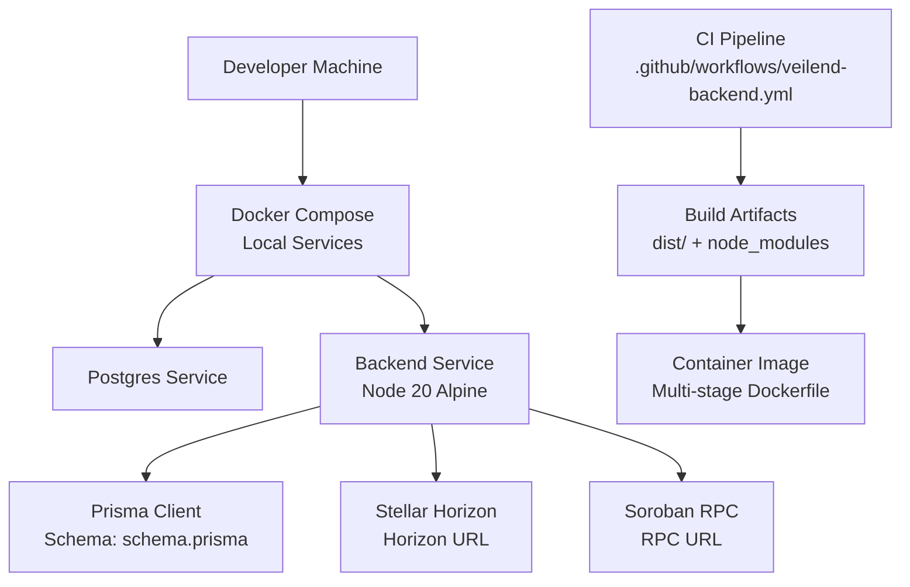
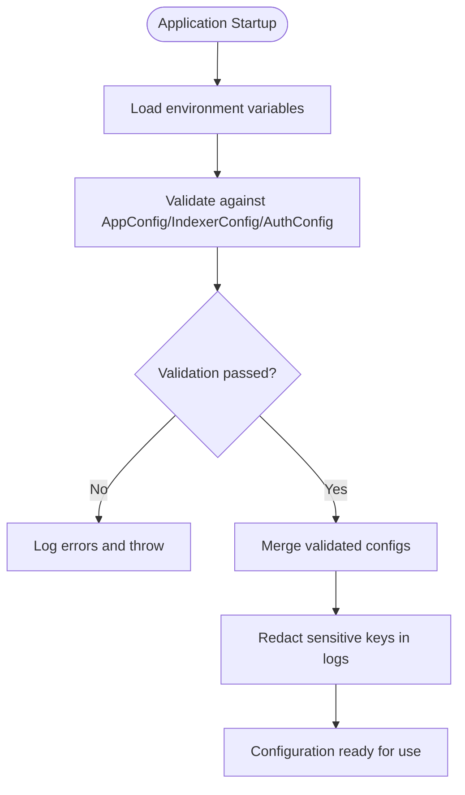
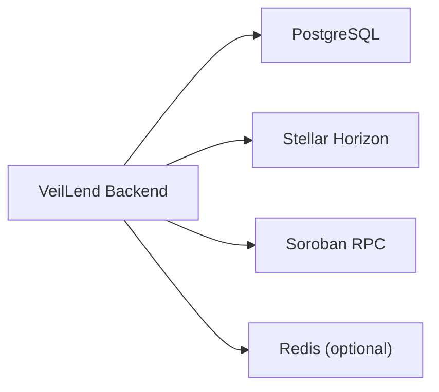

# Configuration and Deployment

<cite>
**Referenced Files in This Document**
- [docker-compose.yml](file://veilend-backend/docker-compose.yml)
- [Dockerfile](file://veilend-backend/Dockerfile)
- [docker-entrypoint.sh](file://veilend-backend/docker-entrypoint.sh)
- [.dockerignore](file://veilend-backend/.dockerignore)
- [package.json](file://veilend-backend/package.json)
- [config.module.ts](file://veilend-backend/src/config/config.module.ts)
- [app-config.service.ts](file://veilend-backend/src/config/app-config.service.ts)
- [validation.ts](file://veilend-backend/src/config/validation.ts)
- [app.config.ts](file://veilend-backend/src/config/app.config.ts)
- [auth.config.ts](file://veilend-backend/src/config/auth.config.ts)
- [indexer.config.ts](file://veilend-backend/src/config/indexer.config.ts)
- [stellar.config.ts](file://veilend-backend/src/stellar/stellar.config.ts)
- [schema.prisma](file://veilend-backend/prisma/schema.prisma)
- [veilend-backend.yml](file://.github/workflows/veilend-backend.yml)
</cite>

## Table of Contents
1. [Introduction](#introduction)
2. [Project Structure](#project-structure)
3. [Core Components](#core-components)
4. [Architecture Overview](#architecture-overview)
5. [Detailed Component Analysis](#detailed-component-analysis)
6. [Dependency Analysis](#dependency-analysis)
7. [Performance Considerations](#performance-considerations)
8. [Troubleshooting Guide](#troubleshooting-guide)
9. [Conclusion](#conclusion)
10. [Appendices](#appendices)

## Introduction
This document provides comprehensive guidance for configuring and deploying the VeilLend backend, focusing on environment setup, containerization, and production deployment strategies. It explains configuration management with multi-environment support and validation, secret management practices, and service-specific configurations for Stellar network endpoints, database connections, and indexing behavior. It also documents Docker-based container orchestration using docker-compose, build pipelines for different environments, and automation strategies to streamline deployments. The content is intended for both DevOps engineers (operational guidance) and developers (configuration reference).

## Project Structure
The VeilLend backend uses a Node.js application built with NestJS, Prisma for database access, and class-validator/class-transformer for configuration validation. Containerization is implemented via a multi-stage Dockerfile and orchestrated locally with docker-compose. GitHub Actions workflows provide CI for the backend.



**Diagram sources**
- [docker-compose.yml:11-48](file://veilend-backend/docker-compose.yml#L11-L48)
- [Dockerfile:5-66](file://veilend-backend/Dockerfile#L5-L66)
- [schema.prisma:5-8](file://veilend-backend/prisma/schema.prisma#L5-L8)
- [veilend-backend.yml:1-200](file://.github/workflows/veilend-backend.yml#L1-L200)

**Section sources**
- [docker-compose.yml:1-52](file://veilend-backend/docker-compose.yml#L1-L52)
- [Dockerfile:1-67](file://veilend-backend/Dockerfile#L1-L67)
- [package.json:8-23](file://veilend-backend/package.json#L8-L23)

## Core Components
- Configuration module and validation: Centralized configuration loading and validation at startup ensures required environment variables are present and correctly typed.
- Environment variables: Application settings, secrets, and external service endpoints are provided via environment variables.
- Database integration: Prisma reads the database connection string from environment variables and manages migrations at runtime.
- Stellar integrations: Horizon and Soroban RPC endpoints are configured via environment variables for testnet/mainnet switching.
- Containerization: Multi-stage Dockerfile builds optimized images; docker-compose orchestrates local services including Postgres and the backend.

Key responsibilities:
- Validate and merge configuration across modules.
- Provide typed accessors for app, auth, indexer, and stellar settings.
- Run database migrations before starting the application.
- Expose health checks for container orchestration.

**Section sources**
- [config.module.ts:12-39](file://veilend-backend/src/config/config.module.ts#L12-L39)
- [app-config.service.ts:5-63](file://veilend-backend/src/config/app-config.service.ts#L5-L63)
- [validation.ts:8-32](file://veilend-backend/src/config/validation.ts#L8-L32)
- [schema.prisma:5-8](file://veilend-backend/prisma/schema.prisma#L5-L8)
- [stellar.config.ts:9-23](file://veilend-backend/src/stellar/stellar.config.ts#L9-L23)

## Architecture Overview
The backend runs inside a container that depends on a Postgres database and external Stellar services (Horizon and Soroban RPC). At startup, the entrypoint executes Prisma migrations and then starts the NestJS server. Configuration is validated against defined schemas to prevent misconfiguration.

```mermaid
sequenceDiagram
participant Dev as "Developer"
participant Compose as "Docker Compose"
participant DB as "Postgres"
participant App as "VeilLend Backend"
participant Entrypoint as "docker-entrypoint.sh"
participant Prisma as "Prisma Migrate"
participant Horizon as "Stellar Horizon"
participant Soroban as "Soroban RPC"
Dev->>Compose : "docker compose up -d"
Compose->>DB : "Start Postgres service"
Compose->>App : "Start backend container"
App->>Entrypoint : "Execute entrypoint"
Entrypoint->>Prisma : "Run pending migrations"
Prisma-->>Entrypoint : "Migrations complete"
Entrypoint->>App : "Start NestJS server"
App->>Horizon : "Read asset/account data"
App->>Soroban : "Query contract state/events"
Note over App,Horizon,Soroban : "All endpoints configured via environment variables"
```

**Diagram sources**
- [docker-compose.yml:11-48](file://veilend-backend/docker-compose.yml#L11-L48)
- [docker-entrypoint.sh:1-10](file://veilend-backend/docker-entrypoint.sh#L1-L10)
- [stellar.config.ts:9-23](file://veilend-backend/src/stellar/stellar.config.ts#L9-L23)

## Detailed Component Analysis

### Configuration Management and Validation
- The configuration system loads environment variables and validates them against typed classes using class-validator.
- Validation occurs during module initialization; errors are logged and thrown if invalid, preventing the app from starting with bad configuration.
- Sensitive keys are redacted in logs to avoid leaking secrets.



**Diagram sources**
- [config.module.ts:17-34](file://veilend-backend/src/config/config.module.ts#L17-L34)
- [validation.ts:8-32](file://veilend-backend/src/config/validation.ts#L8-L32)
- [app.config.ts:3-8](file://veilend-backend/src/config/app.config.ts#L3-L8)
- [auth.config.ts:3-7](file://veilend-backend/src/config/auth.config.ts#L3-L7)
- [indexer.config.ts:3-18](file://veilend-backend/src/config/indexer.config.ts#L3-L18)

**Section sources**
- [config.module.ts:12-39](file://veilend-backend/src/config/config.module.ts#L12-L39)
- [validation.ts:8-32](file://veilend-backend/src/config/validation.ts#L8-L32)
- [app.config.ts:3-8](file://veilend-backend/src/config/app.config.ts#L3-L8)
- [auth.config.ts:3-7](file://veilend-backend/src/config/auth.config.ts#L3-L7)
- [indexer.config.ts:3-18](file://veilend-backend/src/config/indexer.config.ts#L3-L18)

### Environment Variables Reference
- Application port: PORT (default 3000)
- Database connection: DATABASE_URL (PostgreSQL connection string)
- Authentication: JWT_SECRET (used by auth module)
- Stellar network: STELLAR_NETWORK (e.g., testnet, mainnet)
- Stellar Horizon endpoint: STELLAR_HORIZON_URL
- Stellar Soroban RPC endpoint: STELLAR_SOROBAN_RPC_URL
- Stellar network passphrase: STELLAR_NETWORK_PASSPHRASE
- Indexer settings:
  - STELLAR_CONTRACT_ID (contract address)
  - STELLAR_INDEXER_START_LEDGER (start ledger sequence)
  - STELLAR_INDEXER_POLL_INTERVAL_MS (polling interval)
- Throttling: THROTTLE_TTL, THROTTLE_LIMIT, AUTH_THROTTLE_TTL, AUTH_THROTTLE_LIMIT

Notes:
- Defaults are applied where appropriate; ensure secrets like JWT_SECRET are overridden in production.
- Use environment files or platform secret managers to supply values per environment.

**Section sources**
- [app-config.service.ts:12-33](file://veilend-backend/src/config/app-config.service.ts#L12-L33)
- [app-config.service.ts:35-54](file://veilend-backend/src/config/app-config.service.ts#L35-L54)
- [app-config.service.ts:56-62](file://veilend-backend/src/config/app-config.service.ts#L56-L62)
- [stellar.config.ts:9-23](file://veilend-backend/src/stellar/stellar.config.ts#L9-L23)
- [docker-compose.yml:35-45](file://veilend-backend/docker-compose.yml#L35-L45)

### Database Connections and Migrations
- Prisma datasource reads DATABASE_URL from environment variables.
- Migrations are executed automatically at container start via the entrypoint script, ensuring schema consistency.
- Health checks verify the application is reachable; database readiness is enforced by docker-compose dependencies.

Operational guidance:
- Ensure DATABASE_URL points to a reachable PostgreSQL instance.
- Keep migration files under version control; apply them before deploying new versions.
- Use separate databases per environment (dev, staging, prod).

**Section sources**
- [schema.prisma:5-8](file://veilend-backend/prisma/schema.prisma#L5-L8)
- [docker-entrypoint.sh:4-9](file://veilend-backend/docker-entrypoint.sh#L4-L9)
- [docker-compose.yml:11-27](file://veilend-backend/docker-compose.yml#L11-L27)
- [docker-compose.yml:46-48](file://veilend-backend/docker-compose.yml#L46-L48)

### Stellar Network Configuration
- Horizon and Soroban RPC URLs are set via environment variables and consumed by the Stellar service layer.
- Network passphrase can be customized per environment.
- Defaults target testnet; override for mainnet or custom networks.

Best practices:
- Pin endpoints to stable URLs per network.
- Monitor rate limits and consider using dedicated endpoints for production.
- Validate connectivity at startup or via health checks.

**Section sources**
- [stellar.config.ts:9-23](file://veilend-backend/src/stellar/stellar.config.ts#L9-L23)
- [app-config.service.ts:12-33](file://veilend-backend/src/config/app-config.service.ts#L12-L33)

### Secret Management Practices
- Secrets such as JWT_SECRET and DATABASE_URL should never be committed to source control.
- Use environment variables injected by your deployment platform or secret manager.
- Logs redact sensitive keys automatically to reduce exposure risk.

Recommendations:
- Rotate secrets regularly and enforce least privilege access.
- Use distinct secrets per environment.
- Audit logs for accidental secret leaks.

**Section sources**
- [validation.ts:34-50](file://veilend-backend/src/config/validation.ts#L34-L50)
- [docker-compose.yml:35-45](file://veilend-backend/docker-compose.yml#L35-L45)

### Containerization and Build Artifacts
- Multi-stage Dockerfile separates dependency installation, build, and production runtime stages.
- Production image installs only runtime dependencies and generates Prisma client.
- Entrypoint runs migrations before starting the application.
- .dockerignore excludes unnecessary files to keep images small and secure.

Build pipeline:
- CI builds the application and produces dist artifacts.
- Images are tagged per environment and pushed to a registry.
- Deployments pull the appropriate image and inject environment variables.

**Section sources**
- [Dockerfile:5-66](file://veilend-backend/Dockerfile#L5-L66)
- [docker-entrypoint.sh:4-9](file://veilend-backend/docker-entrypoint.sh#L4-L9)
- [.dockerignore:1-22](file://veilend-backend/.dockerignore#L1-L22)
- [package.json:8-23](file://veilend-backend/package.json#L8-L23)

### Local Development Setup
- Use docker-compose to start Postgres and the backend with preconfigured environment variables for testnet.
- Follow logs and manage volumes for persistent database state.
- Seed the database if needed using provided scripts.

Steps:
- Start services with docker-compose.
- Verify health endpoint availability.
- Run tests and linting locally.

**Section sources**
- [docker-compose.yml:1-52](file://veilend-backend/docker-compose.yml#L1-L52)
- [package.json:8-23](file://veilend-backend/package.json#L8-L23)

### Production Deployment Strategies
- Orchestration:
  - Use container orchestration platforms (Kubernetes, managed containers) to deploy the backend image.
  - Inject environment variables through platform secret stores.
  - Configure resource limits, replicas, and scaling policies based on load.
- CI/CD:
  - Automate builds and tests via GitHub Actions workflow for the backend.
  - Publish images with semantic tags and promote across environments.
- Rollouts:
  - Implement blue/green or rolling updates to minimize downtime.
  - Validate health endpoints post-deploy.

**Section sources**
- [veilend-backend.yml:1-200](file://.github/workflows/veilend-backend.yml#L1-L200)
- [Dockerfile:33-66](file://veilend-backend/Dockerfile#L33-L66)

### Monitoring and Observability
- Health check:
  - Container exposes a health endpoint used by orchestration tools to probe liveness/readiness.
- Logging:
  - Structured logs with correlation IDs aid debugging across services.
- Metrics:
  - Integrate metrics collection (e.g., Prometheus) for request rates, latency, and error rates.
- External dependencies:
  - Monitor Stellar Horizon/Soroban RPC availability and latency.

**Section sources**
- [Dockerfile:62-63](file://veilend-backend/Dockerfile#L62-L63)
- [common/logging/logging.interceptor.ts:1-200](file://veilend-backend/src/common/logging/logging.interceptor.ts#L1-L200)

## Dependency Analysis
The backend depends on:
- PostgreSQL for persistent storage (via Prisma).
- Stellar Horizon for account and transaction queries.
- Soroban RPC for contract interactions and event streaming.
- Optional Redis for throttling/session storage (as indicated by dependencies).



**Diagram sources**
- [schema.prisma:5-8](file://veilend-backend/prisma/schema.prisma#L5-L8)
- [stellar.config.ts:9-23](file://veilend-backend/src/stellar/stellar.config.ts#L9-L23)
- [package.json:25-45](file://veilend-backend/package.json#L25-L45)

**Section sources**
- [package.json:25-45](file://veilend-backend/package.json#L25-L45)
- [stellar.config.ts:9-23](file://veilend-backend/src/stellar/stellar.config.ts#L9-L23)
- [schema.prisma:5-8](file://veilend-backend/prisma/schema.prisma#L5-L8)

## Performance Considerations
- Connection pooling:
  - Tune database connection pool size based on expected concurrency.
- Polling intervals:
  - Adjust indexer poll intervals to balance freshness and load.
- Rate limiting:
  - Configure throttle TTL and limits to protect endpoints.
- Resource allocation:
  - Set CPU/memory limits for containers to ensure stability under load.
- Caching:
  - Consider caching frequently accessed data (e.g., asset metadata) to reduce external calls.

[No sources needed since this section provides general guidance]

## Troubleshooting Guide
Common issues and resolutions:
- Configuration validation failures:
  - Check missing or invalid environment variables; review logs for detailed constraints.
- Database connectivity:
  - Ensure DATABASE_URL is correct and Postgres is reachable; verify migrations ran successfully.
- Stellar endpoint errors:
  - Confirm Horizon and Soroban RPC URLs match the selected network; check network passphrase.
- Container health checks failing:
  - Inspect application logs; verify health endpoint responds with success.
- Migration errors:
  - Review migration files and database state; rollback if necessary and reapply.

Operational tips:
- Use docker-compose logs to follow real-time output.
- Validate configuration locally before pushing images.
- Maintain separate environment files for each target and never commit secrets.

**Section sources**
- [validation.ts:8-32](file://veilend-backend/src/config/validation.ts#L8-L32)
- [docker-entrypoint.sh:4-9](file://veilend-backend/docker-entrypoint.sh#L4-L9)
- [docker-compose.yml:35-45](file://veilend-backend/docker-compose.yml#L35-L45)
- [Dockerfile:62-63](file://veilend-backend/Dockerfile#L62-L63)

## Conclusion
VeilLend’s backend employs robust configuration validation, secure secret handling, and containerized deployment with clear separation between development and production concerns. By following the environment variable references, leveraging docker-compose for local development, and automating builds and deployments via CI/CD, teams can reliably operate the service across environments. Proper monitoring, scaling, and troubleshooting practices ensure operational excellence in production.

[No sources needed since this section summarizes without analyzing specific files]

## Appendices

### Local Development Commands
- Start services: docker compose up -d
- Follow logs: docker compose logs -f
- Stop and remove volumes: docker compose down -v

**Section sources**
- [docker-compose.yml:1-9](file://veilend-backend/docker-compose.yml#L1-L9)

### Build and Test Scripts
- Build: npm run build
- Start dev: npm run start:dev
- Start prod: npm run start:prod
- Tests: npm run test
- E2E tests: npm run test:e2e

**Section sources**
- [package.json:8-23](file://veilend-backend/package.json#L8-L23)