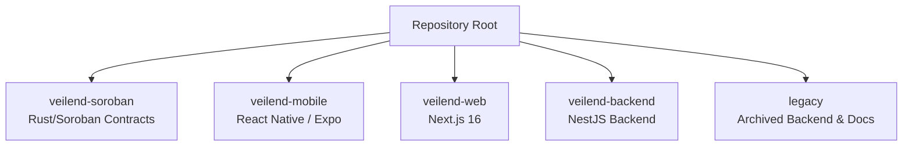
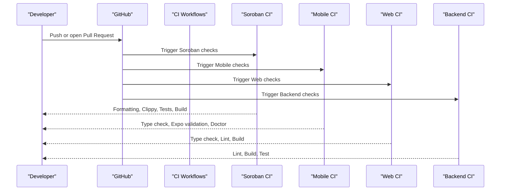
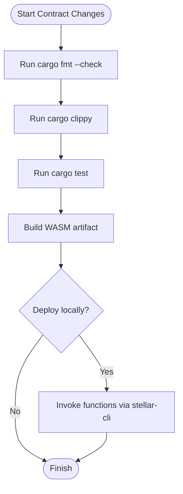
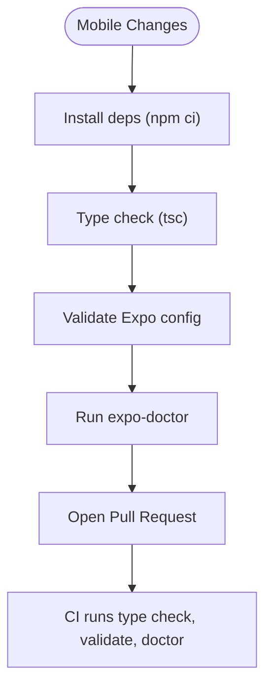
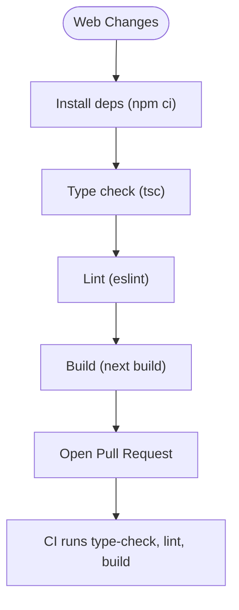
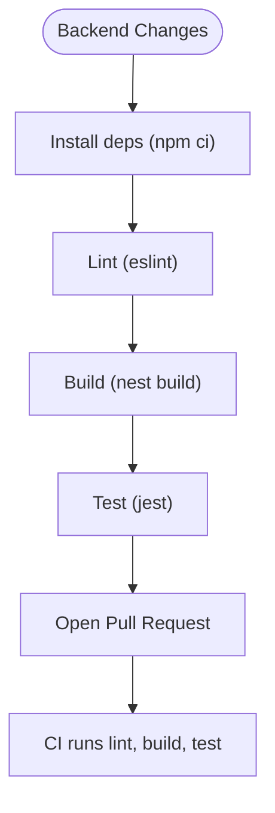
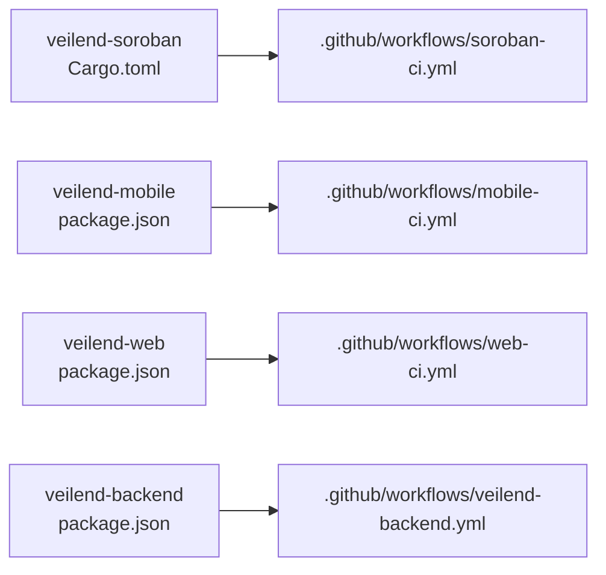

# Contributing Guide

<cite>
**Referenced Files in This Document**
- [README.md](file://README.md)
- [pull_request_template.md](file://.github/pull_request_template.md)
- [soroban-ci.yml](file://.github/workflows/soroban-ci.yml)
- [mobile-ci.yml](file://.github/workflows/mobile-ci.yml)
- [web-ci.yml](file://.github/workflows/web-ci.yml)
- [veilend-backend.yml](file://.github/workflows/veilend-backend.yml)
- [CONTRIBUTING_SOROBAN.md](file://legacy/docs/CONTRIBUTING_SOROBAN.md)
- [Cargo.toml](file://veilend-soroban/Cargo.toml)
- [package.json (mobile)](file://veilend-mobile/package.json)
- [package.json (web)](file://veilend-web/package.json)
- [package.json (backend)](file://veilend-backend/package.json)
</cite>

## Table of Contents
1. Introduction
2. Project Structure
3. Core Components
4. Architecture Overview
5. Detailed Component Analysis
6. Dependency Analysis
7. Performance Considerations
8. Troubleshooting Guide
9. Conclusion
10. Appendices

## Introduction
This guide helps contributors set up their development environment, follow coding standards, and submit pull requests for the VeilLend privacy-first lending protocol on Stellar/Soroban. It covers smart contracts (Rust/Soroban), mobile app (React Native/Expo), web application (Next.js), and backend services. You will find environment setup steps, testing requirements, code review expectations, and contribution workflows aligned with the repository’s CI pipelines and templates.

## Project Structure
VeilLend is organized into active workspaces and an archived legacy backend:
- veilend-soroban: Rust/Soroban smart contract workspace
- veilend-mobile: React Native/Expo mobile app
- veilend-web: Next.js 16 web application
- veilend-backend: New backend under development (current CI targets this path)
- legacy: Archived NestJS backend and migration/contributor docs

**Section sources**
- [README.md:17-39](file://README.md#L17-L39)

## Core Components
- Smart Contracts (Soroban/Rust): Lending state, asset configuration, oracle-backed collateral valuation, events for indexing, and typed errors for robust client handling.
- Mobile App: Wallet-driven onboarding, deposit/borrow/repay flows, privacy mode toggle, and protocol status banners.
- Web App: Privacy-first interface using Next.js App Router, Tailwind CSS, and TypeScript.
- Backend Services: Planned Stellar-native backend; current CI validates linting, build, and tests for the new backend workspace.

**Section sources**
- [README.md:42-58](file://README.md#L42-L58)
- [README.md:88-107](file://README.md#L88-L107)
- [README.md:157-163](file://README.md#L157-L163)

## Architecture Overview
The contributor workflow integrates local development with GitHub Actions CI to ensure quality across components.

**Diagram sources**
- [soroban-ci.yml:1-71](file://.github/workflows/soroban-ci.yml#L1-L71)
- [mobile-ci.yml:1-58](file://.github/workflows/mobile-ci.yml#L1-L58)
- [web-ci.yml:1-54](file://.github/workflows/web-ci.yml#L1-L54)
- [veilend-backend.yml:1-44](file://.github/workflows/veilend-backend.yml#L1-L44)

## Detailed Component Analysis

### Smart Contracts (Soroban/Rust)
- Environment setup: Install Rust toolchain, add WASM target, install Soroban CLI, configure networks, and optionally run a local Stellar network via Docker.
- Build and test: Use Cargo to format, lint, test, and build WASM artifacts; use Stellar CLI to build contract artifacts.
- Error model: Typed contract errors with distinct codes for zero vs negative amounts, missing oracle prices, unauthorized access, and pause states.

**Diagram sources**
- [CONTRIBUTING_SOROBAN.md:627-693](file://legacy/docs/CONTRIBUTING_SOROBAN.md#L627-L693)
- [soroban-ci.yml:49-70](file://.github/workflows/soroban-ci.yml#L49-L70)

**Section sources**
- [CONTRIBUTING_SOROBAN.md:60-120](file://legacy/docs/CONTRIBUTING_SOROBAN.md#L60-L120)
- [CONTRIBUTING_SOROBAN.md:124-194](file://legacy/docs/CONTRIBUTING_SOROBAN.md#L124-L194)
- [CONTRIBUTING_SOROBAN.md:198-291](file://legacy/docs/CONTRIBUTING_SOROBAN.md#L198-L291)
- [CONTRIBUTING_SOROBAN.md:627-693](file://legacy/docs/CONTRIBUTING_SOROBAN.md#L627-L693)
- [README.md:42-85](file://README.md#L42-L85)
- [Cargo.toml:1-15](file://veilend-soroban/Cargo.toml#L1-L15)
- [soroban-ci.yml:36-70](file://.github/workflows/soroban-ci.yml#L36-L70)

### Mobile App (React Native / Expo)
- Local development: Install dependencies and start the Expo dev server; use Expo Go for device testing.
- Testing and validation: Run unit tests via the project script; validate Expo configuration and run doctor checks.
- CI pipeline: Type checking, Expo config validation, and doctor checks on PRs and pushes to main.

**Diagram sources**
- [package.json (mobile):5-12](file://veilend-mobile/package.json#L5-L12)
- [mobile-ci.yml:36-57](file://.github/workflows/mobile-ci.yml#L36-L57)

**Section sources**
- [README.md:110-153](file://README.md#L110-L153)
- [package.json (mobile):5-12](file://veilend-mobile/package.json#L5-L12)
- [mobile-ci.yml:36-57](file://.github/workflows/mobile-ci.yml#L36-L57)

### Web App (Next.js 16)
- Scripts: Development server, build, lint, formatting, type checking, and tests.
- CI pipeline: Type check, lint, and build on changes to the web workspace.

**Diagram sources**
- [package.json (web):5-13](file://veilend-web/package.json#L5-L13)
- [web-ci.yml:36-53](file://.github/workflows/web-ci.yml#L36-L53)

**Section sources**
- [package.json (web):5-13](file://veilend-web/package.json#L5-L13)
- [web-ci.yml:36-53](file://.github/workflows/web-ci.yml#L36-L53)

### Backend Services (NestJS)
- Scripts: Build, format, lint, test, seed, and e2e tests.
- CI pipeline: Lint, build, and test on changes to the backend workspace.

**Diagram sources**
- [package.json (backend):8-24](file://veilend-backend/package.json#L8-L24)
- [veilend-backend.yml:23-43](file://.github/workflows/veilend-backend.yml#L23-L43)

**Section sources**
- [package.json (backend):8-24](file://veilend-backend/package.json#L8-L24)
- [veilend-backend.yml:23-43](file://.github/workflows/veilend-backend.yml#L23-L43)

## Dependency Analysis
Each component has its own dependency management and CI gates:
- Soroban: Rust toolchain and Soroban SDK pinned in Cargo metadata; CI enforces formatting, linting, tests, and WASM build.
- Mobile: Expo-based dependencies; CI enforces type checking, Expo config validation, and doctor checks.
- Web: Next.js ecosystem; CI enforces type checking, linting, and build.
- Backend: NestJS ecosystem; CI enforces linting, building, and testing.

**Diagram sources**
- [Cargo.toml:1-15](file://veilend-soroban/Cargo.toml#L1-L15)
- [package.json (mobile):5-12](file://veilend-mobile/package.json#L5-L12)
- [package.json (web):5-13](file://veilend-web/package.json#L5-L13)
- [package.json (backend):8-24](file://veilend-backend/package.json#L8-L24)
- [soroban-ci.yml:1-71](file://.github/workflows/soroban-ci.yml#L1-L71)
- [mobile-ci.yml:1-58](file://.github/workflows/mobile-ci.yml#L1-L58)
- [web-ci.yml:1-54](file://.github/workflows/web-ci.yml#L1-L54)
- [veilend-backend.yml:1-44](file://.github/workflows/veilend-backend.yml#L1-L44)

**Section sources**
- [soroban-ci.yml:36-70](file://.github/workflows/soroban-ci.yml#L36-L70)
- [mobile-ci.yml:36-57](file://.github/workflows/mobile-ci.yml#L36-L57)
- [web-ci.yml:36-53](file://.github/workflows/web-ci.yml#L36-L53)
- [veilend-backend.yml:23-43](file://.github/workflows/veilend-backend.yml#L23-L43)

## Performance Considerations
- Keep Soroban contracts minimal and efficient; avoid heavy computations on-chain and rely on off-chain indexing where appropriate.
- Prefer deterministic logic and clear error paths to reduce gas usage and improve predictability.
- For mobile and web, leverage lazy loading and code splitting to reduce bundle sizes and improve startup times.
- Use caching strategies in the backend for read-heavy endpoints and optimize database queries through proper indexing.

[No sources needed since this section provides general guidance]

## Troubleshooting Guide
- Soroban setup issues: Ensure Rust toolchain includes the wasm32 target; verify Soroban CLI installation and network configurations; confirm Docker is running if using a local network.
- CI failures: Check formatting and linting rules enforced by CI; ensure tests pass locally before pushing; verify Node versions match CI settings for web/mobile/backend.
- Mobile-specific: If Expo doctor reports issues, update dependencies or adjust peer dependencies as indicated; ensure environment variables are correctly set for local builds.
- Backend: Validate Prisma migrations and seeds; ensure environment variables for databases and external services are configured.

**Section sources**
- [CONTRIBUTING_SOROBAN.md:775-800](file://legacy/docs/CONTRIBUTING_SOROBAN.md#L775-L800)
- [mobile-ci.yml:36-57](file://.github/workflows/mobile-ci.yml#L36-L57)
- [web-ci.yml:36-53](file://.github/workflows/web-ci.yml#L36-L53)
- [veilend-backend.yml:23-43](file://.github/workflows/veilend-backend.yml#L23-L43)

## Conclusion
By following this guide, contributors can confidently set up environments, write and test code across components, and submit high-quality pull requests that pass CI checks. Engage with the community, participate in code reviews, and help evolve VeilLend’s privacy-first lending protocol on Stellar.

[No sources needed since this section summarizes without analyzing specific files]

## Appendices

### Contribution Workflow
- Identify an issue or propose a feature via Discussions.
- Fork the repository and create a feature branch.
- Implement changes with tests and documentation updates.
- Open a pull request against main using the provided template.
- Address reviewer feedback and ensure all CI checks pass.

**Section sources**
- [README.md:203-214](file://README.md#L203-L214)
- [pull_request_template.md:1-33](file://.github/pull_request_template.md#L1-L33)

### Code Style Guidelines
- Soroban: Use rustfmt and clippy; enforce warnings as errors in CI.
- Mobile/Web/Backend: Follow ESLint and Prettier configurations; run type checks and linters locally before committing.

**Section sources**
- [soroban-ci.yml:49-53](file://.github/workflows/soroban-ci.yml#L49-L53)
- [web-ci.yml:46-50](file://.github/workflows/web-ci.yml#L46-L50)
- [veilend-backend.yml:36-40](file://.github/workflows/veilend-backend.yml#L36-L40)

### Testing Requirements
- Soroban: Unit and integration tests via Cargo; build WASM artifacts.
- Mobile: Unit tests via project scripts; validate Expo configuration and run doctor.
- Web: Unit tests via Vitest; type check and lint.
- Backend: Jest unit tests and e2e tests; build and lint.

**Section sources**
- [README.md:185-194](file://README.md#L185-L194)
- [package.json (mobile):5-12](file://veilend-mobile/package.json#L5-L12)
- [package.json (web):5-13](file://veilend-web/package.json#L5-L13)
- [package.json (backend):8-24](file://veilend-backend/package.json#L8-L24)
- [soroban-ci.yml:55-70](file://.github/workflows/soroban-ci.yml#L55-L70)
- [mobile-ci.yml:50-57](file://.github/workflows/mobile-ci.yml#L50-L57)
- [web-ci.yml:46-53](file://.github/workflows/web-ci.yml#L46-L53)
- [veilend-backend.yml:36-43](file://.github/workflows/veilend-backend.yml#L36-L43)

### Deployment Pipelines
- Mobile: Use Expo CLI for over-the-air updates or app store builds.
- Contracts: Build and deploy from the Soroban workspace using Cargo and Stellar CLI.
- Backend: The new Stellar-native backend will be introduced after the archived implementation is replaced.

**Section sources**
- [README.md:196-201](file://README.md#L196-L201)

### Community and Recognition
- Monthly Wave Contributor Program: Contribute to VeilLend on Stellar, earn rewards through the Drips contributor program, collaborate with experienced developers, and gain experience with Soroban, Rust, and multi-chain development.
- Communication channels: Refer to Stellar Discord and repository resources for support and collaboration.

**Section sources**
- [README.md:170-183](file://README.md#L170-L183)
- [README.md:216-220](file://README.md#L216-L220)