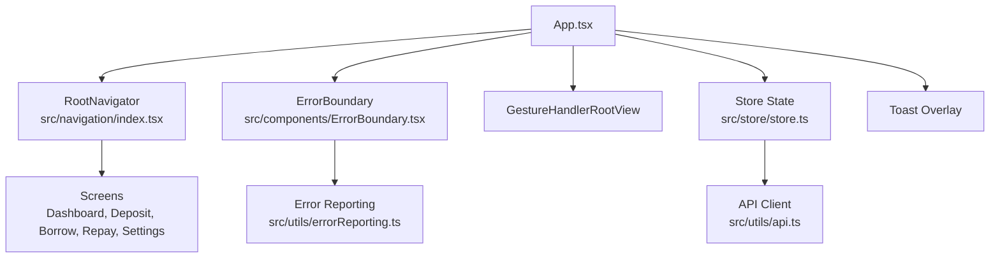
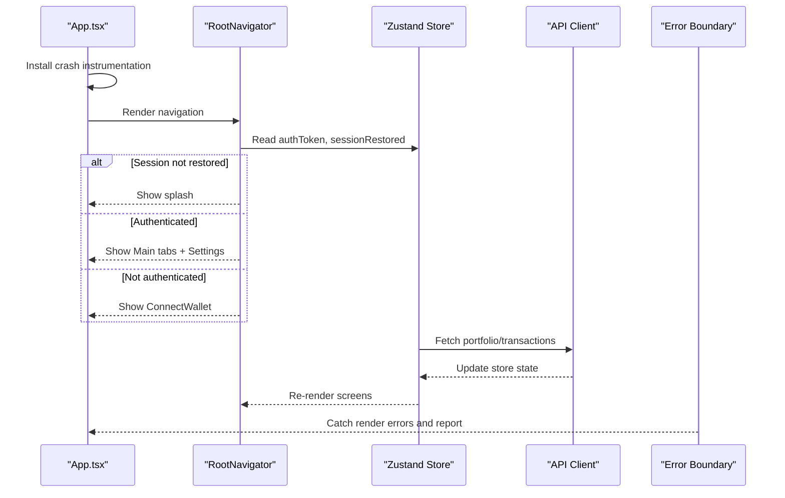
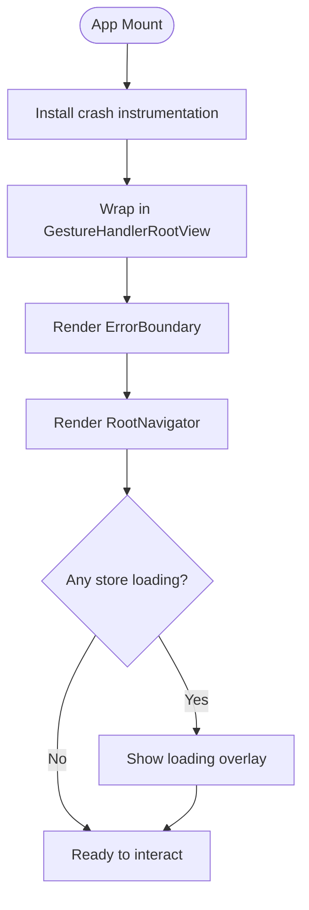
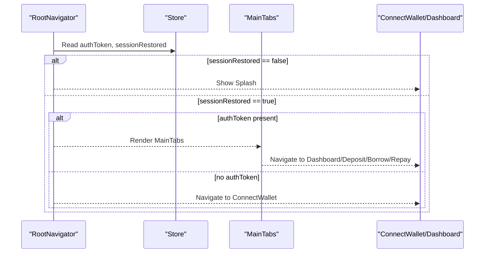
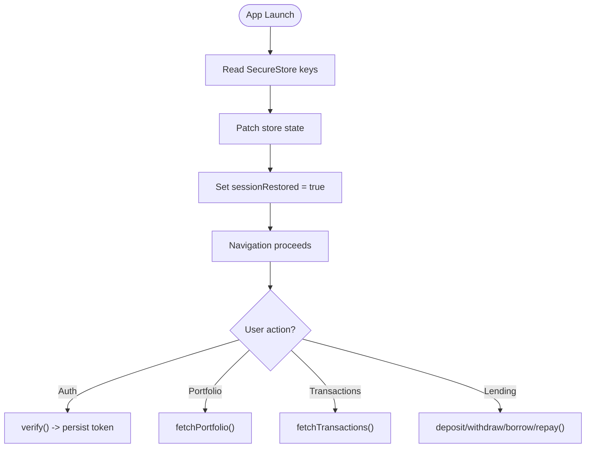
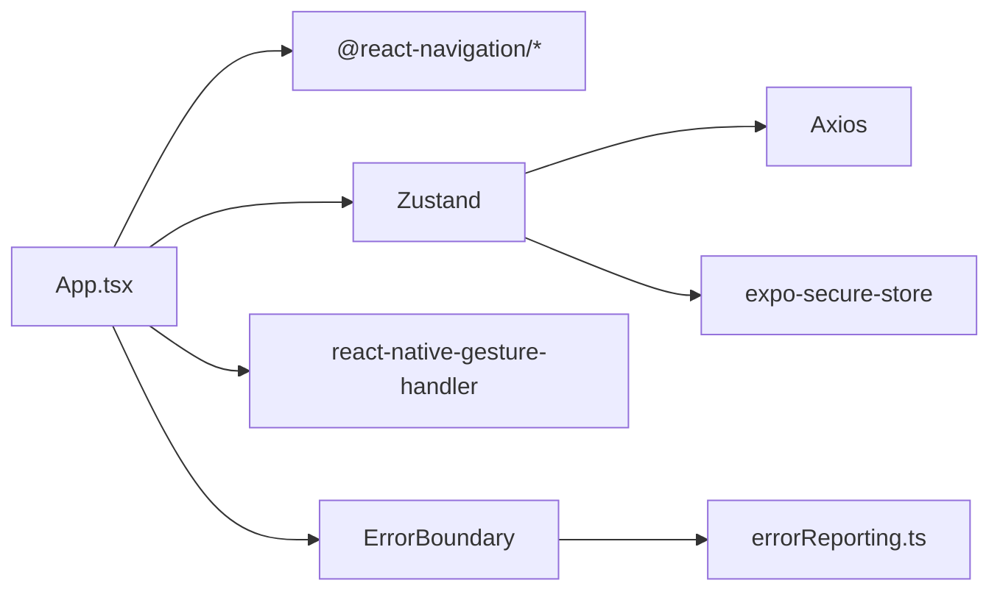

# App Architecture & Setup

<cite>
**Referenced Files in This Document**
- [App.tsx](file://veilend-mobile/App.tsx)
- [index.tsx](file://veilend-mobile/src/navigation/index.tsx)
- [store.ts](file://veilend-mobile/src/store/store.ts)
- [ErrorBoundary.tsx](file://veilend-mobile/src/components/ErrorBoundary.tsx)
- [errorReporting.ts](file://veilend-mobile/src/utils/errorReporting.ts)
- [api.ts](file://veilend-mobile/src/utils/api.ts)
- [package.json](file://veilend-mobile/package.json)
- [app.json](file://veilend-mobile/app.json)
- [tsconfig.json](file://veilend-mobile/tsconfig.json)
- [babel.config.js](file://veilend-mobile/babel.config.js)
- [tailwind.config.js](file://veilend-mobile/tailwind.config.js)
</cite>

## Table of Contents
1. [Introduction](#introduction)
2. [Project Structure](#project-structure)
3. [Core Components](#core-components)
4. [Architecture Overview](#architecture-overview)
5. [Detailed Component Analysis](#detailed-component-analysis)
6. [Dependency Analysis](#dependency-analysis)
7. [Performance Considerations](#performance-considerations)
8. [Troubleshooting Guide](#troubleshooting-guide)
9. [Conclusion](#conclusion)
10. [Appendices](#appendices)

## Introduction
This document explains the mobile application architecture for the Veillend React Native/Expo app. It focuses on how the app initializes, how navigation is structured with React Navigation, how global state is managed via a Zustand store, how errors are captured and reported through an error boundary and crash instrumentation, and how loading states are handled across the UI. It also covers project configuration including Expo setup, dependencies, TypeScript configuration, and build process. The goal is to help developers understand both the conceptual structure and the technical implementation details required to set up and extend the development environment.

## Project Structure
The mobile app lives under veilend-mobile and follows a feature-oriented layout:
- Entry point and root component orchestration
- Navigation stack and tab navigator
- Global store (Zustand) with persistence and async flows
- Error boundary and centralized error reporting utilities
- API client with interceptors for auth and error handling
- Configuration files for Expo, TypeScript, Babel, Tailwind/NativeWind



**Diagram sources**
- [App.tsx:14-37](file://veilend-mobile/App.tsx#L14-L37)
- [index.tsx:15-86](file://veilend-mobile/src/navigation/index.tsx#L15-L86)
- [store.ts:99-396](file://veilend-mobile/src/store/store.ts#L99-L396)
- [ErrorBoundary.tsx:25-83](file://veilend-mobile/src/components/ErrorBoundary.tsx#L25-L83)
- [errorReporting.ts:182-211](file://veilend-mobile/src/utils/errorReporting.ts#L182-L211)
- [api.ts:12-54](file://veilend-mobile/src/utils/api.ts#L12-L54)

**Section sources**
- [App.tsx:14-37](file://veilend-mobile/App.tsx#L14-L37)
- [index.tsx:15-86](file://veilend-mobile/src/navigation/index.tsx#L15-L86)
- [store.ts:99-396](file://veilend-mobile/src/store/store.ts#L99-L396)
- [ErrorBoundary.tsx:25-83](file://veilend-mobile/src/components/ErrorBoundary.tsx#L25-L83)
- [errorReporting.ts:182-211](file://veilend-mobile/src/utils/errorReporting.ts#L182-L211)
- [api.ts:12-54](file://veilend-mobile/src/utils/api.ts#L12-L54)

## Core Components
- App initialization:
  - Wraps the app in a gesture handler root view for smooth interactions.
  - Installs global crash instrumentation once at module load.
  - Renders the navigation stack inside an error boundary.
  - Displays a full-screen loading overlay when any critical store loading flags are true.
  - Shows a global toast container for user feedback.

- Navigation hierarchy:
  - Root navigator conditionally shows a splash while session restoration completes.
  - After hydration, navigates to ConnectWallet if no token exists; otherwise to Main tabs and Settings.
  - Main tabs include Dashboard, Deposit, Borrow, Repay with consistent tab styling and icons.

- Global state management (Zustand):
  - Centralized store includes authentication, UI preferences, lending operations, and portfolio data.
  - Persists sensitive keys using SecureStore (with a fallback shim).
  - Hydrates store from SecureStore on launch and sets sessionRestored to control initial navigation.

- Error boundary:
  - Catches rendering errors within its subtree, reports them with PII scrubbing, and renders a friendly fallback with retry.

- Loading state management:
  - App-level overlay uses store flags to indicate ongoing auth, lending, or shielded operations.
  - Screens handle their own loading/error states for data fetching.

**Section sources**
- [App.tsx:14-37](file://veilend-mobile/App.tsx#L14-L37)
- [index.tsx:47-86](file://veilend-mobile/src/navigation/index.tsx#L47-L86)
- [store.ts:99-396](file://veilend-mobile/src/store/store.ts#L99-L396)
- [ErrorBoundary.tsx:25-83](file://veilend-mobile/src/components/ErrorBoundary.tsx#L25-L83)

## Architecture Overview
The app bootstraps by installing crash instrumentation and then renders the root component tree. The navigation layer decides which screens to show based on persisted session state. All network requests go through a centralized API client that injects auth tokens and captures errors. Store actions coordinate UI updates and persistence. Errors are caught by the error boundary and reported with structured metadata.



**Diagram sources**
- [App.tsx:14-37](file://veilend-mobile/App.tsx#L14-L37)
- [index.tsx:56-86](file://veilend-mobile/src/navigation/index.tsx#L56-L86)
- [store.ts:321-362](file://veilend-mobile/src/store/store.ts#L321-L362)
- [api.ts:16-54](file://veilend-mobile/src/utils/api.ts#L16-L54)
- [ErrorBoundary.tsx:35-48](file://veilend-mobile/src/components/ErrorBoundary.tsx#L35-L48)

## Detailed Component Analysis

### App Initialization and Gesture Handling
- The root component wraps everything in a gesture handler root view to enable smooth gestures across the app.
- Crash instrumentation is installed once at module load to capture unhandled errors globally.
- An error boundary wraps the navigation to catch rendering errors.
- A loading overlay appears when any of the store’s loading flags are true, preventing interaction until data is ready.
- Toast notifications are rendered globally for user feedback.



**Diagram sources**
- [App.tsx:14-37](file://veilend-mobile/App.tsx#L14-L37)

**Section sources**
- [App.tsx:14-37](file://veilend-mobile/App.tsx#L14-L37)

### Navigation Hierarchy with React Navigation
- Root navigator waits for session restoration before deciding the initial screen to avoid flashing the connect wallet screen.
- If no auth token exists, it routes to ConnectWallet; otherwise, it shows the main tab navigator and settings.
- Main tabs provide quick access to core features: Dashboard, Deposit, Borrow, Repay.



**Diagram sources**
- [index.tsx:56-86](file://veilend-mobile/src/navigation/index.tsx#L56-L86)

**Section sources**
- [index.tsx:15-86](file://veilend-mobile/src/navigation/index.tsx#L15-L86)

### Global State Management with Zustand Store
- Store types define authentication, UI, lending, and portfolio slices.
- Persistence:
  - Uses SecureStore when available; falls back to a local shim.
  - Persists keys such as auth token, address, privacy mode, profile info, currency, and notifications.
- Session hydration:
  - On app start, reads all persisted keys concurrently and patches store state.
  - Sets sessionRestored to true so navigation can proceed without flashing login.
- Async flows:
  - requestNonce and verify handle authentication flow and persist token.
  - Portfolio and transactions fetchers update store state and handle errors.
  - Lending methods currently return mock transactions but follow the same loading pattern.



**Diagram sources**
- [store.ts:99-396](file://veilend-mobile/src/store/store.ts#L99-L396)

**Section sources**
- [store.ts:99-396](file://veilend-mobile/src/store/store.ts#L99-L396)

### Error Boundary Implementation
- Captures rendering errors in its child tree.
- Reports errors with structured metadata and PII scrubbing.
- Provides a default fallback UI with a retry button to reset state.
- Supports custom fallback content via props.

```mermaid
classDiagram
class ErrorBoundary {
+render()
+componentDidCatch(error, errorInfo)
+handleRetry()
-state.hasError
-state.errorReport
}
ErrorBoundary --> Report["reportError()"]
```

**Diagram sources**
- [ErrorBoundary.tsx:25-83](file://veilend-mobile/src/components/ErrorBoundary.tsx#L25-L83)
- [errorReporting.ts:182-211](file://veilend-mobile/src/utils/errorReporting.ts#L182-L211)

**Section sources**
- [ErrorBoundary.tsx:25-83](file://veilend-mobile/src/components/ErrorBoundary.tsx#L25-L83)

### Loading State Management
- App-level overlay uses store flags to prevent interaction during critical operations.
- Screens manage their own loading and error states for data fetching.
- Consistent UX: spinner overlays and retry options where appropriate.

**Section sources**
- [App.tsx:14-37](file://veilend-mobile/App.tsx#L14-L37)
- [store.ts:254-308](file://veilend-mobile/src/store/store.ts#L254-L308)
- [store.ts:321-362](file://veilend-mobile/src/store/store.ts#L321-L362)

## Dependency Analysis
Key runtime dependencies and their roles:
- React Navigation: native stack and bottom tabs for navigation.
- Zustand: lightweight global state with persistence.
- Expo ecosystem: status bar, fonts, image picker, secure store, linear gradient.
- Gesture handler and reanimated: smooth gestures and animations.
- Axios: HTTP client with interceptors for auth and error reporting.
- NativeWind/Tailwind: utility-first styling.
- Toast message: global user feedback.



**Diagram sources**
- [package.json:13-44](file://veilend-mobile/package.json#L13-L44)
- [api.ts:12-54](file://veilend-mobile/src/utils/api.ts#L12-L54)
- [store.ts:1-13](file://veilend-mobile/src/store/store.ts#L1-L13)
- [errorReporting.ts:16-26](file://veilend-mobile/src/utils/errorReporting.ts#L16-L26)

**Section sources**
- [package.json:13-44](file://veilend-mobile/package.json#L13-L44)

## Performance Considerations
- Minimize re-renders by selecting only needed store slices in components.
- Use lazy loading for heavy screens if needed.
- Debounce or throttle frequent store updates (e.g., protocol status refresh).
- Keep SecureStore operations asynchronous and batch where possible.
- Avoid unnecessary network calls by caching responses in the store.

[No sources needed since this section provides general guidance]

## Troubleshooting Guide
Common issues and resolutions:
- App stuck on splash:
  - Ensure session restoration completes and sets sessionRestored to true.
  - Check SecureStore availability and permissions.
- Authentication failures:
  - Verify token presence and expiration; handle 401 responses appropriately.
  - Review API interceptor error severity classification.
- Navigation glitches:
  - Confirm sessionRestored logic prevents premature routing.
  - Validate tab and stack configurations.
- Rendering crashes:
  - Inspect error boundary reports and stored error logs.
  - Use provided retry mechanism to recover from transient errors.

**Section sources**
- [store.ts:369-396](file://veilend-mobile/src/store/store.ts#L369-L396)
- [api.ts:24-54](file://veilend-mobile/src/utils/api.ts#L24-L54)
- [ErrorBoundary.tsx:35-83](file://veilend-mobile/src/components/ErrorBoundary.tsx#L35-L83)
- [errorReporting.ts:182-211](file://veilend-mobile/src/utils/errorReporting.ts#L182-L211)

## Conclusion
The Veillend mobile app uses a clear separation of concerns: a minimal root component orchestrating gesture handling, error boundaries, and navigation; a robust Zustand store for global state with secure persistence; and a centralized API client for consistent networking and error reporting. The navigation layer ensures a smooth user experience by deferring route decisions until session restoration completes. Together, these patterns provide a scalable foundation for adding new features and maintaining reliability.

[No sources needed since this section summarizes without analyzing specific files]

## Appendices

### Project Configuration
- Expo setup:
  - App name, slug, version, orientation, and platform-specific identifiers.
  - Plugins for secure storage and extra configuration for EAS builds.
- Dependencies:
  - Navigation, gesture handling, animations, networking, and UI libraries.
- TypeScript configuration:
  - Strict mode enabled, React Native JSX target, ES2020 lib, module resolution.
- Build process:
  - Babel preset for Expo with NativeWind and Reanimated plugins.
  - Tailwind configuration for theme colors and content scanning.

**Section sources**
- [app.json:1-41](file://veilend-mobile/app.json#L1-L41)
- [package.json:1-57](file://veilend-mobile/package.json#L1-L57)
- [tsconfig.json:1-29](file://veilend-mobile/tsconfig.json#L1-L29)
- [babel.config.js:1-11](file://veilend-mobile/babel.config.js#L1-L11)
- [tailwind.config.js:1-18](file://veilend-mobile/tailwind.config.js#L1-L18)

### Practical Examples

- App initialization:
  - Install crash instrumentation at module load.
  - Wrap the app in a gesture handler root view and error boundary.
  - Render navigation and global toast overlay.

- Store configuration:
  - Define typed slices for auth, UI, lending, and portfolio.
  - Persist sensitive keys using SecureStore and hydrate on launch.
  - Provide async methods for authentication and data fetching.

- Navigation setup:
  - Create a native stack navigator for top-level routes.
  - Create a bottom tab navigator for core features.
  - Conditionally render splash while restoring session.

**Section sources**
- [App.tsx:14-37](file://veilend-mobile/App.tsx#L14-L37)
- [store.ts:99-396](file://veilend-mobile/src/store/store.ts#L99-L396)
- [index.tsx:15-86](file://veilend-mobile/src/navigation/index.tsx#L15-L86)