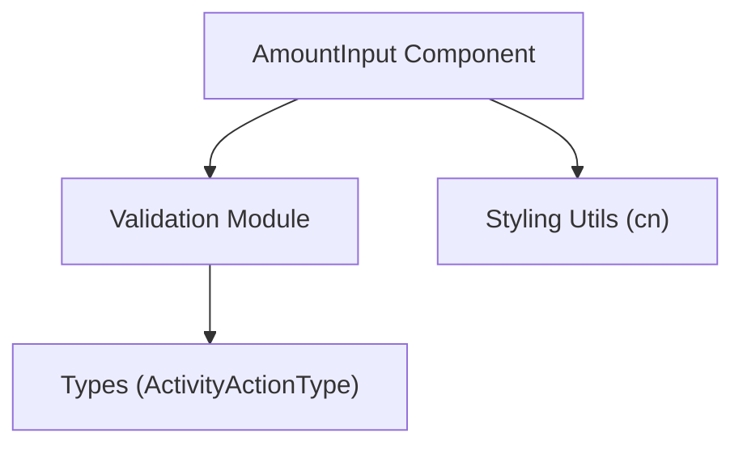
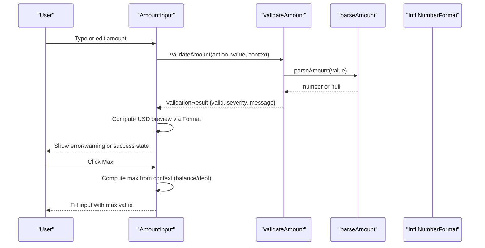
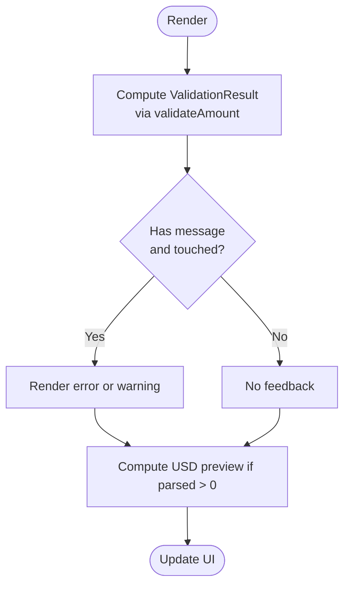
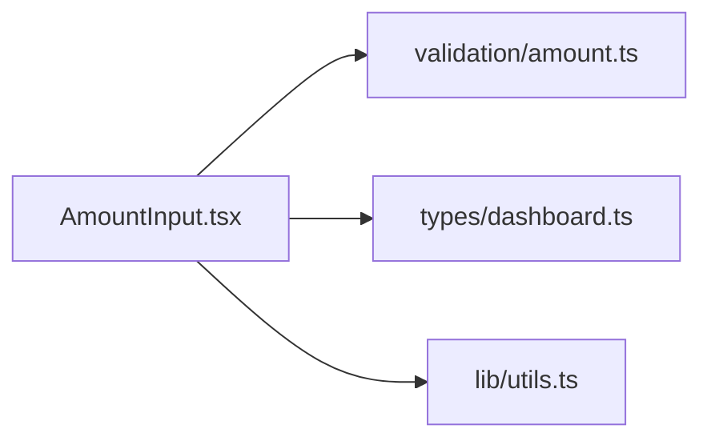

# Amount Input & Validation

<cite>
**Referenced Files in This Document**
- [AmountInput.tsx](file://veilend-web/src/components/AmountInput.tsx)
- [amount.ts](file://veilend-web/src/lib/validation/amount.ts)
- [dashboard.ts](file://veilend-web/src/lib/types/dashboard.ts)
- [utils.ts](file://veilend-web/src/lib/utils.ts)
</cite>

## Table of Contents
1. Introduction
2. Project Structure
3. Core Components
4. Architecture Overview
5. Detailed Component Analysis
6. Dependency Analysis
7. Performance Considerations
8. Troubleshooting Guide
9. Conclusion

## Introduction
This document explains the borrow amount input system, focusing on validation logic, sanitization functions, and user feedback mechanisms. It details how inputs are parsed and validated, how errors and warnings are surfaced to users, and how the Max button auto-fills amounts based on collateral limits and balances. The goal is to make the behavior clear for both developers and non-technical readers.

## Project Structure
The amount input feature spans a small set of focused files:
- A controlled UI component that renders the input, handles interactions, and displays feedback.
- A validation module that parses, validates, and formats amounts according to action-specific rules and context.
- Shared types that define actions and data shapes used across the app.
- Utility helpers for styling.

**Diagram sources**
- [AmountInput.tsx:1-123](file://veilend-web/src/components/AmountInput.tsx#L1-L123)
- [amount.ts:1-143](file://veilend-web/src/lib/validation/amount.ts#L1-L143)
- [dashboard.ts:1-35](file://veilend-web/src/lib/types/dashboard.ts#L1-L35)
- [utils.ts:1-7](file://veilend-web/src/lib/utils.ts#L1-L7)

**Section sources**
- [AmountInput.tsx:1-123](file://veilend-web/src/components/AmountInput.tsx#L1-L123)
- [amount.ts:1-143](file://veilend-web/src/lib/validation/amount.ts#L1-L143)
- [dashboard.ts:1-35](file://veilend-web/src/lib/types/dashboard.ts#L1-L35)
- [utils.ts:1-7](file://veilend-web/src/lib/utils.ts#L1-L7)

## Core Components
- AmountInput: A controlled input that integrates with validation, shows real-time feedback, and provides a Max button to fill the maximum allowable amount.
- Validation Module: Provides parseAmount, validateAmount, exceedsPrecision, and formatting helpers to enforce numeric precision, positivity, balance/borrow limits, and action-specific constraints.
- Types: Defines ActivityActionType and related structures consumed by the component and validation logic.

Key responsibilities:
- Parse and sanitize raw input into a safe numeric value.
- Validate against available balance, outstanding debt, and borrow limits.
- Surface errors (blocking) and warnings (non-blocking) to the user.
- Provide USD preview when applicable.
- Auto-fill Max based on context and action type.

**Section sources**
- [AmountInput.tsx:14-123](file://veilend-web/src/components/AmountInput.tsx#L14-L123)
- [amount.ts:3-143](file://veilend-web/src/lib/validation/amount.ts#L3-L143)
- [dashboard.ts:18-18](file://veilend-web/src/lib/types/dashboard.ts#L18-L18)

## Architecture Overview
The flow begins with user input, which triggers validation and updates UI state accordingly. The Max button computes an appropriate limit from the provided context and writes it back to the input.

**Diagram sources**
- [AmountInput.tsx:40-67](file://veilend-web/src/components/AmountInput.tsx#L40-L67)
- [AmountInput.tsx:52-59](file://veilend-web/src/components/AmountInput.tsx#L52-L59)
- [amount.ts:31-39](file://veilend-web/src/lib/validation/amount.ts#L31-L39)
- [amount.ts:55-138](file://veilend-web/src/lib/validation/amount.ts#L55-L138)

## Detailed Component Analysis

### AmountInput Component
Responsibilities:
- Controlled input bound to parent state via value and onChange.
- Real-time validation using useMemo to compute ValidationResult whenever action, value, or context changes.
- Feedback visibility tied to touched state to avoid premature messages.
- Max button logic that fills the largest valid amount based on action and context.
- USD preview computed from parsed amount and priceUsd.

Interaction highlights:
- On change: updates value and marks touched if not already.
- On blur: ensures touched is true so feedback can show.
- aria-invalid and aria-describedby are set conditionally to improve accessibility when there is an error.

Max button behavior:
- For REPAY: fills min(outstandingDebt, availableBalance).
- For other actions: fills availableBalance.

Feedback display:
- Errors render in destructive color; warnings render in amber.
- USD preview shown only when not in error state.

**Diagram sources**
- [AmountInput.tsx:40-67](file://veilend-web/src/components/AmountInput.tsx#L40-L67)
- [AmountInput.tsx:49-67](file://veilend-web/src/components/AmountInput.tsx#L49-L67)

**Section sources**
- [AmountInput.tsx:25-123](file://veilend-web/src/components/AmountInput.tsx#L25-L123)

### Validation Module (sanitize and validate)
Core functions:
- parseAmount: Sanitizes input to a positive decimal number; returns null for invalid input.
- exceedsPrecision: Ensures the value respects asset decimals (default 7).
- validateAmount: Applies action-specific rules and returns a ValidationResult with optional severity and message.

Validation rules overview:
- Common: must be a valid positive number within allowed decimals.
- DEPOSIT/WITHDRAW: cannot exceed availableBalance; warns if using full balance.
- BORROW: cannot exceed borrowLimitUsd; warns at or above 80% of limit.
- REPAY: cannot exceed outstandingDebt or availableBalance.

```mermaid
flowchart TD
S(["Start validateAmount"]) --> P["parseAmount(input)"]
P --> |null| E1["Return error: Enter a valid amount."]
P --> |value| CheckPos{"value > 0?"}
CheckPos --> |No| E2["Return error: Amount must be greater than zero."]
CheckPos --> |Yes| Dec{"exceedsPrecision(value, decimals)?"}
Dec --> |Yes| E3["Return error: Max N decimal places."]
Dec --> |No| Act{"action"}
Act --> |DEPOSIT/WITHDRAW| Bal{"value > availableBalance?"}
Bal --> |Yes| E4["Return error: Exceeds your balance."]
Bal --> |No| Full{"value === availableBalance?"}
Full --> |Yes| W1["Return warning: Using full balance leaves nothing for fees."]
Full --> |No| OK1["Return OK"]
Act --> |BORROW| Usd["usd = value * priceUsd"]
Usd --> Limit{"usd > borrowLimitUsd?"}
Limit --> |Yes| E5["Return error: Exceeds borrow limit."]
Limit --> |No| Near{"usd >= 80% of borrowLimitUsd?"}
Near --> |Yes| W2["Return warning: Near limit raises liquidation risk."]
Near --> |No| OK2["Return OK"]
Act --> |REPAY| Debt{"value > outstandingDebt?"}
Debt --> |Yes| E6["Return error: You only owe X."]
Debt --> |No| Bal2{"value > availableBalance?"}
Bal2 --> |Yes| E7["Return error: Exceeds your balance."]
Bal2 --> |No| OK3["Return OK"]
```

**Diagram sources**
- [amount.ts:55-138](file://veilend-web/src/lib/validation/amount.ts#L55-L138)
- [amount.ts:31-49](file://veilend-web/src/lib/validation/amount.ts#L31-L49)

**Section sources**
- [amount.ts:27-143](file://veilend-web/src/lib/validation/amount.ts#L27-L143)

### Types and Context
- ActivityActionType defines the four supported actions: DEPOSIT, BORROW, REPAY, WITHDRAW.
- ValidationContext supplies availableBalance, borrowLimitUsd, outstandingDebt, priceUsd, and decimals to drive validation and previews.

These types ensure consistent behavior across components and services.

**Section sources**
- [dashboard.ts:18-18](file://veilend-web/src/lib/types/dashboard.ts#L18-L18)
- [amount.ts:3-14](file://veilend-web/src/lib/validation/amount.ts#L3-L14)

## Dependency Analysis
The component depends on:
- Validation module for parsing and rule enforcement.
- Types for action enumeration.
- Styling utility for conditional class merging.

**Diagram sources**
- [AmountInput.tsx:1-12](file://veilend-web/src/components/AmountInput.tsx#L1-L12)
- [amount.ts:1-14](file://veilend-web/src/lib/validation/amount.ts#L1-L14)
- [dashboard.ts:18-18](file://veilend-web/src/lib/types/dashboard.ts#L18-L18)
- [utils.ts:1-7](file://veilend-web/src/lib/utils.ts#L1-L7)

**Section sources**
- [AmountInput.tsx:1-12](file://veilend-web/src/components/AmountInput.tsx#L1-L12)
- [amount.ts:1-14](file://veilend-web/src/lib/validation/amount.ts#L1-L14)
- [dashboard.ts:18-18](file://veilend-web/src/lib/types/dashboard.ts#L18-L18)
- [utils.ts:1-7](file://veilend-web/src/lib/utils.ts#L1-L7)

## Performance Considerations
- Validation runs on every change via useMemo to minimize re-renders and keep feedback immediate.
- USD preview uses Intl.NumberFormat once per update; consider memoizing formatted values if many inputs exist.
- Avoid heavy computations inside onChange; delegate to validation module to keep UI responsive.
- Debounce expensive operations (e.g., network calls) outside this component if needed.

[No sources needed since this section provides general guidance]

## Troubleshooting Guide
Common issues and resolutions:
- Invalid input format: parseAmount rejects non-decimal or negative values; ensure users enter digits and at most one decimal point.
- Precision exceeded: exceedsPrecision enforces asset decimals; reduce fractional digits to match decimals (default 7).
- Balance exceeded: validateAmount blocks deposits/withdrawals/repays exceeding availableBalance; adjust input or check balance source.
- Borrow limit exceeded: validateAmount blocks borrows exceeding borrowLimitUsd; reduce amount or review collateral limits.
- Liquidation risk warning: appears near 80% of borrow limit; consider lowering exposure.
- Full balance usage warning: appears for deposit/withdraw when using entire balance; leave some funds for fees.

Error states:
- Errors are blocking; form submission should be disabled while any error exists.
- Warnings are non-blocking; allow submission but inform users of risks.

Accessibility:
- aria-invalid toggles on error presence.
- aria-describedby links feedback text to the input for screen readers.

**Section sources**
- [amount.ts:62-133](file://veilend-web/src/lib/validation/amount.ts#L62-L133)
- [AmountInput.tsx:49-118](file://veilend-web/src/components/AmountInput.tsx#L49-L118)

## Conclusion
The amount input system combines robust parsing, precise validation, and clear user feedback to guide users toward correct and safe inputs. The Max button simplifies entering the highest allowable amount based on context, while warnings help users understand risks like liquidation or insufficient fee funds. By separating concerns between UI and validation, the system remains maintainable and testable.

[No sources needed since this section summarizes without analyzing specific files]