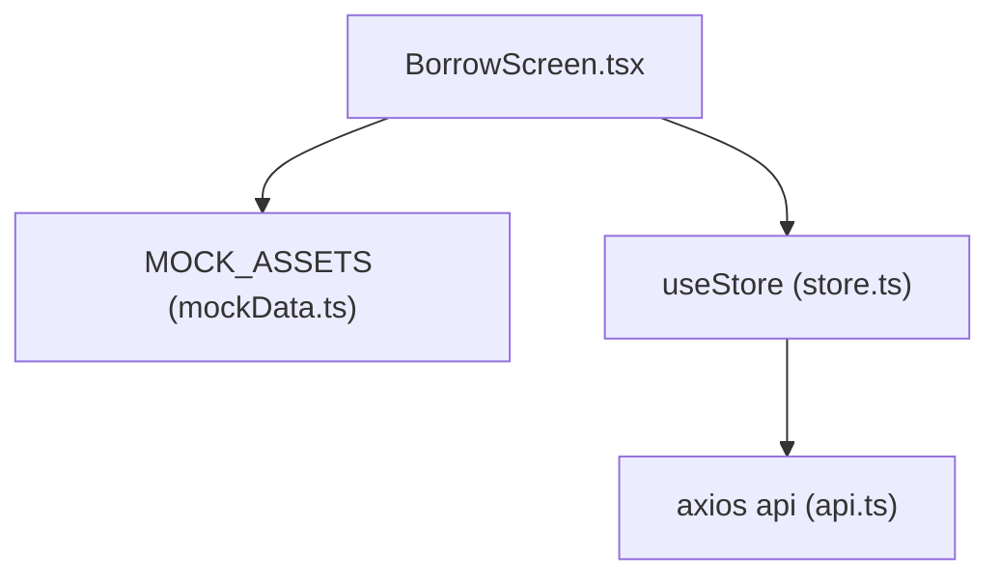
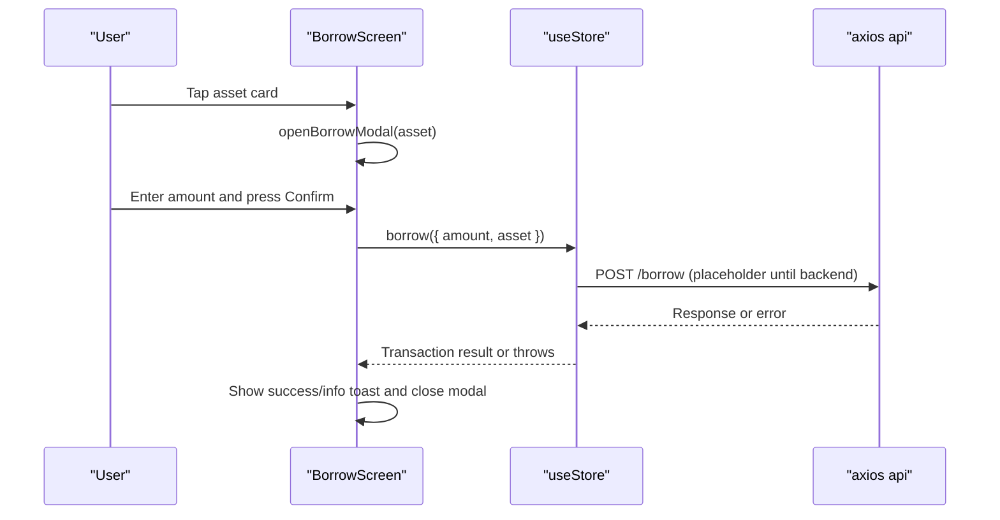
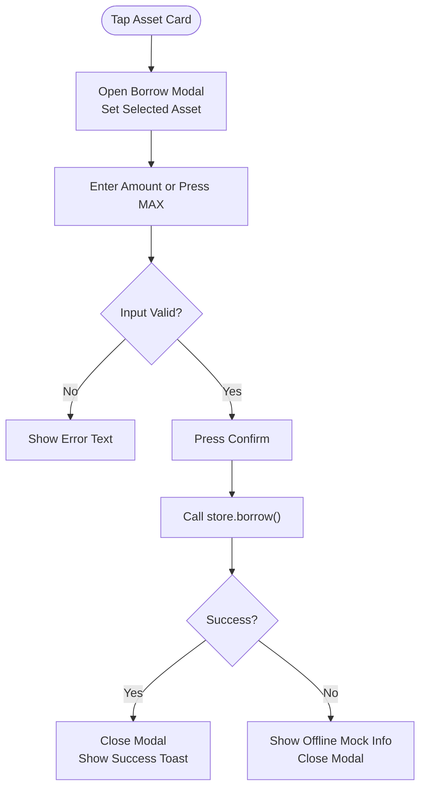
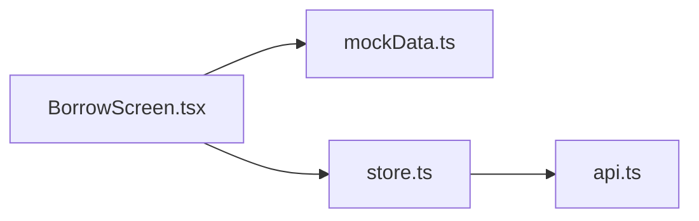

# Asset Selection Interface

<cite>
**Referenced Files in This Document**
- [BorrowScreen.tsx](file://veilend-mobile/src/screens/BorrowScreen.tsx)
- [mockData.ts](file://veilend-mobile/src/data/mockData.ts)
- [store.ts](file://veilend-mobile/src/store/store.ts)
- [api.ts](file://veilend-mobile/src/utils/api.ts)
</cite>

## Table of Contents
1. [Introduction](#introduction)
2. [Project Structure](#project-structure)
3. [Core Components](#core-components)
4. [Architecture Overview](#architecture-overview)
5. [Detailed Component Analysis](#detailed-component-analysis)
6. [Dependency Analysis](#dependency-analysis)
7. [Performance Considerations](#performance-considerations)
8. [Troubleshooting Guide](#troubleshooting-guide)
9. [Conclusion](#conclusion)

## Introduction
This document explains the asset selection interface on the Borrow screen. It covers how users browse available borrowing markets, view asset information such as APR rates and availability, and select assets to borrow. It also documents the asset card component structure, mock data integration, dynamic asset display logic, APR calculation display, and user interactions that open the borrow modal.

## Project Structure
The borrow flow is implemented in the mobile app under the screens directory. The key pieces are:
- Borrow screen UI and modal handling
- Mock asset data for market listing
- Global store for lending actions and portfolio state
- API client configuration for network requests

**Diagram sources**
- [BorrowScreen.tsx:1-366](file://veilend-mobile/src/screens/BorrowScreen.tsx#L1-L366)
- [mockData.ts:1-92](file://veilend-mobile/src/data/mockData.ts#L1-L92)
- [store.ts:1-397](file://veilend-mobile/src/store/store.ts#L1-L397)
- [api.ts:1-57](file://veilend-mobile/src/utils/api.ts#L1-L57)

**Section sources**
- [BorrowScreen.tsx:1-366](file://veilend-mobile/src/screens/BorrowScreen.tsx#L1-L366)
- [mockData.ts:1-92](file://veilend-mobile/src/data/mockData.ts#L1-L92)
- [store.ts:1-397](file://veilend-mobile/src/store/store.ts#L1-L397)
- [api.ts:1-57](file://veilend-mobile/src/utils/api.ts#L1-L57)

## Core Components
- Borrow screen: Renders a scrollable list of assets with an APR badge and availability indicator. Tapping an asset opens a bottom sheet-style modal to enter a borrow amount and confirm.
- Asset cards: Each card shows asset icon, name, symbol, computed APR, and availability text.
- Borrow modal: Contains an input field for amount, MAX button, validation errors, and Confirm/Cancel actions.
- Store integration: Provides lending functions (borrow), loading states, and portfolio-derived limits like availableToBorrow.

Key responsibilities:
- Displaying assets from mock data
- Validating user input
- Triggering borrow via store
- Managing modal visibility and error states

**Section sources**
- [BorrowScreen.tsx:20-189](file://veilend-mobile/src/screens/BorrowScreen.tsx#L20-L189)
- [store.ts:63-70](file://veilend-mobile/src/store/store.ts#L63-L70)
- [store.ts:283-295](file://veilend-mobile/src/store/store.ts#L283-L295)

## Architecture Overview
The borrow flow connects UI components to global state and optional backend calls.

**Diagram sources**
- [BorrowScreen.tsx:28-84](file://veilend-mobile/src/screens/BorrowScreen.tsx#L28-L84)
- [store.ts:283-295](file://veilend-mobile/src/store/store.ts#L283-L295)
- [api.ts:12-22](file://veilend-mobile/src/utils/api.ts#L12-L22)

## Detailed Component Analysis

### Borrow Screen Layout and Asset List
- Header and stats: Displays summary metrics for borrowed amounts and limits.
- Asset list: Iterates over MOCK_ASSETS to render asset cards.
- Asset card: Shows icon, name, symbol, APR badge, and availability text.
- Interaction: Pressing a card opens the borrow modal with the selected asset pre-filled.

Dynamic behavior:
- Amount input sanitization prevents invalid characters.
- Validation computes error messages and submit enablement based on input and availableToBorrow.
- Confirm action triggers store.borrow and handles both success and offline fallback paths.

APR display:
- The APR shown per asset is derived from the asset’s APY plus a fixed offset, displayed as “X% APR”.

Availability display:
- The availability text is currently a static placeholder string within the card.

**Section sources**
- [BorrowScreen.tsx:86-135](file://veilend-mobile/src/screens/BorrowScreen.tsx#L86-L135)
- [BorrowScreen.tsx:105-131](file://veilend-mobile/src/screens/BorrowScreen.tsx#L105-L131)
- [BorrowScreen.tsx:11-18](file://veilend-mobile/src/screens/BorrowScreen.tsx#L11-L18)
- [BorrowScreen.tsx:44-68](file://veilend-mobile/src/screens/BorrowScreen.tsx#L44-L68)

### Borrow Modal and Input Handling
- Modal visibility controlled by local state; opened with selected asset context.
- Input row includes amount field and MAX button that sets amount to availableToBorrow when present.
- Error text displays validation feedback.
- Confirm button disabled while loading or if validation fails; shows spinner during submission.

Interaction patterns:
- Cancel closes the modal without changes.
- Confirm submits borrow request and dismisses modal on completion or error fallback.

**Section sources**
- [BorrowScreen.tsx:21-32](file://veilend-mobile/src/screens/BorrowScreen.tsx#L21-L32)
- [BorrowScreen.tsx:34-42](file://veilend-mobile/src/screens/BorrowScreen.tsx#L34-L42)
- [BorrowScreen.tsx:70-84](file://veilend-mobile/src/screens/BorrowScreen.tsx#L70-L84)
- [BorrowScreen.tsx:136-188](file://veilend-mobile/src/screens/BorrowScreen.tsx#L136-L188)

### Mock Data Integration and Asset Metadata Rendering
- MOCK_ASSETS provides id, name, symbol, icon, balance, price, apy, and collateralFactor.
- Borrow screen renders these fields into the asset card:
  - Icon mapped to Ionicons names
  - Name and symbol labels
  - APR badge computed from apy
  - Availability label (currently static)

Example metadata rendering:
- Asset name and symbol are rendered directly from the asset object.
- APR badge uses the asset’s apy with a constant addition to compute the displayed APR.

**Section sources**
- [mockData.ts:9-40](file://veilend-mobile/src/data/mockData.ts#L9-L40)
- [BorrowScreen.tsx:105-131](file://veilend-mobile/src/screens/BorrowScreen.tsx#L105-L131)

### APR Calculation Display
- The displayed APR is calculated by adding a fixed value to the asset’s APY and formatting it as a percentage string.
- This approach allows quick demonstration of rate differences across assets.

Note:
- The calculation is performed inline during rendering and does not fetch live rates.

**Section sources**
- [BorrowScreen.tsx:122-125](file://veilend-mobile/src/screens/BorrowScreen.tsx#L122-L125)

### User Interaction Patterns for Opening Borrow Modals
- Tapping an asset card triggers openBorrowModal, which sets the selected asset, resets the amount, and opens the modal.
- The modal title reflects the selected asset symbol.
- Users can type an amount, use MAX to auto-fill the limit, review errors, and confirm.

Flow overview:

**Diagram sources**
- [BorrowScreen.tsx:28-32](file://veilend-mobile/src/screens/BorrowScreen.tsx#L28-L32)
- [BorrowScreen.tsx:34-42](file://veilend-mobile/src/screens/BorrowScreen.tsx#L34-L42)
- [BorrowScreen.tsx:44-68](file://veilend-mobile/src/screens/BorrowScreen.tsx#L44-L68)
- [BorrowScreen.tsx:70-84](file://veilend-mobile/src/screens/BorrowScreen.tsx#L70-L84)

**Section sources**
- [BorrowScreen.tsx:28-84](file://veilend-mobile/src/screens/BorrowScreen.tsx#L28-L84)

### Store Integration and Lending Actions
- The store exposes borrow, deposit, withdraw, and repay methods. Currently, they simulate transactions and update lastLendingTx.
- Portfolio state includes availableToBorrow, used by the screen to enforce limits and populate MAX.
- API client attaches Authorization headers using stored tokens and reports structured errors.

Integration points:
- Borrow screen reads lendingLoading and availableToBorrow from the store.
- On confirm, borrow is invoked with amount and asset symbol.
- Errors are caught and surfaced via toasts; offline path stores a mock transaction.

**Section sources**
- [store.ts:63-70](file://veilend-mobile/src/store/store.ts#L63-L70)
- [store.ts:283-295](file://veilend-mobile/src/store/store.ts#L283-L295)
- [store.ts:310-343](file://veilend-mobile/src/store/store.ts#L310-L343)
- [api.ts:12-22](file://veilend-mobile/src/utils/api.ts#L12-L22)
- [api.ts:24-54](file://veilend-mobile/src/utils/api.ts#L24-L54)

## Dependency Analysis
The borrow screen depends on:
- Mock data for asset listings
- Store for lending actions and portfolio state
- API client for authenticated requests and error reporting

**Diagram sources**
- [BorrowScreen.tsx:1-8](file://veilend-mobile/src/screens/BorrowScreen.tsx#L1-L8)
- [mockData.ts:1-92](file://veilend-mobile/src/data/mockData.ts#L1-L92)
- [store.ts:1-397](file://veilend-mobile/src/store/store.ts#L1-L397)
- [api.ts:1-57](file://veilend-mobile/src/utils/api.ts#L1-L57)

**Section sources**
- [BorrowScreen.tsx:1-8](file://veilend-mobile/src/screens/BorrowScreen.tsx#L1-L8)
- [store.ts:1-397](file://veilend-mobile/src/store/store.ts#L1-L397)
- [api.ts:1-57](file://veilend-mobile/src/utils/api.ts#L1-L57)

## Performance Considerations
- Rendering: The asset list maps over a small mock dataset; performance is not a concern at this scale.
- State updates: Using memoized validation reduces unnecessary re-renders during typing.
- Network: The borrow call currently simulates work; when integrated with the backend, consider debouncing retries and optimistic UI updates.

[No sources needed since this section provides general guidance]

## Troubleshooting Guide
Common issues and resolutions:
- Invalid amount input: Sanitization ensures only numeric characters; validation rejects non-numeric or zero/negative values.
- Exceeds borrow limit: If the entered amount exceeds availableToBorrow, the submit is disabled and an error is shown.
- Loading state: Confirm button disables and shows a spinner while lendingLoading is true.
- Offline behavior: If the borrow call fails, a mock transaction is recorded and an info toast is shown; verify network connectivity and backend availability.

Validation and error handling references:
- Input sanitization and validation logic
- Error message display in modal
- Loading and disabled states for confirm button
- Store borrow method and error propagation

**Section sources**
- [BorrowScreen.tsx:11-18](file://veilend-mobile/src/screens/BorrowScreen.tsx#L11-L18)
- [BorrowScreen.tsx:44-68](file://veilend-mobile/src/screens/BorrowScreen.tsx#L44-L68)
- [BorrowScreen.tsx:70-84](file://veilend-mobile/src/screens/BorrowScreen.tsx#L70-L84)
- [store.ts:283-295](file://veilend-mobile/src/store/store.ts#L283-L295)
- [api.ts:24-54](file://veilend-mobile/src/utils/api.ts#L24-L54)

## Conclusion
The borrow screen provides a clear asset selection interface with mock data-driven asset cards, APR display derived from APY, and a modal workflow for entering and confirming borrow amounts. Integration with the global store enables future backend connectivity and enforces borrowing limits. The current implementation focuses on usability, validation, and a smooth user experience, with placeholders ready for production API integration.