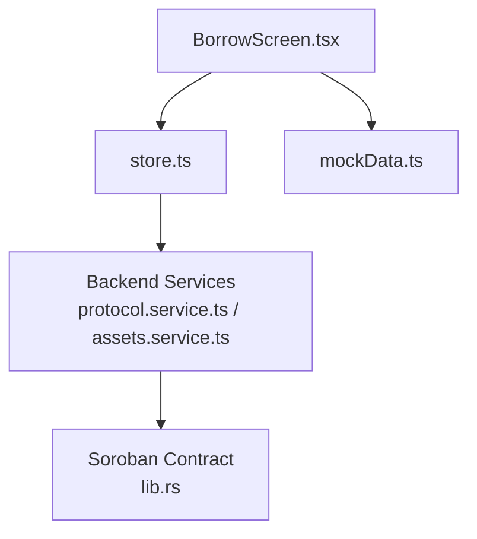
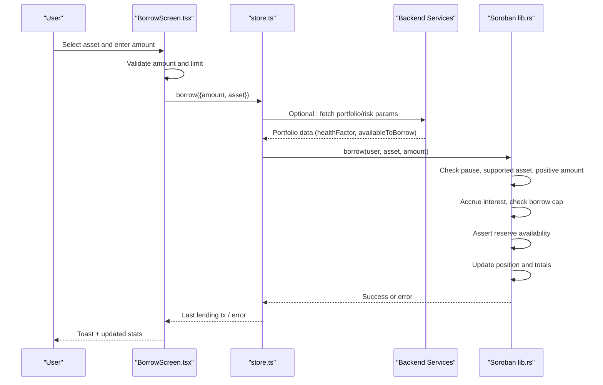
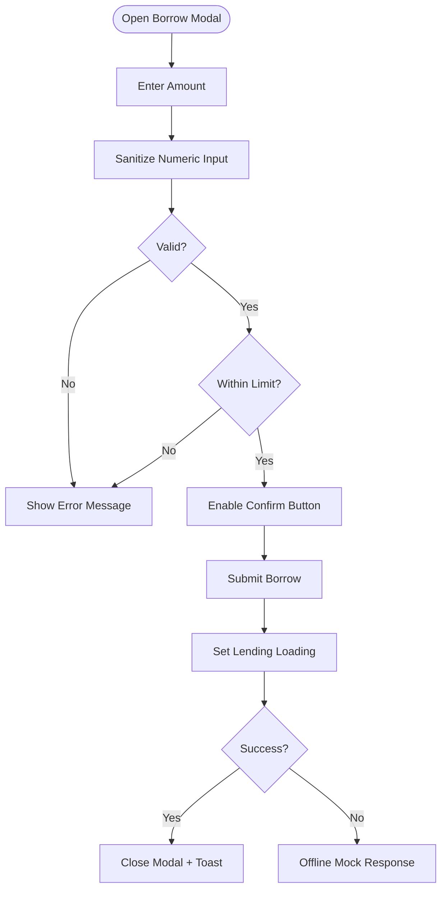
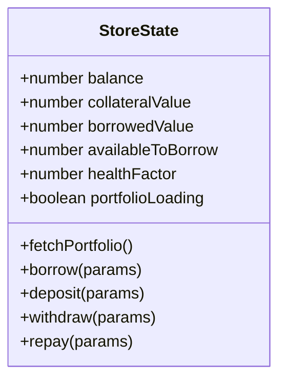
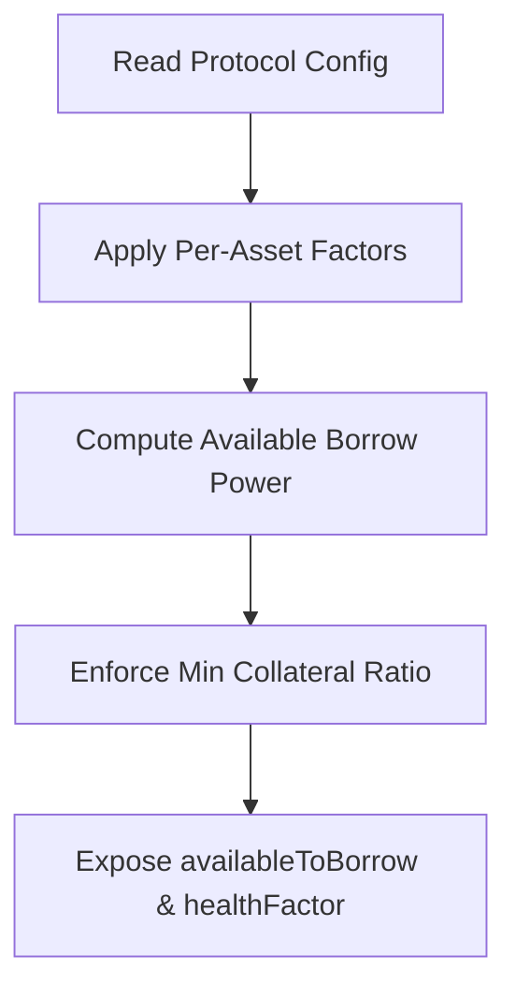
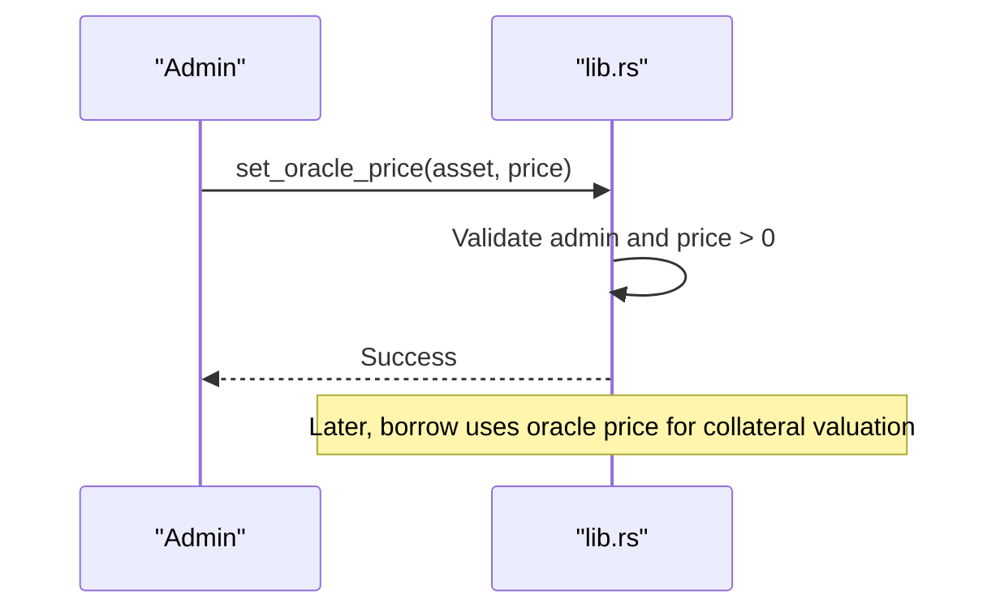
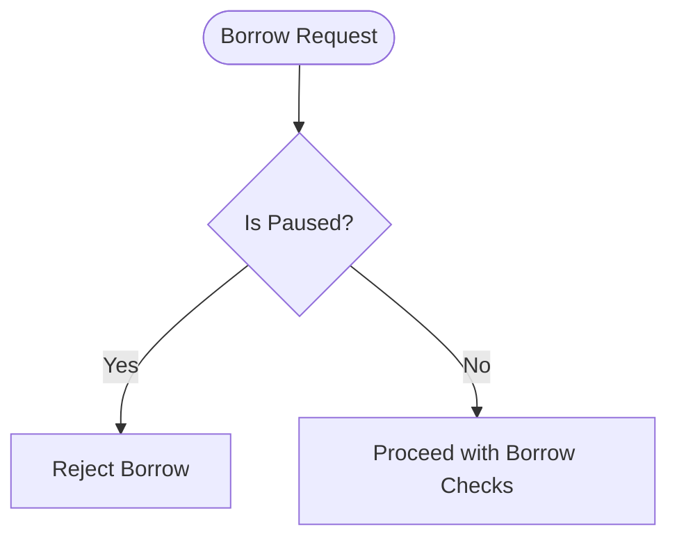
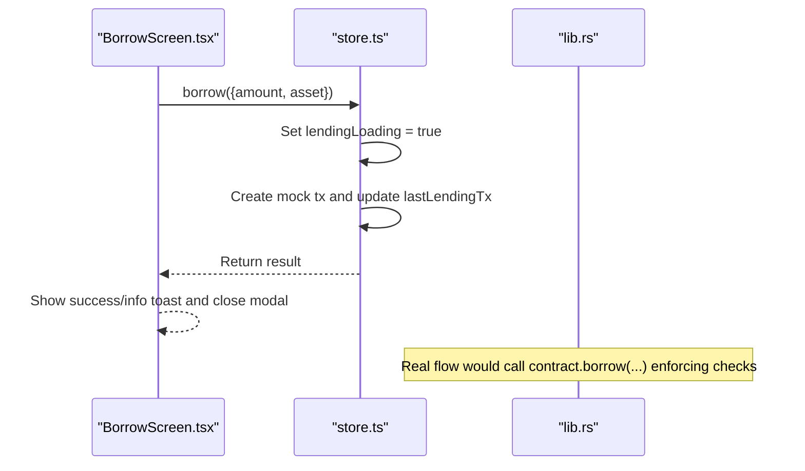
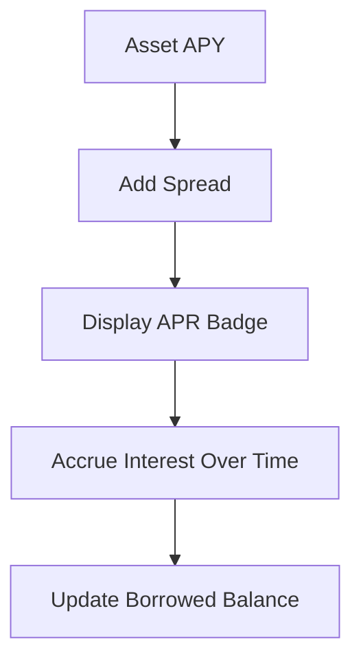
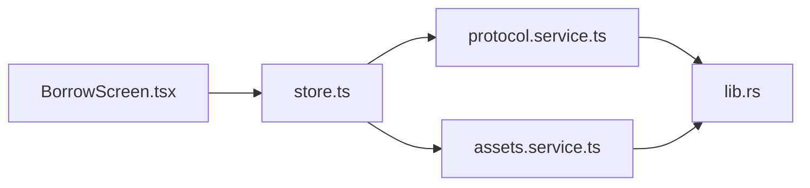

# Borrow Screen

<cite>
**Referenced Files in This Document**
- [BorrowScreen.tsx](file://veilend-mobile/src/screens/BorrowScreen.tsx)
- [store.ts](file://veilend-mobile/src/store/store.ts)
- [mockData.ts](file://veilend-mobile/src/data/mockData.ts)
- [protocol.service.ts](file://veilend-backend/src/protocol/protocol.service.ts)
- [assets.service.ts](file://veilend-backend/src/assets/assets.service.ts)
- [lib.rs](file://veilend-soroban/src/lib.rs)
</cite>

## Table of Contents
1. [Introduction](#introduction)
2. [Project Structure](#project-structure)
3. [Core Components](#core-components)
4. [Architecture Overview](#architecture-overview)
5. [Detailed Component Analysis](#detailed-component-analysis)
6. [Dependency Analysis](#dependency-analysis)
7. [Performance Considerations](#performance-considerations)
8. [Troubleshooting Guide](#troubleshooting-guide)
9. [Conclusion](#conclusion)

## Introduction
This document explains the Borrow screen that enables users to take loans against deposited collateral. It covers the borrowing interface (collateral selection, loan amount calculation, interest rate display, and repayment terms), risk assessment logic (borrowing limits, oracle price integration, circuit breaker checks), transaction flow for creating borrow positions, real-time health factor updates, and user warnings near liquidation thresholds. It also includes examples of dynamic limit calculations, error states for over-collateralization, and educational tooltips explaining borrowing mechanics.

## Project Structure
The Borrow feature spans three layers:
- Mobile UI layer: Borrow screen with asset list, modal input, validation, and submission.
- State and API layer: Zustand store managing portfolio metrics (availableToBorrow, healthFactor) and lending actions (borrow).
- Backend and on-chain layer: Protocol configuration (risk parameters), asset metadata, and Soroban contract enforcement (caps, oracle prices, pause state, collateral checks).

**Diagram sources**
- [BorrowScreen.tsx:20-84](file://veilend-mobile/src/screens/BorrowScreen.tsx#L20-L84)
- [store.ts:63-97](file://veilend-mobile/src/store/store.ts#L63-L97)
- [protocol.service.ts:52-79](file://veilend-backend/src/protocol/protocol.service.ts#L52-L79)
- [assets.service.ts:30-53](file://veilend-backend/src/assets/assets.service.ts#L30-L53)
- [lib.rs:521-561](file://veilend-soroban/src/lib.rs#L521-L561)

**Section sources**
- [BorrowScreen.tsx:20-84](file://veilend-mobile/src/screens/BorrowScreen.tsx#L20-L84)
- [store.ts:63-97](file://veilend-mobile/src/store/store.ts#L63-L97)
- [protocol.service.ts:52-79](file://veilend-backend/src/protocol/protocol.service.ts#L52-L79)
- [assets.service.ts:30-53](file://veilend-backend/src/assets/assets.service.ts#L30-L53)
- [lib.rs:521-561](file://veilend-soroban/src/lib.rs#L521-L561)

## Core Components
- Borrow screen UI: Displays total borrowed, borrow limit, asset list with APR badges, and a modal to enter borrow amounts with MAX button and validation.
- Store state: Provides availableToBorrow and healthFactor used by the UI; exposes borrow action and portfolio fetchers.
- Backend protocol config: Supplies default risk parameters (min collateral ratio, collateral factors, liquidation thresholds) and per-asset configs.
- On-chain contract: Enforces borrow caps, reserve availability, oracle price presence, and collateralization checks; supports pause/circuit breaker.

**Section sources**
- [BorrowScreen.tsx:86-188](file://veilend-mobile/src/screens/BorrowScreen.tsx#L86-L188)
- [store.ts:321-343](file://veilend-mobile/src/store/store.ts#L321-L343)
- [protocol.service.ts:24-30](file://veilend-backend/src/protocol/protocol.service.ts#L24-L30)
- [lib.rs:107-145](file://veilend-soroban/src/lib.rs#L107-L145)

## Architecture Overview
End-to-end flow from user interaction to on-chain execution and feedback:

**Diagram sources**
- [BorrowScreen.tsx:70-84](file://veilend-mobile/src/screens/BorrowScreen.tsx#L70-L84)
- [store.ts:283-295](file://veilend-mobile/src/store/store.ts#L283-L295)
- [lib.rs:521-561](file://veilend-soroban/src/lib.rs#L521-L561)

## Detailed Component Analysis

### Borrow Screen UI
- Asset list: Shows name, symbol, APR badge, and available liquidity placeholder. Users tap an asset to open the borrow modal.
- Borrow modal: Input field with numeric sanitization, MAX button pre-filling availableToBorrow, error messages for invalid or excessive amounts, and Confirm/Cancel buttons.
- Validation: Ensures non-empty, numeric, positive values and not exceeding availableToBorrow. Disables confirm during loading.

**Diagram sources**
- [BorrowScreen.tsx:11-18](file://veilend-mobile/src/screens/BorrowScreen.tsx#L11-L18)
- [BorrowScreen.tsx:34-68](file://veilend-mobile/src/screens/BorrowScreen.tsx#L34-L68)
- [BorrowScreen.tsx:70-84](file://veilend-mobile/src/screens/BorrowScreen.tsx#L70-L84)

**Section sources**
- [BorrowScreen.tsx:20-84](file://veilend-mobile/src/screens/BorrowScreen.tsx#L20-L84)
- [BorrowScreen.tsx:86-188](file://veilend-mobile/src/screens/BorrowScreen.tsx#L86-L188)

### Store and Portfolio Metrics
- Portfolio metrics: balance, collateralValue, borrowedValue, availableToBorrow, healthFactor are fetched via fetchPortfolio and exposed to UI.
- Lending actions: deposit, withdraw, borrow, repay are implemented with loading flags and mock transactions until backend is integrated.
- Session restore: Hydrates auth and UI state from secure storage on app launch.

**Diagram sources**
- [store.ts:63-97](file://veilend-mobile/src/store/store.ts#L63-L97)
- [store.ts:321-343](file://veilend-mobile/src/store/store.ts#L321-L343)
- [store.ts:283-295](file://veilend-mobile/src/store/store.ts#L283-L295)

**Section sources**
- [store.ts:63-97](file://veilend-mobile/src/store/store.ts#L63-L97)
- [store.ts:321-343](file://veilend-mobile/src/store/store.ts#L321-L343)
- [store.ts:283-295](file://veilend-mobile/src/store/store.ts#L283-L295)

### Risk Assessment and Limits
- Default risk parameters: minCollateralRatio, defaultCollateralFactor, defaultLiquidationThreshold, closeFactor, liquidationIncentive.
- Per-asset risk configs: collateralFactor and liquidationThreshold derived from asset type (native vs stablecoins vs others).
- UI usage: availableToBorrow drives MAX and validation; healthFactor informs warnings near liquidation.

**Diagram sources**
- [protocol.service.ts:24-30](file://veilend-backend/src/protocol/protocol.service.ts#L24-L30)
- [protocol.service.ts:102-125](file://veilend-backend/src/protocol/protocol.service.ts#L102-L125)

**Section sources**
- [protocol.service.ts:24-30](file://veilend-backend/src/protocol/protocol.service.ts#L24-L30)
- [protocol.service.ts:102-125](file://veilend-backend/src/protocol/protocol.service.ts#L102-L125)

### Oracle Price Integration
- Contract stores oracle prices per asset and requires them for collateral valuation.
- Admin-only set_oracle_price enforces positive values; get_oracle_price returns current price if set.
- UI can surface “oracle price missing” errors when attempting operations without price data.

**Diagram sources**
- [lib.rs:308-344](file://veilend-soroban/src/lib.rs#L308-L344)

**Section sources**
- [lib.rs:308-344](file://veilend-soroban/src/lib.rs#L308-L344)

### Circuit Breaker Protection
- Contract supports pause/unpause via set_paused; paused blocks deposits and borrows but allows withdrawals and repayments.
- Borrow entrypoint checks pause state before proceeding.

**Diagram sources**
- [lib.rs:450-479](file://veilend-soroban/src/lib.rs#L450-L479)
- [lib.rs:521-525](file://veilend-soroban/src/lib.rs#L521-L525)

**Section sources**
- [lib.rs:450-479](file://veilend-soroban/src/lib.rs#L450-L479)
- [lib.rs:521-525](file://veilend-soroban/src/lib.rs#L521-L525)

### Borrow Transaction Flow
- UI validates input and calls store.borrow.
- Store sets loading flag, executes mock transaction (placeholder until backend integration), updates lastLendingTx, and shows toast.
- On-chain borrow enforces caps, reserve availability, and collateralization.

**Diagram sources**
- [BorrowScreen.tsx:70-84](file://veilend-mobile/src/screens/BorrowScreen.tsx#L70-L84)
- [store.ts:283-295](file://veilend-mobile/src/store/store.ts#L283-L295)
- [lib.rs:521-561](file://veilend-soroban/src/lib.rs#L521-L561)

**Section sources**
- [BorrowScreen.tsx:70-84](file://veilend-mobile/src/screens/BorrowScreen.tsx#L70-L84)
- [store.ts:283-295](file://veilend-mobile/src/store/store.ts#L283-L295)
- [lib.rs:521-561](file://veilend-soroban/src/lib.rs#L521-L561)

### Interest Rate Display and Repayment Terms
- Asset cards show APR badges computed from base APY plus spread.
- Repayment terms are governed by time-based accrual indexes maintained in the contract; UI can reflect accrued debt growth and due dates based on backend data.

**Diagram sources**
- [mockData.ts:9-40](file://veilend-mobile/src/data/mockData.ts#L9-L40)
- [lib.rs:782-800](file://veilend-soroban/src/lib.rs#L782-L800)

**Section sources**
- [mockData.ts:9-40](file://veilend-mobile/src/data/mockData.ts#L9-L40)
- [lib.rs:782-800](file://veilend-soroban/src/lib.rs#L782-L800)

### Examples and Educational Tooltips
- Dynamic limit calculation example: If collateral value is $10,000 and collateral factor is 75%, maximum borrow power is $7,500; availableToBorrow reflects remaining capacity after existing debt.
- Over-collateralization error: If entered amount exceeds availableToBorrow, show “Exceeds borrow limit”.
- Educational tooltip: Explain that borrowing uses deposited collateral, interest accrues over time, and health factor indicates safety margin relative to liquidation threshold.

[No sources needed since this section provides conceptual guidance]

## Dependency Analysis
- UI depends on store for state and actions; store depends on backend services for portfolio and protocol config; backend reads assets and protocol config; contract enforces final rules.

**Diagram sources**
- [BorrowScreen.tsx:20-84](file://veilend-mobile/src/screens/BorrowScreen.tsx#L20-L84)
- [store.ts:63-97](file://veilend-mobile/src/store/store.ts#L63-L97)
- [assets.service.ts:30-53](file://veilend-backend/src/assets/assets.service.ts#L30-L53)
- [protocol.service.ts:52-79](file://veilend-backend/src/protocol/protocol.service.ts#L52-L79)
- [lib.rs:521-561](file://veilend-soroban/src/lib.rs#L521-L561)

**Section sources**
- [BorrowScreen.tsx:20-84](file://veilend-mobile/src/screens/BorrowScreen.tsx#L20-L84)
- [store.ts:63-97](file://veilend-mobile/src/store/store.ts#L63-L97)
- [assets.service.ts:30-53](file://veilend-backend/src/assets/assets.service.ts#L30-L53)
- [protocol.service.ts:52-79](file://veilend-backend/src/protocol/protocol.service.ts#L52-L79)
- [lib.rs:521-561](file://veilend-soroban/src/lib.rs#L521-L561)

## Performance Considerations
- In-memory caching in backend services reduces DB load for assets and protocol config.
- UI validation is client-side to provide immediate feedback; server-side checks ensure correctness.
- Interest accrual is time-based and only advanced when mutating operations occur; read paths simulate accrual without writes.

[No sources needed since this section provides general guidance]

## Troubleshooting Guide
Common issues and resolutions:
- Invalid amount: Ensure input is numeric, positive, and within availableToBorrow.
- Exceeds borrow limit: Reduce amount or increase collateral; verify availableToBorrow from portfolio.
- Oracle price missing: Admin must set oracle price for the asset; UI should warn when unavailable.
- Contract paused: Borrow blocked while paused; wait for admin to unpause.
- Insufficient reserve: Borrow requires sufficient liquidity in reserve; reduce amount or wait for more deposits.

**Section sources**
- [BorrowScreen.tsx:44-68](file://veilend-mobile/src/screens/BorrowScreen.tsx#L44-L68)
- [lib.rs:107-145](file://veilend-soroban/src/lib.rs#L107-L145)
- [lib.rs:521-561](file://veilend-soroban/src/lib.rs#L521-L561)

## Conclusion
The Borrow screen integrates a clear UI with robust validation, backed by store-managed portfolio metrics and enforced by on-chain risk controls. Users can select collateralized assets, see APR and available limits, and submit borrow requests safely. The system ensures collateralization through oracle prices, respects caps and pause states, and surfaces actionable warnings to keep positions healthy. Future enhancements include full backend integration for live portfolio updates and richer educational tooltips to guide users through borrowing mechanics.