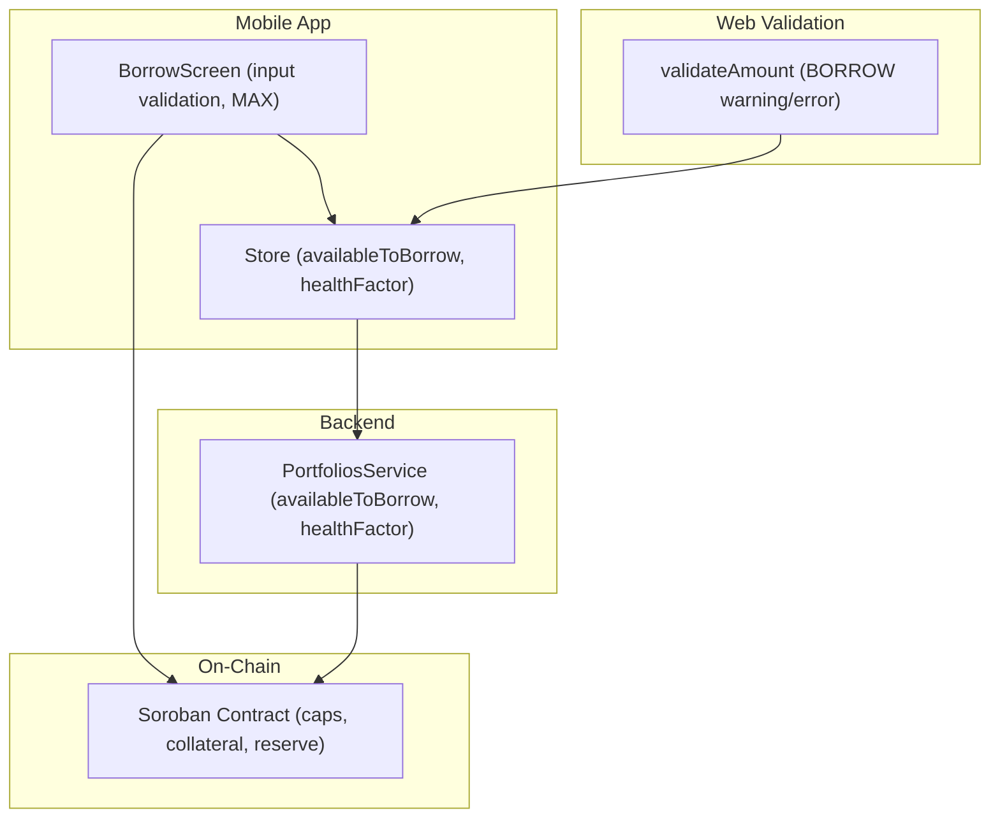
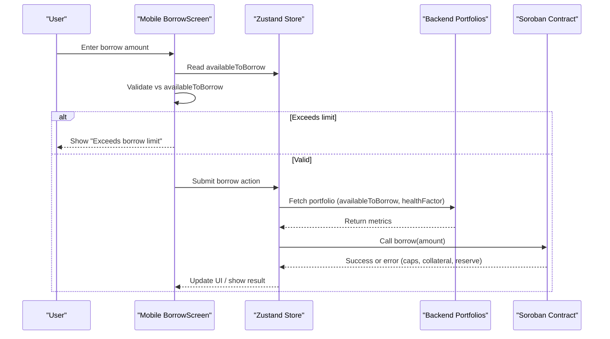
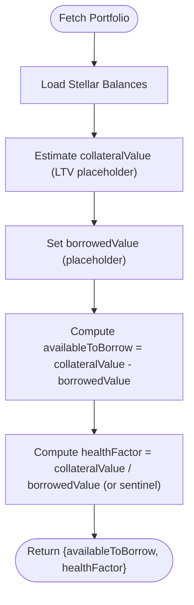
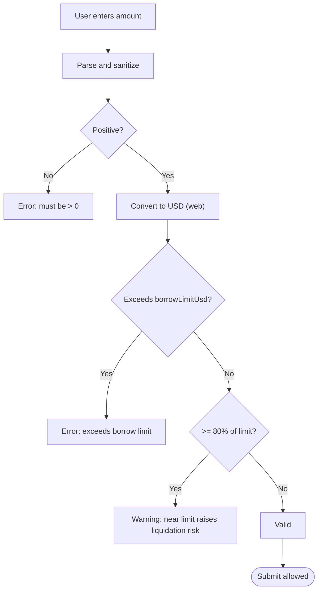
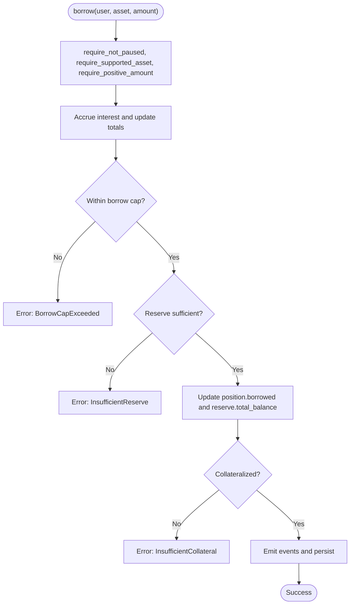
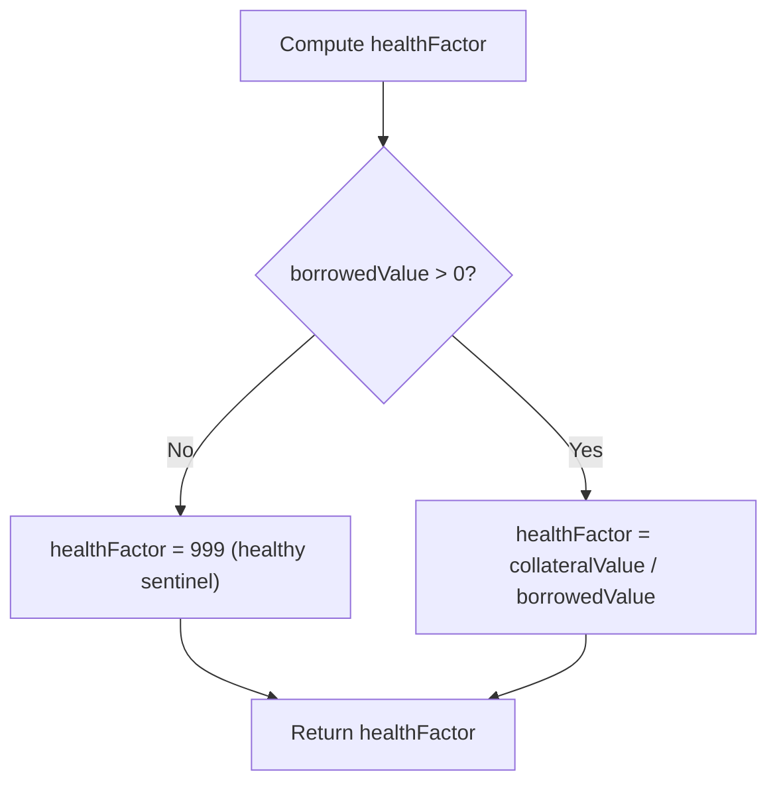
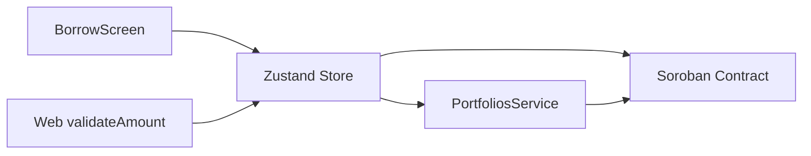

# Risk Assessment & Limits

<cite>
**Referenced Files in This Document**
- [store.ts](file://veilend-mobile/src/store/store.ts)
- [BorrowScreen.tsx](file://veilend-mobile/src/screens/BorrowScreen.tsx)
- [amount.ts](file://veilend-web/src/lib/validation/amount.ts)
- [lib.rs](file://veilend-soroban/src/lib.rs)
- [portfolios.service.ts](file://veilend-backend/src/portfolios/portfolios.service.ts)
</cite>

## Table of Contents
1. [Introduction](#introduction)
2. [Project Structure](#project-structure)
3. [Core Components](#core-components)
4. [Architecture Overview](#architecture-overview)
5. [Detailed Component Analysis](#detailed-component-analysis)
6. [Dependency Analysis](#dependency-analysis)
7. [Performance Considerations](#performance-considerations)
8. [Troubleshooting Guide](#troubleshooting-guide)
9. [Conclusion](#conclusion)

## Introduction
This document explains how the risk assessment and borrowing limits system works across the mobile app, web validation layer, backend portfolio service, and on-chain Soroban contract. It focuses on:
- How availableToBorrow is derived from store state and backend data
- Validation logic that prevents over-borrowing at UI and protocol layers
- Health factor calculation and its role in user guidance
- Error handling for exceeding borrow limits and real-time limit checks
- Practical scenarios and error states users may encounter

## Project Structure
The risk and limits system spans multiple layers:
- Mobile app (Zustand store + Borrow screen): holds availableToBorrow and healthFactor, enforces per-user borrow limits in UI, and triggers lending actions.
- Web validation library: provides reusable amount validation with borrow-limit warnings and errors based on USD context.
- Backend portfolio service: computes availableToBorrow and healthFactor from account balances and LTV assumptions.
- On-chain Soroban contract: enforces hard limits via collateral ratio checks, asset caps, reserve availability, and pause/circuit breaker state.

**Diagram sources**
- [store.ts:82-95](file://veilend-mobile/src/store/store.ts#L82-L95)
- [BorrowScreen.tsx:20-68](file://veilend-mobile/src/screens/BorrowScreen.tsx#L20-L68)
- [amount.ts:55-138](file://veilend-web/src/lib/validation/amount.ts#L55-L138)
- [portfolios.service.ts:24-85](file://veilend-backend/src/portfolios/portfolios.service.ts#L24-L85)
- [lib.rs:521-561](file://veilend-soroban/src/lib.rs#L521-L561)

**Section sources**
- [store.ts:82-95](file://veilend-mobile/src/store/store.ts#L82-L95)
- [BorrowScreen.tsx:20-68](file://veilend-mobile/src/screens/BorrowScreen.tsx#L20-L68)
- [amount.ts:55-138](file://veilend-web/src/lib/validation/amount.ts#L55-L138)
- [portfolios.service.ts:24-85](file://veilend-backend/src/portfolios/portfolios.service.ts#L24-L85)
- [lib.rs:521-561](file://veilend-soroban/src/lib.rs#L521-L561)

## Core Components
- Store state exposes availableToBorrow and healthFactor, fetched from the backend portfolio endpoint and persisted in Zustand.
- BorrowScreen validates user input against availableToBorrow and shows an error if exceeded; it also supports a MAX button to fill the limit.
- Web validation library warns when borrowing near the limit (>=80% of USD borrow cap) and blocks when exceeding the limit.
- Portfolio service calculates availableToBorrow as collateralValue minus borrowedValue using an LTV assumption, and derives healthFactor as collateralValue divided by borrowedValue (with a high sentinel when no debt).
- Soroban contract enforces hard constraints: minimum collateral ratio, per-asset borrow caps, reserve sufficiency, and pause state.

**Section sources**
- [store.ts:321-343](file://veilend-mobile/src/store/store.ts#L321-L343)
- [BorrowScreen.tsx:44-68](file://veilend-mobile/src/screens/BorrowScreen.tsx#L44-L68)
- [amount.ts:97-115](file://veilend-web/src/lib/validation/amount.ts#L97-L115)
- [portfolios.service.ts:53-60](file://veilend-backend/src/portfolios/portfolios.service.ts#L53-L60)
- [lib.rs:913-934](file://veilend-soroban/src/lib.rs#L913-L934)

## Architecture Overview
The flow from user input to on-chain enforcement:

**Diagram sources**
- [BorrowScreen.tsx:44-82](file://veilend-mobile/src/screens/BorrowScreen.tsx#L44-L82)
- [store.ts:321-343](file://veilend-mobile/src/store/store.ts#L321-L343)
- [portfolios.service.ts:24-85](file://veilend-backend/src/portfolios/portfolios.service.ts#L24-L85)
- [lib.rs:521-561](file://veilend-soroban/src/lib.rs#L521-L561)

## Detailed Component Analysis

### Available-to-Borrow Calculation
- Mobile store fetches portfolio data including availableToBorrow and healthFactor from the backend. The values are stored in Zustand and consumed by screens.
- Backend portfolio service currently uses a simplified model: collateralValue is estimated as a percentage of native balance (LTV placeholder), borrowedValue is zero until full protocol integration, and availableToBorrow equals collateralValue minus borrowedValue. healthFactor defaults to a high value when there is no debt.

**Diagram sources**
- [portfolios.service.ts:24-85](file://veilend-backend/src/portfolios/portfolios.service.ts#L24-L85)

**Section sources**
- [store.ts:321-343](file://veilend-mobile/src/store/store.ts#L321-L343)
- [portfolios.service.ts:53-60](file://veilend-backend/src/portfolios/portfolios.service.ts#L53-L60)

### Borrow Limit Validation (UI and Web)
- Mobile BorrowScreen parses and sanitizes input, then compares parsed amount to availableToBorrow. If exceeded, it displays an inline error and disables submit. A MAX button fills the exact availableToBorrow.
- Web validation library converts borrow amount to USD using priceUsd and compares against borrowLimitUsd. It returns an error when exceeding the limit and a warning when approaching the limit (>=80%).

**Diagram sources**
- [BorrowScreen.tsx:44-68](file://veilend-mobile/src/screens/BorrowScreen.tsx#L44-L68)
- [amount.ts:97-115](file://veilend-web/src/lib/validation/amount.ts#L97-L115)

**Section sources**
- [BorrowScreen.tsx:44-68](file://veilend-mobile/src/screens/BorrowScreen.tsx#L44-L68)
- [amount.ts:97-115](file://veilend-web/src/lib/validation/amount.ts#L97-L115)

### On-Chain Risk Enforcement
The Soroban contract enforces several critical checks during borrow:
- Pause state: if paused, borrow is blocked.
- Supported asset: only configured assets can be used.
- Positive amount: zero or negative amounts are rejected.
- Interest accrual: reserves and totals are updated before checks.
- Borrow cap: per-asset total borrows cannot exceed configured cap (-1 means unlimited).
- Reserve sufficiency: requested amount must not exceed available reserve balance.
- Collateralization: after borrow, position must satisfy minimum collateral ratio using oracle prices.

**Diagram sources**
- [lib.rs:521-561](file://veilend-soroban/src/lib.rs#L521-L561)
- [lib.rs:856-934](file://veilend-soroban/src/lib.rs#L856-L934)

**Section sources**
- [lib.rs:521-561](file://veilend-soroban/src/lib.rs#L521-L561)
- [lib.rs:856-934](file://veilend-soroban/src/lib.rs#L856-L934)

### Health Factor Calculation
- Backend portfolio service computes healthFactor as collateralValue divided by borrowedValue. When borrowedValue is zero, a high sentinel value is returned to indicate healthy status.
- On-chain, collateralization is enforced via minimum collateral ratio in basis points. While healthFactor is not directly computed on-chain here, the same principle applies: collateral_value * 10_000 must be greater than or equal to borrowed_value * min_collateral_ratio_bps.

**Diagram sources**
- [portfolios.service.ts:53-60](file://veilend-backend/src/portfolios/portfolios.service.ts#L53-L60)
- [lib.rs:913-934](file://veilend-soroban/src/lib.rs#L913-L934)

**Section sources**
- [portfolios.service.ts:53-60](file://veilend-backend/src/portfolios/portfolios.service.ts#L53-L60)
- [lib.rs:913-934](file://veilend-soroban/src/lib.rs#L913-L934)

### Real-Time Limit Checking and User Guidance
- Real-time: BorrowScreen recomputes validation whenever amount or availableToBorrow changes, enabling immediate feedback.
- Guidance: Web validation emits a warning when borrowing near the limit (>=80%), alerting users to increased liquidation risk even though the transaction is still valid.
- MAX shortcut: BorrowScreen’s MAX button sets the amount to availableToBorrow, preventing accidental over-borrowing.

**Section sources**
- [BorrowScreen.tsx:38-68](file://veilend-mobile/src/screens/BorrowScreen.tsx#L38-L68)
- [amount.ts:97-115](file://veilend-web/src/lib/validation/amount.ts#L97-L115)

## Dependency Analysis
- Mobile BorrowScreen depends on Zustand store for availableToBorrow and lendingLoading.
- Store depends on backend portfolio endpoint to populate availableToBorrow and healthFactor.
- Web validation depends on USD price and borrowLimitUsd to compute warnings/errors.
- On-chain contract depends on oracle prices, admin-configured caps, and reserve balances to enforce safety.

**Diagram sources**
- [BorrowScreen.tsx:20-82](file://veilend-mobile/src/screens/BorrowScreen.tsx#L20-L82)
- [store.ts:321-343](file://veilend-mobile/src/store/store.ts#L321-L343)
- [amount.ts:55-138](file://veilend-web/src/lib/validation/amount.ts#L55-L138)
- [portfolios.service.ts:24-85](file://veilend-backend/src/portfolios/portfolios.service.ts#L24-L85)
- [lib.rs:521-561](file://veilend-soroban/src/lib.rs#L521-L561)

**Section sources**
- [BorrowScreen.tsx:20-82](file://veilend-mobile/src/screens/BorrowScreen.tsx#L20-L82)
- [store.ts:321-343](file://veilend-mobile/src/store/store.ts#L321-L343)
- [amount.ts:55-138](file://veilend-web/src/lib/validation/amount.ts#L55-L138)
- [portfolios.service.ts:24-85](file://veilend-backend/src/portfolios/portfolios.service.ts#L24-L85)
- [lib.rs:521-561](file://veilend-soroban/src/lib.rs#L521-L561)

## Performance Considerations
- Avoid redundant re-renders: BorrowScreen uses useMemo to derive validation results from amount and availableToBorrow, minimizing unnecessary computations.
- Debounce or throttle portfolio refreshes if needed to reduce network calls when availableToBorrow changes frequently.
- On-chain, interest accrual is performed once per operation to keep caps and totals consistent; this minimizes repeated reads/writes.

[No sources needed since this section provides general guidance]

## Troubleshooting Guide
Common issues and where they originate:

- “Exceeds borrow limit” in mobile:
  - Cause: Amount > availableToBorrow in BorrowScreen validation.
  - Resolution: Reduce amount or increase availableToBorrow by adding collateral or reducing debt.
  - Section sources
    - [BorrowScreen.tsx:63-65](file://veilend-mobile/src/screens/BorrowScreen.tsx#L63-L65)

- “Exceeds your borrow limit of $X” in web:
  - Cause: USD value exceeds borrowLimitUsd in validateAmount.
  - Resolution: Adjust amount or wait for limit changes; consider repaying to free capacity.
  - Section sources
    - [amount.ts:97-105](file://veilend-web/src/lib/validation/amount.ts#L97-L105)

- Warning “Borrowing near your limit raises liquidation risk”:
  - Cause: Borrow amount >= 80% of borrowLimitUsd.
  - Resolution: Reduce exposure or add more collateral to improve headroom.
  - Section sources
    - [amount.ts:106-113](file://veilend-web/src/lib/validation/amount.ts#L106-L113)

- On-chain “InsufficientCollateral”:
  - Cause: After borrow, collateral_value < borrowed_value * min_collateral_ratio_bps / 10_000.
  - Resolution: Add collateral or repay part of the loan.
  - Section sources
    - [lib.rs:913-934](file://veilend-soroban/src/lib.rs#L913-L934)

- On-chain “BorrowCapExceeded”:
  - Cause: Total borrows for asset would exceed configured cap.
  - Resolution: Wait for admin to adjust caps or choose another asset.
  - Section sources
    - [lib.rs:890-911](file://veilend-soroban/src/lib.rs#L890-L911)

- On-chain “InsufficientReserve”:
  - Cause: Requested borrow amount exceeds available reserve balance.
  - Resolution: Reduce amount or wait for more deposits.
  - Section sources
    - [lib.rs:539-541](file://veilend-soroban/src/lib.rs#L539-L541)

- On-chain “ContractPaused”:
  - Cause: Protocol is paused by admin; borrows blocked.
  - Resolution: Wait until admin unpause.
  - Section sources
    - [lib.rs:856-865](file://veilend-soroban/src/lib.rs#L856-L865)

## Conclusion
The risk assessment and borrowing limits system combines layered validations:
- UI-level checks prevent obvious over-borrowing and guide users with warnings near limits.
- Backend-derived metrics provide availableToBorrow and healthFactor for informed decisions.
- On-chain enforcement ensures protocol safety through collateral ratios, caps, reserve checks, and pause controls.
Together, these layers protect users and the protocol while offering clear feedback and actionable guidance.

[No sources needed since this section summarizes without analyzing specific files]