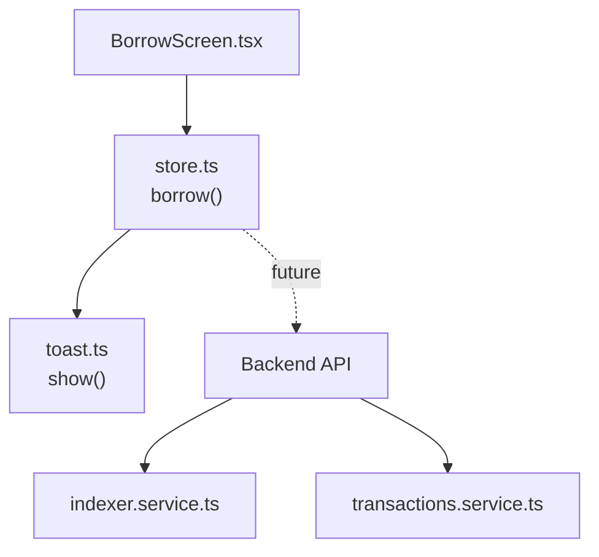
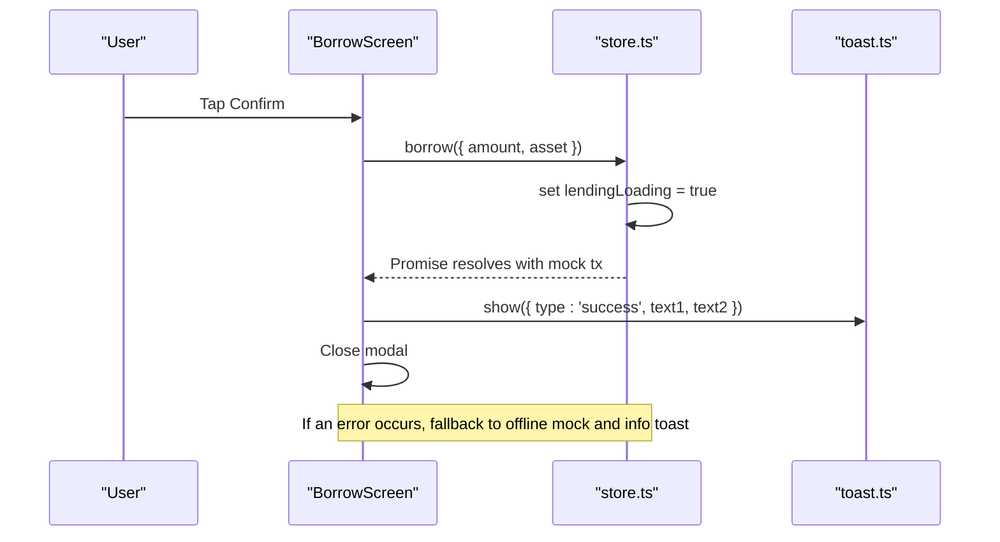
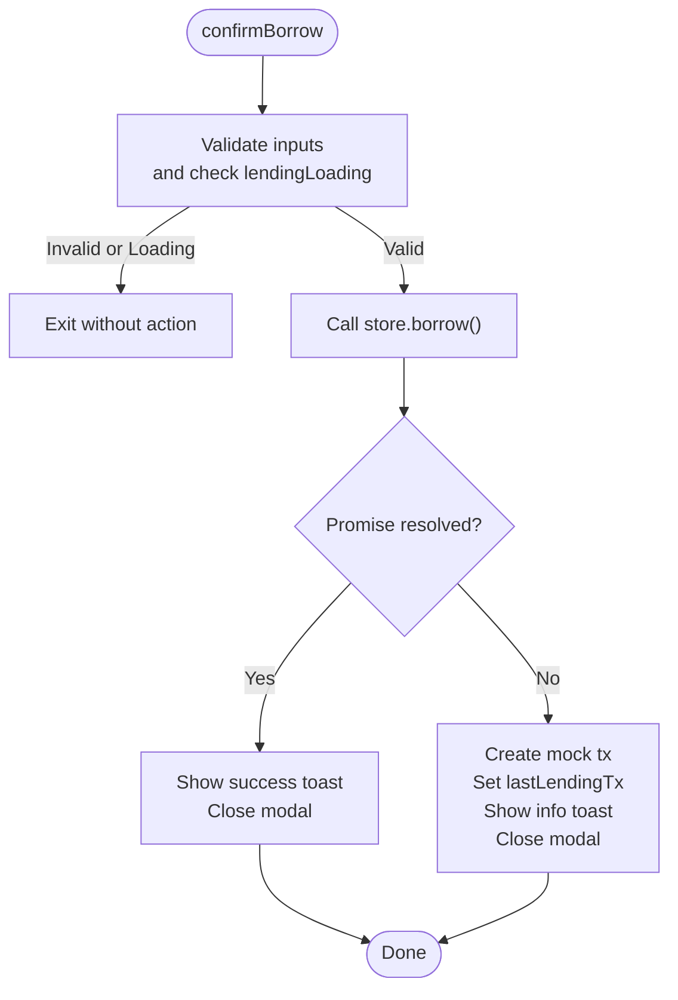
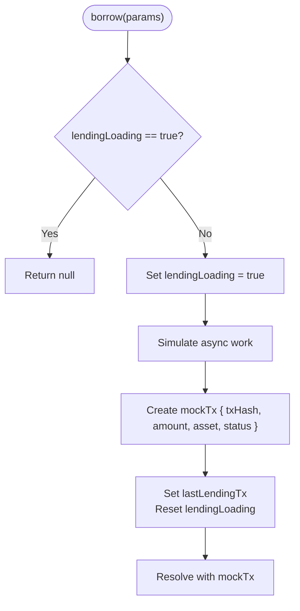
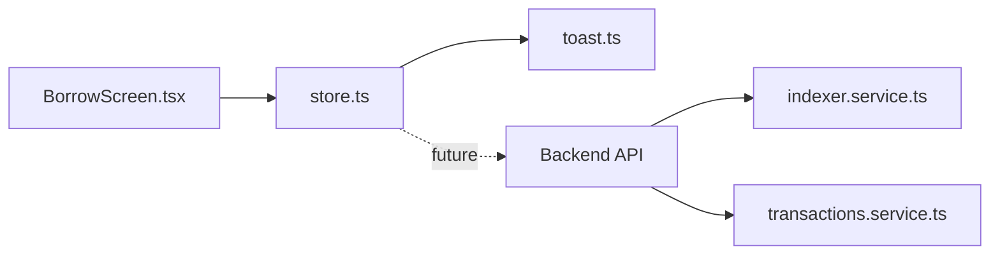

# Transaction Processing

<cite>
**Referenced Files in This Document**
- [BorrowScreen.tsx](file://veilend-mobile/src/screens/BorrowScreen.tsx)
- [store.ts](file://veilend-mobile/src/store/store.ts)
- [toast.ts](file://veilend-mobile/src/utils/toast.ts)
- [mockData.ts](file://veilend-mobile/src/data/mockData.ts)
- [transactions.service.ts](file://veilend-backend/src/transactions/transactions.service.ts)
- [indexer.service.ts](file://veilend-backend/src/indexer/indexer.service.ts)
</cite>

## Table of Contents
1. [Introduction](#introduction)
2. [Project Structure](#project-structure)
3. [Core Components](#core-components)
4. [Architecture Overview](#architecture-overview)
5. [Detailed Component Analysis](#detailed-component-analysis)
6. [Dependency Analysis](#dependency-analysis)
7. [Performance Considerations](#performance-considerations)
8. [Troubleshooting Guide](#troubleshooting-guide)
9. [Conclusion](#conclusion)

## Introduction
This document explains the borrow transaction processing flow in the mobile application and backend, focusing on:
- The confirmBorrow function implementation in the Borrow screen
- Store method integration for borrowing operations (currently mock-based until backend is ready)
- Error handling strategies and offline mode support with mock transactions
- Loading state management to prevent double submissions
- Success and error feedback via toast notifications
- Transaction result handling and how results are surfaced to the UI

The goal is to provide a clear, code-mapped understanding of how a user-initiated borrow request flows through the app, how it is guarded against concurrent calls, and how results or errors are communicated back to the user.

## Project Structure
At a high level:
- Mobile UI layer: BorrowScreen handles user input, validation, and triggers the borrow action.
- State layer: store.ts provides lending actions (deposit, withdraw, borrow, repay) with loading guards and mock transaction simulation.
- Feedback layer: toast.ts provides cross-platform notifications for success/info/error messages.
- Backend services: indexer.service.ts indexes blockchain events into persistent records; transactions.service.ts exposes read-only endpoints for historical transactions.

**Diagram sources**
- [BorrowScreen.tsx:70-82](file://veilend-mobile/src/screens/BorrowScreen.tsx#L70-L82)
- [store.ts:283-295](file://veilend-mobile/src/store/store.ts#L283-L295)
- [toast.ts:5-19](file://veilend-mobile/src/utils/toast.ts#L5-L19)
- [indexer.service.ts:48-247](file://veilend-backend/src/indexer/indexer.service.ts#L48-L247)
- [transactions.service.ts:21-83](file://veilend-backend/src/transactions/transactions.service.ts#L21-L83)

**Section sources**
- [BorrowScreen.tsx:20-85](file://veilend-mobile/src/screens/BorrowScreen.tsx#L20-L85)
- [store.ts:63-70](file://veilend-mobile/src/store/store.ts#L63-L70)
- [toast.ts:1-31](file://veilend-mobile/src/utils/toast.ts#L1-L31)
- [indexer.service.ts:1-251](file://veilend-backend/src/indexer/indexer.service.ts#L1-L251)
- [transactions.service.ts:1-85](file://veilend-backend/src/transactions/transactions.service.ts#L1-L85)

## Core Components
- BorrowScreen.confirmBorrow: Validates inputs, prevents submission during loading, invokes store.borrow(), shows success toast, and falls back to offline mock behavior when needed.
- store.borrow(): Guards against concurrent executions using lendingLoading, sets loading state, simulates a successful borrow with a mock transaction, updates lastLendingTx, and clears loading.
- toast utilities: Provide platform-aware notifications for success/info/error states.
- Mock data: Supplies asset lists and sample values used by the Borrow screen.

Key responsibilities:
- Input sanitization and validation in BorrowScreen
- Double-submit prevention in store actions
- User feedback via toast
- Offline simulation via mock transactions

**Section sources**
- [BorrowScreen.tsx:11-18](file://veilend-mobile/src/screens/BorrowScreen.tsx#L11-L18)
- [BorrowScreen.tsx:44-84](file://veilend-mobile/src/screens/BorrowScreen.tsx#L44-L84)
- [store.ts:254-295](file://veilend-mobile/src/store/store.ts#L254-L295)
- [toast.ts:5-19](file://veilend-mobile/src/utils/toast.ts#L5-L19)
- [mockData.ts:9-40](file://veilend-mobile/src/data/mockData.ts#L9-L40)

## Architecture Overview
The borrow flow begins in the UI, moves through the store’s lending action, and returns a result that is displayed to the user. While the current implementation uses mock transactions, the design allows swapping in real backend calls later.

**Diagram sources**
- [BorrowScreen.tsx:70-82](file://veilend-mobile/src/screens/BorrowScreen.tsx#L70-L82)
- [store.ts:283-295](file://veilend-mobile/src/store/store.ts#L283-L295)
- [toast.ts:5-19](file://veilend-mobile/src/utils/toast.ts#L5-L19)

## Detailed Component Analysis

### BorrowScreen.confirmBorrow
Responsibilities:
- Guard against submitting while loading or invalid input
- Call store.borrow() with sanitized amount and selected asset symbol
- Show success toast with transaction details
- On error, simulate offline behavior by creating a mock transaction record and showing an info toast
- Close the modal after submission or error handling

Validation highlights:
- Empty input disables submit without inline error
- Invalid numeric formats produce inline error
- Non-positive amounts produce inline error
- Exceeding availableToBorrow produces inline error

Loading state:
- Uses reactive subscription to lendingLoading to disable Confirm and show ActivityIndicator
- Prevents double/triple submits at both UI and store layers

Error handling:
- Catches exceptions from store.borrow()
- Creates a mock transaction object and stores it via useStore.setState
- Displays an info toast indicating offline mode

**Diagram sources**
- [BorrowScreen.tsx:44-84](file://veilend-mobile/src/screens/BorrowScreen.tsx#L44-L84)

**Section sources**
- [BorrowScreen.tsx:44-84](file://veilend-mobile/src/screens/BorrowScreen.tsx#L44-L84)

### Store borrow method
Responsibilities:
- Prevent concurrent execution via lendingLoading guard
- Set lendingLoading to true before async work
- Simulate a successful borrow with a mock transaction
- Update lastLendingTx and reset lendingLoading
- Propagate errors if any occur

Double-submit prevention:
- Early return if lendingLoading is already true
- Async boundary with await Promise.resolve() ensures subsequent calls observe the loading flag

Mock transaction structure:
- Includes txHash, amount, asset, and status fields

**Diagram sources**
- [store.ts:283-295](file://veilend-mobile/src/store/store.ts#L283-L295)

**Section sources**
- [store.ts:254-295](file://veilend-mobile/src/store/store.ts#L254-L295)

### Toast notifications
Responsibilities:
- Provide platform-aware notifications
- Android uses native toast; iOS uses Alert-style notification
- Expose convenience methods for success, error, and info messages

Usage in borrow flow:
- Success toast after store.borrow() resolves
- Info toast for offline mock scenario

**Section sources**
- [toast.ts:5-19](file://veilend-mobile/src/utils/toast.ts#L5-L19)
- [BorrowScreen.tsx:70-82](file://veilend-mobile/src/screens/BorrowScreen.tsx#L70-L82)

### Offline mode support with mock transactions
Current behavior:
- store.borrow() returns a mock transaction immediately, enabling full UX flow without backend
- BorrowScreen catches errors and creates a mock transaction record, then displays an info toast indicating offline mode
- Mock assets and sample data drive the UI experience

Future extension:
- Replace mock logic with actual backend calls while preserving error handling and offline fallback

**Section sources**
- [store.ts:283-295](file://veilend-mobile/src/store/store.ts#L283-L295)
- [BorrowScreen.tsx:70-82](file://veilend-mobile/src/screens/BorrowScreen.tsx#L70-L82)
- [mockData.ts:9-40](file://veilend-mobile/src/data/mockData.ts#L9-L40)

### Loading state management
Key mechanisms:
- Reactive subscription to lendingLoading in BorrowScreen ensures Confirm button re-renders correctly
- Store-level guard prevents concurrent lending actions
- ActivityIndicator shown during loading to indicate progress

Best practices demonstrated:
- Avoid static reads of store state in UI components
- Use selectors to subscribe to specific state slices
- Add async boundaries to ensure consistent state transitions

**Section sources**
- [BorrowScreen.tsx:25-26](file://veilend-mobile/src/screens/BorrowScreen.tsx#L25-L26)
- [BorrowScreen.tsx:70-84](file://veilend-mobile/src/screens/BorrowScreen.tsx#L70-L84)
- [store.ts:254-295](file://veilend-mobile/src/store/store.ts#L254-L295)

### Transaction result handling
- Successful borrow: store.borrow() returns a mock transaction; BorrowScreen shows a success toast and closes the modal
- Error path: BorrowScreen creates a mock transaction, persists it via useStore.setState, and shows an info toast indicating offline mode
- Future integration: When backend is ready, replace mock logic with real API calls and update result handling accordingly

**Section sources**
- [BorrowScreen.tsx:70-82](file://veilend-mobile/src/screens/BorrowScreen.tsx#L70-L82)
- [store.ts:283-295](file://veilend-mobile/src/store/store.ts#L283-L295)

## Dependency Analysis
Component relationships:
- BorrowScreen depends on store.borrow() and toast utilities
- store.borrow() currently depends on local mock logic; can be extended to call backend APIs
- Backend indexer.service.ts indexes blockchain events and maintains positions; transactions.service.ts exposes historical transaction queries
- These backend services are not directly invoked by BorrowScreen in the current flow but represent the intended integration points

**Diagram sources**
- [BorrowScreen.tsx:70-82](file://veilend-mobile/src/screens/BorrowScreen.tsx#L70-L82)
- [store.ts:283-295](file://veilend-mobile/src/store/store.ts#L283-L295)
- [indexer.service.ts:48-247](file://veilend-backend/src/indexer/indexer.service.ts#L48-L247)
- [transactions.service.ts:21-83](file://veilend-backend/src/transactions/transactions.service.ts#L21-L83)

**Section sources**
- [BorrowScreen.tsx:70-82](file://veilend-mobile/src/screens/BorrowScreen.tsx#L70-L82)
- [store.ts:283-295](file://veilend-mobile/src/store/store.ts#L283-L295)
- [indexer.service.ts:48-247](file://veilend-backend/src/indexer/indexer.service.ts#L48-L247)
- [transactions.service.ts:21-83](file://veilend-backend/src/transactions/transactions.service.ts#L21-L83)

## Performance Considerations
- Preventing double submissions reduces redundant network calls and improves UX
- Using reactive subscriptions avoids unnecessary re-renders and keeps UI responsive
- Mock transactions enable rapid iteration without blocking the UI
- Future backend integration should consider batching and caching where appropriate

[No sources needed since this section provides general guidance]

## Troubleshooting Guide
Common issues and resolutions:
- Confirm button not disabling during loading: Ensure BorrowScreen subscribes to lendingLoading via selector and store.borrow() sets loading state early
- Duplicate submissions: Verify store-level guard and async boundary in lending actions
- No toast appearing: Check toast utility usage and platform-specific behavior (Android vs iOS)
- Offline mode confusion: Info toast indicates mock behavior; verify lastLendingTx is updated appropriately

Relevant areas to inspect:
- BorrowScreen validation and confirmBorrow logic
- store.borrow() loading guard and mock transaction creation
- toast.ts platform handling

**Section sources**
- [BorrowScreen.tsx:44-84](file://veilend-mobile/src/screens/BorrowScreen.tsx#L44-L84)
- [store.ts:283-295](file://veilend-mobile/src/store/store.ts#L283-L295)
- [toast.ts:5-19](file://veilend-mobile/src/utils/toast.ts#L5-L19)

## Conclusion
The borrow transaction flow in the mobile app is designed for robustness and clarity:
- Input validation and loading guards protect against invalid submissions and concurrent calls
- Store actions encapsulate lending operations with mock implementations for development
- Toast notifications provide immediate feedback for success and offline scenarios
- The architecture supports future integration with backend services for real transaction processing

When backend readiness arrives, the same patterns can be applied to integrate real API calls while preserving error handling, offline fallbacks, and user feedback.

[No sources needed since this section summarizes without analyzing specific files]