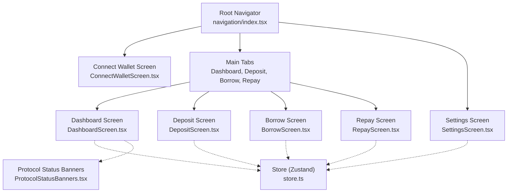
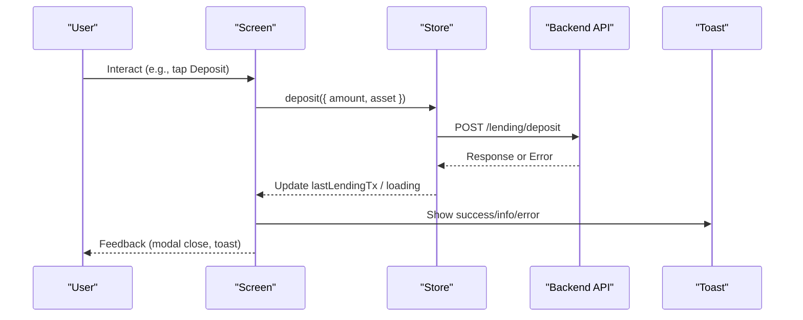
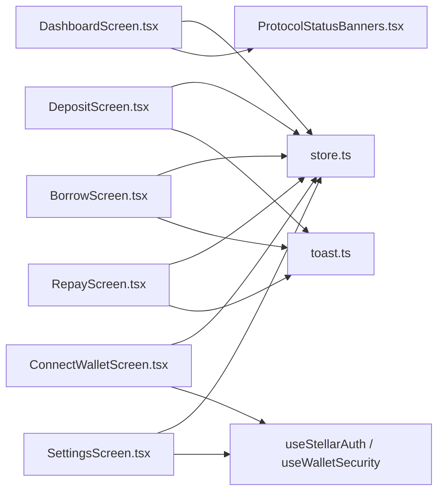

# Core Screens & User Interface

<cite>
**Referenced Files in This Document**
- [DashboardScreen.tsx](file://veilend-mobile/src/screens/DashboardScreen.tsx)
- [DepositScreen.tsx](file://veilend-mobile/src/screens/DepositScreen.tsx)
- [BorrowScreen.tsx](file://veilend-mobile/src/screens/BorrowScreen.tsx)
- [RepayScreen.tsx](file://veilend-mobile/src/screens/RepayScreen.tsx)
- [ConnectWalletScreen.tsx](file://veilend-mobile/src/screens/ConnectWalletScreen.tsx)
- [SettingsScreen.tsx](file://veilend-mobile/src/screens/SettingsScreen.tsx)
- [store.ts](file://veilend-mobile/src/store/store.ts)
- [navigation/index.tsx](file://veilend-mobile/src/navigation/index.tsx)
- [mockData.ts](file://veilend-mobile/src/data/mockData.ts)
- [toast.ts](file://veilend-mobile/src/utils/toast.ts)
- [ProtocolStatusBanners.tsx](file://veilend-mobile/src/components/ProtocolStatusBanners.tsx)
</cite>

## Table of Contents
1. Introduction
2. Project Structure
3. Core Components
4. Architecture Overview
5. Detailed Component Analysis
6. Dependency Analysis
7. Performance Considerations
8. Troubleshooting Guide
9. Conclusion

## Introduction
This document explains the mobile application’s core user-facing screens and UI patterns: Dashboard, Deposit, Borrow, Repay, Connect Wallet, and Settings. It covers screen composition, state management integration via a centralized store, form handling and validation, error states, user feedback mechanisms, navigation flow, responsive design considerations, accessibility features, and cross-platform compatibility between iOS and Android.

## Project Structure
The mobile app is built with React Native and Expo. Screens are organized under src/screens, global state and side effects live in src/store, navigation is defined in src/navigation, and shared components and utilities are placed in src/components and src/utils. Mock data for development and previews resides in src/data.

**Diagram sources**
- [navigation/index.tsx:18-86](file://veilend-mobile/src/navigation/index.tsx#L18-L86)
- [DashboardScreen.tsx:18-345](file://veilend-mobile/src/screens/DashboardScreen.tsx#L18-L345)
- [DepositScreen.tsx:20-188](file://veilend-mobile/src/screens/DepositScreen.tsx#L20-L188)
- [BorrowScreen.tsx:20-190](file://veilend-mobile/src/screens/BorrowScreen.tsx#L20-L190)
- [RepayScreen.tsx:18-202](file://veilend-mobile/src/screens/RepayScreen.tsx#L18-L202)
- [ConnectWalletScreen.tsx:32-216](file://veilend-mobile/src/screens/ConnectWalletScreen.tsx#L32-L216)
- [SettingsScreen.tsx:25-259](file://veilend-mobile/src/screens/SettingsScreen.tsx#L25-L259)
- [store.ts:99-363](file://veilend-mobile/src/store/store.ts#L99-L363)
- [ProtocolStatusBanners.tsx:16-72](file://veilend-mobile/src/components/ProtocolStatusBanners.tsx#L16-L72)

**Section sources**
- [navigation/index.tsx:18-86](file://veilend-mobile/src/navigation/index.tsx#L18-L86)

## Core Components
- Centralized Store (Zustand): Manages authentication, UI preferences, lending operations, portfolio metrics, and transactions. Provides persistence via SecureStore or a shim and exposes async actions like deposit, borrow, repay, fetchPortfolio, and fetchTransactions.
- Navigation: Root navigator decides between Connect Wallet and Main tabs based on session restoration and auth token. Main tabs include Dashboard, Deposit, Borrow, Repay. Settings is a stack screen accessible from Dashboard profile menu and within itself.
- Shared UI Utilities: Toast notifications for user feedback across platforms; Protocol status banners to inform users about network mismatches or sync issues.

Key responsibilities:
- State synchronization across screens using selectors from the store.
- Form input sanitization and validation before submission.
- Error handling with user-friendly messages and retry flows.
- Accessibility labels for inputs and buttons.
- Platform-aware keyboard handling and styling.

**Section sources**
- [store.ts:99-363](file://veilend-mobile/src/store/store.ts#L99-L363)
- [navigation/index.tsx:18-86](file://veilend-mobile/src/navigation/index.tsx#L18-L86)
- [toast.ts:5-15](file://veilend-mobile/src/utils/toast.ts#L5-L15)
- [ProtocolStatusBanners.tsx:16-72](file://veilend-mobile/src/components/ProtocolStatusBanners.tsx#L16-L72)

## Architecture Overview
The app follows a unidirectional data flow:
- Screens read state from the store and dispatch actions through store methods.
- Side effects (API calls, wallet operations) are encapsulated in the store.
- UI updates reactively when store state changes.
- Navigation routes are determined by auth state and session restoration.

**Diagram sources**
- [store.ts:257-308](file://veilend-mobile/src/store/store.ts#L257-L308)
- [DepositScreen.tsx:69-81](file://veilend-mobile/src/screens/DepositScreen.tsx#L69-L81)
- [toast.ts:5-15](file://veilend-mobile/src/utils/toast.ts#L5-L15)

## Detailed Component Analysis

### Dashboard Screen
Purpose: Portfolio overview with balance cards, quick actions, and transaction history. Integrates protocol status banners and privacy mode toggling.

Key behaviors:
- Loads portfolio and transactions on mount via store actions.
- Displays balance, collateral value, borrowed value, available to borrow, health factor.
- Privacy mode masks sensitive values and toggles via header icon.
- Quick action buttons navigate to Deposit, Borrow, Repay.
- Transaction list renders recent activity from store.

Form handling and validation: Not applicable (read-only dashboard).

Error states:
- Loading spinner while fetching portfolio.
- Error message with retry button if portfolio fetch fails.

User feedback:
- Toasts not used here; errors surfaced inline.
- Protocol status banners provide network/sync guidance.

Responsive design:
- Uses Dimensions to compute card width and adjust typography/icon sizes for small screens.

Accessibility:
- Icons and text contrast follow dark theme guidelines.
- No explicit accessibility labels on all interactive elements; consider adding labels for better assistive tech support.

Navigation:
- Navigates to Deposit, Borrow, Repay via navigation prop.
- Profile modal navigates to Settings and supports logout.

State integration:
- Reads address, authToken, currency, isPrivacyMode, portfolio metrics, transactions, and loading flags from store.
- Calls fetchPortfolio and fetchTransactions on mount.

**Section sources**
- [DashboardScreen.tsx:18-345](file://veilend-mobile/src/screens/DashboardScreen.tsx#L18-L345)
- [store.ts:321-362](file://veilend-mobile/src/store/store.ts#L321-L362)
- [ProtocolStatusBanners.tsx:16-72](file://veilend-mobile/src/components/ProtocolStatusBanners.tsx#L16-L72)

### Deposit Screen
Purpose: Supply assets into the market with validation and confirmation flow.

Key behaviors:
- Lists available assets with APY and wallet balance.
- Modal collects amount input, validates, and submits via store deposit action.
- Sanitizes numeric input to prevent invalid characters and multiple decimals.
- Validates positive amounts and ensures not exceeding wallet balance.
- Shows loading indicator during submission and disables confirm button accordingly.

Form handling and validation:
- Input sanitized to digits and single decimal point.
- Validation checks empty input, numeric format, finite parsed value, positive amount, and insufficient balance.

Error states:
- Inline error text displayed below input when validation fails.
- Offline fallback shows mock transaction info via toast.

User feedback:
- Success/info toasts after submission or offline simulation.
- Disabled confirm button during loading.

Responsive design:
- KeyboardAvoidingView adjusts behavior per platform for smooth input experience.

Accessibility:
- Inputs and buttons have accessibilityLabel attributes for screen readers.

Navigation:
- Accessed from Dashboard services grid.

State integration:
- Reads lendingLoading from store.
- Submits via useStore.getState().deposit(...) and updates lastLendingTx on error path.

**Section sources**
- [DepositScreen.tsx:20-188](file://veilend-mobile/src/screens/DepositScreen.tsx#L20-L188)
- [store.ts:257-269](file://veilend-mobile/src/store/store.ts#L257-L269)
- [toast.ts:5-15](file://veilend-mobile/src/utils/toast.ts#L5-L15)

### Borrow Screen
Purpose: Take loans against collateral with validation and confirmation flow.

Key behaviors:
- Lists borrowable assets with APR and availability indicators.
- Modal collects amount input, validates, and submits via store borrow action.
- Sanitizes numeric input similarly to Deposit.
- Validates positive amounts and ensures not exceeding availableToBorrow limit.

Form handling and validation:
- Same sanitization and validation logic as Deposit.
- Enforces borrow limit from store state.

Error states:
- Inline error text for invalid or excessive amounts.
- Offline fallback shows mock transaction info via toast.

User feedback:
- Success/info toasts after submission or offline simulation.
- Disabled confirm button during loading.

Responsive design:
- KeyboardAvoidingView adapts per platform.

Accessibility:
- Inputs and buttons include accessibilityLabel attributes.

Navigation:
- Accessed from Dashboard services grid.

State integration:
- Reads lendingLoading and availableToBorrow from store.
- Submits via useStore.getState().borrow(...) and updates lastLendingTx on error path.

**Section sources**
- [BorrowScreen.tsx:20-190](file://veilend-mobile/src/screens/BorrowScreen.tsx#L20-L190)
- [store.ts:283-295](file://veilend-mobile/src/store/store.ts#L283-L295)
- [toast.ts:5-15](file://veilend-mobile/src/utils/toast.ts#L5-L15)

### Repay Screen
Purpose: Manage active loans and repay debts with validation and confirmation flow.

Key behaviors:
- Displays active loans filtered from mock positions.
- Each loan card shows debt details, value, accrued interest, and health factor.
- Modal collects repayment amount, validates, and submits via store repay action.
- Checks authentication before opening repayment modal.

Form handling and validation:
- Sanitizes numeric input and validates positive amounts not exceeding owed amount.

Error states:
- Inline error text for invalid or excessive amounts.
- Offline fallback shows mock transaction info via toast.

User feedback:
- Success/info toasts after submission or offline simulation.
- Disabled confirm button during loading.

Responsive design:
- KeyboardAvoidingView adapts per platform.

Accessibility:
- Inputs and buttons include accessibilityLabel attributes.

Navigation:
- Accessed from Dashboard services grid.

State integration:
- Reads lendingLoading from store.
- Submits via useStore.getState().repay(...) and updates lastLendingTx on error path.

**Section sources**
- [RepayScreen.tsx:18-202](file://veilend-mobile/src/screens/RepayScreen.tsx#L18-L202)
- [store.ts:296-308](file://veilend-mobile/src/store/store.ts#L296-L308)
- [toast.ts:5-15](file://veilend-mobile/src/utils/toast.ts#L5-L15)

### Connect Wallet Screen
Purpose: Generate or import a Stellar wallet and authenticate with the backend.

Key behaviors:
- Mode switching between generate and import flows.
- Generates new wallet and prompts backup confirmation via security hook.
- Imports existing secret key with validation and connection flow.
- Animated UI with gradient backgrounds and floating cards.

Form handling and validation:
- Secret key input accepts alphanumeric characters; disabled until trimmed input provided.
- Errors surfaced inline when import fails.

Error states:
- Inline error text for import failures.
- Loading states disable interactions during operations.

User feedback:
- Toasts not used here; errors shown inline.
- Backup modal enforces secure handling of secret keys.

Responsive design:
- KeyboardAvoidingView adapts per platform for input fields.

Accessibility:
- Buttons and links are standard TouchableOpacity; consider adding accessibility labels for improved screen reader support.

Navigation:
- Entry point when no auth token exists; navigates to Main tabs upon successful authentication.

State integration:
- Uses useStellarAuth hook for wallet generation/import and usesWalletSecurity hook for backup enforcement.
- Authentication flow persists tokens and addresses via store.

**Section sources**
- [ConnectWalletScreen.tsx:32-216](file://veilend-mobile/src/screens/ConnectWalletScreen.tsx#L32-L216)
- [store.ts:233-252](file://veilend-mobile/src/store/store.ts#L233-L252)

### Settings Screen
Purpose: Configure profile, security, preferences, and account actions.

Key behaviors:
- Editable username with save action and avatar image picker.
- Security section shows backup status and provides export wallet option guarded by backup confirmation.
- Preferences include currency selection chips and toggles for notifications and privacy mode.
- Account section includes logout action.

Form handling and validation:
- Username input validated on save; trims whitespace and updates store.
- Currency selection updates store and persists preference.

Error states:
- Export wallet disabled until backup confirmed; warns via toast if attempted prematurely.

User feedback:
- Toasts for profile update success and warnings.
- Visual indicators for backup status and active currency.

Responsive design:
- Standard scrollable layout with consistent spacing and typography.

Accessibility:
- Switches and buttons are standard controls; consider adding accessibility labels for improved screen reader support.

Navigation:
- Accessible from Dashboard profile modal; back navigation supported.

State integration:
- Reads and writes profileName, profileImage, currency, notificationsEnabled, isPrivacyMode via store.
- Uses useWalletSecurity hook for secret key access and backup confirmation.

**Section sources**
- [SettingsScreen.tsx:25-259](file://veilend-mobile/src/screens/SettingsScreen.tsx#L25-L259)
- [store.ts:155-206](file://veilend-mobile/src/store/store.ts#L155-L206)
- [toast.ts:5-15](file://veilend-mobile/src/utils/toast.ts#L5-L15)

## Dependency Analysis
Screens depend on:
- Store for state and side effects (auth, lending, portfolio, transactions).
- Navigation for routing between screens.
- Utilities for toast notifications and helpers.
- Mock data for preview content.

**Diagram sources**
- [DashboardScreen.tsx:18-345](file://veilend-mobile/src/screens/DashboardScreen.tsx#L18-L345)
- [DepositScreen.tsx:20-188](file://veilend-mobile/src/screens/DepositScreen.tsx#L20-L188)
- [BorrowScreen.tsx:20-190](file://veilend-mobile/src/screens/BorrowScreen.tsx#L20-L190)
- [RepayScreen.tsx:18-202](file://veilend-mobile/src/screens/RepayScreen.tsx#L18-L202)
- [ConnectWalletScreen.tsx:32-216](file://veilend-mobile/src/screens/ConnectWalletScreen.tsx#L32-L216)
- [SettingsScreen.tsx:25-259](file://veilend-mobile/src/screens/SettingsScreen.tsx#L25-L259)
- [store.ts:99-363](file://veilend-mobile/src/store/store.ts#L99-L363)
- [ProtocolStatusBanners.tsx:16-72](file://veilend-mobile/src/components/ProtocolStatusBanners.tsx#L16-L72)
- [toast.ts:5-15](file://veilend-mobile/src/utils/toast.ts#L5-L15)

**Section sources**
- [store.ts:99-363](file://veilend-mobile/src/store/store.ts#L99-L363)
- [navigation/index.tsx:18-86](file://veilend-mobile/src/navigation/index.tsx#L18-L86)

## Performance Considerations
- Minimize re-renders by selecting only needed store slices via Zustand selectors.
- Use FlatList for lists (transactions) to optimize rendering performance.
- Debounce or throttle expensive operations if added later (e.g., real-time price updates).
- Avoid heavy computations inside render; memoize derived values where appropriate.
- Keep modal content lightweight; defer non-critical data loading until modal opens.

[No sources needed since this section provides general guidance]

## Troubleshooting Guide
Common issues and resolutions:
- Portfolio load failure: Dashboard shows error message with retry button; ensure network connectivity and valid address in store.
- Insufficient balance or exceed limits: Deposit and Borrow validate inputs; adjust amount or check available limits.
- Offline mode: Lending actions fall back to mock transactions; verify backend readiness or switch to online environment.
- Network mismatch: Protocol status banners indicate expected vs current network; reconnect or refresh protocol status.
- Backup required: Export wallet disabled until backup confirmed; complete backup flow in Settings.

**Section sources**
- [DashboardScreen.tsx:57-75](file://veilend-mobile/src/screens/DashboardScreen.tsx#L57-L75)
- [DepositScreen.tsx:43-81](file://veilend-mobile/src/screens/DepositScreen.tsx#L43-L81)
- [BorrowScreen.tsx:44-82](file://veilend-mobile/src/screens/BorrowScreen.tsx#L44-L82)
- [RepayScreen.tsx:42-80](file://veilend-mobile/src/screens/RepayScreen.tsx#L42-L80)
- [ProtocolStatusBanners.tsx:16-72](file://veilend-mobile/src/components/ProtocolStatusBanners.tsx#L16-L72)
- [SettingsScreen.tsx:75-85](file://veilend-mobile/src/screens/SettingsScreen.tsx#L75-L85)

## Conclusion
The mobile application implements a cohesive set of core screens with consistent UI patterns, robust form validation, clear error handling, and effective user feedback. State management is centralized in a Zustand store that persists user preferences and session data. Navigation is structured to guide users from wallet connection to main features and settings. The codebase demonstrates thoughtful attention to accessibility and cross-platform compatibility, ensuring a smooth experience on both iOS and Android. Future enhancements can focus on expanding accessibility labels, optimizing performance further, and integrating real backend endpoints for lending operations.