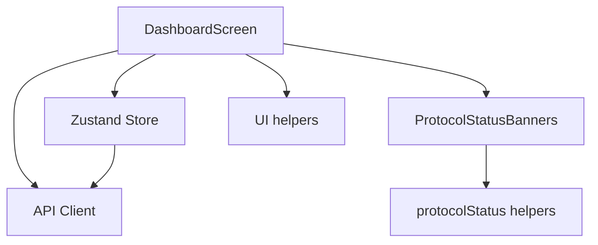
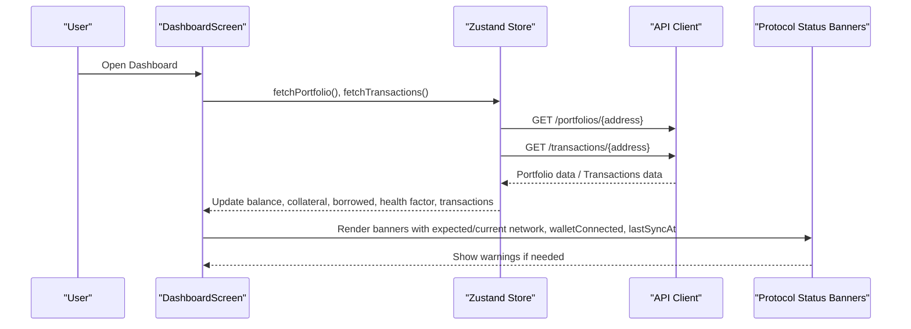
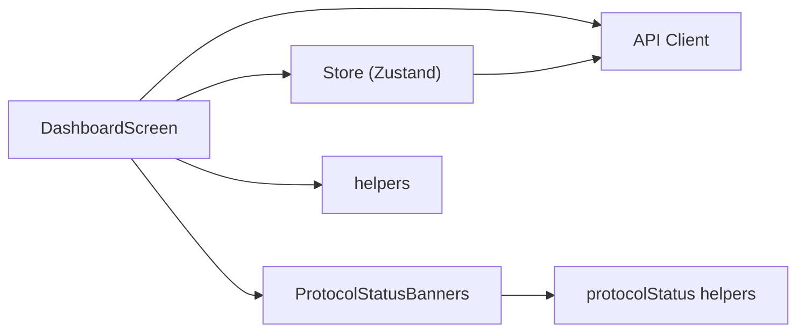

# Dashboard Screen

<cite>
**Referenced Files in This Document**
- [DashboardScreen.tsx](file://veilend-mobile/src/screens/DashboardScreen.tsx)
- [store.ts](file://veilend-mobile/src/store/store.ts)
- [ProtocolStatusBanners.tsx](file://veilend-mobile/src/components/ProtocolStatusBanners.tsx)
- [protocolStatus.ts](file://veilend-mobile/src/utils/protocolStatus.ts)
- [helpers.ts](file://veilend-mobile/src/utils/helpers.ts)
- [mockData.ts](file://veilend-mobile/src/data/mockData.ts)
- [api.ts](file://veilend-mobile/src/utils/api.ts)
</cite>

## Table of Contents
1. [Introduction](#introduction)
2. [Project Structure](#project-structure)
3. [Core Components](#core-components)
4. [Architecture Overview](#architecture-overview)
5. [Detailed Component Analysis](#detailed-component-analysis)
6. [Dependency Analysis](#dependency-analysis)
7. [Performance Considerations](#performance-considerations)
8. [Troubleshooting Guide](#troubleshooting-guide)
9. [Conclusion](#conclusion)

## Introduction
This document explains the Dashboard screen component, which serves as the main landing page of the mobile application. It covers portfolio overview with balance cards featuring gradient backgrounds and glassmorphism effects, privacy mode that masks values, transaction history display, service navigation grid, Zustand store integration for data fetching and error recovery, responsive design using Dimensions API, a horizontal card carousel with pagination dots via FlatList, modal-based profile menu, protocol status banner integration, network validation checks, and user greeting logic based on time of day.

## Project Structure
The Dashboard screen is implemented as a single React Native functional component that composes several UI sections:
- Header with greeting, username, avatar, privacy toggle, and profile menu trigger
- Protocol status banners for wallet connectivity, network mismatch, and sync lag
- Horizontal balance card carousel (FlatList) with pagination dots
- Services grid for quick actions (Deposit, Borrow, Repay, More)
- Transactions list showing recent activity

**Diagram sources**
- [DashboardScreen.tsx:1-654](file://veilend-mobile/src/screens/DashboardScreen.tsx#L1-L654)
- [store.ts:1-397](file://veilend-mobile/src/store/store.ts#L1-L397)
- [ProtocolStatusBanners.tsx:1-123](file://veilend-mobile/src/components/ProtocolStatusBanners.tsx#L1-L123)
- [protocolStatus.ts:1-73](file://veilend-mobile/src/utils/protocolStatus.ts#L1-L73)
- [helpers.ts:1-11](file://veilend-mobile/src/utils/helpers.ts#L1-L11)
- [api.ts:1-57](file://veilend-mobile/src/utils/api.ts#L1-L57)

**Section sources**
- [DashboardScreen.tsx:1-654](file://veilend-mobile/src/screens/DashboardScreen.tsx#L1-L654)
- [store.ts:1-397](file://veilend-mobile/src/store/store.ts#L1-L397)

## Core Components
- Balance cards: Gradient background with a subtle radial glow overlay and glassmorphism effect; displays Total Balance, Collateral Value, Borrowed Value; supports privacy mode masking.
- Privacy mode: Toggles masked values across cards; persisted in secure storage via Zustand.
- Transaction history: Displays recent transactions fetched from the backend with type icons and formatted amounts.
- Service navigation grid: Quick-access buttons to Deposit, Borrow, Repay, and More screens.
- Profile menu modal: Bottom sheet-style modal with profile summary, settings navigation, and logout action.
- Protocol status banners: Warns about wallet disconnection, wrong network, or stale sync; provides retry/reconnect actions.

**Section sources**
- [DashboardScreen.tsx:51-171](file://veilend-mobile/src/screens/DashboardScreen.tsx#L51-L171)
- [DashboardScreen.tsx:180-344](file://veilend-mobile/src/screens/DashboardScreen.tsx#L180-L344)
- [store.ts:151-230](file://veilend-mobile/src/store/store.ts#L151-L230)
- [ProtocolStatusBanners.tsx:16-72](file://veilend-mobile/src/components/ProtocolStatusBanners.tsx#L16-L72)

## Architecture Overview
The Dashboard screen orchestrates UI state and data flow through a centralized Zustand store. On mount, it triggers parallel fetches for portfolio and transactions. The store handles loading states and errors, which are surfaced in the UI. Protocol status banners are computed from current network, expected network, wallet connection, and last sync timestamp.

**Diagram sources**
- [DashboardScreen.tsx:100-110](file://veilend-mobile/src/screens/DashboardScreen.tsx#L100-L110)
- [store.ts:321-362](file://veilend-mobile/src/store/store.ts#L321-L362)
- [api.ts:16-22](file://veilend-mobile/src/utils/api.ts#L16-L22)
- [ProtocolStatusBanners.tsx:25-30](file://veilend-mobile/src/components/ProtocolStatusBanners.tsx#L25-L30)

## Detailed Component Analysis

### DashboardScreen
Responsibilities:
- Compose header, banners, carousel, services grid, and transactions list
- Manage local UI state for profile modal visibility and carousel index
- Handle logout and status retry flows
- Implement responsive sizing via Dimensions API
- Provide time-based greeting logic

Key behaviors:
- Loading and error states for portfolio data render dedicated views with retry
- Privacy mode toggles value masking across cards
- FlatList with pagingEnabled creates a horizontal carousel; onViewableItemsChanged updates pagination dots
- Modal-based profile menu allows navigation to Settings and logout

Responsive patterns:
- Uses window width to compute card width and small-screen adjustments for icon sizes and typography

Greeting logic:
- Returns “Good Morning,” “Good Afternoon,” or “Good Evening,” based on current hour

Privacy mode:
- When enabled, balances show masked placeholders instead of actual numbers

Service navigation:
- Buttons navigate to Deposit, Borrow, Repay, and placeholder More

Transaction list:
- Maps over transactions array to render items with icons, titles, dates, and amounts

**Section sources**
- [DashboardScreen.tsx:11-14](file://veilend-mobile/src/screens/DashboardScreen.tsx#L11-L14)
- [DashboardScreen.tsx:17-47](file://veilend-mobile/src/screens/DashboardScreen.tsx#L17-L47)
- [DashboardScreen.tsx:57-75](file://veilend-mobile/src/screens/DashboardScreen.tsx#L57-L75)
- [DashboardScreen.tsx:90-110](file://veilend-mobile/src/screens/DashboardScreen.tsx#L90-L110)
- [DashboardScreen.tsx:121-171](file://veilend-mobile/src/screens/DashboardScreen.tsx#L121-L171)
- [DashboardScreen.tsx:173-178](file://veilend-mobile/src/screens/DashboardScreen.tsx#L173-L178)
- [DashboardScreen.tsx:180-344](file://veilend-mobile/src/screens/DashboardScreen.tsx#L180-L344)
- [DashboardScreen.tsx:348-654](file://veilend-mobile/src/screens/DashboardScreen.tsx#L348-L654)

### Zustand Store Integration
Responsibilities:
- Centralized state for authentication, UI preferences, protocol status, lending operations, and portfolio data
- Persisted session restoration from secure storage
- Data fetching for portfolio and transactions with loading and error handling
- Network status refresh and sync timestamp tracking

Key flows:
- fetchPortfolio: Calls backend portfolio endpoint, sets balance, collateralValue, borrowedValue, availableToBorrow, healthFactor, and loading/error flags
- fetchTransactions: Calls backend transactions endpoint, populates transactions array
- refreshProtocolStatus: Calls health endpoint, updates currentNetwork and lastProtocolSyncAt, manages loading/error
- Session restore: Hydrates store from secure storage on app launch

Error recovery:
- Errors set specific error messages and allow retry via UI controls

**Section sources**
- [store.ts:17-97](file://veilend-mobile/src/store/store.ts#L17-L97)
- [store.ts:207-230](file://veilend-mobile/src/store/store.ts#L207-L230)
- [store.ts:321-362](file://veilend-mobile/src/store/store.ts#L321-L362)
- [store.ts:369-396](file://veilend-mobile/src/store/store.ts#L369-L396)

### Protocol Status Banners
Responsibilities:
- Compute and render warning/danger banners based on wallet connectivity, network mismatch, and sync staleness
- Provide actionable buttons to reconnect or retry sync

Logic:
- Wallet disconnected: Danger banner with Reconnect action
- Wrong Stellar network: Warning banner with Check network action
- Sync delayed: Warning banner with Retry sync action when last sync exceeds threshold

Integration:
- Dashboard passes expectedNetwork, currentNetwork, walletConnected, lastSyncedAt, and callbacks to banners component

**Section sources**
- [ProtocolStatusBanners.tsx:6-14](file://veilend-mobile/src/components/ProtocolStatusBanners.tsx#L6-L14)
- [ProtocolStatusBanners.tsx:16-72](file://veilend-mobile/src/components/ProtocolStatusBanners.tsx#L16-L72)
- [protocolStatus.ts:1-73](file://veilend-mobile/src/utils/protocolStatus.ts#L1-L73)
- [DashboardScreen.tsx:201-209](file://veilend-mobile/src/screens/DashboardScreen.tsx#L201-L209)

### API Client
Responsibilities:
- Configure base URL per runtime platform
- Attach Authorization header using token from store
- Intercept responses to report structured errors

Behavior:
- Requests include Bearer token when present
- Response interceptor captures HTTP status and metadata for error reporting

**Section sources**
- [api.ts:1-57](file://veilend-mobile/src/utils/api.ts#L1-L57)

### UI Helpers and Mock Data
Responsibilities:
- shortenAddress: Truncates wallet addresses for display
- getCurrencySymbol: Returns localized currency symbol based on configured currency
- mockData: Provides fallback user info and sample assets/transactions for development

Usage:
- Dashboard uses shortenAddress for default username and getCurrencySymbol for formatting balances

**Section sources**
- [helpers.ts:1-11](file://veilend-mobile/src/utils/helpers.ts#L1-L11)
- [mockData.ts:1-92](file://veilend-mobile/src/data/mockData.ts#L1-L92)
- [DashboardScreen.tsx:76-78](file://veilend-mobile/src/screens/DashboardScreen.tsx#L76-L78)

## Dependency Analysis
The Dashboard screen depends on:
- Zustand store for state and side effects
- API client for network requests
- Protocol status utilities for banner computation
- UI helpers for formatting and display

**Diagram sources**
- [DashboardScreen.tsx:1-10](file://veilend-mobile/src/screens/DashboardScreen.tsx#L1-L10)
- [store.ts:1-5](file://veilend-mobile/src/store/store.ts#L1-L5)
- [ProtocolStatusBanners.tsx:1-5](file://veilend-mobile/src/components/ProtocolStatusBanners.tsx#L1-L5)
- [protocolStatus.ts:1-8](file://veilend-mobile/src/utils/protocolStatus.ts#L1-L8)
- [helpers.ts:1-11](file://veilend-mobile/src/utils/helpers.ts#L1-L11)
- [api.ts:1-14](file://veilend-mobile/src/utils/api.ts#L1-L14)

**Section sources**
- [DashboardScreen.tsx:1-10](file://veilend-mobile/src/screens/DashboardScreen.tsx#L1-L10)
- [store.ts:1-5](file://veilend-mobile/src/store/store.ts#L1-L5)
- [ProtocolStatusBanners.tsx:1-5](file://veilend-mobile/src/components/ProtocolStatusBanners.tsx#L1-L5)
- [protocolStatus.ts:1-8](file://veilend-mobile/src/utils/protocolStatus.ts#L1-L8)
- [helpers.ts:1-11](file://veilend-mobile/src/utils/helpers.ts#L1-L11)
- [api.ts:1-14](file://veilend-mobile/src/utils/api.ts#L1-L14)

## Performance Considerations
- Parallel data fetching: Dashboard triggers portfolio and transactions fetches concurrently to reduce total load time.
- FlatList pagination: Using pagingEnabled and viewability config ensures smooth scrolling and accurate dot indicators.
- Conditional rendering: Loading and error states prevent unnecessary renders during async operations.
- Secure storage persistence: Minimizes re-authentication and restores UI preferences quickly on app launch.

[No sources needed since this section provides general guidance]

## Troubleshooting Guide
Common issues and resolutions:
- Portfolio load failure:
  - Symptom: Error message displayed with Retry button
  - Cause: Backend request failed or returned an error
  - Resolution: Use Retry to call fetchPortfolio again; check network and authentication token
- Transactions load failure:
  - Symptom: Empty list or error state
  - Cause: Backend request failed
  - Resolution: Ensure address exists and token is valid; retry fetchTransactions
- Protocol status stale:
  - Symptom: “Sync delayed” banner appears
  - Cause: lastProtocolSyncAt older than threshold
  - Resolution: Trigger refreshProtocolStatus via Retry sync
- Wrong network:
  - Symptom: “Wrong Stellar network” banner appears
  - Cause: currentNetwork differs from expectedNetwork
  - Resolution: Switch wallet to expected network or update expectedNetwork configuration

**Section sources**
- [DashboardScreen.tsx:57-75](file://veilend-mobile/src/screens/DashboardScreen.tsx#L57-L75)
- [store.ts:321-362](file://veilend-mobile/src/store/store.ts#L321-L362)
- [protocolStatus.ts:29-72](file://veilend-mobile/src/utils/protocolStatus.ts#L29-L72)
- [ProtocolStatusBanners.tsx:25-72](file://veilend-mobile/src/components/ProtocolStatusBanners.tsx#L25-L72)

## Conclusion
The Dashboard screen provides a cohesive portfolio overview with visually rich balance cards, robust privacy mode, clear transaction history, and intuitive service navigation. It integrates tightly with Zustand for state management and error handling, leverages responsive design patterns, and surfaces critical protocol status information through actionable banners. Together, these elements deliver a reliable and user-friendly entry point to the application’s lending features.

[No sources needed since this section summarizes without analyzing specific files]