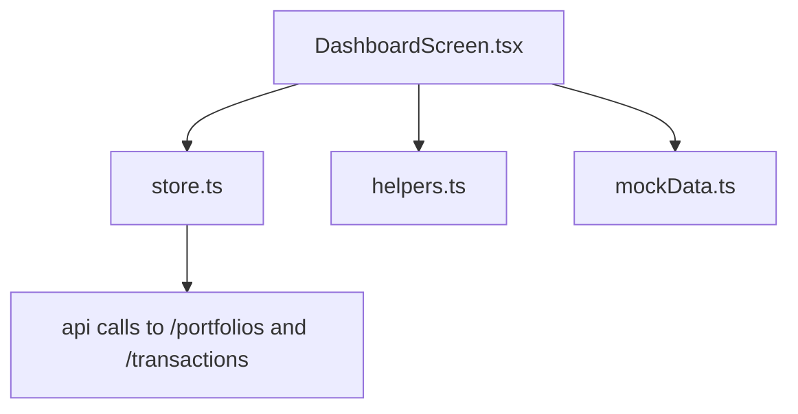
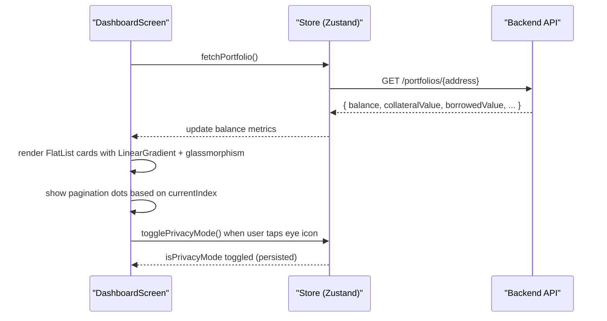
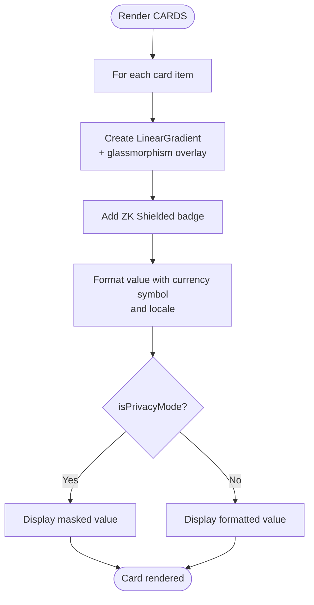
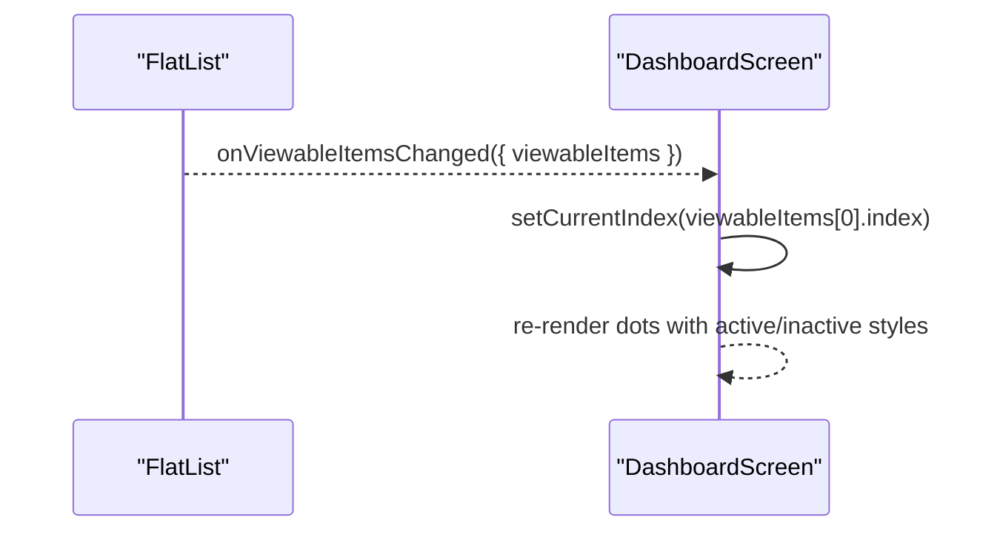
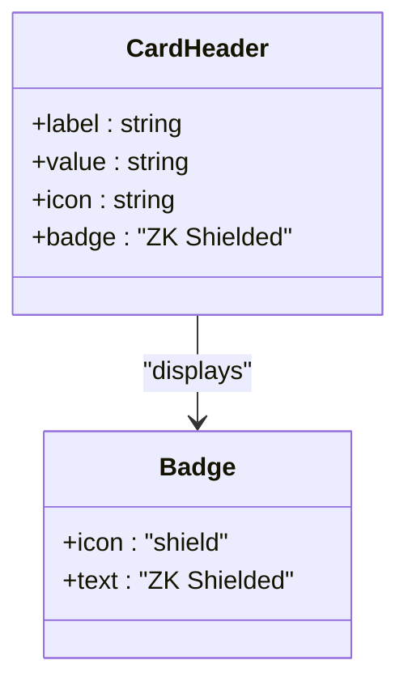
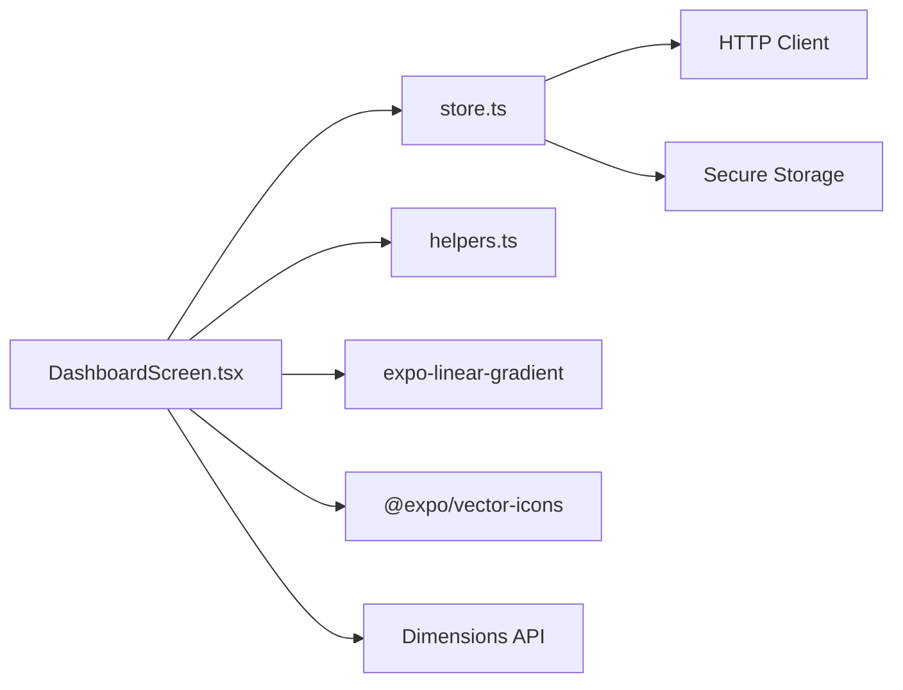

# Portfolio Overview & Balance Cards

<cite>
**Referenced Files in This Document**
- [DashboardScreen.tsx](file://veilend-mobile/src/screens/DashboardScreen.tsx)
- [store.ts](file://veilend-mobile/src/store/store.ts)
- [helpers.ts](file://veilend-mobile/src/utils/helpers.ts)
- [mockData.ts](file://veilend-mobile/src/data/mockData.ts)
</cite>

## Table of Contents
1. Introduction
2. Project Structure
3. Core Components
4. Architecture Overview
5. Detailed Component Analysis
6. Dependency Analysis
7. Performance Considerations
8. Troubleshooting Guide
9. Conclusion

## Introduction
This document explains the portfolio overview section of the Dashboard screen with a focus on the balance cards carousel. It covers the gradient background design using LinearGradient with purple-to-purple gradients, glassmorphism effects via semi-transparent overlays, responsive card sizing using Dimensions API, horizontal paging with FlatList and pagination dots, privacy mode that masks sensitive values, and the ZK Shielded badge indicating zero-knowledge protection status. It also details the three main balance metrics: Total Balance, Collateral Value, and Borrowed Value, including their icons and formatting behavior.

## Project Structure
The portfolio overview is implemented within the mobile app’s Dashboard screen. The key pieces are:
- Dashboard screen component that renders the header, balance cards carousel, pagination dots, services grid, and transactions list.
- Global store that holds portfolio data (balance, collateral value, borrowed value), privacy mode, currency, and fetch functions.
- Utility helpers for currency symbol mapping and address shortening.
- Mock data used for fallbacks and UI examples.

**Diagram sources**
- [DashboardScreen.tsx:1-654](file://veilend-mobile/src/screens/DashboardScreen.tsx#L1-L654)
- [store.ts:1-397](file://veilend-mobile/src/store/store.ts#L1-L397)
- [helpers.ts:1-11](file://veilend-mobile/src/utils/helpers.ts#L1-L11)
- [mockData.ts:1-92](file://veilend-mobile/src/data/mockData.ts#L1-L92)

**Section sources**
- [DashboardScreen.tsx:1-654](file://veilend-mobile/src/screens/DashboardScreen.tsx#L1-L654)
- [store.ts:1-397](file://veilend-mobile/src/store/store.ts#L1-L397)
- [helpers.ts:1-11](file://veilend-mobile/src/utils/helpers.ts#L1-L11)
- [mockData.ts:1-92](file://veilend-mobile/src/data/mockData.ts#L1-L92)

## Core Components
- Balance cards carousel: Horizontal FlatList with pagingEnabled rendering three metric cards (Total Balance, Collateral Value, Borrowed Value). Each card uses a LinearGradient background with purple-to-purple colors, a semi-transparent overlay for glassmorphism, and a ZK Shielded badge.
- Pagination dots: Active/inactive dot indicators synchronized with the visible card index.
- Privacy mode: Toggles masking of balance values and updates the eye icon accordingly; persisted across sessions.
- Responsive layout: Card width computed from screen width using Dimensions API to ensure full-width cards with padding.

Key implementation references:
- Carousel configuration and rendering: [DashboardScreen.tsx:121-171](file://veilend-mobile/src/screens/DashboardScreen.tsx#L121-L171), [DashboardScreen.tsx:266-279](file://veilend-mobile/src/screens/DashboardScreen.tsx#L266-L279)
- Gradient and glassmorphism styling: [DashboardScreen.tsx:123-139](file://veilend-mobile/src/screens/DashboardScreen.tsx#L123-L139), [DashboardScreen.tsx:391-405](file://veilend-mobile/src/screens/DashboardScreen.tsx#L391-L405)
- Pagination dots: [DashboardScreen.tsx:281-292](file://veilend-mobile/src/screens/DashboardScreen.tsx#L281-L292), [DashboardScreen.tsx:474-493](file://veilend-mobile/src/screens/DashboardScreen.tsx#L474-L493)
- Privacy mode toggle and masking: [DashboardScreen.tsx:188-191](file://veilend-mobile/src/screens/DashboardScreen.tsx#L188-L191), [DashboardScreen.tsx:144-151](file://veilend-mobile/src/screens/DashboardScreen.tsx#L144-L151), [store.ts:173-185](file://veilend-mobile/src/store/store.ts#L173-L185)
- Currency formatting: [DashboardScreen.tsx:147-148](file://veilend-mobile/src/screens/DashboardScreen.tsx#L147-L148), [helpers.ts:6-10](file://veilend-mobile/src/utils/helpers.ts#L6-L10)

**Section sources**
- [DashboardScreen.tsx:121-171](file://veilend-mobile/src/screens/DashboardScreen.tsx#L121-L171)
- [DashboardScreen.tsx:266-292](file://veilend-mobile/src/screens/DashboardScreen.tsx#L266-L292)
- [DashboardScreen.tsx:391-405](file://veilend-mobile/src/screens/DashboardScreen.tsx#L391-L405)
- [store.ts:173-185](file://veilend-mobile/src/store/store.ts#L173-L185)
- [helpers.ts:6-10](file://veilend-mobile/src/utils/helpers.ts#L6-L10)

## Architecture Overview
The dashboard composes UI components around state managed by a global store. On mount, it fetches portfolio and transaction data. The balance cards render from the store’s balance metrics, applying privacy mode and currency formatting. Pagination dots reflect the current page via viewability callbacks.

**Diagram sources**
- [DashboardScreen.tsx:100-110](file://veilend-mobile/src/screens/DashboardScreen.tsx#L100-L110)
- [store.ts:321-343](file://veilend-mobile/src/store/store.ts#L321-L343)
- [store.ts:173-185](file://veilend-mobile/src/store/store.ts#L173-L185)

## Detailed Component Analysis

### Balance Cards Carousel
- Data source: Three items representing Total Balance, Collateral Value, and Borrowed Value. Values are formatted with currency symbols and locale-aware number formatting.
- Visual design:
  - Background: LinearGradient with purple-to-purple gradient colors.
  - Glassmorphism: Semi-transparent overlay View layered over the gradient to simulate frosted glass effect.
  - Icons: Each card displays an icon corresponding to its metric type.
  - ZK Shielded badge: A small pill-shaped badge with a shield icon and “ZK Shielded” text indicates zero-knowledge protection status.
- Responsiveness: Card width is derived from screen width minus horizontal padding to ensure one card per screen with paging enabled.
- Interaction: Horizontal swipe with pagingEnabled provides smooth transitions between cards.

**Diagram sources**
- [DashboardScreen.tsx:121-171](file://veilend-mobile/src/screens/DashboardScreen.tsx#L121-L171)
- [helpers.ts:6-10](file://veilend-mobile/src/utils/helpers.ts#L6-L10)

**Section sources**
- [DashboardScreen.tsx:121-171](file://veilend-mobile/src/screens/DashboardScreen.tsx#L121-L171)
- [DashboardScreen.tsx:391-405](file://veilend-mobile/src/screens/DashboardScreen.tsx#L391-L405)
- [helpers.ts:6-10](file://veilend-mobile/src/utils/helpers.ts#L6-L10)

### Pagination Dots
- Behavior: Dots indicate the current page. Active dot is wider and colored distinctly; inactive dots are narrower and dimmed.
- Synchronization: onViewableItemsChanged updates the current index threshold-based on visibility percentage.

**Diagram sources**
- [DashboardScreen.tsx:90-98](file://veilend-mobile/src/screens/DashboardScreen.tsx#L90-L98)
- [DashboardScreen.tsx:281-292](file://veilend-mobile/src/screens/DashboardScreen.tsx#L281-L292)

**Section sources**
- [DashboardScreen.tsx:90-98](file://veilend-mobile/src/screens/DashboardScreen.tsx#L90-L98)
- [DashboardScreen.tsx:281-292](file://veilend-mobile/src/screens/DashboardScreen.tsx#L281-L292)

### Privacy Mode Integration
- Toggle: User can tap the eye icon to switch privacy mode. The state is persisted across sessions.
- Effect: When privacy mode is enabled, balance values are masked with placeholder characters; the eye icon reflects the current mode.
- Persistence: Privacy mode preference is stored securely and restored on app launch.

```mermaid
stateDiagram-v2
[*] --> Normal
Normal --> Privacy : "togglePrivacyMode()"
Privacy --> Normal : "togglePrivacyMode()"
note right of Normal : "Values shown with currency formatting"
note right of Privacy : "Values masked; eye icon updated"
```

**Diagram sources**
- [DashboardScreen.tsx:188-191](file://veilend-mobile/src/screens/DashboardScreen.tsx#L188-L191)
- [DashboardScreen.tsx:144-151](file://veilend-mobile/src/screens/DashboardScreen.tsx#L144-L151)
- [store.ts:173-185](file://veilend-mobile/src/store/store.ts#L173-L185)
- [store.ts:369-396](file://veilend-mobile/src/store/store.ts#L369-L396)

**Section sources**
- [DashboardScreen.tsx:188-191](file://veilend-mobile/src/screens/DashboardScreen.tsx#L188-L191)
- [DashboardScreen.tsx:144-151](file://veilend-mobile/src/screens/DashboardScreen.tsx#L144-L151)
- [store.ts:173-185](file://veilend-mobile/src/store/store.ts#L173-L185)
- [store.ts:369-396](file://veilend-mobile/src/store/store.ts#L369-L396)

### ZK Shielded Badge
- Purpose: Indicates that the displayed balance is protected via zero-knowledge shielding.
- Implementation: A compact badge with a shield icon and label positioned in the card header.

**Diagram sources**
- [DashboardScreen.tsx:140-159](file://veilend-mobile/src/screens/DashboardScreen.tsx#L140-L159)

**Section sources**
- [DashboardScreen.tsx:140-159](file://veilend-mobile/src/screens/DashboardScreen.tsx#L140-L159)

### Metrics and Formatting Examples
- Total Balance: Displays the user’s total balance with a wallet icon. In privacy mode, shows masked value; otherwise shows currency symbol and formatted number.
- Collateral Value: Shows the value of assets posted as collateral with a shield-checkmark icon.
- Borrowed Value: Shows the outstanding borrowed amount with a trending-down icon.

Formatting details:
- Currency symbol resolved from the selected currency using helper function.
- Number formatting uses locale-aware separators and fixed decimal places.

References:
- Metric definitions and icons: [DashboardScreen.tsx:51-55](file://veilend-mobile/src/screens/DashboardScreen.tsx#L51-L55)
- Formatting logic: [DashboardScreen.tsx:144-151](file://veilend-mobile/src/screens/DashboardScreen.tsx#L144-L151)
- Currency symbol mapping: [helpers.ts:6-10](file://veilend-mobile/src/utils/helpers.ts#L6-L10)

**Section sources**
- [DashboardScreen.tsx:51-55](file://veilend-mobile/src/screens/DashboardScreen.tsx#L51-L55)
- [DashboardScreen.tsx:144-151](file://veilend-mobile/src/screens/DashboardScreen.tsx#L144-L151)
- [helpers.ts:6-10](file://veilend-mobile/src/utils/helpers.ts#L6-L10)

## Dependency Analysis
- DashboardScreen depends on:
  - Store for portfolio metrics, privacy mode, currency, and fetch functions.
  - Helpers for currency symbol resolution.
  - Expo Linear Gradient for backgrounds.
  - Ionicons for icons.
  - Dimensions API for responsive card width.
- Store depends on:
  - API client to fetch portfolio and transactions.
  - Secure storage for persistence of privacy mode and other settings.

**Diagram sources**
- [DashboardScreen.tsx:1-11](file://veilend-mobile/src/screens/DashboardScreen.tsx#L1-L11)
- [store.ts:1-13](file://veilend-mobile/src/store/store.ts#L1-L13)
- [helpers.ts:1-11](file://veilend-mobile/src/utils/helpers.ts#L1-L11)

**Section sources**
- [DashboardScreen.tsx:1-11](file://veilend-mobile/src/screens/DashboardScreen.tsx#L1-L11)
- [store.ts:1-13](file://veilend-mobile/src/store/store.ts#L1-L13)
- [helpers.ts:1-11](file://veilend-mobile/src/utils/helpers.ts#L1-L11)

## Performance Considerations
- FlatList pagingEnabled ensures one card per page, reducing unnecessary re-renders during swipes.
- onViewableItemsChanged with a visibility threshold minimizes frequent index updates.
- Using extraData={isPrivacyMode} ensures minimal re-renders only when privacy mode changes.
- LinearGradient and glassmorphism overlays are lightweight but should be kept simple to avoid heavy compositing on low-end devices.

[No sources needed since this section provides general guidance]

## Troubleshooting Guide
- Portfolio not loading:
  - Check network connectivity and backend availability.
  - Use the retry button if an error is displayed; it triggers fetchPortfolio again.
- Privacy mode not persisting:
  - Ensure secure storage is available and not blocked by platform policies.
  - Verify session restoration code runs on app launch.
- Incorrect currency symbol:
  - Confirm currency setting in store and mapping in helpers.
- Pagination dots out of sync:
  - Validate onViewableItemsChanged thresholds and ensure FlatList is horizontal with pagingEnabled.

**Section sources**
- [DashboardScreen.tsx:57-75](file://veilend-mobile/src/screens/DashboardScreen.tsx#L57-L75)
- [store.ts:321-343](file://veilend-mobile/src/store/store.ts#L321-L343)
- [store.ts:369-396](file://veilend-mobile/src/store/store.ts#L369-L396)

## Conclusion
The portfolio overview presents a polished, privacy-first experience with a visually rich balance cards carousel. It leverages gradient backgrounds, glassmorphism overlays, responsive sizing, and smooth paging interactions. Privacy mode protects sensitive values while maintaining usability, and the ZK Shielded badge communicates zero-knowledge protection. The design integrates cleanly with the global store for data and state management, ensuring consistent behavior across sessions and platforms.