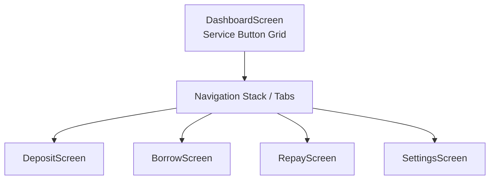
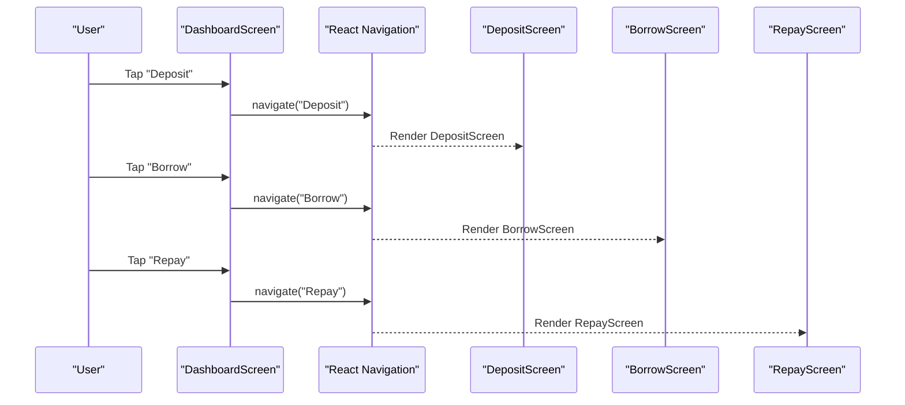
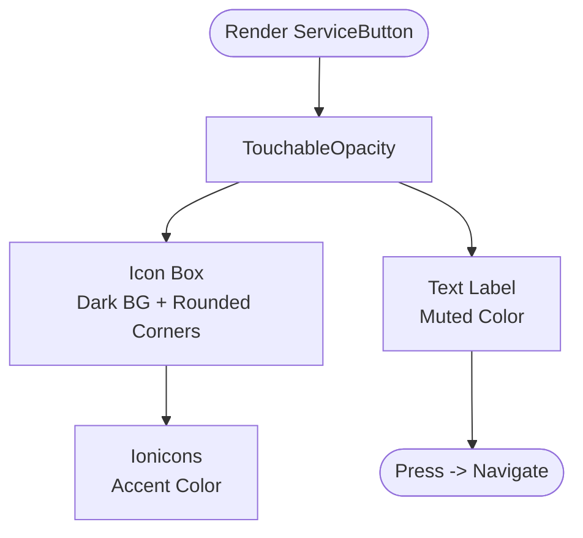
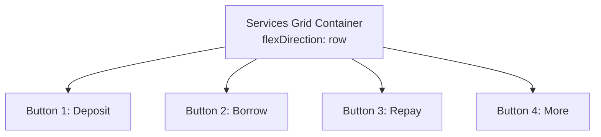
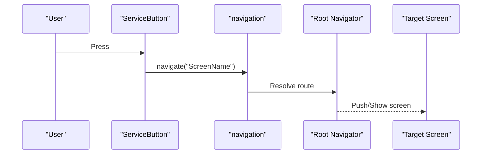
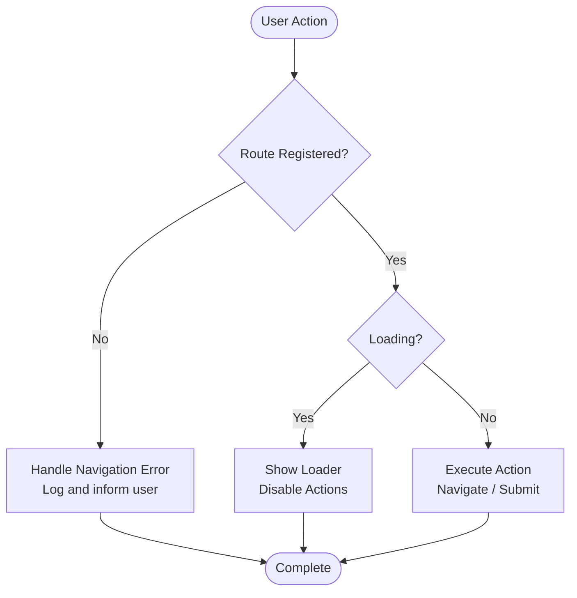
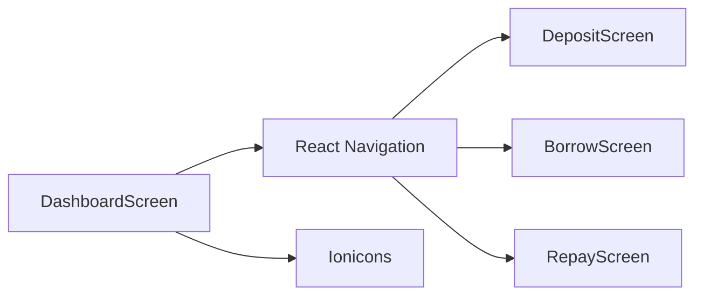

# Service Navigation Grid

<cite>
**Referenced Files in This Document**
- [DashboardScreen.tsx](file://veilend-mobile/src/screens/DashboardScreen.tsx)
- [index.tsx](file://veilend-mobile/src/navigation/index.tsx)
- [DepositScreen.tsx](file://veilend-mobile/src/screens/DepositScreen.tsx)
- [BorrowScreen.tsx](file://veilend-mobile/src/screens/BorrowScreen.tsx)
- [RepayScreen.tsx](file://veilend-mobile/src/screens/RepayScreen.tsx)
</cite>

## Table of Contents
1. [Introduction](#introduction)
2. [Project Structure](#project-structure)
3. [Core Components](#core-components)
4. [Architecture Overview](#architecture-overview)
5. [Detailed Component Analysis](#detailed-component-analysis)
6. [Dependency Analysis](#dependency-analysis)
7. [Performance Considerations](#performance-considerations)
8. [Troubleshooting Guide](#troubleshooting-guide)
9. [Conclusion](#conclusion)

## Introduction
This document explains the service navigation grid on the mobile dashboard that provides quick access to core lending protocol features: Deposit, Borrow, Repay, and More. It focuses on the inline ServiceButton component used within the Dashboard screen, its consistent styling (icon containers with dark backgrounds, rounded corners), and how each button integrates with React Navigation to route users to the corresponding screens. It also covers responsive layout behavior using flexbox, touch feedback considerations, accessibility attributes present across related screens, and strategies for handling navigation errors and loading states.

## Project Structure
The service navigation grid lives inside the mobile app’s Dashboard screen and navigates to dedicated screens via a React Navigation stack and tab navigator. The key files involved are:
- Dashboard screen where the grid is rendered and ServiceButton is defined
- Root navigation configuration that registers all screens
- Individual screens for Deposit, Borrow, and Repay

**Diagram sources**
- [DashboardScreen.tsx:294-317](file://veilend-mobile/src/screens/DashboardScreen.tsx#L294-L317)
- [index.tsx:18-44](file://veilend-mobile/src/navigation/index.tsx#L18-L44)
- [index.tsx:73-86](file://veilend-mobile/src/navigation/index.tsx#L73-L86)

**Section sources**
- [DashboardScreen.tsx:18-345](file://veilend-mobile/src/screens/DashboardScreen.tsx#L18-L345)
- [index.tsx:1-97](file://veilend-mobile/src/navigation/index.tsx#L1-L97)

## Core Components
- ServiceButton: An inline functional component defined within the Dashboard screen. It renders a TouchableOpacity containing:
  - An icon container with a dark background and rounded corners
  - An Ionicons icon centered inside the container
  - A label beneath the icon
- Services Grid: A horizontal flex row distributing four buttons evenly across the screen width.

Key implementation details:
- Icon container uses a dark background color and rounded corners for visual consistency
- Labels use a muted text color for secondary information
- Each button passes an onPress handler that calls navigation.navigate with the target screen name

Styling highlights:
- Container spacing and alignment ensure equal distribution
- Icon box dimensions and border radius provide a compact, tactile target
- Label typography maintains readability at small sizes

Accessibility notes:
- Buttons rely on TouchableOpacity for touch interaction
- Related screens include accessibilityLabel props on inputs and action buttons to improve screen reader support

**Section sources**
- [DashboardScreen.tsx:112-119](file://veilend-mobile/src/screens/DashboardScreen.tsx#L112-L119)
- [DashboardScreen.tsx:294-317](file://veilend-mobile/src/screens/DashboardScreen.tsx#L294-L317)
- [DashboardScreen.tsx:500-520](file://veilend-mobile/src/screens/DashboardScreen.tsx#L500-L520)
- [DepositScreen.tsx:145-183](file://veilend-mobile/src/screens/DepositScreen.tsx#L145-L183)
- [BorrowScreen.tsx:145-183](file://veilend-mobile/src/screens/BorrowScreen.tsx#L145-L183)
- [RepayScreen.tsx:157-195](file://veilend-mobile/src/screens/RepayScreen.tsx#L157-L195)

## Architecture Overview
The navigation flow starts from the Dashboard screen’s service grid and routes to feature-specific screens through React Navigation. The root navigator sets up both a stack and a bottom tab navigator, ensuring consistent navigation context across the app.

**Diagram sources**
- [DashboardScreen.tsx:294-317](file://veilend-mobile/src/screens/DashboardScreen.tsx#L294-L317)
- [index.tsx:18-44](file://veilend-mobile/src/navigation/index.tsx#L18-L44)

## Detailed Component Analysis

### ServiceButton Component
- Purpose: Provide a consistent, accessible, and visually cohesive entry point to core lending actions
- Props:
  - icon: Ionicons name string
  - label: Displayed text under the icon
  - onPress: Callback invoked on press to trigger navigation
- Visual structure:
  - TouchableOpacity wrapper for touch handling
  - Icon container with dark background and rounded corners
  - Centered icon with accent color
  - Label below the icon

**Diagram sources**
- [DashboardScreen.tsx:112-119](file://veilend-mobile/src/screens/DashboardScreen.tsx#L112-L119)
- [DashboardScreen.tsx:500-520](file://veilend-mobile/src/screens/DashboardScreen.tsx#L500-L520)

**Section sources**
- [DashboardScreen.tsx:112-119](file://veilend-mobile/src/screens/DashboardScreen.tsx#L112-L119)
- [DashboardScreen.tsx:500-520](file://veilend-mobile/src/screens/DashboardScreen.tsx#L500-L520)

### Services Grid Layout
- Layout technique: Horizontal flex row with space-between distribution
- Behavior: Responsive across device widths; items stretch to fill available space
- Spacing: Consistent margins and padding ensure visual balance

**Diagram sources**
- [DashboardScreen.tsx:294-317](file://veilend-mobile/src/screens/DashboardScreen.tsx#L294-L317)
- [DashboardScreen.tsx:500-504](file://veilend-mobile/src/screens/DashboardScreen.tsx#L500-L504)

**Section sources**
- [DashboardScreen.tsx:294-317](file://veilend-mobile/src/screens/DashboardScreen.tsx#L294-L317)
- [DashboardScreen.tsx:500-504](file://veilend-mobile/src/screens/DashboardScreen.tsx#L500-L504)

### Navigation Handlers and Screen Integration
- Deposit: Navigates to DepositScreen via navigation.navigate('Deposit')
- Borrow: Navigates to BorrowScreen via navigation.navigate('Borrow')
- Repay: Navigates to RepayScreen via navigation.navigate('Repay')
- More: Placeholder handler currently does nothing; can be extended to open a modal or additional menu

Each handler relies on the navigation object provided by React Navigation. The root navigator ensures these screen names are registered and available.

**Diagram sources**
- [DashboardScreen.tsx:294-317](file://veilend-mobile/src/screens/DashboardScreen.tsx#L294-L317)
- [index.tsx:18-44](file://veilend-mobile/src/navigation/index.tsx#L18-L44)

**Section sources**
- [DashboardScreen.tsx:294-317](file://veilend-mobile/src/screens/DashboardScreen.tsx#L294-L317)
- [index.tsx:18-44](file://veilend-mobile/src/navigation/index.tsx#L18-L44)

### Touch Feedback and Accessibility
- Touch feedback: TouchableOpacity provides built-in press handling; consider adding visual feedback (e.g., opacity change) if needed
- Accessibility:
  - Inputs and confirm buttons in Deposit, Borrow, and Repay screens include accessibilityLabel attributes for screen readers
  - Ensure future enhancements add aria-like labels to ServiceButton components for improved assistive technology support

**Section sources**
- [DepositScreen.tsx:145-183](file://veilend-mobile/src/screens/DepositScreen.tsx#L145-L183)
- [BorrowScreen.tsx:145-183](file://veilend-mobile/src/screens/BorrowScreen.tsx#L145-L183)
- [RepayScreen.tsx:157-195](file://veilend-mobile/src/screens/RepayScreen.tsx#L157-L195)

### Error Handling and Loading States
- Navigation errors: If a screen name is not registered, navigation.navigate will fail; ensure all targets are declared in the root navigator
- Loading states: Feature screens show ActivityIndicator during async operations and disable confirm actions while loading
- Error presentation: Screens display error messages and allow retry flows where applicable

[No sources needed since this diagram shows conceptual workflow, not actual code structure]

**Section sources**
- [index.tsx:18-44](file://veilend-mobile/src/navigation/index.tsx#L18-L44)
- [DepositScreen.tsx:69-83](file://veilend-mobile/src/screens/DepositScreen.tsx#L69-L83)
- [BorrowScreen.tsx:70-84](file://veilend-mobile/src/screens/BorrowScreen.tsx#L70-L84)
- [RepayScreen.tsx:68-82](file://veilend-mobile/src/screens/RepayScreen.tsx#L68-L82)

## Dependency Analysis
The service grid depends on:
- React Navigation for routing between screens
- Ionicons for consistent iconography
- Dashboard state and store for data display and actions

**Diagram sources**
- [DashboardScreen.tsx:1-10](file://veilend-mobile/src/screens/DashboardScreen.tsx#L1-L10)
- [index.tsx:1-13](file://veilend-mobile/src/navigation/index.tsx#L1-L13)

**Section sources**
- [DashboardScreen.tsx:1-10](file://veilend-mobile/src/screens/DashboardScreen.tsx#L1-L10)
- [index.tsx:1-13](file://veilend-mobile/src/navigation/index.tsx#L1-L13)

## Performance Considerations
- Keep ServiceButton lightweight; avoid heavy computations inside render
- Use memoization for derived values if expanding the grid with dynamic data
- Minimize re-renders by keeping navigation handlers stable and avoiding unnecessary state updates
- Prefer flat lists or virtualized components if scaling beyond four buttons

[No sources needed since this section provides general guidance]

## Troubleshooting Guide
Common issues and resolutions:
- Navigation fails because screen is not registered:
  - Verify screen names match those declared in the root navigator
  - Ensure the target screen component is imported and added to the navigator
- Unexpected blank screen after navigation:
  - Confirm the target screen has a valid return type and no unhandled exceptions
- Accessibility gaps:
  - Add accessibilityLabel to ServiceButton and any new interactive elements
- Loading state confusion:
  - Ensure confirm buttons are disabled during loading and loaders are visible

**Section sources**
- [index.tsx:18-44](file://veilend-mobile/src/navigation/index.tsx#L18-L44)
- [DepositScreen.tsx:69-83](file://veilend-mobile/src/screens/DepositScreen.tsx#L69-L83)
- [BorrowScreen.tsx:70-84](file://veilend-mobile/src/screens/BorrowScreen.tsx#L70-L84)
- [RepayScreen.tsx:68-82](file://veilend-mobile/src/screens/RepayScreen.tsx#L68-L82)

## Conclusion
The service navigation grid offers a clean, consistent interface for accessing core lending features. The inline ServiceButton component standardizes appearance and behavior across Deposit, Borrow, Repay, and More actions. The flexbox layout ensures responsive distribution, while React Navigation handles routing to dedicated screens. By following the outlined patterns for touch feedback, accessibility, and error/loading states, developers can extend and maintain the grid effectively as the application grows.