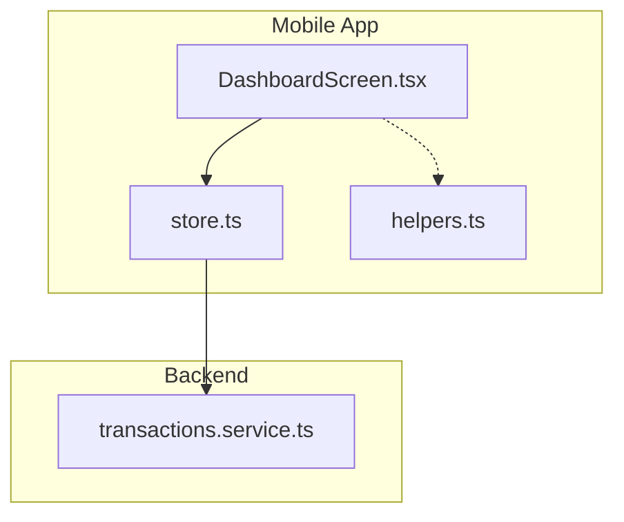
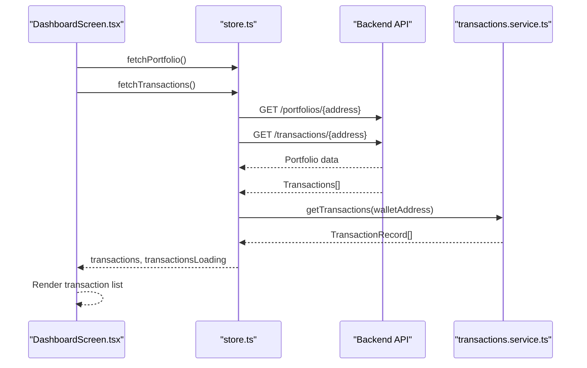
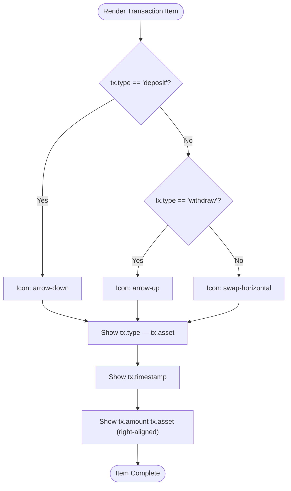
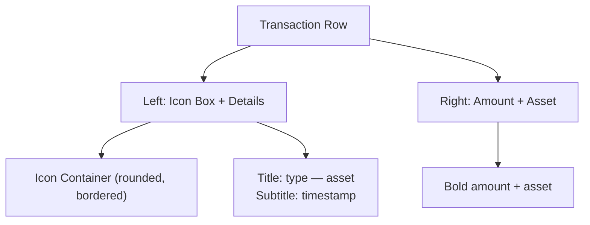
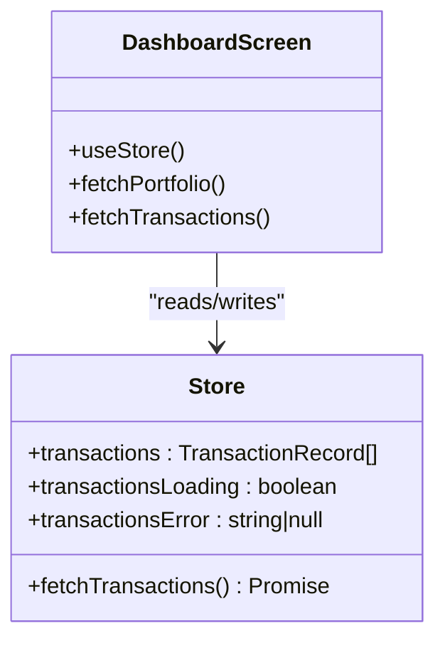
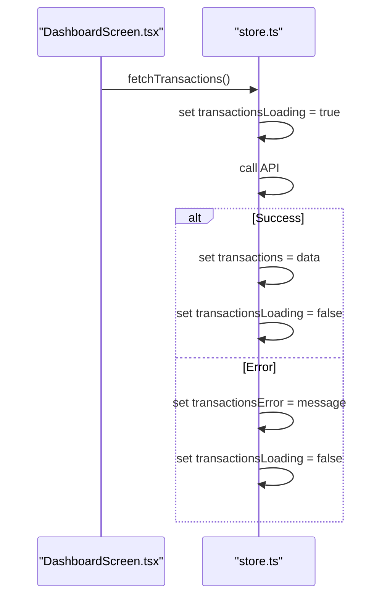
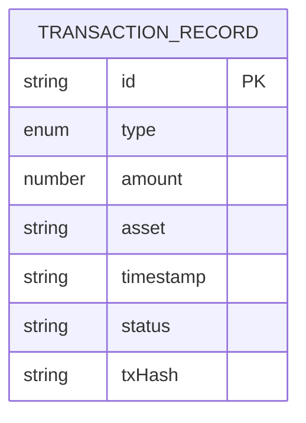
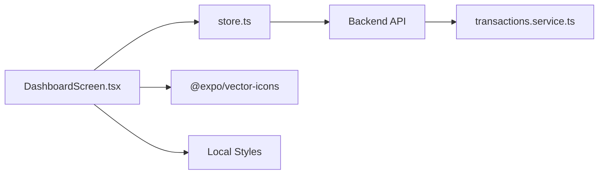

# Transaction History List

<cite>
**Referenced Files in This Document**
- [DashboardScreen.tsx](file://veilend-mobile/src/screens/DashboardScreen.tsx)
- [store.ts](file://veilend-mobile/src/store/store.ts)
- [helpers.ts](file://veilend-mobile/src/utils/helpers.ts)
- [transactions.service.ts](file://veilend-backend/src/transactions/transactions.service.ts)
</cite>

## Table of Contents
1. [Introduction](#introduction)
2. [Project Structure](#project-structure)
3. [Core Components](#core-components)
4. [Architecture Overview](#architecture-overview)
5. [Detailed Component Analysis](#detailed-component-analysis)
6. [Dependency Analysis](#dependency-analysis)
7. [Performance Considerations](#performance-considerations)
8. [Troubleshooting Guide](#troubleshooting-guide)
9. [Conclusion](#conclusion)

## Introduction
This document explains the transaction history list component that displays recent user activities on the mobile dashboard. It covers how each transaction item is rendered with type-based icons, how metadata (type, asset, timestamp) is displayed, and how amounts are formatted. It also documents styling for dark theme cards, layout alignment, integration with the Zustand store’s transactions array, loading states handling, empty state presentation, example transaction record structure, date formatting utilities, and accessibility considerations.

## Project Structure
The transaction history list is implemented in the mobile app’s Dashboard screen and consumes data from a global Zustand store. The store fetches transactions from the backend API and exposes them to the UI along with loading and error states.

**Diagram sources**
- [DashboardScreen.tsx:100-110](file://veilend-mobile/src/screens/DashboardScreen.tsx#L100-L110)
- [store.ts:344-362](file://veilend-mobile/src/store/store.ts#L344-L362)
- [transactions.service.ts:21-83](file://veilend-backend/src/transactions/transactions.service.ts#L21-L83)
- [helpers.ts:1-10](file://veilend-mobile/src/utils/helpers.ts#L1-L10)

**Section sources**
- [DashboardScreen.tsx:100-110](file://veilend-mobile/src/screens/DashboardScreen.tsx#L100-L110)
- [store.ts:344-362](file://veilend-mobile/src/store/store.ts#L344-L362)
- [transactions.service.ts:21-83](file://veilend-backend/src/transactions/transactions.service.ts#L21-L83)
- [helpers.ts:1-10](file://veilend-mobile/src/utils/helpers.ts#L1-L10)

## Core Components
- Transaction item rendering:
  - Type-based icon selection: deposit uses arrow-down, withdraw uses arrow-up, other types use swap-horizontal.
  - Metadata display: shows transaction type and asset together, followed by a formatted timestamp.
  - Amount display: right-aligned value showing amount and asset symbol.
- Styling:
  - Dark theme cards with rounded corners and subtle borders.
  - Left-aligned details with an icon container; right-aligned amount column.
- Data integration:
  - Reads transactions from the Zustand store.
  - Uses store-provided loading and error states to manage UX.
  - Empty state handled when no transactions exist.

**Section sources**
- [DashboardScreen.tsx:319-340](file://veilend-mobile/src/screens/DashboardScreen.tsx#L319-L340)
- [store.ts:72-80](file://veilend-mobile/src/store/store.ts#L72-L80)
- [store.ts:318-362](file://veilend-mobile/src/store/store.ts#L318-L362)

## Architecture Overview
The flow begins in the dashboard screen, which triggers fetching portfolio and transactions. The store coordinates API calls and updates the transactions array and related flags. The UI renders the list based on the current store state.

**Diagram sources**
- [DashboardScreen.tsx:100-110](file://veilend-mobile/src/screens/DashboardScreen.tsx#L100-L110)
- [store.ts:321-362](file://veilend-mobile/src/store/store.ts#L321-L362)
- [transactions.service.ts:21-83](file://veilend-backend/src/transactions/transactions.service.ts#L21-L83)

## Detailed Component Analysis

### Transaction Item Rendering
- Icon selection logic:
  - If type equals deposit, show arrow-down.
  - If type equals withdraw, show arrow-up.
  - Otherwise, show swap-horizontal.
- Metadata display:
  - Shows type and asset concatenated with a separator.
  - Displays timestamp directly from the transaction record.
- Amount display:
  - Right-aligned text showing amount and asset symbol.

**Diagram sources**
- [DashboardScreen.tsx:322-338](file://veilend-mobile/src/screens/DashboardScreen.tsx#L322-L338)

**Section sources**
- [DashboardScreen.tsx:322-338](file://veilend-mobile/src/screens/DashboardScreen.tsx#L322-L338)

### List Styling and Layout
- Card style:
  - Each transaction row is a card with a dark background, rounded corners, and padding.
- Alignment:
  - Left section contains the icon box and text details.
  - Right section contains the amount and asset.
- Visual hierarchy:
  - Title text is bold and prominent.
  - Timestamp is smaller and secondary color.
  - Amount is bold and aligned to the right for quick scanning.

**Diagram sources**
- [DashboardScreen.tsx:521-552](file://veilend-mobile/src/screens/DashboardScreen.tsx#L521-L552)

**Section sources**
- [DashboardScreen.tsx:521-552](file://veilend-mobile/src/screens/DashboardScreen.tsx#L521-L552)

### Integration with Zustand Store
- State fields:
  - transactions: array of TransactionRecord.
  - transactionsLoading: boolean indicating fetch status.
  - transactionsError: string or null for error messages.
- Fetching:
  - fetchTransactions sets loading, calls API, updates transactions, clears/loading flags accordingly.
- Usage in UI:
  - DashboardScreen destructures transactions, transactionsLoading, and fetchTransactions from the store.
  - On mount, it calls both fetchPortfolio and fetchTransactions concurrently.

**Diagram sources**
- [store.ts:72-95](file://veilend-mobile/src/store/store.ts#L72-L95)
- [store.ts:318-362](file://veilend-mobile/src/store/store.ts#L318-L362)
- [DashboardScreen.tsx:18-44](file://veilend-mobile/src/screens/DashboardScreen.tsx#L18-L44)
- [DashboardScreen.tsx:100-110](file://veilend-mobile/src/screens/DashboardScreen.tsx#L100-L110)

**Section sources**
- [store.ts:72-95](file://veilend-mobile/src/store/store.ts#L72-L95)
- [store.ts:318-362](file://veilend-mobile/src/store/store.ts#L318-L362)
- [DashboardScreen.tsx:18-44](file://veilend-mobile/src/screens/DashboardScreen.tsx#L18-L44)
- [DashboardScreen.tsx:100-110](file://veilend-mobile/src/screens/DashboardScreen.tsx#L100-L110)

### Loading States Handling
- While fetching:
  - The store sets transactionsLoading to true before calling the API.
  - After success, it resets to false and populates transactions.
  - On error, it sets transactionsError and resets loading.
- UI behavior:
  - The dashboard screen triggers fetchTransactions on mount alongside portfolio fetch.
  - The list renders only after transactions are available; no explicit skeleton is shown for transactions in this screen.

**Diagram sources**
- [store.ts:344-362](file://veilend-mobile/src/store/store.ts#L344-L362)
- [DashboardScreen.tsx:100-110](file://veilend-mobile/src/screens/DashboardScreen.tsx#L100-L110)

**Section sources**
- [store.ts:344-362](file://veilend-mobile/src/store/store.ts#L344-L362)
- [DashboardScreen.tsx:100-110](file://veilend-mobile/src/screens/DashboardScreen.tsx#L100-L110)

### Empty State Presentation
- When there are no transactions, the list simply does not render any items.
- A dedicated empty state message is not present in the mobile dashboard screen for transactions; the area remains blank until data arrives.

**Section sources**
- [DashboardScreen.tsx:319-340](file://veilend-mobile/src/screens/DashboardScreen.tsx#L319-L340)

### Example Transaction Record Structure
- Fields:
  - id: unique identifier for the transaction.
  - type: one of deposit, withdraw, borrow, repay, transfer.
  - amount: numeric value representing the transaction amount.
  - asset: string symbol or code for the asset involved.
  - timestamp: ISO-formatted date-time string.
  - status: string indicating success or failure.
  - txHash: blockchain transaction hash.

**Diagram sources**
- [store.ts:72-80](file://veilend-mobile/src/store/store.ts#L72-L80)
- [transactions.service.ts:5-13](file://veilend-backend/src/transactions/transactions.service.ts#L5-L13)

**Section sources**
- [store.ts:72-80](file://veilend-mobile/src/store/store.ts#L72-L80)
- [transactions.service.ts:5-13](file://veilend-backend/src/transactions/transactions.service.ts#L5-L13)

### Date Formatting Utilities
- Current implementation:
  - The dashboard screen displays the raw timestamp string from the transaction record without additional formatting.
- Utility helpers:
  - The helpers module provides address shortening and currency symbol mapping but does not include date formatting functions.
- Recommendation:
  - Introduce a date formatter utility to consistently format timestamps across the app if needed.

**Section sources**
- [DashboardScreen.tsx:332-334](file://veilend-mobile/src/screens/DashboardScreen.tsx#L332-L334)
- [helpers.ts:1-10](file://veilend-mobile/src/utils/helpers.ts#L1-L10)

### Accessibility Features
- Current implementation:
  - The transaction rows do not include explicit accessibility labels such as aria-label or equivalent attributes in the mobile screen.
- Recommendations:
  - Add descriptive labels to icon containers and amount texts to improve screen reader experience.
  - Ensure semantic grouping of transaction details so assistive technologies can announce complete context.

**Section sources**
- [DashboardScreen.tsx:322-338](file://veilend-mobile/src/screens/DashboardScreen.tsx#L322-L338)

## Dependency Analysis
- DashboardScreen depends on:
  - Zustand store for transactions and actions.
  - Ionicons for rendering type-based icons.
  - Styles defined locally for dark theme cards and layout.
- Store depends on:
  - Backend API endpoints for portfolio and transactions.
  - Secure storage for session persistence.
- Backend service depends on:
  - Horizon client to retrieve account transactions and map operations to typed records.

**Diagram sources**
- [DashboardScreen.tsx:1-9](file://veilend-mobile/src/screens/DashboardScreen.tsx#L1-L9)
- [store.ts:1-4](file://veilend-mobile/src/store/store.ts#L1-L4)
- [transactions.service.ts:1-4](file://veilend-backend/src/transactions/transactions.service.ts#L1-L4)

**Section sources**
- [DashboardScreen.tsx:1-9](file://veilend-mobile/src/screens/DashboardScreen.tsx#L1-L9)
- [store.ts:1-4](file://veilend-mobile/src/store/store.ts#L1-L4)
- [transactions.service.ts:1-4](file://veilend-backend/src/transactions/transactions.service.ts#L1-L4)

## Performance Considerations
- Avoid unnecessary re-renders:
  - Keep transaction list rendering efficient by ensuring stable keys and minimal prop churn.
- Optimize icon selection:
  - Use simple conditional checks to select icons based on type.
- Minimize network calls:
  - Batch initial loads (portfolio and transactions) concurrently to reduce perceived latency.
- Consider pagination or virtualization:
  - For large transaction histories, consider virtualized lists to maintain smooth scrolling performance.

[No sources needed since this section provides general guidance]

## Troubleshooting Guide
- No transactions displayed:
  - Verify that fetchTransactions was called and that the address is set in the store.
  - Check transactionsLoading and transactionsError in the store to diagnose issues.
- Incorrect icons:
  - Ensure transaction type values match expected strings (deposit, withdraw, others).
- Timestamp formatting:
  - If inconsistent formats appear, introduce a centralized date formatter utility.
- Accessibility gaps:
  - Add appropriate labels to interactive elements and informational text for screen readers.

**Section sources**
- [store.ts:344-362](file://veilend-mobile/src/store/store.ts#L344-L362)
- [DashboardScreen.tsx:322-338](file://veilend-mobile/src/screens/DashboardScreen.tsx#L322-L338)

## Conclusion
The transaction history list component provides a clear, dark-themed view of recent user activities with type-based icons, concise metadata, and right-aligned amounts. It integrates cleanly with the Zustand store for data and state management, handles loading states appropriately, and leaves room for enhancements such as consistent date formatting and improved accessibility. The backend service maps blockchain operations into structured transaction records, enabling consistent UI rendering across the application.