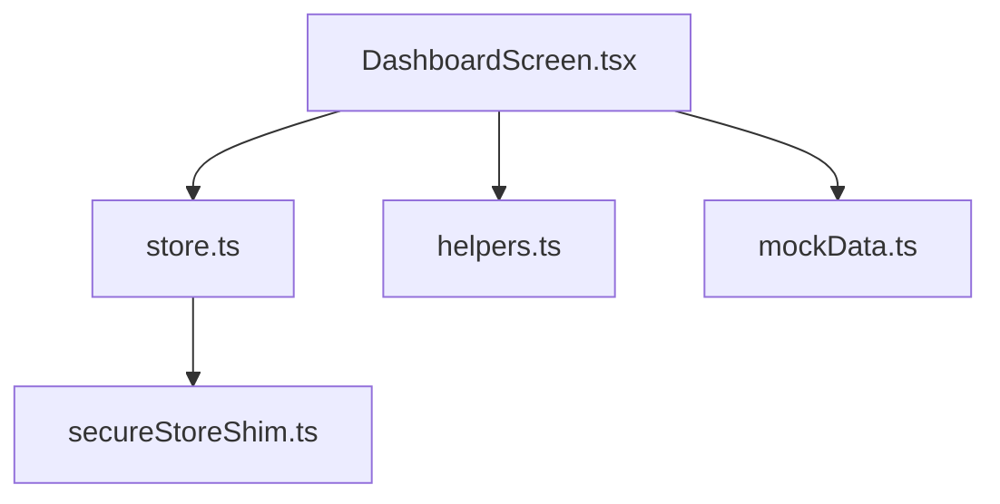
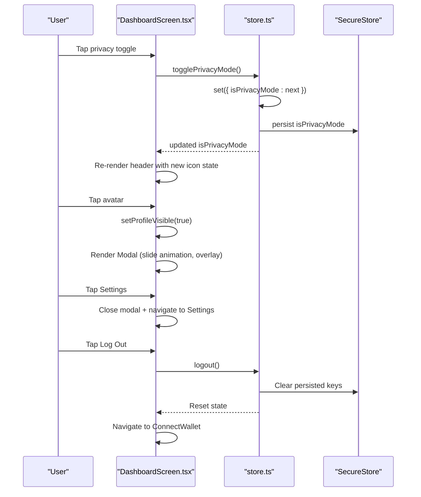
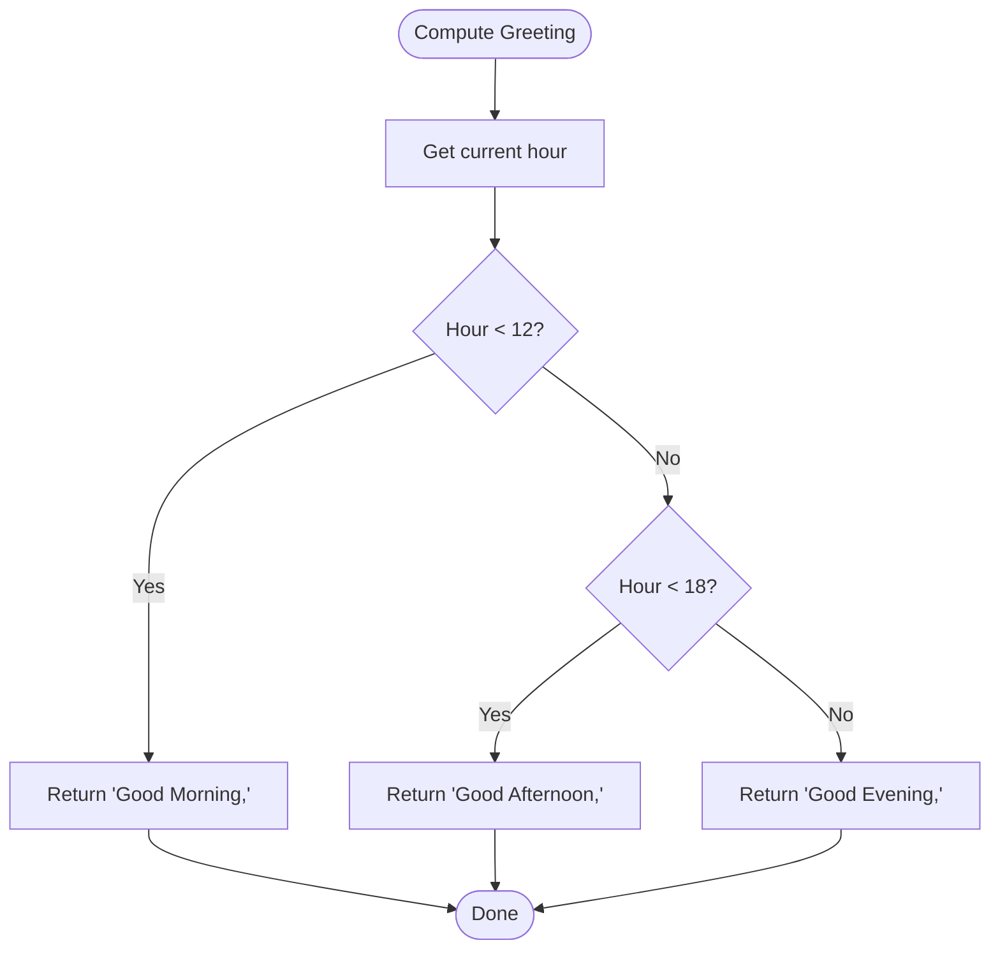
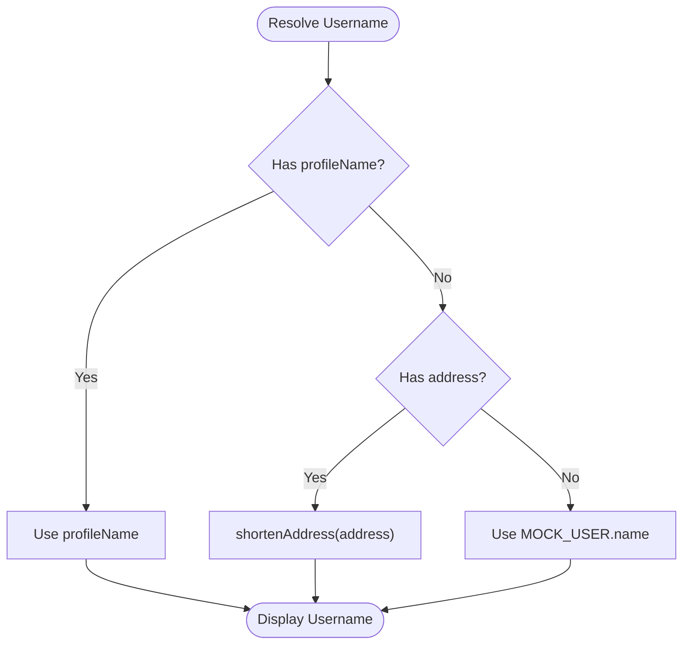
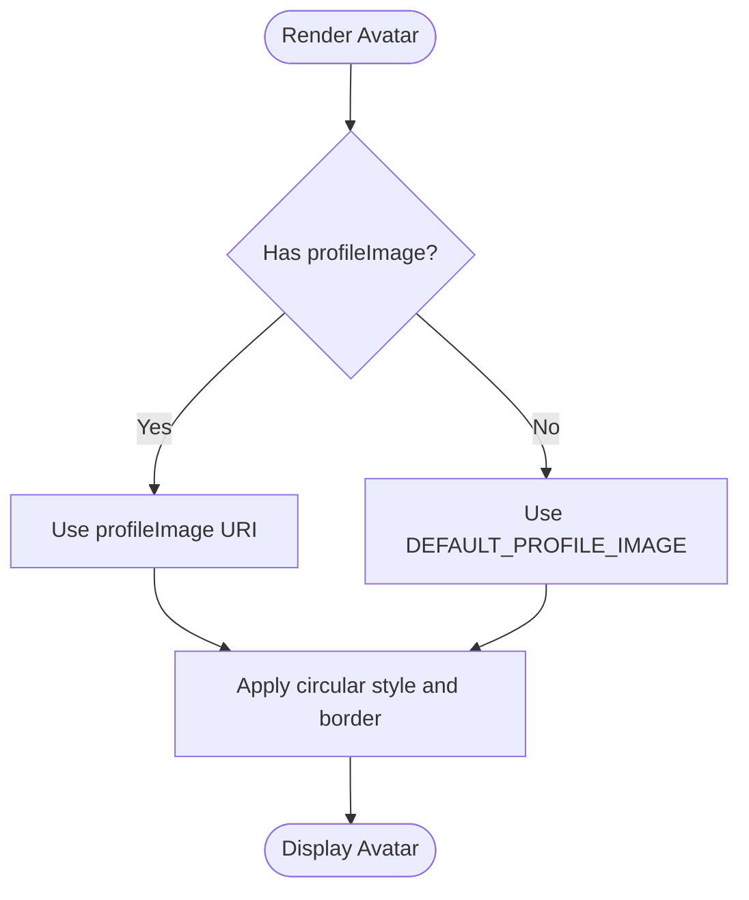
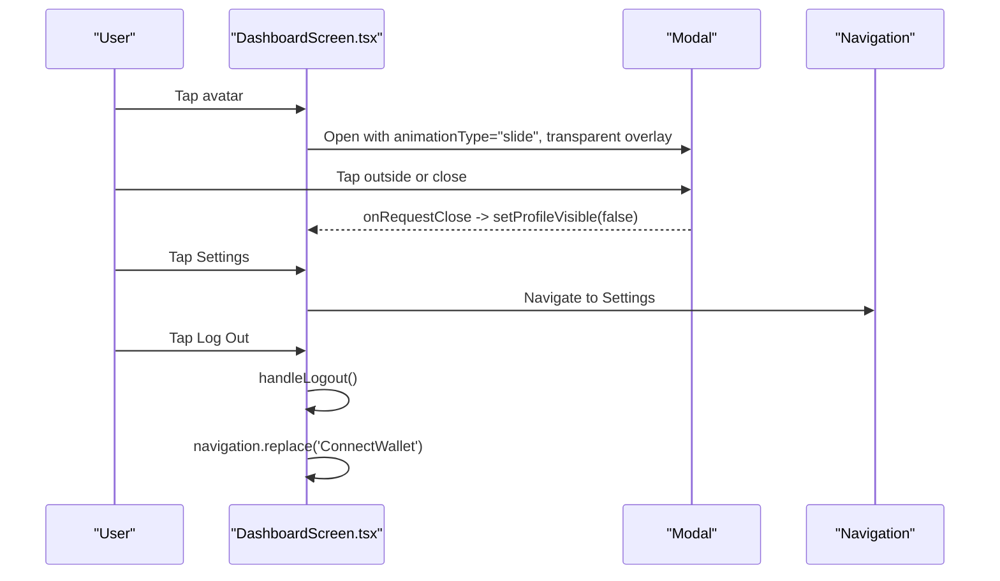
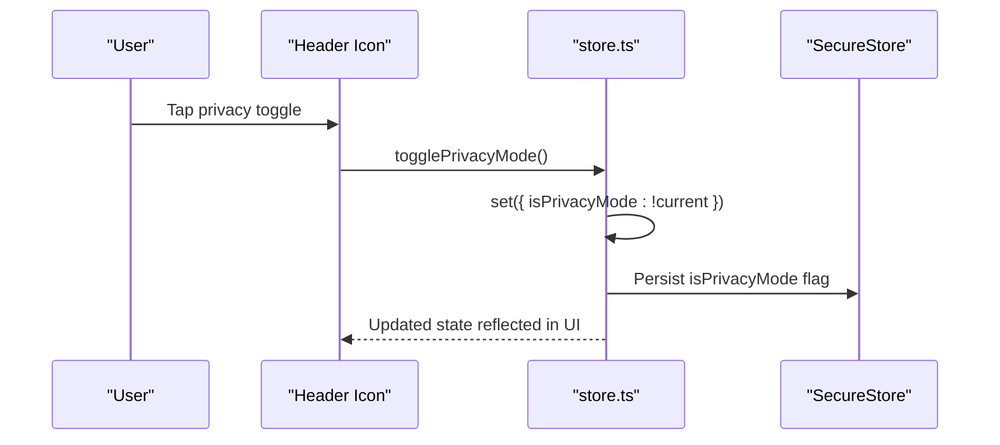
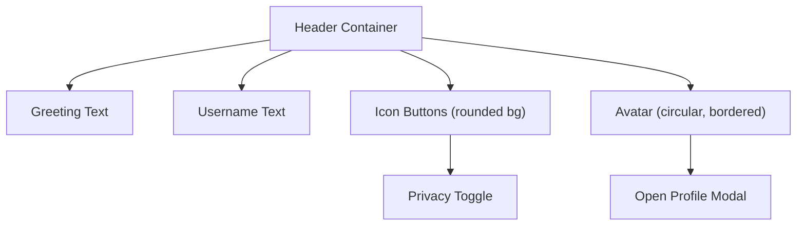
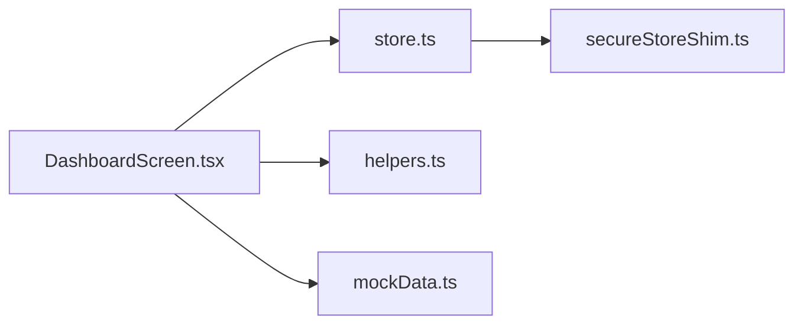

# User Interface Header & Profile Management

<cite>
**Referenced Files in This Document**
- [DashboardScreen.tsx](file://veilend-mobile/src/screens/DashboardScreen.tsx)
- [store.ts](file://veilend-mobile/src/store/store.ts)
- [mockData.ts](file://veilend-mobile/src/data/mockData.ts)
- [helpers.ts](file://veilend-mobile/src/utils/helpers.ts)
</cite>

## Table of Contents
1. Introduction
2. Project Structure
3. Core Components
4. Architecture Overview
5. Detailed Component Analysis
6. Dependency Analysis
7. Performance Considerations
8. Troubleshooting Guide
9. Conclusion

## Introduction
This document explains the dashboard header section and profile management features implemented in the mobile application. It covers:
- Dynamic user greeting based on time of day
- Username display with address shortening fallback to mock data
- Avatar image handling with a default placeholder
- Profile modal with slide animation, overlay backdrop, keyboard dismissal, and menu items for settings navigation and logout
- Privacy toggle button with eye icon state changes integrated with the global privacy mode store
- Styling details for the header layout, icon buttons with rounded backgrounds, and responsive spacing

## Project Structure
The relevant implementation is concentrated in the mobile app’s Dashboard screen and the global store that manages UI state such as privacy mode and profile information. Supporting utilities provide address shortening and currency formatting used by the header and cards.

**Diagram sources**
- [DashboardScreen.tsx:1-10](file://veilend-mobile/src/screens/DashboardScreen.tsx#L1-L10)
- [store.ts:1-30](file://veilend-mobile/src/store/store.ts#L1-L30)
- [helpers.ts:1-20](file://veilend-mobile/src/utils/helpers.ts#L1-L20)
- [mockData.ts:1-20](file://veilend-mobile/src/data/mockData.ts#L1-L20)

**Section sources**
- [DashboardScreen.tsx:1-10](file://veilend-mobile/src/screens/DashboardScreen.tsx#L1-L10)
- [store.ts:1-30](file://veilend-mobile/src/store/store.ts#L1-L30)

## Core Components
- Header area: Displays a dynamic greeting and username, plus a privacy toggle and avatar.
- Profile modal: Slide-up modal with overlay backdrop, keyboard dismissal, profile summary, Settings navigation, and Logout action.
- Global store: Holds privacy mode, profile name/image, and provides methods to toggle privacy and manage session.

Key behaviors:
- Greeting logic returns “Good Morning,” “Good Afternoon,” or “Good Evening” based on current hour.
- Username resolves from profile name; otherwise falls back to shortened wallet address; if no address, uses mock user name.
- Avatar displays a provided URI or a default placeholder image.
- Privacy toggle updates the global store and persists across sessions.

**Section sources**
- [DashboardScreen.tsx:173-199](file://veilend-mobile/src/screens/DashboardScreen.tsx#L173-L199)
- [DashboardScreen.tsx:211-264](file://veilend-mobile/src/screens/DashboardScreen.tsx#L211-L264)
- [store.ts:151-185](file://veilend-mobile/src/store/store.ts#L151-L185)

## Architecture Overview
The header and profile modal are part of the Dashboard screen. The screen reads from the global store for privacy mode and profile data, and invokes store actions to update state. The store persists privacy mode and profile customizations using secure storage.

**Diagram sources**
- [DashboardScreen.tsx:188-199](file://veilend-mobile/src/screens/DashboardScreen.tsx#L188-L199)
- [DashboardScreen.tsx:211-264](file://veilend-mobile/src/screens/DashboardScreen.tsx#L211-L264)
- [store.ts:124-149](file://veilend-mobile/src/store/store.ts#L124-L149)
- [store.ts:173-185](file://veilend-mobile/src/store/store.ts#L173-L185)

## Detailed Component Analysis

### Dynamic Greeting Logic
- Computes current hour and returns a localized greeting string appropriate for morning, afternoon, or evening.
- Used directly in the header to greet the user.

**Diagram sources**
- [DashboardScreen.tsx:173-178](file://veilend-mobile/src/screens/DashboardScreen.tsx#L173-L178)

**Section sources**
- [DashboardScreen.tsx:173-178](file://veilend-mobile/src/screens/DashboardScreen.tsx#L173-L178)

### Username Display and Address Shortening Fallback
- Username resolution order:
  - Use profile name if available.
  - Otherwise, use shortened wallet address via helper utility.
  - If no address exists, fall back to mock user name.
- This ensures a friendly display even when the user has not connected a wallet.

**Diagram sources**
- [DashboardScreen.tsx:76-78](file://veilend-mobile/src/screens/DashboardScreen.tsx#L76-L78)
- [helpers.ts:1-20](file://veilend-mobile/src/utils/helpers.ts#L1-L20)
- [mockData.ts:1-20](file://veilend-mobile/src/data/mockData.ts#L1-L20)

**Section sources**
- [DashboardScreen.tsx:76-78](file://veilend-mobile/src/screens/DashboardScreen.tsx#L76-L78)
- [helpers.ts:1-20](file://veilend-mobile/src/utils/helpers.ts#L1-L20)
- [mockData.ts:1-20](file://veilend-mobile/src/data/mockData.ts#L1-L20)

### Avatar Image Handling with Default Placeholder
- Avatar source:
  - Uses profile image URI if present.
  - Falls back to a default placeholder image URL.
- Styled as a circular image with border and fixed dimensions.

**Diagram sources**
- [DashboardScreen.tsx:14-14](file://veilend-mobile/src/screens/DashboardScreen.tsx#L14-L14)
- [DashboardScreen.tsx:78-78](file://veilend-mobile/src/screens/DashboardScreen.tsx#L78-L78)
- [DashboardScreen.tsx:375-381](file://veilend-mobile/src/screens/DashboardScreen.tsx#L375-L381)

**Section sources**
- [DashboardScreen.tsx:14-14](file://veilend-mobile/src/screens/DashboardScreen.tsx#L14-L14)
- [DashboardScreen.tsx:78-78](file://veilend-mobile/src/screens/DashboardScreen.tsx#L78-L78)
- [DashboardScreen.tsx:375-381](file://veilend-mobile/src/screens/DashboardScreen.tsx#L375-L381)

### Profile Modal Implementation
- Triggered by tapping the avatar.
- Uses a slide animation and transparent overlay backdrop.
- Dismisses on backdrop tap and keyboard dismissal.
- Contains:
  - Profile summary with large avatar and username.
  - Settings menu item that navigates to the Settings screen.
  - Log Out action that clears session and navigates back to Connect Wallet.

**Diagram sources**
- [DashboardScreen.tsx:211-264](file://veilend-mobile/src/screens/DashboardScreen.tsx#L211-L264)
- [DashboardScreen.tsx:80-84](file://veilend-mobile/src/screens/DashboardScreen.tsx#L80-L84)

**Section sources**
- [DashboardScreen.tsx:211-264](file://veilend-mobile/src/screens/DashboardScreen.tsx#L211-L264)
- [DashboardScreen.tsx:80-84](file://veilend-mobile/src/screens/DashboardScreen.tsx#L80-L84)

### Privacy Toggle Button and Global Store Integration
- Header includes an eye/eye-off icon button that toggles privacy mode.
- Toggling calls the store’s togglePrivacyMode method, which flips the boolean and persists it.
- When privacy mode is enabled, sensitive values (e.g., balances) are masked throughout the UI.

**Diagram sources**
- [DashboardScreen.tsx:188-191](file://veilend-mobile/src/screens/DashboardScreen.tsx#L188-L191)
- [store.ts:173-185](file://veilend-mobile/src/store/store.ts#L173-L185)

**Section sources**
- [DashboardScreen.tsx:188-191](file://veilend-mobile/src/screens/DashboardScreen.tsx#L188-L191)
- [store.ts:173-185](file://veilend-mobile/src/store/store.ts#L173-L185)

### Styling Details for Header Layout and Responsive Spacing
- Header layout:
  - Horizontal row with space-between alignment and bottom margin for visual separation.
  - Greeting text styled with muted color and medium font size.
  - Username styled with white color, larger font, and bold weight.
- Icon buttons:
  - Rounded background with padding for comfortable touch targets.
- Avatar:
  - Circular image with fixed width/height and border styling.
- Responsiveness:
  - Card sizes and badge text adapt to small screens using computed widths and conditional font sizes.

**Diagram sources**
- [DashboardScreen.tsx:355-381](file://veilend-mobile/src/screens/DashboardScreen.tsx#L355-L381)
- [DashboardScreen.tsx:431-450](file://veilend-mobile/src/screens/DashboardScreen.tsx#L431-L450)

**Section sources**
- [DashboardScreen.tsx:355-381](file://veilend-mobile/src/screens/DashboardScreen.tsx#L355-L381)
- [DashboardScreen.tsx:431-450](file://veilend-mobile/src/screens/DashboardScreen.tsx#L431-L450)

## Dependency Analysis
- DashboardScreen depends on:
  - store.ts for privacy mode, profile data, and actions like logout.
  - helpers.ts for address shortening and currency symbol formatting.
  - mockData.ts for fallback username when no address is present.
- store.ts persists privacy mode and profile customizations via SecureStore (or shim).

**Diagram sources**
- [DashboardScreen.tsx:1-10](file://veilend-mobile/src/screens/DashboardScreen.tsx#L1-L10)
- [store.ts:1-30](file://veilend-mobile/src/store/store.ts#L1-L30)

**Section sources**
- [DashboardScreen.tsx:1-10](file://veilend-mobile/src/screens/DashboardScreen.tsx#L1-L10)
- [store.ts:1-30](file://veilend-mobile/src/store/store.ts#L1-L30)

## Performance Considerations
- Minimal re-renders: Only privacy mode and modal visibility change frequently; these are local or store-backed states.
- Efficient list rendering: Transactions and services lists render only necessary items.
- Avoid heavy computations in render paths; greeting and username resolution are lightweight.

[No sources needed since this section provides general guidance]

## Troubleshooting Guide
- Privacy toggle not reflecting:
  - Ensure togglePrivacyMode is called and store persistence succeeds.
  - Verify SecureStore availability and that hydration restores isPrivacyMode correctly.
- Username shows unexpected value:
  - Confirm profileName is set; otherwise check address presence and shortenAddress behavior.
  - Validate mockData fallback when address is absent.
- Modal does not dismiss:
  - Check onRequestClose handler and TouchableWithoutFeedback wrapping.
  - Ensure Keyboard.dismiss is invoked where needed.
- Avatar not displaying:
  - Verify profileImage URI validity; ensure default placeholder is used when missing.

**Section sources**
- [store.ts:173-185](file://veilend-mobile/src/store/store.ts#L173-L185)
- [store.ts:369-396](file://veilend-mobile/src/store/store.ts#L369-L396)
- [DashboardScreen.tsx:76-78](file://veilend-mobile/src/screens/DashboardScreen.tsx#L76-L78)
- [DashboardScreen.tsx:211-264](file://veilend-mobile/src/screens/DashboardScreen.tsx#L211-L264)
- [DashboardScreen.tsx:78-78](file://veilend-mobile/src/screens/DashboardScreen.tsx#L78-L78)

## Conclusion
The dashboard header delivers a personalized experience through time-based greetings, dynamic username resolution, and avatar display with fallbacks. The profile modal offers intuitive navigation to settings and logout, while the privacy toggle integrates seamlessly with the global store to mask sensitive data consistently. Styling emphasizes clarity and accessibility with rounded icon buttons and responsive spacing.