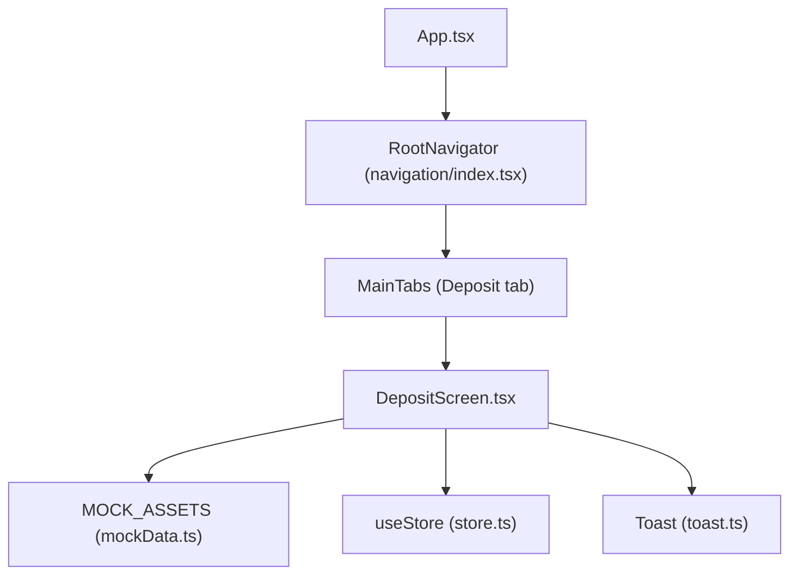
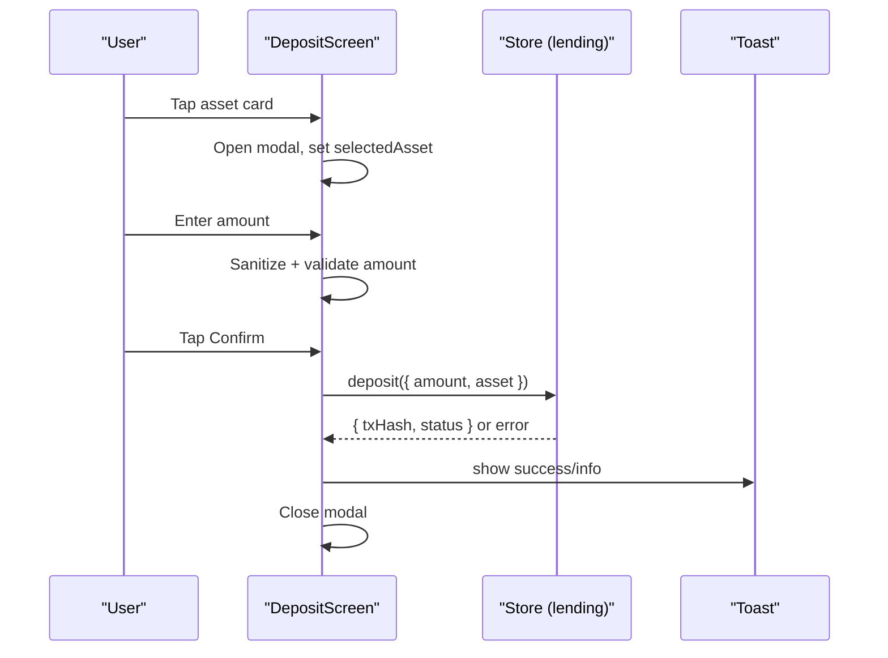
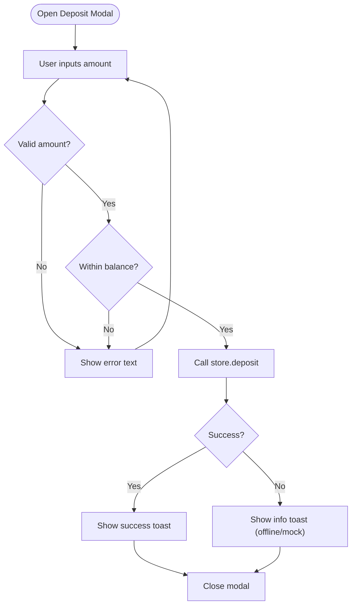
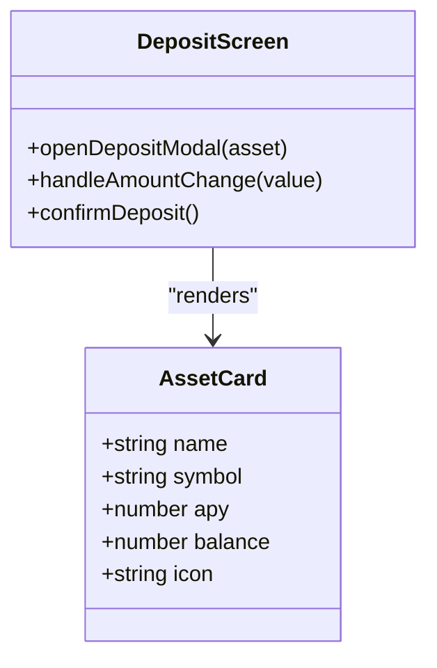
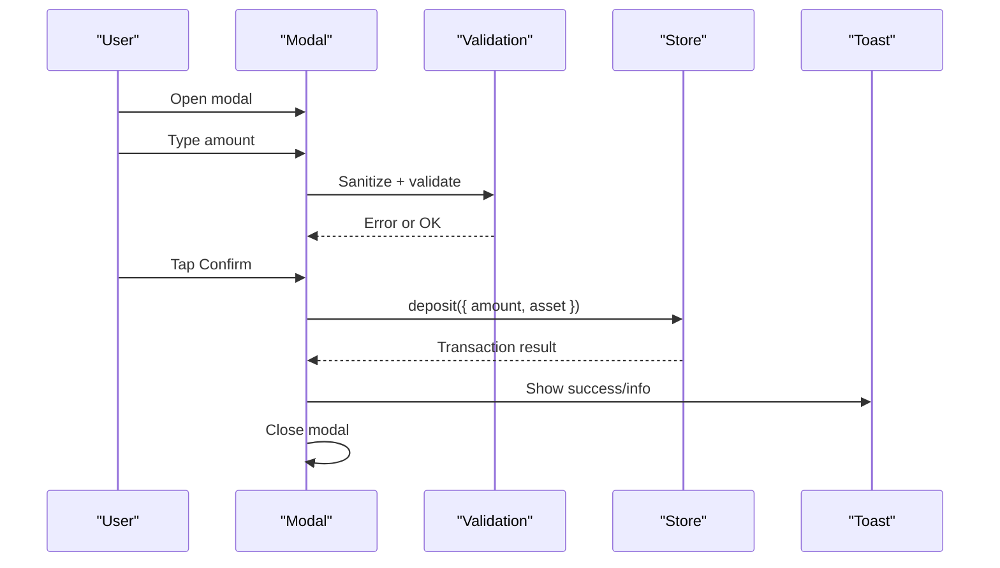
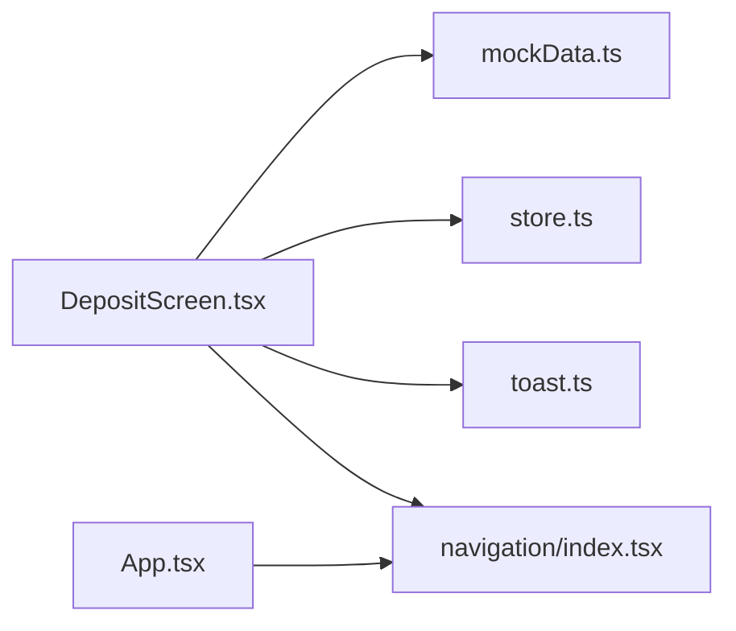

# Asset Selection & Display

<cite>
**Referenced Files in This Document**
- [DepositScreen.tsx](file://veilend-mobile/src/screens/DepositScreen.tsx)
- [mockData.ts](file://veilend-mobile/src/data/mockData.ts)
- [store.ts](file://veilend-mobile/src/store/store.ts)
- [toast.ts](file://veilend-mobile/src/utils/toast.ts)
- [index.tsx](file://veilend-mobile/src/navigation/index.tsx)
- [App.tsx](file://veilend-mobile/App.tsx)
</cite>

## Table of Contents
1. [Introduction](#introduction)
2. [Project Structure](#project-structure)
3. [Core Components](#core-components)
4. [Architecture Overview](#architecture-overview)
5. [Detailed Component Analysis](#detailed-component-analysis)
6. [Dependency Analysis](#dependency-analysis)
7. [Performance Considerations](#performance-considerations)
8. [Troubleshooting Guide](#troubleshooting-guide)
9. [Conclusion](#conclusion)
10. [Appendices](#appendices)

## Introduction
This document explains the asset selection interface that displays available assets for deposit in the mobile application. It covers:
- The asset card design showing asset name, symbol, APY rates, and wallet balances
- The modal-based deposit flow with KeyboardAvoidingView for mobile keyboard handling
- Asset selection state management and responsive layout considerations
- Integration with mock data for development
- Asset icon rendering using Ionicons
- Styling patterns using React Native StyleSheet
- Examples of asset data structure, modal interaction patterns, and mobile-specific UI considerations for financial applications

## Project Structure
The asset selection and deposit flow is implemented within the mobile app under the screens directory. The Deposit screen renders a list of assets from mock data and opens a modal to confirm deposits. Navigation routes the user to this screen via a bottom tab navigator. Global loading overlays and toast notifications are provided by the root App component and utility modules.

**Diagram sources**
- [App.tsx:14-37](file://veilend-mobile/App.tsx#L14-L37)
- [index.tsx:18-44](file://veilend-mobile/src/navigation/index.tsx#L18-L44)
- [DepositScreen.tsx:20-188](file://veilend-mobile/src/screens/DepositScreen.tsx#L20-L188)
- [mockData.ts:9-40](file://veilend-mobile/src/data/mockData.ts#L9-L40)
- [store.ts:254-308](file://veilend-mobile/src/store/store.ts#L254-L308)
- [toast.ts:5-15](file://veilend-mobile/src/utils/toast.ts#L5-L15)

**Section sources**
- [App.tsx:14-37](file://veilend-mobile/App.tsx#L14-L37)
- [index.tsx:18-44](file://veilend-mobile/src/navigation/index.tsx#L18-L44)

## Core Components
- DepositScreen: Renders the asset list and deposit modal, handles input validation, and triggers store actions.
- Mock Data: Provides sample assets with icons, balances, APY, and other metadata used during development.
- Store: Centralized state for lending operations (deposit, withdraw, borrow, repay), including loading flags and last transaction records.
- Toast: Cross-platform notification helper for success/info/error feedback.
- Navigation: Bottom tabs route users to Deposit; global splash/loading handled at the app level.

Key responsibilities:
- Asset card rendering with name, symbol, APY badge, and balance
- Modal open/close and amount input with sanitization and validation
- Keyboard avoidance on iOS via KeyboardAvoidingView behavior
- Submitting deposit via store action and displaying results through toast

**Section sources**
- [DepositScreen.tsx:20-188](file://veilend-mobile/src/screens/DepositScreen.tsx#L20-L188)
- [mockData.ts:9-40](file://veilend-mobile/src/data/mockData.ts#L9-L40)
- [store.ts:254-308](file://veilend-mobile/src/store/store.ts#L254-L308)
- [toast.ts:5-15](file://veilend-mobile/src/utils/toast.ts#L5-L15)
- [index.tsx:18-44](file://veilend-mobile/src/navigation/index.tsx#L18-L44)

## Architecture Overview
The deposit flow follows a clear sequence: user selects an asset, enters an amount in a modal, validates input, and submits via the store’s deposit method. Feedback is shown using toast notifications. On iOS, the modal uses KeyboardAvoidingView to prevent keyboard overlap.

**Diagram sources**
- [DepositScreen.tsx:27-81](file://veilend-mobile/src/screens/DepositScreen.tsx#L27-L81)
- [store.ts:257-269](file://veilend-mobile/src/store/store.ts#L257-L269)
- [toast.ts:5-15](file://veilend-mobile/src/utils/toast.ts#L5-L15)

## Detailed Component Analysis

### Deposit Screen: Asset List and Modal
- Asset list: Maps over MOCK_ASSETS to render asset cards with left section (icon, name, symbol) and right section (APY badge, wallet balance).
- Modal: Uses React Native Modal with transparent overlay and slide animation. Contains TextInput for amount, MAX button, error text, and Cancel/Confirm buttons.
- Keyboard handling: Wraps modal content in KeyboardAvoidingView with platform-specific behavior for iOS padding.
- State: Local state tracks modal visibility, selected asset, and amount string. Validation computes error and submit enablement.
- Submission: Calls store.deposit with sanitized amount and asset symbol; shows toast and closes modal on completion or fallback.

**Diagram sources**
- [DepositScreen.tsx:33-81](file://veilend-mobile/src/screens/DepositScreen.tsx#L33-L81)
- [store.ts:257-269](file://veilend-mobile/src/store/store.ts#L257-L269)
- [toast.ts:5-15](file://veilend-mobile/src/utils/toast.ts#L5-L15)

**Section sources**
- [DepositScreen.tsx:20-188](file://veilend-mobile/src/screens/DepositScreen.tsx#L20-L188)

### Asset Card Design
- Layout: Horizontal row with icon container, asset name/symbol, APY badge, and balance text.
- Styling: Dark theme with rounded cards, subtle borders, and accent color highlights for APY.
- Icons: Rendered via Ionicons using asset.icon values from mock data.
- Responsiveness: Flexbox layout ensures alignment across devices; consistent spacing and typography.

**Diagram sources**
- [DepositScreen.tsx:104-131](file://veilend-mobile/src/screens/DepositScreen.tsx#L104-L131)
- [mockData.ts:9-40](file://veilend-mobile/src/data/mockData.ts#L9-L40)

**Section sources**
- [DepositScreen.tsx:104-131](file://veilend-mobile/src/screens/DepositScreen.tsx#L104-L131)
- [mockData.ts:9-40](file://veilend-mobile/src/data/mockData.ts#L9-L40)

### Modal-Based Deposit Flow
- Visibility: Controlled by local state toggled when opening/closing the modal.
- Input: TextInput with decimal-pad keyboard; MAX button sets amount to asset balance.
- Validation: Sanitizes input to allow only digits and a single decimal point; checks positivity and insufficient balance.
- Submission: Invokes store.deposit; handles success and offline scenarios with toast messages.
- Accessibility: Labels for inputs and buttons improve screen reader support.

**Diagram sources**
- [DepositScreen.tsx:27-81](file://veilend-mobile/src/screens/DepositScreen.tsx#L27-L81)
- [store.ts:257-269](file://veilend-mobile/src/store/store.ts#L257-L269)
- [toast.ts:5-15](file://veilend-mobile/src/utils/toast.ts#L5-L15)

**Section sources**
- [DepositScreen.tsx:27-81](file://veilend-mobile/src/screens/DepositScreen.tsx#L27-L81)

### Asset Data Structure (Mock)
- Fields include id, name, symbol, icon (Ionicons name), balance, price, apy, collateralFactor.
- Used to populate asset cards and drive modal interactions.
- Extensible for future real data integration.

Example fields referenced:
- id, name, symbol, icon, balance, apy

**Section sources**
- [mockData.ts:9-40](file://veilend-mobile/src/data/mockData.ts#L9-L40)

### Mobile-Specific UI Considerations
- KeyboardAvoidingView: Uses platform-specific behavior to avoid keyboard overlap on iOS.
- Modal presentation: Slide animation and transparent overlay provide a focused deposit experience.
- Touch targets: Buttons and inputs sized for comfortable tapping.
- Accessibility: Labels on inputs and buttons enhance usability.

**Section sources**
- [DepositScreen.tsx:135-186](file://veilend-mobile/src/screens/DepositScreen.tsx#L135-L186)

### Styling Patterns (React Native StyleSheet)
- Consistent dark theme with background colors, borders, and accent colors.
- Reusable style objects for containers, cards, badges, and modals.
- Responsive layout using flex directions and gaps.

**Section sources**
- [DepositScreen.tsx:191-364](file://veilend-mobile/src/screens/DepositScreen.tsx#L191-L364)

## Dependency Analysis
- DepositScreen depends on:
  - MOCK_ASSETS for asset list
  - useStore for deposit action and loading state
  - Toast for user feedback
  - Ionicons for asset icons
  - KeyboardAvoidingView and Modal for mobile UX
- Navigation wires DepositScreen into the app via bottom tabs.
- App-level loading overlay and toast are integrated globally.

**Diagram sources**
- [DepositScreen.tsx:1-8](file://veilend-mobile/src/screens/DepositScreen.tsx#L1-L8)
- [mockData.ts:9-40](file://veilend-mobile/src/data/mockData.ts#L9-L40)
- [store.ts:254-308](file://veilend-mobile/src/store/store.ts#L254-L308)
- [toast.ts:5-15](file://veilend-mobile/src/utils/toast.ts#L5-L15)
- [index.tsx:18-44](file://veilend-mobile/src/navigation/index.tsx#L18-L44)
- [App.tsx:14-37](file://veilend-mobile/App.tsx#L14-L37)

**Section sources**
- [DepositScreen.tsx:1-8](file://veilend-mobile/src/screens/DepositScreen.tsx#L1-L8)
- [index.tsx:18-44](file://veilend-mobile/src/navigation/index.tsx#L18-L44)
- [App.tsx:14-37](file://veilend-mobile/App.tsx#L14-L37)

## Performance Considerations
- Memoization: Validation logic uses useMemo to recompute only when amount or selectedAsset changes, reducing unnecessary recalculations.
- Input sanitization: Prevents invalid characters early, minimizing downstream processing.
- Loading states: Store flags prevent duplicate submissions and provide visual feedback.
- Rendering: Flat list of assets is small; if scaled up, consider virtualization for performance.

[No sources needed since this section provides general guidance]

## Troubleshooting Guide
- Invalid amount: Ensure input contains only digits and one decimal point; positive value required.
- Insufficient balance: Amount cannot exceed selected asset’s balance.
- Offline mode: If backend is unavailable, the store returns a mock transaction; toast informs the user.
- Keyboard overlap: On iOS, ensure KeyboardAvoidingView behavior is set to handle padding correctly.
- Accessibility: Verify labels on inputs and buttons for screen readers.

**Section sources**
- [DepositScreen.tsx:33-81](file://veilend-mobile/src/screens/DepositScreen.tsx#L33-L81)
- [store.ts:257-269](file://veilend-mobile/src/store/store.ts#L257-L269)
- [toast.ts:5-15](file://veilend-mobile/src/utils/toast.ts#L5-L15)

## Conclusion
The asset selection interface provides a clear, accessible, and mobile-friendly deposit flow. It leverages mock data for rapid development, integrates with a centralized store for lending operations, and uses robust styling and keyboard handling for a polished user experience. Future enhancements can include real-time asset data, advanced validation, and enhanced accessibility features.

[No sources needed since this section summarizes without analyzing specific files]

## Appendices

### Example: Asset Data Structure Reference
- Fields: id, name, symbol, icon, balance, price, apy, collateralFactor
- Usage: Populates asset cards and drives modal interactions

**Section sources**
- [mockData.ts:9-40](file://veilend-mobile/src/data/mockData.ts#L9-L40)

### Example: Modal Interaction Pattern
- Open modal with selected asset
- Sanitize and validate amount
- Submit via store.deposit
- Show toast feedback
- Close modal

**Section sources**
- [DepositScreen.tsx:27-81](file://veilend-mobile/src/screens/DepositScreen.tsx#L27-L81)
- [store.ts:257-269](file://veilend-mobile/src/store/store.ts#L257-L269)
- [toast.ts:5-15](file://veilend-mobile/src/utils/toast.ts#L5-L15)