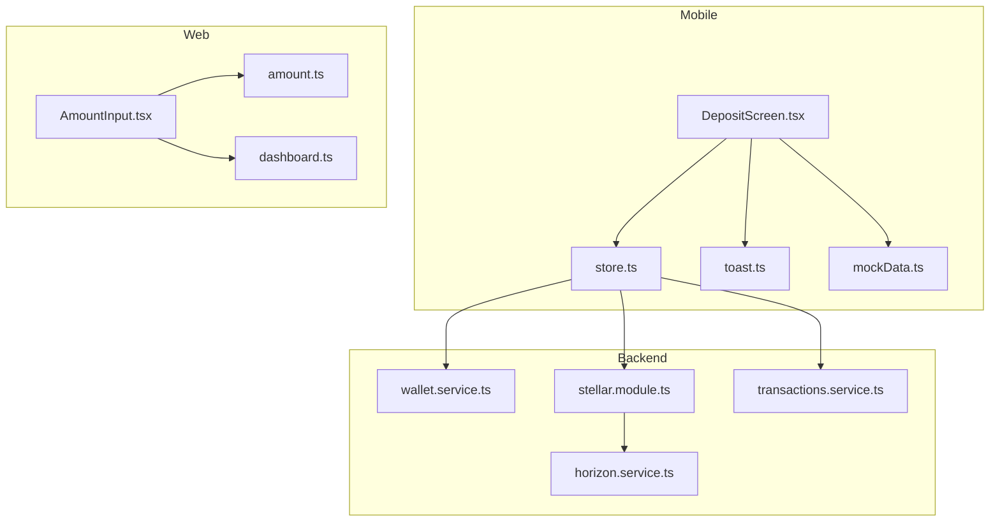
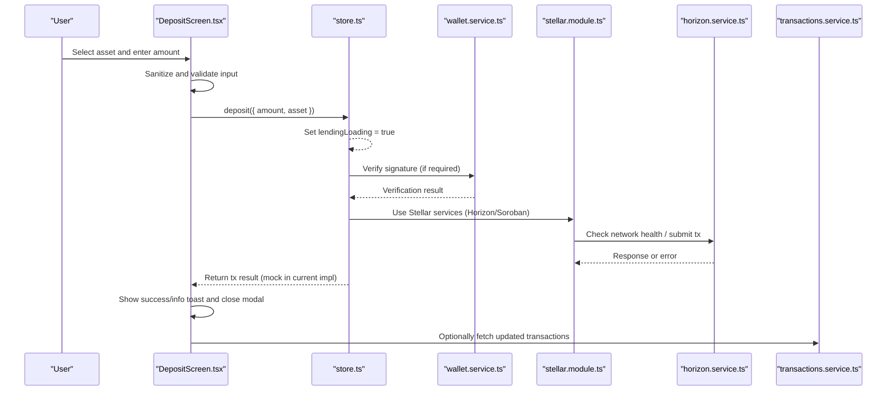
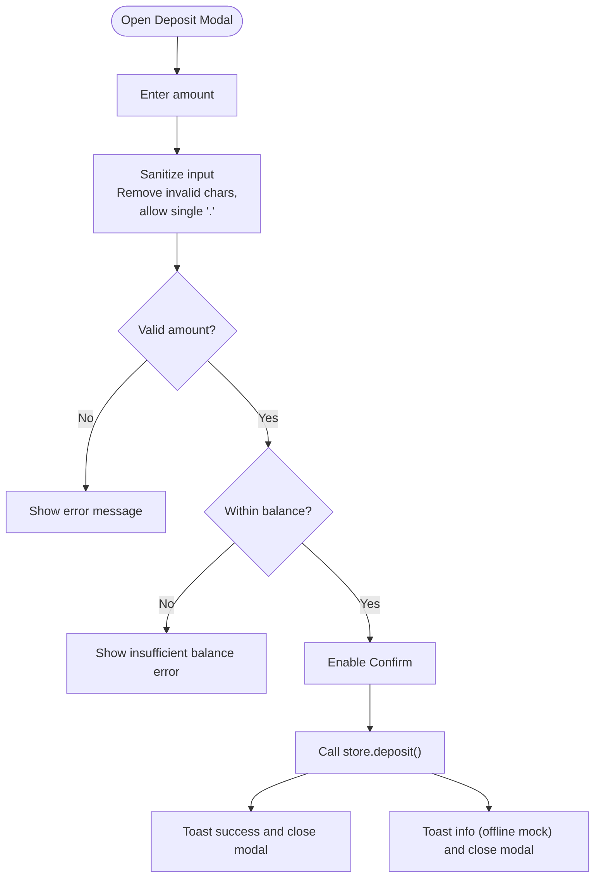
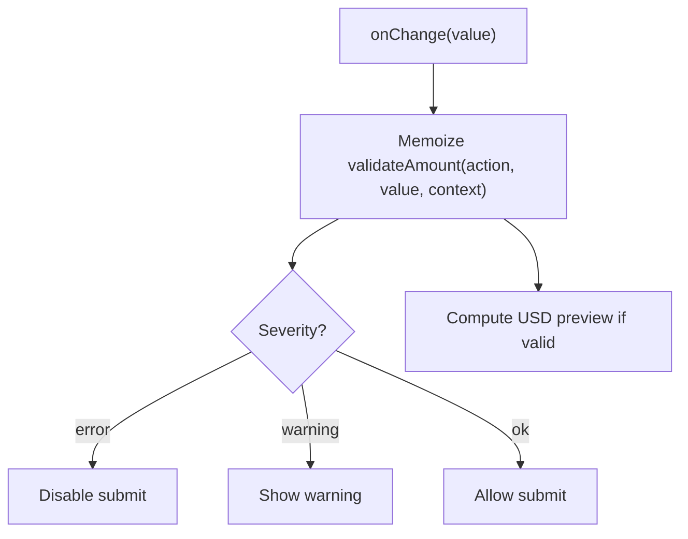
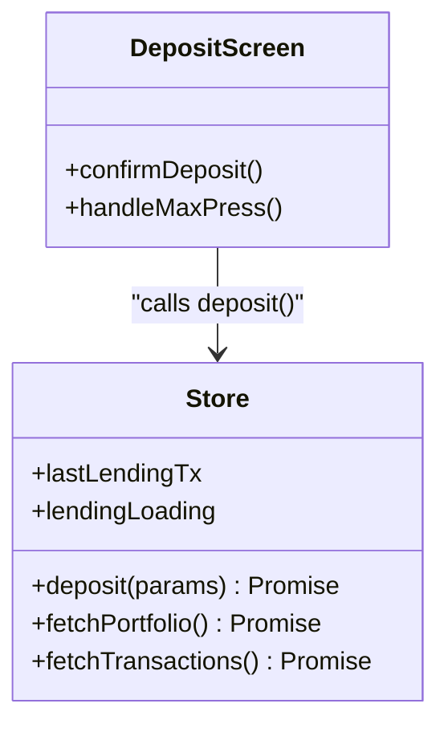
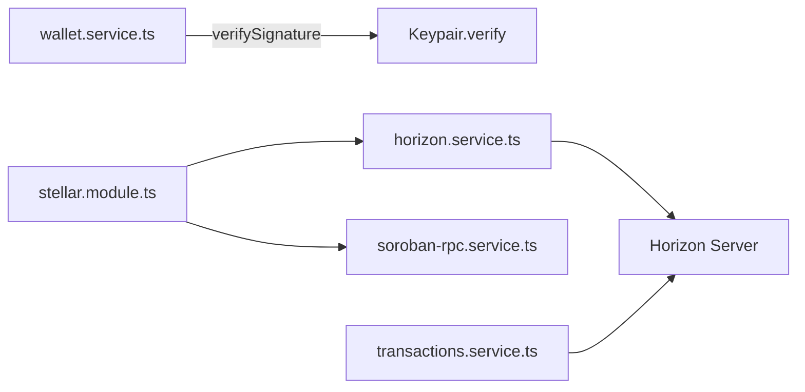
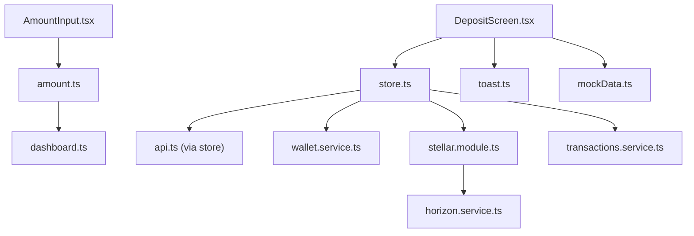

# Deposit Screen

<cite>
**Referenced Files in This Document**
- [DepositScreen.tsx](file://veilend-mobile/src/screens/DepositScreen.tsx)
- [store.ts](file://veilend-mobile/src/store/store.ts)
- [toast.ts](file://veilend-mobile/src/utils/toast.ts)
- [mockData.ts](file://veilend-mobile/src/data/mockData.ts)
- [AmountInput.tsx](file://veilend-web/src/components/AmountInput.tsx)
- [amount.ts](file://veilend-web/src/lib/validation/amount.ts)
- [dashboard.ts](file://veilend-web/src/lib/types/dashboard.ts)
- [wallet.service.ts](file://veilend-backend/src/wallet/wallet.service.ts)
- [stellar.module.ts](file://veilend-backend/src/stellar/stellar.module.ts)
- [horizon.service.ts](file://veilend-backend/src/stellar/horizon.service.ts)
- [transactions.service.ts](file://veilend-backend/src/transactions/transactions.service.ts)
</cite>

## Table of Contents
1. Introduction
2. Project Structure
3. Core Components
4. Architecture Overview
5. Detailed Component Analysis
6. Dependency Analysis
7. Performance Considerations
8. Troubleshooting Guide
9. Conclusion

## Introduction
This document explains the Deposit screen that enables users to deposit assets into the lending protocol. It covers the user interface for selecting an asset and entering an amount, real-time validation and balance checks, confirmation flow, and how it integrates with backend services and Stellar blockchain components. It also documents error handling, success/failure feedback, state management for form validation and transaction progress, and best practices for input sanitization and decimal precision.

## Project Structure
The deposit workflow spans three layers:
- Mobile UI (React Native): DepositScreen handles asset selection, amount input, validation, and confirmation.
- Web UI (Next.js): AmountInput provides reusable, validated amount entry with USD preview and warnings.
- Backend (NestJS): Wallet service verifies signatures; Stellar module exposes Horizon and Soroban RPC services; transactions service indexes on-chain activity.

**Diagram sources**
- [DepositScreen.tsx:20-83](file://veilend-mobile/src/screens/DepositScreen.tsx#L20-L83)
- [store.ts:257-269](file://veilend-mobile/src/store/store.ts#L257-L269)
- [AmountInput.tsx:29-122](file://veilend-web/src/components/AmountInput.tsx#L29-L122)
- [amount.ts:55-138](file://veilend-web/src/lib/validation/amount.ts#L55-L138)
- [wallet.service.ts:5-15](file://veilend-backend/src/wallet/wallet.service.ts#L5-L15)
- [stellar.module.ts:8-13](file://veilend-backend/src/stellar/stellar.module.ts#L8-L13)
- [horizon.service.ts:8-115](file://veilend-backend/src/stellar/horizon.service.ts#L8-L115)
- [transactions.service.ts:41-84](file://veilend-backend/src/transactions/transactions.service.ts#L41-L84)

**Section sources**
- [DepositScreen.tsx:20-83](file://veilend-mobile/src/screens/DepositScreen.tsx#L20-L83)
- [store.ts:257-269](file://veilend-mobile/src/store/store.ts#L257-L269)
- [AmountInput.tsx:29-122](file://veilend-web/src/components/AmountInput.tsx#L29-L122)
- [amount.ts:55-138](file://veilend-web/src/lib/validation/amount.ts#L55-L138)
- [wallet.service.ts:5-15](file://veilend-backend/src/wallet/wallet.service.ts#L5-L15)
- [stellar.module.ts:8-13](file://veilend-backend/src/stellar/stellar.module.ts#L8-L13)
- [horizon.service.ts:8-115](file://veilend-backend/src/stellar/horizon.service.ts#L8-L115)
- [transactions.service.ts:41-84](file://veilend-backend/src/transactions/transactions.service.ts#L41-L84)

## Core Components
- DepositScreen (mobile): Renders asset list from mock data, opens a modal for depositing, validates inputs, and triggers store-based deposit action. Displays loading state and toast notifications.
- Store (mobile): Manages auth/UI/lending/portfolio state. The deposit method currently returns a mock transaction and sets lastLendingTx; it toggles lendingLoading during processing.
- AmountInput (web): Controlled input with robust validation, max button logic, and USD preview using price context.
- Validation (web): Centralized parsing, precision checks, and rule-based validation for DEPOSIT/WITHDRAW/BORROW/REPAY actions.
- Wallet Service (backend): Verifies Stellar signatures using public keys and base64-encoded signatures.
- Stellar Module & Horizon Service (backend): Provides Horizon client initialization, health checks, and safe connection monitoring.
- Transactions Service (backend): Indexes Horizon operations to derive deposit/transfer records and errors.

**Section sources**
- [DepositScreen.tsx:20-83](file://veilend-mobile/src/screens/DepositScreen.tsx#L20-L83)
- [store.ts:257-269](file://veilend-mobile/src/store/store.ts#L257-L269)
- [AmountInput.tsx:29-122](file://veilend-web/src/components/AmountInput.tsx#L29-L122)
- [amount.ts:55-138](file://veilend-web/src/lib/validation/amount.ts#L55-L138)
- [wallet.service.ts:5-15](file://veilend-backend/src/wallet/wallet.service.ts#L5-L15)
- [stellar.module.ts:8-13](file://veilend-backend/src/stellar/stellar.module.ts#L8-L13)
- [horizon.service.ts:8-115](file://veilend-backend/src/stellar/horizon.service.ts#L8-L115)
- [transactions.service.ts:41-84](file://veilend-backend/src/transactions/transactions.service.ts#L41-L84)

## Architecture Overview
The deposit flow begins on the mobile DepositScreen. Users select an asset and enter an amount. Input is sanitized and validated against available balance and numeric rules. On confirm, the screen calls the store’s deposit method, which currently simulates a successful transaction and updates UI state via toast. In production, this would build and sign a Stellar transaction, submit it via Horizon or Soroban RPC, and persist results through the backend.

**Diagram sources**
- [DepositScreen.tsx:69-83](file://veilend-mobile/src/screens/DepositScreen.tsx#L69-L83)
- [store.ts:257-269](file://veilend-mobile/src/store/store.ts#L257-L269)
- [wallet.service.ts:5-15](file://veilend-backend/src/wallet/wallet.service.ts#L5-L15)
- [stellar.module.ts:8-13](file://veilend-backend/src/stellar/stellar.module.ts#L8-L13)
- [horizon.service.ts:8-115](file://veilend-backend/src/stellar/horizon.service.ts#L8-L115)
- [transactions.service.ts:41-84](file://veilend-backend/src/transactions/transactions.service.ts#L41-L84)

## Detailed Component Analysis

### Mobile Deposit Screen
- Asset selection: Renders a list from mock data with APY and wallet balances. Tapping an asset opens the deposit modal preselected.
- Amount input: Uses a text input with a MAX button that fills the selected asset’s balance when available.
- Input sanitization: Strips non-numeric characters and ensures at most one decimal point.
- Validation: Computes canSubmit and error messages based on empty input, numeric format, positivity, and balance sufficiency.
- Confirmation flow: Calls store.deposit, shows success toast, closes modal; on error, logs mock offline behavior and still updates lastLendingTx for UX continuity.
- Loading state: Disables confirm while lendingLoading is true and shows an activity indicator.

**Diagram sources**
- [DepositScreen.tsx:11-18](file://veilend-mobile/src/screens/DepositScreen.tsx#L11-L18)
- [DepositScreen.tsx:33-67](file://veilend-mobile/src/screens/DepositScreen.tsx#L33-L67)
- [DepositScreen.tsx:69-83](file://veilend-mobile/src/screens/DepositScreen.tsx#L69-L83)

**Section sources**
- [DepositScreen.tsx:20-83](file://veilend-mobile/src/screens/DepositScreen.tsx#L20-L83)
- [mockData.ts:9-40](file://veilend-mobile/src/data/mockData.ts#L9-L40)

### Web Amount Input and Validation
- Controlled input with memoized validation on every change.
- Max button adapts per action: for REPAY, caps at outstanding debt or available balance; otherwise uses available balance.
- USD preview computed from parsed amount and price context.
- Validation rules: parse strict positive decimals, enforce precision (default 7 decimals), block over-balance deposits/withdrawals, warn when using full balance, and handle borrow/repay constraints.

**Diagram sources**
- [AmountInput.tsx:29-122](file://veilend-web/src/components/AmountInput.tsx#L29-L122)
- [amount.ts:55-138](file://veilend-web/src/lib/validation/amount.ts#L55-L138)

**Section sources**
- [AmountInput.tsx:29-122](file://veilend-web/src/components/AmountInput.tsx#L29-L122)
- [amount.ts:55-138](file://veilend-web/src/lib/validation/amount.ts#L55-L138)
- [dashboard.ts:18-18](file://veilend-web/src/lib/types/dashboard.ts#L18-L18)

### State Management and Transaction Progress
- Lending loading flag prevents duplicate submissions and drives UI indicators.
- lastLendingTx stores the latest transaction result for display and history.
- Portfolio and transactions fetching endpoints are available in the store for post-deposit refresh flows.

**Diagram sources**
- [store.ts:63-97](file://veilend-mobile/src/store/store.ts#L63-L97)
- [store.ts:257-269](file://veilend-mobile/src/store/store.ts#L257-L269)
- [store.ts:321-362](file://veilend-mobile/src/store/store.ts#L321-L362)
- [DepositScreen.tsx:69-83](file://veilend-mobile/src/screens/DepositScreen.tsx#L69-L83)

**Section sources**
- [store.ts:63-97](file://veilend-mobile/src/store/store.ts#L63-L97)
- [store.ts:257-269](file://veilend-mobile/src/store/store.ts#L257-L269)
- [store.ts:321-362](file://veilend-mobile/src/store/store.ts#L321-L362)

### Stellar Integration Points
- Wallet service verifies Stellar signatures using Keypair utilities.
- Stellar module exports HorizonService and SorobanRpcService for network interactions.
- HorizonService initializes a Horizon client, validates connectivity, and exposes health status and error details.
- TransactionsService maps Horizon operations to deposit/transfer records and surfaces errors.

**Diagram sources**
- [wallet.service.ts:5-15](file://veilend-backend/src/wallet/wallet.service.ts#L5-L15)
- [stellar.module.ts:8-13](file://veilend-backend/src/stellar/stellar.module.ts#L8-L13)
- [horizon.service.ts:8-115](file://veilend-backend/src/stellar/horizon.service.ts#L8-L115)
- [transactions.service.ts:41-84](file://veilend-backend/src/transactions/transactions.service.ts#L41-L84)

**Section sources**
- [wallet.service.ts:5-15](file://veilend-backend/src/wallet/wallet.service.ts#L5-L15)
- [stellar.module.ts:8-13](file://veilend-backend/src/stellar/stellar.module.ts#L8-L13)
- [horizon.service.ts:8-115](file://veilend-backend/src/stellar/horizon.service.ts#L8-L115)
- [transactions.service.ts:41-84](file://veilend-backend/src/transactions/transactions.service.ts#L41-L84)

## Dependency Analysis
- DepositScreen depends on:
  - Mock assets for UI listing and balances.
  - Store for deposit execution and global loading state.
  - Toast for user feedback.
- Store depends on:
  - API utilities for portfolio/transactions retrieval.
  - Optional backend services for signature verification and Stellar interactions (to be wired).
- Web AmountInput depends on:
  - Validation library for parsing, precision, and business rules.
  - Types for action enumeration.
- Backend Stellar module composes Horizon and Soroban services used by higher-level services.

**Diagram sources**
- [DepositScreen.tsx:20-83](file://veilend-mobile/src/screens/DepositScreen.tsx#L20-L83)
- [store.ts:257-269](file://veilend-mobile/src/store/store.ts#L257-L269)
- [AmountInput.tsx:29-122](file://veilend-web/src/components/AmountInput.tsx#L29-L122)
- [amount.ts:55-138](file://veilend-web/src/lib/validation/amount.ts#L55-L138)
- [dashboard.ts:18-18](file://veilend-web/src/lib/types/dashboard.ts#L18-L18)
- [wallet.service.ts:5-15](file://veilend-backend/src/wallet/wallet.service.ts#L5-L15)
- [stellar.module.ts:8-13](file://veilend-backend/src/stellar/stellar.module.ts#L8-L13)
- [horizon.service.ts:8-115](file://veilend-backend/src/stellar/horizon.service.ts#L8-L115)
- [transactions.service.ts:41-84](file://veilend-backend/src/transactions/transactions.service.ts#L41-L84)

**Section sources**
- [DepositScreen.tsx:20-83](file://veilend-mobile/src/screens/DepositScreen.tsx#L20-L83)
- [store.ts:257-269](file://veilend-mobile/src/store/store.ts#L257-L269)
- [AmountInput.tsx:29-122](file://veilend-web/src/components/AmountInput.tsx#L29-L122)
- [amount.ts:55-138](file://veilend-web/src/lib/validation/amount.ts#L55-L138)
- [dashboard.ts:18-18](file://veilend-web/src/lib/types/dashboard.ts#L18-L18)
- [wallet.service.ts:5-15](file://veilend-backend/src/wallet/wallet.service.ts#L5-L15)
- [stellar.module.ts:8-13](file://veilend-backend/src/stellar/stellar.module.ts#L8-L13)
- [horizon.service.ts:8-115](file://veilend-backend/src/stellar/horizon.service.ts#L8-L115)
- [transactions.service.ts:41-84](file://veilend-backend/src/transactions/transactions.service.ts#L41-L84)

## Performance Considerations
- Debounce or throttle expensive validations if amounts update rapidly.
- Cache asset metadata and prices to avoid redundant computations.
- Use memoization (already present in web AmountInput) to prevent re-validation unless dependencies change.
- Avoid blocking UI during network calls; keep lendingLoading short-lived and provide clear feedback.

[No sources needed since this section provides general guidance]

## Troubleshooting Guide
Common issues and resolutions:
- Invalid amount: Ensure only digits and at most one decimal point; reject negative or zero values.
- Insufficient balance: Compare parsed amount against available balance; show clear error.
- Decimal precision: Enforce maximum decimals (default 7) to match Stellar asset representation.
- Network errors: Use HorizonService health checks before submitting transactions; surface user-friendly messages.
- Signature verification failures: Validate signature format and ensure correct public key and message hashing.
- Offline mode fallback: When backend or wallet integration is unavailable, inform users via toast and record mock transactions for UX continuity.

**Section sources**
- [DepositScreen.tsx:11-18](file://veilend-mobile/src/screens/DepositScreen.tsx#L11-L18)
- [DepositScreen.tsx:43-67](file://veilend-mobile/src/screens/DepositScreen.tsx#L43-L67)
- [amount.ts:31-49](file://veilend-web/src/lib/validation/amount.ts#L31-L49)
- [amount.ts:55-138](file://veilend-web/src/lib/validation/amount.ts#L55-L138)
- [horizon.service.ts:49-71](file://veilend-backend/src/stellar/horizon.service.ts#L49-L71)
- [wallet.service.ts:5-15](file://veilend-backend/src/wallet/wallet.service.ts#L5-L15)
- [toast.ts:5-19](file://veilend-mobile/src/utils/toast.ts#L5-L19)

## Conclusion
The Deposit screen provides a clear, validated path for users to deposit assets, with robust input handling and immediate feedback. While the current implementation uses mock transactions, the architecture supports integrating Stellar blockchain interactions via the backend’s Stellar module and Horizon service. With proper wiring to build/sign transactions, verify signatures, and index on-chain events, the system will deliver a complete deposit experience with reliable error handling and user guidance.

[No sources needed since this section summarizes without analyzing specific files]