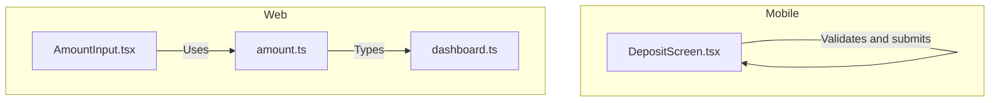
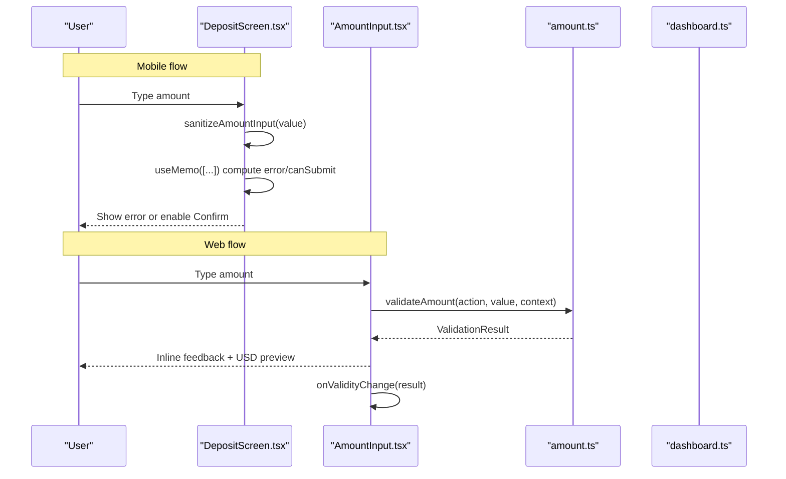
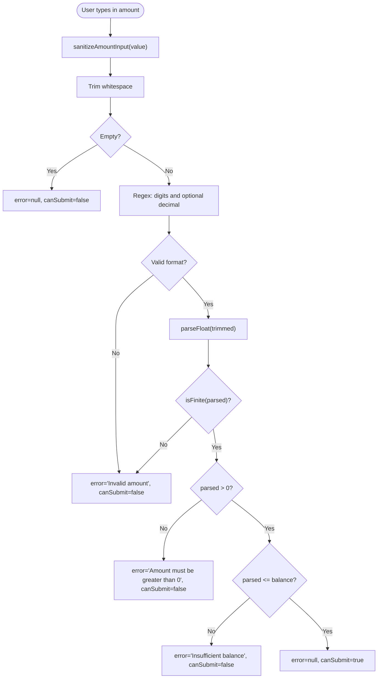
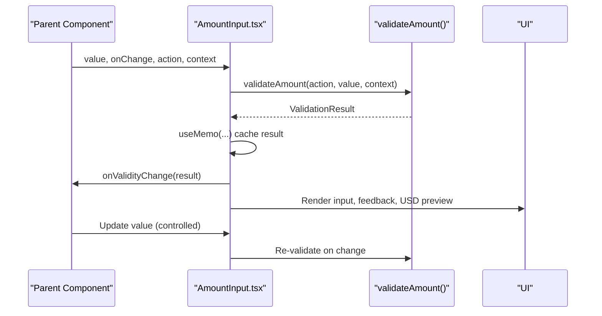
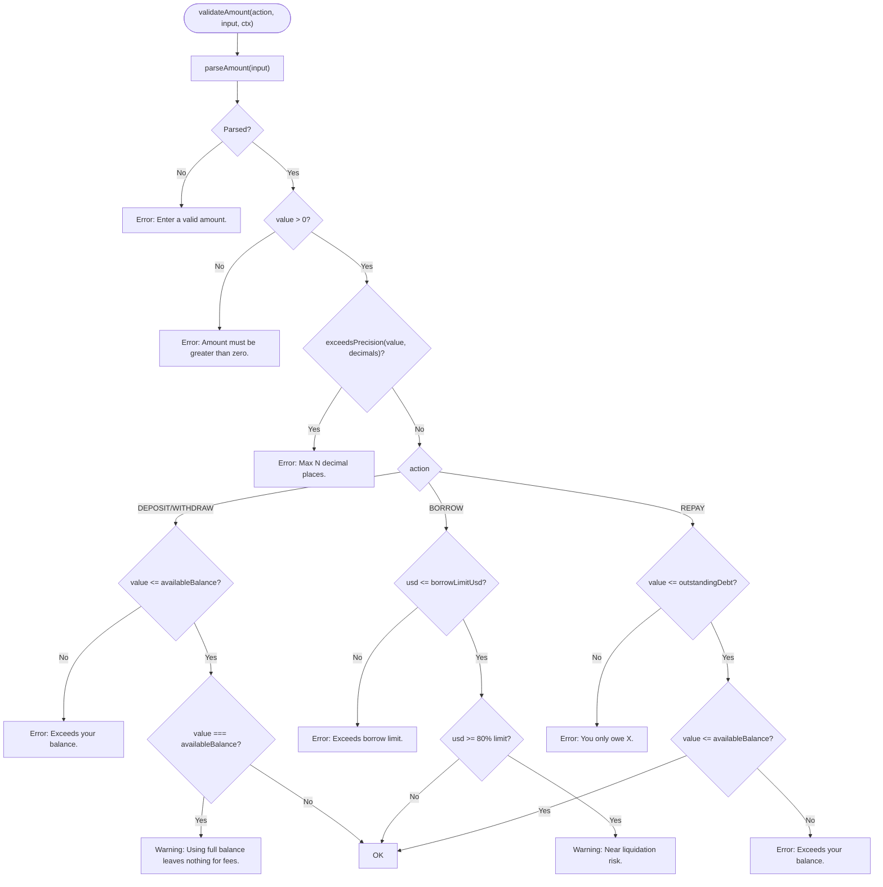
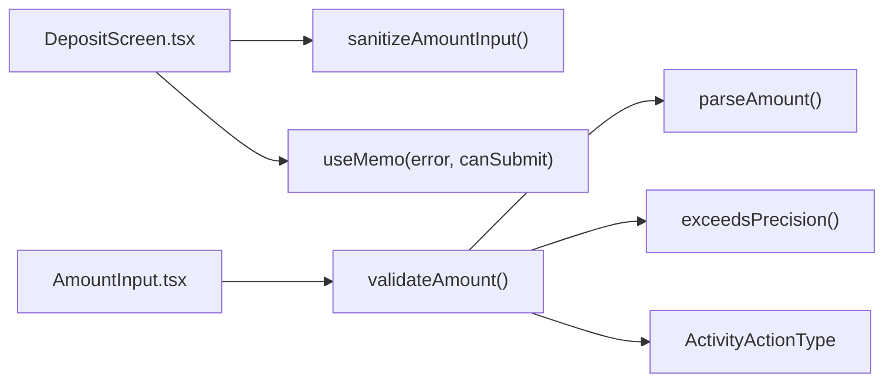

# Form Validation & Input Handling

<cite>
**Referenced Files in This Document**
- [DepositScreen.tsx](file://veilend-mobile/src/screens/DepositScreen.tsx)
- [AmountInput.tsx](file://veilend-web/src/components/AmountInput.tsx)
- [amount.ts](file://veilend-web/src/lib/validation/amount.ts)
- [dashboard.ts](file://veilend-web/src/lib/types/dashboard.ts)
</cite>

## Table of Contents
1. [Introduction](#introduction)
2. [Project Structure](#project-structure)
3. [Core Components](#core-components)
4. [Architecture Overview](#architecture-overview)
5. [Detailed Component Analysis](#detailed-component-analysis)
6. [Dependency Analysis](#dependency-analysis)
7. [Performance Considerations](#performance-considerations)
8. [Troubleshooting Guide](#troubleshooting-guide)
9. [Conclusion](#conclusion)

## Introduction
This document explains the deposit form validation and input handling system across the mobile and web implementations. It focuses on:
- Input sanitization to ensure only valid numeric characters are accepted
- Robust validation rules for amount format, finite numbers, positive values, and balance sufficiency
- Error state management with performance optimization using memoization
- Real-time validation feedback and accessibility considerations for screen readers
- Practical examples of input sanitization patterns, validation rule implementation, and user experience best practices for financial forms

## Project Structure
The deposit flow is implemented in two platforms:
- Mobile: A dedicated Deposit screen that includes a modal for entering amounts and validating them before submission
- Web: A reusable AmountInput component that integrates with a centralized validation library

**Diagram sources**
- [DepositScreen.tsx:11-67](file://veilend-mobile/src/screens/DepositScreen.tsx#L11-L67)
- [AmountInput.tsx:1-123](file://veilend-web/src/components/AmountInput.tsx#L1-L123)
- [amount.ts:1-143](file://veilend-web/src/lib/validation/amount.ts#L1-L143)
- [dashboard.ts:18-18](file://veilend-web/src/lib/types/dashboard.ts#L18-L18)

**Section sources**
- [DepositScreen.tsx:11-67](file://veilend-mobile/src/screens/DepositScreen.tsx#L11-L67)
- [AmountInput.tsx:1-123](file://veilend-web/src/components/AmountInput.tsx#L1-L123)
- [amount.ts:1-143](file://veilend-web/src/lib/validation/amount.ts#L1-L143)
- [dashboard.ts:18-18](file://veilend-web/src/lib/types/dashboard.ts#L18-L18)

## Core Components
- Mobile sanitizeAmountInput: Sanitizes raw text input to allow only digits and at most one decimal point, ensuring clean numeric strings before validation.
- Mobile validation logic: Uses regex checks, finite number verification, positivity constraints, and balance sufficiency checks to determine if a deposit can be submitted.
- Web AmountInput: A controlled input component that performs real-time validation via a shared validator, displays contextual feedback, and exposes validity changes to parents.
- Web validation library: Centralized parsing and validation functions that enforce precision, positivity, and action-specific rules (deposit/borrow/repay/withdraw).

Key responsibilities:
- Input sanitization prevents invalid characters early
- Validation enforces business rules and provides actionable messages
- UI surfaces errors/warnings immediately and disables unsafe actions
- Accessibility attributes guide assistive technologies

**Section sources**
- [DepositScreen.tsx:11-67](file://veilend-mobile/src/screens/DepositScreen.tsx#L11-L67)
- [AmountInput.tsx:25-123](file://veilend-web/src/components/AmountInput.tsx#L25-L123)
- [amount.ts:27-143](file://veilend-web/src/lib/validation/amount.ts#L27-L143)

## Architecture Overview
The system follows a layered approach:
- Presentation layer handles user input and renders feedback
- Validation layer enforces formatting, numeric constraints, and business rules
- Context layer supplies balances, limits, prices, and decimals needed for validation

**Diagram sources**
- [DepositScreen.tsx:11-67](file://veilend-mobile/src/screens/DepositScreen.tsx#L11-L67)
- [AmountInput.tsx:40-47](file://veilend-web/src/components/AmountInput.tsx#L40-L47)
- [amount.ts:55-138](file://veilend-web/src/lib/validation/amount.ts#L55-L138)
- [dashboard.ts:18-18](file://veilend-web/src/lib/types/dashboard.ts#L18-L18)

## Detailed Component Analysis

### Mobile Deposit Screen: sanitizeAmountInput and Validation
- Input sanitization:
  - Removes all non-digit characters except a single decimal point
  - Ensures only one dot exists by stripping subsequent dots after the first
  - Prevents malformed inputs like multiple decimals or letters from reaching validation
- Validation rules:
  - Empty input is not allowed
  - Regex checks ensure a valid numeric string pattern
  - parseFloat result must be a finite number
  - Amount must be greater than zero
  - Amount must not exceed the selected asset’s available balance
- State management:
  - useMemo computes error and canSubmit based on current amount and selected asset
  - Submit button is disabled when validation fails or during loading
- Accessibility:
  - Inputs and buttons include accessibility labels for screen readers
  - Errors are exposed with descriptive labels

**Diagram sources**
- [DepositScreen.tsx:11-18](file://veilend-mobile/src/screens/DepositScreen.tsx#L11-L18)
- [DepositScreen.tsx:43-67](file://veilend-mobile/src/screens/DepositScreen.tsx#L43-L67)

**Section sources**
- [DepositScreen.tsx:11-18](file://veilend-mobile/src/screens/DepositScreen.tsx#L11-L18)
- [DepositScreen.tsx:43-67](file://veilend-mobile/src/screens/DepositScreen.tsx#L43-L67)

### Web AmountInput Component: Controlled Input with Real-Time Validation
- Controlled input:
  - Receives value and onChange from parent; updates internal touched state to control feedback visibility
- Validation integration:
  - Calls validateAmount with action, value, and context
  - Memoizes validation result to avoid unnecessary recomputation
- Feedback and UX:
  - Shows inline messages only after touch or blur and when there is content
  - Distinguishes errors vs warnings and sets aria-invalid accordingly
  - Displays USD preview when parsed value is positive
- Max button:
  - For repay, caps at min(outstandingDebt, availableBalance); otherwise uses availableBalance
- Accessibility:
  - aria-invalid toggles based on error presence
  - aria-describedby links to feedback element for screen readers
  - role="alert" for errors and role="status" for warnings

**Diagram sources**
- [AmountInput.tsx:40-47](file://veilend-web/src/components/AmountInput.tsx#L40-L47)
- [AmountInput.tsx:69-120](file://veilend-web/src/components/AmountInput.tsx#L69-L120)
- [amount.ts:55-138](file://veilend-web/src/lib/validation/amount.ts#L55-L138)

**Section sources**
- [AmountInput.tsx:25-123](file://veilend-web/src/components/AmountInput.tsx#L25-L123)

### Validation Library: Parsing, Precision, and Action-Specific Rules
- parseAmount:
  - Trims input and rejects empty strings
  - Enforces a strict pattern allowing only digits and at most one decimal point
  - Returns null for unparseable inputs or non-finite numbers
- exceedsPrecision:
  - Checks whether a value respects the asset’s decimal precision (default 7)
  - Prevents on-chain representation issues due to excessive decimals
- validateAmount:
  - Applies common rules: non-empty, positive, precision check
  - DEPOSIT/WITHDRAW: ensures value does not exceed available balance; warns when using full balance
  - BORROW: checks USD borrow limit and warns near high utilization
  - REPAY: ensures value does not exceed outstanding debt or available balance
- Formatting helpers:
  - Short number formatting for user-friendly messages

**Diagram sources**
- [amount.ts:31-49](file://veilend-web/src/lib/validation/amount.ts#L31-L49)
- [amount.ts:55-138](file://veilend-web/src/lib/validation/amount.ts#L55-L138)

**Section sources**
- [amount.ts:27-143](file://veilend-web/src/lib/validation/amount.ts#L27-L143)
- [dashboard.ts:18-18](file://veilend-web/src/lib/types/dashboard.ts#L18-L18)

## Dependency Analysis
- Mobile DepositScreen depends on:
  - Local sanitizeAmountInput for immediate input cleaning
  - useMemo for efficient re-computation of validation state
  - Store methods for submitting deposits and handling offline mock behavior
- Web AmountInput depends on:
  - Centralized validation functions for consistent rules across the app
  - Types defining activity actions to drive action-specific validation
- Shared concepts:
  - Both platforms enforce positive amounts, finite numbers, and balance sufficiency
  - Both provide immediate feedback and disable unsafe submissions

**Diagram sources**
- [DepositScreen.tsx:11-67](file://veilend-mobile/src/screens/DepositScreen.tsx#L11-L67)
- [AmountInput.tsx:40-47](file://veilend-web/src/components/AmountInput.tsx#L40-L47)
- [amount.ts:31-138](file://veilend-web/src/lib/validation/amount.ts#L31-L138)
- [dashboard.ts:18-18](file://veilend-web/src/lib/types/dashboard.ts#L18-L18)

**Section sources**
- [DepositScreen.tsx:11-67](file://veilend-mobile/src/screens/DepositScreen.tsx#L11-L67)
- [AmountInput.tsx:40-47](file://veilend-web/src/components/AmountInput.tsx#L40-L47)
- [amount.ts:31-138](file://veilend-web/src/lib/validation/amount.ts#L31-L138)
- [dashboard.ts:18-18](file://veilend-web/src/lib/types/dashboard.ts#L18-L18)

## Performance Considerations
- Mobile:
  - useMemo ensures validation recomputes only when amount or selected asset changes, avoiding per-typing recalculations
  - Immediate sanitization reduces downstream validation work
- Web:
  - useMemo caches ValidationResult based on action, value, and context
  - Touched state delays feedback until user interaction, reducing noise and re-renders
  - USD preview computed only when parsed value is positive

Best practices applied:
- Memoize expensive computations tied to frequently changing inputs
- Separate concerns: sanitization (input shaping) vs validation (business rules)
- Avoid heavy operations inside render paths; use hooks appropriately

[No sources needed since this section provides general guidance]

## Troubleshooting Guide
Common issues and resolutions:
- Multiple decimal points entered:
  - Mobile: sanitizeAmountInput removes extra dots automatically
  - Web: parseAmount rejects invalid formats; AmountInput shows inline error
- Non-numeric characters:
  - Mobile: replaced by sanitization; Web: rejected by regex in parseAmount
- Negative or zero amounts:
  - Both platforms return clear errors requiring positive values
- Exceeding balance:
  - Both platforms prevent submission and show specific error messages
- Precision exceeded:
  - Web validator enforces asset decimals; users receive precise guidance

Accessibility tips:
- Ensure aria-invalid reflects error state
- Provide aria-describedby linking to feedback elements
- Use semantic roles (alert/status) for dynamic messages

**Section sources**
- [DepositScreen.tsx:11-18](file://veilend-mobile/src/screens/DepositScreen.tsx#L11-L18)
- [DepositScreen.tsx:43-67](file://veilend-mobile/src/screens/DepositScreen.tsx#L43-L67)
- [AmountInput.tsx:49-85](file://veilend-web/src/components/AmountInput.tsx#L49-L85)
- [amount.ts:31-49](file://veilend-web/src/lib/validation/amount.ts#L31-L49)
- [amount.ts:55-138](file://veilend-web/src/lib/validation/amount.ts#L55-L138)

## Conclusion
The deposit form validation and input handling system combines robust input sanitization with comprehensive validation rules to ensure safe and user-friendly financial transactions. The mobile implementation emphasizes immediate sanitization and concise validation, while the web implementation centralizes validation logic for consistency and leverages memoization for performance. Together, they deliver real-time feedback, accessible interactions, and reliable safeguards against invalid or risky inputs.

[No sources needed since this section summarizes without analyzing specific files]