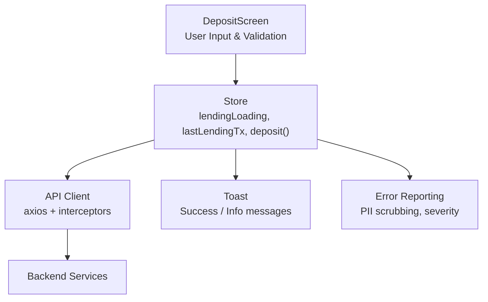
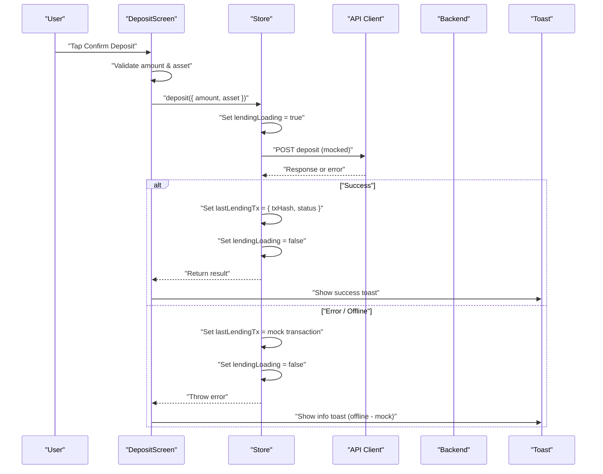
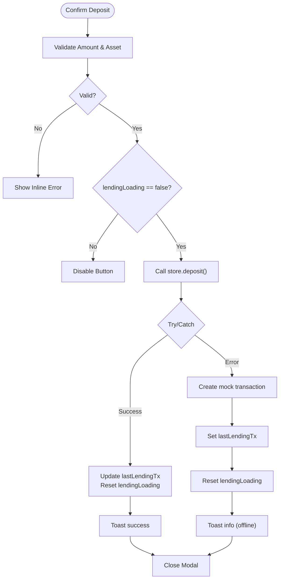
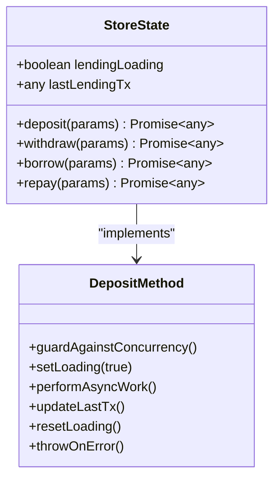
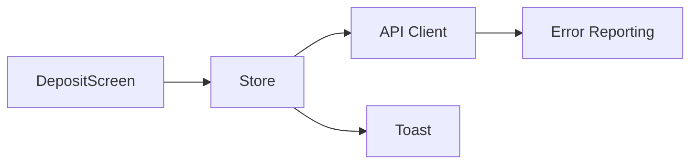

# Transaction Processing & State Management

<cite>
**Referenced Files in This Document**
- [DepositScreen.tsx](file://veilend-mobile/src/screens/DepositScreen.tsx)
- [store.ts](file://veilend-mobile/src/store/store.ts)
- [toast.ts](file://veilend-mobile/src/utils/toast.ts)
- [api.ts](file://veilend-mobile/src/utils/api.ts)
- [errorReporting.ts](file://veilend-mobile/src/utils/errorReporting.ts)
- [store.test.ts](file://veilend-mobile/src/store/store.test.ts)
</cite>

## Table of Contents
1. [Introduction](#introduction)
2. [Project Structure](#project-structure)
3. [Core Components](#core-components)
4. [Architecture Overview](#architecture-overview)
5. [Detailed Component Analysis](#detailed-component-analysis)
6. [Dependency Analysis](#dependency-analysis)
7. [Performance Considerations](#performance-considerations)
8. [Troubleshooting Guide](#troubleshooting-guide)
9. [Conclusion](#conclusion)
10. [Appendices](#appendices)

## Introduction
This document explains the deposit transaction lifecycle and state management in the mobile application, focusing on how user actions flow through the UI, store, and external services. It covers:
- The confirmDeposit function that initiates deposits
- Integration with the store’s deposit method
- Loading state management via lendingLoading
- Error handling strategies and offline fallback with mock transactions
- Success feedback using Toast notifications
- State updates for lastLendingTx tracking
- Async/await patterns, try/catch error handling, and user feedback mechanisms
- Examples of transaction state management, error recovery patterns, and testing considerations for blockchain interactions

## Project Structure
The deposit workflow spans a small set of focused modules:
- DepositScreen handles user input, validation, and triggers the deposit action
- Store encapsulates lending operations (deposit, withdraw, borrow, repay), loading flags, and last transaction tracking
- Toast provides cross-platform user feedback
- API client centralizes HTTP requests and error reporting
- Error reporting module captures structured errors and PII scrubbing

**Diagram sources**
- [DepositScreen.tsx:69-81](file://veilend-mobile/src/screens/DepositScreen.tsx#L69-L81)
- [store.ts:254-308](file://veilend-mobile/src/store/store.ts#L254-L308)
- [toast.ts:5-19](file://veilend-mobile/src/utils/toast.ts#L5-L19)
- [api.ts:16-53](file://veilend-mobile/src/utils/api.ts#L16-L53)
- [errorReporting.ts:182-211](file://veilend-mobile/src/utils/errorReporting.ts#L182-L211)

**Section sources**
- [DepositScreen.tsx:20-83](file://veilend-mobile/src/screens/DepositScreen.tsx#L20-L83)
- [store.ts:63-70](file://veilend-mobile/src/store/store.ts#L63-L70)
- [toast.ts:1-31](file://veilend-mobile/src/utils/toast.ts#L1-L31)
- [api.ts:1-57](file://veilend-mobile/src/utils/api.ts#L1-L57)
- [errorReporting.ts:1-279](file://veilend-mobile/src/utils/errorReporting.ts#L1-L279)

## Core Components
- DepositScreen: Validates amount and asset selection, manages modal visibility, and calls store.deposit via confirmDeposit. Uses lendingLoading to disable repeated submissions and show activity indicator.
- Store (Zustand): Provides deposit, withdraw, borrow, repay methods; maintains lendingLoading and lastLendingTx; currently implements mock transactions for development and testing.
- Toast: Cross-platform notification utility used to inform users about success or offline fallback behavior.
- API Client: Axios instance with request/response interceptors; attaches auth tokens and reports errors with severity classification and metadata.
- Error Reporting: Centralized error capture, PII scrubbing, severity classification, and persistent ring buffer storage.

Key responsibilities:
- UI layer ensures safe user inputs and prevents double submission
- Store orchestrates async operations and state transitions
- Feedback layer communicates outcomes to users
- Error infrastructure captures and sanitizes diagnostic data

**Section sources**
- [DepositScreen.tsx:43-83](file://veilend-mobile/src/screens/DepositScreen.tsx#L43-L83)
- [store.ts:254-308](file://veilend-mobile/src/store/store.ts#L254-L308)
- [toast.ts:5-19](file://veilend-mobile/src/utils/toast.ts#L5-L19)
- [api.ts:16-53](file://veilend-mobile/src/utils/api.ts#L16-L53)
- [errorReporting.ts:123-176](file://veilend-mobile/src/utils/errorReporting.ts#L123-L176)

## Architecture Overview
The deposit workflow follows a clear sequence from user interaction to state updates and feedback:

**Diagram sources**
- [DepositScreen.tsx:69-81](file://veilend-mobile/src/screens/DepositScreen.tsx#L69-L81)
- [store.ts:257-269](file://veilend-mobile/src/store/store.ts#L257-L269)
- [toast.ts:5-19](file://veilend-mobile/src/utils/toast.ts#L5-L19)
- [api.ts:16-53](file://veilend-mobile/src/utils/api.ts#L16-L53)

## Detailed Component Analysis

### DepositScreen: confirmDeposit and UI Flow
- Input validation: Ensures amount is numeric, positive, and within wallet balance. Displays inline error text when invalid.
- Submission guard: Prevents duplicate submissions by checking canSubmit and lendingLoading before calling store.deposit.
- Async operation: Uses async/await to call store.deposit, then shows success toast and closes modal.
- Error handling: Catches exceptions, creates a mock transaction record, updates lastLendingTx, and shows an info toast indicating offline mode.
- Loading state: Disables confirm button while lendingLoading is true and shows an activity indicator.

**Diagram sources**
- [DepositScreen.tsx:43-83](file://veilend-mobile/src/screens/DepositScreen.tsx#L43-L83)

**Section sources**
- [DepositScreen.tsx:43-83](file://veilend-mobile/src/screens/DepositScreen.tsx#L43-L83)

### Store: Lending Methods and State Management
- State fields:
  - lendingLoading: Boolean flag to prevent concurrent operations
  - lastLendingTx: Holds the most recent transaction object (txHash, status, amount, asset)
- Deposit method:
  - Guards against concurrent calls by returning early if lendingLoading is true
  - Sets lendingLoading to true at start
  - Performs async work (currently mocked)
  - Updates lastLendingTx and resets lendingLoading on completion
  - Throws errors to propagate to caller
- Similar patterns apply to withdraw, borrow, and repay methods

**Diagram sources**
- [store.ts:63-70](file://veilend-mobile/src/store/store.ts#L63-L70)
- [store.ts:257-269](file://veilend-mobile/src/store/store.ts#L257-L269)

**Section sources**
- [store.ts:254-308](file://veilend-mobile/src/store/store.ts#L254-L308)

### Toast: User Feedback Mechanism
- Cross-platform notifications:
  - Android: Uses native ToastAndroid
  - iOS: Falls back to Alert.alert
- Provides convenience functions for success, error, and info messages
- Used to communicate successful deposits and offline fallback scenarios

**Section sources**
- [toast.ts:5-19](file://veilend-mobile/src/utils/toast.ts#L5-L19)

### API Client: Interceptors and Error Reporting
- Request interceptor: Attaches Authorization header using stored authToken
- Response interceptor: Captures network and server errors, classifies severity, and reports via errorReporting module
- Reports include URL, method, HTTP status, and whether a response was received

**Section sources**
- [api.ts:16-53](file://veilend-mobile/src/utils/api.ts#L16-L53)

### Error Reporting: Structured Capture and PII Scrubbing
- Severity classification:
  - Critical: Unauthorized/token expired
  - High: Network errors, timeouts, type/reference errors
  - Medium: Unknown errors
- PII scrubbing: Removes sensitive data like Stellar keys, Bearer tokens, and JSON secrets
- Persistent storage: Ring buffer of up to 50 reports saved in SecureStore
- Global instrumentation: Optional setup to capture unhandled errors and promise rejections

**Section sources**
- [errorReporting.ts:123-176](file://veilend-mobile/src/utils/errorReporting.ts#L123-L176)
- [errorReporting.ts:182-211](file://veilend-mobile/src/utils/errorReporting.ts#L182-L211)
- [errorReporting.ts:248-267](file://veilend-mobile/src/utils/errorReporting.ts#L248-L267)

## Dependency Analysis
The deposit workflow has clear dependencies between components:

- DepositScreen depends on Store for business logic and state
- Store depends on API for backend communication and Toast for user feedback
- API depends on Error Reporting for structured diagnostics
- No circular dependencies observed

**Diagram sources**
- [DepositScreen.tsx:69-81](file://veilend-mobile/src/screens/DepositScreen.tsx#L69-L81)
- [store.ts:257-269](file://veilend-mobile/src/store/store.ts#L257-L269)
- [api.ts:16-53](file://veilend-mobile/src/utils/api.ts#L16-L53)
- [toast.ts:5-19](file://veilend-mobile/src/utils/toast.ts#L5-L19)

**Section sources**
- [DepositScreen.tsx:69-81](file://veilend-mobile/src/screens/DepositScreen.tsx#L69-L81)
- [store.ts:257-269](file://veilend-mobile/src/store/store.ts#L257-L269)
- [api.ts:16-53](file://veilend-mobile/src/utils/api.ts#L16-L53)
- [toast.ts:5-19](file://veilend-mobile/src/utils/toast.ts#L5-L19)

## Performance Considerations
- Double-submit prevention: lendingLoading flag avoids redundant operations and reduces unnecessary network calls
- Minimal UI overhead: Validation computed via useMemo to avoid re-renders during typing
- Efficient state updates: Zustand store updates are granular and synchronous where possible
- Error reporting: Lightweight, in-memory caching with best-effort persistence to avoid blocking critical paths

[No sources needed since this section provides general guidance]

## Troubleshooting Guide
Common issues and resolutions:
- Duplicate submissions: Ensure lendingLoading is properly set and reset; tests verify single execution under concurrent calls
- Offline behavior: When backend is unavailable, store returns mock transactions; Toast informs users accordingly
- Network errors: API interceptors report structured errors with severity; check error reports for details
- Auth failures: 401 errors classified as critical; ensure token is present and valid

**Section sources**
- [store.test.ts:195-265](file://veilend-mobile/src/store/store.test.ts#L195-L265)
- [api.ts:24-53](file://veilend-mobile/src/utils/api.ts#L24-L53)
- [errorReporting.ts:123-176](file://veilend-mobile/src/utils/errorReporting.ts#L123-L176)

## Conclusion
The deposit workflow integrates UI validation, store-managed state, and robust error handling to provide a resilient user experience. The lendingLoading flag prevents race conditions, lastLendingTx tracks transaction history, and Toast provides immediate feedback. The current mock implementation enables development and testing without live blockchain interactions, while the error reporting infrastructure supports debugging and monitoring.

[No sources needed since this section summarizes without analyzing specific files]

## Appendices

### Testing Considerations for Blockchain Interactions
- Use store tests to validate double-submit prevention and loading state transitions
- Mock backend responses to simulate success and failure scenarios
- Verify Toast messages for both success and offline fallback cases
- Leverage error reporting tests to ensure PII scrubbing and severity classification work correctly

**Section sources**
- [store.test.ts:195-265](file://veilend-mobile/src/store/store.test.ts#L195-L265)
- [errorReporting.test.ts:15-111](file://veilend-mobile/src/utils/errorReporting.test.ts#L15-L111)