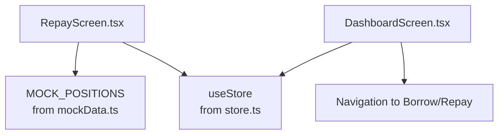
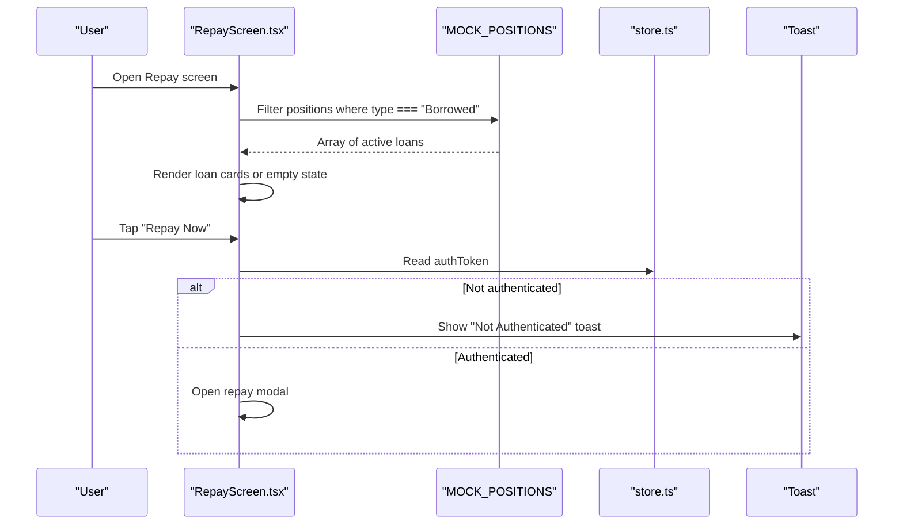
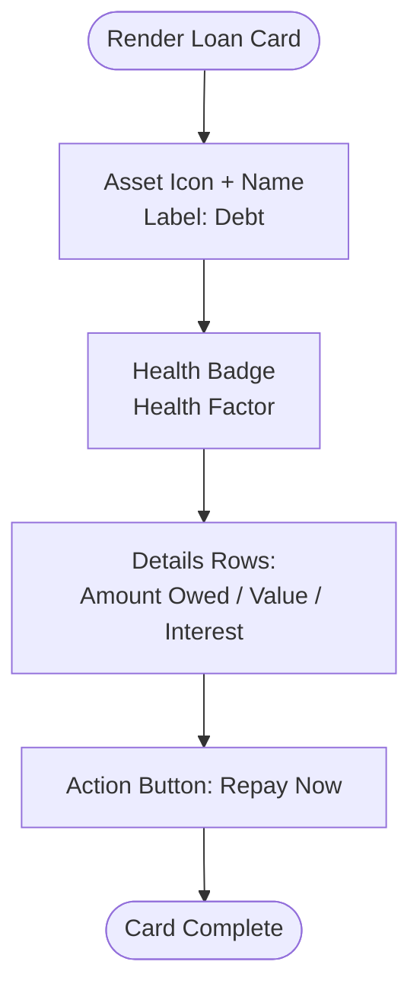
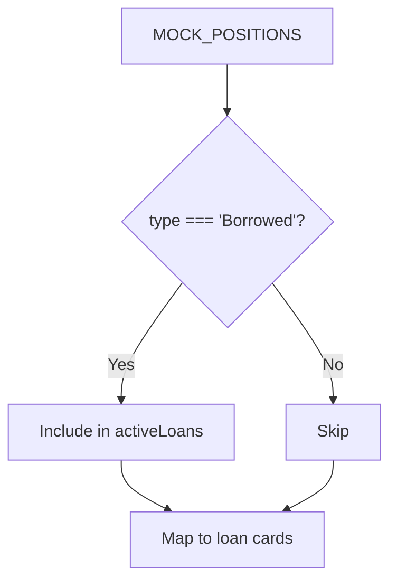
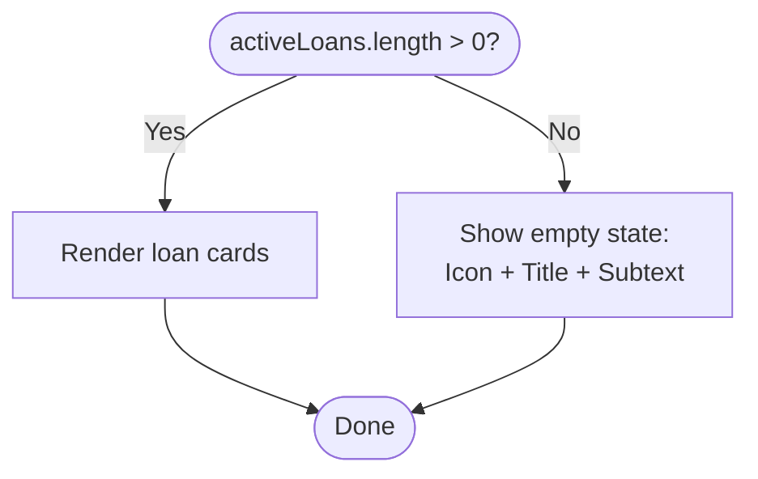
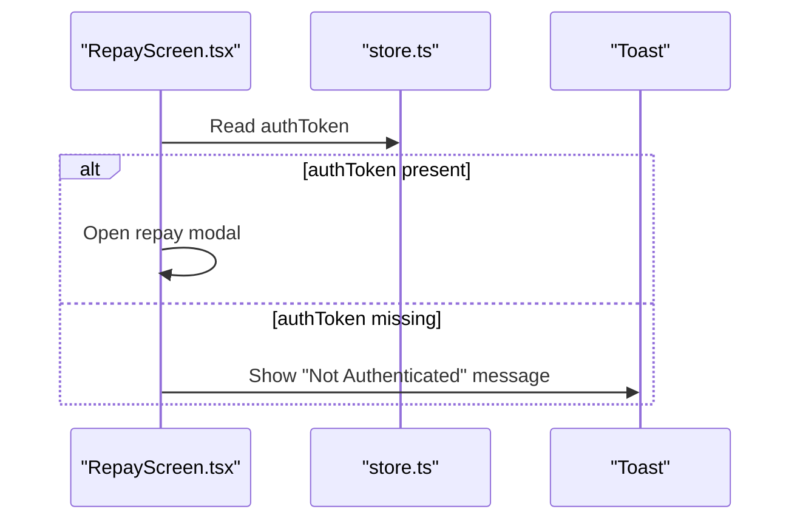
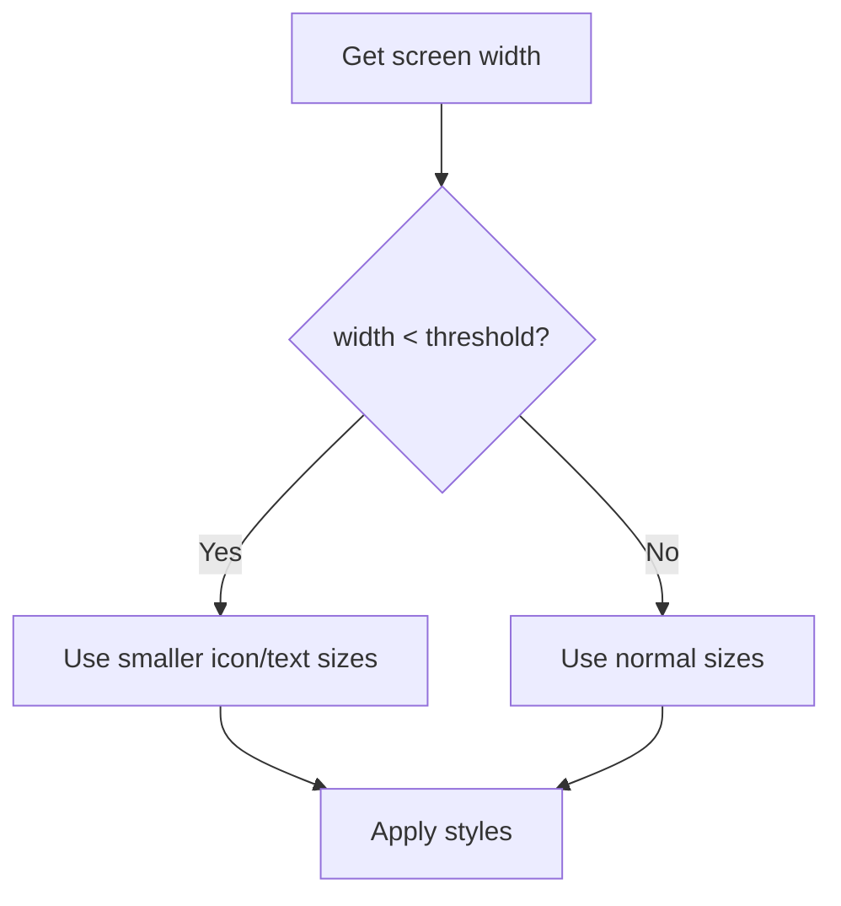
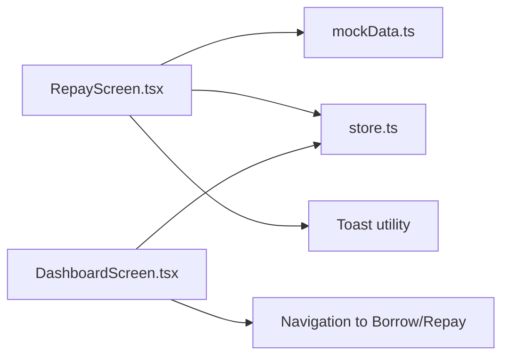

# Loan Overview Interface

<cite>
**Referenced Files in This Document**
- [mockData.ts](file://veilend-mobile/src/data/mockData.ts)
- [store.ts](file://veilend-mobile/src/store/store.ts)
- [RepayScreen.tsx](file://veilend-mobile/src/screens/RepayScreen.tsx)
- [DashboardScreen.tsx](file://veilend-mobile/src/screens/DashboardScreen.tsx)
</cite>

## Table of Contents
1. [Introduction](#introduction)
2. [Project Structure](#project-structure)
3. [Core Components](#core-components)
4. [Architecture Overview](#architecture-overview)
5. [Detailed Component Analysis](#detailed-component-analysis)
6. [Dependency Analysis](#dependency-analysis)
7. [Performance Considerations](#performance-considerations)
8. [Troubleshooting Guide](#troubleshooting-guide)
9. [Conclusion](#conclusion)

## Introduction
This document explains the loan overview interface that displays active borrowed positions. It covers the loan card layout (asset information, debt amounts, USD values, accrued interest, and health factors), how loans are filtered from MOCK_POSITIONS data, the visual hierarchy of loan details, empty state handling when no active loans exist, integration with the store for authentication checks, and responsive design patterns used across screen sizes.

## Project Structure
The loan overview is implemented within the mobile app screens and relies on mock data and a global store:
- Mock data defines assets and positions, including borrowed ones.
- The Repay screen renders the loan overview and handles user interactions.
- The store manages authentication state and portfolio data used by other screens.
- The dashboard demonstrates responsive patterns and navigation to loan-related flows.

**Diagram sources**
- [RepayScreen.tsx:1-140](file://veilend-mobile/src/screens/RepayScreen.tsx#L1-L140)
- [mockData.ts:72-92](file://veilend-mobile/src/data/mockData.ts#L72-L92)
- [store.ts:1-120](file://veilend-mobile/src/store/store.ts#L1-L120)
- [DashboardScreen.tsx:18-44](file://veilend-mobile/src/screens/DashboardScreen.tsx#L18-L44)

**Section sources**
- [RepayScreen.tsx:1-140](file://veilend-mobile/src/screens/RepayScreen.tsx#L1-L140)
- [mockData.ts:72-92](file://veilend-mobile/src/data/mockData.ts#L72-L92)
- [store.ts:1-120](file://veilend-mobile/src/store/store.ts#L1-L120)
- [DashboardScreen.tsx:18-44](file://veilend-mobile/src/screens/DashboardScreen.tsx#L18-L44)

## Core Components
- Loan Card: Displays asset icon/name, debt label, amount owed, USD value, accrued interest, and health factor badge. Includes a “Repay Now” action button.
- Active Loans List: Renders one card per borrowed position.
- Empty State: Shown when there are no active loans.
- Authentication Check: Ensures the user is authenticated before opening repayment actions.

Key responsibilities:
- Filter borrowed positions from MOCK_POSITIONS.
- Render loan cards with consistent visual hierarchy.
- Handle empty state gracefully.
- Gate actions behind authentication state from the store.

**Section sources**
- [RepayScreen.tsx:89-146](file://veilend-mobile/src/screens/RepayScreen.tsx#L89-L146)
- [mockData.ts:72-92](file://veilend-mobile/src/data/mockData.ts#L72-L92)
- [store.ts:101-149](file://veilend-mobile/src/store/store.ts#L101-L149)

## Architecture Overview
The loan overview flow connects UI components to mock data and store state:

**Diagram sources**
- [RepayScreen.tsx:19-146](file://veilend-mobile/src/screens/RepayScreen.tsx#L19-L146)
- [mockData.ts:72-92](file://veilend-mobile/src/data/mockData.ts#L72-L92)
- [store.ts:101-149](file://veilend-mobile/src/store/store.ts#L101-L149)

## Detailed Component Analysis

### Loan Card Layout and Visual Hierarchy
- Header row: Asset icon and name with a “Debt” label; Health badge showing the health factor.
- Details section: Amount Owed (quantity + asset), Value (USD formatted), Interest Accrued (USD).
- Action: Prominent “Repay Now” button at the bottom of the card.
- Styling: Dark theme with rounded cards, subtle borders, and clear typographic hierarchy.

**Diagram sources**
- [RepayScreen.tsx:92-137](file://veilend-mobile/src/screens/RepayScreen.tsx#L92-L137)

**Section sources**
- [RepayScreen.tsx:92-137](file://veilend-mobile/src/screens/RepayScreen.tsx#L92-L137)

### Filtering Loans from MOCK_POSITIONS
- The screen filters MOCK_POSITIONS to include only entries with type equal to “Borrowed”.
- Each resulting item provides fields used by the card: id, asset, amount, value, healthFactor.

**Diagram sources**
- [RepayScreen.tsx:19](file://veilend-mobile/src/screens/RepayScreen.tsx#L19)
- [mockData.ts:72-92](file://veilend-mobile/src/data/mockData.ts#L72-L92)

**Section sources**
- [RepayScreen.tsx:19](file://veilend-mobile/src/screens/RepayScreen.tsx#L19)
- [mockData.ts:72-92](file://veilend-mobile/src/data/mockData.ts#L72-L92)

### Empty State Handling
- When no active loans exist after filtering, the screen shows an empty state with an icon, title, and descriptive subtext.
- This ensures users understand why no content is displayed and avoids confusion.

**Diagram sources**
- [RepayScreen.tsx:89-146](file://veilend-mobile/src/screens/RepayScreen.tsx#L89-L146)

**Section sources**
- [RepayScreen.tsx:89-146](file://veilend-mobile/src/screens/RepayScreen.tsx#L89-L146)

### Store Integration and Authentication Checks
- The store maintains authentication state (address and authToken) and persists it securely.
- Before allowing repayment actions, the screen reads the current authToken from the store and validates presence.
- If missing, a toast informs the user to connect their wallet first.

**Diagram sources**
- [RepayScreen.tsx:123-132](file://veilend-mobile/src/screens/RepayScreen.tsx#L123-L132)
- [store.ts:101-149](file://veilend-mobile/src/store/store.ts#L101-L149)

**Section sources**
- [RepayScreen.tsx:123-132](file://veilend-mobile/src/screens/RepayScreen.tsx#L123-L132)
- [store.ts:101-149](file://veilend-mobile/src/store/store.ts#L101-L149)

### Responsive Design Patterns
- The dashboard demonstrates responsive techniques using device width detection and dynamic sizing for icons and typography.
- While the loan cards themselves use fixed dimensions and spacing, these patterns inform how to adapt layouts for smaller screens (e.g., adjusting icon sizes, padding, and font sizes).

**Diagram sources**
- [DashboardScreen.tsx:11-14](file://veilend-mobile/src/screens/DashboardScreen.tsx#L11-L14)
- [DashboardScreen.tsx:156-159](file://veilend-mobile/src/screens/DashboardScreen.tsx#L156-L159)

**Section sources**
- [DashboardScreen.tsx:11-14](file://veilend-mobile/src/screens/DashboardScreen.tsx#L11-L14)
- [DashboardScreen.tsx:156-159](file://veilend-mobile/src/screens/DashboardScreen.tsx#L156-L159)

## Dependency Analysis
- RepayScreen depends on:
  - MOCK_POSITIONS for loan data.
  - useStore for reading authentication state.
  - Toast for user feedback.
- DashboardScreen demonstrates navigation and responsive patterns but does not directly render loan cards.

**Diagram sources**
- [RepayScreen.tsx:1-146](file://veilend-mobile/src/screens/RepayScreen.tsx#L1-L146)
- [mockData.ts:72-92](file://veilend-mobile/src/data/mockData.ts#L72-L92)
- [store.ts:101-149](file://veilend-mobile/src/store/store.ts#L101-L149)
- [DashboardScreen.tsx:294-317](file://veilend-mobile/src/screens/DashboardScreen.tsx#L294-L317)

**Section sources**
- [RepayScreen.tsx:1-146](file://veilend-mobile/src/screens/RepayScreen.tsx#L1-L146)
- [mockData.ts:72-92](file://veilend-mobile/src/data/mockData.ts#L72-L92)
- [store.ts:101-149](file://veilend-mobile/src/store/store.ts#L101-L149)
- [DashboardScreen.tsx:294-317](file://veilend-mobile/src/screens/DashboardScreen.tsx#L294-L317)

## Performance Considerations
- Filtering MOCK_POSITIONS is O(n) and negligible for small datasets.
- Rendering lists uses key-based mapping; ensure stable keys (loan.id) to avoid unnecessary re-renders.
- Avoid heavy computations inside render loops; precompute derived values if needed.
- Use conditional rendering for empty states to minimize DOM overhead.

[No sources needed since this section provides general guidance]

## Troubleshooting Guide
- No loans shown: Verify that MOCK_POSITIONS contains items with type “Borrowed”. If none exist, the empty state will display.
- Repay button blocked: Ensure authToken exists in the store; otherwise, a toast indicates the need to connect the wallet.
- Incorrect values: Confirm that loan.value is numeric and formatted correctly for USD display.

**Section sources**
- [RepayScreen.tsx:89-146](file://veilend-mobile/src/screens/RepayScreen.tsx#L89-L146)
- [RepayScreen.tsx:123-132](file://veilend-mobile/src/screens/RepayScreen.tsx#L123-L132)
- [mockData.ts:72-92](file://veilend-mobile/src/data/mockData.ts#L72-L92)

## Conclusion
The loan overview interface presents borrowed positions through a clear, structured card layout, filters active loans from mock data, handles empty states gracefully, and integrates with the store to enforce authentication before actions. Responsive patterns demonstrated in the dashboard can be applied to refine the loan cards for varying screen sizes.

[No sources needed since this section summarizes without analyzing specific files]