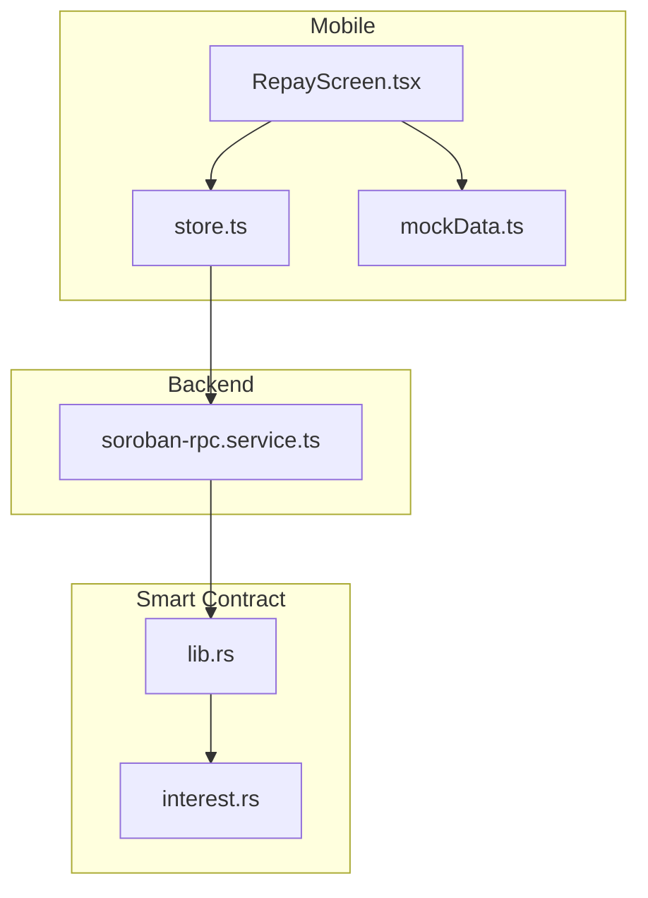
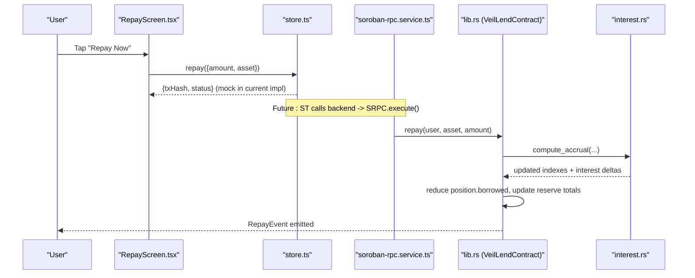
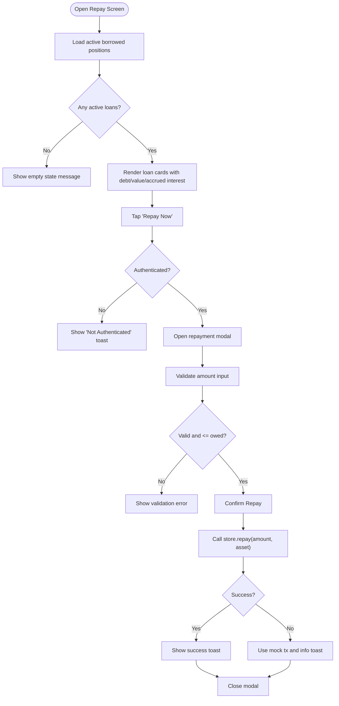
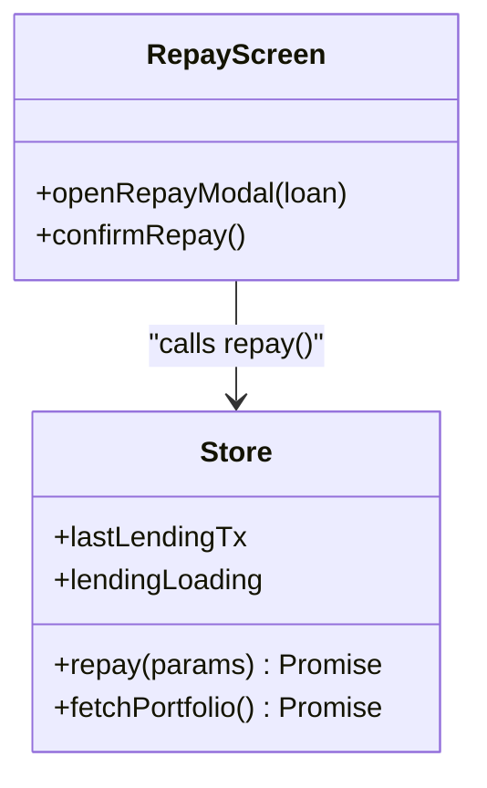
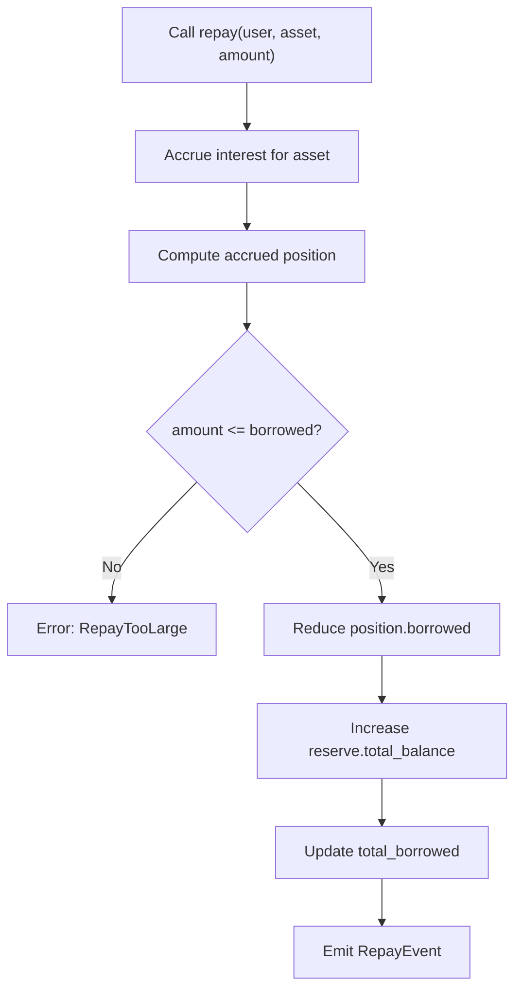
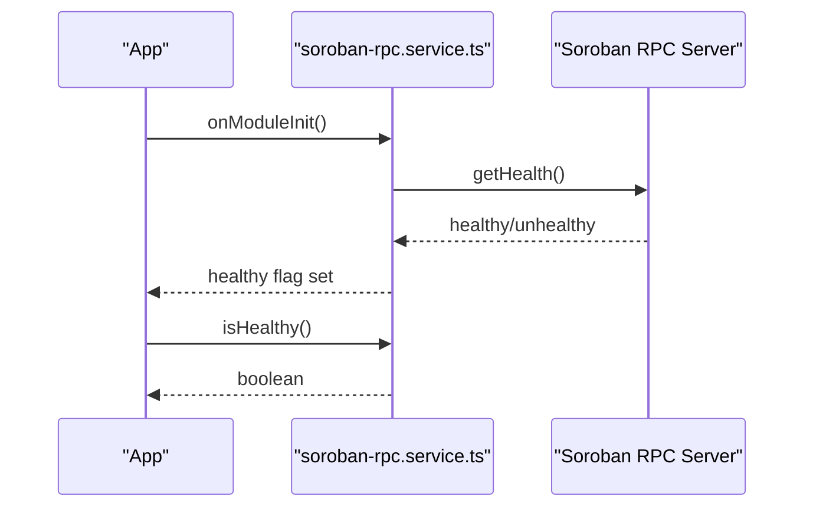
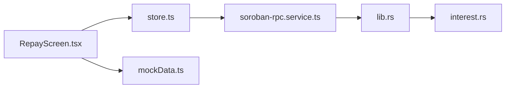

# Repay Screen

<cite>
**Referenced Files in This Document**
- [RepayScreen.tsx](file://veilend-mobile/src/screens/RepayScreen.tsx)
- [store.ts](file://veilend-mobile/src/store/store.ts)
- [mockData.ts](file://veilend-mobile/src/data/mockData.ts)
- [lib.rs](file://veilend-soroban/src/lib.rs)
- [interest.rs](file://veilend-soroban/src/interest.rs)
- [soroban-rpc.service.ts](file://veilend-backend/src/stellar/soroban-rpc.service.ts)
</cite>

## Table of Contents
1. [Introduction](#introduction)
2. [Project Structure](#project-structure)
3. [Core Components](#core-components)
4. [Architecture Overview](#architecture-overview)
5. [Detailed Component Analysis](#detailed-component-analysis)
6. [Dependency Analysis](#dependency-analysis)
7. [Performance Considerations](#performance-considerations)
8. [Troubleshooting Guide](#troubleshooting-guide)
9. [Conclusion](#conclusion)
10. [Appendices](#appendices)

## Introduction
This document explains the Repay screen that allows users to view and manage outstanding loans, perform partial or full repayments, and understand how interest accrues and debt reduces over time. It covers the user interface for active borrows, remaining balances, accrued interest display, repayment options, and the integration with smart contracts for executing repayments on Stellar/Soroban. It also documents error handling for insufficient funds and failed transactions, and provides guidance for optimal repayment strategies such as early repayment benefits and scheduling.

## Project Structure
The Repay feature spans three layers:
- Mobile UI (React Native): Displays active loans, validates inputs, and triggers repay actions.
- Backend services: Provide Soroban RPC connectivity and health checks.
- Smart contract (Soroban): Implements deposit/borrow/repay/withdraw logic, interest accrual, and state updates.

**Diagram sources**
- [RepayScreen.tsx:18-80](file://veilend-mobile/src/screens/RepayScreen.tsx#L18-L80)
- [store.ts:296-308](file://veilend-mobile/src/store/store.ts#L296-L308)
- [soroban-rpc.service.ts:17-80](file://veilend-backend/src/stellar/soroban-rpc.service.ts#L17-L80)
- [lib.rs:563-598](file://veilend-soroban/src/lib.rs#L563-L598)
- [interest.rs:51-87](file://veilend-soroban/src/interest.rs#L51-L87)

**Section sources**
- [RepayScreen.tsx:18-80](file://veilend-mobile/src/screens/RepayScreen.tsx#L18-L80)
- [store.ts:296-308](file://veilend-mobile/src/store/store.ts#L296-L308)
- [soroban-rpc.service.ts:17-80](file://veilend-backend/src/stellar/soroban-rpc.service.ts#L17-L80)
- [lib.rs:563-598](file://veilend-soroban/src/lib.rs#L563-L598)
- [interest.rs:51-87](file://veilend-soroban/src/interest.rs#L51-L87)

## Core Components
- RepayScreen: Renders active borrowed positions from mock data, shows debt amount, value, and accrued interest placeholder, and opens a modal to input repayment amounts. Validates input and calls store.repay.
- Store (Zustand): Provides lending methods including repay, which currently returns a mock transaction; it sets loading states and last transaction info.
- Mock Data: Supplies sample positions including an active USDC borrow used by the Repay screen.
- Soroban RPC Service: Initializes and validates connection to the Soroban RPC endpoint, exposing health status and client access.
- Smart Contract (lib.rs): Implements repay entrypoint that accrues interest, validates amount, reduces borrowed balance, updates reserves, and emits events.
- Interest Engine (interest.rs): Computes utilization-based rates and accrues indexes over time; realizes per-position accrued interest when touched.

**Section sources**
- [RepayScreen.tsx:18-80](file://veilend-mobile/src/screens/RepayScreen.tsx#L18-L80)
- [store.ts:296-308](file://veilend-mobile/src/store/store.ts#L296-L308)
- [mockData.ts:72-91](file://veilend-mobile/src/data/mockData.ts#L72-L91)
- [soroban-rpc.service.ts:17-80](file://veilend-backend/src/stellar/soroban-rpc.service.ts#L17-L80)
- [lib.rs:563-598](file://veilend-soroban/src/lib.rs#L563-L598)
- [interest.rs:51-87](file://veilend-soroban/src/interest.rs#L51-L87)

## Architecture Overview
The Repay flow connects the mobile UI to backend RPC and the Soroban smart contract. The UI validates user input and invokes the store’s repay method. In production, this would call backend endpoints that interact with the Soroban RPC service to execute the contract’s repay function. The contract accrues interest before reducing debt and emitting a Repay event.

**Diagram sources**
- [RepayScreen.tsx:68-80](file://veilend-mobile/src/screens/RepayScreen.tsx#L68-L80)
- [store.ts:296-308](file://veilend-mobile/src/store/store.ts#L296-L308)
- [soroban-rpc.service.ts:17-80](file://veilend-backend/src/stellar/soroban-rpc.service.ts#L17-L80)
- [lib.rs:563-598](file://veilend-soroban/src/lib.rs#L563-L598)
- [interest.rs:51-87](file://veilend-soroban/src/interest.rs#L51-L87)

## Detailed Component Analysis

### RepayScreen User Interface
- Active Loans Display: Filters borrowed positions from mock data and renders cards showing asset name, debt amount, value, and accrued interest placeholder. Shows a health factor badge per loan.
- Repayment Modal: Allows entering a numeric amount with validation (positive, not exceeding owed). Supports MAX to fill the entire owed amount.
- Submit Flow: Checks authentication token, then calls store.repay. On success, shows a toast and closes the modal. On error, falls back to offline mock behavior and stores a mock transaction.

**Diagram sources**
- [RepayScreen.tsx:18-80](file://veilend-mobile/src/screens/RepayScreen.tsx#L18-L80)
- [RepayScreen.tsx:84-201](file://veilend-mobile/src/screens/RepayScreen.tsx#L84-L201)

**Section sources**
- [RepayScreen.tsx:18-80](file://veilend-mobile/src/screens/RepayScreen.tsx#L18-L80)
- [RepayScreen.tsx:84-201](file://veilend-mobile/src/screens/RepayScreen.tsx#L84-L201)
- [mockData.ts:72-91](file://veilend-mobile/src/data/mockData.ts#L72-L91)

### Store Repayment Logic
- Lending State: Holds lastLendingTx and lendingLoading flags.
- repay Method: Currently returns a mock transaction object and updates lastLendingTx. It sets loading state during execution and handles errors by resetting loading and throwing.
- Portfolio Integration: While not directly invoked by RepayScreen, portfolio fetching can be used to refresh health factor and balances after successful repay.

**Diagram sources**
- [store.ts:63-70](file://veilend-mobile/src/store/store.ts#L63-L70)
- [store.ts:296-308](file://veilend-mobile/src/store/store.ts#L296-L308)
- [RepayScreen.tsx:68-80](file://veilend-mobile/src/screens/RepayScreen.tsx#L68-L80)

**Section sources**
- [store.ts:63-70](file://veilend-mobile/src/store/store.ts#L63-L70)
- [store.ts:296-308](file://veilend-mobile/src/store/store.ts#L296-L308)

### Smart Contract Repayment and Interest Accrual
- Repay Entrypoint: Validates supported asset and positive amount, accrues interest for the asset, computes accrued position, ensures repayment does not exceed outstanding borrowed, reduces borrowed balance, updates reserve total, updates total borrowed, and emits RepayEvent.
- Interest Engine: Computes utilization-based borrow and supply rates, advances indexes, and calculates interest deltas. Realizes per-position accrued interest when positions are touched.

**Diagram sources**
- [lib.rs:563-598](file://veilend-soroban/src/lib.rs#L563-L598)
- [interest.rs:51-87](file://veilend-soroban/src/interest.rs#L51-L87)

**Section sources**
- [lib.rs:563-598](file://veilend-soroban/src/lib.rs#L563-L598)
- [interest.rs:51-87](file://veilend-soroban/src/interest.rs#L51-L87)

### Backend Soroban RPC Connectivity
- Initialization: Creates an RPC server instance using configured URL and performs asynchronous health check.
- Health Monitoring: Exposes isHealthy and getLastError to track connection status and last error messages.
- Observable Wrapper: Provides RxJS observable for connection checks with safe error handling.

**Diagram sources**
- [soroban-rpc.service.ts:17-80](file://veilend-backend/src/stellar/soroban-rpc.service.ts#L17-L80)

**Section sources**
- [soroban-rpc.service.ts:17-80](file://veilend-backend/src/stellar/soroban-rpc.service.ts#L17-L80)

## Dependency Analysis
- RepayScreen depends on mock data for initial loan list and store for action execution.
- Store encapsulates lending operations and can be extended to call backend APIs.
- Backend Soroban RPC service abstracts network connectivity and health checks.
- Smart contract implements core business logic for repayments and interest accrual.

**Diagram sources**
- [RepayScreen.tsx:18-80](file://veilend-mobile/src/screens/RepayScreen.tsx#L18-L80)
- [store.ts:296-308](file://veilend-mobile/src/store/store.ts#L296-L308)
- [soroban-rpc.service.ts:17-80](file://veilend-backend/src/stellar/soroban-rpc.service.ts#L17-L80)
- [lib.rs:563-598](file://veilend-soroban/src/lib.rs#L563-L598)
- [interest.rs:51-87](file://veilend-soroban/src/interest.rs#L51-L87)

**Section sources**
- [RepayScreen.tsx:18-80](file://veilend-mobile/src/screens/RepayScreen.tsx#L18-L80)
- [store.ts:296-308](file://veilend-mobile/src/store/store.ts#L296-L308)
- [soroban-rpc.service.ts:17-80](file://veilend-backend/src/stellar/soroban-rpc.service.ts#L17-L80)
- [lib.rs:563-598](file://veilend-soroban/src/lib.rs#L563-L598)
- [interest.rs:51-87](file://veilend-soroban/src/interest.rs#L51-L87)

## Performance Considerations
- Interest Accrual Efficiency: The contract accrues interest at operation boundaries, avoiding unnecessary recomputation. Indexes advance based on elapsed time and utilization, ensuring accurate but efficient calculations.
- UI Responsiveness: Input sanitization and validation prevent invalid submissions and reduce unnecessary network calls.
- Connection Health: Backend RPC service maintains a healthy flag and logs errors to avoid repeated failed attempts.

[No sources needed since this section provides general guidance]

## Troubleshooting Guide
Common issues and resolutions:
- Insufficient Funds / Failed Transaction:
  - Frontend: If store.repay throws, the screen shows an info toast with mock details in offline mode. Ensure wallet authentication and sufficient balance before submitting.
  - Backend: Check Soroban RPC health via isHealthy and getLastError to diagnose connectivity issues.
  - Smart Contract: Errors like RepayTooLarge indicate attempting to repay more than owed; ensure amount <= outstanding borrowed.
- Not Authenticated:
  - RepayScreen checks for an auth token before opening the modal. Connect wallet and authenticate first.
- Network Unavailable:
  - Use backend health checks to inform users about protocol status and retry later.

**Section sources**
- [RepayScreen.tsx:68-80](file://veilend-mobile/src/screens/RepayScreen.tsx#L68-L80)
- [store.ts:296-308](file://veilend-mobile/src/store/store.ts#L296-L308)
- [soroban-rpc.service.ts:17-80](file://veilend-backend/src/stellar/soroban-rpc.service.ts#L17-L80)
- [lib.rs:563-598](file://veilend-soroban/src/lib.rs#L563-L598)

## Conclusion
The Repay screen provides a clear interface for managing outstanding loans, validating inputs, and initiating repayments. The smart contract enforces correct interest accrual and debt reduction, while the backend manages connectivity and health monitoring. Users benefit from transparent displays of debt, value, and accrued interest placeholders, with robust error handling for common scenarios. Integrating real-time portfolio updates post-repayment will further enhance user feedback on health factor improvements and balance changes.

[No sources needed since this section summarizes without analyzing specific files]

## Appendices

### Repayment Scheduling and Early Repayment Benefits
- Scheduling: Users can plan repayments aligned with cash flow cycles. Since interest accrues over time based on utilization, earlier repayments reduce total interest paid.
- Early Repayment Benefits: Reducing principal sooner lowers outstanding borrowed, decreasing future interest accrual and improving health factor faster.

[No sources needed since this section provides general guidance]

### Example Scenarios
- Partial Repayment: Repay half of the outstanding USDC to lower debt while maintaining liquidity.
- Full Repayment: Use MAX to repay the entire owed amount, eliminating debt and maximizing health factor improvement.

[No sources needed since this section provides general guidance]